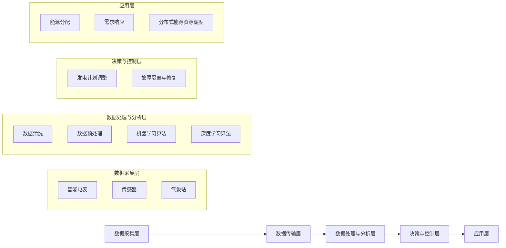

# AI在能源管理和智能电网中的优化应用

> 关键词：AI、能源管理、智能电网、优化应用、机器学习、深度学习、大数据

> 摘要：本文深入探讨了AI在能源管理和智能电网中的优化应用。首先介绍了相关背景，包括目的范围、预期读者等内容。接着阐述了核心概念与联系，剖析了AI与能源管理、智能电网之间的关系。详细讲解了核心算法原理及具体操作步骤，并给出了数学模型和公式。通过项目实战展示了代码实际案例及解读。分析了实际应用场景，推荐了相关工具和资源。最后总结了未来发展趋势与挑战，还设有附录解答常见问题，并提供扩展阅读和参考资料，旨在全面呈现AI在能源管理和智能电网领域的重要作用和应用潜力。

## 1. 背景介绍 
### 1.1 目的和范围
随着全球能源需求的不断增长以及对可持续能源发展的追求，能源管理和智能电网的优化变得至关重要。本文章的目的在于深入探讨AI在能源管理和智能电网中的具体应用方式，以及如何通过AI技术实现能源的高效利用、电网的稳定运行和成本的降低。范围涵盖了AI在能源预测、负荷管理、分布式能源资源整合、电网故障诊断等多个方面的应用。

### 1.2 预期读者
本文预期读者包括能源领域的专业人士，如能源工程师、电网运营管理人员等；对AI技术在能源领域应用感兴趣的科研人员；以及相关专业的学生，希望能为他们提供关于AI在能源管理和智能电网中应用的全面知识和技术指导。

### 1.3 文档结构概述
本文首先介绍背景信息，让读者了解文章的目的和适用人群。接着阐述核心概念与联系，帮助读者理解AI与能源管理、智能电网之间的内在关系。然后详细讲解核心算法原理和具体操作步骤，结合数学模型和公式进行深入分析。通过项目实战展示实际代码案例和解读，让读者更好地掌握应用方法。分析实际应用场景，使读者了解AI在实际中的应用情况。推荐相关工具和资源，方便读者进一步学习和实践。最后总结未来发展趋势与挑战，解答常见问题，并提供扩展阅读和参考资料。

### 1.4 术语表
#### 1.4.1 核心术语定义
- **AI（Artificial Intelligence）**：即人工智能，是指计算机系统能够执行通常需要人类智能才能完成的任务，如学习、推理、决策等。
- **能源管理**：是对能源的生产、分配、转换和使用进行计划、组织、控制和监督等一系列活动，以实现能源的高效利用和可持续发展。
- **智能电网**：是将现代信息技术、通信技术、控制技术与电力系统深度融合的新型电网，具有智能感知、自动控制、自适应等特点，能够提高电网的可靠性、安全性和效率。
- **机器学习（Machine Learning）**：是AI的一个分支，它让计算机通过数据和经验来自动学习模式和规律，从而进行预测和决策。
- **深度学习（Deep Learning）**：是机器学习的一种，通过构建多层神经网络来学习数据的复杂特征和模式。

#### 1.4.2 相关概念解释
- **分布式能源资源（Distributed Energy Resources，DER）**：是指分布在用户端的能源综合利用系统，如太阳能光伏发电、风力发电、小型水电等，具有分散性、间歇性等特点。
- **需求响应（Demand Response，DR）**：是指电力用户根据电力价格信号或激励机制，改变其固有的电力消费习惯，减少或增加用电负荷，以响应电力系统的需求。
- **负荷预测（Load Forecasting）**：是指根据历史负荷数据、气象数据等信息，对未来某一时刻或某一时间段的电力负荷进行预测。

#### 1.4.3 缩略词列表
- **AI**：Artificial Intelligence
- **DER**：Distributed Energy Resources
- **DR**：Demand Response
- **ML**：Machine Learning
- **DL**：Deep Learning

## 2. 核心概念与联系 

### 核心概念原理
AI在能源管理和智能电网中的应用基于其强大的数据分析和决策能力。机器学习和深度学习算法可以从大量的能源数据中挖掘出有价值的信息，例如通过对历史负荷数据的分析，预测未来的电力需求；通过对气象数据和分布式能源资源数据的融合，优化可再生能源的发电计划。

智能电网作为一个复杂的系统，需要实时监测和控制各个环节的运行状态。AI技术可以实现对电网数据的实时分析和处理，及时发现潜在的故障和异常情况，并采取相应的措施进行处理，从而提高电网的可靠性和稳定性。

能源管理的目标是实现能源的高效利用和可持续发展。AI可以通过优化能源分配、提高能源利用效率等方式，帮助实现这一目标。例如，通过智能算法对不同用户的用电行为进行分析，制定个性化的能源管理策略，鼓励用户合理用电。

### 架构的文本示意图
AI在能源管理和智能电网中的应用架构主要包括数据采集层、数据传输层、数据处理与分析层、决策与控制层和应用层。

- **数据采集层**：负责采集各种能源相关的数据，如电力负荷数据、气象数据、分布式能源资源数据等。这些数据来源广泛，包括智能电表、传感器、气象站等。
- **数据传输层**：将采集到的数据安全、可靠地传输到数据处理与分析层。可以采用有线或无线通信技术，如以太网、光纤、无线传感器网络等。
- **数据处理与分析层**：对采集到的数据进行清洗、预处理和分析。利用机器学习和深度学习算法挖掘数据中的潜在信息和规律，为决策与控制层提供支持。
- **决策与控制层**：根据数据处理与分析层的结果，制定相应的决策和控制策略。例如，根据负荷预测结果调整发电计划，根据电网故障诊断结果进行故障隔离和修复。
- **应用层**：将决策与控制层的策略应用到实际的能源管理和智能电网运行中。包括能源分配、需求响应、分布式能源资源调度等应用。

### Mermaid流程图


## 3. 核心算法原理 & 具体操作步骤 

### 核心算法原理
在AI应用于能源管理和智能电网中，常用的算法包括线性回归、支持向量机、神经网络等。这里以线性回归算法为例进行详细讲解。

线性回归是一种基本的机器学习算法，用于建立自变量和因变量之间的线性关系。在能源管理中，我们可以利用线性回归算法来预测电力负荷。假设我们有多个自变量 $x_1, x_2, \cdots, x_n$，如气象数据（温度、湿度等）、时间因素等，因变量为电力负荷 $y$，线性回归模型可以表示为：

$y = \theta_0 + \theta_1x_1 + \theta_2x_2 + \cdots + \theta_nx_n + \epsilon$

其中，$\theta_0, \theta_1, \cdots, \theta_n$ 是模型的参数，$\epsilon$ 是误差项。

我们的目标是找到一组最优的参数 $\theta$，使得预测值与实际值之间的误差最小。通常使用最小二乘法来求解参数 $\theta$，即最小化误差平方和：

$J(\theta) = \frac{1}{2m}\sum_{i = 1}^{m}(h_{\theta}(x^{(i)}) - y^{(i)})^2$

其中，$m$ 是样本数量，$h_{\theta}(x^{(i)})$ 是第 $i$ 个样本的预测值，$y^{(i)}$ 是第 $i$ 个样本的实际值。

### 具体操作步骤
1. **数据收集**：收集历史电力负荷数据、气象数据等相关信息。
2. **数据预处理**：对收集到的数据进行清洗、归一化等处理，以提高模型的性能。
3. **特征选择**：从收集到的所有特征中选择与电力负荷相关性较高的特征作为自变量。
4. **模型训练**：使用训练数据对线性回归模型进行训练，求解最优参数 $\theta$。
5. **模型评估**：使用测试数据对训练好的模型进行评估，计算模型的误差指标，如均方误差（MSE）、均方根误差（RMSE）等。
6. **模型应用**：将训练好的模型应用到实际的电力负荷预测中。

### Python源代码实现
```python
import numpy as np
from sklearn.linear_model import LinearRegression
from sklearn.model_selection import train_test_split
from sklearn.metrics import mean_squared_error

# 生成示例数据
np.random.seed(0)
X = np.random.rand(100, 3)  # 自变量
y = 2 * X[:, 0] + 3 * X[:, 1] - 1 * X[:, 2] + np.random.randn(100)  # 因变量

# 划分训练集和测试集
X_train, X_test, y_train, y_test = train_test_split(X, y, test_size=0.2, random_state=42)

# 创建线性回归模型
model = LinearRegression()

# 模型训练
model.fit(X_train, y_train)

# 模型预测
y_pred = model.predict(X_test)

# 模型评估
mse = mean_squared_error(y_test, y_pred)
rmse = np.sqrt(mse)

print(f"均方误差 (MSE): {mse}")
print(f"均方根误差 (RMSE): {rmse}")
```

## 4. 数学模型和公式 & 详细讲解 & 举例说明 

### 数学模型和公式
在能源管理和智能电网中，除了上述的线性回归模型，还有很多其他的数学模型和公式。例如，在分布式能源资源调度中，常用的目标函数是最小化总成本，同时满足各种约束条件。

设 $P_{i,t}$ 表示第 $i$ 个分布式能源资源在时刻 $t$ 的发电功率，$C_{i}(P_{i,t})$ 表示第 $i$ 个分布式能源资源在时刻 $t$ 的发电成本，$D_t$ 表示时刻 $t$ 的电力需求，则分布式能源资源调度的数学模型可以表示为：

$$\min \sum_{t = 1}^{T}\sum_{i = 1}^{N}C_{i}(P_{i,t})$$

约束条件包括：

- **功率平衡约束**：$\sum_{i = 1}^{N}P_{i,t} = D_t$，确保在每个时刻发电功率等于电力需求。
- **发电功率限制约束**：$P_{i}^{\min} \leq P_{i,t} \leq P_{i}^{\max}$，确保每个分布式能源资源的发电功率在允许的范围内。
- **爬坡率约束**：$|P_{i,t} - P_{i,t - 1}| \leq R_{i}$，限制分布式能源资源发电功率的变化率。

### 详细讲解
上述数学模型的目标是在满足各种约束条件的前提下，最小化分布式能源资源的发电总成本。功率平衡约束保证了电力系统的供需平衡，发电功率限制约束确保了分布式能源资源的安全运行，爬坡率约束则考虑了分布式能源资源的实际运行特性。

### 举例说明
假设我们有两个分布式能源资源，分别是太阳能光伏发电和风力发电。太阳能光伏发电的发电成本主要取决于设备的折旧和维护成本，风力发电的发电成本主要取决于设备的折旧、维护成本和风速等因素。电力需求在一天内是变化的，我们需要根据不同时刻的电力需求和分布式能源资源的发电特性，合理调度它们的发电功率，以最小化总成本。

设太阳能光伏发电的发电成本函数为 $C_1(P_{1,t}) = 0.5P_{1,t}^2 + 2P_{1,t}$，风力发电的发电成本函数为 $C_2(P_{2,t}) = 0.3P_{2,t}^2 + 3P_{2,t}$。电力需求 $D_t$ 在一天内的变化情况如下表所示：

| 时刻 $t$ | 电力需求 $D_t$ (kW) |
|---|---|
| 1 | 100 |
| 2 | 120 |
| 3 | 150 |
| 4 | 130 |

太阳能光伏发电的发电功率限制为 $0 \leq P_{1,t} \leq 80$ kW，风力发电的发电功率限制为 $0 \leq P_{2,t} \leq 100$ kW，爬坡率限制为 $|P_{i,t} - P_{i,t - 1}| \leq 20$ kW。

我们可以使用优化算法（如线性规划、二次规划等）来求解上述数学模型，得到每个时刻两个分布式能源资源的最优发电功率。

## 5. 项目实战：代码实际案例和详细解释说明 

### 5.1  开发环境搭建
- **操作系统**：可以选择Windows、Linux或macOS等常见操作系统。
- **Python环境**：安装Python 3.x版本，建议使用Anaconda来管理Python环境。
- **开发工具**：可以选择PyCharm、Jupyter Notebook等开发工具。
- **相关库**：安装NumPy、Pandas、Scikit-learn、TensorFlow等库，用于数据处理、机器学习和深度学习。

### 5.2  源代码详细实现和代码解读
下面我们以一个简单的电力负荷预测项目为例，展示代码的详细实现和解读。

```python
import numpy as np
import pandas as pd
from sklearn.model_selection import train_test_split
from sklearn.linear_model import LinearRegression
from sklearn.metrics import mean_squared_error
import matplotlib.pyplot as plt

# 数据加载
data = pd.read_csv('load_data.csv')

# 数据预处理
# 提取特征和目标变量
X = data[['temperature', 'humidity', 'day_of_week']].values
y = data['load'].values

# 划分训练集和测试集
X_train, X_test, y_train, y_test = train_test_split(X, y, test_size=0.2, random_state=42)

# 模型训练
model = LinearRegression()
model.fit(X_train, y_train)

# 模型预测
y_pred = model.predict(X_test)

# 模型评估
mse = mean_squared_error(y_test, y_pred)
rmse = np.sqrt(mse)
print(f"均方误差 (MSE): {mse}")
print(f"均方根误差 (RMSE): {rmse}")

# 可视化预测结果
plt.figure(figsize=(10, 6))
plt.plot(y_test, label='实际负荷')
plt.plot(y_pred, label='预测负荷')
plt.xlabel('样本序号')
plt.ylabel('电力负荷')
plt.title('电力负荷预测结果')
plt.legend()
plt.show()
```

### 代码解读与分析
1. **数据加载**：使用Pandas库的 `read_csv` 函数读取存储在 `load_data.csv` 文件中的电力负荷数据。
2. **数据预处理**：提取特征（温度、湿度、星期几）和目标变量（电力负荷），并将其转换为NumPy数组。
3. **划分训练集和测试集**：使用 `train_test_split` 函数将数据集划分为训练集和测试集，测试集占总数据集的20%。
4. **模型训练**：创建线性回归模型，并使用训练集数据对模型进行训练。
5. **模型预测**：使用训练好的模型对测试集数据进行预测。
6. **模型评估**：计算模型的均方误差（MSE）和均方根误差（RMSE），评估模型的性能。
7. **可视化预测结果**：使用Matplotlib库绘制实际负荷和预测负荷的折线图，直观展示预测结果。

## 6. 实际应用场景 
### 能源预测
AI可以利用历史能源数据、气象数据等信息，对未来的能源需求和供应进行预测。例如，通过对电力负荷的预测，电网运营人员可以提前安排发电计划，优化能源分配，减少能源浪费和成本。

### 负荷管理
AI可以分析用户的用电行为，制定个性化的负荷管理策略。例如，通过需求响应机制，鼓励用户在用电高峰期减少用电负荷，在用电低谷期增加用电负荷，从而实现电力系统的供需平衡。

### 分布式能源资源整合
随着分布式能源资源（如太阳能、风能等）的大规模接入，AI可以实现对分布式能源资源的优化调度和整合。例如，根据气象条件和电力需求，合理安排分布式能源资源的发电功率，提高可再生能源的利用率。

### 电网故障诊断
AI可以实时监测电网的运行状态，通过对电网数据的分析和处理，及时发现潜在的故障和异常情况。例如，利用机器学习算法对电网故障特征进行识别和分类，实现快速准确的故障诊断和定位。

### 电力市场交易
AI可以分析电力市场的价格走势和供需关系，为电力市场参与者提供决策支持。例如，通过预测电力价格，发电企业可以合理安排发电计划，电力用户可以选择最优的购电时机。

## 7. 工具和资源推荐
### 7.1 学习资源推荐
#### 7.1.1 书籍推荐
- 《Python机器学习》：全面介绍了Python在机器学习领域的应用，包括各种机器学习算法的原理和实现。
- 《深度学习》：由深度学习领域的三位顶尖专家所著，系统地介绍了深度学习的基本原理、算法和应用。
- 《智能电网：集成可再生能源的电力系统》：详细介绍了智能电网的概念、技术和应用，包括AI在智能电网中的应用案例。

#### 7.1.2 在线课程
- Coursera上的“机器学习”课程：由斯坦福大学的Andrew Ng教授授课，是机器学习领域的经典课程。
- edX上的“深度学习专业课程”：提供了深度学习的全面知识和实践经验。
- 中国大学MOOC上的“智能电网技术”课程：介绍了智能电网的基本概念、关键技术和发展趋势。

#### 7.1.3 技术博客和网站
- Medium：上面有很多关于AI、能源管理和智能电网的技术文章和案例分享。
- IEEE Xplore：提供了大量的电气和电子工程领域的学术论文和技术报告。
- 中国电力新闻网：关注电力行业的最新动态和技术发展。

### 7.2 开发工具框架推荐
#### 7.2.1 IDE和编辑器
- PyCharm：功能强大的Python集成开发环境，提供了代码编辑、调试、版本控制等功能。
- Jupyter Notebook：交互式的开发环境，适合进行数据分析和模型实验。
- Visual Studio Code：轻量级的代码编辑器，支持多种编程语言和插件扩展。

#### 7.2.2 调试和性能分析工具
- Py-Spy：用于分析Python代码的性能瓶颈和资源占用情况。
- TensorBoard：TensorFlow的可视化工具，用于监控模型的训练过程和性能指标。
- Scikit-learn的交叉验证工具：用于评估模型的性能和选择最优的模型参数。

#### 7.2.3 相关框架和库
- Scikit-learn：提供了丰富的机器学习算法和工具，如分类、回归、聚类等。
- TensorFlow：开源的深度学习框架，支持多种深度学习模型的开发和训练。
- PyTorch：另一个流行的深度学习框架，具有简洁的API和高效的计算性能。

### 7.3 相关论文著作推荐
#### 7.3.1 经典论文
- “A Survey on Artificial Intelligence for Smart Grid: Opportunities, Approaches, and Challenges”：全面综述了AI在智能电网中的应用机会、方法和挑战。
- “Machine Learning for Power Systems: A Review”：对机器学习在电力系统中的应用进行了详细的回顾和总结。
- “Deep Learning for Energy Management in Smart Grid: A Review”：重点介绍了深度学习在智能电网能源管理中的应用。

#### 7.3.2 最新研究成果
- 关注IEEE Transactions on Smart Grid、Applied Energy等学术期刊，获取AI在能源管理和智能电网领域的最新研究成果。
- 参加相关的国际学术会议，如IEEE Power & Energy Society General Meeting、International Conference on Smart Grid Communications等，了解最新的研究动态和趋势。

#### 7.3.3 应用案例分析
- 一些能源公司和科研机构会发布AI在能源管理和智能电网中的应用案例，如国家电网公司的智能电网示范项目、欧洲的一些可再生能源整合项目等。可以通过他们的官方网站或相关报告获取这些案例分析。

## 8. 总结：未来发展趋势与挑战
### 未来发展趋势
- **更深度的融合**：AI将与能源管理和智能电网的各个环节进行更深度的融合，实现全流程的智能化。例如，从能源的生产、传输、分配到使用的各个环节，都将通过AI技术进行优化和控制。
- **多学科交叉**：AI在能源管理和智能电网中的应用将涉及到更多的学科领域，如物理学、数学、控制理论等。多学科的交叉融合将为解决复杂的能源问题提供更有效的方法和手段。
- **强化学习的应用**：强化学习作为一种能够在动态环境中进行决策和优化的方法，将在能源管理和智能电网中得到更广泛的应用。例如，通过强化学习算法实现对分布式能源资源的自适应调度和控制。
- **边缘计算与AI的结合**：边缘计算可以将数据处理和分析靠近数据源进行，减少数据传输延迟和带宽需求。将边缘计算与AI相结合，可以实现能源管理和智能电网的实时决策和控制。

### 挑战
- **数据安全与隐私**：能源管理和智能电网涉及到大量的敏感数据，如用户的用电信息、电网的运行数据等。如何保障这些数据的安全和隐私是一个重要的挑战。
- **算法的可解释性**：一些复杂的AI算法（如深度学习）往往是黑盒模型，其决策过程难以解释。在能源管理和智能电网中，需要对算法的决策结果进行解释和验证，以确保其可靠性和安全性。
- **标准和规范的缺失**：目前，AI在能源管理和智能电网中的应用还缺乏统一的标准和规范。这给技术的推广和应用带来了一定的困难。
- **人才短缺**：AI在能源管理和智能电网中的应用需要既懂AI技术又懂能源领域知识的复合型人才。目前，这类人才相对短缺，制约了技术的发展和应用。

## 9. 附录：常见问题与解答
### 问题1：AI在能源管理和智能电网中的应用需要多少数据？
解答：AI算法通常需要大量的数据来进行训练和学习，以提高模型的准确性和泛化能力。具体需要的数据量取决于应用场景、算法类型和数据质量等因素。一般来说，数据量越大，模型的性能越好。

### 问题2：如何评估AI模型在能源管理和智能电网中的性能？
解答：可以使用多种指标来评估AI模型的性能，如均方误差（MSE）、均方根误差（RMSE）、平均绝对误差（MAE）、准确率、召回率等。根据具体的应用场景和目标，选择合适的评估指标。

### 问题3：AI在能源管理和智能电网中的应用会导致大量的就业岗位流失吗？
解答：虽然AI技术的应用可能会对一些传统的工作岗位产生影响，但同时也会创造出一些新的就业岗位，如AI算法工程师、数据分析师、智能电网运维工程师等。此外，AI技术的应用可以提高能源管理和智能电网的效率和可靠性，促进能源行业的发展，从而带动相关产业的就业。

### 问题4：如何保障AI在能源管理和智能电网中应用的数据安全？
解答：可以采取多种措施来保障数据安全，如数据加密、访问控制、身份认证、安全审计等。同时，建立完善的数据安全管理制度和应急预案，加强对数据安全的监督和管理。

## 10. 扩展阅读 & 参考资料
### 扩展阅读
- 《能源互联网：概念、技术与应用》：介绍了能源互联网的概念、技术和应用，为AI在能源领域的应用提供了更广阔的视野。
- 《人工智能时代的能源革命》：探讨了AI技术对能源行业的变革和影响，以及未来能源发展的趋势。

### 参考资料
- IEEE标准协会的相关标准文件，如IEEE 1547系列标准，涉及分布式能源资源与电网的互联。
- 国际能源署（IEA）的相关报告，提供了全球能源发展的趋势和数据。
- 相关的学术论文和研究报告，可以通过学术数据库（如IEEE Xplore、ACM Digital Library等）进行查找。