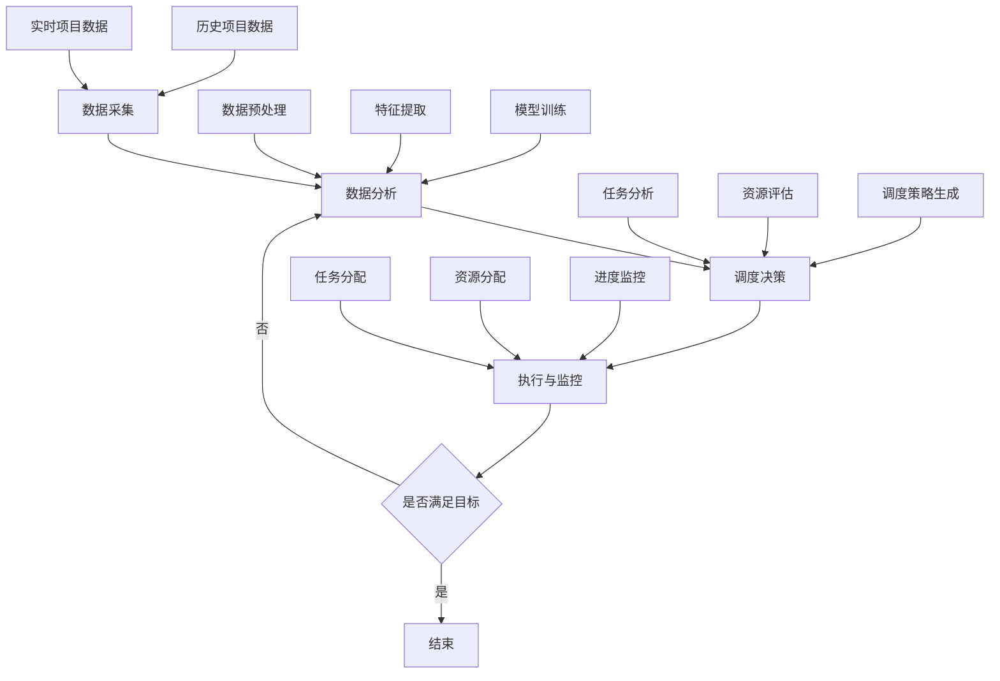

# AI在软件项目资源调度中的应用

> 关键词：AI、软件项目、资源调度、优化算法、智能决策

> 摘要：本文深入探讨了AI在软件项目资源调度中的应用。首先介绍了相关背景，包括目的、预期读者等内容。接着阐述了核心概念与联系，详细讲解了核心算法原理并给出Python代码示例。通过数学模型和公式进一步剖析其原理，并结合实际案例进行说明。项目实战部分展示了开发环境搭建、源代码实现及解读。同时介绍了AI在软件项目资源调度中的实际应用场景，推荐了相关工具和资源。最后总结了未来发展趋势与挑战，提供了常见问题解答及扩展阅读和参考资料，旨在为相关从业者提供全面且深入的技术参考，助力AI在软件项目资源调度领域的应用与发展。

## 1. 背景介绍 
### 1.1 目的和范围
软件项目资源调度是确保项目按时、按质量要求完成的关键环节。合理的资源调度能够提高资源利用率，降低成本，提升项目的整体效率。然而，传统的资源调度方法往往依赖于经验和简单的规则，难以应对日益复杂的软件项目需求。本文章的目的在于探讨AI技术如何应用于软件项目资源调度，以实现更智能、高效的资源分配和管理。范围涵盖了从AI相关核心概念的介绍，到具体算法原理、数学模型的分析，再到实际项目案例的展示，以及相关工具和资源的推荐等方面。

### 1.2 预期读者
本文预期读者包括软件项目管理人员、软件工程师、人工智能研究人员、对AI在软件领域应用感兴趣的技术爱好者等。对于软件项目管理人员，能够从中获取利用AI优化资源调度的方法和思路；软件工程师可以学习到相关的算法实现和技术细节；人工智能研究人员可以进一步探讨AI在该领域的理论和应用；技术爱好者则可以对AI在软件项目资源调度中的应用有一个全面的了解。

### 1.3 文档结构概述
本文首先介绍背景信息，让读者了解文章的目的、预期读者和整体结构。接着阐述核心概念与联系，帮助读者建立相关的知识体系。然后详细讲解核心算法原理和具体操作步骤，并给出Python代码示例。通过数学模型和公式进一步深入分析，结合实际案例进行说明。项目实战部分展示开发环境搭建、源代码实现和代码解读。之后介绍实际应用场景，推荐相关工具和资源。最后总结未来发展趋势与挑战，提供常见问题解答及扩展阅读和参考资料。

### 1.4 术语表
#### 1.4.1 核心术语定义
- **AI（Artificial Intelligence）**：即人工智能，是研究、开发用于模拟、延伸和扩展人的智能的理论、方法、技术及应用系统的一门新的技术科学。
- **软件项目资源调度**：指在软件项目的生命周期内，对人力、物力、财力等资源进行合理分配和安排，以满足项目的进度、质量和成本要求。
- **优化算法**：是一种用于寻找最优解或近似最优解的算法，在资源调度中用于找到最佳的资源分配方案。

#### 1.4.2 相关概念解释
- **机器学习**：是AI的一个重要分支，它使计算机能够通过数据学习模式和规律，而无需明确的编程指令。在资源调度中，机器学习算法可以根据历史项目数据预测资源需求和项目进度。
- **深度学习**：是机器学习的一个子集，基于人工神经网络，通过多层神经元对数据进行特征提取和模式识别。在软件项目资源调度中，深度学习可以处理复杂的非线性关系，提高资源调度的准确性。

#### 1.4.3 缩略词列表
- **AI**：Artificial Intelligence（人工智能）
- **ML**：Machine Learning（机器学习）
- **DL**：Deep Learning（深度学习）

## 2. 核心概念与联系 
### 核心概念原理
在软件项目资源调度中，核心概念主要包括项目任务、资源和调度策略。项目任务是软件项目的基本组成部分，每个任务都有其特定的需求和约束，如任务的持续时间、所需资源类型和数量等。资源则是完成项目任务的基础，包括人力资源（如开发人员、测试人员）、物力资源（如服务器、软件工具）等。调度策略则是根据项目任务和资源的特点，制定的资源分配和任务安排方案。

AI在软件项目资源调度中的应用，主要是通过智能算法对项目任务和资源进行建模和分析，以找到最优的调度策略。例如，机器学习算法可以根据历史项目数据学习任务和资源之间的关系，预测任务的执行时间和资源需求，从而实现更合理的资源分配。深度学习算法可以处理复杂的项目数据，如代码复杂度、任务依赖关系等，进一步提高资源调度的准确性。

### 架构的文本示意图
```plaintext
                            AI资源调度系统
                          ┌─────────────────────┐
                          │                     │
                          │  数据采集模块      │
                          │  ┌───────────────┐  │
                          │  │  历史项目数据 │  │
                          │  ├───────────────┤  │
                          │  │  实时项目数据 │  │
                          │  └───────────────┘  │
                          │                     │
                          │  数据分析模块      │
                          │  ┌───────────────┐  │
                          │  │  数据预处理   │  │
                          │  ├───────────────┤  │
                          │  │  特征提取     │  │
                          │  ├───────────────┤  │
                          │  │  模型训练     │  │
                          │  └───────────────┘  │
                          │                     │
                          │  调度决策模块      │
                          │  ┌───────────────┐  │
                          │  │  任务分析     │  │
                          │  ├───────────────┤  │
                          │  │  资源评估     │  │
                          │  ├───────────────┤  │
                          │  │  调度策略生成 │  │
                          │  └───────────────┘  │
                          │                     │
                          │  执行与监控模块    │
                          │  ┌───────────────┐  │
                          │  │  任务分配     │  │
                          │  ├───────────────┤  │
                          │  │  资源分配     │  │
                          │  ├───────────────┤  │
                          │  │  进度监控     │  │
                          │  └───────────────┘  │
                          │                     │
                          └─────────────────────┘
```

### Mermaid流程图


## 3. 核心算法原理 & 具体操作步骤 
### 核心算法原理 - 遗传算法
遗传算法是一种模拟自然选择和遗传机制的优化算法，它通过模拟生物进化过程中的选择、交叉和变异操作，在解空间中搜索最优解。在软件项目资源调度中，遗传算法可以用于寻找最优的资源分配方案。

### 具体操作步骤
1. **编码**：将资源分配方案编码为染色体。例如，对于一个有 $n$ 个任务和 $m$ 个资源的项目，每个染色体可以表示为一个长度为 $n$ 的向量，向量的每个元素表示对应任务分配的资源编号。
2. **初始化种群**：随机生成一定数量的染色体作为初始种群。
3. **适应度评估**：计算每个染色体的适应度值，适应度值反映了该资源分配方案的优劣。例如，可以根据项目的总工期、成本等指标来计算适应度值。
4. **选择操作**：根据适应度值选择一部分染色体作为父代，用于产生下一代染色体。
5. **交叉操作**：对选择的父代染色体进行交叉操作，产生新的子代染色体。
6. **变异操作**：对子代染色体进行变异操作，引入新的基因，增加种群的多样性。
7. **更新种群**：用子代染色体替换部分父代染色体，更新种群。
8. **终止条件判断**：判断是否满足终止条件，如达到最大迭代次数或适应度值不再提高等。如果满足终止条件，则输出最优染色体对应的资源分配方案；否则，返回步骤 3 继续迭代。

### Python源代码实现
```python
import random

# 任务数量
num_tasks = 5
# 资源数量
num_resources = 3
# 种群大小
population_size = 10
# 最大迭代次数
max_generations = 100
# 交叉概率
crossover_prob = 0.8
# 变异概率
mutation_prob = 0.2

# 初始化种群
def initialize_population():
    population = []
    for _ in range(population_size):
        chromosome = [random.randint(0, num_resources - 1) for _ in range(num_tasks)]
        population.append(chromosome)
    return population

# 适应度评估
def fitness_function(chromosome):
    # 简单示例：计算总工期
    total_duration = 0
    for task, resource in enumerate(chromosome):
        # 假设每个任务在不同资源上的执行时间不同
        task_durations = [3, 2, 4]  # 示例执行时间
        total_duration += task_durations[resource]
    return 1 / total_duration  # 适应度值越高越好

# 选择操作 - 轮盘赌选择
def selection(population):
    fitness_values = [fitness_function(chromosome) for chromosome in population]
    total_fitness = sum(fitness_values)
    probabilities = [fitness / total_fitness for fitness in fitness_values]
    selected_indices = []
    for _ in range(population_size):
        r = random.random()
        cumulative_prob = 0
        for i, prob in enumerate(probabilities):
            cumulative_prob += prob
            if r <= cumulative_prob:
                selected_indices.append(i)
                break
    selected_population = [population[i] for i in selected_indices]
    return selected_population

# 交叉操作 - 单点交叉
def crossover(parent1, parent2):
    if random.random() < crossover_prob:
        crossover_point = random.randint(1, num_tasks - 1)
        child1 = parent1[:crossover_point] + parent2[crossover_point:]
        child2 = parent2[:crossover_point] + parent1[crossover_point:]
        return child1, child2
    else:
        return parent1, parent2

# 变异操作
def mutation(chromosome):
    for i in range(num_tasks):
        if random.random() < mutation_prob:
            chromosome[i] = random.randint(0, num_resources - 1)
    return chromosome

# 遗传算法主函数
def genetic_algorithm():
    population = initialize_population()
    for generation in range(max_generations):
        selected_population = selection(population)
        new_population = []
        for i in range(0, population_size, 2):
            parent1 = selected_population[i]
            parent2 = selected_population[i + 1]
            child1, child2 = crossover(parent1, parent2)
            child1 = mutation(child1)
            child2 = mutation(child2)
            new_population.extend([child1, child2])
        population = new_population
    best_chromosome = max(population, key=fitness_function)
    return best_chromosome

# 运行遗传算法
best_schedule = genetic_algorithm()
print("最优资源分配方案:", best_schedule)
```

## 4. 数学模型和公式 & 详细讲解 & 举例说明 
### 数学模型
在软件项目资源调度中，可以将其建模为一个优化问题。设 $T = \{t_1, t_2, \cdots, t_n\}$ 为项目任务集合，$R = \{r_1, r_2, \cdots, r_m\}$ 为资源集合。$x_{ij}$ 为二进制变量，表示任务 $t_i$ 是否分配给资源 $r_j$，即：
$$
x_{ij} = 
\begin{cases}
1, & \text{如果任务 } t_i \text{ 分配给资源 } r_j \\
0, & \text{否则}
\end{cases}
$$

### 目标函数
目标函数可以根据项目的具体需求来定义，例如最小化项目总工期、最小化成本等。以最小化项目总工期为例，设 $d_{ij}$ 为任务 $t_i$ 在资源 $r_j$ 上的执行时间，则目标函数可以表示为：
$$
\min \sum_{i = 1}^{n} \sum_{j = 1}^{m} d_{ij} x_{ij}
$$

### 约束条件
1. **每个任务只能分配给一个资源**：
$$
\sum_{j = 1}^{m} x_{ij} = 1, \quad i = 1, 2, \cdots, n
$$
2. **资源的可用性约束**：设 $c_j$ 为资源 $r_j$ 的可用容量，$u_{ij}$ 为任务 $t_i$ 占用资源 $r_j$ 的容量，则有：
$$
\sum_{i = 1}^{n} u_{ij} x_{ij} \leq c_j, \quad j = 1, 2, \cdots, m
$$

### 举例说明
假设有 3 个任务 $T = \{t_1, t_2, t_3\}$ 和 2 个资源 $R = \{r_1, r_2\}$，任务在不同资源上的执行时间如下表所示：

| 任务 | 资源 $r_1$ 执行时间 | 资源 $r_2$ 执行时间 |
|------|---------------------|---------------------|
| $t_1$ | 3 | 2 |
| $t_2$ | 4 | 3 |
| $t_3$ | 2 | 5 |

资源的可用容量分别为 $c_1 = 10$ 和 $c_2 = 8$，任务占用资源的容量如下表所示：

| 任务 | 资源 $r_1$ 占用容量 | 资源 $r_2$ 占用容量 |
|------|---------------------|---------------------|
| $t_1$ | 3 | 2 |
| $t_2$ | 4 | 3 |
| $t_3$ | 2 | 5 |

根据上述数学模型和约束条件，我们可以列出目标函数和约束方程：
目标函数：
$$
\min (3x_{11} + 2x_{12} + 4x_{21} + 3x_{22} + 2x_{31} + 5x_{32})
$$
约束条件：
$$
\begin{cases}
x_{11} + x_{12} = 1 \\
x_{21} + x_{22} = 1 \\
x_{31} + x_{32} = 1 \\
3x_{11} + 4x_{21} + 2x_{31} \leq 10 \\
2x_{12} + 3x_{22} + 5x_{32} \leq 8 \\
x_{ij} \in \{0, 1\}, \quad i = 1, 2, 3; j = 1, 2
\end{cases}
$$

通过求解这个优化问题，我们可以得到最优的资源分配方案。

## 5. 项目实战：代码实际案例和详细解释说明 
### 5.1  开发环境搭建
#### 操作系统
可以选择 Windows、Linux 或 macOS 等主流操作系统。这里以 Ubuntu 20.04 为例进行说明。

#### 编程语言和环境
- **Python**：建议使用 Python 3.7 及以上版本。可以通过以下命令安装：
```bash
sudo apt update
sudo apt install python3 python3-pip
```
- **虚拟环境**：为了避免不同项目之间的依赖冲突，建议使用虚拟环境。可以使用 `venv` 模块创建虚拟环境：
```bash
python3 -m venv myenv
source myenv/bin/activate
```

#### 依赖库安装
在虚拟环境中安装所需的依赖库，例如 `numpy`、`pandas` 等：
```bash
pip install numpy pandas
```

### 5.2  源代码详细实现和代码解读
以下是一个更完整的软件项目资源调度的 Python 代码示例，使用遗传算法进行资源调度：

```python
import numpy as np
import random

# 任务数量
num_tasks = 5
# 资源数量
num_resources = 3
# 种群大小
population_size = 10
# 最大迭代次数
max_generations = 100
# 交叉概率
crossover_prob = 0.8
# 变异概率
mutation_prob = 0.2

# 任务在不同资源上的执行时间
task_durations = np.array([
    [3, 2, 4],
    [2, 3, 1],
    [4, 1, 3],
    [1, 4, 2],
    [3, 2, 4]
])

# 资源的可用容量
resource_capacities = np.array([10, 8, 12])

# 任务占用资源的容量
task_capacities = np.array([
    [2, 1, 3],
    [1, 2, 1],
    [3, 1, 2],
    [1, 3, 1],
    [2, 1, 3]
])

# 初始化种群
def initialize_population():
    population = []
    for _ in range(population_size):
        chromosome = [random.randint(0, num_resources - 1) for _ in range(num_tasks)]
        population.append(chromosome)
    return population

# 适应度评估
def fitness_function(chromosome):
    total_duration = 0
    resource_usage = np.zeros(num_resources)
    for task, resource in enumerate(chromosome):
        total_duration += task_durations[task][resource]
        resource_usage[resource] += task_capacities[task][resource]
    # 检查资源是否超出容量限制
    if np.any(resource_usage > resource_capacities):
        return 0  # 违反约束条件，适应度值为 0
    else:
        return 1 / total_duration  # 适应度值越高越好

# 选择操作 - 轮盘赌选择
def selection(population):
    fitness_values = [fitness_function(chromosome) for chromosome in population]
    total_fitness = sum(fitness_values)
    probabilities = [fitness / total_fitness for fitness in fitness_values]
    selected_indices = []
    for _ in range(population_size):
        r = random.random()
        cumulative_prob = 0
        for i, prob in enumerate(probabilities):
            cumulative_prob += prob
            if r <= cumulative_prob:
                selected_indices.append(i)
                break
    selected_population = [population[i] for i in selected_indices]
    return selected_population

# 交叉操作 - 单点交叉
def crossover(parent1, parent2):
    if random.random() < crossover_prob:
        crossover_point = random.randint(1, num_tasks - 1)
        child1 = parent1[:crossover_point] + parent2[crossover_point:]
        child2 = parent2[:crossover_point] + parent1[crossover_point:]
        return child1, child2
    else:
        return parent1, parent2

# 变异操作
def mutation(chromosome):
    for i in range(num_tasks):
        if random.random() < mutation_prob:
            chromosome[i] = random.randint(0, num_resources - 1)
    return chromosome

# 遗传算法主函数
def genetic_algorithm():
    population = initialize_population()
    for generation in range(max_generations):
        selected_population = selection(population)
        new_population = []
        for i in range(0, population_size, 2):
            parent1 = selected_population[i]
            parent2 = selected_population[i + 1]
            child1, child2 = crossover(parent1, parent2)
            child1 = mutation(child1)
            child2 = mutation(child2)
            new_population.extend([child1, child2])
        population = new_population
    best_chromosome = max(population, key=fitness_function)
    return best_chromosome

# 运行遗传算法
best_schedule = genetic_algorithm()
print("最优资源分配方案:", best_schedule)
```

### 5.3  代码解读与分析
- **初始化种群**：`initialize_population` 函数随机生成一定数量的染色体，每个染色体表示一个资源分配方案。
- **适应度评估**：`fitness_function` 函数计算每个染色体的适应度值，根据任务的总工期和资源的使用情况进行评估。如果资源使用超出容量限制，则适应度值为 0。
- **选择操作**：`selection` 函数使用轮盘赌选择方法，根据适应度值选择一部分染色体作为父代。
- **交叉操作**：`crossover` 函数对选择的父代染色体进行单点交叉，产生新的子代染色体。
- **变异操作**：`mutation` 函数对子代染色体进行变异操作，引入新的基因。
- **遗传算法主函数**：`genetic_algorithm` 函数实现了遗传算法的主要流程，通过多次迭代不断优化种群，最终得到最优的资源分配方案。

## 6. 实际应用场景 
### 软件开发项目
在软件开发项目中，AI 可以根据项目的需求和资源的情况，合理分配开发人员、测试人员和服务器等资源。例如，通过分析历史项目数据，预测每个任务的开发时间和所需资源，从而提前做好资源规划。同时，在项目执行过程中，实时监控项目进度和资源使用情况，根据实际情况动态调整资源分配，确保项目按时完成。

### 软件维护项目
对于软件维护项目，AI 可以帮助优化维护人员的分配。通过对软件系统的缺陷类型、严重程度和影响范围进行分析，预测维护任务的工作量和难度，然后将维护人员分配到最合适的任务上。此外，还可以根据维护人员的技能水平和工作负荷，合理安排工作，提高维护效率。

### 软件升级项目
在软件升级项目中，AI 可以协助进行资源调度。例如，根据升级的功能模块和技术要求，评估所需的开发资源和时间。同时，考虑到升级过程中可能对现有系统造成的影响，合理安排测试资源和时间，确保升级过程的顺利进行。

## 7. 工具和资源推荐
### 7.1 学习资源推荐
#### 7.1.1 书籍推荐
- 《人工智能：一种现代的方法》：这本书是人工智能领域的经典教材，全面介绍了人工智能的各个方面，包括搜索算法、机器学习、自然语言处理等。
- 《Python机器学习》：详细介绍了使用 Python 进行机器学习的方法和技术，包括各种机器学习算法的实现和应用。
- 《深度学习》：由深度学习领域的三位权威专家撰写，深入讲解了深度学习的理论和实践。

#### 7.1.2 在线课程
- Coursera 上的“机器学习”课程：由斯坦福大学的 Andrew Ng 教授讲授，是学习机器学习的经典课程。
- edX 上的“深度学习”课程：提供了深度学习的系统学习内容，包括理论和实践项目。
- 哔哩哔哩上的一些 AI 相关教程：有很多优秀的 UP 主分享 AI 学习的视频，内容丰富多样。

#### 7.1.3 技术博客和网站
- Medium：上面有很多 AI 领域的技术文章和最新研究成果。
- 机器之心：专注于人工智能领域的资讯和技术分享。
- 开源中国：提供了丰富的技术文章和开源项目资源。

### 7.2 开发工具框架推荐
#### 7.2.1 IDE和编辑器
- PyCharm：是一款专业的 Python 集成开发环境，提供了丰富的代码编辑、调试和版本控制等功能。
- Visual Studio Code：是一款轻量级的代码编辑器，支持多种编程语言，有丰富的插件扩展功能。

#### 7.2.2 调试和性能分析工具
- pdb：Python 自带的调试工具，可以帮助开发者调试代码。
- cProfile：Python 标准库中的性能分析工具，可以分析代码的运行时间和函数调用情况。

#### 7.2.3 相关框架和库
- TensorFlow：是一个开源的机器学习框架，广泛应用于深度学习领域。
- PyTorch：也是一个流行的深度学习框架，具有简洁易用的特点。
- Scikit-learn：是一个用于机器学习的 Python 库，提供了各种机器学习算法和工具。

### 7.3 相关论文著作推荐
#### 7.3.1 经典论文
- “A Logical Calculus of the Ideas Immanent in Nervous Activity”：由 Warren McCulloch 和 Walter Pitts 撰写，是神经网络领域的经典论文。
- “Learning Representations by Back-propagating Errors”：由 David Rumelhart、Geoffrey Hinton 和 Ronald Williams 撰写，介绍了反向传播算法。

#### 7.3.2 最新研究成果
- 在 arXiv 上搜索关于“AI in software project resource scheduling”的最新论文，可以了解到该领域的最新研究进展。

#### 7.3.3 应用案例分析
- IEEE Transactions on Software Engineering 等期刊上有很多关于软件项目管理和资源调度的应用案例分析，可以从中学习到实际应用中的经验和方法。

## 8. 总结：未来发展趋势与挑战
### 未来发展趋势
- **更智能的决策**：随着 AI 技术的不断发展，软件项目资源调度将实现更智能的决策。例如，结合强化学习算法，让系统能够在不断的实践中学习和优化资源调度策略，根据实时情况做出最优决策。
- **多目标优化**：未来的资源调度将不仅仅关注项目的工期和成本，还会考虑更多的目标，如资源的可持续性、团队成员的满意度等。通过多目标优化算法，实现更全面、更合理的资源分配。
- **与其他技术的融合**：AI 将与物联网、大数据、区块链等技术深度融合。例如，通过物联网设备实时采集项目数据，为资源调度提供更准确的信息；利用区块链技术确保数据的安全性和可信度。

### 挑战
- **数据质量和隐私问题**：AI 在资源调度中的应用依赖于大量的项目数据，数据的质量直接影响到调度的准确性。同时，项目数据往往包含敏感信息，如何确保数据的隐私和安全是一个重要的挑战。
- **算法的可解释性**：一些复杂的 AI 算法，如深度学习算法，往往被视为“黑盒”模型，其决策过程难以解释。在软件项目资源调度中，需要能够解释算法的决策依据，以便项目管理人员能够理解和信任调度结果。
- **人才短缺**：AI 在软件项目资源调度中的应用需要既懂 AI 技术又懂软件项目管理的复合型人才。目前，这类人才相对短缺，限制了该领域的发展。

## 9. 附录：常见问题与解答
### 1. AI 在软件项目资源调度中的应用是否适用于所有类型的软件项目？
AI 在软件项目资源调度中的应用适用于大多数类型的软件项目，但对于一些规模较小、需求简单的项目，传统的资源调度方法可能已经足够，使用 AI 技术可能会增加成本和复杂性。对于规模较大、需求复杂、不确定性较高的项目，AI 技术可以发挥更大的优势。

### 2. 如何评估 AI 算法在软件项目资源调度中的效果？
可以从多个方面评估 AI 算法在软件项目资源调度中的效果，如项目的总工期、成本、资源利用率、任务完成率等。可以通过对比使用 AI 算法前后的项目指标，以及与传统调度方法的对比，来评估其效果。

### 3. AI 算法在软件项目资源调度中会完全替代人工决策吗？
目前来看，AI 算法在软件项目资源调度中不会完全替代人工决策。虽然 AI 算法可以提供更智能、更优化的调度方案，但人工决策在一些情况下仍然是必要的。例如，在项目的战略规划、团队成员的人际关系管理等方面，人工决策具有不可替代的作用。AI 算法更多的是辅助人工决策，提高决策的效率和准确性。

## 10. 扩展阅读 & 参考资料
### 扩展阅读
- 《智能系统中的概率推理：似然网络》：深入介绍了概率推理在智能系统中的应用，对于理解 AI 算法的原理有很大帮助。
- 《复杂网络：结构与动力学》：探讨了复杂网络的结构和动力学特性，对于分析软件项目中的任务依赖关系和资源交互有一定的启示。

### 参考资料
- 相关的学术论文和研究报告，如 IEEE 、ACM 等组织发表的关于软件项目管理和 AI 应用的论文。
- 开源项目的文档和代码，如 TensorFlow、PyTorch 等框架的官方文档和示例代码。