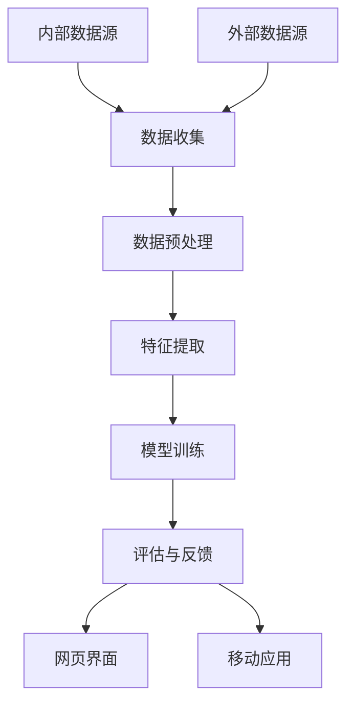

# AI增强型公司治理效能评估工具

> 关键词：AI、公司治理、效能评估、工具、人工智能技术

> 摘要：本文围绕AI增强型公司治理效能评估工具展开深入探讨。首先介绍该工具产生的背景，明确其目的、范围、预期读者等。接着阐述核心概念及联系，详细讲解核心算法原理与具体操作步骤，借助Python代码进行说明。呈现相关数学模型和公式并举例。通过项目实战展示开发环境搭建、源代码实现及解读。分析该工具的实际应用场景，推荐学习、开发相关的工具和资源，包括书籍、在线课程、技术博客、开发工具、框架和库以及相关论文著作等。最后总结未来发展趋势与挑战，附录常见问题与解答，并给出扩展阅读和参考资料，旨在全面且深入地为读者呈现AI增强型公司治理效能评估工具的全貌。

## 1. 背景介绍 
### 1.1 目的和范围
在当今数字化和全球化的时代，公司面临着日益复杂的内外部环境，公司治理的重要性愈发凸显。有效的公司治理能够提升公司的竞争力、保障股东利益、促进可持续发展。然而，传统的公司治理效能评估方法往往存在效率低下、主观性强、难以处理海量数据等问题。AI增强型公司治理效能评估工具的目的在于利用人工智能技术的优势，提高公司治理效能评估的准确性、客观性和效率。

其范围涵盖了公司治理的多个方面，包括但不限于董事会结构与运作、股东权益保护、风险管理、内部控制、信息披露等。该工具可以对不同规模、不同行业的公司进行治理效能评估，为公司管理层、投资者、监管机构等提供有价值的决策依据。

### 1.2 预期读者
- **公司管理层**：可以利用该工具评估公司的治理效能，发现潜在问题，制定改进策略，提升公司的整体运营水平。
- **投资者**：通过评估结果，投资者可以更好地了解公司的治理状况，判断投资风险和价值，做出更明智的投资决策。
- **监管机构**：有助于监管机构对公司的治理情况进行监督和管理，维护市场秩序和投资者权益。
- **学术研究人员**：为学术研究提供新的视角和数据来源，推动公司治理领域的学术发展。

### 1.3 文档结构概述
本文将按照以下结构展开：首先介绍AI增强型公司治理效能评估工具的背景信息，包括目的、范围、预期读者等。接着阐述该工具的核心概念与联系，通过文本示意图和Mermaid流程图进行说明。然后详细讲解核心算法原理和具体操作步骤，结合Python源代码进行阐述。呈现相关的数学模型和公式，并举例说明。通过项目实战展示该工具的开发环境搭建、源代码实现和代码解读。分析该工具的实际应用场景。推荐学习、开发相关的工具和资源。最后总结未来发展趋势与挑战，附录常见问题与解答，并给出扩展阅读和参考资料。

### 1.4 术语表
#### 1.4.1 核心术语定义
- **AI（Artificial Intelligence）**：人工智能，是指让计算机系统能够模拟人类智能的一系列技术和方法，包括机器学习、深度学习、自然语言处理等。
- **公司治理**：是指通过一套包括正式或非正式的、内部或外部的制度或机制来协调公司与所有利益相关者之间的利益关系，以保证公司决策的科学性和公正性，从而最终维护公司各方面的利益。
- **效能评估**：对公司治理的效率和效果进行评价和衡量，以确定公司治理的质量和水平。

#### 1.4.2 相关概念解释
- **机器学习**：是人工智能的一个重要分支，它通过让计算机系统从数据中自动学习模式和规律，从而实现对未知数据的预测和分类。
- **深度学习**：是一种基于人工神经网络的机器学习方法，它可以自动从大量数据中提取复杂的特征和模式，具有很强的学习能力和泛化能力。
- **自然语言处理**：是人工智能的一个领域，它研究如何让计算机理解、处理和生成人类语言，包括文本分类、情感分析、信息抽取等任务。

#### 1.4.3 缩略词列表
- **AI**：Artificial Intelligence（人工智能）
- **ML**：Machine Learning（机器学习）
- **DL**：Deep Learning（深度学习）
- **NLP**：Natural Language Processing（自然语言处理）

## 2. 核心概念与联系 

### 核心概念原理
AI增强型公司治理效能评估工具的核心原理是利用人工智能技术对公司治理相关的数据进行收集、处理、分析和挖掘，从而评估公司治理的效能。该工具主要涉及以下几个核心概念：

- **数据收集**：从多个数据源收集与公司治理相关的数据，包括公司年报、公告、财务报表、新闻报道、社交媒体等。这些数据可以反映公司的治理结构、决策过程、风险管理、信息披露等方面的情况。
- **数据预处理**：对收集到的数据进行清洗、转换、归一化等预处理操作，以提高数据的质量和可用性。例如，去除重复数据、处理缺失值、将文本数据转换为数值特征等。
- **特征提取**：从预处理后的数据中提取有代表性的特征，这些特征可以反映公司治理的关键方面。例如，董事会成员的背景信息、股东的持股比例、公司的财务指标等。
- **模型训练**：利用机器学习或深度学习算法对提取的特征进行训练，构建评估模型。评估模型可以根据输入的特征预测公司治理的效能得分或分类结果。
- **评估与反馈**：将待评估公司的特征输入到训练好的评估模型中，得到公司治理的效能评估结果。同时，根据评估结果提供反馈和建议，帮助公司改进治理水平。

### 架构的文本示意图
AI增强型公司治理效能评估工具的架构可以分为以下几个层次：

- **数据层**：负责收集和存储与公司治理相关的数据，包括内部数据源和外部数据源。内部数据源可以是公司的数据库、文件系统等，外部数据源可以是新闻网站、社交媒体平台、监管机构网站等。
- **处理层**：对数据层收集到的数据进行预处理和特征提取。预处理操作包括数据清洗、转换、归一化等，特征提取操作包括文本特征提取、数值特征提取等。
- **模型层**：利用机器学习或深度学习算法对处理层提取的特征进行训练，构建评估模型。评估模型可以是分类模型、回归模型、聚类模型等。
- **应用层**：将训练好的评估模型应用到实际的公司治理效能评估中，提供评估结果和反馈建议。应用层可以通过网页界面、移动应用等方式与用户进行交互。

### Mermaid流程图


## 3. 核心算法原理 & 具体操作步骤 

### 核心算法原理
AI增强型公司治理效能评估工具可以使用多种机器学习和深度学习算法，如逻辑回归、决策树、随机森林、支持向量机、神经网络等。这里以逻辑回归算法为例进行说明。

逻辑回归是一种广泛应用于分类问题的机器学习算法，它通过对输入特征进行线性组合，然后使用逻辑函数将线性组合的结果映射到0到1之间的概率值。逻辑回归的基本模型可以表示为：

$$P(y = 1|x) = \frac{1}{1 + e^{-z}}$$

其中，$P(y = 1|x)$ 表示在输入特征 $x$ 的条件下，样本属于正类（$y = 1$）的概率，$z$ 是输入特征的线性组合：

$$z = \theta_0 + \theta_1x_1 + \theta_2x_2 + \cdots + \theta_nx_n$$

$\theta_0, \theta_1, \cdots, \theta_n$ 是模型的参数，需要通过训练数据进行学习。

### 具体操作步骤
以下是使用Python实现逻辑回归算法进行公司治理效能评估的具体操作步骤：

#### 步骤1：导入必要的库
```python
import pandas as pd
from sklearn.model_selection import train_test_split
from sklearn.linear_model import LogisticRegression
from sklearn.metrics import accuracy_score
```

#### 步骤2：加载和预处理数据
```python
# 加载数据
data = pd.read_csv('company_governance_data.csv')

# 分离特征和标签
X = data.drop('governance_effectiveness', axis=1)
y = data['governance_effectiveness']

# 划分训练集和测试集
X_train, X_test, y_train, y_test = train_test_split(X, y, test_size=0.2, random_state=42)
```

#### 步骤3：训练模型
```python
# 创建逻辑回归模型
model = LogisticRegression()

# 训练模型
model.fit(X_train, y_train)
```

#### 步骤4：预测和评估
```python
# 预测测试集
y_pred = model.predict(X_test)

# 计算准确率
accuracy = accuracy_score(y_test, y_pred)
print(f"Accuracy: {accuracy}")
```

## 4. 数学模型和公式 & 详细讲解 & 举例说明 

### 逻辑回归的数学模型和公式
逻辑回归的目标是找到一组参数 $\theta_0, \theta_1, \cdots, \theta_n$，使得模型对训练数据的预测结果尽可能接近真实标签。为了实现这个目标，我们通常使用最大似然估计的方法来求解模型的参数。

假设训练数据中有 $m$ 个样本，每个样本的特征向量为 $x^{(i)} = (x_1^{(i)}, x_2^{(i)}, \cdots, x_n^{(i)})$，对应的真实标签为 $y^{(i)} \in \{0, 1\}$。那么，样本 $i$ 属于正类的概率可以表示为：

$$P(y^{(i)} = 1|x^{(i)}) = h_{\theta}(x^{(i)}) = \frac{1}{1 + e^{-z^{(i)}}}$$

其中，$z^{(i)} = \theta_0 + \theta_1x_1^{(i)} + \theta_2x_2^{(i)} + \cdots + \theta_nx_n^{(i)}$。

样本 $i$ 属于负类的概率可以表示为：

$$P(y^{(i)} = 0|x^{(i)}) = 1 - h_{\theta}(x^{(i)})$$

将上述两个概率合并，可以得到样本 $i$ 的似然函数：

$$L(\theta) = \prod_{i = 1}^{m} [h_{\theta}(x^{(i)})]^{y^{(i)}} [1 - h_{\theta}(x^{(i)})]^{1 - y^{(i)}}$$

为了方便计算，我们通常对似然函数取对数，得到对数似然函数：

$$\ell(\theta) = \log L(\theta) = \sum_{i = 1}^{m} [y^{(i)} \log h_{\theta}(x^{(i)}) + (1 - y^{(i)}) \log (1 - h_{\theta}(x^{(i)}))]$$

最大似然估计的目标是找到一组参数 $\theta$，使得对数似然函数 $\ell(\theta)$ 取得最大值。为了求解这个优化问题，我们可以使用梯度下降法等优化算法。

### 详细讲解
逻辑回归的核心思想是通过对输入特征进行线性组合，然后使用逻辑函数将线性组合的结果映射到0到1之间的概率值。这个概率值可以表示样本属于正类的概率。通过最大化对数似然函数，我们可以找到一组最优的参数 $\theta$，使得模型对训练数据的预测结果尽可能接近真实标签。

梯度下降法是一种常用的优化算法，它的基本思想是通过不断迭代更新参数 $\theta$，使得对数似然函数 $\ell(\theta)$ 不断增大。具体来说，梯度下降法的更新公式为：

$$\theta_j := \theta_j + \alpha \frac{\partial \ell(\theta)}{\partial \theta_j}$$

其中，$\alpha$ 是学习率，控制参数更新的步长。

### 举例说明
假设我们有一个简单的公司治理效能评估数据集，包含两个特征：董事会成员的平均年龄和公司的资产负债率。我们的目标是根据这两个特征预测公司的治理效能是否有效（0表示无效，1表示有效）。

以下是一个简单的Python代码示例：

```python
import numpy as np
from sklearn.linear_model import LogisticRegression

# 特征数据
X = np.array([[45, 0.6], [50, 0.4], [40, 0.8], [55, 0.3]])

# 标签数据
y = np.array([1, 1, 0, 1])

# 创建逻辑回归模型
model = LogisticRegression()

# 训练模型
model.fit(X, y)

# 预测新样本
new_sample = np.array([[48, 0.5]])
prediction = model.predict(new_sample)
print(f"Prediction: {prediction}")
```

在这个例子中，我们使用逻辑回归模型对新样本进行预测，得到的预测结果为1，表示公司的治理效能有效。

## 5. 项目实战：代码实际案例和详细解释说明 

### 5.1  开发环境搭建
为了实现AI增强型公司治理效能评估工具，我们需要搭建相应的开发环境。以下是具体的步骤：

#### 步骤1：安装Python
Python是一种广泛使用的编程语言，我们可以从Python官方网站（https://www.python.org/downloads/）下载并安装Python。建议安装Python 3.7及以上版本。

#### 步骤2：安装必要的库
我们需要安装一些必要的Python库，如pandas、numpy、scikit-learn、matplotlib等。可以使用pip命令进行安装：

```sh
pip install pandas numpy scikit-learn matplotlib
```

#### 步骤3：选择开发工具
可以选择使用PyCharm、Jupyter Notebook等开发工具进行代码编写和调试。

### 5.2  源代码详细实现和代码解读
以下是一个完整的Python代码示例，实现了一个简单的AI增强型公司治理效能评估工具：

```python
import pandas as pd
from sklearn.model_selection import train_test_split
from sklearn.linear_model import LogisticRegression
from sklearn.metrics import accuracy_score
import matplotlib.pyplot as plt

# 步骤1：加载和预处理数据
def load_and_preprocess_data(file_path):
    # 加载数据
    data = pd.read_csv(file_path)

    # 分离特征和标签
    X = data.drop('governance_effectiveness', axis=1)
    y = data['governance_effectiveness']

    # 划分训练集和测试集
    X_train, X_test, y_train, y_test = train_test_split(X, y, test_size=0.2, random_state=42)

    return X_train, X_test, y_train, y_test

# 步骤2：训练模型
def train_model(X_train, y_train):
    # 创建逻辑回归模型
    model = LogisticRegression()

    # 训练模型
    model.fit(X_train, y_train)

    return model

# 步骤3：预测和评估
def predict_and_evaluate(model, X_test, y_test):
    # 预测测试集
    y_pred = model.predict(X_test)

    # 计算准确率
    accuracy = accuracy_score(y_test, y_pred)
    print(f"Accuracy: {accuracy}")

    return y_pred

# 步骤4：可视化结果
def visualize_results(y_test, y_pred):
    plt.scatter(range(len(y_test)), y_test, color='blue', label='True Labels')
    plt.scatter(range(len(y_pred)), y_pred, color='red', label='Predicted Labels')
    plt.xlabel('Sample Index')
    plt.ylabel('Governance Effectiveness')
    plt.title('True vs Predicted Labels')
    plt.legend()
    plt.show()

# 主函数
def main():
    # 加载和预处理数据
    X_train, X_test, y_train, y_test = load_and_preprocess_data('company_governance_data.csv')

    # 训练模型
    model = train_model(X_train, y_train)

    # 预测和评估
    y_pred = predict_and_evaluate(model, X_test, y_test)

    # 可视化结果
    visualize_results(y_test, y_pred)

if __name__ == "__main__":
    main()
```

### 5.3  代码解读与分析
- **load_and_preprocess_data函数**：该函数负责加载和预处理数据。首先使用pandas库的read_csv函数加载数据文件，然后分离特征和标签，最后使用train_test_split函数将数据划分为训练集和测试集。
- **train_model函数**：该函数负责训练逻辑回归模型。首先创建一个LogisticRegression对象，然后使用fit方法对模型进行训练。
- **predict_and_evaluate函数**：该函数负责对测试集进行预测，并计算预测结果的准确率。使用predict方法对测试集进行预测，然后使用accuracy_score函数计算准确率。
- **visualize_results函数**：该函数负责可视化真实标签和预测标签。使用matplotlib库的scatter函数绘制散点图，将真实标签和预测标签分别用蓝色和红色表示。
- **main函数**：该函数是程序的入口点，依次调用上述四个函数，完成数据加载、模型训练、预测评估和结果可视化的任务。

## 6. 实际应用场景 
AI增强型公司治理效能评估工具在多个领域具有广泛的实际应用场景：

### 公司内部管理
- **自我评估**：公司管理层可以使用该工具定期对公司的治理效能进行自我评估，发现潜在问题，及时采取改进措施，提升公司的治理水平。
- **战略决策**：在制定公司战略时，参考治理效能评估结果，确保战略的可行性和有效性，提高公司的竞争力。
- **风险管理**：通过评估公司的治理效能，识别潜在的风险因素，制定相应的风险应对策略，降低公司的风险水平。

### 投资者决策
- **投资分析**：投资者可以使用该工具评估目标公司的治理效能，判断公司的投资价值和风险水平，做出更明智的投资决策。
- **投资组合管理**：在构建投资组合时，考虑公司的治理效能因素，优化投资组合的结构，提高投资组合的收益和风险控制能力。

### 监管机构监督
- **合规检查**：监管机构可以使用该工具对公司的治理情况进行合规检查，确保公司遵守相关法律法规和监管要求。
- **风险预警**：通过对公司治理效能的实时监测，及时发现潜在的风险隐患，发出风险预警，防范系统性风险。

### 学术研究
- **理论验证**：学术研究人员可以使用该工具收集和分析公司治理数据，验证相关的理论和假设，推动公司治理领域的学术发展。
- **案例分析**：通过对不同公司的治理效能进行评估和比较，开展案例分析，总结经验教训，为公司治理实践提供参考。

## 7. 工具和资源推荐
### 7.1 学习资源推荐
#### 7.1.1 书籍推荐
- 《Python机器学习》：这本书详细介绍了Python在机器学习领域的应用，包括数据预处理、模型训练、评估和优化等方面的内容。
- 《深度学习》：由深度学习领域的三位先驱Ian Goodfellow、Yoshua Bengio和Aaron Courville撰写，是深度学习领域的经典教材。
- 《公司治理》：全面介绍了公司治理的基本概念、理论和实践，对于理解公司治理的本质和重要性具有重要意义。

#### 7.1.2 在线课程
- Coursera上的“机器学习”课程：由斯坦福大学的Andrew Ng教授讲授，是机器学习领域的经典在线课程。
- edX上的“深度学习基础”课程：由微软和华盛顿大学联合推出，介绍了深度学习的基本概念和方法。
- 中国大学MOOC上的“公司治理”课程：由国内知名高校的教授讲授，系统介绍了公司治理的理论和实践。

#### 7.1.3 技术博客和网站
- Medium：一个汇集了众多技术专家和学者的博客平台，有很多关于人工智能和公司治理的优质文章。
- arXiv：一个预印本数据库，提供了大量的学术论文，包括人工智能和公司治理领域的最新研究成果。
- 中国知网：国内最大的学术文献数据库，提供了丰富的公司治理相关的学术论文和研究报告。

### 7.2 开发工具框架推荐
#### 7.2.1 IDE和编辑器
- PyCharm：一款专门为Python开发设计的集成开发环境，具有强大的代码编辑、调试和自动完成功能。
- Jupyter Notebook：一个交互式的开发环境，适合进行数据探索、模型训练和结果可视化等任务。
- Visual Studio Code：一款轻量级的代码编辑器，支持多种编程语言和插件，具有丰富的功能和扩展能力。

#### 7.2.2 调试和性能分析工具
- PySnooper：一个简单易用的Python调试工具，可以自动记录函数的执行过程和变量的值，方便调试和排查问题。
- cProfile：Python内置的性能分析工具，可以统计函数的调用次数、执行时间等信息，帮助优化代码性能。
- TensorBoard：一个深度学习可视化工具，可以可视化模型的训练过程、损失函数曲线、准确率曲线等信息，方便模型的调优和评估。

#### 7.2.3 相关框架和库
- scikit-learn：一个简单易用的机器学习库，提供了丰富的机器学习算法和工具，包括分类、回归、聚类等任务。
- TensorFlow：一个开源的深度学习框架，由Google开发，具有高效、灵活、可扩展等特点，广泛应用于图像识别、自然语言处理等领域。
- PyTorch：一个开源的深度学习框架，由Facebook开发，具有动态图、易于调试等优点，受到了很多研究人员和开发者的喜爱。

### 7.3 相关论文著作推荐
#### 7.3.1 经典论文
- Jensen, M. C., & Meckling, W. H. (1976). Theory of the firm: managerial behavior, agency costs and ownership structure. Journal of financial economics, 3(4), 305-360.
- Fama, E. F., & Jensen, M. C. (1983). Separation of ownership and control. Journal of law and economics, 26(2), 301-325.
- Shleifer, A., & Vishny, R. W. (1997). A survey of corporate governance. The journal of finance, 52(2), 737-783.

#### 7.3.2 最新研究成果
- Acemoglu, D., & Robinson, J. A. (2019). The new comparative economics. Journal of Institutional Economics, 15(01), 1-32.
- Bebchuk, L. A., & Hamdani, A. (2019). Corporate governance and industrial organization. Review of Financial Studies, 32(11), 4373-4420.
- Gompers, P. A., Ishii, J. L., & Metrick, A. (2019). Extreme governance: an analysis of dual-class firms in the united states. The Review of Financial Studies, 32(11), 4421-4467.

#### 7.3.3 应用案例分析
- Bhagat, S., & Bolton, B. (2019). Corporate governance and firm performance. Journal of Corporate Finance, 57, 231-267.
- Core, J. E., Guay, W. R., & Rusticus, T. O. (2006). Does weak governance cause weak stock returns? An examination of firm operating performance and investors' expectations. Journal of Financial Economics, 81(2), 650-682.
- Larcker, D. F., Richardson, S. A., & Tuna, I. (2007). Corporate governance, accounting outcomes, and organizational performance. Journal of Accounting and Economics, 43(3), 349-376.

## 8. 总结：未来发展趋势与挑战
### 未来发展趋势
- **智能化程度不断提高**：随着人工智能技术的不断发展，AI增强型公司治理效能评估工具将更加智能化，能够自动识别和分析复杂的公司治理问题，提供更加精准的评估结果和建议。
- **多源数据融合**：未来的评估工具将整合更多来源的数据，包括社交媒体数据、物联网数据等，以更全面地反映公司的治理情况，提高评估的准确性和可靠性。
- **与区块链技术结合**：区块链技术具有去中心化、不可篡改、可追溯等特点，将其与AI增强型公司治理效能评估工具结合，可以提高数据的安全性和可信度，增强评估结果的公信力。
- **个性化定制**：根据不同用户的需求和偏好，提供个性化的评估报告和建议，满足不同用户的决策需求。

### 挑战
- **数据质量和隐私问题**：数据质量是影响评估结果准确性的关键因素，而数据隐私问题则是数据收集和使用过程中需要重点关注的问题。如何保证数据的质量和隐私，是AI增强型公司治理效能评估工具面临的重要挑战。
- **算法解释性和可解释性**：人工智能算法，尤其是深度学习算法，往往具有较高的复杂性和黑盒性，其决策过程难以理解和解释。如何提高算法的解释性和可解释性，是提高评估结果可信度和接受度的关键。
- **技术更新换代快**：人工智能技术发展迅速，新的算法和模型不断涌现。如何及时跟进技术发展，不断优化和升级评估工具，是保持工具竞争力的关键。
- **法律和监管问题**：AI增强型公司治理效能评估工具的应用涉及到众多法律和监管问题，如数据保护法、隐私法、反垄断法等。如何遵守相关法律法规，确保工具的合法合规使用，是需要解决的重要问题。

## 9. 附录：常见问题与解答
### 问题1：AI增强型公司治理效能评估工具的评估结果准确吗？
答：评估结果的准确性受到多种因素的影响，如数据质量、算法选择、模型训练等。为了提高评估结果的准确性，需要保证数据的质量，选择合适的算法和模型，并进行充分的模型训练和优化。同时，评估结果也需要结合实际情况进行综合分析和判断。

### 问题2：该工具适用于所有类型的公司吗？
答：该工具可以适用于不同规模、不同行业的公司。但不同公司的治理结构和特点可能存在差异，在使用该工具时，需要根据公司的实际情况进行适当的调整和优化，以确保评估结果的准确性和适用性。

### 问题3：如何保证数据的安全性和隐私性？
答：在数据收集和使用过程中，需要采取一系列措施来保证数据的安全性和隐私性。例如，对数据进行加密处理，限制数据的访问权限，遵守相关的数据保护法律法规等。同时，也可以使用匿名化、脱敏等技术对数据进行处理，保护用户的隐私。

### 问题4：该工具需要专业的技术人员来使用吗？
答：该工具的使用可以分为不同的层次。对于简单的使用，如查看评估报告和建议，非专业技术人员也可以操作。但对于更深入的使用，如数据预处理、模型训练和优化等，可能需要一定的专业技术知识和技能。可以通过提供用户手册、培训课程等方式，帮助用户更好地使用该工具。

## 10. 扩展阅读 & 参考资料
### 扩展阅读
- 《人工智能时代的公司治理变革》
- 《大数据与公司治理效能提升》
- 《区块链技术在公司治理中的应用》

### 参考资料
- 相关的学术论文和研究报告
- 人工智能和公司治理领域的专业书籍
- 相关的技术博客和网站
- 工具和框架的官方文档和教程