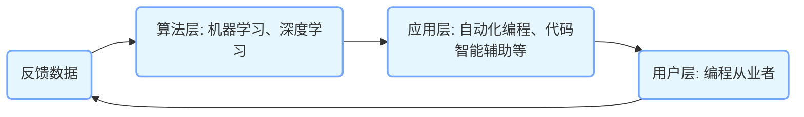

# AI技术推动下的编程职业革命性发展趋势研究

> 关键词：AI技术、编程职业、革命性发展、自动化编程、人机协作

> 摘要：本文深入探讨了AI技术推动下编程职业的革命性发展趋势。随着AI技术的迅猛发展，编程领域正经历着前所未有的变革。文章从背景介绍出发，阐述了研究的目的、范围、预期读者等内容。接着详细剖析了核心概念与联系，包括AI技术与编程职业的相互作用原理及架构。通过Python源代码阐述核心算法原理和具体操作步骤，运用数学模型和公式进行详细讲解与举例说明。结合项目实战，展示代码实际案例并进行详细解释。分析了AI技术在编程领域的实际应用场景，推荐了相关的学习资源、开发工具框架以及论文著作。最后总结了未来发展趋势与挑战，解答常见问题并提供扩展阅读与参考资料，旨在为编程从业者、研究者等提供全面且深入的参考，以应对编程职业的变革。

## 1. 背景介绍 
### 1.1 目的和范围
本研究的主要目的是全面、深入地探究AI技术对编程职业带来的革命性发展趋势。随着AI技术在各个领域的广泛应用，编程领域也受到了巨大的冲击和变革。我们旨在通过对AI技术与编程职业的结合进行研究，揭示其中的规律和趋势，为编程从业者、相关企业以及教育机构提供有价值的参考，帮助他们更好地适应和利用这一变革。

研究范围涵盖了AI技术在编程中的各个方面，包括但不限于自动化编程、代码智能辅助、编程教育变革、编程职业结构调整等。同时，我们也关注全球范围内编程职业受AI技术影响的现状和未来发展方向。

### 1.2 预期读者
本文的预期读者主要包括以下几类人群：
1. **编程从业者**：包括软件开发者、程序员、代码工程师等，他们可以通过本文了解AI技术对编程工作的影响，学习如何利用AI技术提升自己的编程效率和技能水平。
2. **编程教育工作者**：如大学计算机专业教师、培训机构讲师等，他们可以从中获取关于编程教育改革的思路和方法，以培养适应未来编程职业需求的人才。
3. **企业管理者**：包括软件公司的CEO、CTO等，他们可以根据本文的研究结果制定企业的发展战略，合理调整编程团队的结构和人员配置。
4. **研究人员**：从事计算机科学、人工智能等领域研究的学者和科研人员，他们可以在本文的基础上开展更深入的研究。

### 1.3 文档结构概述
本文共分为十个部分，具体结构如下：
1. **背景介绍**：阐述研究的目的、范围、预期读者、文档结构概述以及相关术语表。
2. **核心概念与联系**：介绍AI技术与编程职业相关的核心概念，分析它们之间的联系，并通过文本示意图和Mermaid流程图进行展示。
3. **核心算法原理 & 具体操作步骤**：运用Python源代码详细阐述AI技术在编程中的核心算法原理和具体操作步骤。
4. **数学模型和公式 & 详细讲解 & 举例说明**：通过数学模型和公式对AI技术在编程中的应用进行详细讲解，并举例说明。
5. **项目实战：代码实际案例和详细解释说明**：介绍开发环境搭建，展示代码实际案例并进行详细的代码解读与分析。
6. **实际应用场景**：分析AI技术在编程领域的实际应用场景。
7. **工具和资源推荐**：推荐相关的学习资源、开发工具框架以及论文著作。
8. **总结：未来发展趋势与挑战**：总结AI技术推动下编程职业的未来发展趋势，并分析面临的挑战。
9. **附录：常见问题与解答**：解答读者在阅读过程中可能遇到的常见问题。
10. **扩展阅读 & 参考资料**：提供相关的扩展阅读内容和参考资料，方便读者进一步深入研究。

### 1.4 术语表
#### 1.4.1 核心术语定义
1. **AI技术（Artificial Intelligence Technology）**：即人工智能技术，是一门研究如何使计算机能够模拟人类智能的学科和技术领域，包括机器学习、深度学习、自然语言处理等多个方面。
2. **编程职业（Programming Profession）**：指与编写、开发、维护计算机程序相关的职业，包括软件开发者、程序员、代码工程师等不同角色。
3. **自动化编程（Automated Programming）**：利用AI技术自动生成代码的过程，减少人工编写代码的工作量。
4. **人机协作（Human - Machine Collaboration）**：指人类程序员与AI系统相互配合、协同工作，充分发挥各自的优势，提高编程效率和质量。

#### 1.4.2 相关概念解释
1. **机器学习（Machine Learning）**：是AI技术的一个重要分支，它通过让计算机从数据中学习模式和规律，从而实现对未知数据的预测和决策。在编程中，机器学习可以用于代码智能辅助、漏洞检测等方面。
2. **深度学习（Deep Learning）**：是机器学习的一种特殊形式，它使用深度神经网络来处理复杂的数据，如图像、语音等。在编程领域，深度学习可以用于自然语言处理，实现代码的自动补全和语义理解。
3. **自然语言处理（Natural Language Processing，NLP）**：是AI技术中研究如何使计算机理解和处理人类自然语言的领域。在编程中，NLP可以帮助程序员通过自然语言与计算机交互，生成代码。

#### 1.4.3 缩略词列表
1. **AI**：Artificial Intelligence（人工智能）
2. **ML**：Machine Learning（机器学习）
3. **DL**：Deep Learning（深度学习）
4. **NLP**：Natural Language Processing（自然语言处理）

## 2. 核心概念与联系 
### 核心概念原理
#### AI技术原理
AI技术的核心是模拟人类的智能行为，其主要通过机器学习、深度学习等方法来实现。机器学习基于数据驱动，通过算法让计算机从大量的数据中学习模式和规律。例如，在图像识别中，机器学习算法可以从大量的图像数据中学习到不同物体的特征，从而实现对新图像的分类。

深度学习则是在机器学习的基础上发展而来，它使用深度神经网络来处理复杂的数据。深度神经网络由多个层次的神经元组成，每个层次的神经元对输入数据进行不同层次的特征提取和转换。通过不断地训练，深度神经网络可以自动学习到数据中的复杂模式和特征。

#### 编程职业原理
编程职业的核心是将人类的需求转化为计算机能够理解和执行的代码。程序员需要掌握编程语言、算法和数据结构等知识，通过编写代码来实现各种软件系统的功能。编程的过程包括需求分析、设计、编码、测试和维护等多个阶段，每个阶段都需要程序员具备相应的技能和知识。

### 架构的文本示意图
AI技术与编程职业的结合形成了一个复杂的架构体系。可以将其分为以下几个层次：
1. **数据层**：包含各种编程相关的数据，如代码库、需求文档、测试用例等。这些数据是AI技术学习和分析的基础。
2. **算法层**：包括机器学习、深度学习等算法，用于对数据进行处理和分析，提取有用的信息和模式。
3. **应用层**：将AI技术应用于编程的各个环节，如自动化编程、代码智能辅助、漏洞检测等。
4. **用户层**：即编程从业者，他们使用AI技术提供的工具和服务来完成编程任务。

### Mermaid流程图

这个流程图展示了AI技术与编程职业的架构关系。数据层为算法层提供数据支持，算法层通过对数据的处理和分析为应用层提供技术支持，应用层的工具和服务供用户层使用，用户层在使用过程中产生的反馈数据又可以回到数据层，形成一个闭环的架构体系。

## 3. 核心算法原理 & 具体操作步骤 
### 核心算法原理 - 基于机器学习的代码智能辅助
#### 原理概述
基于机器学习的代码智能辅助主要是通过对大量的代码数据进行学习，建立代码模式和语义的模型。当程序员在编写代码时，系统可以根据当前输入的代码片段，预测接下来可能的代码内容，并提供相应的建议。

#### Python源代码实现
```python
import numpy as np
from sklearn.feature_extraction.text import TfidfVectorizer
from sklearn.neighbors import NearestNeighbors

# 假设我们有一个代码库，这里用简单的代码片段列表表示
code_library = [
    "def add(a, b): return a + b",
    "def subtract(a, b): return a - b",
    "def multiply(a, b): return a * b",
    "def divide(a, b): return a / b"
]

# 使用TfidfVectorizer将代码片段转换为向量表示
vectorizer = TfidfVectorizer()
X = vectorizer.fit_transform(code_library)

# 训练最近邻模型
nbrs = NearestNeighbors(n_neighbors=1, algorithm='ball_tree').fit(X)

# 模拟程序员输入的代码片段
input_code = "def add"

# 将输入的代码片段转换为向量
input_vector = vectorizer.transform([input_code])

# 查找最近邻的代码片段
distances, indices = nbrs.kneighbors(input_vector)

# 输出推荐的代码片段
recommended_index = indices[0][0]
recommended_code = code_library[recommended_index]
print(f"推荐的代码片段: {recommended_code}")
```
### 具体操作步骤
1. **数据准备**：收集大量的代码数据，构建代码库。
2. **特征提取**：使用合适的方法将代码片段转换为向量表示，如TfidfVectorizer。
3. **模型训练**：选择合适的机器学习模型，如最近邻模型，对向量表示的代码数据进行训练。
4. **代码输入**：程序员在编写代码时，输入当前的代码片段。
5. **代码推荐**：将输入的代码片段转换为向量，使用训练好的模型查找最近邻的代码片段，并将其作为推荐结果返回给程序员。

## 4. 数学模型和公式 & 详细讲解 & 举例说明 
### 数学模型 - 基于TF - IDF的代码特征表示
#### 原理
TF - IDF（Term Frequency - Inverse Document Frequency）是一种常用的文本特征提取方法，用于衡量一个词在文档中的重要性。在代码智能辅助中，我们可以将代码片段看作是文档，将代码中的关键词看作是词。

#### 公式
1. **词频（TF）**：指一个词在文档中出现的频率。计算公式为：
$$TF(t, d)=\frac{f_{t,d}}{\sum_{t' \in d} f_{t',d}}$$
其中，$f_{t,d}$ 表示词 $t$ 在文档 $d$ 中出现的次数，$\sum_{t' \in d} f_{t',d}$ 表示文档 $d$ 中所有词的出现次数之和。

2. **逆文档频率（IDF）**：指一个词在整个文档集合中的普遍重要性。计算公式为：
$$IDF(t, D)=\log\frac{|D|}{|\{d \in D: t \in d\}|}$$
其中，$|D|$ 表示文档集合的总数，$|\{d \in D: t \in d\}|$ 表示包含词 $t$ 的文档数。

3. **TF - IDF**：将词频和逆文档频率相乘，得到词 $t$ 在文档 $d$ 中的TF - IDF值。计算公式为：
$$TF - IDF(t, d)=TF(t, d) \times IDF(t, D)$$

#### 详细讲解
TF值反映了一个词在文档中的出现频率，出现频率越高，该词在文档中的重要性可能越高。IDF值反映了一个词在整个文档集合中的普遍重要性，如果一个词在很多文档中都出现，那么它的IDF值就会较低，说明该词的区分度较低。TF - IDF值综合考虑了词频和逆文档频率，能够更准确地衡量一个词在文档中的重要性。

#### 举例说明
假设我们有一个代码库包含以下两个代码片段：
```python
# 代码片段1
def add(a, b):
    return a + b

# 代码片段2
def subtract(a, b):
    return a - b
```
对于关键词 "def"，在代码片段1中出现了1次，在代码片段2中也出现了1次。假设代码库中只有这两个代码片段，那么：
- 词频 $TF("def", 代码片段1)=\frac{1}{4}=0.25$
- 逆文档频率 $IDF("def", 代码库)=\log\frac{2}{2}=0$
- TF - IDF $TF - IDF("def", 代码片段1)=0.25 \times 0 = 0$

对于关键词 "add"，在代码片段1中出现了1次，在代码片段2中出现了0次。那么：
- 词频 $TF("add", 代码片段1)=\frac{1}{4}=0.25$
- 逆文档频率 $IDF("add", 代码库)=\log\frac{2}{1}\approx0.693$
- TF - IDF $TF - IDF("add", 代码片段1)=0.25 \times 0.693\approx0.173$

## 5. 项目实战：代码实际案例和详细解释说明 
### 5.1  开发环境搭建
#### 操作系统
我们选择使用Ubuntu 20.04 LTS作为开发环境的操作系统，因为它是一个稳定、开源且广泛使用的Linux发行版，适合进行编程开发。

#### 编程语言和版本
使用Python 3.8作为编程语言，Python是一种简单易学、功能强大的编程语言，拥有丰富的库和工具，非常适合用于AI技术和编程相关的开发。

#### 安装必要的库
在Ubuntu系统中，可以使用以下命令安装必要的库：
```bash
pip install numpy scikit-learn
```
### 5.2  源代码详细实现和代码解读
#### 项目需求
我们要实现一个简单的代码智能辅助系统，根据用户输入的代码片段，推荐相似的代码片段。

#### 源代码实现
```python
import numpy as np
from sklearn.feature_extraction.text import TfidfVectorizer
from sklearn.neighbors import NearestNeighbors

# 代码库，这里可以根据实际情况扩展
code_library = [
    "def add(a, b): return a + b",
    "def subtract(a, b): return a - b",
    "def multiply(a, b): return a * b",
    "def divide(a, b): return a / b",
    "def power(a, b): return a ** b"
]

# 特征提取：使用TfidfVectorizer将代码片段转换为向量表示
vectorizer = TfidfVectorizer()
X = vectorizer.fit_transform(code_library)

# 训练最近邻模型
nbrs = NearestNeighbors(n_neighbors=1, algorithm='ball_tree').fit(X)

# 主循环，不断接收用户输入
while True:
    input_code = input("请输入代码片段（输入 'exit' 退出）: ")
    if input_code == 'exit':
        break
    # 将输入的代码片段转换为向量
    input_vector = vectorizer.transform([input_code])
    # 查找最近邻的代码片段
    distances, indices = nbrs.kneighbors(input_vector)
    # 输出推荐的代码片段
    recommended_index = indices[0][0]
    recommended_code = code_library[recommended_index]
    print(f"推荐的代码片段: {recommended_code}")
```
#### 代码解读
1. **导入必要的库**：导入 `numpy`、`TfidfVectorizer` 和 `NearestNeighbors` 库，分别用于数值计算、特征提取和最近邻搜索。
2. **定义代码库**：定义一个包含多个代码片段的列表 `code_library`，作为我们的代码库。
3. **特征提取**：使用 `TfidfVectorizer` 将代码片段转换为向量表示，存储在 `X` 中。
4. **训练最近邻模型**：使用 `NearestNeighbors` 训练一个最近邻模型，用于查找与输入代码片段最相似的代码片段。
5. **主循环**：不断接收用户输入的代码片段，直到用户输入 `exit` 退出。对于每个输入的代码片段，将其转换为向量，使用最近邻模型查找最相似的代码片段，并输出推荐结果。

### 5.3  代码解读与分析
#### 优点
1. **简单易实现**：使用了Python的常见库，代码结构简单，易于理解和实现。
2. **可扩展性**：可以通过扩展代码库和调整模型参数来提高系统的性能和推荐效果。

#### 缺点
1. **语义理解不足**：TF - IDF方法主要基于关键词的统计信息，对代码的语义理解不足，可能会导致推荐结果不准确。
2. **数据依赖**：系统的性能高度依赖于代码库的质量和规模，如果代码库不够大或不够多样化，推荐结果可能会受到影响。

## 6. 实际应用场景 
### 自动化编程
AI技术可以实现自动化编程，根据用户的需求自动生成代码。例如，一些低代码开发平台可以根据用户的业务需求描述，自动生成相应的代码，大大提高了开发效率。在一些重复性的编程任务中，如数据处理、报表生成等，自动化编程可以减少人工编写代码的工作量。

### 代码智能辅助
在编程过程中，AI技术可以提供代码智能辅助功能。例如，代码自动补全、代码纠错、代码优化建议等。当程序员输入代码时，系统可以根据上下文和代码模式，自动补全代码，减少程序员的输入工作量。同时，系统还可以检测代码中的语法错误和潜在的逻辑错误，并提供相应的纠错建议。

### 编程教育
在编程教育中，AI技术可以提供个性化的学习支持。例如，智能辅导系统可以根据学生的学习进度和知识掌握情况，提供个性化的学习任务和指导。通过分析学生的代码提交记录，系统可以发现学生的薄弱环节，并提供针对性的练习和讲解。

### 漏洞检测与修复
AI技术可以用于代码的漏洞检测和修复。通过对大量的漏洞代码和安全规则的学习，系统可以自动检测代码中存在的安全漏洞，并提供相应的修复建议。在软件开发过程中，及时发现和修复安全漏洞可以提高软件的安全性和可靠性。

## 7. 工具和资源推荐
### 7.1 学习资源推荐
#### 7.1.1 书籍推荐
1. 《人工智能：一种现代的方法》：这是一本经典的人工智能教材，全面介绍了人工智能的各个领域，包括机器学习、深度学习、自然语言处理等，适合初学者和有一定基础的读者阅读。
2. 《Python机器学习》：详细介绍了Python在机器学习中的应用，包括各种机器学习算法的原理和实现，以及使用Python的相关库进行数据分析和模型训练的方法。
3. 《代码大全》：是一本关于编程实践的经典书籍，涵盖了编程的各个方面，如代码设计、代码优化、代码测试等，对于提高编程技能和质量有很大的帮助。

#### 7.1.2 在线课程
1. Coursera上的“机器学习”课程：由斯坦福大学的Andrew Ng教授授课，是一门非常经典的机器学习入门课程，讲解了机器学习的基本概念、算法和应用。
2. edX上的“深度学习”课程：由麻省理工学院等机构的教授授课，深入介绍了深度学习的原理和应用，包括神经网络、卷积神经网络、循环神经网络等。
3. 中国大学MOOC上的“Python编程基础”课程：适合初学者学习Python编程语言，讲解了Python的基本语法、数据结构、函数等内容。

#### 7.1.3 技术博客和网站
1. Medium：是一个技术博客平台，上面有很多关于AI技术、编程等方面的优秀文章，作者来自世界各地，可以了解到最新的技术动态和研究成果。
2. 开源中国：是国内知名的开源技术社区，提供了丰富的技术文章、开源项目和技术论坛，对于学习和交流编程技术很有帮助。
3. Stack Overflow：是一个程序员问答社区，当遇到编程问题时，可以在上面搜索相关的问题和答案，也可以提问寻求帮助。

### 7.2 开发工具框架推荐
#### 7.2.1 IDE和编辑器
1. PyCharm：是一款专门为Python开发设计的集成开发环境（IDE），具有代码自动补全、调试、版本控制等功能，非常适合Python编程开发。
2. Visual Studio Code：是一款轻量级的代码编辑器，支持多种编程语言，拥有丰富的插件扩展，可以根据自己的需求进行定制，提高开发效率。
3. Jupyter Notebook：是一个交互式的开发环境，适合进行数据分析、机器学习等方面的开发和实验，支持Python、R等多种编程语言。

#### 7.2.2 调试和性能分析工具
1. pdb：是Python的内置调试工具，可以在代码中设置断点，单步执行代码，查看变量的值等，帮助程序员快速定位和解决代码中的问题。
2. cProfile：是Python的性能分析工具，可以分析代码的运行时间和函数调用次数，帮助程序员找出代码中的性能瓶颈，进行优化。
3. TensorBoard：是TensorFlow的可视化工具，用于可视化深度学习模型的训练过程和结果，如损失函数曲线、准确率曲线等，帮助开发者更好地理解和优化模型。

#### 7.2.3 相关框架和库
1. TensorFlow：是一个开源的深度学习框架，由Google开发，提供了丰富的深度学习模型和工具，支持分布式训练和部署，广泛应用于图像识别、自然语言处理等领域。
2. PyTorch：是另一个流行的深度学习框架，由Facebook开发，具有动态计算图的特点，易于使用和调试，在学术界和工业界都有广泛的应用。
3. scikit - learn：是一个Python的机器学习库，提供了各种机器学习算法和工具，如分类、回归、聚类等，适合初学者和快速开发机器学习模型。

### 7.3 相关论文著作推荐
#### 7.3.1 经典论文
1. “ImageNet Classification with Deep Convolutional Neural Networks”：这篇论文介绍了AlexNet卷积神经网络，开启了深度学习在图像识别领域的革命，是深度学习领域的经典论文之一。
2. “Attention Is All You Need”：提出了Transformer模型，在自然语言处理领域取得了巨大的成功，改变了传统的序列处理模型结构。
3. “Learning Representations by Back - Propagation Errors”：介绍了反向传播算法，是神经网络训练的核心算法之一，对机器学习的发展产生了深远的影响。

#### 7.3.2 最新研究成果
1. 关注顶级学术会议如NeurIPS（神经信息处理系统大会）、ICML（国际机器学习会议）、ACL（计算语言学协会年会）等的论文，这些会议收录了AI技术领域的最新研究成果。
2. 阅读知名学术期刊如Journal of Artificial Intelligence Research（JAIR）、Artificial Intelligence等的文章，了解AI技术的前沿研究动态。

#### 7.3.3 应用案例分析
1. 《AI未来进行式》：通过实际的应用案例，介绍了AI技术在各个领域的应用和发展趋势，包括医疗、交通、金融等领域，对于理解AI技术的实际应用有很大的帮助。
2. 一些企业的技术博客，如Google AI Blog、Microsoft AI等，会分享他们在AI技术应用方面的实践经验和案例分析。

## 8. 总结：未来发展趋势与挑战
### 未来发展趋势
1. **深度人机协作**：未来，人类程序员与AI系统将实现更深度的协作。AI系统将不仅仅是提供代码推荐和辅助，还将参与到编程的各个环节，如需求分析、设计、测试等。人类程序员可以利用AI系统的强大计算能力和数据分析能力，提高编程效率和质量，而AI系统则可以从人类程序员的经验和创造力中学习，不断提升自己的智能水平。
2. **跨领域编程**：随着AI技术的发展，编程将不再局限于传统的计算机领域。AI技术将推动编程与其他领域的融合，如生物医学、物理学、化学等。例如，在生物医学领域，编程可以用于基因序列分析、药物研发等；在物理学领域，编程可以用于模拟物理现象、数据分析等。跨领域编程将为编程职业带来新的机遇和挑战。
3. **个性化编程**：AI技术可以根据程序员的个人习惯、技能水平和项目需求，提供个性化的编程支持。例如，为新手程序员提供更多的基础教程和代码示例，为有经验的程序员提供更高级的优化建议和创新思路。个性化编程将提高程序员的学习和工作效率，满足不同程序员的需求。
4. **绿色编程**：随着全球对环境保护的重视，绿色编程将成为未来的发展趋势。AI技术可以用于优化代码的能耗，减少计算机系统的能源消耗。例如，通过智能调度算法，合理分配计算机资源，降低系统的运行功耗。绿色编程将有助于实现可持续发展的目标。

### 挑战
1. **技术更新换代快**：AI技术发展迅速，新的算法、模型和工具不断涌现。编程从业者需要不断学习和更新自己的知识和技能，以适应技术的发展。这对于一些年龄较大或学习能力较弱的程序员来说是一个挑战。
2. **就业结构调整**：AI技术的应用将导致编程职业的就业结构发生调整。一些重复性、规律性的编程工作可能会被自动化编程系统取代，而对具有创新能力、跨领域知识和AI技术应用能力的程序员的需求将增加。这可能会导致部分程序员面临失业的风险，需要进行职业转型。
3. **伦理和法律问题**：AI技术在编程中的应用也带来了一系列的伦理和法律问题。例如，代码的知识产权归属问题，如果AI系统生成的代码，其知识产权应该归属于谁？此外，AI系统可能会存在偏见和歧视问题，如何确保AI系统生成的代码是公平、公正的，也是一个需要解决的问题。
4. **数据安全和隐私问题**：AI技术的应用需要大量的数据支持，这些数据可能包含用户的隐私信息。在编程过程中，如何确保数据的安全和隐私，防止数据泄露和滥用，是一个重要的挑战。同时，如何保护代码库的安全，防止代码被恶意攻击和篡改，也是需要关注的问题。

## 9. 附录：常见问题与解答
### 1. AI技术会完全取代程序员吗？
不会。虽然AI技术可以实现自动化编程和代码智能辅助，但编程不仅仅是代码的编写，还涉及到需求分析、设计、沟通等多个方面。人类程序员的创造力、判断力和沟通能力是AI系统无法替代的。未来，人类程序员与AI系统将实现人机协作，共同完成编程任务。

### 2. 学习AI技术对编程职业有什么帮助？
学习AI技术可以帮助编程从业者提升自己的技能水平和竞争力。AI技术可以用于实现自动化编程、代码智能辅助、漏洞检测等功能，提高编程效率和质量。同时，掌握AI技术还可以开拓新的职业领域，如人工智能开发、数据分析等。

### 3. 如何应对AI技术带来的编程职业变革？
编程从业者可以通过以下几个方面来应对AI技术带来的变革：
1. 不断学习和更新自己的知识和技能，关注AI技术的发展动态。
2. 培养自己的创新能力和跨领域知识，提高自己的综合素质。
3. 积极参与人机协作，学会利用AI技术提高自己的工作效率。
4. 关注伦理和法律问题，确保自己的编程工作符合相关规定和道德标准。

### 4. 如何确保AI系统生成的代码的质量？
可以通过以下几个方面来确保AI系统生成的代码的质量：
1. 对AI系统进行充分的训练和优化，使用高质量的代码数据进行训练。
2. 建立代码审查机制，对AI系统生成的代码进行人工审查和测试。
3. 不断改进AI系统的算法和模型，提高其对代码语义的理解能力。
4. 结合人类程序员的经验和判断力，对AI系统生成的代码进行调整和完善。

## 10. 扩展阅读 & 参考资料
### 扩展阅读
1. 《人类简史：从动物到上帝》：虽然这本书主要探讨人类的历史和发展，但其中关于人类智能和技术进步的思考可以为理解AI技术和编程职业的发展提供更广阔的视角。
2. 《奇点临近》：讨论了技术发展的奇点问题，对于思考AI技术的未来发展趋势和对人类社会的影响有一定的启发。
3. 《创新者的窘境》：分析了企业在技术变革面前的困境和应对策略，对于编程相关企业在AI技术推动下的发展有一定的借鉴意义。

### 参考资料
1. 周志华. 《机器学习》. 清华大学出版社, 2016.
2. 李航. 《统计学习方法》. 清华大学出版社, 2012.
3. Goodfellow, I. J., Bengio, Y., & Courville, A. 《深度学习》. 人民邮电出版社, 2017.
4. 相关学术论文和研究报告，如发表在NeurIPS、ICML、ACL等会议和JAIR、Artificial Intelligence等期刊上的论文。
5. 相关技术博客和网站，如Medium、开源中国、Stack Overflow等。