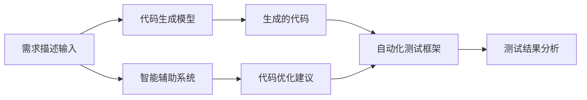

# AI技术提升程序员的创造力与效率

> 关键词：AI技术、程序员、创造力、效率、代码生成、智能辅助、自动化测试

> 摘要：本文深入探讨了AI技术如何提升程序员的创造力与效率。随着科技的飞速发展，AI在编程领域的应用日益广泛。通过对AI相关核心概念、算法原理、数学模型的介绍，结合项目实战案例，阐述了AI在代码生成、智能辅助、自动化测试等方面的作用。同时分析了AI技术在编程中的实际应用场景，推荐了相关的学习资源、开发工具和论文著作。最后总结了AI技术在提升程序员创造力与效率方面的未来发展趋势与挑战，并对常见问题进行解答，为程序员更好地利用AI技术提供全面的参考。

## 1. 背景介绍 
### 1.1 目的和范围
本文章的目的在于全面且深入地探讨AI技术对程序员创造力与效率的提升作用。范围涵盖AI在编程领域的多个方面，包括但不限于代码生成、智能辅助、自动化测试等技术的原理、应用及影响。旨在为程序员、技术爱好者以及相关研究人员提供关于AI技术在编程中应用的全面知识和实用指导。

### 1.2 预期读者
预期读者主要包括专业程序员，他们希望借助AI技术提升自己的编程效率和创造力；编程初学者，通过了解AI技术在编程中的应用，更好地学习和理解编程知识；技术管理者，以便在团队中合理应用AI技术提高整体开发效率；以及对AI技术和编程领域感兴趣的研究人员和爱好者。

### 1.3 文档结构概述
本文首先介绍背景信息，包括目的、预期读者和文档结构概述，同时给出相关术语的定义和解释。接着阐述AI技术在编程中的核心概念与联系，通过文本示意图和Mermaid流程图进行直观展示。然后详细讲解核心算法原理和具体操作步骤，并结合Python源代码进行说明。之后介绍数学模型和公式，并举例说明其在编程中的应用。再通过项目实战案例，详细解释代码实现和分析。随后探讨AI技术在编程中的实际应用场景。接着推荐相关的学习资源、开发工具和论文著作。最后总结AI技术的未来发展趋势与挑战，解答常见问题，并提供扩展阅读和参考资料。

### 1.4 术语表
#### 1.4.1 核心术语定义
- **AI（Artificial Intelligence）**：即人工智能，是指计算机系统能够执行通常需要人类智能才能完成的任务，如学习、推理、解决问题等。
- **代码生成**：利用AI技术根据特定的需求或规范自动生成代码的过程。
- **智能辅助**：AI系统为程序员在编程过程中提供实时的建议、纠错、优化等帮助。
- **自动化测试**：使用软件工具自动执行测试用例，验证代码的正确性和性能。

#### 1.4.2 相关概念解释
- **机器学习**：AI的一个分支，通过让计算机从数据中学习模式和规律，从而实现预测和决策。在编程中，机器学习可用于代码分析、缺陷预测等。
- **自然语言处理（NLP）**：使计算机能够理解、处理和生成人类语言的技术。在编程中，NLP可用于将自然语言描述转化为代码，或对代码进行语义分析。
- **深度学习**：一种基于人工神经网络的机器学习技术，能够处理复杂的模式和数据。在编程中，深度学习可用于代码生成、代码分类等任务。

#### 1.4.3 缩略词列表
- **AI**：Artificial Intelligence（人工智能）
- **NLP**：Natural Language Processing（自然语言处理）
- **ML**：Machine Learning（机器学习）
- **DL**：Deep Learning（深度学习）

## 2. 核心概念与联系 
### 核心概念原理
#### 代码生成
代码生成是AI技术在编程中最直观的应用之一。其原理基于机器学习和深度学习算法，通过对大量代码数据的学习，模型能够理解不同编程语言的语法结构、常用模式和逻辑关系。当接收到用户输入的需求描述（可以是自然语言或简单的代码片段）时，模型会根据学习到的知识生成相应的代码。例如，一个基于Transformer架构的代码生成模型，会将输入的文本进行编码，然后通过多层的注意力机制来生成合适的代码输出。

#### 智能辅助
智能辅助利用自然语言处理和代码分析技术，在程序员编写代码的过程中实时提供帮助。它可以对代码进行语法检查、错误提示、代码补全和优化建议。智能辅助系统会分析当前代码的上下文，结合预训练的语言模型和代码库的知识，预测程序员可能要输入的内容，并提供相应的建议。例如，当程序员输入一个函数名的前几个字符时，智能辅助系统会根据代码库中已有的函数名进行补全提示。

#### 自动化测试
自动化测试基于测试用例生成和执行的算法。AI技术可以根据代码的结构和功能自动生成测试用例，覆盖不同的代码路径和边界条件。然后通过自动化测试框架执行这些测试用例，收集测试结果并进行分析。例如，基于遗传算法的自动化测试用例生成方法，会不断优化测试用例的组合，以提高代码的覆盖率和测试效果。

### 架构的文本示意图
```plaintext
           +----------------+
           |  需求描述输入  |
           +----------------+
                   |
                   v
+----------------+     +----------------+
|  代码生成模型  |     |  智能辅助系统  |
+----------------+     +----------------+
       |                        |
       v                        v
+----------------+     +----------------+
|  生成的代码    |     |  代码优化建议  |
+----------------+     +----------------+
                   |
                   v
           +----------------+
           |  自动化测试框架  |
           +----------------+
                   |
                   v
           +----------------+
           |  测试结果分析  |
           +----------------+
```

### Mermaid流程图


## 3. 核心算法原理 & 具体操作步骤 
### 代码生成算法原理及Python示例
#### 算法原理
基于Transformer架构的代码生成模型是当前较为流行的方法。Transformer架构通过自注意力机制能够捕捉输入序列中不同位置之间的依赖关系。在代码生成中，模型首先将输入的需求描述进行分词，然后将分词后的序列转换为词向量。接着通过多层的Transformer编码器和解码器进行特征提取和生成。解码器会逐步生成代码的每个词，直到生成完整的代码。

#### Python示例
```python
import torch
from transformers import AutoTokenizer, AutoModelForCausalLM

# 加载预训练的代码生成模型和分词器
tokenizer = AutoTokenizer.from_pretrained("Salesforce/codegen-350M-mono")
model = AutoModelForCausalLM.from_pretrained("Salesforce/codegen-350M-mono")

# 输入需求描述
input_text = "写一个Python函数，计算两个数的和"

# 对输入进行分词
input_ids = tokenizer(input_text, return_tensors="pt").input_ids

# 生成代码
generated_ids = model.generate(input_ids, max_length=100)

# 将生成的ID转换为文本
generated_code = tokenizer.decode(generated_ids[0], skip_special_tokens=True)

print(generated_code)
```
### 智能辅助算法原理及Python示例
#### 算法原理
智能辅助的代码补全功能通常基于语言模型。语言模型会计算每个可能的下一个词的概率，然后根据概率排序提供补全建议。在实现中，会使用预训练的语言模型，如GPT系列模型，对当前代码的上下文进行编码，然后预测下一个词。

#### Python示例
```python
import torch
from transformers import GPT2LMHeadModel, GPT2Tokenizer

# 加载预训练的语言模型和分词器
tokenizer = GPT2Tokenizer.from_pretrained("gpt2")
model = GPT2LMHeadModel.from_pretrained("gpt2")

# 输入当前代码上下文
input_text = "def add_numbers(a, b):"

# 对输入进行分词
input_ids = tokenizer.encode(input_text, return_tensors="pt")

# 生成下一个词的概率分布
output = model(input_ids)
next_token_logits = output.logits[:, -1, :]

# 获取概率最高的前5个词
top_k = 5
top_k_tokens = torch.topk(next_token_logits, top_k).indices[0]

# 将词ID转换为文本
suggestions = [tokenizer.decode(token) for token in top_k_tokens]

print("代码补全建议:", suggestions)
```
### 自动化测试算法原理及Python示例
#### 算法原理
基于遗传算法的自动化测试用例生成方法，会随机生成一组初始的测试用例，然后通过交叉、变异等操作不断优化测试用例的组合。在每次迭代中，会根据代码的覆盖率等指标评估每个测试用例的适应度，选择适应度高的测试用例进行繁殖和变异，直到达到预定的迭代次数或覆盖率目标。

#### Python示例
```python
import random
import coverage

# 待测试的函数
def add_numbers(a, b):
    return a + b

# 初始测试用例集合
initial_test_cases = [(random.randint(0, 10), random.randint(0, 10)) for _ in range(10)]

# 遗传算法参数
population_size = 10
generations = 20
mutation_rate = 0.1

# 评估测试用例的适应度（代码覆盖率）
def evaluate_fitness(test_case):
    cov = coverage.Coverage()
    cov.start()
    add_numbers(*test_case)
    cov.stop()
    cov.save()
    return cov.report()

# 交叉操作
def crossover(parent1, parent2):
    crossover_point = random.randint(0, len(parent1) - 1)
    child = parent1[:crossover_point] + parent2[crossover_point:]
    return child

# 变异操作
def mutate(test_case):
    index = random.randint(0, len(test_case) - 1)
    test_case = list(test_case)
    test_case[index] = random.randint(0, 10)
    return tuple(test_case)

# 遗传算法主循环
population = initial_test_cases
for _ in range(generations):
    fitness_scores = [evaluate_fitness(test_case) for test_case in population]
    sorted_population = [x for _, x in sorted(zip(fitness_scores, population), reverse=True)]
    new_population = sorted_population[:population_size // 2]
    while len(new_population) < population_size:
        parent1, parent2 = random.choices(sorted_population[:population_size // 2], k=2)
        child = crossover(parent1, parent2)
        if random.random() < mutation_rate:
            child = mutate(child)
        new_population.append(child)
    population = new_population

# 输出最终的测试用例
print("最终的测试用例:", population)
```

## 4. 数学模型和公式 & 详细讲解 & 举例说明 
### 代码生成中的概率模型
在代码生成中，通常使用语言模型来计算生成每个词的概率。语言模型基于链式法则可以表示为：
$$P(w_1, w_2, \cdots, w_n) = \prod_{i=1}^{n} P(w_i | w_1, w_2, \cdots, w_{i-1})$$
其中，$w_1, w_2, \cdots, w_n$ 是代码中的词序列，$P(w_i | w_1, w_2, \cdots, w_{i-1})$ 表示在给定前面 $i - 1$ 个词的条件下，生成第 $i$ 个词的概率。

例如，在一个简单的代码生成任务中，假设已经生成了前两个词 "def" 和 "add"，现在要生成第三个词。语言模型会计算在 "def add" 这个上下文下，每个可能的词（如 "numbers"、"function" 等）的概率，然后选择概率最高的词作为生成结果。

### 智能辅助中的相似度计算
在智能辅助的代码补全中，会使用相似度计算来评估当前代码上下文与代码库中已有代码片段的相似程度。常用的相似度计算方法是余弦相似度。对于两个向量 $\vec{x}$ 和 $\vec{y}$，余弦相似度的计算公式为：
$$\text{cosine}(\vec{x}, \vec{y}) = \frac{\vec{x} \cdot \vec{y}}{\|\vec{x}\| \|\vec{y}\|}$$
其中，$\vec{x} \cdot \vec{y}$ 是向量的点积，$\|\vec{x}\|$ 和 $\|\vec{y}\|$ 分别是向量的模。

例如，将当前代码上下文和代码库中的代码片段分别转换为词向量，然后计算它们的余弦相似度。相似度高的代码片段中的后续词可以作为代码补全的建议。

### 自动化测试中的适应度函数
在基于遗传算法的自动化测试用例生成中，适应度函数用于评估每个测试用例的优劣。一个简单的适应度函数可以是代码的覆盖率。假设 $C$ 是代码的总语句数，$c$ 是被测试用例覆盖的语句数，则适应度函数 $f$ 可以表示为：
$$f = \frac{c}{C}$$
例如，一个测试用例覆盖了 10 条语句，而代码总共有 20 条语句，则该测试用例的适应度为 $f = \frac{10}{20} = 0.5$。

## 5. 项目实战：代码实际案例和详细解释说明 
### 5.1  开发环境搭建
#### 安装Python
首先需要安装Python环境。可以从Python官方网站（https://www.python.org/downloads/） 下载适合自己操作系统的Python安装包，按照安装向导进行安装。安装完成后，可以在命令行中输入 `python --version` 来验证Python是否安装成功。

#### 安装相关库
在项目中需要使用到一些Python库，如 `torch`、`transformers`、`coverage` 等。可以使用 `pip` 来安装这些库。在命令行中执行以下命令：
```sh
pip install torch transformers coverage
```

### 5.2  源代码详细实现和代码解读
#### 代码生成模块
```python
import torch
from transformers import AutoTokenizer, AutoModelForCausalLM

# 加载预训练的代码生成模型和分词器
tokenizer = AutoTokenizer.from_pretrained("Salesforce/codegen-350M-mono")
model = AutoModelForCausalLM.from_pretrained("Salesforce/codegen-350M-mono")

# 输入需求描述
input_text = "写一个Python函数，计算两个数的和"

# 对输入进行分词
input_ids = tokenizer(input_text, return_tensors="pt").input_ids

# 生成代码
generated_ids = model.generate(input_ids, max_length=100)

# 将生成的ID转换为文本
generated_code = tokenizer.decode(generated_ids[0], skip_special_tokens=True)

print(generated_code)
```
代码解读：
- 首先导入 `torch` 和 `transformers` 库中的相关类。
- 使用 `AutoTokenizer.from_pretrained` 加载预训练的分词器，`AutoModelForCausalLM.from_pretrained` 加载预训练的代码生成模型。
- 定义输入的需求描述 `input_text`。
- 使用分词器将输入文本转换为词ID序列 `input_ids`。
- 调用模型的 `generate` 方法生成代码的ID序列 `generated_ids`。
- 最后使用分词器将生成的ID序列转换为文本 `generated_code` 并打印输出。

#### 智能辅助模块
```python
import torch
from transformers import GPT2LMHeadModel, GPT2Tokenizer

# 加载预训练的语言模型和分词器
tokenizer = GPT2Tokenizer.from_pretrained("gpt2")
model = GPT2LMHeadModel.from_pretrained("gpt2")

# 输入当前代码上下文
input_text = "def add_numbers(a, b):"

# 对输入进行分词
input_ids = tokenizer.encode(input_text, return_tensors="pt")

# 生成下一个词的概率分布
output = model(input_ids)
next_token_logits = output.logits[:, -1, :]

# 获取概率最高的前5个词
top_k = 5
top_k_tokens = torch.topk(next_token_logits, top_k).indices[0]

# 将词ID转换为文本
suggestions = [tokenizer.decode(token) for token in top_k_tokens]

print("代码补全建议:", suggestions)
```
代码解读：
- 导入 `torch` 和 `transformers` 库中的相关类。
- 使用 `GPT2Tokenizer.from_pretrained` 加载预训练的分词器，`GPT2LMHeadModel.from_pretrained` 加载预训练的语言模型。
- 定义当前代码上下文 `input_text`。
- 使用分词器将输入文本编码为词ID序列 `input_ids`。
- 将输入ID序列输入到模型中，得到输出 `output`，提取最后一个位置的词的概率分布 `next_token_logits`。
- 使用 `torch.topk` 函数获取概率最高的前5个词的ID `top_k_tokens`。
- 将词ID转换为文本 `suggestions` 并打印输出。

#### 自动化测试模块
```python
import random
import coverage

# 待测试的函数
def add_numbers(a, b):
    return a + b

# 初始测试用例集合
initial_test_cases = [(random.randint(0, 10), random.randint(0, 10)) for _ in range(10)]

# 遗传算法参数
population_size = 10
generations = 20
mutation_rate = 0.1

# 评估测试用例的适应度（代码覆盖率）
def evaluate_fitness(test_case):
    cov = coverage.Coverage()
    cov.start()
    add_numbers(*test_case)
    cov.stop()
    cov.save()
    return cov.report()

# 交叉操作
def crossover(parent1, parent2):
    crossover_point = random.randint(0, len(parent1) - 1)
    child = parent1[:crossover_point] + parent2[crossover_point:]
    return child

# 变异操作
def mutate(test_case):
    index = random.randint(0, len(test_case) - 1)
    test_case = list(test_case)
    test_case[index] = random.randint(0, 10)
    return tuple(test_case)

# 遗传算法主循环
population = initial_test_cases
for _ in range(generations):
    fitness_scores = [evaluate_fitness(test_case) for test_case in population]
    sorted_population = [x for _, x in sorted(zip(fitness_scores, population), reverse=True)]
    new_population = sorted_population[:population_size // 2]
    while len(new_population) < population_size:
        parent1, parent2 = random.choices(sorted_population[:population_size // 2], k=2)
        child = crossover(parent1, parent2)
        if random.random() < mutation_rate:
            child = mutate(child)
        new_population.append(child)
    population = new_population

# 输出最终的测试用例
print("最终的测试用例:", population)
```
代码解读：
- 定义待测试的函数 `add_numbers`。
- 生成初始的测试用例集合 `initial_test_cases`。
- 定义遗传算法的参数 `population_size`、`generations` 和 `mutation_rate`。
- 定义评估测试用例适应度的函数 `evaluate_fitness`，使用 `coverage` 库来计算代码覆盖率。
- 定义交叉操作函数 `crossover` 和变异操作函数 `mutate`。
- 在遗传算法主循环中，每次迭代计算每个测试用例的适应度，选择适应度高的测试用例进行繁殖和变异，更新种群。
- 最后输出最终的测试用例集合 `population`。

### 5.3  代码解读与分析
#### 代码生成模块
优点：通过预训练的模型可以快速生成符合需求的代码，减少程序员的手动编写工作量。
缺点：生成的代码可能存在逻辑错误或不符合最佳实践，需要程序员进行进一步的检查和优化。

#### 智能辅助模块
优点：能够实时提供代码补全建议，提高编程效率，尤其是在编写较长的代码时。
缺点：建议可能不准确，特别是在处理复杂的代码上下文或特定领域的代码时。

#### 自动化测试模块
优点：可以自动生成测试用例，提高代码的覆盖率和测试效率，减少人工编写测试用例的工作量。
缺点：遗传算法的性能可能受到参数设置的影响，而且对于复杂的代码结构，可能无法生成全面有效的测试用例。

## 6. 实际应用场景 
### 快速原型开发
在快速原型开发阶段，程序员需要快速实现一个初步的系统或功能。AI技术的代码生成功能可以根据需求描述快速生成代码框架，帮助程序员节省时间。例如，在开发一个简单的Web应用时，AI可以生成路由、数据库连接等基本代码，程序员只需要在此基础上进行细化和优化。

### 代码优化和重构
智能辅助系统可以帮助程序员发现代码中的潜在问题，如性能瓶颈、代码重复等，并提供优化建议。在代码重构过程中，AI可以分析代码的结构和逻辑，提供重构方案，提高代码的可读性和可维护性。

### 自动化测试和持续集成
自动化测试功能可以在代码提交后自动执行测试用例，及时发现代码中的缺陷。结合持续集成工具，如Jenkins、GitLab CI/CD等，可以实现代码的自动构建、测试和部署，提高开发效率和软件质量。

### 学习和教育
对于编程初学者，AI技术可以作为学习的辅助工具。代码生成和智能辅助功能可以帮助初学者理解代码的结构和语法，提供学习的参考。同时，自动化测试可以让初学者快速验证自己的代码是否正确，增强学习的信心。

## 7. 工具和资源推荐
### 7.1 学习资源推荐
#### 7.1.1 书籍推荐
- 《Python深度学习》：介绍了深度学习的基本原理和Python实现，对于理解AI技术在编程中的应用有很大帮助。
- 《人工智能：一种现代的方法》：全面介绍了人工智能的各个领域，包括机器学习、自然语言处理等。
- 《代码大全》：讲解了编程的最佳实践和方法，对于提高编程效率和质量有指导作用。

#### 7.1.2 在线课程
- Coursera上的“机器学习”课程：由Andrew Ng教授授课，是学习机器学习的经典课程。
- edX上的“人工智能基础”课程：系统介绍了人工智能的基本概念和技术。
- 哔哩哔哩上的Python编程教学视频：有很多优秀的Python编程教程，适合初学者学习。

#### 7.1.3 技术博客和网站
- Medium：有很多AI和编程领域的技术文章，作者来自世界各地的专业人士。
- Stack Overflow：是程序员交流和解决问题的社区，可以在这里找到很多关于AI技术在编程中应用的问题和解决方案。
- 开源中国：提供了丰富的技术资讯和开源项目，对于了解AI技术的最新动态和应用案例有帮助。

### 7.2 开发工具框架推荐
#### 7.2.1 IDE和编辑器
- PyCharm：是一款专业的Python集成开发环境，支持代码自动补全、调试等功能，与AI技术结合可以提高编程效率。
- Visual Studio Code：是一款轻量级的代码编辑器，有丰富的插件支持，如Codeium、GitHub Copilot等AI辅助编程插件。
- Jupyter Notebook：适合进行数据探索和模型训练，方便展示代码和结果。

#### 7.2.2 调试和性能分析工具
- PDB：Python自带的调试器，可以帮助程序员定位代码中的问题。
- cProfile：Python的性能分析工具，可以分析代码的运行时间和资源消耗。
- Py-Spy：可以实时监控Python程序的性能，找出性能瓶颈。

#### 7.2.3 相关框架和库
- PyTorch：是一个深度学习框架，提供了丰富的工具和函数，方便实现AI模型。
- TensorFlow：是另一个流行的深度学习框架，有广泛的应用和社区支持。
- Scikit-learn：是一个机器学习库，提供了各种机器学习算法和工具，适合进行数据处理和模型训练。

### 7.3 相关论文著作推荐
#### 7.3.1 经典论文
- “Attention Is All You Need”：介绍了Transformer架构，是现代自然语言处理和代码生成的基础。
- “Generative Adversarial Nets”：提出了生成对抗网络（GAN）的概念，在图像生成、代码生成等领域有广泛应用。
- “A Mathematical Theory of Communication”：奠定了信息论的基础，对于理解自然语言处理中的信息编码和解码有重要意义。

#### 7.3.2 最新研究成果
- arXiv上的AI和编程相关论文：可以及时了解到最新的研究进展和技术趋势。
- 顶级学术会议如NeurIPS、ICML、ACL等的论文：代表了AI领域的最新研究成果。

#### 7.3.3 应用案例分析
- 《AI in Software Engineering》：介绍了AI技术在软件工程中的应用案例和实践经验。
- 各大科技公司的技术博客：如Google、Microsoft、Facebook等公司的博客，会分享他们在AI和编程领域的应用案例和研究成果。

## 8. 总结：未来发展趋势与挑战
### 未来发展趋势
#### 更强大的代码生成能力
未来的AI代码生成模型将能够生成更加复杂、高质量的代码，甚至可以根据自然语言描述生成整个软件系统。模型将能够更好地理解业务需求和领域知识，生成的代码将更加符合最佳实践和行业标准。

#### 深度集成开发环境
AI技术将与开发环境深度集成，实现更加智能的代码编辑、调试和优化功能。例如，智能辅助系统可以根据程序员的编程习惯和代码风格提供个性化的建议，开发环境可以自动检测和修复代码中的安全漏洞。

#### 跨语言和跨领域应用
AI技术将能够支持更多的编程语言和领域，实现跨语言的代码生成和智能辅助。例如，在物联网、大数据、人工智能等领域，AI可以帮助程序员快速开发和集成不同的系统和模块。

#### 强化学习在编程中的应用
强化学习可以用于优化代码的性能和效率。通过与环境的交互，AI系统可以不断学习和调整代码，以达到最佳的性能表现。例如，在算法优化、资源分配等方面，强化学习可以发挥重要作用。

### 挑战
#### 数据隐私和安全问题
AI模型的训练需要大量的数据，这些数据可能包含敏感信息。如何保护数据的隐私和安全，防止数据泄露和滥用，是一个重要的挑战。同时，AI生成的代码也可能存在安全漏洞，需要加强安全检测和防范。

#### 模型的可解释性
目前的AI模型大多是黑盒模型，其决策过程和生成结果难以解释。在编程领域，程序员需要了解模型为什么生成这样的代码，以便进行检查和优化。提高模型的可解释性是一个亟待解决的问题。

#### 技术的普及和人才培养
虽然AI技术在编程中的应用前景广阔，但目前很多程序员对这些技术还不够了解和熟悉。如何普及AI技术，培养更多掌握AI和编程技术的复合型人才，是推动AI技术在编程中广泛应用的关键。

#### 伦理和法律问题
AI技术的应用可能会引发一系列伦理和法律问题，如代码的版权归属、AI生成的代码导致的事故责任等。需要建立相应的伦理和法律框架，规范AI技术在编程中的应用。

## 9. 附录：常见问题与解答
### 1. AI生成的代码质量可靠吗？
AI生成的代码可以提供一个基本的框架和思路，但质量可能存在一定的问题。生成的代码可能存在逻辑错误、性能瓶颈或不符合最佳实践。程序员需要对生成的代码进行检查和优化，确保其质量和可靠性。

### 2. AI技术会取代程序员吗？
不会。AI技术可以辅助程序员提高效率和创造力，但无法完全取代程序员。编程不仅仅是代码的编写，还涉及到需求分析、系统设计、架构规划等多个方面，这些都需要程序员的专业知识和经验。AI技术只是程序员的工具，帮助他们更好地完成工作。

### 3. 如何选择适合自己的AI开发工具和框架？
选择适合自己的AI开发工具和框架需要考虑多个因素，如个人的技术水平、项目的需求、工具和框架的易用性和社区支持等。对于初学者来说，可以选择一些简单易用、有丰富文档和教程的工具和框架，如PyTorch、Scikit-learn等。对于有一定经验的开发者，可以根据项目的具体需求选择更适合的工具和框架。

### 4. AI技术在编程中的应用需要哪些基础知识？
需要掌握一定的编程基础知识，如Python、Java等编程语言，以及数据结构、算法等计算机科学基础知识。同时，了解机器学习、自然语言处理等AI领域的基本概念和算法也很有帮助。

### 5. 如何提高AI模型在编程中的性能？
可以通过优化模型的结构和参数、增加训练数据的数量和质量、采用更先进的训练方法等方式来提高AI模型的性能。同时，结合具体的应用场景和需求，对模型进行针对性的调整和优化也很重要。

## 10. 扩展阅读 & 参考资料
### 扩展阅读
- 《AI 3.0》：探讨了人工智能的发展现状和未来趋势，对于理解AI技术在编程中的应用有更深入的思考。
- 《算法之美：指导工作与生活的算法》：介绍了算法在生活和工作中的应用，帮助程序员更好地理解算法的本质和应用场景。

### 参考资料
- Transformer官方论文：https://arxiv.org/abs/1706.03762
- GPT系列论文：https://openai.com/research/gpt-3
- 开源项目：GitHub上的相关AI和编程项目，如CodeGen、GitHub Copilot等。