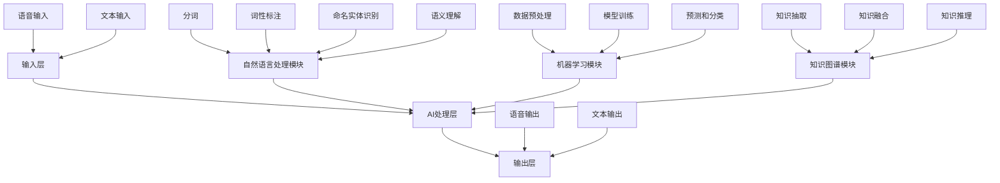

# AI技术提升软件项目沟通效率的方法

> 关键词：AI技术、软件项目、沟通效率、自然语言处理、智能协作工具

> 摘要：本文聚焦于AI技术在提升软件项目沟通效率方面的方法。首先介绍了相关背景，包括目的、预期读者等内容。接着阐述了核心概念及联系，分析了核心算法原理并给出Python代码示例，讲解了数学模型和公式。通过项目实战展示了具体的代码实现和解读。探讨了AI技术在软件项目中的实际应用场景，推荐了学习、开发工具等资源。最后总结了未来发展趋势与挑战，解答常见问题并提供扩展阅读和参考资料，旨在为软件项目中更好地运用AI技术提升沟通效率提供全面且深入的指导。

## 1. 背景介绍 
### 1.1 目的和范围
在当今快节奏的软件开发领域，高效的沟通对于项目的成功至关重要。软件项目通常涉及多个团队成员，包括开发人员、测试人员、产品经理、设计师等，他们分布在不同的地理位置，使用不同的工具和工作方式。传统的沟通方式，如邮件、会议等，往往效率低下，容易出现信息传递不准确、不及时的问题。本文章的目的在于探讨如何利用AI技术来解决这些问题，提升软件项目的沟通效率。范围涵盖了AI技术在软件项目沟通各个环节的应用，包括需求沟通、进度汇报、问题解决等。

### 1.2 预期读者
本文预期读者主要包括软件项目的管理人员、开发团队成员、测试人员、产品经理等相关人员。对于对AI技术在软件项目中应用感兴趣的研究人员和学生也具有一定的参考价值。

### 1.3 文档结构概述
本文首先介绍背景信息，让读者了解研究的目的和意义。接着阐述核心概念与联系，使读者对相关概念有清晰的认识。然后详细讲解核心算法原理和具体操作步骤，并给出数学模型和公式。通过项目实战，展示AI技术在软件项目沟通中的具体实现。探讨实际应用场景，让读者了解AI技术的实际应用效果。推荐相关的工具和资源，帮助读者进一步学习和实践。最后总结未来发展趋势与挑战，解答常见问题并提供扩展阅读和参考资料。

### 1.4 术语表
#### 1.4.1 核心术语定义
- **AI技术**：即人工智能技术，是研究、开发用于模拟、延伸和扩展人的智能的理论、方法、技术及应用系统的一门新的技术科学。
- **软件项目沟通**：指在软件项目开发过程中，项目团队成员之间、团队与客户之间进行信息交流、意见反馈、问题协商等活动的过程。
- **自然语言处理（NLP）**：是人工智能的一个重要领域，它研究如何让计算机理解和处理人类语言。

#### 1.4.2 相关概念解释
- **智能协作工具**：利用AI技术开发的，能够辅助团队成员进行协作的工具，如智能聊天机器人、智能文档管理系统等。
- **知识图谱**：是一种语义网络，用于表示实体之间的关系，在软件项目中可以用于知识管理和信息检索。

#### 1.4.3 缩略词列表
- **NLP**：自然语言处理（Natural Language Processing）
- **ML**：机器学习（Machine Learning）
- **DL**：深度学习（Deep Learning）

## 2. 核心概念与联系 

### 核心概念原理
在软件项目沟通中，AI技术主要通过自然语言处理、机器学习和知识图谱等技术来提升沟通效率。

自然语言处理技术可以让计算机理解和处理人类语言，实现智能客服、自动摘要、机器翻译等功能。例如，在软件项目中，智能客服可以自动回答开发人员的常见问题，节省沟通时间。

机器学习技术可以通过对历史沟通数据的分析，预测项目风险、推荐合适的沟通方式等。例如，通过分析以往项目中需求变更的频率和原因，预测当前项目中可能出现的需求变更，提前做好应对准备。

知识图谱技术可以将软件项目中的各种知识和信息进行整合和关联，形成一个结构化的知识网络。例如，将软件项目中的需求文档、设计文档、代码文档等进行关联，方便团队成员快速查找和获取相关信息。

### 架构的文本示意图
```plaintext
软件项目沟通系统
|-- 输入层
|   |-- 语音输入
|   |-- 文本输入
|-- AI处理层
|   |-- 自然语言处理模块
|   |   |-- 分词
|   |   |-- 词性标注
|   |   |-- 命名实体识别
|   |   |-- 语义理解
|   |-- 机器学习模块
|   |   |-- 数据预处理
|   |   |-- 模型训练
|   |   |-- 预测和分类
|   |-- 知识图谱模块
|   |   |-- 知识抽取
|   |   |-- 知识融合
|   |   |-- 知识推理
|-- 输出层
|   |-- 语音输出
|   |-- 文本输出
```

### Mermaid流程图


## 3. 核心算法原理 & 具体操作步骤 

### 自然语言处理算法原理及Python代码示例
#### 分词算法原理
分词是自然语言处理的基础任务之一，它将文本分割成一个个词语。常见的分词算法有基于规则的分词算法和基于统计的分词算法。这里我们使用Python的`jieba`库来实现中文分词。

```python
import jieba

# 待分词的文本
text = "软件项目沟通是项目成功的关键因素之一"

# 进行分词
words = jieba.cut(text)

# 输出分词结果
print("分词结果：", "/".join(words))
```

#### 词性标注算法原理
词性标注是给每个词语标注其词性，如名词、动词、形容词等。Python的`jieba`库也支持词性标注功能。

```python
import jieba.posseg as pseg

# 待标注词性的文本
text = "软件项目沟通是项目成功的关键因素之一"

# 进行词性标注
words = pseg.cut(text)

# 输出词性标注结果
for word, flag in words:
    print(f"词语：{word}，词性：{flag}")
```

### 机器学习算法原理及Python代码示例
#### 线性回归算法原理
线性回归是一种基本的机器学习算法，用于预测连续值。在软件项目沟通中，可以用线性回归来预测项目的进度。

```python
import numpy as np
from sklearn.linear_model import LinearRegression

# 训练数据
X = np.array([[1], [2], [3], [4], [5]])  # 输入特征
y = np.array([2, 4, 6, 8, 10])  # 目标值

# 创建线性回归模型
model = LinearRegression()

# 训练模型
model.fit(X, y)

# 预测
new_X = np.array([[6]])
prediction = model.predict(new_X)

print("预测结果：", prediction)
```

### 具体操作步骤
1. **数据收集**：收集软件项目中的沟通数据，包括聊天记录、邮件、文档等。
2. **数据预处理**：对收集到的数据进行清洗、分词、词性标注等处理。
3. **特征提取**：从预处理后的数据中提取有用的特征，如关键词、情感倾向等。
4. **模型训练**：选择合适的机器学习模型，如线性回归、决策树、神经网络等，对提取的特征进行训练。
5. **模型评估**：使用测试数据对训练好的模型进行评估，评估指标包括准确率、召回率、F1值等。
6. **模型应用**：将训练好的模型应用到软件项目沟通中，实现智能客服、自动摘要、风险预测等功能。

## 4. 数学模型和公式 & 详细讲解 & 举例说明 

### 线性回归数学模型和公式
线性回归的数学模型可以表示为：

$$y = \beta_0 + \beta_1x_1 + \beta_2x_2 + \cdots + \beta_nx_n + \epsilon$$

其中，$y$ 是目标值，$x_1, x_2, \cdots, x_n$ 是输入特征，$\beta_0, \beta_1, \cdots, \beta_n$ 是模型的参数，$\epsilon$ 是误差项。

线性回归的目标是找到一组最优的参数 $\beta_0, \beta_1, \cdots, \beta_n$，使得预测值与真实值之间的误差最小。常用的误差度量方法是均方误差（MSE）：

$$MSE = \frac{1}{m}\sum_{i = 1}^{m}(y_i - \hat{y}_i)^2$$

其中，$m$ 是样本数量，$y_i$ 是真实值，$\hat{y}_i$ 是预测值。

### 详细讲解
在软件项目沟通中，假设我们要预测项目的进度，输入特征可以是已完成的任务数量、投入的人力等，目标值是项目的完成百分比。通过收集历史数据，我们可以使用线性回归模型来训练这些数据，得到最优的参数 $\beta_0, \beta_1, \cdots, \beta_n$。然后，对于新的输入特征，我们可以使用训练好的模型来预测项目的进度。

### 举例说明
假设我们有以下历史数据：

| 已完成任务数量 ($x$) | 项目完成百分比 ($y$) |
|---|---|
| 1 | 20 |
| 2 | 40 |
| 3 | 60 |
| 4 | 80 |
| 5 | 100 |

我们可以使用线性回归模型来拟合这些数据。根据线性回归的公式 $y = \beta_0 + \beta_1x$，我们可以通过最小化均方误差来求解 $\beta_0$ 和 $\beta_1$。

首先，计算 $x$ 和 $y$ 的均值：

$$\bar{x} = \frac{1 + 2 + 3 + 4 + 5}{5} = 3$$

$$\bar{y} = \frac{20 + 40 + 60 + 80 + 100}{5} = 60$$

然后，计算 $\beta_1$：

$$\beta_1 = \frac{\sum_{i = 1}^{5}(x_i - \bar{x})(y_i - \bar{y})}{\sum_{i = 1}^{5}(x_i - \bar{x})^2} = \frac{(1 - 3)(20 - 60) + (2 - 3)(40 - 60) + (3 - 3)(60 - 60) + (4 - 3)(80 - 60) + (5 - 3)(100 - 60)}{(1 - 3)^2 + (2 - 3)^2 + (3 - 3)^2 + (4 - 3)^2 + (5 - 3)^2} = 20$$

最后，计算 $\beta_0$：

$$\beta_0 = \bar{y} - \beta_1\bar{x} = 60 - 20 \times 3 = 0$$

所以，线性回归模型为 $y = 20x$。如果新的已完成任务数量为 6，那么预测的项目完成百分比为 $y = 20 \times 6 = 120$（在实际应用中，可能需要对预测结果进行合理的调整）。

## 5. 项目实战：代码实际案例和详细解释说明 

### 5.1  开发环境搭建
1. **安装Python**：从Python官方网站（https://www.python.org/downloads/）下载并安装Python 3.x版本。
2. **安装必要的库**：使用`pip`命令安装`jieba`、`sklearn`等库。

```bash
pip install jieba
pip install scikit-learn
```

### 5.2  源代码详细实现和代码解读
#### 智能客服系统示例
```python
import jieba
import random

# 定义常见问题和答案
qa_dict = {
    "项目进度如何": "目前项目已完成50%，预计下周完成剩余部分。",
    "需求是否有变更": "目前需求没有变更。",
    "测试工作进展": "测试工作正在进行中，已发现5个问题。"
}

# 定义智能客服函数
def intelligent_customer_service(question):
    # 分词
    words = jieba.lcut(question)
    
    # 查找匹配的问题
    for key in qa_dict.keys():
        key_words = jieba.lcut(key)
        match_count = 0
        for word in words:
            if word in key_words:
                match_count += 1
        if match_count / len(key_words) >= 0.5:
            return qa_dict[key]
    
    # 如果没有匹配的问题，返回默认回答
    default_answers = ["抱歉，我不理解您的问题，请换一种表达方式。", "请您提供更详细的信息。"]
    return random.choice(default_answers)

# 测试智能客服
question = "项目现在完成多少了"
answer = intelligent_customer_service(question)
print("问题：", question)
print("答案：", answer)
```

#### 代码解读
1. **导入库**：导入`jieba`库用于分词，导入`random`库用于随机选择默认回答。
2. **定义常见问题和答案**：使用字典`qa_dict`存储常见问题和对应的答案。
3. **定义智能客服函数**：
    - 对用户输入的问题进行分词。
    - 遍历常见问题，对每个问题进行分词，并计算与用户问题的匹配度。
    - 如果匹配度大于等于0.5，则返回对应的答案。
    - 如果没有匹配的问题，则随机选择一个默认回答返回。
4. **测试智能客服**：输入一个问题，调用智能客服函数并输出答案。

### 5.3  代码解读与分析
- **优点**：该智能客服系统实现简单，能够快速回答常见问题，提高沟通效率。
- **缺点**：匹配方式比较简单，只能处理一些简单的问题，对于复杂的问题可能无法准确回答。可以通过使用更复杂的自然语言处理技术，如语义理解、知识图谱等，来提高智能客服的性能。

## 6. 实际应用场景 
### 需求沟通
在软件项目的需求沟通阶段，AI技术可以帮助项目团队更好地理解客户的需求。例如，通过智能客服系统，客户可以随时咨询需求相关的问题，系统可以自动回答常见问题，提高沟通效率。同时，AI技术可以对客户的需求文档进行分析，提取关键信息，生成需求摘要，帮助项目团队快速了解需求要点。

### 进度汇报
在项目开发过程中，AI技术可以用于进度汇报。例如，通过对开发人员提交的代码、任务完成情况等数据进行分析，自动生成进度报告。同时，AI技术可以预测项目的风险，提前发出预警，帮助项目团队及时采取措施。

### 问题解决
当项目中出现问题时，AI技术可以帮助团队快速定位问题并提供解决方案。例如，通过对历史问题数据的分析，建立问题知识库，当出现新问题时，系统可以自动匹配相似问题，并提供解决方案。

### 团队协作
AI技术可以促进团队成员之间的协作。例如，智能协作工具可以根据团队成员的技能和任务分配情况，自动推荐合适的协作人员。同时，AI技术可以对团队成员的沟通记录进行分析，发现协作过程中的问题，提供改进建议。

## 7. 工具和资源推荐
### 7.1 学习资源推荐
#### 7.1.1 书籍推荐
- 《Python自然语言处理》：介绍了Python在自然语言处理领域的应用，包括分词、词性标注、命名实体识别等技术。
- 《机器学习》：由周志华教授编写，全面介绍了机器学习的基本概念、算法和应用。
- 《深度学习》：由Ian Goodfellow、Yoshua Bengio和Aaron Courville编写，是深度学习领域的经典著作。

#### 7.1.2 在线课程
- Coursera上的“机器学习”课程：由Andrew Ng教授授课，是机器学习领域的经典课程。
- edX上的“人工智能基础”课程：介绍了人工智能的基本概念、算法和应用。
- 中国大学MOOC上的“自然语言处理”课程：由国内知名高校的教授授课，内容丰富。

#### 7.1.3 技术博客和网站
- 博客园：有很多关于AI技术和软件项目管理的技术文章。
- 开源中国：提供了很多开源项目和技术文章。
- Kaggle：是一个数据科学竞赛平台，有很多关于AI技术的实践案例和讨论。

### 7.2 开发工具框架推荐
#### 7.2.1 IDE和编辑器
- PyCharm：是一款专门用于Python开发的集成开发环境，功能强大。
- Visual Studio Code：是一款轻量级的代码编辑器，支持多种编程语言，有丰富的插件。

#### 7.2.2 调试和性能分析工具
- PDB：Python自带的调试工具，方便调试Python代码。
- cProfile：Python的性能分析工具，可以分析代码的运行时间和性能瓶颈。

#### 7.2.3 相关框架和库
- TensorFlow：是Google开发的深度学习框架，广泛应用于AI领域。
- PyTorch：是Facebook开发的深度学习框架，易于使用和调试。
- NLTK：是Python的自然语言处理工具包，提供了丰富的自然语言处理功能。

### 7.3 相关论文著作推荐
#### 7.3.1 经典论文
- “Attention Is All You Need”：提出了Transformer模型，是自然语言处理领域的重要突破。
- “ImageNet Classification with Deep Convolutional Neural Networks”：介绍了AlexNet模型，开启了深度学习在计算机视觉领域的应用。

#### 7.3.2 最新研究成果
- 关注顶级学术会议，如NeurIPS、ICML、ACL等，了解AI技术的最新研究成果。

#### 7.3.3 应用案例分析
- 查看一些知名公司的技术博客，如Google AI Blog、Facebook AI Research等，了解AI技术在实际应用中的案例分析。

## 8. 总结：未来发展趋势与挑战
### 未来发展趋势
- **更智能的沟通助手**：未来的AI沟通助手将具备更强大的自然语言理解和生成能力，能够更好地理解用户的意图，提供更准确、更个性化的回答。
- **多模态沟通**：除了文本和语音沟通，未来的软件项目沟通将支持更多的模态，如图像、视频等。AI技术将能够处理多模态信息，实现更加丰富和高效的沟通。
- **智能协作生态系统**：AI技术将促进软件项目中各个工具和系统之间的集成，形成一个智能协作生态系统。例如，智能客服系统可以与项目管理工具、代码管理工具等进行集成，实现信息的自动同步和共享。

### 挑战
- **数据隐私和安全**：AI技术需要大量的数据来训练模型，这些数据可能包含用户的敏感信息。如何保护数据的隐私和安全是一个重要的挑战。
- **算法可解释性**：一些复杂的AI算法，如深度学习算法，往往是黑盒模型，难以解释其决策过程。在软件项目沟通中，需要算法具有可解释性，以便用户理解和信任。
- **技术融合和人才培养**：AI技术与软件项目管理的融合需要跨领域的人才。如何培养既懂AI技术又懂软件项目管理的复合型人才是一个挑战。

## 9. 附录：常见问题与解答
### 问题1：AI技术在软件项目沟通中的应用是否会取代人工沟通？
解答：不会。AI技术可以辅助人工沟通，提高沟通效率，但无法完全取代人工沟通。在一些需要情感交流、创造性思维等方面，人工沟通仍然是不可或缺的。

### 问题2：如何选择适合的AI技术和工具？
解答：需要根据项目的具体需求和特点来选择。例如，如果项目主要涉及自然语言处理任务，可以选择NLTK、`jieba`等工具；如果需要进行深度学习，可以选择TensorFlow、PyTorch等框架。同时，还需要考虑工具和技术的易用性、性能、社区支持等因素。

### 问题3：AI技术在软件项目沟通中的应用需要多少数据？
解答：数据量的需求取决于具体的应用场景和算法。一般来说，数据量越大，模型的性能越好。但也需要注意数据的质量，确保数据的准确性和一致性。

## 10. 扩展阅读 & 参考资料
- 《人工智能：现代方法》
- 《软件项目管理》
- https://www.baidu.com （百度搜索相关技术文章）
- https://scholar.google.com （谷歌学术搜索相关论文）