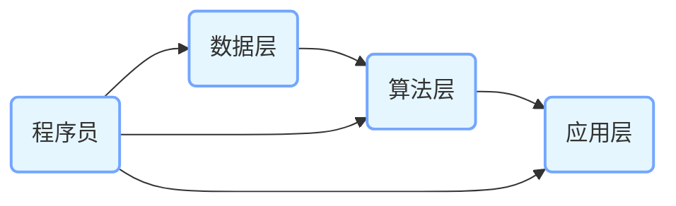

# AI时代的编程：程序员的未来展望

> 关键词：AI时代、编程、程序员、未来展望、人工智能、自动化编程、职业发展

> 摘要：本文围绕AI时代的编程展开，深入探讨了程序员在这一时代背景下的未来发展。首先介绍了相关背景，包括目的范围、预期读者等内容。接着阐述了AI与编程的核心概念及联系，详细讲解了核心算法原理和具体操作步骤，给出了相关数学模型和公式。通过项目实战案例展示了代码的实现与解读。分析了AI时代编程的实际应用场景，推荐了学习资源、开发工具框架以及相关论文著作。最后总结了未来发展趋势与挑战，解答常见问题并提供扩展阅读和参考资料，旨在为程序员在AI时代的职业发展提供全面且有深度的参考。

## 1. 背景介绍 
### 1.1 目的和范围
在当今科技飞速发展的时代，人工智能（AI）正以前所未有的速度改变着各个领域，编程行业也不例外。本文的目的在于全面探讨AI时代编程的发展趋势以及程序员所面临的机遇和挑战，为广大程序员和相关从业者提供深入的洞察和实用的建议。范围涵盖了AI与编程的核心概念、算法原理、实际应用场景、职业发展等多个方面，旨在为读者构建一个完整的知识体系，帮助他们更好地适应AI时代的编程变革。

### 1.2 预期读者
本文预期读者主要包括程序员、软件开发者、编程爱好者、计算机专业学生以及对AI时代编程发展感兴趣的相关人士。无论是新手程序员希望了解行业发展趋势，还是有经验的开发者寻求在AI时代的职业突破，本文都将提供有价值的信息和思考方向。

### 1.3 文档结构概述
本文将按照以下结构展开：首先介绍背景信息，包括目的、预期读者和文档结构概述等；接着阐述AI与编程的核心概念及联系，通过文本示意图和Mermaid流程图进行清晰展示；然后详细讲解核心算法原理和具体操作步骤，结合Python源代码进行说明；再给出相关数学模型和公式，并举例说明；通过项目实战案例展示代码的实现与解读；分析AI时代编程的实际应用场景；推荐学习资源、开发工具框架以及相关论文著作；最后总结未来发展趋势与挑战，解答常见问题并提供扩展阅读和参考资料。

### 1.4 术语表
#### 1.4.1 核心术语定义
- **人工智能（AI）**：是指计算机系统能够执行通常需要人类智能才能完成的任务，如学习、推理、解决问题、感知和语言理解等。
- **机器学习（ML）**：是人工智能的一个子集，专注于让计算机通过数据和经验来自动改进性能，而无需明确编程。
- **深度学习（DL）**：是机器学习的一个分支，基于人工神经网络，特别是深度神经网络，能够自动从大量数据中学习复杂的模式和特征。
- **自动化编程**：利用AI技术自动生成代码的过程，减少人工编写代码的工作量。

#### 1.4.2 相关概念解释
- **AI编程框架**：是用于开发AI应用的软件库和工具集，提供了各种算法和模型的实现，如TensorFlow、PyTorch等。
- **代码生成器**：一种自动化工具，根据用户输入的需求或规范自动生成代码。
- **智能编程助手**：利用AI技术辅助程序员进行编程的工具，如提供代码建议、错误检测和修复等功能。

#### 1.4.3 缩略词列表
- **AI**：Artificial Intelligence（人工智能）
- **ML**：Machine Learning（机器学习）
- **DL**：Deep Learning（深度学习）
- **API**：Application Programming Interface（应用程序编程接口）

## 2. 核心概念与联系 

### 2.1 AI与编程的核心概念
人工智能是一门研究如何使计算机能够模拟人类智能的学科，它涵盖了多个领域，如机器学习、自然语言处理、计算机视觉等。编程则是指使用特定的编程语言和工具，编写指令让计算机执行特定任务的过程。在AI时代，编程与人工智能紧密结合，程序员需要掌握AI相关的知识和技术，才能开发出智能的软件系统。

### 2.2 核心概念原理和架构的文本示意图
AI与编程的结合可以看作是一个多层次的架构。底层是数据层，包括各种数据源，如文本、图像、音频等。中间层是算法层，包括机器学习算法、深度学习算法等，用于对数据进行处理和分析。上层是应用层，包括各种AI应用，如智能聊天机器人、图像识别系统、自动驾驶汽车等。程序员在这个架构中扮演着关键的角色，他们需要负责数据的收集和预处理、算法的选择和实现、应用的开发和部署等工作。

### 2.3 Mermaid流程图


这个流程图展示了AI与编程的架构关系。数据层是基础，为算法层提供数据支持；算法层对数据进行处理和分析，生成模型；应用层将模型应用到实际场景中，实现各种AI应用。程序员贯穿整个过程，负责各个环节的开发和实现。

## 3. 核心算法原理 & 具体操作步骤 

### 3.1 机器学习算法原理
机器学习算法是AI时代编程的核心之一。以监督学习为例，其基本原理是通过给定的输入数据和对应的标签，训练一个模型，使其能够对新的输入数据进行预测。常见的监督学习算法包括线性回归、逻辑回归、决策树、支持向量机等。

以下是一个使用Python实现线性回归的示例代码：
```python
import numpy as np
from sklearn.linear_model import LinearRegression

# 生成示例数据
X = np.array([[1], [2], [3], [4], [5]])
y = np.array([2, 4, 6, 8, 10])

# 创建线性回归模型
model = LinearRegression()

# 训练模型
model.fit(X, y)

# 进行预测
new_X = np.array([[6]])
prediction = model.predict(new_X)

print("预测结果:", prediction)
```
### 3.2 具体操作步骤
1. **数据准备**：收集和整理相关的数据，并进行预处理，如数据清洗、特征选择、数据归一化等。
2. **模型选择**：根据问题的类型和数据的特点，选择合适的机器学习算法和模型。
3. **模型训练**：使用准备好的数据对模型进行训练，调整模型的参数，使其能够拟合数据。
4. **模型评估**：使用测试数据对训练好的模型进行评估，计算模型的性能指标，如准确率、召回率、均方误差等。
5. **模型优化**：根据评估结果，对模型进行优化，如调整模型的参数、选择更好的特征等。
6. **模型部署**：将训练好的模型部署到实际应用中，进行实时预测和决策。

### 3.3 深度学习算法原理
深度学习是机器学习的一个分支，它基于人工神经网络，特别是深度神经网络，能够自动从大量数据中学习复杂的模式和特征。常见的深度学习算法包括卷积神经网络（CNN）、循环神经网络（RNN）、长短时记忆网络（LSTM）等。

以下是一个使用Python和Keras实现简单的卷积神经网络（CNN）的示例代码：
```python
from keras.models import Sequential
from keras.layers import Conv2D, MaxPooling2D, Flatten, Dense
from keras.datasets import mnist
from keras.utils import to_categorical

# 加载MNIST数据集
(train_images, train_labels), (test_images, test_labels) = mnist.load_data()

# 数据预处理
train_images = train_images.reshape((60000, 28, 28, 1)).astype('float32') / 255
test_images = test_images.reshape((10000, 28, 28, 1)).astype('float32') / 255

train_labels = to_categorical(train_labels)
test_labels = to_categorical(test_labels)

# 创建CNN模型
model = Sequential()
model.add(Conv2D(32, (3, 3), activation='relu', input_shape=(28, 28, 1)))
model.add(MaxPooling2D((2, 2)))
model.add(Conv2D(64, (3, 3), activation='relu'))
model.add(MaxPooling2D((2, 2)))
model.add(Flatten())
model.add(Dense(64, activation='relu'))
model.add(Dense(10, activation='softmax'))

# 编译模型
model.compile(optimizer='adam',
              loss='categorical_crossentropy',
              metrics=['accuracy'])

# 训练模型
model.fit(train_images, train_labels, epochs=5, batch_size=64)

# 评估模型
test_loss, test_acc = model.evaluate(test_images, test_labels)
print('Test accuracy:', test_acc)
```
### 3.4 深度学习操作步骤
1. **数据准备**：收集和整理大量的标注数据，并进行预处理，如数据增强、数据划分等。
2. **模型构建**：根据问题的类型和数据的特点，构建合适的深度学习模型，如CNN、RNN等。
3. **模型编译**：选择合适的优化器、损失函数和评估指标，对模型进行编译。
4. **模型训练**：使用准备好的数据对模型进行训练，调整模型的参数，使其能够拟合数据。
5. **模型评估**：使用测试数据对训练好的模型进行评估，计算模型的性能指标。
6. **模型优化**：根据评估结果，对模型进行优化，如调整模型的结构、超参数等。
7. **模型部署**：将训练好的模型部署到实际应用中，进行实时预测和决策。

## 4. 数学模型和公式 & 详细讲解 & 举例说明 

### 4.1 线性回归数学模型和公式
线性回归是一种用于预测连续数值的监督学习算法。其数学模型可以表示为：
$$y = \theta_0 + \theta_1x_1 + \theta_2x_2 + \cdots + \theta_nx_n + \epsilon$$
其中，$y$ 是预测值，$x_1, x_2, \cdots, x_n$ 是输入特征，$\theta_0, \theta_1, \theta_2, \cdots, \theta_n$ 是模型的参数，$\epsilon$ 是误差项。

线性回归的目标是找到一组最优的参数 $\theta$，使得预测值 $y$ 与真实值之间的误差最小。常用的误差度量方法是均方误差（MSE）：
$$MSE = \frac{1}{m} \sum_{i=1}^{m} (y^{(i)} - \hat{y}^{(i)})^2$$
其中，$m$ 是样本数量，$y^{(i)}$ 是第 $i$ 个样本的真实值，$\hat{y}^{(i)}$ 是第 $i$ 个样本的预测值。

为了找到最优的参数 $\theta$，可以使用最小二乘法或梯度下降法。最小二乘法的公式为：
$$\theta = (X^T X)^{-1} X^T y$$
其中，$X$ 是输入特征矩阵，$y$ 是真实值向量。

### 4.2 举例说明
假设有一组数据，包含房屋面积和价格的信息。我们希望通过房屋面积来预测价格。以下是具体的数据：
| 房屋面积（平方米） | 价格（万元） |
| --- | --- |
| 50 | 100 |
| 60 | 120 |
| 70 | 140 |
| 80 | 160 |
| 90 | 180 |

我们可以使用线性回归来建立房屋面积和价格之间的关系。首先，将数据转换为矩阵形式：
$$X = \begin{bmatrix} 1 & 50 \\ 1 & 60 \\ 1 & 70 \\ 1 & 80 \\ 1 & 90 \end{bmatrix}, y = \begin{bmatrix} 100 \\ 120 \\ 140 \\ 160 \\ 180 \end{bmatrix}$$
然后，使用最小二乘法计算参数 $\theta$：
$$\theta = (X^T X)^{-1} X^T y = \begin{bmatrix} 0 \\ 2 \end{bmatrix}$$
这意味着线性回归模型为 $y = 2x$，即每增加1平方米的房屋面积，价格增加2万元。

### 4.3 逻辑回归数学模型和公式
逻辑回归是一种用于分类的监督学习算法。其数学模型可以表示为：
$$P(y=1|x) = \frac{1}{1 + e^{-z}}$$
其中，$P(y=1|x)$ 是样本 $x$ 属于正类的概率，$z = \theta_0 + \theta_1x_1 + \theta_2x_2 + \cdots + \theta_nx_n$ 是线性组合。

逻辑回归的目标是找到一组最优的参数 $\theta$，使得预测的概率与真实标签之间的误差最小。常用的误差度量方法是对数损失函数：
$$J(\theta) = -\frac{1}{m} \sum_{i=1}^{m} [y^{(i)} \log(P(y^{(i)}=1|x^{(i)})) + (1 - y^{(i)}) \log(1 - P(y^{(i)}=1|x^{(i)}))]$$
其中，$m$ 是样本数量，$y^{(i)}$ 是第 $i$ 个样本的真实标签。

为了找到最优的参数 $\theta$，可以使用梯度下降法。梯度下降法的更新公式为：
$$\theta_j := \theta_j - \alpha \frac{\partial J(\theta)}{\partial \theta_j}$$
其中，$\alpha$ 是学习率。

### 4.4 举例说明
假设有一组数据，包含学生的考试成绩和是否通过考试的信息。我们希望通过考试成绩来预测学生是否通过考试。以下是具体的数据：
| 考试成绩 | 是否通过考试（0：未通过，1：通过） |
| --- | --- |
| 50 | 0 |
| 60 | 0 |
| 70 | 1 |
| 80 | 1 |
| 90 | 1 |

我们可以使用逻辑回归来建立考试成绩和是否通过考试之间的关系。首先，将数据转换为矩阵形式：
$$X = \begin{bmatrix} 1 & 50 \\ 1 & 60 \\ 1 & 70 \\ 1 & 80 \\ 1 & 90 \end{bmatrix}, y = \begin{bmatrix} 0 \\ 0 \\ 1 \\ 1 \\ 1 \end{bmatrix}$$
然后，使用梯度下降法计算参数 $\theta$。经过多次迭代后，得到最优的参数 $\theta$，从而得到逻辑回归模型。根据这个模型，我们可以对新的学生考试成绩进行预测，判断其是否通过考试。

## 5. 项目实战：代码实际案例和详细解释说明 

### 5.1  开发环境搭建
在进行项目实战之前，需要搭建相应的开发环境。以下是搭建Python开发环境的步骤：
1. **安装Python**：从Python官方网站（https://www.python.org/downloads/）下载并安装Python 3.x版本。
2. **安装虚拟环境**：使用 `pip` 安装 `virtualenv` 工具，用于创建虚拟环境。
```bash
pip install virtualenv
```
3. **创建虚拟环境**：在项目目录下创建一个虚拟环境。
```bash
virtualenv myenv
```
4. **激活虚拟环境**：在Windows系统中，使用以下命令激活虚拟环境：
```bash
myenv\Scripts\activate
```
在Linux或Mac系统中，使用以下命令激活虚拟环境：
```bash
source myenv/bin/activate
```
5. **安装依赖库**：使用 `pip` 安装项目所需的依赖库，如 `numpy`、`pandas`、`scikit-learn`、`tensorflow` 等。
```bash
pip install numpy pandas scikit-learn tensorflow
```

### 5.2  源代码详细实现和代码解读
以下是一个使用Python和 `scikit-learn` 库实现的简单的鸢尾花分类项目。鸢尾花数据集是一个经典的机器学习数据集，包含了鸢尾花的四个特征（花萼长度、花萼宽度、花瓣长度、花瓣宽度）和对应的类别（Setosa、Versicolour、Virginica）。

```python
from sklearn.datasets import load_iris
from sklearn.model_selection import train_test_split
from sklearn.tree import DecisionTreeClassifier
from sklearn.metrics import accuracy_score

# 加载鸢尾花数据集
iris = load_iris()
X = iris.data  # 特征
y = iris.target  # 标签

# 划分训练集和测试集
X_train, X_test, y_train, y_test = train_test_split(X, y, test_size=0.3, random_state=42)

# 创建决策树分类器
clf = DecisionTreeClassifier()

# 训练模型
clf.fit(X_train, y_train)

# 进行预测
y_pred = clf.predict(X_test)

# 计算准确率
accuracy = accuracy_score(y_test, y_pred)
print("准确率:", accuracy)
```
### 代码解读：
1. **数据加载**：使用 `load_iris()` 函数加载鸢尾花数据集，将特征存储在 `X` 中，标签存储在 `y` 中。
2. **数据划分**：使用 `train_test_split()` 函数将数据集划分为训练集和测试集，测试集占比为30%。
3. **模型创建**：创建一个决策树分类器 `DecisionTreeClassifier()`。
4. **模型训练**：使用训练集数据对模型进行训练，调用 `fit()` 方法。
5. **模型预测**：使用训练好的模型对测试集数据进行预测，调用 `predict()` 方法。
6. **模型评估**：使用 `accuracy_score()` 函数计算模型的准确率。

### 5.3  代码解读与分析
通过这个项目实战，我们可以看到使用Python和 `scikit-learn` 库进行机器学习项目开发的基本流程。决策树分类器是一种简单而有效的分类算法，它通过构建决策树来进行分类。在这个项目中，我们使用鸢尾花数据集进行训练和测试，最终得到了一个较高的准确率。

在实际应用中，我们可以根据具体问题选择不同的算法和模型，如逻辑回归、支持向量机、神经网络等。同时，我们还可以对数据进行预处理，如特征选择、数据归一化等，以提高模型的性能。

## 6. 实际应用场景 
### 6.1 智能客服
在电商、金融、电信等行业，智能客服系统已经得到了广泛的应用。智能客服利用自然语言处理技术，能够理解用户的问题并提供相应的回答和解决方案。程序员需要开发智能客服系统的后端代码，包括语音识别、语义理解、对话管理、回答生成等模块。同时，还需要使用机器学习和深度学习算法对大量的用户对话数据进行训练，以提高智能客服的性能和准确率。

### 6.2 图像识别
图像识别技术在安防、医疗、交通等领域有着重要的应用。例如，在安防领域，图像识别技术可以用于人脸识别、车牌识别等；在医疗领域，图像识别技术可以用于医学影像诊断、疾病预测等；在交通领域，图像识别技术可以用于自动驾驶、交通流量监测等。程序员需要开发图像识别系统的算法和代码，包括图像预处理、特征提取、分类识别等模块。同时，还需要使用深度学习算法对大量的图像数据进行训练，以提高图像识别的准确率和效率。

### 6.3 智能推荐
智能推荐系统在电商、社交、娱乐等行业有着广泛的应用。例如，在电商平台上，智能推荐系统可以根据用户的浏览历史、购买记录等信息，为用户推荐相关的商品；在社交平台上，智能推荐系统可以根据用户的兴趣爱好、社交关系等信息，为用户推荐相关的好友和内容；在娱乐平台上，智能推荐系统可以根据用户的观看历史、评分记录等信息，为用户推荐相关的电影、音乐等。程序员需要开发智能推荐系统的算法和代码，包括数据采集、数据预处理、特征提取、推荐算法实现等模块。同时，还需要使用机器学习和深度学习算法对大量的用户行为数据进行训练，以提高智能推荐的准确性和个性化程度。

### 6.4 自动化编程
随着AI技术的发展，自动化编程工具也越来越多。自动化编程工具可以根据用户输入的需求或规范自动生成代码，减少人工编写代码的工作量。例如，一些智能编程助手可以根据用户的代码上下文和注释，提供代码建议和自动补全功能；一些代码生成器可以根据用户输入的数据库表结构和业务需求，自动生成数据库操作代码和业务逻辑代码。程序员需要了解自动化编程工具的原理和使用方法，以便更好地利用这些工具提高编程效率和质量。

## 7. 工具和资源推荐
### 7.1 学习资源推荐
#### 7.1.1 书籍推荐
- 《Python机器学习》：这本书详细介绍了Python在机器学习领域的应用，包括机器学习的基本概念、算法原理、模型评估等内容。
- 《深度学习》：由深度学习领域的三位先驱Ian Goodfellow、Yoshua Bengio和Aaron Courville合著，是深度学习领域的经典教材。
- 《人工智能：一种现代的方法》：这本书全面介绍了人工智能的各个领域，包括搜索算法、知识表示、推理、机器学习、自然语言处理等内容。

#### 7.1.2 在线课程
- Coursera上的“机器学习”课程：由斯坦福大学的Andrew Ng教授授课，是机器学习领域的经典课程。
- edX上的“深度学习微硕士”课程：由多个知名大学的教授联合授课，系统地介绍了深度学习的理论和实践。
- 中国大学MOOC上的“人工智能基础”课程：由国内知名高校的教授授课，适合初学者了解人工智能的基本概念和方法。

#### 7.1.3 技术博客和网站
- Medium：一个技术博客平台，有很多关于AI和编程的优质文章。
- Towards Data Science：专注于数据科学和机器学习领域的技术博客，提供了很多实用的教程和案例。
- GitHub：一个开源代码托管平台，可以找到很多优秀的AI和编程项目，学习他人的代码和经验。

### 7.2 开发工具框架推荐
#### 7.2.1 IDE和编辑器
- PyCharm：一款专门为Python开发设计的集成开发环境，提供了丰富的功能和插件，方便程序员进行代码编写、调试和管理。
- Visual Studio Code：一款轻量级的代码编辑器，支持多种编程语言，有丰富的插件生态系统，可以满足不同的开发需求。
- Jupyter Notebook：一个交互式的编程环境，适合进行数据分析、模型训练和可视化等工作。

#### 7.2.2 调试和性能分析工具
- Py-Spy：一个Python性能分析工具，可以帮助程序员找出代码中的性能瓶颈。
- TensorBoard：一个深度学习可视化工具，用于可视化训练过程和模型结构。
- PDB：Python自带的调试器，可以帮助程序员调试代码，找出错误和问题。

#### 7.2.3 相关框架和库
- TensorFlow：一个开源的深度学习框架，由Google开发，提供了丰富的深度学习算法和工具。
- PyTorch：一个开源的深度学习框架，由Facebook开发，具有动态图和易于使用的特点。
- Scikit-learn：一个开源的机器学习库，提供了各种机器学习算法和工具，适合初学者和快速开发。

### 7.3 相关论文著作推荐
#### 7.3.1 经典论文
- “Gradient-Based Learning Applied to Document Recognition”：由Yann LeCun等人发表的论文，介绍了卷积神经网络（CNN）在手写数字识别中的应用，是CNN领域的经典论文。
- “Long Short-Term Memory”：由Sepp Hochreiter和Jürgen Schmidhuber发表的论文，介绍了长短时记忆网络（LSTM）的原理和应用，是RNN领域的经典论文。
- “Attention Is All You Need”：由Google Brain团队发表的论文，介绍了Transformer模型的原理和应用，是自然语言处理领域的重要突破。

#### 7.3.2 最新研究成果
- 关注顶级学术会议，如NeurIPS（神经信息处理系统大会）、ICML（国际机器学习会议）、CVPR（计算机视觉与模式识别会议）等，这些会议上会发布很多最新的研究成果和论文。
- 关注知名学术期刊，如Journal of Artificial Intelligence Research（JAIR）、Artificial Intelligence（AI）等，这些期刊上会发表很多高质量的研究论文。

#### 7.3.3 应用案例分析
- 关注行业内的优秀企业和项目，如Google、Facebook、Microsoft等公司的AI应用案例，学习他们的技术和经验。
- 阅读相关的技术博客和文章，了解不同领域的AI应用案例和实践经验。

## 8. 总结：未来发展趋势与挑战
### 8.1 未来发展趋势
- **AI与编程的深度融合**：未来，AI将与编程更加紧密地融合，自动化编程、智能编程助手等技术将得到更广泛的应用，提高编程效率和质量。
- **跨学科融合**：编程将不再局限于计算机科学领域，而是与数学、物理学、生物学等多个学科进行深度融合，解决更加复杂的问题。
- **低代码/无代码开发**：低代码/无代码开发平台将越来越普及，使得非专业程序员也能够开发出复杂的软件系统，降低编程门槛。
- **量子计算与编程**：随着量子计算技术的发展，量子编程将成为一个新的研究热点，为解决一些复杂的计算问题提供新的思路和方法。

### 8.2 挑战
- **技术更新换代快**：AI和编程领域的技术更新换代非常快，程序员需要不断学习和掌握新的技术和知识，以适应行业的发展。
- **数据隐私和安全**：随着AI技术的广泛应用，数据隐私和安全问题也越来越受到关注。程序员需要在开发过程中重视数据隐私和安全，采取相应的措施保护用户数据。
- **伦理和法律问题**：AI技术的发展也带来了一些伦理和法律问题，如算法偏见、人工智能的责任认定等。程序员需要了解相关的伦理和法律知识，确保开发的AI系统符合道德和法律要求。
- **人才竞争激烈**：AI和编程领域的人才竞争非常激烈，程序员需要不断提升自己的技能和竞争力，才能在就业市场中脱颖而出。

## 9. 附录：常见问题与解答
### 9.1 AI会取代程序员吗？
AI不会完全取代程序员。虽然AI技术可以自动生成代码和完成一些简单的编程任务，但编程不仅仅是代码的编写，还包括需求分析、系统设计、架构规划、调试优化等多个环节。程序员需要具备的创造力、逻辑思维、问题解决能力等是AI目前无法替代的。AI更多的是作为程序员的工具和助手，帮助程序员提高工作效率和质量。

### 9.2 程序员如何适应AI时代的发展？
程序员可以从以下几个方面适应AI时代的发展：
- **学习AI相关知识**：了解机器学习、深度学习等AI技术的基本概念和算法原理，掌握相关的编程框架和工具。
- **培养跨学科能力**：学习数学、统计学等相关学科的知识，提高自己的综合能力。
- **关注行业动态**：关注AI和编程领域的最新发展动态，学习新的技术和方法。
- **实践项目**：通过参与实际的AI项目，积累经验，提高自己的实践能力。

### 9.3 如何选择适合自己的AI学习资源？
选择适合自己的AI学习资源可以考虑以下几个因素：
- **学习目标**：明确自己的学习目标，是想了解AI的基本概念，还是想深入学习某一领域的AI技术。
- **学习基础**：根据自己的编程基础和数学基础，选择适合自己难度的学习资源。
- **学习方式**：根据自己的学习习惯，选择适合自己的学习方式，如在线课程、书籍、技术博客等。
- **口碑和评价**：了解学习资源的口碑和评价，选择质量较高的学习资源。

## 10. 扩展阅读 & 参考资料
### 10.1 扩展阅读
- 《奇点临近》：作者Ray Kurzweil探讨了人工智能、生物技术、纳米技术等领域的发展趋势，以及它们对人类社会的影响。
- 《生命3.0：人工智能时代的人类进化》：作者Max Tegmark从物理学、计算机科学、哲学等多个角度探讨了人工智能的发展和未来，以及人类如何在人工智能时代生存和发展。

### 10.2 参考资料
- 相关的学术论文、技术报告和研究成果。
- 各大技术公司的官方文档和博客文章。
- 开源项目的代码和文档。