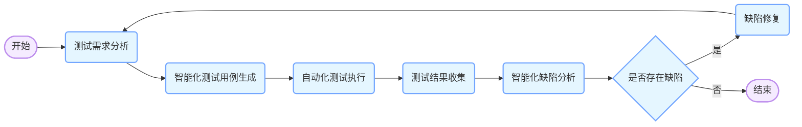

# AI时代的软件测试：自动化与智能化的融合

> 关键词：AI时代、软件测试、自动化、智能化、融合

> 摘要：在当今AI时代，软件系统的复杂度和规模不断增加，传统的软件测试方法已难以满足需求。自动化与智能化的融合为软件测试带来了新的发展方向。本文深入探讨了AI时代软件测试中自动化与智能化融合的相关内容，包括核心概念、算法原理、数学模型、项目实战、实际应用场景等，旨在为软件测试人员和相关技术爱好者提供全面而深入的技术指导，帮助其了解这一领域的发展趋势和挑战，提升软件测试的效率和质量。

## 1. 背景介绍 
### 1.1 目的和范围
随着人工智能技术的飞速发展，软件系统变得越来越复杂，功能也日益丰富。软件测试作为确保软件质量的关键环节，面临着巨大的挑战。本文章的目的在于深入研究AI时代软件测试中自动化与智能化融合的相关技术和方法，探讨其原理、实现步骤以及实际应用场景。范围涵盖了从核心概念的介绍到具体项目实战的分析，以及对未来发展趋势和挑战的展望。

### 1.2 预期读者
本文预期读者包括软件测试人员、软件开发工程师、软件架构师、对软件测试和人工智能技术感兴趣的研究人员以及相关专业的学生等。通过阅读本文，读者能够系统地了解AI时代软件测试中自动化与智能化融合的技术要点和应用方法。

### 1.3 文档结构概述
本文将按照以下结构进行阐述：首先介绍相关的背景知识，包括目的、预期读者和文档结构概述等；接着详细讲解核心概念与联系，通过文本示意图和Mermaid流程图进行直观展示；然后深入探讨核心算法原理和具体操作步骤，并使用Python源代码进行详细阐述；之后介绍数学模型和公式，并通过举例说明其应用；再通过项目实战展示代码实际案例和详细解释说明；接着分析实际应用场景；推荐相关的工具和资源；最后总结未来发展趋势与挑战，并提供常见问题与解答以及扩展阅读和参考资料。

### 1.4 术语表
#### 1.4.1 核心术语定义
- **软件测试**：对软件进行检查，以发现软件中存在的缺陷，确保软件的质量和功能符合预期。
- **自动化测试**：使用自动化工具和脚本执行测试用例，减少人工干预，提高测试效率。
- **智能化测试**：利用人工智能技术，如机器学习、深度学习等，实现测试用例的自动生成、缺陷的自动识别等功能，提升测试的准确性和智能化水平。
- **融合测试**：将自动化测试和智能化测试相结合，充分发挥两者的优势，提高软件测试的整体效果。

#### 1.4.2 相关概念解释
- **机器学习**：是一门多领域交叉学科，涉及概率论、统计学、逼近论、凸分析、算法复杂度理论等多门学科。它专门研究计算机怎样模拟或实现人类的学习行为，以获取新的知识或技能，重新组织已有的知识结构使之不断改善自身的性能。
- **深度学习**：是机器学习的一个分支领域，它是一种基于对数据进行表征学习的方法。深度学习通过构建具有很多层的神经网络模型，自动从大量数据中学习特征和模式，从而实现对数据的分类、预测等任务。

#### 1.4.3 缩略词列表
- **AI**：Artificial Intelligence，人工智能
- **ML**：Machine Learning，机器学习
- **DL**：Deep Learning，深度学习
- **GUI**：Graphical User Interface，图形用户界面
- **API**：Application Programming Interface，应用程序编程接口

## 2. 核心概念与联系 

### 2.1 自动化测试概念
自动化测试是指使用自动化测试工具和脚本来执行测试用例的过程。其核心思想是将人工执行的测试步骤转化为计算机可以执行的脚本，通过自动化工具自动运行这些脚本，从而实现测试的自动化。自动化测试可以大大提高测试效率，减少人工测试的工作量和错误率。例如，在Web应用程序的测试中，可以使用Selenium等自动化测试工具来模拟用户在浏览器中的操作，自动执行登录、数据输入、页面跳转等测试步骤。

### 2.2 智能化测试概念
智能化测试是利用人工智能技术来提升软件测试的效率和准确性。它主要包括测试用例的自动生成、缺陷的自动识别和分类、测试结果的自动分析等功能。例如，通过机器学习算法对历史测试数据进行分析和学习，生成新的测试用例；利用深度学习模型对软件代码进行分析，自动识别潜在的缺陷。

### 2.3 自动化与智能化的融合
自动化与智能化的融合是将自动化测试的高效性和智能化测试的智能性相结合。在融合测试中，自动化测试工具可以作为智能化测试的执行平台，而智能化测试则可以为自动化测试提供更智能的测试用例生成和缺陷分析方法。例如，智能化测试生成的测试用例可以通过自动化测试工具自动执行，执行结果再反馈给智能化测试系统进行分析和优化。

### 2.4 核心概念原理和架构的文本示意图
```plaintext
               自动化测试
                   |
                   |  执行测试用例
                   V
融合测试 <---- 智能化测试
                   |
                   |  生成测试用例、分析缺陷
                   V
               测试数据和代码
```

### 2.5 Mermaid流程图


## 3. 核心算法原理 & 具体操作步骤 

### 3.1 测试用例自动生成算法 - 遗传算法原理
遗传算法是一种模拟自然选择和遗传机制的优化算法，可用于测试用例的自动生成。其基本原理是通过模拟生物进化过程，不断迭代优化测试用例，以找到最优的测试用例集合。

#### 3.1.1 算法步骤
1. **初始化种群**：随机生成一组初始的测试用例，作为种群的第一代。
2. **适应度评估**：计算每个测试用例的适应度值，适应度值反映了测试用例的优劣程度。例如，可以根据测试用例覆盖的代码行数、发现的缺陷数量等指标来计算适应度值。
3. **选择操作**：根据适应度值选择一部分优秀的测试用例作为父代，用于产生下一代测试用例。
4. **交叉操作**：对父代测试用例进行交叉操作，生成新的测试用例。交叉操作模拟了生物的基因重组过程。
5. **变异操作**：对新生成的测试用例进行变异操作，引入新的基因，增加种群的多样性。
6. **重复步骤2 - 5**：直到满足终止条件，如达到最大迭代次数或找到满意的测试用例集合。

#### 3.1.2 Python源代码实现
```python
import random

# 测试用例的基因长度
GENE_LENGTH = 10
# 种群大小
POPULATION_SIZE = 50
# 最大迭代次数
MAX_GENERATIONS = 100
# 交叉概率
CROSSOVER_RATE = 0.8
# 变异概率
MUTATION_RATE = 0.2

# 初始化种群
def initialize_population():
    population = []
    for _ in range(POPULATION_SIZE):
        test_case = [random.randint(0, 1) for _ in range(GENE_LENGTH)]
        population.append(test_case)
    return population

# 适应度评估函数
def fitness_function(test_case):
    # 简单示例：计算测试用例中1的个数
    return sum(test_case)

# 选择操作
def selection(population):
    fitness_values = [fitness_function(test_case) for test_case in population]
    total_fitness = sum(fitness_values)
    selection_probabilities = [fitness / total_fitness for fitness in fitness_values]
    selected_indices = random.choices(range(POPULATION_SIZE), weights=selection_probabilities, k=POPULATION_SIZE)
    selected_population = [population[index] for index in selected_indices]
    return selected_population

# 交叉操作
def crossover(parent1, parent2):
    if random.random() < CROSSOVER_RATE:
        crossover_point = random.randint(1, GENE_LENGTH - 1)
        child1 = parent1[:crossover_point] + parent2[crossover_point:]
        child2 = parent2[:crossover_point] + parent1[crossover_point:]
        return child1, child2
    else:
        return parent1, parent2

# 变异操作
def mutation(test_case):
    for i in range(GENE_LENGTH):
        if random.random() < MUTATION_RATE:
            test_case[i] = 1 - test_case[i]
    return test_case

# 遗传算法主函数
def genetic_algorithm():
    population = initialize_population()
    for generation in range(MAX_GENERATIONS):
        selected_population = selection(population)
        new_population = []
        for i in range(0, POPULATION_SIZE, 2):
            parent1 = selected_population[i]
            parent2 = selected_population[i + 1]
            child1, child2 = crossover(parent1, parent2)
            child1 = mutation(child1)
            child2 = mutation(child2)
            new_population.extend([child1, child2])
        population = new_population
    best_test_case = max(population, key=fitness_function)
    return best_test_case

# 运行遗传算法
best_test_case = genetic_algorithm()
print("Best test case:", best_test_case)
```

### 3.2 缺陷自动识别算法 - 基于机器学习的分类算法原理
基于机器学习的分类算法可以用于缺陷的自动识别。常见的分类算法包括决策树、支持向量机、神经网络等。以决策树算法为例，其基本原理是通过对历史缺陷数据进行学习，构建一个决策树模型，根据输入的软件代码特征，判断是否存在缺陷。

#### 3.2.1 算法步骤
1. **数据收集和预处理**：收集历史缺陷数据和对应的软件代码特征数据，对数据进行清洗、归一化等预处理操作。
2. **特征选择**：选择与缺陷相关的特征，去除无关或冗余的特征。
3. **模型训练**：使用训练数据对决策树模型进行训练，调整模型的参数，使其能够准确地分类缺陷和非缺陷数据。
4. **模型评估**：使用测试数据对训练好的模型进行评估，计算模型的准确率、召回率等指标，评估模型的性能。
5. **缺陷识别**：使用训练好的模型对新的软件代码进行缺陷识别。

#### 3.2.2 Python源代码实现
```python
from sklearn.datasets import make_classification
from sklearn.model_selection import train_test_split
from sklearn.tree import DecisionTreeClassifier
from sklearn.metrics import accuracy_score

# 生成示例数据
X, y = make_classification(n_samples=1000, n_features=10, n_informative=5, n_redundant=0, random_state=42)

# 划分训练集和测试集
X_train, X_test, y_train, y_test = train_test_split(X, y, test_size=0.2, random_state=42)

# 创建决策树分类器
clf = DecisionTreeClassifier()

# 训练模型
clf.fit(X_train, y_train)

# 预测
y_pred = clf.predict(X_test)

# 评估模型
accuracy = accuracy_score(y_test, y_pred)
print("Accuracy:", accuracy)
```

## 4. 数学模型和公式 & 详细讲解 & 举例说明 

### 4.1 适应度函数数学模型
在遗传算法中，适应度函数用于评估测试用例的优劣程度。以计算测试用例覆盖的代码行数为例，假设测试用例 $t$ 覆盖的代码行数为 $c(t)$，总代码行数为 $C$，则适应度函数 $f(t)$ 可以表示为：

$$f(t)=\frac{c(t)}{C}$$

**详细讲解**：适应度函数的值越大，说明测试用例覆盖的代码行数越多，测试用例越优秀。通过适应度函数，遗传算法可以选择更优秀的测试用例进行进化。

**举例说明**：假设总代码行数 $C = 100$，测试用例 $t_1$ 覆盖的代码行数 $c(t_1) = 50$，测试用例 $t_2$ 覆盖的代码行数 $c(t_2) = 30$，则：

$$f(t_1)=\frac{50}{100}=0.5$$
$$f(t_2)=\frac{30}{100}=0.3$$

由于 $f(t_1) > f(t_2)$，所以测试用例 $t_1$ 比测试用例 $t_2$ 更优秀。

### 4.2 决策树分类算法数学模型
决策树分类算法的核心是构建决策树模型。决策树模型是一个树形结构，每个内部节点是一个特征上的测试，每个分支是一个测试输出，每个叶节点是一个类别。决策树的构建过程通常使用信息增益、信息增益比、基尼指数等指标来选择最优的划分特征。

以信息增益为例，信息增益是指在划分数据集前后信息的变化量。假设数据集 $D$ 中样本的类别集合为 $Y = \{y_1, y_2, \cdots, y_k\}$，数据集 $D$ 的信息熵为 $H(D)$，特征 $A$ 有 $n$ 个不同的取值 $\{a_1, a_2, \cdots, a_n\}$，将数据集 $D$ 按照特征 $A$ 进行划分，得到 $n$ 个子数据集 $D_1, D_2, \cdots, D_n$，则特征 $A$ 对数据集 $D$ 的信息增益 $g(D, A)$ 可以表示为：

$$g(D, A)=H(D)-\sum_{i=1}^{n}\frac{|D_i|}{|D|}H(D_i)$$

其中，$|D|$ 表示数据集 $D$ 的样本数量，$|D_i|$ 表示子数据集 $D_i$ 的样本数量，$H(D)$ 表示数据集 $D$ 的信息熵，$H(D_i)$ 表示子数据集 $D_i$ 的信息熵。信息熵的计算公式为：

$$H(D)=-\sum_{i=1}^{k}p_i\log_2p_i$$

其中，$p_i$ 表示类别 $y_i$ 在数据集 $D$ 中出现的概率。

**详细讲解**：信息增益越大，说明使用特征 $A$ 划分数据集后，信息的不确定性减少得越多，即特征 $A$ 对分类的贡献越大。在决策树的构建过程中，选择信息增益最大的特征作为当前节点的划分特征。

**举例说明**：假设有一个数据集 $D$ 包含 10 个样本，其中 6 个样本属于类别 $y_1$，4 个样本属于类别 $y_2$，则数据集 $D$ 的信息熵为：

$$p_1=\frac{6}{10}=0.6$$
$$p_2=\frac{4}{10}=0.4$$
$$H(D)=-0.6\log_20.6 - 0.4\log_20.4\approx 0.971$$

假设特征 $A$ 有两个不同的取值 $a_1$ 和 $a_2$，按照特征 $A$ 进行划分后，得到两个子数据集 $D_1$ 和 $D_2$，其中 $D_1$ 包含 4 个样本，3 个属于类别 $y_1$，1 个属于类别 $y_2$，$D_2$ 包含 6 个样本，3 个属于类别 $y_1$，3 个属于类别 $y_2$，则：

$$|D_1| = 4$$
$$|D_2| = 6$$
$$p_{11}=\frac{3}{4}=0.75$$
$$p_{12}=\frac{1}{4}=0.25$$
$$H(D_1)=-0.75\log_20.75 - 0.25\log_20.25\approx 0.811$$
$$p_{21}=\frac{3}{6}=0.5$$
$$p_{22}=\frac{3}{6}=0.5$$
$$H(D_2)=-0.5\log_20.5 - 0.5\log_20.5 = 1$$

则特征 $A$ 对数据集 $D$ 的信息增益为：

$$g(D, A)=0.971 - \frac{4}{10}\times 0.811 - \frac{6}{10}\times 1\approx 0.135$$

## 5. 项目实战：代码实际案例和详细解释说明 

### 5.1  开发环境搭建
#### 5.1.1 操作系统
选择合适的操作系统，如Windows、Linux或macOS。本项目实战以Windows 10为例。

#### 5.1.2 编程语言和开发工具
- **Python**：选择Python 3.7及以上版本。可以从Python官方网站（https://www.python.org/downloads/） 下载并安装。
- **IDE**：推荐使用PyCharm，它是一款功能强大的Python集成开发环境。可以从JetBrains官方网站（https://www.jetbrains.com/pycharm/download/） 下载并安装。

#### 5.1.3 相关库和框架
- **Selenium**：用于自动化Web测试。可以使用以下命令安装：
```bash
pip install selenium
```
- **Scikit-learn**：用于机器学习相关任务。可以使用以下命令安装：
```bash
pip install scikit-learn
```
- **TensorFlow**：用于深度学习相关任务。可以使用以下命令安装：
```bash
pip install tensorflow
```

### 5.2  源代码详细实现和代码解读
#### 5.2.1 自动化Web测试示例
以下是一个使用Selenium进行自动化Web测试的示例代码：
```python
from selenium import webdriver
from selenium.webdriver.common.by import By
import time

# 初始化浏览器驱动
driver = webdriver.Chrome()

# 打开网页
driver.get("https://www.example.com")

# 查找用户名输入框并输入用户名
username_input = driver.find_element(By.ID, "username")
username_input.send_keys("testuser")

# 查找密码输入框并输入密码
password_input = driver.find_element(By.ID, "password")
password_input.send_keys("testpassword")

# 查找登录按钮并点击
login_button = driver.find_element(By.ID, "login-button")
login_button.click()

# 等待页面加载
time.sleep(3)

# 验证登录是否成功
if "Welcome" in driver.page_source:
    print("Login successful!")
else:
    print("Login failed!")

# 关闭浏览器
driver.quit()
```
**代码解读**：
1. **导入必要的库**：导入`selenium`库中的`webdriver`和`By`类，以及`time`库。
2. **初始化浏览器驱动**：使用`webdriver.Chrome()`初始化Chrome浏览器驱动。
3. **打开网页**：使用`driver.get()`方法打开指定的网页。
4. **查找元素并操作**：使用`driver.find_element()`方法查找用户名输入框、密码输入框和登录按钮，并使用`send_keys()`方法输入用户名和密码，使用`click()`方法点击登录按钮。
5. **等待页面加载**：使用`time.sleep()`方法等待页面加载。
6. **验证登录结果**：通过检查页面源代码中是否包含“Welcome”来验证登录是否成功。
7. **关闭浏览器**：使用`driver.quit()`方法关闭浏览器。

#### 5.2.2 基于机器学习的缺陷自动识别示例
以下是一个基于Scikit-learn的决策树分类器进行缺陷自动识别的示例代码：
```python
from sklearn.datasets import make_classification
from sklearn.model_selection import train_test_split
from sklearn.tree import DecisionTreeClassifier
from sklearn.metrics import accuracy_score

# 生成示例数据
X, y = make_classification(n_samples=1000, n_features=10, n_informative=5, n_redundant=0, random_state=42)

# 划分训练集和测试集
X_train, X_test, y_train, y_test = train_test_split(X, y, test_size=0.2, random_state=42)

# 创建决策树分类器
clf = DecisionTreeClassifier()

# 训练模型
clf.fit(X_train, y_train)

# 预测
y_pred = clf.predict(X_test)

# 评估模型
accuracy = accuracy_score(y_test, y_pred)
print("Accuracy:", accuracy)
```
**代码解读**：
1. **导入必要的库**：导入`sklearn`库中的`make_classification`、`train_test_split`、`DecisionTreeClassifier`和`accuracy_score`类。
2. **生成示例数据**：使用`make_classification()`方法生成示例数据。
3. **划分训练集和测试集**：使用`train_test_split()`方法将数据划分为训练集和测试集。
4. **创建决策树分类器**：使用`DecisionTreeClassifier()`创建决策树分类器。
5. **训练模型**：使用`fit()`方法对模型进行训练。
6. **预测**：使用`predict()`方法对测试集进行预测。
7. **评估模型**：使用`accuracy_score()`方法计算模型的准确率。

### 5.3  代码解读与分析
#### 5.3.1 自动化Web测试代码分析
- **优点**：自动化Web测试可以提高测试效率，减少人工测试的工作量和错误率。通过Selenium库，可以方便地模拟用户在浏览器中的操作，实现自动化测试。
- **缺点**：自动化Web测试的维护成本较高，当网页的结构或元素的ID、名称等发生变化时，需要相应地修改测试代码。

#### 5.3.2 基于机器学习的缺陷自动识别代码分析
- **优点**：基于机器学习的缺陷自动识别可以提高缺陷识别的准确性和效率。通过对历史缺陷数据的学习，模型可以自动识别潜在的缺陷。
- **缺点**：机器学习模型的训练需要大量的历史缺陷数据，并且模型的性能受到数据质量和特征选择的影响。此外，模型的解释性较差，难以理解模型的决策过程。

## 6. 实际应用场景 
### 6.1 互联网应用测试
在互联网应用开发中，软件的功能和用户界面不断更新，传统的人工测试难以满足快速迭代的需求。自动化与智能化的融合测试可以实现对互联网应用的快速、全面测试。例如，使用自动化测试工具模拟用户在不同浏览器和设备上的操作，对应用的功能、性能、兼容性等进行测试；利用智能化测试技术自动生成测试用例，提高测试用例的覆盖率和有效性。

### 6.2 金融软件测试
金融软件对安全性和稳定性要求极高，任何缺陷都可能导致严重的后果。自动化与智能化的融合测试可以帮助金融软件企业提高软件测试的质量和效率。例如，使用自动化测试工具对金融交易系统进行压力测试和安全测试，确保系统在高并发情况下的稳定性和安全性；利用智能化测试技术对金融数据进行分析和验证，及时发现潜在的风险和缺陷。

### 6.3 医疗软件测试
医疗软件直接关系到患者的生命健康，其质量和安全性至关重要。自动化与智能化的融合测试可以为医疗软件的质量保障提供有力支持。例如，使用自动化测试工具对医疗设备的控制软件进行功能测试和性能测试，确保设备的正常运行；利用智能化测试技术对医疗数据进行分析和挖掘，帮助医生做出更准确的诊断和治疗决策。

### 6.4 嵌入式软件测试
嵌入式软件通常运行在资源受限的设备上，对软件的实时性、可靠性和功耗等方面有较高的要求。自动化与智能化的融合测试可以提高嵌入式软件测试的效率和准确性。例如，使用自动化测试工具对嵌入式系统的驱动程序和应用程序进行测试，确保系统的稳定性和兼容性；利用智能化测试技术对嵌入式软件的性能进行优化，降低功耗和提高实时性。

## 7. 工具和资源推荐
### 7.1 学习资源推荐
#### 7.1.1 书籍推荐
- 《软件测试的艺术》：本书是软件测试领域的经典著作，全面介绍了软件测试的基本概念、方法和技术，对软件测试人员有很大的帮助。
- 《Python自动化测试实战》：本书详细介绍了如何使用Python进行自动化测试，包括自动化测试框架的搭建、测试用例的编写和执行等内容。
- 《机器学习》：本书是机器学习领域的经典教材，系统地介绍了机器学习的基本概念、算法和应用，适合对机器学习感兴趣的读者阅读。

#### 7.1.2 在线课程
- Coursera上的“Software Testing”课程：由知名大学的教授授课，全面介绍了软件测试的相关知识和技能。
- edX上的“Python for Data Science and Machine Learning Bootcamp”课程：该课程涵盖了Python编程、数据分析和机器学习等方面的内容，对软件测试人员了解智能化测试技术有很大的帮助。
- 网易云课堂上的“自动化测试实战教程”：该课程结合实际项目，详细介绍了自动化测试的流程和方法，具有很强的实用性。

#### 7.1.3 技术博客和网站
- 开源中国（https://www.oschina.net/）：提供了丰富的开源项目和技术文章，对软件测试人员了解最新的技术动态和开源工具很有帮助。
- 博客园（https://www.cnblogs.com/）：汇聚了众多技术博主的文章，其中不乏软件测试和人工智能方面的优秀文章。
- 知乎（https://www.zhihu.com/）：可以在知乎上搜索软件测试和人工智能相关的问题和回答，了解行业内的最新观点和经验分享。

### 7.2 开发工具框架推荐
#### 7.2.1 IDE和编辑器
- PyCharm：功能强大的Python集成开发环境，支持代码编辑、调试、版本控制等功能，对Python自动化测试和机器学习开发有很好的支持。
- Visual Studio Code：轻量级的代码编辑器，支持多种编程语言和插件扩展，适合快速开发和调试。
- IntelliJ IDEA：一款功能强大的Java集成开发环境，也支持Python等其他编程语言，对软件开发和测试有很好的支持。

#### 7.2.2 调试和性能分析工具
- PyCharm Debugger：PyCharm自带的调试工具，可以方便地对Python代码进行调试，查看变量的值和程序的执行流程。
- Chrome DevTools：Chrome浏览器自带的开发者工具，可用于调试Web应用程序，分析性能瓶颈和网络请求等。
- Profiler：Python自带的性能分析工具，可以分析Python代码的执行时间和内存使用情况，帮助优化代码性能。

#### 7.2.3 相关框架和库
- Selenium：用于自动化Web测试的框架，支持多种浏览器和编程语言，可模拟用户在浏览器中的操作。
- Appium：用于自动化移动应用测试的框架，支持iOS和Android平台，可实现跨平台的移动应用测试。
- Scikit-learn：用于机器学习的Python库，提供了丰富的机器学习算法和工具，可用于缺陷自动识别、测试用例自动生成等任务。
- TensorFlow：用于深度学习的开源框架，可用于构建和训练深度学习模型，实现更复杂的智能化测试任务。

### 7.3 相关论文著作推荐
#### 7.3.1 经典论文
- “A Survey on Software Testing: From Its Birth to the Present”：该论文全面回顾了软件测试的发展历程，对软件测试的基本概念、方法和技术进行了系统的总结。
- “Automated Test Case Generation: A Survey”：该论文对自动化测试用例生成的相关技术进行了详细的综述，分析了各种方法的优缺点和应用场景。
- “Machine Learning in Software Testing: A Systematic Literature Review”：该论文对机器学习在软件测试中的应用进行了系统的文献综述，总结了机器学习在测试用例生成、缺陷预测、测试结果分析等方面的研究成果。

#### 7.3.2 最新研究成果
- 关注顶级学术会议和期刊，如ICSE（International Conference on Software Engineering）、FSE（Foundations of Software Engineering）、TSE（IEEE Transactions on Software Engineering）等，及时了解软件测试和人工智能领域的最新研究成果。

#### 7.3.3 应用案例分析
- 可以在相关的技术博客、行业报告和学术论文中查找软件测试中自动化与智能化融合的应用案例分析，了解实际项目中的应用经验和最佳实践。

## 8. 总结：未来发展趋势与挑战
### 8.1 未来发展趋势
#### 8.1.1 智能化程度不断提高
随着人工智能技术的不断发展，软件测试中的智能化程度将不断提高。未来，智能化测试将能够自动生成更全面、更有效的测试用例，自动识别和分类更复杂的缺陷，并且能够根据测试结果自动调整测试策略，实现自适应测试。

#### 8.1.2 与DevOps深度融合
DevOps强调软件开发和运维的一体化，自动化与智能化的融合测试将成为DevOps流程中不可或缺的一部分。通过与持续集成、持续交付等环节的深度融合，实现软件的快速迭代和高质量交付。

#### 8.1.3 跨平台和跨领域测试
随着软件系统的多元化和复杂化，跨平台和跨领域测试将变得越来越重要。未来的软件测试工具和技术将能够支持多种操作系统、设备和应用领域的测试，实现全面的测试覆盖。

#### 8.1.4 测试数据的价值挖掘
测试数据是软件测试的重要资产，未来将更加注重对测试数据的价值挖掘。通过对测试数据的分析和挖掘，可以发现软件系统中的潜在问题和规律，为软件的优化和改进提供有力支持。

### 8.2 挑战
#### 8.2.1 数据质量和隐私问题
智能化测试需要大量的高质量数据进行训练和学习，但是数据的收集、清洗和标注是一个复杂而耗时的过程。此外，测试数据中可能包含用户的隐私信息，如何保证数据的安全性和隐私性是一个亟待解决的问题。

#### 8.2.2 技术门槛和人才短缺
自动化与智能化的融合测试涉及到多种技术领域，如人工智能、自动化测试、软件开发等，对测试人员的技术水平要求较高。目前，相关领域的专业人才短缺，如何培养和吸引优秀的测试人才是一个挑战。

#### 8.2.3 模型的可解释性和可靠性
智能化测试中使用的机器学习和深度学习模型通常是黑盒模型，其决策过程难以解释。在一些对安全性和可靠性要求较高的领域，如金融、医疗等，模型的可解释性和可靠性是一个重要的问题。

#### 8.2.4 与现有测试流程的集成
将自动化与智能化的融合测试技术集成到现有的测试流程中是一个挑战。需要解决测试工具和技术之间的兼容性问题，以及与现有测试流程的衔接问题，确保测试工作的顺利进行。

## 9. 附录：常见问题与解答
### 9.1 自动化测试和智能化测试有什么区别？
自动化测试主要是使用自动化工具和脚本来执行测试用例，减少人工干预，提高测试效率。而智能化测试则是利用人工智能技术，如机器学习、深度学习等，实现测试用例的自动生成、缺陷的自动识别等功能，提升测试的准确性和智能化水平。

### 9.2 如何选择合适的自动化测试工具？
选择合适的自动化测试工具需要考虑以下因素：
- **测试对象**：不同的测试对象（如Web应用、移动应用、桌面应用等）需要选择不同的自动化测试工具。
- **编程语言支持**：选择支持自己熟悉的编程语言的自动化测试工具，方便开发和维护测试脚本。
- **社区和文档支持**：选择有活跃社区和丰富文档支持的自动化测试工具，便于遇到问题时及时解决。
- **成本**：考虑自动化测试工具的购买成本、使用成本和维护成本等因素。

### 9.3 智能化测试需要多少数据才能训练出有效的模型？
智能化测试需要的数据量取决于多种因素，如模型的复杂度、数据的质量和特征等。一般来说，数据量越大，模型的性能越好。但是，过多的数据也可能导致训练时间过长和过拟合等问题。在实际应用中，需要根据具体情况进行数据的收集和选择，并通过交叉验证等方法来评估模型的性能。

### 9.4 如何确保自动化与智能化融合测试的质量？
确保自动化与智能化融合测试的质量可以从以下几个方面入手：
- **测试用例设计**：设计全面、有效的测试用例，覆盖软件的各种功能和场景。
- **模型评估**：对智能化测试中使用的模型进行严格的评估，确保模型的准确性和可靠性。
- **测试过程监控**：在测试过程中，实时监控测试结果和系统状态，及时发现和解决问题。
- **持续改进**：根据测试结果和用户反馈，不断优化测试用例和模型，提高测试的质量和效率。

## 10. 扩展阅读 & 参考资料
### 10.1 扩展阅读
- 《人工智能时代的软件工程》：本书探讨了人工智能技术对软件工程的影响和挑战，以及如何在人工智能时代进行有效的软件开发和测试。
- 《软件测试自动化最佳实践》：本书介绍了软件测试自动化的最佳实践和方法，对提高自动化测试的效率和质量有很大的帮助。
- 《深度学习实战》：本书详细介绍了深度学习的基本原理和应用，对了解智能化测试中的深度学习技术有很大的帮助。

### 10.2 参考资料
- 各自动化测试工具和机器学习库的官方文档，如Selenium、Scikit-learn、TensorFlow等。
- 相关的学术论文和研究报告，可通过学术数据库（如IEEE Xplore、ACM Digital Library等）进行查找。
- 行业内的技术博客和论坛，如Stack Overflow、Reddit等，可获取最新的技术动态和经验分享。