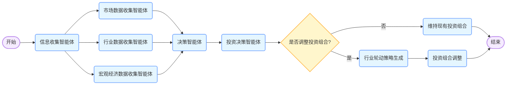

# AI智能体协作：优化价值投资的行业轮动策略

> 关键词：AI智能体、价值投资、行业轮动策略、协作优化、金融投资

> 摘要：本文聚焦于AI智能体协作在优化价值投资的行业轮动策略中的应用。首先介绍了相关背景知识，包括目的、预期读者等。接着阐述了核心概念及联系，详细讲解了核心算法原理和具体操作步骤，通过Python代码进行了实现。还深入探讨了数学模型和公式，并给出了具体举例。在项目实战部分，提供了开发环境搭建、源代码实现与解读。随后分析了实际应用场景，推荐了相关工具和资源。最后对未来发展趋势与挑战进行总结，同时给出常见问题解答和参考资料，旨在为投资者和相关研究人员提供全面且深入的关于利用AI智能体协作优化行业轮动策略的技术指导和理论依据。

## 1. 背景介绍 
### 1.1 目的和范围
在价值投资领域，行业轮动策略旨在通过在不同行业间的资产配置调整，以获取超越市场平均水平的收益。然而，传统的行业轮动策略往往依赖于投资者的经验和主观判断，缺乏对复杂市场信息的全面、快速分析能力。本研究的目的在于引入AI智能体协作的方法，利用其强大的数据分析和决策能力，优化价值投资的行业轮动策略，提高投资决策的准确性和效率。

本研究的范围涵盖了AI智能体的基本原理、协作机制，以及如何将其应用于行业轮动策略的制定和优化。同时，通过实际案例分析和代码实现，验证该方法的可行性和有效性。

### 1.2 预期读者
本文预期读者包括金融投资领域的专业人士，如基金经理、投资顾问等，他们希望借助AI技术提升投资策略的效果；计算机科学领域的研究人员和开发者，对AI智能体在金融领域的应用感兴趣；以及对价值投资和行业轮动策略有一定了解，希望深入学习相关技术的爱好者。

### 1.3 文档结构概述
本文首先介绍相关背景知识，包括目的、预期读者和文档结构等内容。接着阐述AI智能体协作与价值投资行业轮动策略的核心概念及联系，通过文本示意图和Mermaid流程图进行直观展示。然后详细讲解核心算法原理和具体操作步骤，并给出Python代码实现。随后探讨数学模型和公式，通过具体例子加深理解。在项目实战部分，介绍开发环境搭建、源代码实现与解读。之后分析实际应用场景，推荐相关工具和资源。最后对未来发展趋势与挑战进行总结，同时给出常见问题解答和参考资料。

### 1.4 术语表
#### 1.4.1 核心术语定义
- **AI智能体**：一种能够感知环境、进行决策并采取行动的智能实体，它可以基于预设的规则或学习算法，在特定环境中实现自主或协作的任务执行。
- **价值投资**：一种投资策略，其核心思想是通过分析股票的内在价值，寻找被市场低估的股票进行投资，以获取长期的资本增值。
- **行业轮动策略**：根据经济周期、行业景气度等因素，在不同行业之间进行资产配置的调整，以实现投资组合的优化和收益的最大化。
- **协作优化**：多个AI智能体通过合作和信息共享，共同优化决策过程，提高整体性能和效率。

#### 1.4.2 相关概念解释
- **经济周期**：经济活动在运行过程中呈现出的扩张和收缩交替的周期性变化，通常包括复苏、繁荣、衰退和萧条四个阶段。不同行业在经济周期的不同阶段表现出不同的景气度，这是行业轮动策略的重要依据。
- **行业景气度**：反映行业发展状况和市场前景的综合指标，包括行业的盈利能力、市场需求、竞争格局等多个方面。行业景气度的变化会影响行业内企业的业绩和股票价格，从而为行业轮动提供机会。

#### 1.4.3 缩略词列表
- **AI**：Artificial Intelligence（人工智能）
- **ML**：Machine Learning（机器学习）
- **RL**：Reinforcement Learning（强化学习）

## 2. 核心概念与联系 
### 核心概念原理
#### AI智能体
AI智能体是一种具有自主决策和行动能力的智能实体。它可以通过传感器感知环境信息，然后根据预设的规则或学习算法进行决策，最后通过执行器采取相应的行动。在金融投资领域，AI智能体可以感知市场信息，如股票价格、行业数据等，然后根据投资策略进行决策，如买入、卖出或持有股票。

#### 价值投资
价值投资的核心原理是寻找被市场低估的股票。投资者通过对公司的财务报表、行业前景等进行分析，评估公司的内在价值。如果股票的市场价格低于其内在价值，投资者认为该股票具有投资价值，从而进行买入操作。随着市场对公司价值的重新认识，股票价格可能会上涨，投资者可以获得资本增值。

#### 行业轮动策略
行业轮动策略基于经济周期和行业景气度的变化。在经济周期的不同阶段，不同行业的表现会有所差异。例如，在经济复苏阶段，制造业、建筑业等周期性行业通常会率先受益；而在经济繁荣阶段，消费、金融等行业可能会表现出色。投资者通过分析经济周期和行业景气度，调整投资组合中不同行业的权重，以实现收益的最大化。

#### 协作优化
协作优化是指多个AI智能体通过合作和信息共享，共同优化决策过程。在行业轮动策略中，不同的AI智能体可以负责不同的任务，如市场信息收集、行业分析、投资决策等。通过协作，AI智能体可以充分利用各自的优势，提高决策的准确性和效率。

### 架构的文本示意图
```plaintext
                          AI智能体协作系统
                             /           \
                        信息收集智能体    决策智能体
                           /   |   \         |
  市场数据收集智能体 行业数据收集智能体 宏观经济数据收集智能体  投资决策智能体
                                                     |
                                             行业轮动策略生成
                                                     |
                                             投资组合调整
```

### Mermaid流程图


## 3. 核心算法原理 & 具体操作步骤 
### 核心算法原理
本研究采用强化学习算法来实现AI智能体的决策过程。强化学习是一种通过智能体与环境进行交互，不断尝试不同的行动并根据环境反馈的奖励来学习最优策略的方法。在行业轮动策略中，智能体的行动是调整投资组合中不同行业的权重，环境反馈的奖励是投资组合的收益率。

### 具体操作步骤
1. **数据收集**：收集市场数据、行业数据和宏观经济数据，包括股票价格、行业指数、GDP增长率、通货膨胀率等。
2. **数据预处理**：对收集到的数据进行清洗、归一化等处理，以提高数据的质量和可用性。
3. **特征工程**：从预处理后的数据中提取有用的特征，如行业估值指标、经济周期指标等。
4. **智能体训练**：使用强化学习算法对智能体进行训练，使其学习最优的行业轮动策略。
5. **策略评估**：使用历史数据对训练好的智能体进行评估，计算其收益率和风险指标。
6. **策略优化**：根据评估结果对智能体的参数进行调整，优化行业轮动策略。
7. **实时决策**：在实际投资过程中，智能体根据实时数据进行决策，调整投资组合的权重。

### Python源代码实现
```python
import numpy as np
import pandas as pd
from sklearn.preprocessing import MinMaxScaler
import gym
from gym import spaces
from stable_baselines3 import PPO

# 定义自定义环境类
class IndustryRotationEnv(gym.Env):
    def __init__(self, data, initial_balance=100000):
        super(IndustryRotationEnv, self).__init__()
        self.data = data
        self.initial_balance = initial_balance
        self.balance = initial_balance
        self.current_step = 0
        self.num_industries = data.shape[1] - 1  # 减去日期列
        self.action_space = spaces.Box(low=0, high=1, shape=(self.num_industries,), dtype=np.float32)
        self.observation_space = spaces.Box(low=-np.inf, high=np.inf, shape=(self.num_industries,), dtype=np.float32)

    def reset(self):
        self.balance = self.initial_balance
        self.current_step = 0
        return self._get_obs()

    def step(self, action):
        # 归一化行动
        action = action / np.sum(action)
        prev_balance = self.balance
        returns = self.data.iloc[self.current_step, 1:].values
        portfolio_value = np.sum(action * returns) * self.balance
        self.balance = portfolio_value
        reward = self.balance - prev_balance
        self.current_step += 1
        done = self.current_step >= len(self.data) - 1
        info = {}
        return self._get_obs(), reward, done, info

    def _get_obs(self):
        return self.data.iloc[self.current_step, 1:].values

# 数据加载和预处理
data = pd.read_csv('industry_data.csv')
scaler = MinMaxScaler()
data.iloc[:, 1:] = scaler.fit_transform(data.iloc[:, 1:])

# 创建环境
env = IndustryRotationEnv(data)

# 训练模型
model = PPO('MlpPolicy', env, verbose=1)
model.learn(total_timesteps=10000)

# 测试模型
obs = env.reset()
done = False
while not done:
    action, _states = model.predict(obs)
    obs, rewards, done, info = env.step(action)
```

## 4. 数学模型和公式 & 详细讲解 & 举例说明 
### 数学模型
本研究采用马尔可夫决策过程（MDP）来描述AI智能体的决策过程。MDP是一个五元组 $(S, A, P, R, \gamma)$，其中：
- $S$ 是状态空间，表示智能体所处的环境状态。
- $A$ 是行动空间，表示智能体可以采取的行动。
- $P$ 是状态转移概率，表示在状态 $s$ 下采取行动 $a$ 后转移到状态 $s'$ 的概率。
- $R$ 是奖励函数，表示在状态 $s$ 下采取行动 $a$ 后获得的奖励。
- $\gamma$ 是折扣因子，表示未来奖励的重要性。

### 公式
智能体的目标是最大化长期累积奖励，其价值函数可以表示为：
$$V^{\pi}(s) = \mathbb{E}_{\pi}\left[\sum_{t=0}^{\infty}\gamma^{t}R_{t+1} \mid S_0 = s\right]$$
其中，$\pi$ 是策略，表示在每个状态下采取行动的概率分布；$R_{t+1}$ 是在时间步 $t+1$ 获得的奖励；$S_0$ 是初始状态。

最优价值函数可以通过贝尔曼方程求解：
$$V^{*}(s) = \max_{a \in A}\left[R(s, a) + \gamma\sum_{s' \in S}P(s' \mid s, a)V^{*}(s')\right]$$

### 详细讲解
在行业轮动策略中，状态 $s$ 可以表示为市场数据、行业数据和宏观经济数据的组合；行动 $a$ 可以表示为投资组合中不同行业的权重；奖励 $R$ 可以表示为投资组合的收益率。智能体通过不断与环境进行交互，根据贝尔曼方程更新价值函数，从而学习到最优的行业轮动策略。

### 举例说明
假设市场上有三个行业：金融、消费和科技。初始状态下，智能体的投资组合权重为 $(0.3, 0.4, 0.3)$。在某个时间步，智能体根据当前状态选择了新的行动 $(0.4, 0.3, 0.3)$。根据行业的收益率数据，计算出投资组合的收益率为 $0.05$，则奖励 $R = 0.05 \times$ 投资组合价值。智能体根据这个奖励更新价值函数，不断优化自己的策略。

## 5. 项目实战：代码实际案例和详细解释说明 
### 5.1  开发环境搭建
1. **安装Python**：推荐使用Python 3.7及以上版本，可以从Python官方网站（https://www.python.org/downloads/）下载安装。
2. **安装必要的库**：使用pip命令安装所需的库，包括pandas、numpy、scikit-learn、gym、stable-baselines3等。
```bash
pip install pandas numpy scikit-learn gym stable-baselines3
```
3. **准备数据**：收集市场数据、行业数据和宏观经济数据，并保存为CSV文件，文件格式为日期、行业1收益率、行业2收益率等。

### 5.2  源代码详细实现和代码解读
```python
import numpy as np
import pandas as pd
from sklearn.preprocessing import MinMaxScaler
import gym
from gym import spaces
from stable_baselines3 import PPO

# 定义自定义环境类
class IndustryRotationEnv(gym.Env):
    def __init__(self, data, initial_balance=100000):
        super(IndustryRotationEnv, self).__init__()
        self.data = data
        self.initial_balance = initial_balance
        self.balance = initial_balance
        self.current_step = 0
        self.num_industries = data.shape[1] - 1  # 减去日期列
        self.action_space = spaces.Box(low=0, high=1, shape=(self.num_industries,), dtype=np.float32)
        self.observation_space = spaces.Box(low=-np.inf, high=np.inf, shape=(self.num_industries,), dtype=np.float32)

    def reset(self):
        self.balance = self.initial_balance
        self.current_step = 0
        return self._get_obs()

    def step(self, action):
        # 归一化行动
        action = action / np.sum(action)
        prev_balance = self.balance
        returns = self.data.iloc[self.current_step, 1:].values
        portfolio_value = np.sum(action * returns) * self.balance
        self.balance = portfolio_value
        reward = self.balance - prev_balance
        self.current_step += 1
        done = self.current_step >= len(self.data) - 1
        info = {}
        return self._get_obs(), reward, done, info

    def _get_obs(self):
        return self.data.iloc[self.current_step, 1:].values

# 数据加载和预处理
data = pd.read_csv('industry_data.csv')
scaler = MinMaxScaler()
data.iloc[:, 1:] = scaler.fit_transform(data.iloc[:, 1:])

# 创建环境
env = IndustryRotationEnv(data)

# 训练模型
model = PPO('MlpPolicy', env, verbose=1)
model.learn(total_timesteps=10000)

# 测试模型
obs = env.reset()
done = False
while not done:
    action, _states = model.predict(obs)
    obs, rewards, done, info = env.step(action)
```
### 代码解读与分析
1. **自定义环境类 `IndustryRotationEnv`**：继承自 `gym.Env` 类，实现了自定义的强化学习环境。
    - `__init__` 方法：初始化环境的参数，包括数据、初始资金、行动空间和观察空间等。
    - `reset` 方法：重置环境状态，返回初始观察值。
    - `step` 方法：执行一个时间步的行动，返回新的观察值、奖励、是否结束和额外信息。
    - `_get_obs` 方法：获取当前环境的观察值。
2. **数据加载和预处理**：使用 `pandas` 库加载CSV文件，并使用 `MinMaxScaler` 对数据进行归一化处理。
3. **创建环境**：实例化自定义环境类 `IndustryRotationEnv`。
4. **训练模型**：使用 `stable-baselines3` 库中的 `PPO` 算法对智能体进行训练。
5. **测试模型**：使用训练好的模型在环境中进行测试，观察智能体的决策过程和投资组合的变化。

## 6. 实际应用场景 
### 基金管理
基金经理可以利用AI智能体协作优化行业轮动策略，调整基金的投资组合。通过实时分析市场数据和行业动态，智能体可以及时发现投资机会，提高基金的收益率和风险控制能力。

### 个人投资
个人投资者可以借助AI智能体的决策建议，制定适合自己的行业轮动策略。智能体可以根据投资者的风险偏好和投资目标，提供个性化的投资方案，帮助投资者实现资产的增值。

### 金融研究
金融研究机构可以使用AI智能体协作的方法，对行业轮动策略进行深入研究。通过模拟不同的市场环境和投资策略，研究人员可以更好地理解行业轮动的规律和影响因素，为金融理论的发展提供支持。

## 7. 工具和资源推荐
### 7.1 学习资源推荐
#### 7.1.1 书籍推荐
- 《Python机器学习》：介绍了Python在机器学习领域的应用，包括数据预处理、模型训练和评估等内容。
- 《强化学习：原理与Python实现》：详细讲解了强化学习的基本原理和算法，并通过Python代码进行了实现。
- 《金融计量学》：介绍了金融领域的计量方法和模型，有助于理解行业轮动策略的理论基础。

#### 7.1.2 在线课程
- Coursera上的“机器学习”课程：由斯坦福大学的Andrew Ng教授主讲，是机器学习领域的经典课程。
- edX上的“强化学习基础”课程：介绍了强化学习的基本概念和算法，适合初学者学习。
- 中国大学MOOC上的“金融投资学”课程：系统讲解了金融投资的理论和实践，对理解行业轮动策略有很大帮助。

#### 7.1.3 技术博客和网站
- Medium：有很多关于AI、机器学习和金融投资的技术博客文章，可以获取最新的研究成果和实践经验。
- Towards Data Science：专注于数据科学和机器学习领域的技术文章，提供了丰富的案例和代码实现。
- 雪球网：是一个金融投资社区，有很多投资者分享的投资经验和行业分析文章。

### 7.2 开发工具框架推荐
#### 7.2.1 IDE和编辑器
- PyCharm：是一款专业的Python集成开发环境，提供了丰富的代码编辑、调试和版本控制功能。
- Jupyter Notebook：是一个交互式的开发环境，适合进行数据探索和模型实验。
- Visual Studio Code：是一款轻量级的代码编辑器，支持多种编程语言和插件扩展。

#### 7.2.2 调试和性能分析工具
- PDB：Python自带的调试工具，可以帮助开发者定位代码中的错误。
- cProfile：Python的性能分析工具，可以分析代码的运行时间和资源消耗情况。
- TensorBoard：是TensorFlow的可视化工具，可以用于可视化模型的训练过程和性能指标。

#### 7.2.3 相关框架和库
- Pandas：是Python中用于数据处理和分析的库，提供了高效的数据结构和数据操作方法。
- Numpy：是Python中用于科学计算的库，提供了高效的数组操作和数学函数。
- Scikit-learn：是Python中用于机器学习的库，提供了丰富的机器学习算法和工具。
- Gym：是OpenAI开发的强化学习环境库，提供了多种标准的强化学习环境。
- Stable-Baselines3：是一个基于PyTorch的强化学习库，提供了多种预训练的强化学习算法。

### 7.3 相关论文著作推荐
#### 7.3.1 经典论文
- “Reinforcement Learning: An Introduction” by Richard S. Sutton and Andrew G. Barto：是强化学习领域的经典著作，系统介绍了强化学习的基本原理和算法。
- “A Unified Approach to Interpreting Model Predictions” by Scott Lundberg and Su-In Lee：提出了SHAP值的概念，用于解释机器学习模型的预测结果。

#### 7.3.2 最新研究成果
- 关注顶级学术会议如NeurIPS、ICML、KDD等的论文，了解AI智能体和金融投资领域的最新研究进展。
- 查阅金融领域的顶级期刊如Journal of Finance、Review of Financial Studies等的文章，获取关于行业轮动策略的最新研究成果。

#### 7.3.3 应用案例分析
- 分析一些知名基金公司和投资机构的研究报告和案例，了解他们在实际应用中如何利用AI智能体优化行业轮动策略。
- 关注金融科技公司的技术博客和案例分享，学习他们在AI智能体应用方面的实践经验。

## 8. 总结：未来发展趋势与挑战
### 未来发展趋势
- **多智能体协作的深化**：未来，AI智能体之间的协作将更加复杂和深入。不同类型的智能体可以在不同的层次和维度上进行协作，如市场趋势预测智能体、风险评估智能体和投资决策智能体等，共同优化行业轮动策略。
- **与其他技术的融合**：AI智能体将与区块链、物联网等技术进行融合。例如，区块链技术可以提供更安全、透明的交易环境，物联网技术可以提供更丰富的市场数据，从而进一步提升行业轮动策略的效果。
- **个性化投资服务的发展**：随着人工智能技术的发展，AI智能体可以更好地理解投资者的个性化需求和风险偏好，提供更加个性化的行业轮动策略和投资建议。

### 挑战
- **数据质量和隐私问题**：AI智能体的决策依赖于大量的数据，数据的质量和隐私问题是需要解决的关键挑战。不准确或不完整的数据可能导致智能体做出错误的决策，而数据隐私问题可能会影响投资者的信任。
- **模型解释性和可解释性**：AI智能体的决策过程往往是复杂的黑盒模型，缺乏解释性和可解释性。投资者和监管机构需要了解智能体的决策依据，以便更好地评估风险和信任度。
- **市场不确定性和复杂性**：金融市场具有高度的不确定性和复杂性，AI智能体难以完全准确地预测市场变化。如何在复杂多变的市场环境中优化行业轮动策略，是一个长期的挑战。

## 9. 附录：常见问题与解答
### 1. AI智能体协作优化行业轮动策略的效果如何评估？
可以使用多种指标来评估，如收益率、夏普比率、最大回撤等。收益率反映了投资组合的盈利情况，夏普比率衡量了单位风险下的收益水平，最大回撤表示投资组合在一段时间内的最大损失。

### 2. 如何选择合适的AI智能体算法？
需要根据具体的问题和数据特点来选择。例如，如果问题具有明确的奖励机制和状态转移规则，可以选择强化学习算法；如果需要对数据进行分类和预测，可以选择监督学习算法。

### 3. 数据预处理对AI智能体的训练有什么影响？
数据预处理可以提高数据的质量和可用性，减少噪声和异常值的影响。例如，归一化处理可以使不同特征具有相同的尺度，有助于提高模型的收敛速度和性能。

### 4. AI智能体协作优化行业轮动策略是否适用于所有市场环境？
不是所有市场环境都适用。在市场极端波动或出现系统性风险时，AI智能体的决策可能会受到影响。因此，在实际应用中，需要结合人工判断和风险管理措施。

## 10. 扩展阅读 & 参考资料
### 扩展阅读
- 《人工智能：现代方法》：全面介绍了人工智能的基本概念、算法和应用，是人工智能领域的经典教材。
- 《金融炼金术》：作者乔治·索罗斯通过对自己投资经验的总结，阐述了金融市场的运行规律和投资策略。
- 《智能时代》：介绍了人工智能技术的发展趋势和对社会的影响，有助于了解AI智能体在金融领域的应用前景。

### 参考资料
- 相关学术论文和研究报告，如NeurIPS、ICML、KDD等会议的论文，Journal of Finance、Review of Financial Studies等期刊的文章。
- 金融数据提供商的网站，如Wind、东方财富等，获取市场数据和行业信息。
- 开源代码库，如GitHub上的相关项目，参考其他开发者的实现和经验。