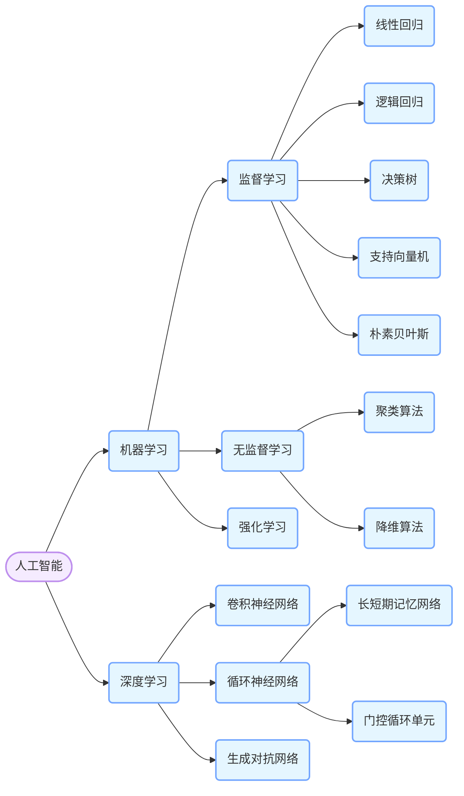

# AI编程：从入门到精通

> 关键词：AI编程、人工智能、机器学习、深度学习、算法原理、代码实战、应用场景

> 摘要：本文旨在全面且系统地引导读者从AI编程的基础入门知识开始，逐步深入学习到精通的境界。文章详细介绍了AI编程的背景知识，包括目的、预期读者等内容；深入剖析了核心概念与联系，用直观的示意图和流程图展示其原理和架构；阐述了核心算法原理并给出Python源代码示例；讲解了相关的数学模型和公式；通过项目实战给出实际代码案例及详细解读；探讨了AI编程在不同领域的实际应用场景；推荐了学习资源、开发工具框架以及相关论文著作；最后总结了未来发展趋势与挑战，还包含常见问题解答和扩展阅读参考资料，帮助读者全面掌握AI编程。

## 1. 背景介绍 
### 1.1 目的和范围
AI编程作为当今科技领域最为热门的方向之一，其应用范围涵盖了医疗、金融、交通、娱乐等众多行业。本文的目的在于为广大对AI编程感兴趣的读者提供一个全面且深入的学习路径，从最基础的概念开始，逐步引导读者掌握AI编程的核心技术和方法，直至能够独立完成复杂的AI项目。范围包括但不限于机器学习、深度学习的基本概念、算法原理、数学模型，以及如何使用Python进行AI编程的实际操作和项目实战。

### 1.2 预期读者
本文预期读者主要包括以下几类人群：
- 编程初学者：对编程有一定的基础，希望通过学习AI编程提升自己的技术水平和竞争力。
- 计算机专业学生：希望深入了解AI编程的原理和实践，为未来的研究和工作打下坚实的基础。
- 行业从业者：希望将AI技术应用到自己的工作领域中，提高工作效率和质量。
- 技术爱好者：对AI技术充满热情，希望通过学习AI编程来探索其奥秘。

### 1.3 文档结构概述
本文将按照以下结构进行组织：
- 核心概念与联系：介绍AI编程中的核心概念，如机器学习、深度学习等，并通过示意图和流程图展示它们之间的联系。
- 核心算法原理 & 具体操作步骤：详细讲解AI编程中常用的算法原理，并给出Python源代码示例，帮助读者理解和实现这些算法。
- 数学模型和公式 & 详细讲解 & 举例说明：介绍AI编程中涉及的数学模型和公式，并通过具体的例子进行详细讲解。
- 项目实战：代码实际案例和详细解释说明：通过一个实际的项目案例，展示如何使用AI编程技术解决实际问题，并对代码进行详细的解读和分析。
- 实际应用场景：探讨AI编程在不同领域的实际应用场景，帮助读者了解AI编程的实际价值和应用前景。
- 工具和资源推荐：推荐学习AI编程所需的工具和资源，包括书籍、在线课程、技术博客、开发工具框架等。
- 总结：未来发展趋势与挑战：总结AI编程的发展趋势和面临的挑战，为读者提供一个宏观的视角。
- 附录：常见问题与解答：解答读者在学习AI编程过程中常见的问题。
- 扩展阅读 & 参考资料：提供相关的扩展阅读材料和参考资料，帮助读者进一步深入学习AI编程。

### 1.4 术语表
#### 1.4.1 核心术语定义
- **人工智能（Artificial Intelligence，AI）**：指计算机系统能够执行通常需要人类智能才能完成的任务，如学习、推理、解决问题等。
- **机器学习（Machine Learning，ML）**：是人工智能的一个分支，专注于让计算机通过数据学习模式和规律，从而进行预测和决策。
- **深度学习（Deep Learning，DL）**：是机器学习的一个子领域，基于人工神经网络，特别是深度神经网络，通过多层神经网络自动学习数据的特征表示。
- **神经网络（Neural Network，NN）**：是一种模仿人类神经系统的计算模型，由大量的神经元组成，用于处理和分析复杂的数据。
- **训练（Training）**：在机器学习和深度学习中，指使用数据集来调整模型的参数，使其能够更好地拟合数据。
- **模型（Model）**：是对数据和问题的一种数学表示，通过训练得到，用于进行预测和决策。
- **损失函数（Loss Function）**：用于衡量模型预测结果与真实标签之间的差异，是训练模型时的优化目标。

#### 1.4.2 相关概念解释
- **监督学习（Supervised Learning）**：是一种机器学习方法，训练数据包含输入特征和对应的标签，模型通过学习输入特征和标签之间的关系进行预测。
- **无监督学习（Unsupervised Learning）**：训练数据只包含输入特征，没有对应的标签，模型通过发现数据中的模式和结构进行学习。
- **强化学习（Reinforcement Learning）**：智能体通过与环境进行交互，根据环境反馈的奖励信号来学习最优的行为策略。
- **特征工程（Feature Engineering）**：指从原始数据中提取和选择有用的特征，以提高模型的性能。

#### 1.4.3 缩略词列表
- **AI**：Artificial Intelligence（人工智能）
- **ML**：Machine Learning（机器学习）
- **DL**：Deep Learning（深度学习）
- **NN**：Neural Network（神经网络）
- **GPU**：Graphics Processing Unit（图形处理器）
- **CPU**：Central Processing Unit（中央处理器）
- **API**：Application Programming Interface（应用程序编程接口）

## 2. 核心概念与联系 
### 核心概念原理
#### 人工智能（AI）
人工智能是一个广泛的领域，旨在使计算机系统具有智能行为。它的目标是让计算机能够像人类一样感知、理解、学习和决策。人工智能的发展经历了多个阶段，从早期的符号主义到后来的连接主义（神经网络）和行为主义，目前深度学习已经成为人工智能领域的主流技术。

#### 机器学习（ML）
机器学习是人工智能的一个重要分支，它通过让计算机从数据中学习模式和规律，从而进行预测和决策。机器学习的基本流程包括数据收集、数据预处理、模型选择、模型训练、模型评估和模型部署。常见的机器学习算法包括线性回归、逻辑回归、决策树、支持向量机、朴素贝叶斯等。

#### 深度学习（DL）
深度学习是机器学习的一个子领域，基于人工神经网络，特别是深度神经网络。深度神经网络由多个隐藏层组成，能够自动学习数据的特征表示。深度学习在图像识别、语音识别、自然语言处理等领域取得了巨大的成功，其典型的模型包括卷积神经网络（CNN）、循环神经网络（RNN）及其变体（如LSTM、GRU）等。

### 架构的文本示意图
```plaintext
人工智能（AI）
|
|-- 机器学习（ML）
|   |-- 监督学习
|   |   |-- 线性回归
|   |   |-- 逻辑回归
|   |   |-- 决策树
|   |   |-- 支持向量机
|   |   |-- 朴素贝叶斯
|   |-- 无监督学习
|   |   |-- 聚类算法（如K-Means）
|   |   |-- 降维算法（如PCA）
|   |-- 强化学习
|
|-- 深度学习（DL）
|   |-- 卷积神经网络（CNN）
|   |-- 循环神经网络（RNN）
|   |   |-- 长短期记忆网络（LSTM）
|   |   |-- 门控循环单元（GRU）
|   |-- 生成对抗网络（GAN）
```

### Mermaid流程图


## 3. 核心算法原理 & 具体操作步骤 
### 线性回归算法原理
线性回归是一种用于建立自变量和因变量之间线性关系的监督学习算法。其基本假设是因变量 $y$ 可以表示为自变量 $x$ 的线性组合，即：

$$y = \theta_0 + \theta_1x_1 + \theta_2x_2 + \cdots + \theta_nx_n + \epsilon$$

其中，$\theta_0, \theta_1, \cdots, \theta_n$ 是模型的参数，$\epsilon$ 是误差项。线性回归的目标是找到一组最优的参数 $\theta$，使得预测值 $\hat{y}$ 与真实值 $y$ 之间的误差最小。常用的误差度量是均方误差（Mean Squared Error，MSE）：

$$MSE = \frac{1}{m}\sum_{i=1}^{m}(y^{(i)} - \hat{y}^{(i)})^2$$

其中，$m$ 是样本数量，$y^{(i)}$ 是第 $i$ 个样本的真实值，$\hat{y}^{(i)}$ 是第 $i$ 个样本的预测值。

### Python源代码实现
```python
import numpy as np
from sklearn.linear_model import LinearRegression
from sklearn.metrics import mean_squared_error
from sklearn.model_selection import train_test_split

# 生成一些示例数据
np.random.seed(0)
X = 2 * np.random.rand(100, 1)
y = 4 + 3 * X + np.random.randn(100, 1)

# 划分训练集和测试集
X_train, X_test, y_train, y_test = train_test_split(X, y, test_size=0.2, random_state=42)

# 创建线性回归模型
model = LinearRegression()

# 训练模型
model.fit(X_train, y_train)

# 进行预测
y_pred = model.predict(X_test)

# 计算均方误差
mse = mean_squared_error(y_test, y_pred)
print(f"均方误差: {mse}")

# 打印模型参数
print(f"截距: {model.intercept_}")
print(f"系数: {model.coef_}")
```

### 具体操作步骤
1. **数据准备**：收集和整理包含自变量和因变量的数据集。
2. **数据划分**：将数据集划分为训练集和测试集，通常按照 80:20 或 70:30 的比例进行划分。
3. **模型创建**：创建线性回归模型对象。
4. **模型训练**：使用训练集数据对模型进行训练，即调整模型的参数以最小化均方误差。
5. **模型预测**：使用训练好的模型对测试集数据进行预测。
6. **模型评估**：计算预测结果与真实值之间的均方误差，评估模型的性能。
7. **参数查看**：查看模型的截距和系数等参数。

### 逻辑回归算法原理
逻辑回归是一种用于二分类问题的监督学习算法。虽然名字中包含“回归”，但实际上它是一种分类算法。逻辑回归的基本思想是通过一个逻辑函数（也称为 sigmoid 函数）将线性回归的输出映射到 $[0, 1]$ 之间的概率值，从而进行分类。sigmoid 函数的定义如下：

$$\sigma(z) = \frac{1}{1 + e^{-z}}$$

其中，$z$ 是线性回归的输出，即 $z = \theta_0 + \theta_1x_1 + \theta_2x_2 + \cdots + \theta_nx_n$。逻辑回归的目标是找到一组最优的参数 $\theta$，使得模型对训练数据的似然函数最大。通常使用对数似然函数作为损失函数，通过梯度下降等优化算法来最小化损失函数。

### Python源代码实现
```python
from sklearn.datasets import make_classification
from sklearn.linear_model import LogisticRegression
from sklearn.model_selection import train_test_split
from sklearn.metrics import accuracy_score

# 生成一些示例数据
X, y = make_classification(n_samples=100, n_features=10, n_informative=5, n_redundant=0, random_state=42)

# 划分训练集和测试集
X_train, X_test, y_train, y_test = train_test_split(X, y, test_size=0.2, random_state=42)

# 创建逻辑回归模型
model = LogisticRegression()

# 训练模型
model.fit(X_train, y_train)

# 进行预测
y_pred = model.predict(X_test)

# 计算准确率
accuracy = accuracy_score(y_test, y_pred)
print(f"准确率: {accuracy}")

# 打印模型参数
print(f"截距: {model.intercept_}")
print(f"系数: {model.coef_}")
```

### 具体操作步骤
1. **数据准备**：收集和整理包含自变量和特征标签的二分类数据集。
2. **数据划分**：将数据集划分为训练集和测试集。
3. **模型创建**：创建逻辑回归模型对象。
4. **模型训练**：使用训练集数据对模型进行训练，即调整模型的参数以最大化对数似然函数。
5. **模型预测**：使用训练好的模型对测试集数据进行预测。
6. **模型评估**：计算预测结果的准确率，评估模型的性能。
7. **参数查看**：查看模型的截距和系数等参数。

## 4. 数学模型和公式 & 详细讲解 & 举例说明 
### 线性回归的数学模型和公式
#### 数学模型
线性回归的数学模型可以表示为：

$$\mathbf{y} = \mathbf{X}\boldsymbol{\theta} + \boldsymbol{\epsilon}$$

其中，$\mathbf{y}$ 是 $m \times 1$ 的因变量向量，$\mathbf{X}$ 是 $m \times (n + 1)$ 的自变量矩阵（第一列全为 1，对应截距项），$\boldsymbol{\theta}$ 是 $(n + 1) \times 1$ 的参数向量，$\boldsymbol{\epsilon}$ 是 $m \times 1$ 的误差向量。

#### 最小二乘法求解
最小二乘法的目标是找到一组参数 $\boldsymbol{\theta}$，使得误差平方和最小，即：

$$\boldsymbol{\theta}^* = \arg\min_{\boldsymbol{\theta}} \sum_{i=1}^{m}(y^{(i)} - \mathbf{x}^{(i)}\boldsymbol{\theta})^2$$

可以通过对误差平方和求偏导数并令其为 0 来求解 $\boldsymbol{\theta}^*$，得到正规方程：

$$\boldsymbol{\theta}^* = (\mathbf{X}^T\mathbf{X})^{-1}\mathbf{X}^T\mathbf{y}$$

#### 举例说明
假设有以下数据集：

| $x$ | $y$ |
|---|---|
| 1 | 3 |
| 2 | 5 |
| 3 | 7 |

则 $\mathbf{X} = \begin{bmatrix} 1 & 1 \\ 1 & 2 \\ 1 & 3 \end{bmatrix}$，$\mathbf{y} = \begin{bmatrix} 3 \\ 5 \\ 7 \end{bmatrix}$。

计算 $\mathbf{X}^T\mathbf{X} = \begin{bmatrix} 3 & 6 \\ 6 & 14 \end{bmatrix}$，$(\mathbf{X}^T\mathbf{X})^{-1} = \frac{1}{3\times14 - 6\times6}\begin{bmatrix} 14 & -6 \\ -6 & 3 \end{bmatrix} = \begin{bmatrix} \frac{7}{3} & -1 \\ -1 & \frac{1}{2} \end{bmatrix}$，$\mathbf{X}^T\mathbf{y} = \begin{bmatrix} 15 \\ 34 \end{bmatrix}$。

则 $\boldsymbol{\theta}^* = (\mathbf{X}^T\mathbf{X})^{-1}\mathbf{X}^T\mathbf{y} = \begin{bmatrix} \frac{7}{3} & -1 \\ -1 & \frac{1}{2} \end{bmatrix}\begin{bmatrix} 15 \\ 34 \end{bmatrix} = \begin{bmatrix} 1 \\ 2 \end{bmatrix}$。

所以线性回归方程为 $y = 1 + 2x$。

### 逻辑回归的数学模型和公式
#### 数学模型
逻辑回归的数学模型可以表示为：

$$P(y = 1|\mathbf{x}) = \sigma(\mathbf{x}\boldsymbol{\theta}) = \frac{1}{1 + e^{-\mathbf{x}\boldsymbol{\theta}}}$$

其中，$P(y = 1|\mathbf{x})$ 是给定自变量 $\mathbf{x}$ 时，因变量 $y$ 取值为 1 的概率。

#### 对数似然函数
逻辑回归的对数似然函数为：

$$\mathcal{L}(\boldsymbol{\theta}) = \sum_{i=1}^{m}[y^{(i)}\log(\sigma(\mathbf{x}^{(i)}\boldsymbol{\theta})) + (1 - y^{(i)})\log(1 - \sigma(\mathbf{x}^{(i)}\boldsymbol{\theta}))]$$

#### 梯度下降法求解
梯度下降法的目标是通过迭代更新参数 $\boldsymbol{\theta}$ 来最大化对数似然函数。参数更新公式为：

$$\boldsymbol{\theta} := \boldsymbol{\theta} + \alpha\nabla\mathcal{L}(\boldsymbol{\theta})$$

其中，$\alpha$ 是学习率，$\nabla\mathcal{L}(\boldsymbol{\theta})$ 是对数似然函数的梯度。

#### 举例说明
假设有以下二分类数据集：

| $x_1$ | $x_2$ | $y$ |
|---|---|---|
| 1 | 2 | 1 |
| 2 | 3 | 1 |
| 3 | 1 | 0 |

初始化参数 $\boldsymbol{\theta} = \begin{bmatrix} 0 \\ 0 \\ 0 \end{bmatrix}$，学习率 $\alpha = 0.1$。

通过多次迭代更新参数，直到对数似然函数收敛，得到最终的参数 $\boldsymbol{\theta}$，从而得到逻辑回归模型。

## 5. 项目实战：代码实际案例和详细解释说明 
### 5.1  开发环境搭建
#### 安装Python
首先，需要安装Python解释器。建议安装Python 3.7 及以上版本，可以从Python官方网站（https://www.python.org/downloads/） 下载适合自己操作系统的安装包进行安装。

#### 安装虚拟环境
为了避免不同项目之间的依赖冲突，建议使用虚拟环境。可以使用 `venv` 或 `conda` 来创建虚拟环境。

使用 `venv` 创建虚拟环境的命令如下：
```bash
python -m venv myenv
```

激活虚拟环境：
- 在 Windows 上：
```bash
myenv\Scripts\activate
```
- 在 Linux 或 macOS 上：
```bash
source myenv/bin/activate
```

#### 安装必要的库
在虚拟环境中，使用 `pip` 安装必要的库，如 `numpy`、`pandas`、`scikit-learn`、`tensorflow`、`pytorch` 等。

```bash
pip install numpy pandas scikit-learn tensorflow torch
```

### 5.2  源代码详细实现和代码解读
#### 项目背景
我们将实现一个简单的手写数字识别项目，使用的数据集是 MNIST 数据集。MNIST 数据集包含 60000 个训练样本和 10000 个测试样本，每个样本是一个 28x28 的手写数字图像。

#### 代码实现
```python
import tensorflow as tf
from tensorflow.keras.datasets import mnist
from tensorflow.keras.models import Sequential
from tensorflow.keras.layers import Flatten, Dense
from tensorflow.keras.utils import to_categorical
import matplotlib.pyplot as plt

# 加载 MNIST 数据集
(train_images, train_labels), (test_images, test_labels) = mnist.load_data()

# 数据预处理
train_images = train_images / 255.0
test_images = test_images / 255.0

train_labels = to_categorical(train_labels)
test_labels = to_categorical(test_labels)

# 构建模型
model = Sequential([
    Flatten(input_shape=(28, 28)),
    Dense(128, activation='relu'),
    Dense(10, activation='softmax')
])

# 编译模型
model.compile(optimizer='adam',
              loss='categorical_crossentropy',
              metrics=['accuracy'])

# 训练模型
history = model.fit(train_images, train_labels, epochs=5, batch_size=64, validation_data=(test_images, test_labels))

# 评估模型
test_loss, test_acc = model.evaluate(test_images, test_labels)
print(f"测试集损失: {test_loss}")
print(f"测试集准确率: {test_acc}")

# 绘制训练过程中的损失和准确率曲线
plt.plot(history.history['accuracy'])
plt.plot(history.history['val_accuracy'])
plt.title('Model accuracy')
plt.ylabel('Accuracy')
plt.xlabel('Epoch')
plt.legend(['Train', 'Test'], loc='upper left')
plt.show()

plt.plot(history.history['loss'])
plt.plot(history.history['val_loss'])
plt.title('Model loss')
plt.ylabel('Loss')
plt.xlabel('Epoch')
plt.legend(['Train', 'Test'], loc='upper left')
plt.show()
```

#### 代码解读
1. **数据加载**：使用 `mnist.load_data()` 加载 MNIST 数据集，将其分为训练集和测试集。
2. **数据预处理**：将图像像素值归一化到 0 到 1 之间，将标签进行 one-hot 编码。
3. **模型构建**：使用 `Sequential` 模型构建一个简单的神经网络，包含一个 Flatten 层将图像展平，一个 Dense 层作为隐藏层，使用 ReLU 激活函数，最后一个 Dense 层作为输出层，使用 Softmax 激活函数。
4. **模型编译**：使用 `adam` 优化器，`categorical_crossentropy` 损失函数，`accuracy` 作为评估指标。
5. **模型训练**：使用 `fit` 方法对模型进行训练，指定训练的轮数、批次大小和验证集。
6. **模型评估**：使用 `evaluate` 方法对模型在测试集上的性能进行评估。
7. **结果可视化**：使用 `matplotlib` 绘制训练过程中的损失和准确率曲线。

### 5.3  代码解读与分析
#### 数据预处理的重要性
数据预处理是机器学习和深度学习中非常重要的一步。在这个项目中，将图像像素值归一化到 0 到 1 之间可以加速模型的训练过程，因为较小的数值范围可以使优化算法更快地收敛。将标签进行 one-hot 编码是为了将分类问题转化为多分类问题，使得模型能够输出每个类别的概率。

#### 模型结构的选择
选择的模型结构是一个简单的全连接神经网络，包含一个隐藏层。隐藏层的神经元数量为 128，使用 ReLU 激活函数可以引入非线性，增加模型的表达能力。输出层使用 Softmax 激活函数可以将模型的输出转化为概率分布，方便进行分类。

#### 优化器和损失函数的选择
选择 `adam` 优化器是因为它结合了 AdaGrad 和 RMSProp 的优点，能够自适应地调整学习率，在大多数情况下都能取得较好的效果。选择 `categorical_crossentropy` 损失函数是因为它适用于多分类问题，能够衡量模型预测的概率分布与真实标签之间的差异。

#### 训练过程的分析
通过绘制训练过程中的损失和准确率曲线，可以观察模型的训练情况。如果训练集和验证集的准确率都在不断提高，损失都在不断下降，说明模型在正常训练。如果出现过拟合现象，即训练集准确率很高，而验证集准确率较低，损失曲线出现明显的分离，需要采取一些措施，如增加正则化项、减少模型复杂度等。

## 6. 实际应用场景 
### 图像识别
AI编程在图像识别领域有着广泛的应用，如人脸识别、物体检测、图像分类等。在安防领域，人脸识别技术可以用于门禁系统、监控系统等，提高安全性；在医疗领域，图像识别技术可以辅助医生进行疾病诊断，如X光片、CT图像的分析；在自动驾驶领域，物体检测技术可以识别道路上的车辆、行人、交通标志等，为自动驾驶决策提供依据。

### 语音识别
语音识别技术可以将语音信号转换为文本，实现人机语音交互。常见的应用包括智能语音助手（如 Siri、小爱同学）、语音输入法、语音翻译等。在智能家居领域，用户可以通过语音指令控制家电设备；在客服领域，语音识别技术可以实现自动语音客服，提高服务效率。

### 自然语言处理
自然语言处理（NLP）是AI编程的一个重要领域，涉及文本分类、情感分析、机器翻译、问答系统等。在社交媒体领域，情感分析技术可以分析用户的评论和反馈，了解用户的情绪和需求；在智能写作领域，AI可以辅助生成文章、摘要等；在信息检索领域，自然语言处理技术可以提高搜索的准确性和效率。

### 推荐系统
推荐系统是根据用户的历史行为和偏好，为用户推荐个性化的内容和产品。常见的应用包括电商平台的商品推荐、视频平台的视频推荐、音乐平台的音乐推荐等。推荐系统可以提高用户的满意度和忠诚度，增加平台的用户活跃度和销售额。

### 医疗领域
AI编程在医疗领域的应用越来越广泛，如疾病预测、药物研发、医学影像分析等。通过分析大量的医疗数据，AI可以帮助医生进行疾病的早期诊断和预测，提高治疗效果；在药物研发方面，AI可以加速药物筛选和设计的过程，降低研发成本。

### 金融领域
在金融领域，AI编程可以用于风险评估、欺诈检测、投资决策等。通过分析用户的信用数据和交易记录，AI可以评估用户的信用风险，帮助金融机构做出合理的贷款决策；在欺诈检测方面，AI可以实时监测交易行为，及时发现异常交易，保障用户的资金安全。

## 7. 工具和资源推荐
### 7.1 学习资源推荐
#### 7.1.1 书籍推荐
- 《Python机器学习》（Sebastian Raschka 著）：这本书详细介绍了使用Python进行机器学习的方法和技术，包括各种机器学习算法的原理和实现。
- 《深度学习》（Ian Goodfellow、Yoshua Bengio 和 Aaron Courville 著）：被誉为深度学习领域的“圣经”，全面介绍了深度学习的理论和实践。
- 《人工智能：一种现代的方法》（Stuart Russell 和 Peter Norvig 著）：是人工智能领域的经典教材，涵盖了人工智能的各个方面，包括搜索算法、知识表示、机器学习、自然语言处理等。

#### 7.1.2 在线课程
- Coursera 上的“机器学习”课程（Andrew Ng 教授）：这是一门非常经典的机器学习课程，由机器学习领域的知名专家 Andrew Ng 教授授课，课程内容丰富，讲解清晰。
- edX 上的“深度学习”课程（由多个顶尖大学联合开设）：该课程系统地介绍了深度学习的理论和实践，包括卷积神经网络、循环神经网络、生成对抗网络等。
- 哔哩哔哩（B 站）上有很多关于 AI 编程的教程和视频，如“莫烦 Python”系列教程，讲解生动有趣，适合初学者。

#### 7.1.3 技术博客和网站
- Medium：是一个技术博客平台，上面有很多关于 AI 编程的优秀文章，涵盖了最新的研究成果和实践经验。
- Towards Data Science：专注于数据科学和机器学习领域，提供了大量的技术文章和案例分析。
- Kaggle：是一个数据科学竞赛平台，上面有很多数据集和竞赛项目，可以通过参与竞赛来提高自己的 AI 编程能力。

### 7.2 开发工具框架推荐
#### 7.2.1 IDE和编辑器
- PyCharm：是一款专门为 Python 开发设计的集成开发环境（IDE），具有强大的代码编辑、调试、代码分析等功能，非常适合 AI 编程。
- Jupyter Notebook：是一个交互式的开发环境，支持多种编程语言，尤其适合数据探索和模型训练。可以在浏览器中直接编写和运行代码，方便进行代码的展示和分享。
- Visual Studio Code：是一款轻量级的代码编辑器，支持多种编程语言和插件扩展。通过安装相关的插件，可以实现 AI 编程的开发和调试。

#### 7.2.2 调试和性能分析工具
- TensorBoard：是 TensorFlow 提供的一个可视化工具，可以帮助用户可视化训练过程中的损失、准确率、模型结构等信息，方便进行模型调试和优化。
- PyTorch Profiler：是 PyTorch 提供的性能分析工具，可以帮助用户分析模型的性能瓶颈，如计算时间、内存占用等，从而进行性能优化。
- cProfile：是 Python 标准库中的性能分析工具，可以帮助用户分析 Python 代码的性能，找出性能瓶颈。

#### 7.2.3 相关框架和库
- TensorFlow：是 Google 开发的一个开源深度学习框架，具有广泛的应用和丰富的文档资源。支持 CPU、GPU 等多种计算设备，提供了高级的神经网络构建和训练接口。
- PyTorch：是 Facebook 开发的一个开源深度学习框架，具有动态计算图的特点，适合快速迭代和研究。在学术界和工业界都有广泛的应用。
- Scikit-learn：是一个简单易用的机器学习库，提供了各种机器学习算法的实现，如分类、回归、聚类等。适合初学者和快速验证模型。
- Pandas：是一个数据处理和分析库，提供了高效的数据结构和数据操作方法，方便进行数据清洗、预处理和分析。
- NumPy：是 Python 中用于科学计算的基础库，提供了高效的多维数组对象和各种数学函数，是许多 AI 编程库的基础。

### 7.3 相关论文著作推荐
#### 7.3.1 经典论文
- “Gradient-Based Learning Applied to Document Recognition”（Yann LeCun 等著）：这篇论文提出了卷积神经网络（CNN）的经典模型 LeNet，开创了深度学习在图像识别领域的先河。
- “Long Short-Term Memory”（Sepp Hochreiter 和 Jürgen Schmidhuber 著）：介绍了长短期记忆网络（LSTM）的原理和实现，解决了循环神经网络（RNN）中的梯度消失和梯度爆炸问题。
- “Attention Is All You Need”（Ashish Vaswani 等著）：提出了 Transformer 架构，在自然语言处理领域取得了巨大的成功，如 BERT、GPT 等模型都基于 Transformer 架构。

#### 7.3.2 最新研究成果
- arXiv 是一个预印本平台，上面有很多关于 AI 编程的最新研究成果。可以关注一些知名的研究团队和学者，及时了解最新的研究动态。
- NeurIPS（神经信息处理系统大会）、ICML（国际机器学习会议）、CVPR（计算机视觉与模式识别会议）等是 AI 领域的顶级学术会议，会议上的论文代表了该领域的最新研究成果。

#### 7.3.3 应用案例分析
- 《AI 未来进行式》（李开复、王咏刚 著）：书中介绍了 AI 在各个领域的应用案例，如医疗、金融、交通等，通过实际案例展示了 AI 的应用价值和发展趋势。
- Kaggle 上的竞赛项目和解决方案也是很好的应用案例分析资源，可以学习到不同领域的 AI 应用方法和技巧。

## 8. 总结：未来发展趋势与挑战
### 未来发展趋势
#### 融合化发展
AI 将与物联网、大数据、云计算等技术深度融合，形成更加智能化的系统和解决方案。例如，物联网设备收集大量的数据，通过云计算进行存储和处理，AI 对数据进行分析和挖掘，实现智能化的决策和控制。

#### 专业化应用
AI 将在各个行业得到更加深入的应用，实现专业化的解决方案。例如，在医疗领域，AI 将用于个性化医疗、精准诊断和治疗；在金融领域，AI 将用于风险评估、投资决策和欺诈检测等。

#### 自主化智能
未来的 AI 系统将具备更高的自主学习和决策能力，能够在复杂的环境中自主地进行学习和适应。例如，自动驾驶汽车将能够在不同的路况和环境中自主地做出决策，实现安全、高效的行驶。

#### 民主化 AI
随着 AI 技术的不断发展和普及，AI 将变得更加易于使用和开发。普通人也可以通过简单的工具和平台来使用和开发 AI 应用，实现 AI 的民主化。

### 面临的挑战
#### 数据隐私和安全
AI 系统的训练和运行需要大量的数据，这些数据可能包含用户的隐私信息。如何保护数据的隐私和安全，防止数据泄露和滥用，是 AI 发展面临的重要挑战之一。

#### 算法偏见
AI 算法的训练和决策过程可能受到数据和算法本身的影响，导致算法出现偏见和不公平的结果。例如，在人脸识别系统中，可能存在对某些种族或性别群体的识别准确率较低的问题。如何解决算法偏见问题，保证 AI 系统的公平性和公正性，是需要解决的重要问题。

#### 伦理和法律问题
AI 的发展也带来了一系列的伦理和法律问题，如 AI 系统的责任认定、AI 对就业的影响等。如何制定相应的伦理和法律规范，引导 AI 的健康发展，是亟待解决的问题。

#### 计算资源和能源消耗
深度学习等 AI 技术需要大量的计算资源和能源消耗，这不仅增加了成本，也对环境造成了一定的压力。如何提高 AI 系统的计算效率，降低能源消耗，是 AI 发展面临的挑战之一。

## 9. 附录：常见问题与解答
### 1. 学习 AI 编程需要具备哪些基础知识？
学习 AI 编程需要具备一定的数学基础，如线性代数、概率论与数理统计、微积分等；还需要掌握一门编程语言，如 Python；此外，对数据结构和算法也有一定的要求。

### 2. 如何选择适合自己的 AI 框架？
选择适合自己的 AI 框架需要考虑多个因素，如个人的编程习惯、项目的需求、框架的文档和社区支持等。对于初学者来说，Scikit-learn 是一个简单易用的机器学习库，适合快速上手；TensorFlow 和 PyTorch 是功能强大的深度学习框架，在工业界和学术界都有广泛的应用。

### 3. 如何解决模型过拟合和欠拟合的问题？
过拟合是指模型在训练集上表现很好，但在测试集上表现较差；欠拟合是指模型在训练集和测试集上的表现都较差。解决过拟合的方法包括增加数据量、减少模型复杂度、增加正则化项等；解决欠拟合的方法包括增加模型复杂度、调整模型参数等。

### 4. 如何提高模型的性能？
提高模型性能的方法包括优化数据预处理、选择合适的模型结构、调整模型参数、使用集成学习等。此外，还可以通过使用更强大的计算资源，如 GPU，来加速模型的训练过程。

### 5. AI 编程的就业前景如何？
AI 编程是当前科技领域的热门方向，就业前景非常广阔。随着 AI 技术在各个行业的广泛应用，对 AI 编程人才的需求也越来越大。AI 编程人才可以在互联网公司、金融机构、科研院所等单位从事 AI 相关的研发、应用和管理工作。

## 10. 扩展阅读 & 参考资料
### 扩展阅读
- 《思考，快与慢》（丹尼尔·卡尼曼 著）：这本书介绍了人类思维的两种模式，对于理解 AI 中的决策和推理机制有一定的帮助。
- 《生命 3.0：人工智能时代人类的进化与重生》（迈克斯·泰格马克 著）：探讨了 AI 对人类未来的影响，引发读者对 AI 发展的深入思考。
- 《浪潮之巅》（吴军 著）：介绍了科技行业的发展历程和规律，对于了解 AI 行业的发展趋势有一定的参考价值。

### 参考资料
- Python 官方文档（https://docs.python.org/）
- TensorFlow 官方文档（https://www.tensorflow.org/）
- PyTorch 官方文档（https://pytorch.org/）
- Scikit-learn 官方文档（https://scikit-learn.org/）
- arXiv 预印本平台（https://arxiv.org/）
- Kaggle 竞赛平台（https://www.kaggle.com/）