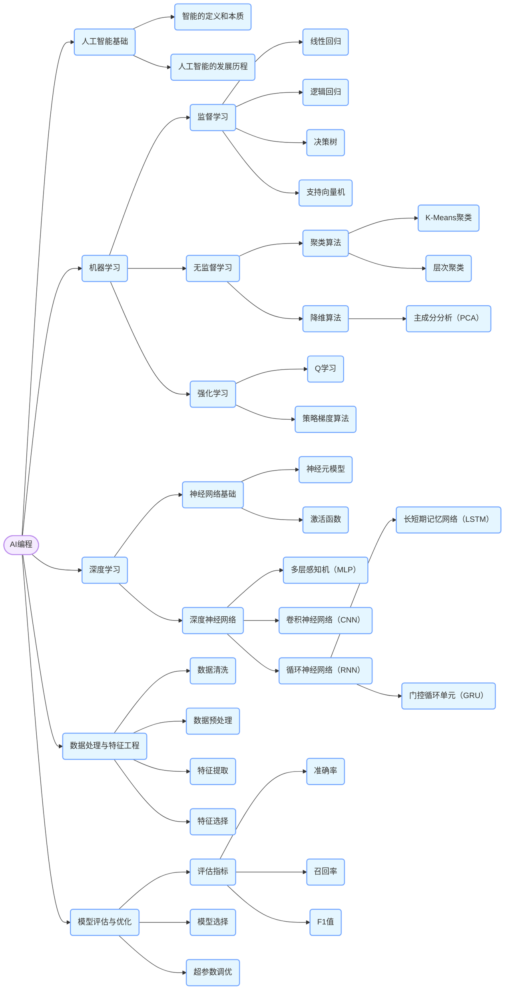

# AI编程：从基础到高级

> 关键词：AI编程、基础概念、核心算法、数学模型、项目实战、应用场景、未来趋势

> 摘要：本文旨在全面且深入地介绍AI编程，从基础概念入手，逐步引导读者了解AI编程的核心算法原理、数学模型。通过详细的Python代码示例和项目实战，帮助读者掌握AI编程的具体操作步骤。同时，探讨了AI编程在实际中的应用场景，推荐了相关的学习工具和资源。最后，对AI编程的未来发展趋势与挑战进行总结，为读者在AI编程领域的学习和研究提供全面的参考。

## 1. 背景介绍 
### 1.1 目的和范围
AI编程作为当今科技领域最具潜力和影响力的方向之一，正在深刻地改变着我们的生活和工作方式。本文的目的是为广大对AI编程感兴趣的读者提供一个系统、全面且深入的学习指南。从AI编程的基础概念出发，逐步深入到核心算法、数学模型，再到项目实战和实际应用场景，旨在让读者不仅了解AI编程的理论知识，更能够掌握实际操作技能，具备独立进行AI项目开发的能力。本文的范围涵盖了AI编程的主要领域，包括机器学习、深度学习等，适合不同基础的读者学习参考。

### 1.2 预期读者
本文预期读者包括但不限于以下几类人群：
- 编程初学者：对编程有一定的基础，但对AI编程领域还比较陌生，希望通过本文系统地学习AI编程知识。
- 计算机专业学生：希望在专业学习的基础上，进一步深入了解AI编程的理论和实践，提升自己的专业技能。
- 相关行业从业者：如软件工程师、数据分析师等，希望通过学习AI编程拓展自己的技能领域，为职业发展增加竞争力。
- 技术爱好者：对AI技术充满热情，希望通过阅读本文深入了解AI编程的原理和应用，满足自己的求知欲。

### 1.3 文档结构概述
本文将按照以下结构进行组织：
- 核心概念与联系：介绍AI编程的基本概念、相关原理和架构，通过文本示意图和Mermaid流程图帮助读者理解。
- 核心算法原理 & 具体操作步骤：详细讲解AI编程中常用的核心算法原理，并使用Python源代码进行阐述，同时给出具体的操作步骤。
- 数学模型和公式 & 详细讲解 & 举例说明：介绍AI编程中涉及的数学模型和公式，并进行详细讲解，通过具体例子帮助读者理解。
- 项目实战：代码实际案例和详细解释说明：通过实际项目案例，详细介绍开发环境搭建、源代码实现和代码解读，帮助读者掌握AI编程的实际应用。
- 实际应用场景：探讨AI编程在不同领域的实际应用场景，展示AI编程的强大功能和应用价值。
- 工具和资源推荐：推荐学习AI编程的相关书籍、在线课程、技术博客和网站，以及开发工具框架和相关论文著作。
- 总结：未来发展趋势与挑战：对AI编程的未来发展趋势进行展望，分析可能面临的挑战。
- 附录：常见问题与解答：解答读者在学习AI编程过程中常见的问题。
- 扩展阅读 & 参考资料：提供相关的扩展阅读资料和参考书目，方便读者进一步深入学习。

### 1.4 术语表
#### 1.4.1 核心术语定义
- **人工智能（Artificial Intelligence，AI）**：指计算机系统能够执行通常需要人类智能才能完成的任务，如学习、推理、解决问题等。
- **机器学习（Machine Learning，ML）**：是人工智能的一个分支，专注于让计算机通过数据和经验来自动改进性能，而无需明确编程。
- **深度学习（Deep Learning，DL）**：是机器学习的一个子领域，基于人工神经网络，特别是深度神经网络，能够自动从大量数据中学习复杂的模式和特征。
- **数据挖掘（Data Mining）**：从大量数据中发现有价值的信息和知识的过程，通常涉及机器学习、统计学等技术。
- **神经网络（Neural Network）**：是一种模仿人类神经系统的计算模型，由大量的神经元组成，用于处理和分析复杂的数据。

#### 1.4.2 相关概念解释
- **监督学习（Supervised Learning）**：是一种机器学习方法，训练数据包含输入特征和对应的标签，模型通过学习输入和标签之间的关系来进行预测。
- **无监督学习（Unsupervised Learning）**：训练数据只包含输入特征，没有对应的标签，模型的任务是发现数据中的结构和模式。
- **强化学习（Reinforcement Learning）**：智能体通过与环境进行交互，根据环境反馈的奖励信号来学习最优的行为策略。
- **特征工程（Feature Engineering）**：是指从原始数据中提取和选择有用的特征，以提高模型的性能和效果。

#### 1.4.3 缩略词列表
- **AI**：Artificial Intelligence（人工智能）
- **ML**：Machine Learning（机器学习）
- **DL**：Deep Learning（深度学习）
- **DNN**：Deep Neural Network（深度神经网络）
- **CNN**：Convolutional Neural Network（卷积神经网络）
- **RNN**：Recurrent Neural Network（循环神经网络）

## 2. 核心概念与联系 

### 2.1 AI编程的基本概念
AI编程是将人工智能的理论和算法通过编程语言实现的过程。其核心目标是让计算机系统能够模拟人类的智能行为，如感知、学习、推理、决策等。AI编程涉及多个领域和技术，其中机器学习和深度学习是最为重要的两个分支。

机器学习是AI编程的基础，它通过对大量数据的学习和分析，让计算机自动发现数据中的模式和规律，并根据这些模式和规律进行预测和决策。深度学习则是机器学习的一种特殊形式，它通过构建深度神经网络，能够自动从原始数据中学习到高层次的抽象特征，从而在图像识别、语音识别、自然语言处理等领域取得了显著的成果。

### 2.2 核心概念原理和架构的文本示意图
AI编程的核心概念和架构可以用以下文本示意图表示：

AI编程
|-- 人工智能基础
|   |-- 智能的定义和本质
|   |-- 人工智能的发展历程
|-- 机器学习
|   |-- 监督学习
|   |   |-- 线性回归
|   |   |-- 逻辑回归
|   |   |-- 决策树
|   |   |-- 支持向量机
|   |-- 无监督学习
|   |   |-- 聚类算法
|   |   |   |-- K-Means聚类
|   |   |   |-- 层次聚类
|   |   |-- 降维算法
|   |   |   |-- 主成分分析（PCA）
|   |-- 强化学习
|       |-- Q学习
|       |-- 策略梯度算法
|-- 深度学习
|   |-- 神经网络基础
|   |   |-- 神经元模型
|   |   |-- 激活函数
|   |-- 深度神经网络
|   |   |-- 多层感知机（MLP）
|   |   |-- 卷积神经网络（CNN）
|   |   |-- 循环神经网络（RNN）
|   |   |   |-- 长短期记忆网络（LSTM）
|   |   |   |-- 门控循环单元（GRU）
|-- 数据处理与特征工程
|   |-- 数据清洗
|   |-- 数据预处理
|   |-- 特征提取
|   |-- 特征选择
|-- 模型评估与优化
|   |-- 评估指标
|   |   |-- 准确率
|   |   |-- 召回率
|   |   |-- F1值
|   |-- 模型选择
|   |-- 超参数调优

### 2.3 Mermaid流程图


这个流程图展示了AI编程的主要组成部分及其之间的关系。从整体上看，AI编程包括人工智能基础、机器学习、深度学习、数据处理与特征工程以及模型评估与优化等几个关键部分。每个部分又包含多个子部分，这些子部分相互关联，共同构成了AI编程的完整体系。

## 3. 核心算法原理 & 具体操作步骤 

### 3.1 线性回归算法原理及Python实现
#### 3.1.1 算法原理
线性回归是一种用于建立自变量和因变量之间线性关系的统计模型。其基本假设是因变量 $y$ 可以表示为自变量 $x$ 的线性组合，即：

$$y = \theta_0 + \theta_1x_1 + \theta_2x_2 + \cdots + \theta_nx_n + \epsilon$$

其中，$\theta_0, \theta_1, \cdots, \theta_n$ 是模型的参数，$\epsilon$ 是误差项，服从均值为 0 的正态分布。线性回归的目标是找到一组最优的参数 $\theta$，使得模型的预测值与真实值之间的误差最小。通常使用最小二乘法来求解这个最优参数，即最小化以下损失函数：

$$J(\theta) = \frac{1}{2m}\sum_{i=1}^{m}(h_{\theta}(x^{(i)}) - y^{(i)})^2$$

其中，$m$ 是样本数量，$h_{\theta}(x^{(i)})$ 是模型对第 $i$ 个样本的预测值，$y^{(i)}$ 是第 $i$ 个样本的真实值。

#### 3.1.2 Python实现
```python
import numpy as np

class LinearRegression:
    def __init__(self):
        self.theta = None

    def fit(self, X, y):
        # 在 X 矩阵前添加一列全为 1 的列，用于表示截距项
        X_b = np.c_[np.ones((X.shape[0], 1)), X]
        # 使用正规方程求解最优参数
        self.theta = np.linalg.inv(X_b.T.dot(X_b)).dot(X_b.T).dot(y)

    def predict(self, X):
        # 在 X 矩阵前添加一列全为 1 的列，用于表示截距项
        X_b = np.c_[np.ones((X.shape[0], 1)), X]
        # 进行预测
        return X_b.dot(self.theta)

# 示例数据
X = np.array([[1], [2], [3], [4], [5]])
y = np.array([2, 4, 6, 8, 10])

# 创建线性回归模型
model = LinearRegression()
# 训练模型
model.fit(X, y)
# 进行预测
new_X = np.array([[6]])
prediction = model.predict(new_X)
print("预测值:", prediction)
```
#### 3.1.3 具体操作步骤
1. **数据准备**：准备好自变量 $X$ 和因变量 $y$ 的数据。
2. **模型初始化**：创建线性回归模型对象。
3. **模型训练**：调用模型的 `fit` 方法，使用训练数据 $X$ 和 $y$ 来训练模型，求解最优参数 $\theta$。
4. **模型预测**：调用模型的 `predict` 方法，使用训练好的模型对新的数据进行预测。

### 3.2 逻辑回归算法原理及Python实现
#### 3.2.1 算法原理
逻辑回归是一种用于分类问题的机器学习算法，它通过逻辑函数（也称为 sigmoid 函数）将线性回归的输出映射到 0 到 1 之间的概率值，用于表示样本属于某个类别的概率。逻辑函数的定义如下：

$$\sigma(z) = \frac{1}{1 + e^{-z}}$$

其中，$z$ 是线性回归的输出，即 $z = \theta_0 + \theta_1x_1 + \theta_2x_2 + \cdots + \theta_nx_n$。逻辑回归的目标是找到一组最优的参数 $\theta$，使得模型对训练数据的预测概率与真实标签之间的损失最小。通常使用对数损失函数（也称为交叉熵损失函数）来衡量模型的损失，其定义如下：

$$J(\theta) = -\frac{1}{m}\sum_{i=1}^{m}[y^{(i)}\log(h_{\theta}(x^{(i)})) + (1 - y^{(i)})\log(1 - h_{\theta}(x^{(i)}))]$$

其中，$h_{\theta}(x^{(i)}) = \sigma(\theta^T x^{(i)})$ 是模型对第 $i$ 个样本的预测概率，$y^{(i)}$ 是第 $i$ 个样本的真实标签。

#### 3.2.2 Python实现
```python
import numpy as np

class LogisticRegression:
    def __init__(self, learning_rate=0.01, num_iterations=1000):
        self.learning_rate = learning_rate
        self.num_iterations = num_iterations
        self.theta = None

    def sigmoid(self, z):
        return 1 / (1 + np.exp(-z))

    def fit(self, X, y):
        # 在 X 矩阵前添加一列全为 1 的列，用于表示截距项
        X_b = np.c_[np.ones((X.shape[0], 1)), X]
        # 初始化参数
        self.theta = np.zeros(X_b.shape[1])

        for _ in range(self.num_iterations):
            # 计算线性组合
            z = np.dot(X_b, self.theta)
            # 计算预测概率
            h = self.sigmoid(z)
            # 计算梯度
            gradient = np.dot(X_b.T, (h - y)) / y.size
            # 更新参数
            self.theta -= self.learning_rate * gradient

    def predict(self, X):
        # 在 X 矩阵前添加一列全为 1 的列，用于表示截距项
        X_b = np.c_[np.ones((X.shape[0], 1)), X]
        # 计算线性组合
        z = np.dot(X_b, self.theta)
        # 计算预测概率
        h = self.sigmoid(z)
        # 将概率转换为类别标签
        return (h >= 0.5).astype(int)

# 示例数据
X = np.array([[1], [2], [3], [4], [5]])
y = np.array([0, 0, 1, 1, 1])

# 创建逻辑回归模型
model = LogisticRegression()
# 训练模型
model.fit(X, y)
# 进行预测
new_X = np.array([[6]])
prediction = model.predict(new_X)
print("预测标签:", prediction)
```
#### 3.2.3 具体操作步骤
1. **数据准备**：准备好自变量 $X$ 和因变量 $y$ 的数据，其中 $y$ 是二分类标签（0 或 1）。
2. **模型初始化**：创建逻辑回归模型对象，设置学习率和迭代次数。
3. **模型训练**：调用模型的 `fit` 方法，使用训练数据 $X$ 和 $y$ 来训练模型，通过梯度下降法不断更新参数 $\theta$，使得损失函数最小化。
4. **模型预测**：调用模型的 `predict` 方法，使用训练好的模型对新的数据进行预测，将预测概率转换为类别标签。

### 3.3 K-Means聚类算法原理及Python实现
#### 3.3.1 算法原理
K-Means聚类是一种无监督学习算法，用于将数据集划分为 $K$ 个不同的簇。其基本思想是通过迭代的方式，不断调整簇的中心（也称为质心），使得每个样本到其所属簇的质心的距离之和最小。K-Means聚类的具体步骤如下：
1. **初始化质心**：随机选择 $K$ 个样本作为初始质心。
2. **分配样本**：将每个样本分配到距离其最近的质心所在的簇。
3. **更新质心**：计算每个簇中所有样本的均值，将其作为新的质心。
4. **重复步骤 2 和 3**：直到质心不再发生变化或达到最大迭代次数。

#### 3.3.2 Python实现
```python
import numpy as np

class KMeans:
    def __init__(self, n_clusters=3, max_iter=300):
        self.n_clusters = n_clusters
        self.max_iter = max_iter
        self.centroids = None

    def fit(self, X):
        # 随机初始化质心
        self.centroids = X[np.random.choice(X.shape[0], self.n_clusters, replace=False)]

        for _ in range(self.max_iter):
            # 分配样本到最近的质心
            distances = np.array([np.linalg.norm(X - centroid, axis=1) for centroid in self.centroids])
            labels = np.argmin(distances, axis=0)

            # 更新质心
            new_centroids = np.array([X[labels == i].mean(axis=0) for i in range(self.n_clusters)])

            # 判断质心是否不再变化
            if np.allclose(new_centroids, self.centroids):
                break

            self.centroids = new_centroids

    def predict(self, X):
        distances = np.array([np.linalg.norm(X - centroid, axis=1) for centroid in self.centroids])
        return np.argmin(distances, axis=0)

# 示例数据
X = np.array([[1, 2], [1, 4], [1, 0], [4, 2], [4, 4], [4, 0]])

# 创建 K-Means 模型
model = KMeans(n_clusters=2)
# 训练模型
model.fit(X)
# 进行预测
labels = model.predict(X)
print("聚类标签:", labels)
```
#### 3.3.3 具体操作步骤
1. **数据准备**：准备好需要进行聚类的数据集 $X$。
2. **模型初始化**：创建 K-Means 模型对象，设置簇的数量 $K$ 和最大迭代次数。
3. **模型训练**：调用模型的 `fit` 方法，使用数据集 $X$ 来训练模型，通过迭代的方式不断更新质心，直到质心不再发生变化或达到最大迭代次数。
4. **模型预测**：调用模型的 `predict` 方法，使用训练好的模型对数据集 $X$ 进行聚类，返回每个样本的聚类标签。

## 4. 数学模型和公式 & 详细讲解 & 举例说明 

### 4.1 线性回归的数学模型和公式
#### 4.1.1 线性回归模型
线性回归的数学模型可以表示为：

$$y = \theta_0 + \theta_1x_1 + \theta_2x_2 + \cdots + \theta_nx_n + \epsilon$$

其中，$y$ 是因变量，$x_1, x_2, \cdots, x_n$ 是自变量，$\theta_0, \theta_1, \cdots, \theta_n$ 是模型的参数，$\epsilon$ 是误差项。这个模型假设因变量 $y$ 与自变量 $x_1, x_2, \cdots, x_n$ 之间存在线性关系，误差项 $\epsilon$ 服从均值为 0 的正态分布。

#### 4.1.2 最小二乘法
最小二乘法是线性回归中常用的求解最优参数的方法。其目标是最小化以下损失函数：

$$J(\theta) = \frac{1}{2m}\sum_{i=1}^{m}(h_{\theta}(x^{(i)}) - y^{(i)})^2$$

其中，$m$ 是样本数量，$h_{\theta}(x^{(i)}) = \theta_0 + \theta_1x_1^{(i)} + \theta_2x_2^{(i)} + \cdots + \theta_nx_n^{(i)}$ 是模型对第 $i$ 个样本的预测值，$y^{(i)}$ 是第 $i$ 个样本的真实值。

为了求解最优参数 $\theta$，我们可以对损失函数 $J(\theta)$ 求偏导数，并令其等于 0。对于线性回归模型，最优参数 $\theta$ 可以通过正规方程求解：

$$\theta = (X^T X)^{-1} X^T y$$

其中，$X$ 是 $m \times (n + 1)$ 的矩阵，每一行表示一个样本，第一列全为 1，用于表示截距项；$y$ 是 $m$ 维的向量，包含所有样本的真实值。

#### 4.1.3 举例说明
假设我们有以下数据集：

| $x$ | $y$ |
|---|---|
| 1 | 2 |
| 2 | 4 |
| 3 | 6 |
| 4 | 8 |
| 5 | 10 |

我们可以使用线性回归模型来拟合这些数据。首先，我们将数据集表示为矩阵形式：

$$X = \begin{bmatrix}
1 & 1 \\
1 & 2 \\
1 & 3 \\
1 & 4 \\
1 & 5
\end{bmatrix}, \quad y = \begin{bmatrix}
2 \\
4 \\
6 \\
8 \\
10
\end{bmatrix}$$

然后，我们可以使用正规方程求解最优参数 $\theta$：

$$\theta = (X^T X)^{-1} X^T y = \begin{bmatrix}
0 \\
2
\end{bmatrix}$$

因此，线性回归模型的方程为 $y = 0 + 2x$，这与我们观察到的数据规律是一致的。

### 4.2 逻辑回归的数学模型和公式
#### 4.2.1 逻辑函数
逻辑回归使用逻辑函数（也称为 sigmoid 函数）将线性回归的输出映射到 0 到 1 之间的概率值。逻辑函数的定义如下：

$$\sigma(z) = \frac{1}{1 + e^{-z}}$$

其中，$z$ 是线性回归的输出，即 $z = \theta_0 + \theta_1x_1 + \theta_2x_2 + \cdots + \theta_nx_n$。逻辑函数的图像是一个 S 形曲线，其取值范围在 0 到 1 之间。

#### 4.2.2 对数损失函数
逻辑回归的目标是找到一组最优的参数 $\theta$，使得模型对训练数据的预测概率与真实标签之间的损失最小。通常使用对数损失函数（也称为交叉熵损失函数）来衡量模型的损失，其定义如下：

$$J(\theta) = -\frac{1}{m}\sum_{i=1}^{m}[y^{(i)}\log(h_{\theta}(x^{(i)})) + (1 - y^{(i)})\log(1 - h_{\theta}(x^{(i)}))]$$

其中，$h_{\theta}(x^{(i)}) = \sigma(\theta^T x^{(i)})$ 是模型对第 $i$ 个样本的预测概率，$y^{(i)}$ 是第 $i$ 个样本的真实标签。

#### 4.2.3 梯度下降法
由于对数损失函数是非凸函数，无法使用正规方程求解最优参数。因此，我们通常使用梯度下降法来迭代地更新参数 $\theta$，使得损失函数最小化。梯度下降法的更新公式如下：

$$\theta_j := \theta_j - \alpha \frac{\partial J(\theta)}{\partial \theta_j}$$

其中，$\alpha$ 是学习率，控制每次更新的步长；$\frac{\partial J(\theta)}{\partial \theta_j}$ 是损失函数 $J(\theta)$ 对参数 $\theta_j$ 的偏导数。

#### 4.2.4 举例说明
假设我们有以下二分类数据集：

| $x$ | $y$ |
|---|---|
| 1 | 0 |
| 2 | 0 |
| 3 | 1 |
| 4 | 1 |
| 5 | 1 |

我们可以使用逻辑回归模型来对这些数据进行分类。首先，我们将数据集表示为矩阵形式：

$$X = \begin{bmatrix}
1 & 1 \\
1 & 2 \\
1 & 3 \\
1 & 4 \\
1 & 5
\end{bmatrix}, \quad y = \begin{bmatrix}
0 \\
0 \\
1 \\
1 \\
1
\end{bmatrix}$$

然后，我们可以使用梯度下降法来训练逻辑回归模型，不断更新参数 $\theta$，使得损失函数最小化。最终，我们可以得到一组最优的参数 $\theta$，用于对新的数据进行分类预测。

### 4.3 K-Means聚类的数学模型和公式
#### 4.3.1 距离度量
K-Means聚类使用距离度量来确定每个样本到质心的距离。常用的距离度量方法包括欧几里得距离、曼哈顿距离等。在 K-Means聚类中，通常使用欧几里得距离，其定义如下：

$$d(x, y) = \sqrt{\sum_{i=1}^{n}(x_i - y_i)^2}$$

其中，$x$ 和 $y$ 是两个样本，$n$ 是样本的维度。

#### 4.3.2 目标函数
K-Means聚类的目标是将数据集划分为 $K$ 个不同的簇，使得每个样本到其所属簇的质心的距离之和最小。目标函数可以表示为：

$$J = \sum_{i=1}^{K}\sum_{x \in C_i}d(x, \mu_i)^2$$

其中，$K$ 是簇的数量，$C_i$ 是第 $i$ 个簇，$\mu_i$ 是第 $i$ 个簇的质心，$d(x, \mu_i)$ 是样本 $x$ 到质心 $\mu_i$ 的距离。

#### 4.3.3 举例说明
假设我们有以下数据集：

$$X = \begin{bmatrix}
1 & 2 \\
1 & 4 \\
1 & 0 \\
4 & 2 \\
4 & 4 \\
4 & 0
\end{bmatrix}$$

我们可以使用 K-Means聚类算法将这些数据划分为 2 个不同的簇。首先，我们随机初始化 2 个质心：

$$\mu_1 = \begin{bmatrix}
1 \\
2
\end{bmatrix}, \quad \mu_2 = \begin{bmatrix}
4 \\
4
\end{bmatrix}$$

然后，我们将每个样本分配到距离其最近的质心所在的簇，并更新质心。重复这个过程，直到质心不再发生变化或达到最大迭代次数。最终，我们可以得到 2 个不同的簇，每个簇包含一组相似的样本。

## 5. 项目实战：代码实际案例和详细解释说明 

### 5.1  开发环境搭建
#### 5.1.1 安装Python
首先，我们需要安装Python编程语言。可以从Python官方网站（https://www.python.org/downloads/） 下载适合自己操作系统的Python安装包，并按照安装向导进行安装。建议安装Python 3.6及以上版本。

#### 5.1.2 安装虚拟环境
为了避免不同项目之间的依赖冲突，我们可以使用虚拟环境来管理项目的依赖。常用的虚拟环境管理工具包括 `venv` 和 `conda`。这里我们以 `venv` 为例，介绍如何创建和激活虚拟环境：

```bash
# 创建虚拟环境
python -m venv myenv

# 激活虚拟环境
# 在 Windows 上
myenv\Scripts\activate
# 在 Linux 或 macOS 上
source myenv/bin/activate
```

#### 5.1.3 安装必要的库
在虚拟环境中，我们需要安装一些必要的库，如 `numpy`、`pandas`、`scikit-learn`、`matplotlib` 等。可以使用 `pip` 来安装这些库：

```bash
pip install numpy pandas scikit-learn matplotlib
```

### 5.2  源代码详细实现和代码解读
#### 5.2.1 项目背景
我们将实现一个简单的手写数字识别项目，使用经典的 MNIST 数据集。MNIST 数据集包含 60,000 个训练样本和 10,000 个测试样本，每个样本是一个 28x28 像素的手写数字图像。我们的目标是训练一个模型，能够准确地识别这些手写数字。

#### 5.2.2 数据加载和预处理
```python
import numpy as np
from sklearn.datasets import fetch_openml
from sklearn.model_selection import train_test_split
from sklearn.preprocessing import StandardScaler

# 加载 MNIST 数据集
mnist = fetch_openml('mnist_784', version=1)
X, y = mnist["data"], mnist["target"]

# 将标签转换为整数类型
y = y.astype(np.uint8)

# 划分训练集和测试集
X_train, X_test, y_train, y_test = train_test_split(X, y, test_size=0.2, random_state=42)

# 数据标准化
scaler = StandardScaler()
X_train = scaler.fit_transform(X_train)
X_test = scaler.transform(X_test)
```
**代码解读**：
- `fetch_openml('mnist_784', version=1)`：从 OpenML 平台加载 MNIST 数据集。
- `train_test_split(X, y, test_size=0.2, random_state=42)`：将数据集划分为训练集和测试集，测试集占比为 20%。
- `StandardScaler()`：对数据进行标准化处理，使得每个特征的均值为 0，标准差为 1。

#### 5.2.3 模型训练
```python
from sklearn.linear_model import LogisticRegression

# 创建逻辑回归模型
model = LogisticRegression(max_iter=1000)

# 训练模型
model.fit(X_train, y_train)
```
**代码解读**：
- `LogisticRegression(max_iter=1000)`：创建一个逻辑回归模型，设置最大迭代次数为 1000。
- `model.fit(X_train, y_train)`：使用训练集数据对模型进行训练。

#### 5.2.4 模型评估
```python
from sklearn.metrics import accuracy_score

# 预测测试集
y_pred = model.predict(X_test)

# 计算准确率
accuracy = accuracy_score(y_test, y_pred)
print("准确率:", accuracy)
```
**代码解读**：
- `model.predict(X_test)`：使用训练好的模型对测试集数据进行预测。
- `accuracy_score(y_test, y_pred)`：计算模型在测试集上的准确率。

### 5.3  代码解读与分析
#### 5.3.1 数据预处理的重要性
在机器学习项目中，数据预处理是非常重要的一步。通过数据标准化，我们可以使得不同特征具有相同的尺度，避免某些特征因为数值范围较大而对模型产生过大的影响。同时，数据标准化还可以加速模型的训练过程，提高模型的收敛速度。

#### 5.3.2 模型选择的考虑因素
在选择模型时，我们需要考虑多个因素，如数据的特点、问题的复杂度、模型的性能和效率等。对于手写数字识别问题，逻辑回归是一个简单而有效的模型，它可以在较短的时间内训练出一个具有较高准确率的模型。

#### 5.3.3 模型评估的意义
模型评估是机器学习项目中的另一个重要环节。通过评估模型在测试集上的性能，我们可以了解模型的泛化能力，判断模型是否过拟合或欠拟合。同时，模型评估还可以帮助我们比较不同模型的性能，选择最优的模型。

## 6. 实际应用场景 
### 6.1 图像识别
AI编程在图像识别领域有着广泛的应用。例如，人脸识别技术可以用于安防监控、门禁系统、手机解锁等场景。通过训练深度卷积神经网络（CNN），可以准确地识别出图像中的人脸，并进行身份验证。另外，图像分类技术可以用于医学影像诊断、自动驾驶中的场景识别等。在医学影像诊断中，AI模型可以帮助医生快速准确地识别出病变区域，提高诊断效率和准确性。

### 6.2 语音识别
语音识别技术是AI编程的另一个重要应用领域。语音助手如 Siri、小爱同学等，通过语音识别技术可以将用户的语音指令转换为文本，然后进行相应的处理和响应。语音识别技术还可以应用于语音翻译、语音转文字等场景。例如，在会议记录中，使用语音转文字技术可以快速准确地将会议内容记录下来，提高工作效率。

### 6.3 自然语言处理
自然语言处理（NLP）是AI编程中一个非常活跃的研究领域。它包括文本分类、情感分析、机器翻译、问答系统等多个方面。例如，文本分类技术可以用于新闻分类、垃圾邮件过滤等场景。情感分析技术可以用于分析用户对产品或服务的评价，帮助企业了解用户的需求和反馈。机器翻译技术可以实现不同语言之间的自动翻译，促进跨文化交流。

### 6.4 推荐系统
推荐系统是AI编程在电子商务、社交媒体等领域的重要应用。通过分析用户的历史行为和偏好，推荐系统可以为用户推荐个性化的商品、文章、视频等内容。例如，电商平台的商品推荐、音乐平台的歌曲推荐等。推荐系统可以提高用户的满意度和忠诚度，增加平台的销售额和用户活跃度。

### 6.5 自动驾驶
自动驾驶是AI编程在交通领域的重要应用。通过传感器收集车辆周围的环境信息，如摄像头、雷达、激光雷达等，自动驾驶系统可以使用AI算法对这些信息进行处理和分析，实现车辆的自主导航、避障、超车等功能。自动驾驶技术可以提高交通安全和效率，减少交通事故的发生。

## 7. 工具和资源推荐
### 7.1 学习资源推荐
#### 7.1.1 书籍推荐
- 《机器学习》（周志华著）：这本书是机器学习领域的经典教材，系统地介绍了机器学习的基本概念、算法和应用。
- 《深度学习》（Ian Goodfellow、Yoshua Bengio 和 Aaron Courville 著）：这本书是深度学习领域的权威著作，详细介绍了深度学习的理论和实践。
- 《Python 机器学习》（Sebastian Raschka 和 Vahid Mirjalili 著）：这本书以 Python 为工具，介绍了机器学习的基本算法和实践，适合初学者学习。

#### 7.1.2 在线课程
- Coursera 上的《机器学习》课程（Andrew Ng 教授）：这是一门非常经典的机器学习课程，由斯坦福大学的 Andrew Ng 教授授课，内容全面，讲解详细。
- edX 上的《深度学习》课程（由多个知名教授授课）：该课程涵盖了深度学习的各个方面，包括神经网络、卷积神经网络、循环神经网络等。
- 吴恩达的《AI 通识课》：这门课程从宏观的角度介绍了 AI 的发展历程、应用场景和未来趋势，适合对 AI 感兴趣的初学者。

#### 7.1.3 技术博客和网站
- Medium：这是一个技术博客平台，有很多关于 AI 编程的优质文章和教程。
- Towards Data Science：专注于数据科学和机器学习领域的博客，提供了很多实用的技术文章和案例分析。
- AI 研习社：国内的一个专注于 AI 技术的社区，提供了丰富的学习资源和技术交流平台。

### 7.2 开发工具框架推荐
#### 7.2.1 IDE和编辑器
- PyCharm：一款功能强大的 Python 集成开发环境（IDE），提供了代码编辑、调试、版本控制等多种功能。
- Jupyter Notebook：一个交互式的开发环境，适合进行数据分析和模型实验。
- Visual Studio Code：一款轻量级的代码编辑器，支持多种编程语言，有丰富的插件可以扩展功能。

#### 7.2.2 调试和性能分析工具
- TensorBoard：TensorFlow 提供的一个可视化工具，可以帮助用户监控模型的训练过程，分析模型的性能。
- PyTorch Profiler：PyTorch 提供的性能分析工具，可以帮助用户找出模型中的性能瓶颈，优化模型的运行效率。
- cProfile：Python 内置的性能分析工具，可以帮助用户分析代码的执行时间和调用关系。

#### 7.2.3 相关框架和库
- TensorFlow：一个开源的机器学习框架，由 Google 开发，广泛应用于深度学习领域。
- PyTorch：另一个开源的机器学习框架，由 Facebook 开发，具有动态图的特点，适合快速迭代和实验。
- Scikit-learn：一个简单易用的机器学习库，提供了多种机器学习算法和工具，适合初学者使用。
- Keras：一个高级神经网络 API，基于 TensorFlow、Theano 等后端，简化了深度学习模型的构建过程。

### 7.3 相关论文著作推荐
#### 7.3.1 经典论文
- “Gradient-based learning applied to document recognition”（Yann LeCun 等人）：这篇论文介绍了卷积神经网络（CNN）的经典模型 LeNet，开创了深度学习在图像识别领域的先河。
- “Long Short-Term Memory”（Sepp Hochreiter 和 Jürgen Schmidhuber）：这篇论文提出了长短期记忆网络（LSTM），解决了循环神经网络（RNN）中的梯度消失问题。
- “Attention Is All You Need”（Ashish Vaswani 等人）：这篇论文提出了 Transformer 模型，为自然语言处理领域带来了革命性的变化。

#### 7.3.2 最新研究成果
- arXiv 预印本平台：这是一个开放的学术论文平台，提供了很多最新的 AI 研究成果和论文。
- NeurIPS、ICML、CVPR 等顶级学术会议：这些会议是 AI 领域的重要学术交流平台，每年都会发布很多前沿的研究成果。

#### 7.3.3 应用案例分析
- Kaggle 竞赛平台：这是一个数据科学和机器学习竞赛平台，提供了很多实际的数据集和应用案例，可以帮助用户学习和实践 AI 编程。
- AI 应用案例集：一些公司和机构会发布自己的 AI 应用案例，如 Google 的 AI 应用案例、百度的 AI 开放平台等，可以从中学习到 AI 编程在实际应用中的经验和技巧。

## 8. 总结：未来发展趋势与挑战
### 8.1 未来发展趋势
#### 8.1.1 多模态融合
未来的 AI 系统将不再局限于单一的模态，如图像、语音、文本等，而是会将多种模态的信息进行融合，实现更加智能和全面的感知和理解。例如，在自动驾驶中，将图像、雷达、激光雷达等多种传感器的信息进行融合，可以提高车辆对环境的感知能力和决策的准确性。

#### 8.1.2 强化学习与现实世界的结合
强化学习在游戏、机器人控制等领域已经取得了显著的成果。未来，强化学习将更多地应用于现实世界的复杂任务，如智能交通、能源管理等。通过与现实世界的交互和学习，强化学习智能体可以不断优化自己的行为策略，实现更加高效和智能的决策。

#### 8.1.3 可解释性 AI
随着 AI 技术的广泛应用，人们对 AI 系统的可解释性要求越来越高。未来的 AI 研究将更加注重模型的可解释性，开发出能够解释自己决策过程和结果的 AI 系统。这将有助于提高人们对 AI 系统的信任度，促进 AI 技术在更多领域的应用。

#### 8.1.4 边缘计算与 AI 的结合
边缘计算是指在靠近数据源的地方进行数据处理和分析，减少数据传输的延迟和带宽需求。未来，边缘计算将与 AI 技术相结合，实现边缘设备上的智能计算。例如，在智能安防摄像头中集成 AI 算法，可以在本地实时进行目标检测和识别，减少对云端服务器的依赖。

### 8.2 挑战
#### 8.2.1 数据隐私和安全
AI 系统的训练和运行需要大量的数据，这些数据可能包含用户的隐私信息。因此，如何保护数据的隐私和安全是 AI 发展面临的一个重要挑战。需要开发出更加安全可靠的技术和方法，确保数据在采集、存储、传输和使用过程中的安全性。

#### 8.2.2 算法偏见
AI 算法的训练结果往往受到数据的影响，如果训练数据存在偏差，可能会导致算法产生偏见。例如，在人脸识别系统中，如果训练数据主要来自某个特定的群体，可能会导致对其他群体的识别准确率较低。因此，如何解决算法偏见问题，确保 AI 系统的公平性和公正性，是需要研究和解决的重要问题。

#### 8.2.3 计算资源和能耗
深度学习模型通常需要大量的计算资源和能耗，这限制了 AI 技术的应用和发展。未来需要开发出更加高效的算法和硬件，降低 AI 系统的计算成本和能耗，提高 AI 系统的可扩展性和可持续性。

#### 8.2.4 伦理和法律问题
AI 技术的发展带来了一系列的伦理和法律问题，如 AI 系统的责任界定、人类与 AI 的关系等。需要建立相应的伦理和法律框架，规范 AI 技术的发展和应用，确保 AI 技术的发展符合人类的利益和价值观。

## 9. 附录：常见问题与解答
