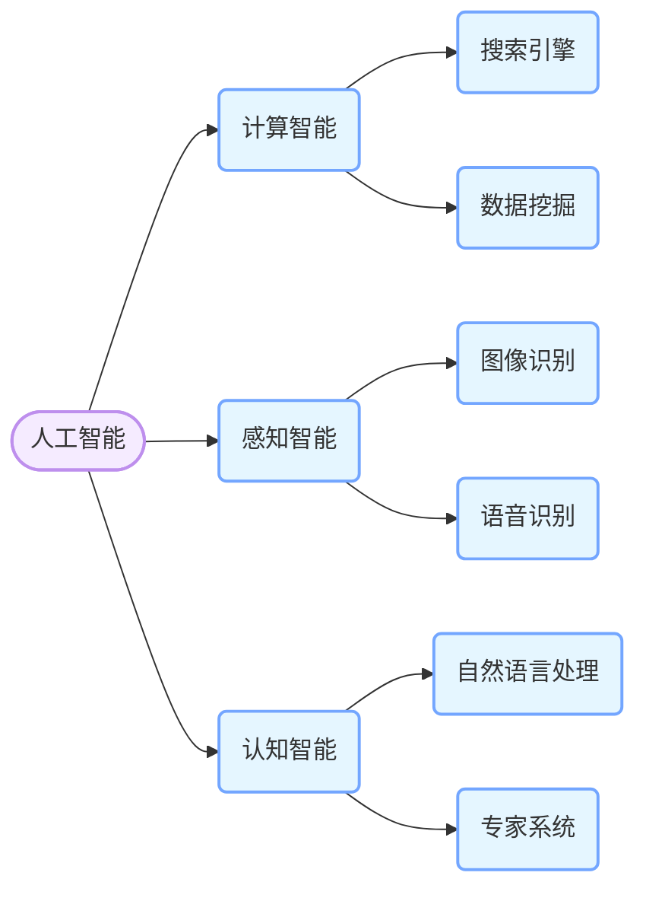
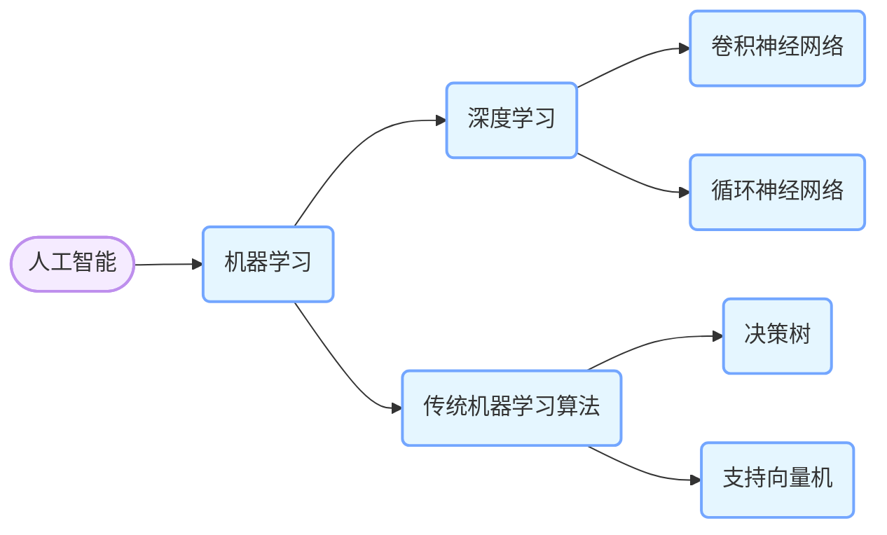
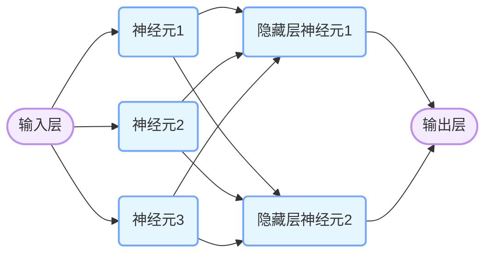

# AI编程：从理论到实践

> 关键词：AI编程、理论基础、实践应用、算法原理、数学模型

> 摘要：本文围绕AI编程展开，旨在帮助读者全面且系统地了解AI编程从理论到实践的全过程。文章首先介绍了AI编程的背景知识，包括目的范围、预期读者等内容。接着深入探讨了核心概念与联系，详细讲解核心算法原理并结合Python代码说明，同时介绍相关数学模型和公式。通过项目实战部分，给出具体的代码案例和详细解释。还阐述了AI编程的实际应用场景，推荐了相关的学习工具和资源。最后总结了未来发展趋势与挑战，提供常见问题解答和扩展阅读参考资料，为读者提供一个完整的AI编程学习与实践的知识体系。

## 1. 背景介绍 
### 1.1 目的和范围
AI编程在当今科技领域占据着至关重要的地位，其应用范围广泛，涵盖了图像识别、自然语言处理、机器人控制等多个领域。本文的目的在于为读者搭建一个从理论到实践的桥梁，全面介绍AI编程的相关知识和技能。范围包括AI编程的基本概念、核心算法、数学模型，以及如何将这些理论应用到实际项目中。通过学习本文，读者将能够掌握AI编程的基本原理，并具备进行简单AI项目开发的能力。

### 1.2 预期读者
本文预期读者包括对AI编程感兴趣的初学者、希望提升AI编程技能的程序员、从事相关领域研究的科研人员以及对科技发展趋势关注的爱好者。无论您是具有一定编程基础还是刚刚接触AI领域，都能从本文中获取有价值的信息和知识。

### 1.3 文档结构概述
本文将按照以下结构进行组织：首先介绍AI编程的背景知识，包括目的、预期读者等；接着深入探讨AI编程的核心概念与联系，通过文本示意图和Mermaid流程图进行直观展示；然后详细讲解核心算法原理，并使用Python源代码进行阐述；再介绍相关的数学模型和公式，并举例说明；通过项目实战部分，给出具体的代码案例和详细解释；阐述AI编程的实际应用场景；推荐相关的学习工具和资源；最后总结未来发展趋势与挑战，提供常见问题解答和扩展阅读参考资料。

### 1.4 术语表
#### 1.4.1 核心术语定义
- **人工智能（Artificial Intelligence，AI）**：指计算机系统能够执行通常需要人类智能才能完成的任务，如学习、推理、解决问题等。
- **机器学习（Machine Learning，ML）**：是人工智能的一个分支，专注于让计算机通过数据和经验自动改进性能，而无需明确的编程指令。
- **深度学习（Deep Learning，DL）**：是机器学习的一个子领域，基于人工神经网络，特别是深度神经网络，通过多层次的神经元对数据进行特征学习和模式识别。
- **神经网络（Neural Network，NN）**：是一种模仿人类神经系统的计算模型，由大量的神经元组成，用于处理和分析复杂的数据。
- **训练（Training）**：在机器学习中，通过将模型与大量数据进行交互，调整模型的参数，使其能够更好地预测或分类新的数据。

#### 1.4.2 相关概念解释
- **数据集（Dataset）**：是用于训练和测试机器学习模型的数据集合，通常包含输入数据和对应的标签。
- **特征（Feature）**：是数据集中用于描述样本的属性或变量，是模型进行学习和预测的基础。
- **模型（Model）**：是对数据的一种抽象表示，通过学习数据的模式和规律，用于进行预测、分类等任务。
- **损失函数（Loss Function）**：用于衡量模型预测结果与真实标签之间的差异，是模型训练过程中需要最小化的目标函数。
- **优化算法（Optimization Algorithm）**：用于在模型训练过程中调整模型的参数，以最小化损失函数，常见的优化算法有随机梯度下降（SGD）、Adam等。

#### 1.4.3 缩略词列表
- **AI**：Artificial Intelligence（人工智能）
- **ML**：Machine Learning（机器学习）
- **DL**：Deep Learning（深度学习）
- **NN**：Neural Network（神经网络）
- **SGD**：Stochastic Gradient Descent（随机梯度下降）

## 2. 核心概念与联系 
### 2.1 人工智能的层次结构
人工智能可以分为三个层次：计算智能、感知智能和认知智能。计算智能主要涉及数值计算和逻辑推理，如搜索引擎、数据挖掘等；感知智能专注于对外部环境的感知和理解，如图像识别、语音识别等；认知智能则更高级，涉及到对知识的理解、推理和决策，如自然语言处理、专家系统等。



### 2.2 机器学习与深度学习的关系
机器学习是人工智能的一个重要分支，而深度学习又是机器学习的一个子领域。机器学习通过让计算机从数据中学习模式和规律，实现对未知数据的预测和分类。深度学习则通过深度神经网络，自动从数据中提取复杂的特征，在图像、语音等领域取得了显著的成果。



### 2.3 神经网络的基本结构
神经网络由输入层、隐藏层和输出层组成。输入层接收外部数据，隐藏层对数据进行特征提取和转换，输出层给出最终的预测结果。每个神经元都与上一层的神经元相连，通过加权求和和激活函数进行计算。



## 3. 核心算法原理 & 具体操作步骤 
### 3.1 线性回归算法原理
线性回归是一种简单而常用的机器学习算法，用于预测连续数值的输出。其基本思想是通过找到一条直线或超平面，使得数据点到该直线或超平面的距离最小。线性回归的数学模型可以表示为：

$$y = \theta_0 + \theta_1x_1 + \theta_2x_2 + \cdots + \theta_nx_n$$

其中，$y$ 是预测值，$x_1, x_2, \cdots, x_n$ 是输入特征，$\theta_0, \theta_1, \cdots, \theta_n$ 是模型的参数。

### 3.2 线性回归算法的Python实现
```python
import numpy as np
from sklearn.linear_model import LinearRegression
from sklearn.model_selection import train_test_split
from sklearn.metrics import mean_squared_error

# 生成示例数据
np.random.seed(0)
X = 2 * np.random.rand(100, 1)
y = 4 + 3 * X + np.random.randn(100, 1)

# 划分训练集和测试集
X_train, X_test, y_train, y_test = train_test_split(X, y, test_size=0.2, random_state=42)

# 创建线性回归模型
model = LinearRegression()

# 训练模型
model.fit(X_train, y_train)

# 预测
y_pred = model.predict(X_test)

# 计算均方误差
mse = mean_squared_error(y_test, y_pred)
print(f"均方误差: {mse}")
```

### 3.3 具体操作步骤
1. **数据准备**：收集和整理相关数据，并将其划分为训练集和测试集。
2. **模型选择**：选择合适的机器学习模型，如线性回归模型。
3. **模型训练**：使用训练集数据对模型进行训练，调整模型的参数。
4. **模型评估**：使用测试集数据对训练好的模型进行评估，计算评估指标，如均方误差。
5. **模型优化**：根据评估结果，对模型进行优化，如调整模型的超参数。

## 4. 数学模型和公式 & 详细讲解 & 举例说明 
### 4.1 线性回归的损失函数
线性回归的损失函数通常使用均方误差（Mean Squared Error，MSE），其数学公式为：

$$MSE = \frac{1}{m} \sum_{i=1}^{m} (y^{(i)} - \hat{y}^{(i)})^2$$

其中，$m$ 是样本数量，$y^{(i)}$ 是第 $i$ 个样本的真实值，$\hat{y}^{(i)}$ 是第 $i$ 个样本的预测值。

### 4.2 最小二乘法求解线性回归参数
最小二乘法是一种常用的求解线性回归参数的方法，其目标是最小化均方误差。通过对均方误差求偏导数并令其为零，可以得到参数的最优解。对于简单线性回归（只有一个特征），参数 $\theta_0$ 和 $\theta_1$ 的计算公式为：

$$\theta_1 = \frac{\sum_{i=1}^{m} (x^{(i)} - \bar{x})(y^{(i)} - \bar{y})}{\sum_{i=1}^{m} (x^{(i)} - \bar{x})^2}$$

$$\theta_0 = \bar{y} - \theta_1\bar{x}$$

其中，$\bar{x}$ 和 $\bar{y}$ 分别是 $x$ 和 $y$ 的均值。

### 4.3 举例说明
假设我们有以下数据集：

| $x$ | $y$ |
|---|---|
| 1 | 3 |
| 2 | 5 |
| 3 | 7 |
| 4 | 9 |

首先计算 $x$ 和 $y$ 的均值：

$$\bar{x} = \frac{1 + 2 + 3 + 4}{4} = 2.5$$

$$\bar{y} = \frac{3 + 5 + 7 + 9}{4} = 6$$

然后计算 $\theta_1$：

$$\sum_{i=1}^{4} (x^{(i)} - \bar{x})(y^{(i)} - \bar{y}) = (1 - 2.5)(3 - 6) + (2 - 2.5)(5 - 6) + (3 - 2.5)(7 - 6) + (4 - 2.5)(9 - 6) = 10$$

$$\sum_{i=1}^{4} (x^{(i)} - \bar{x})^2 = (1 - 2.5)^2 + (2 - 2.5)^2 + (3 - 2.5)^2 + (4 - 2.5)^2 = 5$$

$$\theta_1 = \frac{10}{5} = 2$$

最后计算 $\theta_0$：

$$\theta_0 = 6 - 2 \times 2.5 = 1$$

所以，线性回归方程为 $y = 1 + 2x$。

## 5. 项目实战：代码实际案例和详细解释说明 
### 5.1  开发环境搭建
1. **安装Python**：从Python官方网站（https://www.python.org/downloads/）下载并安装Python 3.x版本。
2. **安装必要的库**：使用pip命令安装所需的库，如numpy、pandas、scikit-learn等。

```bash
pip install numpy pandas scikit-learn
```

### 5.2  源代码详细实现和代码解读
以下是一个使用线性回归进行房价预测的项目实战代码：

```python
import numpy as np
import pandas as pd
from sklearn.model_selection import train_test_split
from sklearn.linear_model import LinearRegression
from sklearn.metrics import mean_squared_error

# 加载数据集
data = pd.read_csv('housing.csv')

# 分离特征和标签
X = data.drop('MEDV', axis=1).values
y = data['MEDV'].values

# 划分训练集和测试集
X_train, X_test, y_train, y_test = train_test_split(X, y, test_size=0.2, random_state=42)

# 创建线性回归模型
model = LinearRegression()

# 训练模型
model.fit(X_train, y_train)

# 预测
y_pred = model.predict(X_test)

# 计算均方误差
mse = mean_squared_error(y_test, y_pred)
print(f"均方误差: {mse}")
```

### 5.3  代码解读与分析
1. **数据加载**：使用pandas库的`read_csv`函数加载房价数据集。
2. **特征和标签分离**：将数据集中的特征和标签分离，`MEDV` 列作为标签，其余列作为特征。
3. **数据集划分**：使用`train_test_split`函数将数据集划分为训练集和测试集，测试集占比为20%。
4. **模型创建**：创建线性回归模型。
5. **模型训练**：使用训练集数据对模型进行训练。
6. **模型预测**：使用训练好的模型对测试集数据进行预测。
7. **模型评估**：计算预测结果的均方误差，评估模型的性能。

## 6. 实际应用场景 
### 6.1 图像识别
AI编程在图像识别领域有着广泛的应用，如人脸识别、物体检测、图像分类等。通过深度学习算法，计算机可以自动从图像中提取特征，实现对图像的准确识别和分类。例如，人脸识别技术可以用于门禁系统、安防监控等领域；物体检测技术可以用于自动驾驶、智能交通等领域。

### 6.2 自然语言处理
自然语言处理是AI编程的另一个重要应用领域，包括文本分类、情感分析、机器翻译、语音识别等。通过对自然语言的理解和处理，计算机可以实现与人类的自然交互。例如，智能客服系统可以使用自然语言处理技术理解用户的问题并给出相应的回答；机器翻译系统可以将一种语言翻译成另一种语言。

### 6.3 智能推荐系统
智能推荐系统是基于AI编程的个性化推荐技术，根据用户的历史行为和偏好，为用户推荐相关的产品、服务或内容。例如，电商平台可以根据用户的购买记录和浏览历史，为用户推荐感兴趣的商品；视频平台可以根据用户的观看记录，为用户推荐相关的视频。

### 6.4 医疗诊断
AI编程在医疗诊断领域也有着重要的应用，如疾病预测、医学影像分析等。通过对大量的医疗数据进行分析和学习，计算机可以辅助医生进行疾病的诊断和治疗。例如，通过对医学影像（如X光、CT等）的分析，计算机可以帮助医生检测疾病的存在和发展程度；通过对患者的病历数据进行分析，计算机可以预测患者患某种疾病的风险。

## 7. 工具和资源推荐
### 7.1 学习资源推荐
#### 7.1.1 书籍推荐
- 《Python机器学习》：本书详细介绍了Python在机器学习中的应用，包括各种机器学习算法的原理和实现。
- 《深度学习》：由深度学习领域的三位先驱Ian Goodfellow、Yoshua Bengio和Aaron Courville撰写，是深度学习领域的经典著作。
- 《统计学习方法》：李航著，全面介绍了统计学习的主要方法，包括感知机、决策树、支持向量机等。

#### 7.1.2 在线课程
- Coursera上的《机器学习》课程：由斯坦福大学教授Andrew Ng讲授，是机器学习领域的经典在线课程。
- edX上的《深度学习》课程：由微软和华盛顿大学联合推出，深入介绍了深度学习的原理和应用。
- 哔哩哔哩上的一些AI编程相关的视频教程：如“吴恩达机器学习”等，适合初学者学习。

#### 7.1.3 技术博客和网站
- Medium：是一个技术博客平台，有很多AI编程领域的专家分享他们的经验和见解。
- Towards Data Science：专注于数据科学和机器学习领域的技术博客，提供了很多实用的教程和案例。
- 开源中国：是国内知名的开源技术社区，有很多关于AI编程的技术文章和讨论。

### 7.2 开发工具框架推荐
#### 7.2.1 IDE和编辑器
- PyCharm：是一款专门为Python开发设计的集成开发环境，功能强大，支持代码调试、代码分析等功能。
- Jupyter Notebook：是一个交互式的开发环境，适合进行数据探索和模型实验，支持多种编程语言。
- Visual Studio Code：是一款轻量级的代码编辑器，支持多种编程语言，有丰富的插件扩展功能。

#### 7.2.2 调试和性能分析工具
- TensorBoard：是TensorFlow提供的一个可视化工具，用于监控模型的训练过程和性能指标。
- PyTorch Profiler：是PyTorch提供的性能分析工具，用于分析模型的运行时间和内存使用情况。
- cProfile：是Python内置的性能分析工具，用于分析Python代码的性能瓶颈。

#### 7.2.3 相关框架和库
- TensorFlow：是一个开源的机器学习框架，由Google开发，广泛应用于深度学习领域。
- PyTorch：是另一个开源的深度学习框架，由Facebook开发，具有动态图的特点，易于使用和调试。
- Scikit-learn：是一个简单而高效的机器学习库，提供了各种机器学习算法的实现和工具。

### 7.3 相关论文著作推荐
#### 7.3.1 经典论文
- 《Gradient-Based Learning Applied to Document Recognition》：由Yann LeCun等人撰写，介绍了卷积神经网络（CNN）的基本原理和应用。
- 《Long Short-Term Memory》：由Sepp Hochreiter和Jürgen Schmidhuber撰写，提出了长短期记忆网络（LSTM）的概念。
- 《Attention Is All You Need》：由Google Brain团队撰写，提出了Transformer模型，在自然语言处理领域取得了显著的成果。

#### 7.3.2 最新研究成果
- 可以关注顶级学术会议如NeurIPS（神经信息处理系统大会）、ICML（国际机器学习会议）、CVPR（计算机视觉与模式识别会议）等的论文，了解AI编程领域的最新研究动态。

#### 7.3.3 应用案例分析
- 可以参考一些知名企业的技术博客和论文，如Google AI Blog、Facebook AI Research等，了解AI编程在实际应用中的案例和经验。

## 8. 总结：未来发展趋势与挑战
### 8.1 未来发展趋势
- **多模态融合**：未来的AI系统将更加注重多模态数据的融合，如图像、语音、文本等，以实现更加智能和全面的交互。
- **强化学习与机器人结合**：强化学习将在机器人领域得到更广泛的应用，使机器人能够通过与环境的交互不断学习和优化行为。
- **边缘计算与AI**：随着边缘计算技术的发展，AI将更多地在边缘设备上运行，实现实时、高效的智能处理。
- **AI伦理与可解释性**：人们将更加关注AI的伦理和可解释性问题，要求AI系统能够给出合理的解释和决策依据。

### 8.2 挑战
- **数据隐私和安全**：AI系统需要大量的数据进行训练，如何保护数据的隐私和安全是一个重要的挑战。
- **计算资源和能耗**：深度学习模型通常需要大量的计算资源和能耗，如何提高计算效率和降低能耗是一个亟待解决的问题。
- **模型可解释性**：许多深度学习模型是黑盒模型，难以解释其决策过程和结果，这在一些关键领域（如医疗、金融等）可能会带来风险。
- **AI伦理和社会影响**：AI的发展可能会对社会产生深远的影响，如就业结构的变化、伦理道德问题等，需要制定相应的政策和法规来引导和规范。

## 9. 附录：常见问题与解答
### 9.1 AI编程需要具备哪些基础知识？
AI编程需要具备一定的数学基础，如线性代数、概率论、统计学等，以及编程基础，如Python语言。此外，还需要了解机器学习、深度学习等相关的概念和算法。

### 9.2 如何选择合适的机器学习算法？
选择合适的机器学习算法需要考虑多个因素，如数据类型、数据规模、问题类型（分类、回归等）、模型复杂度等。可以通过实验和比较不同算法的性能来选择最合适的算法。

### 9.3 如何处理数据中的缺失值和异常值？
处理数据中的缺失值可以采用删除缺失值、填充缺失值（如均值填充、中位数填充等）等方法；处理异常值可以采用统计方法（如Z-score方法）、基于机器学习的方法（如孤立森林）等。

### 9.4 如何提高模型的性能？
提高模型的性能可以从多个方面入手，如数据预处理、特征工程、模型选择和调优、集成学习等。可以通过不断尝试和优化来提高模型的性能。

## 10. 扩展阅读 & 参考资料
### 10.1 扩展阅读
- 《AI未来进行式》：李开复和王咏刚著，探讨了AI在各个领域的应用和未来发展趋势。
- 《智能时代》：吴军著，介绍了AI对社会和经济的影响。

### 10.2 参考资料
- 各开源框架的官方文档，如TensorFlow、PyTorch等。
- 相关的学术论文和研究报告。