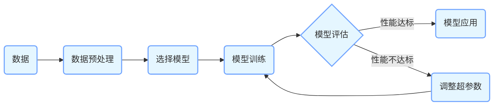

# AI编程：未来的技术挑战

> 关键词：AI编程、技术挑战、人工智能、机器学习、深度学习、算法优化、数据安全

> 摘要：本文围绕AI编程未来面临的技术挑战展开。首先介绍了相关背景知识，包括目的范围、预期读者等内容。接着阐述了AI编程的核心概念与联系，通过文本示意图和Mermaid流程图呈现其架构。深入剖析核心算法原理，并结合Python代码详细讲解具体操作步骤。探讨了数学模型和公式，辅以举例说明。通过项目实战展示代码实现与解读。分析了AI编程的实际应用场景，推荐了学习、开发相关的工具和资源，还列举了相关论文著作。最后总结未来发展趋势与挑战，解答常见问题，并提供扩展阅读和参考资料，旨在全面展现AI编程领域的现状与未来。

## 1. 背景介绍 
### 1.1 目的和范围
AI编程作为当今科技领域的前沿方向，正以前所未有的速度改变着我们的生活和工作方式。本文章的目的在于深入探讨AI编程在未来发展过程中可能面临的各种技术挑战，涵盖从基础算法到实际应用的多个层面。范围包括对机器学习、深度学习等核心技术的分析，以及数据处理、模型优化、安全隐私等相关领域的研究。通过全面的分析，为AI编程领域的研究者、开发者和从业者提供有价值的参考，帮助他们更好地应对未来的挑战。

### 1.2 预期读者
本文预期读者包括但不限于人工智能领域的专业研究者、软件开发者、计算机科学相关专业的学生、对AI编程感兴趣的技术爱好者以及关注科技发展趋势的企业管理者等。无论是希望深入了解AI编程技术细节的专业人士，还是想要初步认识这一领域的初学者，都能从本文中获取有用的信息和知识。

### 1.3 文档结构概述
本文将按照以下结构进行阐述：首先介绍AI编程的背景知识，包括目的、预期读者和文档结构等内容；接着详细讲解AI编程的核心概念与联系，通过示意图和流程图帮助读者理解其架构；深入分析核心算法原理，并结合Python代码说明具体操作步骤；探讨数学模型和公式，通过举例加深读者的理解；进行项目实战，展示代码实现和解读；分析AI编程的实际应用场景；推荐相关的学习、开发工具和资源以及论文著作；总结未来发展趋势与挑战；解答常见问题；最后提供扩展阅读和参考资料。

### 1.4 术语表
#### 1.4.1 核心术语定义
- **AI编程（Artificial Intelligence Programming）**：指利用计算机编程语言实现人工智能相关功能的过程，包括算法设计、模型训练和应用开发等环节。
- **机器学习（Machine Learning）**：是一门多领域交叉学科，涉及概率论、统计学、逼近论、凸分析、算法复杂度理论等多门学科。它专门研究计算机怎样模拟或实现人类的学习行为，以获取新的知识或技能，重新组织已有的知识结构使之不断改善自身的性能。
- **深度学习（Deep Learning）**：是机器学习的一个分支领域，它是一种基于对数据进行表征学习的方法。深度学习通过构建具有很多层的神经网络模型，自动从大量数据中学习到复杂的模式和特征。
- **神经网络（Neural Network）**：是一种模仿人类神经系统的计算模型，由大量的神经元组成，可以自动从数据中学习特征和模式，常用于图像识别、语音识别等领域。
- **模型训练（Model Training）**：指通过将大量的数据输入到模型中，让模型学习数据中的规律和模式，从而调整模型的参数，使其能够对新的数据进行准确的预测和分类。

#### 1.4.2 相关概念解释
- **数据预处理（Data Preprocessing）**：在进行机器学习或深度学习之前，对原始数据进行清洗、转换、归一化等操作，以提高数据的质量和可用性，从而提高模型的性能。
- **过拟合（Overfitting）**：指模型在训练数据上表现很好，但在测试数据或新数据上表现不佳的现象。这是由于模型过于复杂，学习到了训练数据中的噪声和细节，而没有学习到数据的本质规律。
- **欠拟合（Underfitting）**：指模型在训练数据和测试数据上的表现都不佳的现象。这是由于模型过于简单，无法学习到数据中的复杂模式和规律。
- **超参数（Hyperparameters）**：在模型训练之前需要手动设置的参数，如学习率、批量大小、迭代次数等。超参数的选择对模型的性能有很大的影响。

#### 1.4.3 缩略词列表
- **AI**：Artificial Intelligence（人工智能）
- **ML**：Machine Learning（机器学习）
- **DL**：Deep Learning（深度学习）
- **CNN**：Convolutional Neural Network（卷积神经网络）
- **RNN**：Recurrent Neural Network（循环神经网络）
- **LSTM**：Long Short - Term Memory（长短期记忆网络）

## 2. 核心概念与联系 
AI编程涉及多个核心概念，这些概念相互关联，共同构成了AI编程的技术体系。以下是对这些核心概念的详细解释以及它们之间的联系。

### 核心概念原理
- **机器学习**：机器学习的基本原理是通过对大量数据的学习，让计算机自动发现数据中的规律和模式。它主要包括监督学习、无监督学习和强化学习三种类型。监督学习是指在有标注数据的情况下，让模型学习输入数据和输出标签之间的映射关系；无监督学习是指在没有标注数据的情况下，让模型自动发现数据中的结构和模式；强化学习是指智能体通过与环境进行交互，根据环境反馈的奖励信号来学习最优的行为策略。
- **深度学习**：深度学习是机器学习的一个子领域，它通过构建深度神经网络来学习数据的高层抽象特征。深度神经网络由多个隐藏层组成，每个隐藏层包含多个神经元，神经元之间通过权重连接。深度学习模型可以自动从大量数据中学习到复杂的特征和模式，在图像识别、语音识别、自然语言处理等领域取得了巨大的成功。
- **神经网络**：神经网络是一种模仿人类神经系统的计算模型，由输入层、隐藏层和输出层组成。输入层接收外部数据，隐藏层对数据进行特征提取和转换，输出层输出最终的结果。神经网络通过调整神经元之间的权重来学习数据中的模式和规律，常用的训练算法是反向传播算法。

### 架构的文本示意图
AI编程的核心架构可以表示为：数据是AI编程的基础，经过数据预处理后，输入到机器学习或深度学习模型中进行训练。模型训练过程中，需要选择合适的算法和超参数，并通过优化算法不断调整模型的参数，以提高模型的性能。训练好的模型可以应用到实际场景中，如预测、分类、生成等。同时，模型的性能需要通过评估指标进行评估，根据评估结果对模型进行进一步的优化和改进。

### Mermaid流程图


## 3. 核心算法原理 & 具体操作步骤 
### 监督学习算法 - 线性回归
#### 算法原理
线性回归是一种简单而常用的监督学习算法，用于预测连续值的输出。它的基本原理是通过找到一条直线（在二维空间中）或超平面（在多维空间中），使得所有数据点到该直线或超平面的距离之和最小。线性回归模型的数学表达式为：

$y = \theta_0 + \theta_1x_1 + \theta_2x_2 + \cdots + \theta_nx_n$

其中，$y$ 是预测值，$x_1, x_2, \cdots, x_n$ 是输入特征，$\theta_0, \theta_1, \cdots, \theta_n$ 是模型的参数。

#### 具体操作步骤
1. **数据准备**：收集和整理包含输入特征和输出标签的数据集，并将其划分为训练集和测试集。
2. **模型初始化**：随机初始化模型的参数 $\theta_0, \theta_1, \cdots, \theta_n$。
3. **定义损失函数**：常用的损失函数是均方误差（Mean Squared Error, MSE），其数学表达式为：

$MSE = \frac{1}{m}\sum_{i = 1}^{m}(y_i - \hat{y}_i)^2$

其中，$m$ 是样本数量，$y_i$ 是真实值，$\hat{y}_i$ 是预测值。

4. **参数更新**：使用梯度下降算法来更新模型的参数，以最小化损失函数。梯度下降算法的更新公式为：

$\theta_j = \theta_j - \alpha\frac{\partial MSE}{\partial \theta_j}$

其中，$\alpha$ 是学习率，$\frac{\partial MSE}{\partial \theta_j}$ 是损失函数对参数 $\theta_j$ 的偏导数。

5. **模型评估**：使用测试集对训练好的模型进行评估，计算评估指标，如均方误差、均方根误差（Root Mean Squared Error, RMSE）等。

#### Python源代码实现
```python
import numpy as np

class LinearRegression:
    def __init__(self, learning_rate=0.01, num_iterations=1000):
        self.learning_rate = learning_rate
        self.num_iterations = num_iterations
        self.weights = None
        self.bias = None

    def fit(self, X, y):
        num_samples, num_features = X.shape
        self.weights = np.zeros(num_features)
        self.bias = 0

        for _ in range(self.num_iterations):
            y_pred = np.dot(X, self.weights) + self.bias

            dw = (1 / num_samples) * np.dot(X.T, (y_pred - y))
            db = (1 / num_samples) * np.sum(y_pred - y)

            self.weights -= self.learning_rate * dw
            self.bias -= self.learning_rate * db

    def predict(self, X):
        return np.dot(X, self.weights) + self.bias
```

### 无监督学习算法 - K - 均值聚类
#### 算法原理
K - 均值聚类是一种常用的无监督学习算法，用于将数据点划分为 $K$ 个不同的簇。它的基本原理是通过迭代的方式，不断调整簇的中心位置，使得每个数据点到其所属簇中心的距离之和最小。

#### 具体操作步骤
1. **初始化簇中心**：随机选择 $K$ 个数据点作为初始的簇中心。
2. **分配数据点**：计算每个数据点到各个簇中心的距离，将其分配到距离最近的簇中。
3. **更新簇中心**：计算每个簇中所有数据点的均值，将其作为新的簇中心。
4. **重复步骤2和3**：直到簇中心不再发生变化或达到最大迭代次数。

#### Python源代码实现
```python
import numpy as np

class KMeans:
    def __init__(self, k=3, max_iterations=100):
        self.k = k
        self.max_iterations = max_iterations
        self.centroids = None

    def fit(self, X):
        num_samples, num_features = X.shape
        # 随机初始化簇中心
        random_indices = np.random.choice(num_samples, self.k, replace=False)
        self.centroids = X[random_indices]

        for _ in range(self.max_iterations):
            # 分配数据点到最近的簇
            clusters = [[] for _ in range(self.k)]
            for sample in X:
                distances = [np.linalg.norm(sample - centroid) for centroid in self.centroids]
                cluster_index = np.argmin(distances)
                clusters[cluster_index].append(sample)

            # 更新簇中心
            previous_centroids = self.centroids
            for cluster_index, cluster in enumerate(clusters):
                if len(cluster) > 0:
                    self.centroids[cluster_index] = np.mean(cluster, axis=0)

            # 检查是否收敛
            if np.allclose(self.centroids, previous_centroids):
                break

    def predict(self, X):
        predictions = []
        for sample in X:
            distances = [np.linalg.norm(sample - centroid) for centroid in self.centroids]
            cluster_index = np.argmin(distances)
            predictions.append(cluster_index)
        return np.array(predictions)
```

## 4. 数学模型和公式 & 详细讲解 & 举例说明 
### 线性回归的数学模型和公式
#### 数学模型
线性回归的数学模型可以表示为：

$y = \theta_0 + \theta_1x_1 + \theta_2x_2 + \cdots + \theta_nx_n + \epsilon$

其中，$y$ 是因变量，$x_1, x_2, \cdots, x_n$ 是自变量，$\theta_0, \theta_1, \cdots, \theta_n$ 是模型的参数，$\epsilon$ 是误差项，服从均值为 0 的正态分布。

#### 损失函数
线性回归常用的损失函数是均方误差（MSE），其数学表达式为：

$MSE = \frac{1}{m}\sum_{i = 1}^{m}(y_i - \hat{y}_i)^2$

其中，$m$ 是样本数量，$y_i$ 是真实值，$\hat{y}_i$ 是预测值。

#### 梯度下降算法
梯度下降算法是一种常用的优化算法，用于最小化损失函数。它的基本思想是沿着损失函数的负梯度方向更新模型的参数。对于线性回归，损失函数对参数 $\theta_j$ 的偏导数为：

$\frac{\partial MSE}{\partial \theta_j} = \frac{2}{m}\sum_{i = 1}^{m}(y_i - \hat{y}_i)(-x_{ij})$

其中，$x_{ij}$ 是第 $i$ 个样本的第 $j$ 个特征。

#### 举例说明
假设我们有一个简单的二维数据集，包含 10 个样本，输入特征 $x$ 和输出标签 $y$ 如下：

| $x$ | $y$ |
|---|---|
| 1 | 2 |
| 2 | 4 |
| 3 | 6 |
| 4 | 8 |
| 5 | 10 |
| 6 | 12 |
| 7 | 14 |
| 8 | 16 |
| 9 | 18 |
| 10 | 20 |

我们可以使用线性回归模型来拟合这个数据集。首先，我们初始化模型的参数 $\theta_0 = 0$ 和 $\theta_1 = 0$，学习率 $\alpha = 0.01$，迭代次数为 1000 次。然后，使用梯度下降算法不断更新模型的参数，直到损失函数收敛。最终，我们可以得到一个拟合直线 $y = 2x$，这与我们的数据规律相符。

### 逻辑回归的数学模型和公式
#### 数学模型
逻辑回归是一种用于分类的算法，它的数学模型基于逻辑函数（也称为 Sigmoid 函数）。逻辑函数的表达式为：

$\sigma(z)=\frac{1}{1 + e^{-z}}$

其中，$z=\theta_0+\theta_1x_1+\theta_2x_2+\cdots+\theta_nx_n$。逻辑回归模型的预测概率为：

$P(y = 1|x)=\sigma(z)$

#### 损失函数
逻辑回归常用的损失函数是对数损失函数（也称为交叉熵损失函数），其数学表达式为：

$J(\theta)=-\frac{1}{m}\sum_{i = 1}^{m}[y_i\log(P(y_i = 1|x_i))+(1 - y_i)\log(1 - P(y_i = 1|x_i))]$

#### 梯度下降算法
对损失函数 $J(\theta)$ 求关于 $\theta_j$ 的偏导数，得到：

$\frac{\partial J(\theta)}{\partial \theta_j}=\frac{1}{m}\sum_{i = 1}^{m}(P(y_i = 1|x_i)-y_i)x_{ij}$

然后使用梯度下降算法更新参数 $\theta_j$：

$\theta_j=\theta_j-\alpha\frac{\partial J(\theta)}{\partial \theta_j}$

#### 举例说明
假设我们有一个二分类问题，数据集包含两个特征 $x_1$ 和 $x_2$，以及对应的标签 $y$（0 或 1）。我们可以使用逻辑回归模型来预测样本属于类别 1 的概率。通过不断调整模型的参数 $\theta_0, \theta_1, \theta_2$，使得损失函数最小化，最终得到一个能够较好区分两个类别的决策边界。

## 5. 项目实战：代码实际案例和详细解释说明 
### 5.1  开发环境搭建
#### 操作系统
本项目可以在多种操作系统上进行开发，如 Windows、Linux（如 Ubuntu）和 macOS。建议使用 Linux 或 macOS 系统，因为它们对 Python 开发环境的支持更好。

#### Python 安装
确保系统中已经安装了 Python 3.x 版本。可以从 Python 官方网站（https://www.python.org/downloads/） 下载并安装最新版本的 Python。安装完成后，可以在命令行中输入 `python --version` 来验证 Python 是否安装成功。

#### 虚拟环境创建
为了避免不同项目之间的依赖冲突，建议使用虚拟环境来管理项目的依赖。可以使用 `venv` 模块来创建虚拟环境，命令如下：

```bash
python -m venv myenv
```

激活虚拟环境：

- 在 Windows 系统上：

```bash
myenv\Scripts\activate
```

- 在 Linux 或 macOS 系统上：

```bash
source myenv/bin/activate
```

#### 依赖库安装
本项目需要安装一些常用的 Python 库，如 `numpy`、`pandas`、`scikit-learn`、`matplotlib` 等。可以使用 `pip` 来安装这些库，命令如下：

```bash
pip install numpy pandas scikit-learn matplotlib
```

### 5.2  源代码详细实现和代码解读
#### 项目背景
本项目是一个简单的房价预测项目，使用波士顿房价数据集。我们将使用线性回归模型来预测房价。

#### 代码实现
```python
import numpy as np
import pandas as pd
from sklearn.datasets import load_boston
from sklearn.model_selection import train_test_split
from sklearn.linear_model import LinearRegression
from sklearn.metrics import mean_squared_error
import matplotlib.pyplot as plt

# 加载数据集
boston = load_boston()
X = boston.data
y = boston.target

# 划分训练集和测试集
X_train, X_test, y_train, y_test = train_test_split(X, y, test_size=0.2, random_state=42)

# 创建线性回归模型
model = LinearRegression()

# 训练模型
model.fit(X_train, y_train)

# 预测
y_pred = model.predict(X_test)

# 计算均方误差
mse = mean_squared_error(y_test, y_pred)
print(f"均方误差: {mse}")

# 可视化预测结果
plt.scatter(y_test, y_pred)
plt.xlabel('真实房价')
plt.ylabel('预测房价')
plt.title('真实房价 vs 预测房价')
plt.show()
```

#### 代码解读
1. **数据加载**：使用 `sklearn.datasets` 中的 `load_boston` 函数加载波士顿房价数据集，将特征数据存储在 `X` 中，目标数据存储在 `y` 中。
2. **数据划分**：使用 `train_test_split` 函数将数据集划分为训练集和测试集，测试集占比为 20%。
3. **模型创建**：创建一个 `LinearRegression` 模型对象。
4. **模型训练**：使用训练集数据对模型进行训练，调用 `fit` 方法。
5. **模型预测**：使用训练好的模型对测试集数据进行预测，调用 `predict` 方法。
6. **模型评估**：使用 `mean_squared_error` 函数计算预测结果和真实结果之间的均方误差。
7. **可视化**：使用 `matplotlib` 库绘制真实房价和预测房价的散点图，直观展示模型的预测效果。

### 5.3  代码解读与分析
#### 模型性能分析
均方误差（MSE）是衡量模型预测误差的一个重要指标。MSE 值越小，说明模型的预测效果越好。在本项目中，我们可以通过调整模型的参数（如正则化参数）或使用其他更复杂的模型来进一步降低 MSE 值，提高模型的性能。

#### 代码优化建议
- **特征工程**：可以对原始特征进行处理，如特征缩放、特征选择等，以提高模型的性能。
- **模型选择**：尝试使用其他回归模型，如决策树回归、随机森林回归等，比较不同模型的性能。
- **交叉验证**：使用交叉验证技术来评估模型的稳定性和泛化能力。

## 6. 实际应用场景 
### 医疗领域
AI编程在医疗领域有着广泛的应用。例如，在疾病诊断方面，通过对大量的医学影像（如X光、CT、MRI等）进行分析，AI模型可以帮助医生更准确地检测出疾病，如肿瘤、肺炎等。在药物研发方面，AI可以通过对分子结构和生物活性数据的分析，加速新药的发现和研发过程。此外，AI还可以用于医疗健康管理，如预测患者的疾病风险、制定个性化的治疗方案等。

### 金融领域
在金融领域，AI编程可以用于风险评估、信用评分、欺诈检测等方面。通过对大量的金融数据进行分析，AI模型可以预测市场趋势，帮助投资者做出更明智的投资决策。在信用评分方面，AI可以综合考虑多个因素，如个人的信用历史、收入水平、负债情况等，更准确地评估个人的信用风险。在欺诈检测方面，AI可以实时监测交易数据，识别出异常的交易行为，及时防范金融欺诈。

### 交通领域
AI编程在交通领域的应用主要包括自动驾驶、智能交通管理等方面。在自动驾驶方面，AI通过对传感器数据（如摄像头、雷达、激光雷达等）的处理和分析，实现车辆的自主导航、避障、决策等功能。在智能交通管理方面，AI可以通过对交通流量数据的分析，优化交通信号灯的控制策略，提高道路的通行效率，减少交通拥堵。

### 教育领域
在教育领域，AI编程可以用于个性化学习、智能辅导等方面。通过对学生的学习数据进行分析，AI可以了解学生的学习习惯、学习进度和学习能力，为学生提供个性化的学习方案和学习资源。在智能辅导方面，AI可以模拟教师的角色，为学生提供实时的辅导和答疑，帮助学生更好地掌握知识。

### 娱乐领域
AI编程在娱乐领域的应用包括游戏开发、内容推荐等方面。在游戏开发方面，AI可以用于实现游戏中的智能角色，使游戏更加具有挑战性和趣味性。在内容推荐方面，AI可以通过对用户的兴趣爱好、历史行为等数据的分析，为用户推荐个性化的音乐、电影、书籍等内容，提高用户的满意度。

## 7. 工具和资源推荐
### 7.1 学习资源推荐
#### 7.1.1 书籍推荐
- 《Python机器学习》（Sebastian Raschka 著）：这本书详细介绍了Python在机器学习中的应用，包括各种机器学习算法的原理和实现，以及如何使用Python库（如scikit-learn、TensorFlow等）进行模型训练和评估。
- 《深度学习》（Ian Goodfellow、Yoshua Bengio和Aaron Courville 著）：被称为深度学习领域的“圣经”，全面介绍了深度学习的基本概念、算法和应用，适合有一定数学基础和编程基础的读者。
- 《人工智能：一种现代的方法》（Stuart Russell和Peter Norvig 著）：是人工智能领域的经典教材，涵盖了人工智能的各个方面，包括搜索算法、知识表示、机器学习、自然语言处理等。

#### 7.1.2 在线课程
- Coursera上的“机器学习”课程（Andrew Ng 教授）：这是一门非常经典的机器学习课程，由斯坦福大学的Andrew Ng教授主讲，课程内容涵盖了机器学习的基本概念、算法和应用，适合初学者。
- edX上的“深度学习微硕士”课程：该课程由多个知名大学和机构联合推出，内容包括深度学习的基础理论、卷积神经网络、循环神经网络等，适合有一定机器学习基础的学习者。
- 哔哩哔哩（B 站）上的“Python人工智能从入门到精通”系列视频：这些视频由国内的一些技术博主制作，内容通俗易懂，适合初学者快速入门。

#### 7.1.3 技术博客和网站
- Medium：这是一个技术社区，有很多关于AI编程的优秀文章，涵盖了最新的技术趋势、算法实现和应用案例等。
- Towards Data Science：是Medium上的一个专注于数据科学和AI编程的专栏，有很多高质量的技术文章和教程。
- 机器之心：是国内的一个专注于人工智能领域的媒体平台，提供了丰富的技术资讯、研究成果和行业动态。

### 7.2 开发工具框架推荐
#### 7.2.1 IDE和编辑器
- PyCharm：是一款专门为Python开发设计的集成开发环境（IDE），具有强大的代码编辑、调试、代码分析等功能，适合专业的Python开发者。
- Jupyter Notebook：是一个基于Web的交互式开发环境，支持多种编程语言，尤其适合数据科学和机器学习领域的开发和实验。
- Visual Studio Code：是一款轻量级的代码编辑器，具有丰富的插件生态系统，可以通过安装Python相关的插件来实现Python开发的功能。

#### 7.2.2 调试和性能分析工具
- Py-Spy：是一个用于Python代码性能分析的工具，可以实时监测Python程序的CPU使用率、函数调用时间等信息，帮助开发者找出性能瓶颈。
- PDB：是Python自带的调试器，可以在代码中设置断点，单步执行代码，查看变量的值等，帮助开发者调试代码。
- TensorBoard：是TensorFlow提供的一个可视化工具，可以用于可视化模型的训练过程、损失函数的变化、模型的结构等信息。

#### 7.2.3 相关框架和库
- TensorFlow：是Google开发的一个开源的机器学习框架，具有高度的灵活性和可扩展性，支持多种深度学习模型的开发和训练。
- PyTorch：是Facebook开发的一个开源的深度学习框架，以其简洁的API和动态计算图的特性受到了很多研究者和开发者的喜爱。
- scikit-learn：是一个简单而高效的机器学习库，提供了各种机器学习算法的实现，包括分类、回归、聚类等，适合初学者快速上手。

### 7.3 相关论文著作推荐
#### 7.3.1 经典论文
- “ImageNet Classification with Deep Convolutional Neural Networks”（Alex Krizhevsky、Ilya Sutskever和Geoffrey E. Hinton 著）：这篇论文介绍了AlexNet，是深度学习在图像识别领域的开创性工作，标志着深度学习时代的到来。
- “Long Short-Term Memory”（Sepp Hochreiter和Jürgen Schmidhuber 著）：这篇论文提出了长短期记忆网络（LSTM），解决了传统循环神经网络在处理长序列数据时的梯度消失问题，在自然语言处理等领域得到了广泛应用。
- “Attention Is All You Need”（Ashish Vaswani等人 著）：这篇论文提出了Transformer模型，引入了注意力机制，在自然语言处理领域取得了巨大的成功，成为了当前很多自然语言处理模型的基础。

#### 7.3.2 最新研究成果
- 关注顶级学术会议（如NeurIPS、ICML、CVPR等）上的最新研究成果，这些会议汇集了人工智能领域的最新研究进展和前沿技术。
- 关注知名学术期刊（如Journal of Artificial Intelligence Research、Artificial Intelligence等）上的论文，这些期刊发表了很多高质量的人工智能研究论文。

#### 7.3.3 应用案例分析
- 《AI未来进行式》（李开复、王咏刚 著）：这本书通过多个实际应用案例，介绍了AI在医疗、交通、金融等领域的应用和发展趋势，帮助读者更好地理解AI的实际应用场景。
- 一些行业报告和研究机构的分析文章，如麦肯锡、波士顿咨询等机构发布的关于AI应用的报告，提供了很多有价值的应用案例和行业洞察。

## 8. 总结：未来发展趋势与挑战
### 未来发展趋势
#### 融合发展
AI编程将与其他技术（如物联网、区块链、5G等）深度融合，创造出更多的应用场景和商业机会。例如，物联网产生的大量数据可以为AI模型提供丰富的训练素材，而AI可以对物联网数据进行分析和处理，实现智能决策和控制。

#### 自动化和智能化
未来的AI编程将越来越自动化和智能化。例如，自动机器学习（AutoML）技术可以自动选择合适的模型、算法和超参数，降低了AI开发的门槛。同时，AI模型将具有更强的自主学习和自适应能力，能够在不同的环境中自动调整和优化。

#### 跨学科应用
AI编程将在更多的跨学科领域得到应用，如生物医学、环境科学、社会科学等。通过与其他学科的交叉融合，AI可以为解决复杂的现实问题提供新的思路和方法。

### 挑战
#### 数据安全和隐私问题
随着AI的发展，数据的重要性日益凸显。然而，数据安全和隐私问题也成为了一个严峻的挑战。如何保护用户的个人数据不被泄露和滥用，如何防止数据被恶意攻击和篡改，是AI编程领域需要解决的重要问题。

#### 算法可解释性问题
很多AI模型（如深度学习模型）是黑盒模型，其决策过程和结果难以解释。在一些关键领域（如医疗、金融等），模型的可解释性至关重要。如何提高AI算法的可解释性，让人们能够理解模型的决策过程和依据，是一个亟待解决的问题。

#### 伦理和道德问题
AI的发展也带来了一系列的伦理和道德问题，如AI是否会取代人类的工作、AI是否会对人类的价值观和社会秩序产生影响等。如何制定合理的伦理和道德准则，确保AI的发展符合人类的利益和价值观，是AI编程领域需要面对的挑战。

#### 人才短缺问题
AI编程是一个高度专业化的领域，需要具备深厚的数学、计算机科学和人工智能知识的专业人才。然而，目前全球范围内AI人才短缺的问题比较严重，如何培养和吸引更多的AI人才，是推动AI编程发展的关键。

## 9. 附录：常见问题与解答
### 问题1：AI编程需要具备哪些基础知识？
答：AI编程需要具备一定的数学基础（如线性代数、概率论、统计学等）、编程基础（如Python语言）和机器学习、深度学习等相关知识。

### 问题2：如何选择合适的AI模型？
答：选择合适的AI模型需要考虑多个因素，如问题的类型（分类、回归、聚类等）、数据的特点（数据量、特征维度等）、模型的复杂度和性能要求等。可以通过实验和比较不同模型的性能来选择最合适的模型。

### 问题3：如何解决AI模型的过拟合和欠拟合问题？
答：解决过拟合问题可以采用正则化、增加数据量、减少模型复杂度等方法；解决欠拟合问题可以采用增加模型复杂度、选择更合适的特征等方法。

### 问题4：AI编程的未来发展前景如何？
答：AI编程的未来发展前景非常广阔，将在各个领域得到广泛的应用。随着技术的不断进步和创新，AI编程将为人类社会带来更多的便利和价值。

### 问题5：如何提高AI编程的能力？
答：可以通过学习相关的知识和技能、参加实践项目、阅读优秀的技术文章和书籍、参与开源项目等方式来提高AI编程的能力。

## 10. 扩展阅读 & 参考资料
### 扩展阅读
- 《人类简史：从动物到上帝》（尤瓦尔·赫拉利 著）：这本书从人类历史的角度探讨了人类的发展和演变，对于理解AI对人类社会的影响有一定的启示作用。
- 《奇点临近》（雷·库兹韦尔 著）：书中探讨了技术奇点的概念，以及AI等技术的发展对人类未来的影响。

### 参考资料
- 相关学术论文和研究报告
- 各开源框架和库的官方文档（如TensorFlow、PyTorch、scikit-learn等）
- 知名技术博客和网站上的文章（如Medium、Towards Data Science、机器之心等）