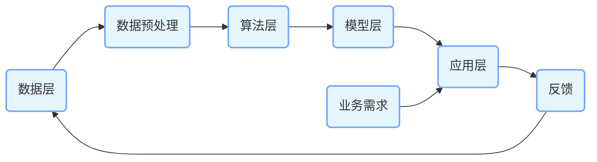

# AI编程：程序员的职业新机遇

> 关键词：AI编程、程序员、职业机遇、人工智能、机器学习、深度学习、编程技术

> 摘要：本文围绕AI编程为程序员带来的职业新机遇展开探讨。首先介绍了相关背景，包括目的范围、预期读者等内容。接着阐述了AI编程的核心概念与联系，深入剖析其原理和架构，并通过Mermaid流程图呈现。详细讲解了核心算法原理及具体操作步骤，辅以Python源代码。对AI编程涉及的数学模型和公式进行了详细讲解与举例说明。通过项目实战展示代码实际案例并解释说明。分析了AI编程的实际应用场景，推荐了相关的学习资源、开发工具框架以及论文著作。最后总结了AI编程未来发展趋势与挑战，解答常见问题并提供扩展阅读和参考资料，旨在帮助程序员全面了解AI编程带来的新机遇并做好职业发展规划。

## 1. 背景介绍 
### 1.1 目的和范围
在当今数字化时代，人工智能（AI）已经成为推动科技进步和社会发展的关键力量。AI编程作为实现人工智能的重要手段，正逐渐改变着各个行业的面貌。本文的目的在于深入探讨AI编程为程序员带来的职业新机遇，分析其背后的技术原理、应用场景以及未来发展趋势。范围涵盖了AI编程的核心概念、算法原理、数学模型、项目实战等多个方面，旨在为程序员提供全面而深入的指导，帮助他们更好地把握这一职业发展的新方向。

### 1.2 预期读者
本文主要面向广大程序员群体，无论是初入职场的新手程序员，还是有一定经验的资深开发者，都能从本文中获取有价值的信息。同时，对于对AI编程感兴趣的计算机相关专业学生、技术爱好者以及关注行业发展的人士也具有一定的参考价值。

### 1.3 文档结构概述
本文将按照以下结构进行阐述：首先介绍AI编程的背景知识，包括目的范围、预期读者等；接着深入探讨AI编程的核心概念与联系，通过文本示意图和Mermaid流程图呈现其原理和架构；详细讲解核心算法原理及具体操作步骤，并使用Python源代码进行说明；对AI编程涉及的数学模型和公式进行详细讲解与举例；通过项目实战展示代码实际案例并进行解释分析；分析AI编程的实际应用场景；推荐相关的学习资源、开发工具框架以及论文著作；最后总结AI编程的未来发展趋势与挑战，解答常见问题并提供扩展阅读和参考资料。

### 1.4 术语表
#### 1.4.1 核心术语定义
- **人工智能（Artificial Intelligence，AI）**：指让计算机系统能够模拟人类智能的理论、方法、技术及应用系统，包括学习、推理、感知、决策等能力。
- **机器学习（Machine Learning，ML）**：是人工智能的一个分支，它致力于研究如何通过数据让计算机自动学习规律，并利用这些规律对未知数据进行预测或决策。
- **深度学习（Deep Learning，DL）**：是机器学习的一个子领域，基于人工神经网络，通过构建多层神经网络模型来学习数据的深层次特征表示。
- **AI编程**：指使用编程语言和相关工具来实现人工智能算法和系统的过程。

#### 1.4.2 相关概念解释
- **数据挖掘**：从大量数据中发现有价值信息和知识的过程，与机器学习有密切联系，机器学习的算法可以用于数据挖掘任务。
- **自然语言处理（Natural Language Processing，NLP）**：是AI的一个重要领域，旨在让计算机能够理解、处理和生成人类语言，如文本分类、机器翻译等。
- **计算机视觉（Computer Vision，CV）**：研究如何让计算机从图像或视频中获取信息并理解场景，如图像识别、目标检测等。

#### 1.4.3 缩略词列表
- **AI**：Artificial Intelligence（人工智能）
- **ML**：Machine Learning（机器学习）
- **DL**：Deep Learning（深度学习）
- **NLP**：Natural Language Processing（自然语言处理）
- **CV**：Computer Vision（计算机视觉）

## 2. 核心概念与联系 
### 2.1 核心概念原理
#### 2.1.1 人工智能
人工智能的目标是使计算机系统具备类似于人类的智能行为。它的实现方式包括符号主义、连接主义和行为主义等不同的流派。符号主义强调通过逻辑推理和知识表示来实现智能；连接主义基于人工神经网络，模拟人类大脑的神经元结构和工作方式；行为主义则关注智能体与环境的交互行为。

#### 2.1.2 机器学习
机器学习是人工智能的重要实现手段。其基本原理是通过对大量数据的学习，构建模型来发现数据中的规律和模式。常见的机器学习任务包括监督学习、无监督学习和强化学习。监督学习是指在有标签的数据上进行学习，通过学习输入数据和对应的标签之间的关系来进行预测；无监督学习则是在无标签的数据上进行学习，发现数据的内在结构和规律；强化学习是通过智能体与环境的交互，根据环境反馈的奖励信号来学习最优的行为策略。

#### 2.1.3 深度学习
深度学习是机器学习的一个高级阶段，它通过构建深度神经网络来学习数据的深层次特征表示。深度神经网络由多个隐藏层组成，每个隐藏层包含多个神经元，通过不断调整神经元之间的连接权重来优化模型的性能。深度学习在图像识别、语音识别、自然语言处理等领域取得了巨大的成功。

### 2.2 架构的文本示意图
AI编程的整体架构可以看作是一个多层次的结构。底层是数据层，包括各种类型的数据，如文本、图像、音频等。数据经过预处理后，进入算法层，这里包含各种机器学习和深度学习算法，如决策树、神经网络等。算法层的输出通过模型层进行封装和优化，形成可以实际应用的模型。最上层是应用层，将训练好的模型应用到具体的业务场景中，如智能客服、自动驾驶等。

### 2.3 Mermaid流程图

该流程图展示了AI编程从数据获取到最终应用的整个过程。数据层提供原始数据，经过预处理后进入算法层进行模型训练，训练好的模型在模型层进行优化和封装，最终应用到应用层的具体业务场景中。业务需求驱动整个流程，应用的反馈又可以促进数据的更新和模型的优化。

## 3. 核心算法原理 & 具体操作步骤 
### 3.1 监督学习算法 - 线性回归
#### 3.1.1 算法原理
线性回归是一种简单而常用的监督学习算法，用于预测连续数值的输出。其基本思想是通过找到一条最佳的直线（在多维空间中是超平面）来拟合输入数据和输出数据之间的关系。假设输入特征为 $x_1, x_2, \cdots, x_n$，输出为 $y$，线性回归模型可以表示为：
$$y = \theta_0 + \theta_1x_1 + \theta_2x_2 + \cdots + \theta_nx_n + \epsilon$$
其中 $\theta_0, \theta_1, \cdots, \theta_n$ 是模型的参数，$\epsilon$ 是误差项。线性回归的目标是找到一组最优的参数 $\theta$，使得预测值与真实值之间的误差最小。通常使用最小二乘法来求解最优参数，即最小化误差平方和：
$$J(\theta) = \frac{1}{2m}\sum_{i=1}^{m}(h_{\theta}(x^{(i)}) - y^{(i)})^2$$
其中 $m$ 是样本数量，$h_{\theta}(x^{(i)})$ 是第 $i$ 个样本的预测值，$y^{(i)}$ 是第 $i$ 个样本的真实值。

#### 3.1.2 具体操作步骤
1. **数据准备**：收集和整理包含输入特征和对应输出值的数据集。
2. **数据预处理**：对数据进行清洗、归一化等操作，以提高模型的性能。
3. **模型初始化**：随机初始化模型的参数 $\theta$。
4. **计算误差**：根据当前的参数 $\theta$ 计算预测值，并计算误差平方和 $J(\theta)$。
5. **参数更新**：使用梯度下降法等优化算法更新参数 $\theta$，使得误差平方和 $J(\theta)$ 逐渐减小。
6. **重复步骤4和5**：直到误差平方和收敛或达到预设的迭代次数。
7. **模型评估**：使用测试集评估训练好的模型的性能。

#### 3.1.3 Python源代码实现
```python
import numpy as np

class LinearRegression:
    def __init__(self, learning_rate=0.01, num_iterations=1000):
        self.learning_rate = learning_rate
        self.num_iterations = num_iterations
        self.weights = None
        self.bias = None

    def fit(self, X, y):
        num_samples, num_features = X.shape
        self.weights = np.zeros(num_features)
        self.bias = 0

        for _ in range(self.num_iterations):
            y_predicted = np.dot(X, self.weights) + self.bias

            dw = (1 / num_samples) * np.dot(X.T, (y_predicted - y))
            db = (1 / num_samples) * np.sum(y_predicted - y)

            self.weights -= self.learning_rate * dw
            self.bias -= self.learning_rate * db

    def predict(self, X):
        y_pred = np.dot(X, self.weights) + self.bias
        return y_pred
```

### 3.2 无监督学习算法 - K均值聚类
#### 3.2.1 算法原理
K均值聚类是一种常用的无监督学习算法，用于将数据集划分为 $K$ 个不同的簇。其基本思想是通过迭代的方式不断更新簇的中心，使得每个样本到其所属簇中心的距离之和最小。具体步骤如下：
1. **初始化簇中心**：随机选择 $K$ 个样本作为初始的簇中心。
2. **分配样本**：将每个样本分配到距离其最近的簇中心所在的簇。
3. **更新簇中心**：计算每个簇中所有样本的均值，将其作为新的簇中心。
4. **重复步骤2和3**：直到簇中心不再发生变化或达到预设的迭代次数。

#### 3.2.2 具体操作步骤
1. **数据准备**：收集和整理数据集。
2. **初始化簇中心**：随机选择 $K$ 个样本作为初始的簇中心。
3. **迭代更新**：重复执行分配样本和更新簇中心的操作，直到收敛。
4. **输出结果**：得到每个样本所属的簇。

#### 3.2.3 Python源代码实现
```python
import numpy as np

class KMeans:
    def __init__(self, k=3, max_iterations=100):
        self.k = k
        self.max_iterations = max_iterations
        self.centroids = None

    def fit(self, X):
        # 随机初始化簇中心
        random_indices = np.random.choice(len(X), self.k, replace=False)
        self.centroids = X[random_indices]

        for _ in range(self.max_iterations):
            # 分配样本到最近的簇
            clusters = [[] for _ in range(self.k)]
            for sample in X:
                distances = [np.linalg.norm(sample - centroid) for centroid in self.centroids]
                closest_centroid_index = np.argmin(distances)
                clusters[closest_centroid_index].append(sample)

            # 更新簇中心
            new_centroids = []
            for cluster in clusters:
                if len(cluster) > 0:
                    new_centroid = np.mean(cluster, axis=0)
                    new_centroids.append(new_centroid)
                else:
                    # 如果某个簇为空，重新随机选择一个样本作为簇中心
                    new_centroid = X[np.random.choice(len(X))]
                    new_centroids.append(new_centroid)

            # 判断是否收敛
            if np.allclose(self.centroids, new_centroids):
                break

            self.centroids = np.array(new_centroids)

    def predict(self, X):
        labels = []
        for sample in X:
            distances = [np.linalg.norm(sample - centroid) for centroid in self.centroids]
            closest_centroid_index = np.argmin(distances)
            labels.append(closest_centroid_index)
        return np.array(labels)
```

## 4. 数学模型和公式 & 详细讲解 & 举例说明 
### 4.1 线性回归的数学模型和公式
#### 4.1.1 详细讲解
线性回归的数学模型如前面所述为 $y = \theta_0 + \theta_1x_1 + \theta_2x_2 + \cdots + \theta_nx_n + \epsilon$，其中 $\theta_0$ 是截距项，$\theta_1, \theta_2, \cdots, \theta_n$ 是斜率项。误差平方和 $J(\theta) = \frac{1}{2m}\sum_{i=1}^{m}(h_{\theta}(x^{(i)}) - y^{(i)})^2$ 是线性回归的损失函数，其目的是衡量模型预测值与真实值之间的误差。梯度下降法是一种常用的优化算法，用于求解损失函数的最小值。梯度下降法的更新公式为：
$$\theta_j := \theta_j - \alpha\frac{\partial J(\theta)}{\partial \theta_j}$$
其中 $\alpha$ 是学习率，控制参数更新的步长。

#### 4.1.2 举例说明
假设我们有一个简单的数据集，包含两个特征 $x_1$ 和 $x_2$，以及对应的输出值 $y$。数据集如下：
| $x_1$ | $x_2$ | $y$ |
|-------|-------|-----|
| 1     | 2     | 5   |
| 2     | 3     | 8   |
| 3     | 4     | 11  |

我们可以使用线性回归模型来拟合这个数据集。首先，我们将数据集表示为矩阵形式：
$$X = \begin{bmatrix}
1 & 1 & 2 \\
1 & 2 & 3 \\
1 & 3 & 4
\end{bmatrix}, y = \begin{bmatrix}
5 \\
8 \\
11
\end{bmatrix}$$
其中第一列的 1 是为了表示截距项。假设初始参数 $\theta = \begin{bmatrix}
0 \\
0 \\
0
\end{bmatrix}$，学习率 $\alpha = 0.01$，迭代次数为 1000 次。通过梯度下降法不断更新参数 $\theta$，最终可以得到最优的参数估计值。

### 4.2 逻辑回归的数学模型和公式
#### 4.2.1 详细讲解
逻辑回归是一种用于分类问题的监督学习算法。它通过逻辑函数（也称为 sigmoid 函数）将线性回归的输出映射到 $[0, 1]$ 之间的概率值。逻辑函数的定义为：
$$\sigma(z) = \frac{1}{1 + e^{-z}}$$
其中 $z = \theta_0 + \theta_1x_1 + \theta_2x_2 + \cdots + \theta_nx_n$。逻辑回归的损失函数通常使用对数损失函数，也称为交叉熵损失函数：
$$J(\theta) = -\frac{1}{m}\sum_{i=1}^{m}[y^{(i)}\log(h_{\theta}(x^{(i)})) + (1 - y^{(i)})\log(1 - h_{\theta}(x^{(i)}))]$$
其中 $h_{\theta}(x^{(i)}) = \sigma(\theta^T x^{(i)})$ 是第 $i$ 个样本的预测概率。同样，我们可以使用梯度下降法来求解损失函数的最小值，梯度下降的更新公式与线性回归类似。

#### 4.2.2 举例说明
假设我们有一个二分类问题，数据集包含两个特征 $x_1$ 和 $x_2$，以及对应的类别标签 $y$（0 或 1）。数据集如下：
| $x_1$ | $x_2$ | $y$ |
|-------|-------|-----|
| 1     | 2     | 0   |
| 2     | 3     | 1   |
| 3     | 4     | 1   |

我们可以使用逻辑回归模型来对这个数据集进行分类。首先，将数据集表示为矩阵形式，然后初始化参数 $\theta$，通过梯度下降法不断更新参数，直到损失函数收敛。最终得到的模型可以用于预测新样本的类别概率。

## 5. 项目实战：代码实际案例和详细解释说明 
### 5.1  开发环境搭建
#### 5.1.1 操作系统
可以选择 Windows、Linux 或 macOS 等常见的操作系统。建议使用 Linux 系统，因为它在开发和部署方面具有更好的兼容性和稳定性。

#### 5.1.2 编程语言
选择 Python 作为主要的编程语言，因为 Python 具有丰富的机器学习和深度学习库，如 NumPy、Pandas、Scikit-learn、TensorFlow、PyTorch 等。

#### 5.1.3 开发工具
可以使用 Anaconda 来管理 Python 环境和安装相关的库。Anaconda 提供了一个集成的开发环境，方便我们进行数据处理、模型训练和可视化等操作。同时，可以使用 PyCharm、Jupyter Notebook 等开发工具进行代码编写和调试。

### 5.2  源代码详细实现和代码解读
#### 5.2.1 项目背景
我们以一个简单的手写数字识别项目为例，使用深度学习框架 PyTorch 来实现一个卷积神经网络（Convolutional Neural Network，CNN）模型。手写数字识别是计算机视觉领域的经典问题，通过训练模型可以识别手写数字的类别。

#### 5.2.2 代码实现
```python
import torch
import torch.nn as nn
import torch.optim as optim
from torchvision import datasets, transforms
from torch.utils.data import DataLoader

# 数据预处理
transform = transforms.Compose([
    transforms.ToTensor(),
    transforms.Normalize((0.1307,), (0.3081,))
])

# 加载数据集
train_dataset = datasets.MNIST(root='./data', train=True,
                               download=True, transform=transform)
test_dataset = datasets.MNIST(root='./data', train=False,
                              download=True, transform=transform)

# 创建数据加载器
train_loader = DataLoader(train_dataset, batch_size=64, shuffle=True)
test_loader = DataLoader(test_dataset, batch_size=64, shuffle=False)

# 定义卷积神经网络模型
class CNN(nn.Module):
    def __init__(self):
        super(CNN, self).__init__()
        self.conv1 = nn.Conv2d(1, 10, kernel_size=5)
        self.conv2 = nn.Conv2d(10, 20, kernel_size=5)
        self.fc1 = nn.Linear(320, 50)
        self.fc2 = nn.Linear(50, 10)

    def forward(self, x):
        x = nn.functional.relu(nn.functional.max_pool2d(self.conv1(x), 2))
        x = nn.functional.relu(nn.functional.max_pool2d(self.conv2(x), 2))
        x = x.view(-1, 320)
        x = nn.functional.relu(self.fc1(x))
        x = self.fc2(x)
        return nn.functional.log_softmax(x, dim=1)

# 初始化模型、损失函数和优化器
model = CNN()
criterion = nn.NLLLoss()
optimizer = optim.SGD(model.parameters(), lr=0.01, momentum=0.5)

# 训练模型
def train(model, train_loader, criterion, optimizer, epoch):
    model.train()
    for batch_idx, (data, target) in enumerate(train_loader):
        optimizer.zero_grad()
        output = model(data)
        loss = criterion(output, target)
        loss.backward()
        optimizer.step()
        if batch_idx % 100 == 0:
            print('Train Epoch: {} [{}/{} ({:.0f}%)]\tLoss: {:.6f}'.format(
                epoch, batch_idx * len(data), len(train_loader.dataset),
                100. * batch_idx / len(train_loader), loss.item()))

# 测试模型
def test(model, test_loader):
    model.eval()
    test_loss = 0
    correct = 0
    with torch.no_grad():
        for data, target in test_loader:
            output = model(data)
            test_loss += criterion(output, target).item()
            pred = output.argmax(dim=1, keepdim=True)
            correct += pred.eq(target.view_as(pred)).sum().item()

    test_loss /= len(test_loader.dataset)
    print('\nTest set: Average loss: {:.4f}, Accuracy: {}/{} ({:.0f}%)\n'.format(
        test_loss, correct, len(test_loader.dataset),
        100. * correct / len(test_loader.dataset)))

# 训练和测试模型
for epoch in range(1, 11):
    train(model, train_loader, criterion, optimizer, epoch)
    test(model, test_loader)
```

#### 5.2.3 代码解读
1. **数据预处理**：使用 `transforms.Compose` 对数据进行预处理，将图像转换为张量并进行归一化处理。
2. **数据集加载**：使用 `torchvision.datasets.MNIST` 加载 MNIST 手写数字数据集，并使用 `DataLoader` 创建数据加载器，方便批量加载数据。
3. **模型定义**：定义一个简单的卷积神经网络模型 `CNN`，包含两个卷积层和两个全连接层。
4. **损失函数和优化器**：使用负对数似然损失函数 `nn.NLLLoss` 和随机梯度下降优化器 `optim.SGD` 来训练模型。
5. **训练和测试函数**：定义 `train` 和 `test` 函数分别用于训练和测试模型。在训练过程中，通过反向传播更新模型的参数；在测试过程中，计算模型的准确率和平均损失。
6. **训练和测试循环**：使用一个循环来迭代训练和测试模型，共训练 10 个 epoch。

### 5.3  代码解读与分析
#### 5.3.1 模型结构分析
该卷积神经网络模型包含两个卷积层和两个全连接层。卷积层用于提取图像的特征，通过卷积操作和池化操作逐步减少特征图的尺寸，同时增加特征图的通道数。全连接层用于将卷积层提取的特征映射到输出类别上。

#### 5.3.2 训练过程分析
在训练过程中，每次迭代从数据加载器中取出一个批次的数据，将其输入到模型中进行前向传播，计算损失函数，然后通过反向传播计算梯度，最后使用优化器更新模型的参数。通过多次迭代训练，模型的性能逐渐提高。

#### 5.3.3 测试过程分析
在测试过程中，使用测试数据集对训练好的模型进行评估。计算模型的预测准确率和平均损失，以评估模型的泛化能力。

## 6. 实际应用场景 
### 6.1 医疗领域
AI编程在医疗领域有着广泛的应用。例如，在疾病诊断方面，通过对医学影像（如X光、CT、MRI等）的分析，利用深度学习算法可以辅助医生更准确地检测疾病，如肺癌、乳腺癌等。在药物研发方面，AI可以通过对大量生物数据的分析，预测药物的疗效和副作用，加速药物研发的进程。此外，AI还可以用于智能健康监测，通过可穿戴设备收集人体生理数据，实时监测健康状况并提供个性化的健康建议。

### 6.2 金融领域
在金融领域，AI编程可以用于风险评估、信用评分、欺诈检测等。通过对客户的历史数据和行为模式进行分析，利用机器学习算法可以更准确地评估客户的信用风险，为金融机构提供决策支持。在欺诈检测方面，AI可以实时监测交易数据，识别异常交易行为，及时防范金融欺诈。此外，AI还可以用于量化投资，通过对市场数据的分析和预测，制定投资策略。

### 6.3 交通领域
AI编程在交通领域的应用主要包括自动驾驶、智能交通系统等。自动驾驶技术通过传感器收集车辆周围的环境信息，利用深度学习算法进行环境感知和决策规划，实现车辆的自主行驶。智能交通系统可以通过对交通流量、路况等数据的分析，优化交通信号控制，提高交通效率，减少拥堵。

### 6.4 教育领域
在教育领域，AI编程可以用于个性化学习、智能辅导等。通过对学生的学习数据进行分析，了解学生的学习习惯和知识掌握情况，为学生提供个性化的学习资源和学习计划。智能辅导系统可以根据学生的问题进行实时解答和指导，提高学生的学习效果。

## 7. 工具和资源推荐
### 7.1 学习资源推荐
#### 7.1.1 书籍推荐
- 《Python机器学习》：这本书详细介绍了Python在机器学习领域的应用，包括各种机器学习算法的原理和实现，以及使用Python进行数据处理、模型训练和评估的方法。
- 《深度学习》：由深度学习领域的三位顶尖专家合著，是深度学习领域的经典教材，涵盖了深度学习的基本原理、算法和应用。
- 《人工智能：一种现代的方法》：全面介绍了人工智能的各个方面，包括知识表示、推理、搜索、机器学习、自然语言处理等，是人工智能领域的权威著作。

#### 7.1.2 在线课程
- Coursera上的《机器学习》课程：由斯坦福大学教授吴恩达讲授，是机器学习领域的经典课程，内容涵盖了机器学习的基本概念、算法和应用。
- edX上的《深度学习》课程：由百度首席科学家吴恩达和其他知名学者共同授课，深入介绍了深度学习的原理和实践。
- 中国大学MOOC上的《人工智能基础》课程：由国内知名高校的教授授课，系统介绍了人工智能的基本概念、方法和应用。

#### 7.1.3 技术博客和网站
- Medium：一个汇聚了众多技术专家和开发者的博客平台，有很多关于AI编程的优秀文章和教程。
- Towards Data Science：专注于数据科学和机器学习领域的技术博客，提供了大量的实战案例和技术分享。
- AI Stack Exchange：一个人工智能领域的问答社区，可以在这里提问、交流和学习。

### 7.2 开发工具框架推荐
#### 7.2.1 IDE和编辑器
- PyCharm：一款专业的Python集成开发环境，提供了丰富的代码编辑、调试、测试等功能，适合开发大型的Python项目。
- Jupyter Notebook：一个交互式的开发环境，支持多种编程语言，方便进行数据探索、模型训练和可视化等操作。
- Visual Studio Code：一款轻量级的代码编辑器，支持多种编程语言和插件，具有良好的扩展性和用户体验。

#### 7.2.2 调试和性能分析工具
- PyTorch Profiler：PyTorch提供的性能分析工具，可以帮助开发者分析模型的性能瓶颈，优化代码。
- TensorBoard：TensorFlow提供的可视化工具，可以用于可视化模型的训练过程、性能指标等。
- cProfile：Python标准库中的性能分析工具，可以帮助开发者分析Python代码的性能瓶颈。

#### 7.2.3 相关框架和库
- TensorFlow：一个开源的深度学习框架，由Google开发和维护，具有强大的计算能力和丰富的工具集。
- PyTorch：一个开源的深度学习框架，由Facebook开发和维护，具有动态计算图的特点，方便进行模型的开发和调试。
- Scikit-learn：一个简单而强大的机器学习库，提供了各种机器学习算法和工具，方便进行数据处理、模型训练和评估。

### 7.3 相关论文著作推荐
#### 7.3.1 经典论文
- 《Gradient-Based Learning Applied to Document Recognition》：由Yann LeCun等人发表，介绍了卷积神经网络（CNN）的经典模型LeNet，是计算机视觉领域的重要论文。
- 《ImageNet Classification with Deep Convolutional Neural Networks》：由Alex Krizhevsky等人发表，介绍了AlexNet模型，在ImageNet图像分类竞赛中取得了巨大成功，推动了深度学习在计算机视觉领域的发展。
- 《Attention Is All You Need》：由Vaswani等人发表，介绍了Transformer模型，在自然语言处理领域取得了突破性的进展。

#### 7.3.2 最新研究成果
可以关注顶级学术会议如NeurIPS（神经信息处理系统大会）、ICML（国际机器学习会议）、CVPR（计算机视觉与模式识别会议）、ACL（计算语言学协会年会）等的论文，了解AI编程领域的最新研究成果。

#### 7.3.3 应用案例分析
可以参考一些知名公司和研究机构的技术博客和报告，了解AI编程在实际应用中的案例和经验，如Google AI Blog、Facebook AI Research等。

## 8. 总结：未来发展趋势与挑战
### 8.1 未来发展趋势
#### 8.1.1 多模态融合
未来的AI编程将越来越注重多模态数据的融合，如将图像、文本、语音等不同类型的数据结合起来，实现更全面、更智能的应用。例如，在智能客服系统中，不仅可以处理用户的文本提问，还可以识别用户的语音和表情，提供更个性化的服务。

#### 8.1.2 边缘计算与AI的结合
随着物联网的发展，越来越多的设备需要在本地进行智能处理，而不是将数据全部上传到云端。边缘计算与AI的结合将成为未来的发展趋势，通过在边缘设备上运行轻量级的AI模型，实现实时、高效的智能处理。

#### 8.1.3 自动化机器学习
自动化机器学习（AutoML）将成为AI编程的重要发展方向。AutoML可以自动完成数据预处理、模型选择、超参数调优等任务，降低AI开发的门槛，提高开发效率。

### 8.2 挑战
#### 8.2.1 数据隐私和安全
AI编程需要大量的数据来训练模型，而这些数据往往包含用户的个人隐私信息。如何保护数据的隐私和安全，防止数据泄露和滥用，是AI编程面临的重要挑战。

#### 8.2.2 算法可解释性
深度学习模型通常是一个黑盒模型，其决策过程难以解释。在一些关键领域，如医疗、金融等，算法的可解释性至关重要。如何提高AI算法的可解释性，让人们信任AI系统的决策，是一个亟待解决的问题。

#### 8.2.3 人才短缺
AI编程是一个新兴的领域，需要具备多学科知识的专业人才。目前，AI领域的人才短缺问题比较严重，如何培养和吸引更多的AI编程人才，是推动AI技术发展的关键。

## 9. 附录：常见问题与解答
### 9.1 学习AI编程需要具备哪些基础知识？
学习AI编程需要具备一定的数学基础，包括线性代数、概率论与数理统计、微积分等。同时，还需要掌握一门编程语言，如Python。此外，了解数据结构和算法、机器学习的基本概念和算法也是很有必要的。

### 9.2 AI编程和传统编程有什么区别？
AI编程和传统编程的主要区别在于编程的思维方式和实现方法。传统编程是通过明确的规则和逻辑来实现特定的功能；而AI编程则是通过让计算机从数据中学习规律，自动生成模型来实现智能功能。AI编程更注重数据的处理和模型的训练，而传统编程更注重算法的设计和实现。

### 9.3 如何选择适合自己的AI框架？
选择适合自己的AI框架需要考虑多个因素，如项目需求、个人技术水平、框架的性能和易用性等。如果是初学者，建议选择简单易用的框架，如Scikit-learn；如果是进行深度学习开发，可以选择TensorFlow或PyTorch等框架。同时，还可以参考框架的社区支持、文档资源等因素。

### 9.4 AI编程的就业前景如何？
AI编程的就业前景非常广阔。随着AI技术的不断发展，各个行业对AI编程人才的需求越来越大。AI编程人才可以在互联网、金融、医疗、交通等多个领域找到工作，如AI算法工程师、数据科学家、机器学习工程师等。

## 10. 扩展阅读 & 参考资料
### 10.1 扩展阅读
- 《智能时代》：吴军著，介绍了AI技术对社会和经济的影响，以及未来的发展趋势。
- 《AI未来简史》：李开复、王咏刚著，探讨了AI技术对人类社会的挑战和机遇，以及人类如何应对AI时代的到来。

### 10.2 参考资料
- 《Python机器学习实战》：Sebastian Raschka著，提供了丰富的Python机器学习实战案例和代码。
- 《深度学习实战》：Aurélien Géron著，详细介绍了深度学习的原理和实践，以及使用TensorFlow和Keras进行深度学习开发的方法。
- 各开源框架的官方文档，如TensorFlow、PyTorch、Scikit-learn等的官方文档，是学习和使用这些框架的重要参考资料。