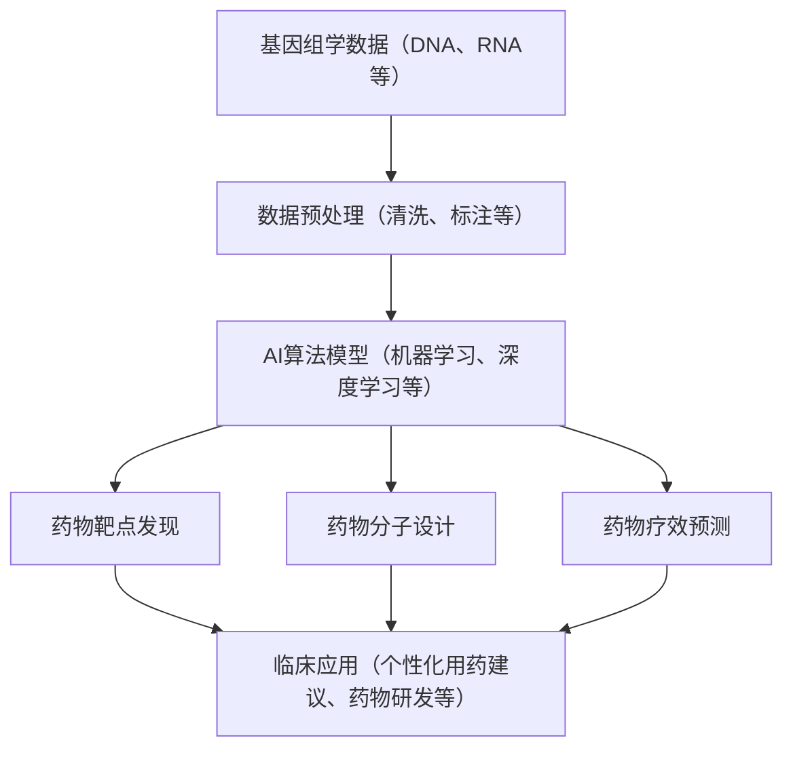

# AI辅助个性化药物设计：从基因组学到临床应用

> 关键词：AI、个性化药物设计、基因组学、临床应用、药物发现

> 摘要：本文深入探讨了AI在个性化药物设计领域从基因组学到临床应用的全流程。首先介绍了该领域的背景知识，包括目的、预期读者、文档结构和相关术语。接着阐述了核心概念及联系，包括其原理和架构，并通过Mermaid流程图呈现。详细讲解了核心算法原理及具体操作步骤，同时给出Python源代码示例。对数学模型和公式进行了深入分析并举例说明。通过项目实战展示了代码实现和详细解释。探讨了实际应用场景，推荐了相关工具和资源。最后总结了未来发展趋势与挑战，提供常见问题解答和扩展阅读参考资料，旨在全面展示AI辅助个性化药物设计的技术体系和应用前景。

## 1. 背景介绍 
### 1.1 目的和范围
个性化药物设计旨在开发针对个体患者独特生理和病理特征的药物治疗方案。传统药物研发过程成本高、周期长且成功率低，而AI技术的引入为解决这些问题提供了新的途径。本文的范围涵盖了从基因组学数据的分析到临床应用的整个过程，包括AI在药物靶点发现、药物设计、药物疗效预测等方面的应用。

### 1.2 预期读者
本文预期读者包括生物医学研究人员、药物研发人员、计算机科学和人工智能领域的专业人士、临床医生以及对个性化医疗和AI技术感兴趣的相关人员。

### 1.3 文档结构概述
本文首先介绍背景知识，包括目的、读者和术语。接着阐述核心概念及联系，通过原理和流程图展示。然后讲解核心算法原理和操作步骤，结合Python代码。对数学模型和公式进行分析和举例。通过项目实战展示代码实现和解释。探讨实际应用场景，推荐工具和资源。最后总结未来趋势与挑战，提供常见问题解答和参考资料。

### 1.4 术语表
#### 1.4.1 核心术语定义
- **AI（Artificial Intelligence）**：人工智能，是一门研究如何使计算机系统能够模拟人类智能的学科。
- **个性化药物设计**：根据个体患者的基因信息、生理特征和疾病状态等，设计针对性的药物治疗方案。
- **基因组学**：研究生物体基因组的组成、结构、功能和进化等方面的学科。
- **药物靶点**：药物在体内作用的特定分子或细胞结构。
- **临床应用**：将药物研发成果应用于临床治疗的过程。

#### 1.4.2 相关概念解释
- **生物信息学**：结合生物学、计算机科学和数学等多学科知识，对生物数据进行存储、分析和解释的学科。
- **机器学习**：AI的一个分支，通过让计算机从数据中学习模式和规律，从而实现预测和决策等任务。
- **深度学习**：一种基于神经网络的机器学习方法，能够自动从大量数据中提取复杂的特征。

#### 1.4.3 缩略词列表
- **AI**：Artificial Intelligence
- **ML**：Machine Learning
- **DL**：Deep Learning
- **DNA**：Deoxyribonucleic Acid
- **RNA**：Ribonucleic Acid

## 2. 核心概念与联系 
### 核心概念原理
AI辅助个性化药物设计的核心原理是利用AI技术对基因组学数据、临床数据等多源数据进行分析和挖掘，以发现药物靶点、设计新型药物分子并预测药物疗效。

从基因组学角度来看，每个人的基因组都存在差异，这些差异可能导致个体对药物的反应不同。通过对大量个体的基因组数据进行分析，可以发现与疾病相关的基因变异和生物标志物，从而确定潜在的药物靶点。

在药物设计阶段，AI可以利用机器学习和深度学习算法，根据药物靶点的结构和性质，设计出具有潜在活性的药物分子。这些算法可以学习已知药物分子的结构和活性之间的关系，从而预测新的药物分子的活性。

在临床应用方面，AI可以根据患者的个体信息，如基因信息、生理特征和疾病状态等，预测药物的疗效和不良反应，为临床医生提供个性化的用药建议。

### 架构的文本示意图
```plaintext
+-------------------+
| 基因组学数据      |
| （DNA、RNA等）    |
+-------------------+
          |
          v
+-------------------+
| 数据预处理        |
| （清洗、标注等）  |
+-------------------+
          |
          v
+-------------------+
| AI算法模型        |
| （机器学习、      |
| 深度学习等）      |
+-------------------+
          |
          v
+-------------------+
| 药物靶点发现      |
| 药物分子设计      |
| 药物疗效预测      |
+-------------------+
          |
          v
+-------------------+
| 临床应用          |
| （个性化用药建议  |
|  药物研发等）     |
+-------------------+
```

### Mermaid流程图


## 3. 核心算法原理 & 具体操作步骤 
### 核心算法原理
在AI辅助个性化药物设计中，常用的算法包括机器学习算法（如支持向量机、随机森林等）和深度学习算法（如卷积神经网络、循环神经网络等）。

以支持向量机（SVM）为例，其基本原理是在特征空间中找到一个最优的超平面，使得不同类别的样本能够被最大程度地分开。在药物设计中，可以将药物分子的结构特征作为输入，将药物的活性作为输出，通过SVM算法学习结构和活性之间的关系。

深度学习算法则通过构建多层神经网络，自动从大量数据中提取复杂的特征。例如，卷积神经网络（CNN）可以用于处理图像数据，在药物设计中可以将药物分子的三维结构表示为图像，通过CNN提取结构特征。

### 具体操作步骤
#### 数据收集
收集基因组学数据、临床数据、药物分子结构数据等多源数据。

#### 数据预处理
对收集到的数据进行清洗、标注和特征提取等操作，以提高数据的质量和可用性。

#### 模型选择和训练
根据任务的需求选择合适的AI算法模型，并使用预处理后的数据进行训练。

#### 模型评估
使用测试数据对训练好的模型进行评估，评估指标包括准确率、召回率、F1值等。

#### 模型应用
将训练好的模型应用于药物靶点发现、药物分子设计和药物疗效预测等任务。

### Python源代码示例
```python
# 导入必要的库
import numpy as np
from sklearn.svm import SVC
from sklearn.model_selection import train_test_split
from sklearn.metrics import accuracy_score

# 生成示例数据
X = np.random.rand(100, 10)  # 特征数据
y = np.random.randint(0, 2, 100)  # 标签数据

# 划分训练集和测试集
X_train, X_test, y_train, y_test = train_test_split(X, y, test_size=0.2, random_state=42)

# 创建SVM模型
model = SVC()

# 训练模型
model.fit(X_train, y_train)

# 预测
y_pred = model.predict(X_test)

# 评估模型
accuracy = accuracy_score(y_test, y_pred)
print(f"Accuracy: {accuracy}")
```

## 4. 数学模型和公式 & 详细讲解 & 举例说明 
### 支持向量机（SVM）数学模型
支持向量机的目标是在特征空间中找到一个最优的超平面，使得不同类别的样本能够被最大程度地分开。对于线性可分的情况，超平面的方程可以表示为：
$$
w^T x + b = 0
$$
其中，$w$ 是超平面的法向量，$b$ 是偏置项，$x$ 是样本向量。

为了使超平面能够最大程度地分开不同类别的样本，需要满足以下约束条件：
$$
y_i (w^T x_i + b) \geq 1, \quad i = 1, 2, \cdots, n
$$
其中，$y_i$ 是样本 $x_i$ 的标签，$n$ 是样本数量。

同时，为了使超平面的间隔最大，需要最小化以下目标函数：
$$
\frac{1}{2} \| w \|^2
$$

通过引入拉格朗日乘子 $\alpha_i$，可以将上述约束优化问题转化为对偶问题：
$$
\max_{\alpha} \sum_{i=1}^{n} \alpha_i - \frac{1}{2} \sum_{i=1}^{n} \sum_{j=1}^{n} \alpha_i \alpha_j y_i y_j x_i^T x_j
$$
$$
\text{s.t.} \quad \sum_{i=1}^{n} \alpha_i y_i = 0, \quad \alpha_i \geq 0, \quad i = 1, 2, \cdots, n
$$

### 详细讲解
支持向量机的核心思想是通过寻找最优的超平面来实现分类任务。在求解对偶问题时，可以得到拉格朗日乘子 $\alpha_i$，根据 $\alpha_i$ 的值可以确定支持向量。支持向量是离超平面最近的样本点，它们对于确定超平面的位置和方向起着关键作用。

### 举例说明
假设我们有两个类别的样本点，分别用红色和蓝色表示。通过支持向量机算法，可以找到一个最优的超平面将这两个类别分开。超平面的位置和方向由支持向量决定，支持向量离超平面最近，它们的拉格朗日乘子 $\alpha_i$ 大于 0。

```python
import numpy as np
import matplotlib.pyplot as plt
from sklearn.svm import SVC

# 生成示例数据
X = np.array([[3, 4], [1, 4], [2, 3], [6, -1], [7, -1], [5, -3]])
y = np.array([1, 1, 1, -1, -1, -1])

# 创建SVM模型
model = SVC(kernel='linear')
model.fit(X, y)

# 绘制样本点
plt.scatter(X[:, 0], X[:, 1], c=y, cmap=plt.cm.Paired)

# 绘制超平面
ax = plt.gca()
xlim = ax.get_xlim()
ylim = ax.get_ylim()

xx = np.linspace(xlim[0], xlim[1], 30)
yy = np.linspace(ylim[0], ylim[1], 30)
YY, XX = np.meshgrid(yy, xx)
xy = np.vstack([XX.ravel(), YY.ravel()]).T
Z = model.decision_function(xy).reshape(XX.shape)

ax.contour(XX, YY, Z, colors='k', levels=[-1, 0, 1], alpha=0.5, linestyles=['--', '-', '--'])

# 绘制支持向量
ax.scatter(model.support_vectors_[:, 0], model.support_vectors_[:, 1], s=100, linewidth=1, facecolors='none', edgecolors='k')

plt.show()
```

## 5. 项目实战：代码实际案例和详细解释说明 
### 5.1  开发环境搭建
#### 安装Python
首先需要安装Python，可以从Python官方网站（https://www.python.org/downloads/）下载适合自己操作系统的Python版本。

#### 安装必要的库
使用pip命令安装必要的库，如numpy、pandas、scikit-learn、tensorflow等。
```sh
pip install numpy pandas scikit-learn tensorflow
```

### 5.2  源代码详细实现和代码解读
以下是一个使用深度学习模型进行药物疗效预测的示例代码：
```python
import numpy as np
import pandas as pd
from sklearn.model_selection import train_test_split
from tensorflow.keras.models import Sequential
from tensorflow.keras.layers import Dense

# 加载数据
data = pd.read_csv('drug_data.csv')

# 提取特征和标签
X = data.drop('response', axis=1).values
y = data['response'].values

# 划分训练集和测试集
X_train, X_test, y_train, y_test = train_test_split(X, y, test_size=0.2, random_state=42)

# 构建深度学习模型
model = Sequential()
model.add(Dense(64, activation='relu', input_shape=(X_train.shape[1],)))
model.add(Dense(32, activation='relu'))
model.add(Dense(1, activation='sigmoid'))

# 编译模型
model.compile(optimizer='adam', loss='binary_crossentropy', metrics=['accuracy'])

# 训练模型
model.fit(X_train, y_train, epochs=10, batch_size=32, validation_data=(X_test, y_test))

# 评估模型
loss, accuracy = model.evaluate(X_test, y_test)
print(f"Test Loss: {loss}, Test Accuracy: {accuracy}")
```

### 代码解读与分析
1. **数据加载**：使用pandas库的`read_csv`函数加载药物数据。
2. **特征和标签提取**：从数据中提取特征和标签，并将其转换为numpy数组。
3. **划分训练集和测试集**：使用`train_test_split`函数将数据划分为训练集和测试集。
4. **构建深度学习模型**：使用`Sequential`模型构建一个简单的神经网络，包含输入层、隐藏层和输出层。
5. **编译模型**：使用`compile`方法编译模型，指定优化器、损失函数和评估指标。
6. **训练模型**：使用`fit`方法训练模型，指定训练数据、训练轮数和批次大小。
7. **评估模型**：使用`evaluate`方法评估模型在测试集上的性能。

## 6. 实际应用场景 
### 药物靶点发现
通过对基因组学数据的分析，AI可以发现与疾病相关的基因变异和生物标志物，从而确定潜在的药物靶点。例如，在癌症治疗中，AI可以分析肿瘤细胞的基因组数据，发现特定的基因突变，为开发针对性的抗癌药物提供靶点。

### 药物分子设计
AI可以根据药物靶点的结构和性质，设计出具有潜在活性的药物分子。通过对大量已知药物分子的结构和活性数据进行学习，AI可以预测新的药物分子的活性，从而加速药物研发过程。

### 个性化用药建议
在临床应用中，AI可以根据患者的个体信息，如基因信息、生理特征和疾病状态等，预测药物的疗效和不良反应，为临床医生提供个性化的用药建议。例如，对于患有心血管疾病的患者，AI可以根据患者的基因信息和其他临床数据，推荐最适合的药物和剂量。

### 药物疗效预测
通过对患者的临床数据和基因数据进行分析，AI可以预测药物的疗效，帮助医生及时调整治疗方案。例如，在糖尿病治疗中，AI可以根据患者的血糖水平、胰岛素敏感性等数据，预测不同药物的疗效，为医生提供参考。

## 7. 工具和资源推荐
### 7.1 学习资源推荐
#### 7.1.1 书籍推荐
- 《Python机器学习》：介绍了Python在机器学习领域的应用，包括各种机器学习算法的原理和实现。
- 《深度学习》：由深度学习领域的三位先驱Ian Goodfellow、Yoshua Bengio和Aaron Courville撰写，是深度学习领域的经典教材。
- 《生物信息学概论》：介绍了生物信息学的基本概念、方法和应用，对于理解基因组学数据的分析和处理有很大帮助。

#### 7.1.2 在线课程
- Coursera上的“机器学习”课程：由Andrew Ng教授授课，是机器学习领域的经典课程。
- edX上的“深度学习基础”课程：介绍了深度学习的基本概念和方法。
- Kaggle上的“生物信息学竞赛”：提供了丰富的生物信息学数据集和竞赛项目，可以锻炼实际应用能力。

#### 7.1.3 技术博客和网站
- Towards Data Science：提供了大量关于机器学习、深度学习和数据科学的技术文章和教程。
- Bioinformatics.org：生物信息学领域的专业网站，提供了丰富的生物信息学资源和工具。
- Nature Biotechnology：自然出版集团旗下的生物技术领域的顶级期刊，发表了很多关于AI辅助药物研发的前沿研究成果。

### 7.2 开发工具框架推荐
#### 7.2.1 IDE和编辑器
- PyCharm：功能强大的Python集成开发环境，提供了代码编辑、调试、版本控制等功能。
- Jupyter Notebook：交互式的编程环境，适合进行数据分析和模型开发。
- Visual Studio Code：轻量级的代码编辑器，支持多种编程语言和插件。

#### 7.2.2 调试和性能分析工具
- TensorBoard：TensorFlow的可视化工具，可以用于查看模型的训练过程和性能指标。
- PyTorch Profiler：PyTorch的性能分析工具，可以帮助用户找出模型中的性能瓶颈。
- Scikit-learn的GridSearchCV：用于超参数调优的工具，可以帮助用户找到最优的模型参数。

#### 7.2.3 相关框架和库
- TensorFlow：Google开发的深度学习框架，提供了丰富的深度学习模型和工具。
- PyTorch：Facebook开发的深度学习框架，具有动态图的优势，适合进行研究和开发。
- Scikit-learn：Python的机器学习库，提供了各种机器学习算法和工具。

### 7.3 相关论文著作推荐
#### 7.3.1 经典论文
- “The Nature of Statistical Learning Theory”：Vladimir Vapnik的经典著作，介绍了统计学习理论的基本概念和方法。
- “ImageNet Classification with Deep Convolutional Neural Networks”：Alex Krizhevsky等人的论文，介绍了卷积神经网络在图像分类任务中的应用。
- “Deep Learning in Drug Discovery”：介绍了深度学习在药物发现领域的应用和研究进展。

#### 7.3.2 最新研究成果
- 定期关注Nature、Science、Cell等顶级学术期刊，以及Bioinformatics、Journal of Chemical Information and Modeling等专业期刊，了解AI辅助个性化药物设计领域的最新研究成果。

#### 7.3.3 应用案例分析
- 参考一些实际的AI辅助药物研发项目案例，了解其技术路线、方法和应用效果。例如，一些大型制药公司的研发项目和开源的药物研发平台。

## 8. 总结：未来发展趋势与挑战
### 未来发展趋势
- **多组学数据融合**：未来的个性化药物设计将更加注重多组学数据的融合，包括基因组学、转录组学、蛋白质组学等，以更全面地了解个体的生理和病理状态。
- **AI与实验技术的结合**：AI技术将与实验技术更加紧密地结合，如高通量筛选、基因编辑等，加速药物研发过程。
- **个性化医疗的普及**：随着AI技术的不断发展和应用，个性化医疗将逐渐普及，为患者提供更加精准的治疗方案。

### 挑战
- **数据质量和隐私问题**：AI辅助个性化药物设计需要大量的高质量数据，但数据的质量和隐私问题是一个挑战。如何确保数据的准确性、完整性和安全性是需要解决的问题。
- **模型的可解释性**：深度学习模型通常是黑箱模型，其决策过程难以解释。在医疗领域，模型的可解释性至关重要，如何提高模型的可解释性是一个挑战。
- **跨学科合作**：AI辅助个性化药物设计涉及生物医学、计算机科学、数学等多个学科，需要跨学科的合作。如何促进不同学科之间的交流和合作是一个挑战。

## 9. 附录：常见问题与解答
### 问题1：AI在个性化药物设计中的作用是什么？
AI在个性化药物设计中的作用包括药物靶点发现、药物分子设计、药物疗效预测等。通过对多源数据的分析和挖掘，AI可以帮助发现潜在的药物靶点，设计新型药物分子，并预测药物的疗效和不良反应。

### 问题2：AI模型的训练需要多少数据？
AI模型的训练所需的数据量取决于模型的复杂度和任务的难度。一般来说，数据量越大，模型的性能越好。但在实际应用中，需要考虑数据的质量和可用性。

### 问题3：如何评估AI模型在个性化药物设计中的性能？
可以使用多种评估指标来评估AI模型在个性化药物设计中的性能，如准确率、召回率、F1值、AUC等。同时，还需要考虑模型的可解释性和泛化能力。

### 问题4：AI辅助个性化药物设计是否会取代医生的决策？
AI辅助个性化药物设计不会取代医生的决策，而是为医生提供辅助信息和建议。医生在临床决策中仍然起着关键作用，需要综合考虑患者的个体情况、临床经验和AI模型的预测结果。

## 10. 扩展阅读 & 参考资料
- 《人工智能：现代方法》
- 《药物化学》
- 《基因组学》
- https://www.nature.com/
- https://www.science.org/
- https://www.cell.com/
- https://scikit-learn.org/
- https://www.tensorflow.org/
- https://pytorch.org/