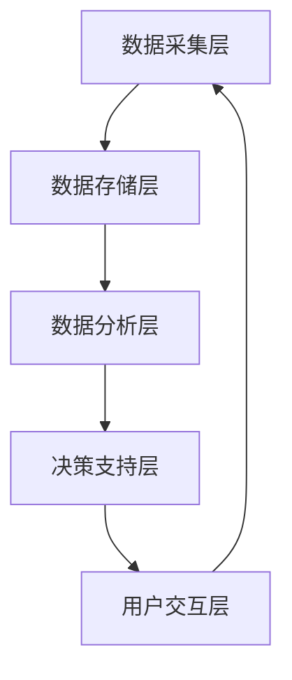

# AI辅助慢性病个性化管理：从行为干预到药物调整

> 关键词：AI、慢性病、个性化管理、行为干预、药物调整

> 摘要：本文聚焦于AI在慢性病个性化管理中的应用，从行为干预到药物调整展开深入探讨。首先介绍了慢性病管理的背景以及AI介入的重要性，接着阐述了AI在慢性病管理中的核心概念与联系，包括相关技术的原理和架构。详细讲解了核心算法原理并给出Python代码示例，同时介绍了数学模型和公式。通过项目实战展示了AI辅助慢性病个性化管理的具体实现过程和代码解读。探讨了其实际应用场景，推荐了相关的学习资源、开发工具框架和论文著作。最后总结了未来发展趋势与挑战，并对常见问题进行了解答，为AI在慢性病个性化管理领域的应用提供全面且深入的参考。

## 1. 背景介绍 
### 1.1 目的和范围
慢性病，如糖尿病、高血压、心血管疾病等，已经成为全球范围内严重威胁人类健康的公共卫生问题。这些疾病通常具有病程长、病因复杂、需要长期管理等特点。传统的慢性病管理模式主要依赖医生的经验和定期的门诊随访，难以满足患者个性化的需求，也无法实现对患者健康状况的实时监测和及时干预。

本文章的目的在于探讨如何利用人工智能（AI）技术实现慢性病的个性化管理，涵盖从对患者行为的干预到药物调整的整个过程。范围包括AI技术在慢性病管理中的核心概念、算法原理、数学模型，以及实际项目中的应用案例和未来发展趋势等方面。

### 1.2 预期读者
本文预期读者包括医疗领域的专业人员，如医生、护士、健康管理师等，他们可以通过了解AI技术在慢性病管理中的应用，为临床实践提供新的思路和方法；计算机科学领域的研究人员和开发者，他们可以从本文中获取AI技术在医疗场景应用的具体需求和挑战，为进一步的技术研发提供方向；对健康管理和AI技术感兴趣的普通读者，他们可以通过本文了解AI在改善自身健康管理方面的潜力。

### 1.3 文档结构概述
本文首先介绍了慢性病管理的背景以及AI技术介入的重要性，为后续内容奠定基础。接着阐述了AI在慢性病管理中的核心概念与联系，包括相关技术的原理和架构，让读者对整体框架有清晰的认识。然后详细讲解了核心算法原理并给出Python代码示例，同时介绍了数学模型和公式，使读者深入理解AI技术在慢性病管理中的具体实现方式。通过项目实战展示了AI辅助慢性病个性化管理的具体实现过程和代码解读，增强读者的实际应用能力。探讨了其实际应用场景，让读者了解该技术在现实中的应用价值。推荐了相关的学习资源、开发工具框架和论文著作，方便读者进一步深入学习。最后总结了未来发展趋势与挑战，并对常见问题进行了解答，为读者提供全面且深入的参考。

### 1.4 术语表
#### 1.4.1 核心术语定义
- **慢性病**：是指不构成传染、具有长期积累形成疾病形态损害的疾病的总称，常见的慢性病包括心脑血管疾病、癌症、糖尿病、慢性呼吸系统疾病等。
- **AI（人工智能）**：是研究、开发用于模拟、延伸和扩展人的智能的理论、方法、技术及应用系统的一门新的技术科学，在本文中主要指利用机器学习、深度学习等技术实现慢性病的个性化管理。
- **个性化管理**：根据患者的个体特征，如基因信息、生活习惯、疾病史等，制定适合该患者的疾病管理方案，包括行为干预和药物调整等。
- **行为干预**：通过改变患者的生活方式和行为习惯，如饮食、运动、作息等，来控制慢性病的发展和改善患者的健康状况。
- **药物调整**：根据患者的健康状况、病情变化以及药物反应等因素，对患者的用药方案进行调整，以达到最佳的治疗效果。

#### 1.4.2 相关概念解释
- **机器学习**：是一门多领域交叉学科，涉及概率论、统计学、逼近论、凸分析、算法复杂度理论等多门学科。它专门研究计算机怎样模拟或实现人类的学习行为，以获取新的知识或技能，重新组织已有的知识结构使之不断改善自身的性能。在慢性病管理中，机器学习可以用于分析患者的健康数据，预测疾病的发展趋势，为个性化管理提供决策支持。
- **深度学习**：是机器学习的一个分支领域，它是一种基于对数据进行表征学习的方法。深度学习通过构建具有很多层的神经网络模型，自动从大量数据中学习特征和模式，从而实现对复杂数据的分类、预测等任务。在慢性病管理中，深度学习可以用于分析医学影像、电子病历等复杂数据，辅助医生进行疾病诊断和治疗方案制定。
- **电子病历（EMR）**：是医疗机构对门诊、住院患者临床诊疗和指导干预的、数字化的医疗服务工作记录，是居民健康档案的重要组成部分。电子病历包含了患者的基本信息、疾病史、诊断结果、治疗方案等丰富信息，为AI技术在慢性病管理中的应用提供了数据基础。

#### 1.4.3 缩略词列表
- **AI**：Artificial Intelligence（人工智能）
- **ML**：Machine Learning（机器学习）
- **DL**：Deep Learning（深度学习）
- **EMR**：Electronic Medical Record（电子病历）

## 2. 核心概念与联系 
### 核心概念原理
AI辅助慢性病个性化管理的核心概念基于数据驱动和模型预测。首先，通过各种传感器和医疗设备收集患者的多源数据，包括生理指标（如血压、血糖、心率等）、生活行为数据（如饮食、运动、睡眠等）以及电子病历数据。这些数据反映了患者的健康状况和生活习惯，是个性化管理的基础。

然后，利用机器学习和深度学习算法对这些数据进行分析和挖掘。机器学习算法可以从数据中学习到患者的健康模式和疾病发展趋势，例如通过分类算法判断患者的疾病风险等级，通过回归算法预测患者的生理指标变化。深度学习算法则可以处理复杂的非结构化数据，如医学影像和文本数据，辅助医生进行疾病诊断和治疗方案制定。

基于数据分析和模型预测的结果，为患者制定个性化的管理方案，包括行为干预和药物调整。行为干预方案根据患者的生活习惯和健康目标，制定合理的饮食、运动和作息计划，帮助患者改善生活方式，控制慢性病的发展。药物调整方案则根据患者的病情变化和药物反应，调整用药剂量和种类，以达到最佳的治疗效果。

### 架构的文本示意图
AI辅助慢性病个性化管理系统主要由以下几个部分组成：
1. **数据采集层**：通过各种传感器（如可穿戴设备、家用医疗设备等）和医疗信息系统（如电子病历系统）收集患者的多源数据。
2. **数据存储层**：将采集到的数据存储在数据库中，以便后续的数据分析和处理。
3. **数据分析层**：利用机器学习和深度学习算法对存储的数据进行分析和挖掘，提取有价值的信息和知识。
4. **决策支持层**：根据数据分析的结果，为医生和患者提供个性化的管理建议，包括行为干预和药物调整方案。
5. **用户交互层**：通过手机应用、网站等方式，将管理建议推送给患者，并接收患者的反馈信息，实现医患之间的互动和沟通。

### Mermaid 流程图


## 3. 核心算法原理 & 具体操作步骤 
### 核心算法原理
在AI辅助慢性病个性化管理中，常用的核心算法包括决策树、支持向量机、神经网络等。下面以决策树算法为例，详细讲解其原理和应用。

决策树是一种基于树结构进行决策的算法，它将数据按照不同的特征进行划分，形成一个树形结构。每个内部节点表示一个特征上的测试，每个分支表示一个测试输出，每个叶节点表示一个类别或值。决策树的构建过程就是不断选择最优特征进行划分，直到满足终止条件为止。

在慢性病管理中，决策树可以用于预测患者的疾病风险等级、判断患者是否需要调整药物等。例如，根据患者的年龄、性别、血压、血糖等特征，构建一个决策树模型，预测患者患糖尿病的风险等级。

### 具体操作步骤
1. **数据预处理**：收集患者的多源数据，并进行清洗、转换和归一化等预处理操作，以提高数据的质量和可用性。
2. **特征选择**：从预处理后的数据中选择与慢性病管理相关的特征，如生理指标、生活行为数据等。
3. **模型训练**：使用训练数据对决策树模型进行训练，通过不断调整模型的参数，使模型的预测准确率达到最优。
4. **模型评估**：使用测试数据对训练好的决策树模型进行评估，计算模型的准确率、召回率、F1值等指标，评估模型的性能。
5. **模型应用**：将训练好的决策树模型应用到实际的慢性病管理中，根据患者的特征数据，预测患者的疾病风险等级、判断患者是否需要调整药物等。

### Python源代码示例
```python
import pandas as pd
from sklearn.tree import DecisionTreeClassifier
from sklearn.model_selection import train_test_split
from sklearn.metrics import accuracy_score

# 加载数据
data = pd.read_csv('chronic_disease_data.csv')

# 划分特征和标签
X = data.drop('disease_risk', axis=1)
y = data['disease_risk']

# 划分训练集和测试集
X_train, X_test, y_train, y_test = train_test_split(X, y, test_size=0.2, random_state=42)

# 创建决策树模型
model = DecisionTreeClassifier()

# 训练模型
model.fit(X_train, y_train)

# 预测
y_pred = model.predict(X_test)

# 评估模型
accuracy = accuracy_score(y_test, y_pred)
print(f"模型准确率: {accuracy}")
```

## 4. 数学模型和公式 & 详细讲解 & 举例说明 
### 决策树的数学模型和公式
决策树的构建过程基于信息增益、信息增益率、基尼指数等指标来选择最优特征进行划分。下面以信息增益为例，详细讲解决策树的数学模型和公式。

信息增益是指在划分数据集前后信息熵的变化量，它反映了使用某个特征进行划分后，数据集的不确定性减少的程度。信息增益越大，说明使用该特征进行划分后，数据集的不确定性减少得越多，该特征的分类能力越强。

信息熵的计算公式为：
$$H(D)=-\sum_{k=1}^{K}p_k\log_2p_k$$
其中，$D$ 表示数据集，$K$ 表示数据集 $D$ 中类别的数量，$p_k$ 表示第 $k$ 类样本在数据集 $D$ 中所占的比例。

信息增益的计算公式为：
$$Gain(D,A)=H(D)-\sum_{v=1}^{V}\frac{|D^v|}{|D|}H(D^v)$$
其中，$A$ 表示特征，$V$ 表示特征 $A$ 可能的取值数量，$D^v$ 表示特征 $A$ 取值为 $v$ 的样本子集。

### 详细讲解
信息熵是衡量数据集不确定性的指标，信息熵越大，说明数据集的不确定性越大。信息增益则是衡量特征分类能力的指标，信息增益越大，说明使用该特征进行划分后，数据集的不确定性减少得越多，该特征的分类能力越强。

在决策树的构建过程中，每次选择信息增益最大的特征进行划分，直到满足终止条件为止。终止条件可以是数据集的所有样本都属于同一类别、特征集为空或信息增益小于某个阈值等。

### 举例说明
假设有一个数据集 $D$，包含 10 个样本，分为两类：正类和负类，其中正类样本有 6 个，负类样本有 4 个。则数据集 $D$ 的信息熵为：
$$H(D)=-\frac{6}{10}\log_2\frac{6}{10}-\frac{4}{10}\log_2\frac{4}{10}\approx0.971$$

假设有一个特征 $A$，有两个取值：$A_1$ 和 $A_2$，其中取值为 $A_1$ 的样本有 4 个，正类样本有 3 个，负类样本有 1 个；取值为 $A_2$ 的样本有 6 个，正类样本有 3 个，负类样本有 3 个。则特征 $A$ 划分后的信息熵为：
$$H(D^1)=-\frac{3}{4}\log_2\frac{3}{4}-\frac{1}{4}\log_2\frac{1}{4}\approx0.811$$
$$H(D^2)=-\frac{3}{6}\log_2\frac{3}{6}-\frac{3}{6}\log_2\frac{3}{6}=1$$
$$\sum_{v=1}^{2}\frac{|D^v|}{|D|}H(D^v)=\frac{4}{10}H(D^1)+\frac{6}{10}H(D^2)=\frac{4}{10}\times0.811+\frac{6}{10}\times1\approx0.924$$

则特征 $A$ 的信息增益为：
$$Gain(D,A)=H(D)-\sum_{v=1}^{2}\frac{|D^v|}{|D|}H(D^v)=0.971 - 0.924 = 0.047$$

## 5. 项目实战：代码实际案例和详细解释说明 
### 5.1  开发环境搭建
1. **安装Python**：从Python官方网站（https://www.python.org/downloads/）下载并安装Python 3.x版本。
2. **安装必要的库**：使用pip命令安装必要的库，如pandas、scikit-learn等。
```bash
pip install pandas scikit-learn
```
3. **选择开发工具**：可以选择PyCharm、Jupyter Notebook等开发工具进行代码编写和调试。

### 5.2  源代码详细实现和代码解读
```python
import pandas as pd
from sklearn.tree import DecisionTreeClassifier
from sklearn.model_selection import train_test_split
from sklearn.metrics import accuracy_score
from sklearn.preprocessing import StandardScaler

# 加载数据
data = pd.read_csv('chronic_disease_data.csv')

# 数据预处理
# 处理缺失值
data = data.dropna()

# 划分特征和标签
X = data.drop('disease_risk', axis=1)
y = data['disease_risk']

# 特征缩放
scaler = StandardScaler()
X = scaler.fit_transform(X)

# 划分训练集和测试集
X_train, X_test, y_train, y_test = train_test_split(X, y, test_size=0.2, random_state=42)

# 创建决策树模型
model = DecisionTreeClassifier()

# 训练模型
model.fit(X_train, y_train)

# 预测
y_pred = model.predict(X_test)

# 评估模型
accuracy = accuracy_score(y_test, y_pred)
print(f"模型准确率: {accuracy}")
```

### 代码解读与分析
1. **数据加载**：使用pandas库的`read_csv`函数加载慢性病数据集。
2. **数据预处理**：
    - **处理缺失值**：使用`dropna`函数删除包含缺失值的样本，以提高数据的质量。
    - **特征缩放**：使用`StandardScaler`类对特征数据进行标准化处理，使特征数据具有相同的尺度，提高模型的训练效果。
3. **划分训练集和测试集**：使用`train_test_split`函数将数据集划分为训练集和测试集，其中测试集占总数据集的20%。
4. **模型创建和训练**：使用`DecisionTreeClassifier`类创建决策树模型，并使用训练集数据对模型进行训练。
5. **模型预测和评估**：使用训练好的模型对测试集数据进行预测，并使用`accuracy_score`函数计算模型的准确率。

## 6. 实际应用场景 
### 行为干预场景
- **饮食管理**：AI可以根据患者的疾病类型、身体状况和个人口味偏好，为患者制定个性化的饮食计划。例如，对于糖尿病患者，AI可以根据患者的血糖水平和营养需求，推荐低糖、高纤维的食物，并制定合理的饮食量和饮食时间。
- **运动管理**：AI可以根据患者的身体状况、运动能力和疾病风险等级，为患者制定个性化的运动计划。例如，对于高血压患者，AI可以推荐适合的有氧运动，如散步、慢跑、游泳等，并制定合理的运动强度和运动时间。
- **作息管理**：AI可以根据患者的生物钟和生活习惯，为患者制定合理的作息计划。例如，对于失眠患者，AI可以建议患者保持规律的作息时间，避免晚上熬夜和白天午睡过长。

### 药物调整场景
- **剂量调整**：AI可以根据患者的生理指标、病情变化和药物反应，实时调整患者的用药剂量。例如，对于糖尿病患者，AI可以根据患者的血糖水平，动态调整胰岛素的注射剂量，以达到最佳的血糖控制效果。
- **药物替换**：AI可以根据患者的药物不良反应和治疗效果，为患者推荐更合适的药物。例如，对于高血压患者，如果某种降压药物的副作用较大，AI可以根据患者的具体情况，推荐其他类型的降压药物。
- **联合用药**：AI可以根据患者的疾病复杂程度和治疗需求，为患者制定联合用药方案。例如，对于患有多种慢性病的患者，AI可以综合考虑各种药物的相互作用和治疗效果，制定合理的联合用药方案。

## 7. 工具和资源推荐
### 7.1 学习资源推荐
#### 7.1.1 书籍推荐
- 《机器学习》（周志华著）：全面介绍了机器学习的基本概念、算法和应用，是机器学习领域的经典教材。
- 《深度学习》（Ian Goodfellow、Yoshua Bengio和Aaron Courville著）：深入介绍了深度学习的原理、算法和应用，是深度学习领域的权威著作。
- 《Python机器学习实战》（Sebastian Raschka著）：通过实际案例介绍了Python在机器学习中的应用，适合初学者学习。

#### 7.1.2 在线课程
- Coursera平台的“机器学习”课程（Andrew Ng教授主讲）：是机器学习领域的经典在线课程，系统介绍了机器学习的基本概念、算法和应用。
- edX平台的“深度学习”课程（由多位知名学者和专家主讲）：深入介绍了深度学习的原理、算法和应用，是深度学习领域的优质在线课程。
- 中国大学MOOC平台的“人工智能基础”课程：系统介绍了人工智能的基本概念、技术和应用，适合初学者学习。

#### 7.1.3 技术博客和网站
- Medium：是一个技术博客平台，上面有很多关于AI、机器学习、深度学习等领域的优质文章。
- Towards Data Science：是一个专注于数据科学和机器学习的技术博客，上面有很多关于AI在医疗领域应用的文章。
- Kaggle：是一个数据科学竞赛平台，上面有很多关于医疗数据挖掘和分析的竞赛项目和开源代码。

### 7.2 开发工具框架推荐
#### 7.2.1 IDE和编辑器
- PyCharm：是一款专门为Python开发设计的集成开发环境，具有代码编辑、调试、版本控制等功能，适合专业的Python开发者使用。
- Jupyter Notebook：是一个交互式的开发环境，支持多种编程语言，适合数据科学家和研究人员进行数据探索和模型开发。
- Visual Studio Code：是一款轻量级的代码编辑器，支持多种编程语言和插件扩展，适合初学者和小型项目的开发。

#### 7.2.2 调试和性能分析工具
- TensorBoard：是TensorFlow的可视化工具，可以用于可视化模型的训练过程、评估指标、网络结构等，帮助开发者调试和优化模型。
- PyTorch Profiler：是PyTorch的性能分析工具，可以用于分析模型的性能瓶颈、内存使用情况等，帮助开发者优化模型的性能。
- Scikit-learn的GridSearchCV：是Scikit-learn的超参数调优工具，可以用于自动搜索最优的超参数组合，提高模型的性能。

#### 7.2.3 相关框架和库
- TensorFlow：是一个开源的机器学习框架，由Google开发和维护，支持多种深度学习模型和算法，广泛应用于图像识别、自然语言处理等领域。
- PyTorch：是一个开源的深度学习框架，由Facebook开发和维护，具有动态计算图、易于使用等特点，广泛应用于学术界和工业界。
- Scikit-learn：是一个开源的机器学习库，提供了丰富的机器学习算法和工具，如分类、回归、聚类等，适合初学者和快速开发。

### 7.3 相关论文著作推荐
#### 7.3.1 经典论文
- 《Gradient-based learning applied to document recognition》（Yann LeCun、Léon Bottou、Yoshua Bengio和Patrick Haffner著）：介绍了卷积神经网络（CNN）在手写字符识别中的应用，是深度学习领域的经典论文。
- 《Long Short-Term Memory》（Sepp Hochreiter和Jürgen Schmidhuber著）：介绍了长短期记忆网络（LSTM）的原理和应用，是循环神经网络（RNN）领域的经典论文。
- 《Generative Adversarial Nets》（Ian Goodfellow等著）：介绍了生成对抗网络（GAN）的原理和应用，是生成模型领域的经典论文。

#### 7.3.2 最新研究成果
- 关注顶级学术会议，如NeurIPS（神经信息处理系统大会）、ICML（国际机器学习会议）、CVPR（计算机视觉与模式识别会议）等，这些会议上的论文代表了AI领域的最新研究成果。
- 关注顶级学术期刊，如Journal of Artificial Intelligence Research（JAIR）、Artificial Intelligence（AI）、IEEE Transactions on Pattern Analysis and Machine Intelligence（TPAMI）等，这些期刊上的论文具有较高的学术水平和影响力。

#### 7.3.3 应用案例分析
- 《AI in Healthcare: Transforming the Future of Medicine》（由多位专家学者编写）：介绍了AI在医疗领域的应用案例和发展趋势，包括疾病诊断、治疗方案制定、药物研发等方面。
- 《Machine Learning in Medicine》（由多位专家学者编写）：介绍了机器学习在医学领域的应用案例和方法，包括医学影像分析、电子病历挖掘、疾病预测等方面。

## 8. 总结：未来发展趋势与挑战
### 未来发展趋势
- **多模态数据融合**：未来AI辅助慢性病个性化管理将更加注重多模态数据的融合，包括生理指标、生活行为数据、医学影像、基因信息等。通过融合多模态数据，可以更全面地了解患者的健康状况，为个性化管理提供更准确的决策支持。
- **智能可穿戴设备的应用**：随着智能可穿戴设备的不断发展和普及，未来AI辅助慢性病个性化管理将更多地依赖于智能可穿戴设备。智能可穿戴设备可以实时监测患者的生理指标和生活行为数据，为AI系统提供更丰富、更及时的数据支持。
- **个性化医疗的普及**：未来AI辅助慢性病个性化管理将推动个性化医疗的普及。通过AI技术，可以根据患者的个体特征，制定更加精准、个性化的治疗方案，提高治疗效果和患者的生活质量。

### 挑战
- **数据隐私和安全问题**：AI辅助慢性病个性化管理需要收集和处理大量的患者数据，这些数据包含了患者的个人隐私信息。因此，如何保障患者数据的隐私和安全是一个重要的挑战。
- **数据质量和标准化问题**：AI技术的应用依赖于高质量、标准化的数据。然而，目前医疗数据存在数据质量参差不齐、数据标准不统一等问题，这给AI技术的应用带来了一定的困难。
- **临床应用的验证和推广**：AI辅助慢性病个性化管理的临床应用需要经过严格的验证和评估，确保其安全性和有效性。同时，如何将AI技术推广到临床实践中，让更多的医生和患者受益，也是一个需要解决的问题。

## 9. 附录：常见问题与解答
### 1. AI技术在慢性病管理中的准确性如何保证？
AI技术的准确性主要通过以下几个方面来保证：
- **数据质量**：收集高质量、准确的数据是保证AI技术准确性的基础。在数据采集过程中，需要确保数据的完整性、准确性和一致性。
- **模型选择和优化**：选择合适的模型和算法，并对模型进行优化和调参，可以提高模型的准确性和泛化能力。
- **模型评估和验证**：使用测试数据对模型进行评估和验证，计算模型的准确率、召回率、F1值等指标，评估模型的性能。同时，还可以使用交叉验证等方法来进一步验证模型的准确性。

### 2. AI技术在慢性病管理中的应用是否会取代医生的作用？
AI技术在慢性病管理中的应用不会取代医生的作用，而是作为医生的辅助工具，帮助医生更好地进行疾病诊断和治疗方案制定。AI技术可以分析大量的患者数据，提供决策支持和建议，但最终的诊断和治疗方案还需要医生根据患者的具体情况进行综合判断和决策。

### 3. 如何保障患者数据的隐私和安全？
保障患者数据的隐私和安全可以从以下几个方面入手：
- **数据加密**：对患者数据进行加密处理，确保数据在传输和存储过程中的安全性。
- **访问控制**：建立严格的访问控制机制，只有授权人员才能访问患者数据。
- **合规性管理**：遵守相关的法律法规和行业标准，如《网络安全法》、《医疗数据保护条例》等，确保患者数据的隐私和安全。

## 10. 扩展阅读 & 参考资料
- 《人工智能：一种现代的方法》（Stuart J. Russell、Peter Norvig著）
- 《数据挖掘：概念与技术》（Jiawei Han、Jian Pei、Jianwen Yin著）
- 《医疗大数据：方法与应用》（董建成、杨毅著）
- https://www.nature.com/ （自然杂志官网）
- https://www.science.org/ （科学杂志官网）
- https://ieeexplore.ieee.org/ （IEEE Xplore数字图书馆）