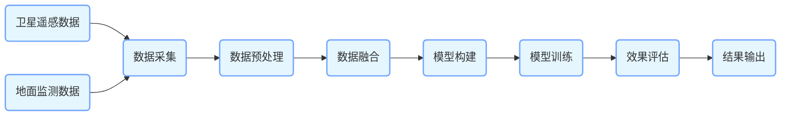

# AI辅助生态系统恢复效果评估：从卫星遥感到地面监测

> 关键词：AI、生态系统恢复、卫星遥感、地面监测、效果评估

> 摘要：本文聚焦于AI辅助生态系统恢复效果评估，探讨了从卫星遥感到地面监测的综合评估方法。首先介绍了相关背景知识，包括目的、预期读者、文档结构等。接着阐述了核心概念及联系，详细讲解了核心算法原理与具体操作步骤，并通过数学模型和公式进行深入剖析。通过项目实战展示了代码实现及解读，分析了实际应用场景。同时推荐了学习、开发相关的工具和资源，最后总结了未来发展趋势与挑战，还包含常见问题解答及扩展阅读参考资料，旨在为相关领域的研究和实践提供全面且深入的参考。

## 1. 背景介绍 
### 1.1 目的和范围
生态系统的健康与稳定对于人类的生存和发展至关重要。随着人类活动的加剧，许多生态系统面临着不同程度的破坏，生态系统恢复工作成为了全球关注的焦点。而准确评估生态系统恢复效果则是衡量恢复工作成效、调整恢复策略的关键依据。本研究的目的在于探索如何利用AI技术，结合卫星遥感和地面监测的数据，实现对生态系统恢复效果的全面、准确评估。范围涵盖了从数据采集、处理到评估结果输出的整个流程，涉及多种生态系统类型，如森林、草原、湿地等。

### 1.2 预期读者
本文预期读者包括生态环境领域的科研人员、从事生态系统恢复项目的工作人员、环境监测部门的相关人员，以及对AI与生态环境交叉领域感兴趣的技术爱好者和学生。对于科研人员，本文提供了最新的研究思路和方法；对于项目工作人员，有助于优化生态系统恢复项目的实施和评估；对于环境监测人员，能提升监测数据的利用效率和评估准确性；对于技术爱好者和学生，则能拓宽他们在跨学科领域的知识面。

### 1.3 文档结构概述
本文首先介绍相关背景知识，让读者了解研究的目的、适用人群等基本信息。接着阐述核心概念及联系，帮助读者理解关键术语和概念之间的关系。然后详细讲解核心算法原理和具体操作步骤，通过Python代码进行说明。之后给出数学模型和公式，并举例说明其应用。通过项目实战展示代码的实际应用和解读。分析实际应用场景，说明该评估方法的实用性。推荐学习、开发相关的工具和资源，为读者进一步深入研究提供参考。最后总结未来发展趋势与挑战，解答常见问题，并提供扩展阅读和参考资料。

### 1.4 术语表
#### 1.4.1 核心术语定义
- **AI（Artificial Intelligence）**：即人工智能，是研究、开发用于模拟、延伸和扩展人的智能的理论、方法、技术及应用系统的一门新的技术科学。在本文中主要用于处理和分析生态系统相关的数据。
- **生态系统恢复**：指对退化、受损或破坏的生态系统进行修复和重建，使其恢复到接近或达到受干扰前的结构、功能和动态的过程。
- **卫星遥感**：从人造卫星上利用遥感器收集地球表面的电磁波信息，并对这些信息进行分析处理，从而识别地面物体和现象的技术。
- **地面监测**：在地面上通过各种仪器设备对生态系统的相关指标进行实地测量和记录的过程。
- **效果评估**：对生态系统恢复工作所取得的成效进行定量或定性的评价和分析。

#### 1.4.2 相关概念解释
- **多源数据融合**：将来自不同数据源（如卫星遥感数据和地面监测数据）的信息进行综合处理，以获取更全面、准确的信息。在生态系统恢复效果评估中，多源数据融合可以充分发挥卫星遥感数据的宏观性和地面监测数据的准确性优势。
- **机器学习算法**：一类基于数据进行模型训练和预测的算法，常见的有决策树、支持向量机、神经网络等。在本文中用于对生态系统数据进行分析和挖掘，以实现效果评估。
- **生态指标**：用于描述和衡量生态系统状态和功能的各种参数，如植被覆盖度、生物多样性指数、土壤质量指标等。

#### 1.4.3 缩略词列表
- **AI**：Artificial Intelligence（人工智能）
- **RS**：Remote Sensing（遥感）
- **GIS**：Geographic Information System（地理信息系统）

## 2. 核心概念与联系 
### 核心概念原理
#### 卫星遥感原理
卫星遥感利用卫星上搭载的遥感器，接收地球表面物体反射或发射的电磁波信号。不同的地物具有不同的电磁波反射和发射特性，通过对这些信号的分析和处理，可以识别出地物的类型、分布和状态。例如，植被在近红外波段具有较高的反射率，通过分析卫星影像中近红外波段的信息，可以估算植被覆盖度等生态指标。

#### 地面监测原理
地面监测是在实地通过各种仪器设备对生态系统的物理、化学和生物等指标进行直接测量。例如，使用土壤水分传感器测量土壤含水量，用样方法调查植物群落的物种组成和数量等。地面监测数据具有较高的准确性和可靠性，但覆盖范围相对较小。

#### AI在生态系统恢复效果评估中的原理
AI通过对卫星遥感和地面监测数据进行处理和分析，挖掘数据中的潜在信息。利用机器学习算法对数据进行建模和训练，建立生态系统恢复效果评估模型。例如，使用深度学习算法对卫星影像进行分类，识别出不同的土地利用类型和生态系统状态；利用回归分析算法根据地面监测数据预测生态系统的变化趋势。

### 架构的文本示意图
整个AI辅助生态系统恢复效果评估架构主要包括数据采集层、数据处理层、模型构建层和评估结果输出层。

- **数据采集层**：负责收集卫星遥感数据和地面监测数据。卫星遥感数据可以从不同的卫星平台获取，如Landsat系列卫星、Sentinel系列卫星等；地面监测数据则通过在生态系统中设置的监测站点和实地调查获取。
- **数据处理层**：对采集到的多源数据进行预处理，包括数据清洗、校正、配准等操作，以提高数据的质量和一致性。然后进行数据融合，将卫星遥感数据和地面监测数据进行整合。
- **模型构建层**：利用AI算法对处理后的数据进行建模和训练。选择合适的机器学习或深度学习算法，如卷积神经网络（CNN）、随机森林等，构建生态系统恢复效果评估模型。
- **评估结果输出层**：根据训练好的模型对生态系统恢复效果进行评估，并输出评估结果，如生态系统恢复程度的量化指标、恢复趋势分析等。

### Mermaid流程图


## 3. 核心算法原理 & 具体操作步骤 
### 核心算法原理
#### 卷积神经网络（CNN）在卫星影像分类中的应用
卷积神经网络是一种专门用于处理具有网格结构数据（如图像）的深度学习算法。在卫星影像分类中，CNN通过卷积层提取影像的特征，池化层对特征进行降维，全连接层进行分类预测。

卷积层的核心操作是卷积运算，通过卷积核在输入影像上滑动，提取局部特征。设输入影像为 $X$，卷积核为 $W$，则卷积运算的输出 $Y$ 可以表示为：

$Y_{i,j} = \sum_{m=0}^{M-1} \sum_{n=0}^{N-1} X_{i+m,j+n} W_{m,n} + b$

其中，$M$ 和 $N$ 是卷积核的大小，$b$ 是偏置项。

池化层的作用是对卷积层输出的特征图进行下采样，减少数据量，同时保留重要的特征信息。常见的池化方法有最大池化和平均池化。

全连接层将池化层输出的特征向量进行连接，通过线性变换和非线性激活函数进行分类预测。

#### 随机森林算法在地面监测数据回归分析中的应用
随机森林是一种集成学习算法，由多个决策树组成。在地面监测数据回归分析中，随机森林通过对多个决策树的预测结果进行平均，得到最终的回归预测值。

随机森林的训练过程包括：
1. 从原始数据集中有放回地随机抽取样本，构建多个不同的训练子集。
2. 对于每个训练子集，构建一棵决策树。在决策树的每个节点上，随机选择一部分特征，选择最优的特征进行分裂。
3. 重复步骤1和2，构建多个决策树。
4. 对于新的输入数据，将每个决策树的预测结果进行平均，得到最终的预测值。

### 具体操作步骤
#### 数据预处理
1. **数据清洗**：去除卫星遥感数据和地面监测数据中的噪声、缺失值和异常值。例如，对于卫星影像中的云覆盖区域，可以使用云掩膜算法进行去除。
2. **数据校正**：对卫星遥感数据进行辐射校正和几何校正，以提高数据的准确性和一致性。
3. **数据配准**：将卫星遥感数据和地面监测数据进行空间配准，使两者在空间上对应一致。

#### 数据融合
1. **特征级融合**：将卫星遥感数据和地面监测数据的特征进行组合，形成新的特征向量。例如，将卫星影像的光谱特征和地面监测的土壤湿度特征进行融合。
2. **决策级融合**：分别对卫星遥感数据和地面监测数据进行分析和分类，然后将分类结果进行融合，得到最终的评估结果。

#### 模型训练
1. **数据划分**：将处理后的数据划分为训练集、验证集和测试集。一般来说，训练集占总数据的70% - 80%，验证集占10% - 15%，测试集占10% - 15%。
2. **模型选择和参数调整**：根据数据特点和评估需求，选择合适的AI算法，如CNN、随机森林等。通过交叉验证等方法调整模型的参数，以提高模型的性能。
3. **模型训练**：使用训练集对模型进行训练，不断调整模型的权重和参数，使模型的预测结果与真实值之间的误差最小。

#### 效果评估
1. **指标选择**：选择合适的评估指标，如准确率、召回率、均方误差等，对模型的性能进行评估。
2. **模型评估**：使用测试集对训练好的模型进行评估，计算评估指标的值，判断模型的性能是否满足要求。

### Python源代码实现
```python
# 导入必要的库
import numpy as np
import pandas as pd
from sklearn.model_selection import train_test_split
from sklearn.ensemble import RandomForestRegressor
from sklearn.metrics import mean_squared_error
from tensorflow.keras.models import Sequential
from tensorflow.keras.layers import Conv2D, MaxPooling2D, Flatten, Dense

# 模拟卫星遥感数据和地面监测数据
# 卫星遥感数据（影像数据）
satellite_data = np.random.rand(100, 32, 32, 3)  # 100张32x32的RGB影像
# 地面监测数据（数值数据）
ground_data = np.random.rand(100, 5)  # 100个样本，每个样本有5个特征
# 标签数据（生态系统恢复程度）
labels = np.random.rand(100)

# 数据预处理
# 卫星遥感数据归一化
satellite_data = satellite_data / 255.0

# 划分训练集和测试集
X_sat_train, X_sat_test, X_ground_train, X_ground_test, y_train, y_test = train_test_split(
    satellite_data, ground_data, labels, test_size=0.2, random_state=42)

# 构建CNN模型处理卫星遥感数据
cnn_model = Sequential()
cnn_model.add(Conv2D(32, (3, 3), activation='relu', input_shape=(32, 32, 3)))
cnn_model.add(MaxPooling2D((2, 2)))
cnn_model.add(Conv2D(64, (3, 3), activation='relu'))
cnn_model.add(MaxPooling2D((2, 2)))
cnn_model.add(Flatten())
cnn_model.add(Dense(64, activation='relu'))
cnn_model.add(Dense(1))

# 编译CNN模型
cnn_model.compile(optimizer='adam', loss='mse')

# 训练CNN模型
cnn_model.fit(X_sat_train, y_train, epochs=10, batch_size=32, validation_data=(X_sat_test, y_test))

# 构建随机森林模型处理地面监测数据
rf_model = RandomForestRegressor(n_estimators=100)
rf_model.fit(X_ground_train, y_train)

# 预测
cnn_pred = cnn_model.predict(X_sat_test)
rf_pred = rf_model.predict(X_ground_test)

# 融合预测结果（简单平均）
final_pred = (cnn_pred.flatten() + rf_pred) / 2

# 计算均方误差
mse = mean_squared_error(y_test, final_pred)
print(f"均方误差: {mse}")
```

## 4. 数学模型和公式 & 详细讲解 & 举例说明 
### 数学模型和公式
#### 均方误差（MSE）
均方误差是衡量模型预测结果与真实值之间误差的常用指标，其计算公式为：

$$MSE = \frac{1}{n} \sum_{i=1}^{n} (y_i - \hat{y}_i)^2$$

其中，$n$ 是样本数量，$y_i$ 是真实值，$\hat{y}_i$ 是模型的预测值。

#### 决定系数（$R^2$）
决定系数用于评估模型对数据的拟合程度，其计算公式为：

$$R^2 = 1 - \frac{\sum_{i=1}^{n} (y_i - \hat{y}_i)^2}{\sum_{i=1}^{n} (y_i - \bar{y})^2}$$

其中，$\bar{y}$ 是真实值的平均值。

### 详细讲解
#### 均方误差
均方误差通过计算预测值与真实值之间差值的平方的平均值，来衡量模型的预测误差。平方的作用是放大较大误差的影响，使得模型对较大误差更加敏感。均方误差的值越小，说明模型的预测结果越接近真实值，模型的性能越好。

#### 决定系数
决定系数的取值范围在 $[-\infty, 1]$ 之间。$R^2$ 值越接近1，说明模型对数据的拟合程度越好，即模型能够解释数据中的大部分变异。当 $R^2$ 值为负数时，说明模型的预测效果比直接使用平均值预测还要差。

### 举例说明
假设我们有一个生态系统恢复效果评估模型，对10个样本的生态系统恢复程度进行预测，真实值和预测值如下：

真实值 $y = [0.2, 0.3, 0.4, 0.5, 0.6, 0.7, 0.8, 0.9, 1.0, 1.1]$

预测值 $\hat{y} = [0.22, 0.28, 0.42, 0.48, 0.62, 0.68, 0.82, 0.88, 1.02, 1.08]$

首先计算均方误差：

$$MSE = \frac{1}{10} \sum_{i=1}^{10} (y_i - \hat{y}_i)^2$$

$$= \frac{1}{10} [(0.2 - 0.22)^2 + (0.3 - 0.28)^2 + \cdots + (1.1 - 1.08)^2]$$

$$= \frac{1}{10} [(-0.02)^2 + 0.02^2 + \cdots + 0.02^2]$$

$$= \frac{1}{10} \times 0.004 = 0.0004$$

然后计算决定系数：

首先计算真实值的平均值 $\bar{y} = \frac{1}{10} \sum_{i=1}^{10} y_i = 0.65$

$$R^2 = 1 - \frac{\sum_{i=1}^{10} (y_i - \hat{y}_i)^2}{\sum_{i=1}^{10} (y_i - \bar{y})^2}$$

$$= 1 - \frac{0.004}{\sum_{i=1}^{10} (y_i - 0.65)^2}$$

$$= 1 - \frac{0.004}{0.275} \approx 0.985$$

从计算结果可以看出，均方误差较小，决定系数接近1，说明模型的预测效果较好。

## 5. 项目实战：代码实际案例和详细解释说明 
### 5.1  开发环境搭建
#### 安装Python
首先需要安装Python环境，建议使用Python 3.7及以上版本。可以从Python官方网站（https://www.python.org/downloads/） 下载对应操作系统的安装包，按照安装向导进行安装。

#### 安装必要的库
使用pip命令安装项目所需的库，主要包括：
- **NumPy**：用于数值计算和数组操作。
```bash
pip install numpy
```
- **Pandas**：用于数据处理和分析。
```bash
pip install pandas
```
- **Scikit-learn**：提供了各种机器学习算法和工具。
```bash
pip install scikit-learn
```
- **TensorFlow**：用于深度学习模型的构建和训练。
```bash
pip install tensorflow
```

### 5.2  源代码详细实现和代码解读
```python
# 导入必要的库
import numpy as np
import pandas as pd
from sklearn.model_selection import train_test_split
from sklearn.ensemble import RandomForestRegressor
from sklearn.metrics import mean_squared_error
from tensorflow.keras.models import Sequential
from tensorflow.keras.layers import Conv2D, MaxPooling2D, Flatten, Dense

# 模拟卫星遥感数据和地面监测数据
# 卫星遥感数据（影像数据）
satellite_data = np.random.rand(100, 32, 32, 3)  # 100张32x32的RGB影像
# 地面监测数据（数值数据）
ground_data = np.random.rand(100, 5)  # 100个样本，每个样本有5个特征
# 标签数据（生态系统恢复程度）
labels = np.random.rand(100)

# 数据预处理
# 卫星遥感数据归一化
satellite_data = satellite_data / 255.0

# 划分训练集和测试集
X_sat_train, X_sat_test, X_ground_train, X_ground_test, y_train, y_test = train_test_split(
    satellite_data, ground_data, labels, test_size=0.2, random_state=42)

# 构建CNN模型处理卫星遥感数据
cnn_model = Sequential()
cnn_model.add(Conv2D(32, (3, 3), activation='relu', input_shape=(32, 32, 3)))
cnn_model.add(MaxPooling2D((2, 2)))
cnn_model.add(Conv2D(64, (3, 3), activation='relu'))
cnn_model.add(MaxPooling2D((2, 2)))
cnn_model.add(Flatten())
cnn_model.add(Dense(64, activation='relu'))
cnn_model.add(Dense(1))

# 编译CNN模型
cnn_model.compile(optimizer='adam', loss='mse')

# 训练CNN模型
cnn_model.fit(X_sat_train, y_train, epochs=10, batch_size=32, validation_data=(X_sat_test, y_test))

# 构建随机森林模型处理地面监测数据
rf_model = RandomForestRegressor(n_estimators=100)
rf_model.fit(X_ground_train, y_train)

# 预测
cnn_pred = cnn_model.predict(X_sat_test)
rf_pred = rf_model.predict(X_ground_test)

# 融合预测结果（简单平均）
final_pred = (cnn_pred.flatten() + rf_pred) / 2

# 计算均方误差
mse = mean_squared_error(y_test, final_pred)
print(f"均方误差: {mse}")
```

### 5.3  代码解读与分析
#### 数据模拟和预处理
- `np.random.rand(100, 32, 32, 3)` 生成100张32x32的RGB影像作为卫星遥感数据。
- `np.random.rand(100, 5)` 生成100个样本，每个样本有5个特征的地面监测数据。
- `satellite_data = satellite_data / 255.0` 对卫星遥感数据进行归一化处理，将像素值缩放到 $[0, 1]$ 范围内，有助于提高模型的训练效果。

#### 数据划分
- `train_test_split` 函数将数据划分为训练集和测试集，`test_size=0.2` 表示测试集占总数据的20%。

#### CNN模型构建和训练
- `Sequential()` 创建一个顺序模型。
- `Conv2D` 层用于提取影像的特征，`(3, 3)` 表示卷积核的大小，`activation='relu'` 表示使用ReLU激活函数。
- `MaxPooling2D` 层用于对特征图进行下采样。
- `Flatten` 层将多维的特征图展平为一维向量。
- `Dense` 层用于全连接操作。
- `compile` 方法编译模型，指定优化器为 `adam`，损失函数为均方误差（`mse`）。
- `fit` 方法训练模型，`epochs=10` 表示训练10个周期，`batch_size=32` 表示每个批次包含32个样本。

#### 随机森林模型构建和训练
- `RandomForestRegressor(n_estimators=100)` 创建一个包含100棵决策树的随机森林回归模型。
- `fit` 方法使用训练集数据对模型进行训练。

#### 预测和结果融合
- `predict` 方法分别对测试集数据进行预测。
- `(cnn_pred.flatten() + rf_pred) / 2` 对CNN模型和随机森林模型的预测结果进行简单平均，得到最终的预测结果。

#### 评估指标计算
- `mean_squared_error` 函数计算最终预测结果与真实值之间的均方误差，用于评估模型的性能。

## 6. 实际应用场景 
### 森林生态系统恢复效果评估
在森林生态系统恢复项目中，卫星遥感数据可以提供森林的覆盖范围、植被类型、林冠密度等宏观信息。通过对不同时期的卫星影像进行分析，可以监测森林的动态变化，如森林面积的增加、植被生长状况的改善等。地面监测数据可以提供森林的生物多样性、土壤质量、树木生长指标等详细信息。结合AI技术，可以综合分析卫星遥感和地面监测数据，准确评估森林生态系统的恢复效果，为森林管理和保护提供科学依据。

### 草原生态系统恢复效果评估
对于草原生态系统，卫星遥感可以监测草原的植被覆盖度、草原退化程度、土地沙化情况等。地面监测可以测量草原的土壤水分、养分含量、植物群落结构等。利用AI算法对这些数据进行处理和分析，可以及时发现草原生态系统的变化趋势，评估草原生态系统的恢复效果，为草原生态保护和可持续利用提供决策支持。

### 湿地生态系统恢复效果评估
湿地生态系统的恢复效果评估对于保护生物多样性、调节气候、防洪蓄水等具有重要意义。卫星遥感可以获取湿地的面积、水位变化、湿地植被分布等信息。地面监测可以收集湿地的水质、底栖生物、鸟类群落等数据。通过AI辅助的评估方法，可以全面、准确地评估湿地生态系统的恢复效果，为湿地保护和恢复工程的实施和优化提供指导。

## 7. 工具和资源推荐
### 7.1 学习资源推荐
#### 7.1.1 书籍推荐
- 《Python机器学习》：本书详细介绍了Python在机器学习领域的应用，包括各种机器学习算法的原理和实现，适合初学者和有一定基础的读者。
- 《深度学习》：由深度学习领域的三位先驱Ian Goodfellow、Yoshua Bengio和Aaron Courville撰写，全面介绍了深度学习的理论和实践，是深度学习领域的经典著作。
- 《遥感图像处理与分析》：系统介绍了遥感图像处理的基本原理、方法和技术，以及遥感数据在生态环境监测等领域的应用。

#### 7.1.2 在线课程
- Coursera上的“机器学习”课程：由Andrew Ng教授讲授，是机器学习领域的经典课程，涵盖了机器学习的基本概念、算法和应用。
- edX上的“深度学习基础”课程：介绍了深度学习的基本原理和常用算法，通过实际案例和编程练习帮助学习者掌握深度学习的应用。
- 中国大学MOOC上的“遥感原理与应用”课程：详细讲解了遥感的基本原理、遥感数据的获取和处理方法，以及遥感在生态环境等领域的应用。

#### 7.1.3 技术博客和网站
- Medium：一个汇聚了众多技术专家和爱好者的博客平台，有很多关于AI、遥感和生态环境的优质文章。
- Towards Data Science：专注于数据科学和机器学习领域的博客网站，提供了丰富的技术文章和案例分析。
- 中国遥感网：提供遥感领域的最新资讯、技术文章和研究成果，是了解遥感技术和应用的重要平台。

### 7.2 开发工具框架推荐
#### 7.2.1 IDE和编辑器
- PyCharm：一款专业的Python集成开发环境，提供了丰富的代码编辑、调试和分析功能，适合Python项目的开发。
- Jupyter Notebook：一个交互式的编程环境，支持多种编程语言，方便进行数据探索、模型训练和结果展示。
- Visual Studio Code：一款轻量级的代码编辑器，支持多种编程语言和插件，具有丰富的扩展功能，适合快速开发和调试。

#### 7.2.2 调试和性能分析工具
- TensorBoard：TensorFlow提供的可视化工具，可以帮助用户监控模型的训练过程、分析模型的性能和结构。
- Scikit-learn的交叉验证工具：可以帮助用户评估模型的性能、选择最优的模型参数。
- Profiler：Python的性能分析工具，可以帮助用户找出代码中的性能瓶颈，优化代码性能。

#### 7.2.3 相关框架和库
- TensorFlow：一个开源的深度学习框架，提供了丰富的深度学习模型和工具，支持分布式训练和部署。
- PyTorch：另一个流行的深度学习框架，具有简洁的API和动态计算图的特点，适合快速开发和实验。
- Scikit-learn：一个简单易用的机器学习库，提供了各种机器学习算法和工具，如分类、回归、聚类等。

### 7.3 相关论文著作推荐
#### 7.3.1 经典论文
- “Remote Sensing Image Classification Based on Deep Learning: A Review”：对基于深度学习的遥感影像分类方法进行了全面的综述，介绍了各种深度学习算法在遥感影像分类中的应用和研究进展。
- “Machine Learning in Ecology and Evolution”：探讨了机器学习在生态学和进化学领域的应用，分析了机器学习算法在生态数据处理和分析中的优势和挑战。
- “The Role of Artificial Intelligence in Ecosystem Restoration Monitoring”：阐述了人工智能在生态系统恢复监测中的作用和潜力，提出了利用AI技术提高生态系统恢复效果评估准确性和效率的方法。

#### 7.3.2 最新研究成果
- 关注《Remote Sensing》、《Ecology and Evolution》、《Artificial Intelligence in Agriculture》等学术期刊，这些期刊会发表关于遥感、生态和人工智能交叉领域的最新研究成果。
- 参加相关的学术会议，如IEEE International Geoscience and Remote Sensing Symposium（IGARSS）、Ecological Society of America Annual Meeting等，了解最新的研究动态和前沿技术。

#### 7.3.3 应用案例分析
- 查阅相关的科研报告和项目文档，了解AI辅助生态系统恢复效果评估在实际项目中的应用案例和经验教训。
- 关注政府部门和环保组织发布的生态环境监测和评估报告，学习其中的评估方法和技术应用。

## 8. 总结：未来发展趋势与挑战
### 未来发展趋势
#### 多源数据融合的深化
未来将进一步加强卫星遥感、地面监测、无人机遥感等多源数据的融合，充分发挥不同数据源的优势，获取更全面、准确的生态系统信息。同时，融合的数据类型也将更加丰富，包括气象数据、地理信息数据等，为生态系统恢复效果评估提供更有力的数据支持。

#### AI算法的创新和优化
随着AI技术的不断发展，将出现更多适用于生态系统恢复效果评估的新型算法和模型。例如，结合强化学习的方法，实现对生态系统恢复过程的动态优化和决策支持；利用生成对抗网络（GAN）生成模拟的生态系统数据，用于模型训练和验证。

#### 实时监测和预警系统的建立
借助卫星遥感和地面监测设备的实时数据采集能力，结合AI技术的快速分析和处理能力，建立生态系统恢复效果的实时监测和预警系统。及时发现生态系统的异常变化，为生态系统保护和管理提供及时的决策依据。

#### 跨学科合作的加强
生态系统恢复效果评估涉及到生态学、遥感科学、计算机科学、数学等多个学科领域。未来将加强跨学科合作，整合不同学科的知识和技术，推动AI辅助生态系统恢复效果评估的发展和应用。

### 挑战
#### 数据质量和一致性问题
卫星遥感数据和地面监测数据的质量和一致性是影响评估结果准确性的关键因素。不同数据源的数据精度、时间分辨率、空间分辨率等存在差异，需要进行有效的数据预处理和融合，以提高数据的质量和一致性。

#### AI算法的可解释性问题
许多AI算法，如深度学习算法，是基于数据驱动的黑箱模型，其决策过程难以解释。在生态系统恢复效果评估中，需要对评估结果进行合理的解释和分析，以便决策者理解和应用。因此，提高AI算法的可解释性是一个亟待解决的问题。

#### 计算资源和成本问题
处理和分析大量的卫星遥感和地面监测数据需要强大的计算资源支持，同时开发和训练复杂的AI模型也需要较高的成本。如何在有限的计算资源和成本下，实现高效的生态系统恢复效果评估是一个挑战。

#### 生态系统的复杂性和不确定性
生态系统是一个复杂的、动态的系统，受到多种因素的影响，存在很大的不确定性。如何准确地描述和模拟生态系统的复杂性和不确定性，提高评估结果的可靠性和稳定性，是生态系统恢复效果评估面临的重要挑战。

## 9. 附录：常见问题与解答
### 1. 如何选择合适的卫星遥感数据？
选择卫星遥感数据时，需要考虑数据的空间分辨率、时间分辨率、光谱分辨率等因素。根据研究区域的大小和生态系统的特点，选择合适的空间分辨率；根据生态系统变化的速度，选择合适的时间分辨率；根据研究目的，选择包含相关光谱波段的遥感数据。

### 2. 地面监测数据的采集频率应该如何确定？
地面监测数据的采集频率应根据生态系统的类型、变化速度和研究目的来确定。对于变化较快的生态系统，如城市生态系统，采集频率可以相对较高；对于变化较慢的生态系统，如森林生态系统，采集频率可以相对较低。一般来说，至少每年进行一次全面的地面监测。

### 3. 如何处理卫星遥感数据和地面监测数据的时空不一致问题？
可以采用空间插值、时间重采样等方法处理时空不一致问题。例如，对于空间上不对应的数据，可以使用空间插值算法将数据插值到相同的空间网格上；对于时间上不一致的数据，可以采用时间重采样的方法将数据统一到相同的时间尺度上。

### 4. AI模型的训练时间过长怎么办？
可以采取以下措施缩短AI模型的训练时间：优化模型结构，减少模型的复杂度；使用更强大的计算资源，如GPU加速；采用数据增强的方法增加训练数据的多样性，提高模型的泛化能力，减少训练所需的迭代次数。

### 5. 如何评估AI模型的性能？
可以使用多种评估指标来评估AI模型的性能，如准确率、召回率、均方误差、决定系数等。根据具体的应用场景和研究目的，选择合适的评估指标。同时，还可以使用交叉验证、留一法等方法对模型进行评估，以提高评估结果的可靠性。

## 10. 扩展阅读 & 参考资料
### 扩展阅读
- 《生态系统服务与人类福祉》：深入探讨了生态系统服务的概念、分类和价值评估方法，以及生态系统服务与人类福祉之间的关系。
- 《人工智能与可持续发展》：分析了人工智能在可持续发展领域的应用和挑战，包括生态环境保护、资源管理等方面。
- 《遥感技术与应用前沿》：介绍了遥感技术的最新发展和应用前沿，包括高光谱遥感、雷达遥感等技术在生态环境监测中的应用。

### 参考资料
- 相关的学术论文和研究报告，如《Remote Sensing of Environment》、《Ecological Indicators》等期刊上发表的论文。
- 政府部门和国际组织发布的生态环境监测和评估报告，如联合国环境规划署（UNEP）发布的相关报告。
- 开源的遥感数据和生态数据平台，如美国地质调查局（USGS）的EarthExplorer、欧洲空间局（ESA）的Copernicus Open Access Hub等。