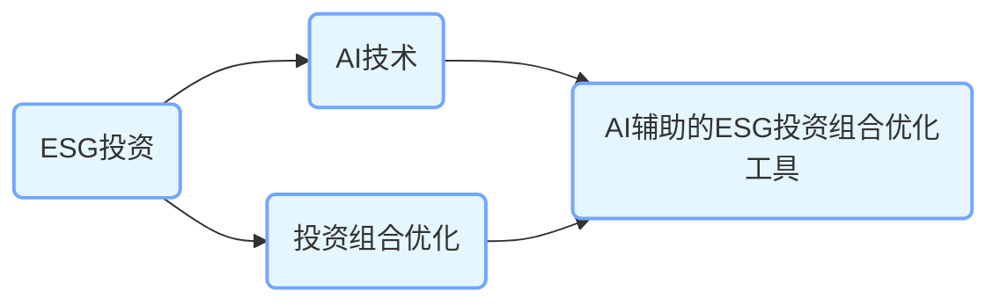

# AI辅助的ESG投资组合优化工具

> 关键词：AI、ESG、投资组合优化、金融科技、可持续投资、机器学习、数据分析

> 摘要：本文聚焦于AI辅助的ESG投资组合优化工具，旨在深入探讨该工具在金融投资领域的重要性、核心原理、算法实现以及实际应用等方面。随着全球对可持续发展的关注度不断提高，ESG（环境、社会和公司治理）因素在投资决策中愈发关键。而AI技术的发展为ESG投资组合的优化提供了强大的支持，通过对海量数据的分析和复杂模型的构建，能够更精准地评估ESG风险与收益，实现投资组合的最优配置。文章将详细介绍相关核心概念、算法原理、数学模型，并通过项目实战案例展示其具体实现过程，同时探讨其实际应用场景、推荐相关工具和资源，最后对其未来发展趋势与挑战进行总结。

## 1. 背景介绍 
### 1.1 目的和范围
本文章的目的在于全面介绍AI辅助的ESG投资组合优化工具，从其理论基础到实际应用进行深入剖析。范围涵盖了该工具的核心概念、算法原理、数学模型、项目实战、实际应用场景以及相关工具和资源推荐等方面。通过对这些内容的详细阐述，帮助读者深入理解该工具的工作原理和应用价值，为金融从业者、投资者以及对可持续投资和AI技术感兴趣的人士提供有价值的参考。

### 1.2 预期读者
本文的预期读者包括但不限于金融行业从业者，如投资经理、分析师、基金经理等，他们可以从文章中获取关于如何利用AI技术优化ESG投资组合的实用信息，提升投资决策的科学性和准确性。同时，对可持续投资和AI技术感兴趣的研究人员、学者也可以通过本文了解该领域的最新发展动态和技术应用。此外，普通投资者也可以通过阅读本文，增强对ESG投资的认识，更好地进行个人投资决策。

### 1.3 文档结构概述
本文将按照以下结构进行阐述：首先介绍背景信息，包括目的、预期读者和文档结构概述等。接着详细讲解核心概念与联系，通过文本示意图和Mermaid流程图展示其原理和架构。然后深入探讨核心算法原理及具体操作步骤，结合Python源代码进行详细阐述。之后介绍数学模型和公式，并通过举例说明其应用。再通过项目实战案例，包括开发环境搭建、源代码实现和代码解读等，展示该工具的实际应用。随后探讨实际应用场景，介绍相关工具和资源推荐，包括学习资源、开发工具框架和相关论文著作等。最后对未来发展趋势与挑战进行总结，并提供常见问题与解答以及扩展阅读和参考资料。

### 1.4 术语表
#### 1.4.1 核心术语定义
- **AI（Artificial Intelligence）**：人工智能，是指通过计算机技术模拟人类智能的一系列方法和技术，包括机器学习、深度学习、自然语言处理等。
- **ESG（Environmental, Social, and Governance）**：环境、社会和公司治理，是一种关注企业在环境保护、社会责任和公司治理方面表现的投资理念和评价标准。
- **投资组合优化**：在一定的风险约束下，通过合理配置资产，实现投资组合预期收益最大化的过程。
- **机器学习**：是人工智能的一个分支，通过让计算机从数据中学习模式和规律，从而实现预测和决策的技术。
- **数据分析**：对大量数据进行收集、整理、分析和解释的过程，以发现有价值的信息和知识。

#### 1.4.2 相关概念解释
- **可持续投资**：是一种考虑了环境、社会和公司治理等因素的投资方式，旨在实现长期的经济回报和社会环境效益的平衡。
- **风险评估**：对投资过程中可能面临的各种风险进行识别、分析和评估的过程，以便采取相应的措施进行风险管理。
- **收益预测**：根据历史数据和相关因素，对投资组合未来的收益进行预测的过程。

#### 1.4.3 缩略词列表
- **AI**：Artificial Intelligence
- **ESG**：Environmental, Social, and Governance
- **ML**：Machine Learning
- **DL**：Deep Learning
- **NLP**：Natural Language Processing

## 2. 核心概念与联系 
### 2.1 ESG投资的概念
ESG投资是一种关注企业在环境、社会和公司治理方面表现的投资理念和评价标准。在环境方面，主要考虑企业的能源使用效率、污染物排放、资源管理等因素；在社会方面，关注企业的员工福利、社区关系、供应链管理等；在公司治理方面，涉及企业的董事会结构、股东权益、信息披露等。通过对企业ESG表现的评估，投资者可以更好地了解企业的长期可持续发展能力，从而做出更明智的投资决策。

### 2.2 AI在ESG投资中的作用
AI技术在ESG投资中发挥着重要作用。首先，AI可以处理和分析海量的ESG数据，包括企业报告、新闻资讯、社交媒体数据等，从中提取有价值的信息。其次，AI可以通过机器学习和深度学习算法，对企业的ESG表现进行评估和预测，帮助投资者更准确地识别ESG风险和机会。此外，AI还可以用于优化投资组合，根据投资者的风险偏好和投资目标，实现资产的最优配置。

### 2.3 投资组合优化的原理
投资组合优化的核心目标是在一定的风险约束下，实现投资组合预期收益的最大化。其基本原理是通过分散投资，降低单一资产的风险，同时根据资产之间的相关性，合理配置资产比例。传统的投资组合优化方法主要基于马科维茨的均值 - 方差模型，该模型通过计算资产的预期收益率和方差，以及资产之间的协方差，来确定最优的投资组合。然而，传统方法在处理ESG因素时存在一定的局限性，而AI辅助的投资组合优化工具可以更好地考虑ESG因素，提高投资组合的绩效。

### 2.4 核心概念的联系
ESG投资、AI技术和投资组合优化之间存在着紧密的联系。ESG投资为投资组合优化提供了新的视角和标准，将环境、社会和公司治理等因素纳入投资决策过程中。AI技术则为ESG投资和投资组合优化提供了强大的支持，通过数据处理、分析和模型构建，帮助投资者更好地理解ESG因素对投资组合的影响，实现投资组合的优化。三者相互促进，共同推动了可持续投资的发展。

### 2.5 文本示意图
```plaintext
              +-----------------+
              |     ESG投资     |
              +-----------------+
                    |
                    v
+-------------------+-------------------+
|       AI技术       |       投资组合优化       |
+-------------------+-------------------+
                    |
                    v
              +-----------------+
              |  AI辅助的ESG投资组合优化工具  |
              +-----------------+
```

### 2.6 Mermaid流程图


## 3. 核心算法原理 & 具体操作步骤 
### 3.1 核心算法原理
AI辅助的ESG投资组合优化工具主要涉及到机器学习和优化算法。其中，机器学习算法用于对企业的ESG表现进行评估和预测，而优化算法则用于实现投资组合的最优配置。

#### 3.1.1 机器学习算法
常见的机器学习算法包括决策树、随机森林、支持向量机、神经网络等。这些算法可以根据历史ESG数据和企业的财务数据，构建预测模型，对企业的ESG评级和未来表现进行预测。例如，使用决策树算法可以根据企业的各项指标，如碳排放、员工满意度等，对企业的ESG表现进行分类和预测。

#### 3.1.2 优化算法
优化算法主要用于在一定的风险约束下，实现投资组合预期收益的最大化。常见的优化算法包括线性规划、非线性规划、遗传算法等。其中，线性规划和非线性规划可以根据投资组合的预期收益率、风险和约束条件，求解最优的资产配置比例。遗传算法则是一种基于生物进化原理的优化算法，通过模拟自然选择和遗传过程，寻找最优的投资组合。

### 3.2 具体操作步骤
#### 3.2.1 数据收集与预处理
首先，需要收集企业的ESG数据、财务数据以及市场数据等。ESG数据可以从企业报告、ESG评级机构、新闻资讯等渠道获取；财务数据可以从上市公司的年报、季报等中获取；市场数据可以从金融数据提供商处获取。收集到的数据可能存在缺失值、异常值等问题，需要进行预处理，包括数据清洗、数据归一化、数据编码等操作，以提高数据的质量和可用性。

#### 3.2.2 特征工程
特征工程是指从原始数据中提取有价值的特征，用于模型训练。在ESG投资组合优化中，特征可以包括企业的ESG指标、财务指标、市场指标等。例如，可以提取企业的碳排放强度、员工流失率、市盈率等特征。同时，还可以通过特征选择和特征组合等方法，减少特征的维度，提高模型的训练效率和准确性。

#### 3.2.3 模型训练与评估
选择合适的机器学习算法和优化算法，对预处理后的数据进行模型训练。在训练过程中，需要将数据集划分为训练集和测试集，使用训练集对模型进行训练，使用测试集对模型的性能进行评估。评估指标可以包括准确率、召回率、F1值、均方误差等。通过不断调整模型的参数，提高模型的性能。

#### 3.2.4 投资组合优化
根据训练好的模型，对企业的ESG表现和未来收益进行预测。然后，使用优化算法，在一定的风险约束下，实现投资组合的最优配置。在优化过程中，需要考虑投资者的风险偏好、投资目标、投资期限等因素，确定最优的资产配置比例。

#### 3.2.5 模型更新与监控
市场环境和企业的ESG表现是不断变化的，因此需要定期对模型进行更新和监控。通过收集新的数据，重新训练模型，以提高模型的准确性和适应性。同时，需要对投资组合的绩效进行实时监控，及时调整资产配置比例，以实现投资目标。

### 3.3 Python源代码实现
以下是一个简单的示例，演示如何使用Python实现AI辅助的ESG投资组合优化工具。

```python
import numpy as np
import pandas as pd
from sklearn.ensemble import RandomForestRegressor
from scipy.optimize import minimize

# 数据收集与预处理
# 假设已经收集到了企业的ESG数据和财务数据
data = pd.read_csv('esg_data.csv')
X = data.drop('target', axis=1)  # 特征数据
y = data['target']  # 目标数据

# 数据归一化
from sklearn.preprocessing import StandardScaler
scaler = StandardScaler()
X_scaled = scaler.fit_transform(X)

# 特征工程
# 这里简单选择所有特征
selected_features = X_scaled

# 模型训练与评估
# 使用随机森林回归模型
model = RandomForestRegressor(n_estimators=100, random_state=42)
model.fit(selected_features, y)

# 预测企业的ESG表现和未来收益
predictions = model.predict(selected_features)

# 投资组合优化
# 假设已经有了资产的预期收益率和协方差矩阵
expected_returns = np.array([0.1, 0.15, 0.2])  # 预期收益率
cov_matrix = np.array([[0.1, 0.05, 0.02],
                       [0.05, 0.12, 0.03],
                       [0.02, 0.03, 0.15]])  # 协方差矩阵

# 定义目标函数：最小化风险
def portfolio_risk(weights, cov_matrix):
    return np.dot(weights.T, np.dot(cov_matrix, weights))

# 定义约束条件：权重之和为1
constraints = ({'type': 'eq', 'fun': lambda x: np.sum(x) - 1})

# 定义边界条件：权重在0到1之间
bounds = [(0, 1) for _ in range(len(expected_returns))]

# 初始权重
initial_weights = np.ones(len(expected_returns)) / len(expected_returns)

# 求解最优权重
result = minimize(portfolio_risk, initial_weights, args=(cov_matrix,),
                  constraints=constraints, bounds=bounds)

optimal_weights = result.x

print("最优权重:", optimal_weights)
```

## 4. 数学模型和公式 & 详细讲解 & 举例说明 
### 4.1 马科维茨均值 - 方差模型
马科维茨均值 - 方差模型是投资组合优化的经典模型，其核心思想是在一定的风险约束下，实现投资组合预期收益的最大化。

#### 4.1.1 数学公式
设投资组合中包含 $n$ 种资产，第 $i$ 种资产的权重为 $w_i$，预期收益率为 $r_i$，投资组合的预期收益率为 $R_p$，则有：

$$R_p = \sum_{i=1}^{n} w_i r_i$$

投资组合的方差 $\sigma_p^2$ 可以表示为：

$$\sigma_p^2 = \sum_{i=1}^{n} \sum_{j=1}^{n} w_i w_j \sigma_{ij}$$

其中，$\sigma_{ij}$ 是资产 $i$ 和资产 $j$ 的协方差。

#### 4.1.2 详细讲解
马科维茨均值 - 方差模型的目标是在给定的预期收益率下，最小化投资组合的方差，或者在给定的方差下，最大化投资组合的预期收益率。通过求解以下优化问题，可以得到最优的投资组合：

$$\min_{w_1, w_2, \cdots, w_n} \sigma_p^2 = \sum_{i=1}^{n} \sum_{j=1}^{n} w_i w_j \sigma_{ij}$$

$$\text{s.t.} \quad \sum_{i=1}^{n} w_i r_i = R_p$$

$$\sum_{i=1}^{n} w_i = 1$$

$$w_i \geq 0, \quad i = 1, 2, \cdots, n$$

其中，第一个约束条件表示投资组合的预期收益率等于给定的目标收益率，第二个约束条件表示权重之和为1，第三个约束条件表示权重非负。

#### 4.1.3 举例说明
假设有三种资产，其预期收益率分别为 $r_1 = 0.1$，$r_2 = 0.15$，$r_3 = 0.2$，协方差矩阵为：

$$\Sigma = \begin{bmatrix}
0.1 & 0.05 & 0.02 \\
0.05 & 0.12 & 0.03 \\
0.02 & 0.03 & 0.15
\end{bmatrix}$$

目标收益率为 $R_p = 0.15$。我们可以使用Python的 `scipy.optimize` 库来求解这个优化问题：

```python
import numpy as np
from scipy.optimize import minimize

# 预期收益率
expected_returns = np.array([0.1, 0.15, 0.2])

# 协方差矩阵
cov_matrix = np.array([[0.1, 0.05, 0.02],
                       [0.05, 0.12, 0.03],
                       [0.02, 0.03, 0.15]])

# 目标收益率
target_return = 0.15

# 定义目标函数：最小化风险
def portfolio_risk(weights, cov_matrix):
    return np.dot(weights.T, np.dot(cov_matrix, weights))

# 定义约束条件：预期收益率等于目标收益率，权重之和为1
constraints = [{'type': 'eq', 'fun': lambda x: np.dot(x, expected_returns) - target_return},
               {'type': 'eq', 'fun': lambda x: np.sum(x) - 1}]

# 定义边界条件：权重在0到1之间
bounds = [(0, 1) for _ in range(len(expected_returns))]

# 初始权重
initial_weights = np.ones(len(expected_returns)) / len(expected_returns)

# 求解最优权重
result = minimize(portfolio_risk, initial_weights, args=(cov_matrix,),
                  constraints=constraints, bounds=bounds)

optimal_weights = result.x

print("最优权重:", optimal_weights)
```

### 4.2 考虑ESG因素的扩展模型
在马科维茨均值 - 方差模型的基础上，可以考虑ESG因素对投资组合的影响。一种常见的方法是将ESG得分作为一个额外的约束条件或目标函数的一部分。

#### 4.2.1 数学公式
设第 $i$ 种资产的ESG得分是 $s_i$，投资组合的ESG得分 $S_p$ 可以表示为：

$$S_p = \sum_{i=1}^{n} w_i s_i$$

在优化问题中，可以添加一个ESG得分的约束条件，例如要求投资组合的ESG得分不低于某个阈值 $S_{min}$：

$$\sum_{i=1}^{n} w_i s_i \geq S_{min}$$

#### 4.2.2 详细讲解
通过添加ESG得分的约束条件，可以确保投资组合在满足一定风险和收益要求的同时，具有较高的ESG表现。在求解优化问题时，需要同时考虑预期收益率、方差和ESG得分等多个因素，找到最优的投资组合。

#### 4.2.3 举例说明
假设三种资产的ESG得分分别为 $s_1 = 0.8$，$s_2 = 0.9$，$s_3 = 0.7$，ESG得分的阈值为 $S_{min} = 0.85$。我们可以在前面的优化问题中添加ESG得分的约束条件：

```python
import numpy as np
from scipy.optimize import minimize

# 预期收益率
expected_returns = np.array([0.1, 0.15, 0.2])

# 协方差矩阵
cov_matrix = np.array([[0.1, 0.05, 0.02],
                       [0.05, 0.12, 0.03],
                       [0.02, 0.03, 0.15]])

# 目标收益率
target_return = 0.15

# ESG得分
esg_scores = np.array([0.8, 0.9, 0.7])

# ESG得分阈值
esg_min_score = 0.85

# 定义目标函数：最小化风险
def portfolio_risk(weights, cov_matrix):
    return np.dot(weights.T, np.dot(cov_matrix, weights))

# 定义约束条件：预期收益率等于目标收益率，权重之和为1，ESG得分不低于阈值
constraints = [{'type': 'eq', 'fun': lambda x: np.dot(x, expected_returns) - target_return},
               {'type': 'eq', 'fun': lambda x: np.sum(x) - 1},
               {'type': 'ineq', 'fun': lambda x: np.dot(x, esg_scores) - esg_min_score}]

# 定义边界条件：权重在0到1之间
bounds = [(0, 1) for _ in range(len(expected_returns))]

# 初始权重
initial_weights = np.ones(len(expected_returns)) / len(expected_returns)

# 求解最优权重
result = minimize(portfolio_risk, initial_weights, args=(cov_matrix,),
                  constraints=constraints, bounds=bounds)

optimal_weights = result.x

print("最优权重:", optimal_weights)
```

## 5. 项目实战：代码实际案例和详细解释说明 
### 5.1  开发环境搭建
#### 5.1.1 操作系统
本项目可以在Windows、Linux或Mac OS等常见操作系统上进行开发。建议使用较新版本的操作系统，以确保兼容性和性能。

#### 5.1.2 Python环境
安装Python 3.7及以上版本。可以从Python官方网站（https://www.python.org/downloads/）下载并安装Python。安装完成后，建议使用虚拟环境来管理项目的依赖，以避免不同项目之间的依赖冲突。可以使用 `venv` 或 `conda` 来创建虚拟环境。

```bash
# 使用venv创建虚拟环境
python -m venv myenv

# 激活虚拟环境（Windows）
myenv\Scripts\activate

# 激活虚拟环境（Linux/Mac OS）
source myenv/bin/activate
```

#### 5.1.3 依赖库安装
安装项目所需的依赖库，包括 `pandas`、`numpy`、`scikit-learn`、`scipy` 等。可以使用 `pip` 来安装这些库。

```bash
pip install pandas numpy scikit-learn scipy
```

### 5.2  源代码详细实现和代码解读
以下是一个完整的AI辅助的ESG投资组合优化工具的源代码示例，并对代码进行详细解读。

```python
import numpy as np
import pandas as pd
from sklearn.ensemble import RandomForestRegressor
from scipy.optimize import minimize

# 数据收集与预处理
def load_and_preprocess_data(file_path):
    # 加载数据
    data = pd.read_csv(file_path)
    
    # 分离特征和目标
    X = data.drop('target', axis=1)
    y = data['target']
    
    # 数据归一化
    from sklearn.preprocessing import StandardScaler
    scaler = StandardScaler()
    X_scaled = scaler.fit_transform(X)
    
    return X_scaled, y

# 模型训练与评估
def train_model(X, y):
    # 使用随机森林回归模型
    model = RandomForestRegressor(n_estimators=100, random_state=42)
    model.fit(X, y)
    
    return model

# 投资组合优化
def portfolio_optimization(expected_returns, cov_matrix, esg_scores=None, esg_min_score=None):
    # 定义目标函数：最小化风险
    def portfolio_risk(weights, cov_matrix):
        return np.dot(weights.T, np.dot(cov_matrix, weights))
    
    # 定义约束条件：权重之和为1
    constraints = [{'type': 'eq', 'fun': lambda x: np.sum(x) - 1}]
    
    if esg_scores is not None and esg_min_score is not None:
        # 添加ESG得分的约束条件
        constraints.append({'type': 'ineq', 'fun': lambda x: np.dot(x, esg_scores) - esg_min_score})
    
    # 定义边界条件：权重在0到1之间
    bounds = [(0, 1) for _ in range(len(expected_returns))]
    
    # 初始权重
    initial_weights = np.ones(len(expected_returns)) / len(expected_returns)
    
    # 求解最优权重
    result = minimize(portfolio_risk, initial_weights, args=(cov_matrix,),
                      constraints=constraints, bounds=bounds)
    
    optimal_weights = result.x
    
    return optimal_weights

# 主函数
def main():
    # 数据收集与预处理
    X, y = load_and_preprocess_data('esg_data.csv')
    
    # 模型训练与评估
    model = train_model(X, y)
    
    # 预测企业的ESG表现和未来收益
    predictions = model.predict(X)
    
    # 假设已经有了资产的预期收益率和协方差矩阵
    expected_returns = np.array([0.1, 0.15, 0.2])
    cov_matrix = np.array([[0.1, 0.05, 0.02],
                           [0.05, 0.12, 0.03],
                           [0.02, 0.03, 0.15]])
    
    # 假设已经有了资产的ESG得分和ESG得分阈值
    esg_scores = np.array([0.8, 0.9, 0.7])
    esg_min_score = 0.85
    
    # 投资组合优化
    optimal_weights = portfolio_optimization(expected_returns, cov_matrix, esg_scores, esg_min_score)
    
    print("最优权重:", optimal_weights)

if __name__ == "__main__":
    main()
```

### 5.3  代码解读与分析
#### 5.3.1 `load_and_preprocess_data` 函数
该函数用于加载数据并进行预处理。首先，使用 `pandas` 库的 `read_csv` 函数读取CSV文件中的数据。然后，将数据分离为特征数据 `X` 和目标数据 `y`。最后，使用 `StandardScaler` 对特征数据进行归一化处理，以提高模型的训练效果。

#### 5.3.2 `train_model` 函数
该函数用于训练随机森林回归模型。使用 `RandomForestRegressor` 类创建一个随机森林回归模型，并使用训练数据对模型进行训练。

#### 5.3.3 `portfolio_optimization` 函数
该函数用于实现投资组合优化。首先，定义目标函数 `portfolio_risk`，用于计算投资组合的风险。然后，定义约束条件，包括权重之和为1和ESG得分的约束条件（如果提供了ESG得分和阈值）。接着，定义边界条件，即权重在0到1之间。最后，使用 `minimize` 函数求解最优权重。

#### 5.3.4 `main` 函数
该函数是程序的入口点。首先，调用 `load_and_preprocess_data` 函数加载和预处理数据。然后，调用 `train_model` 函数训练模型，并使用模型进行预测。接着，定义资产的预期收益率、协方差矩阵、ESG得分和ESG得分阈值。最后，调用 `portfolio_optimization` 函数进行投资组合优化，并打印最优权重。

## 6. 实际应用场景 
### 6.1 机构投资者
对于机构投资者，如养老基金、保险公司、共同基金等，AI辅助的ESG投资组合优化工具可以帮助他们更好地管理投资组合，实现长期的可持续投资目标。通过考虑ESG因素，机构投资者可以降低投资风险，提高投资组合的绩效，同时满足监管要求和投资者的社会责任期望。例如，养老基金可以使用该工具选择具有良好ESG表现的企业进行投资，以确保养老金的长期稳定增值。

### 6.2 个人投资者
个人投资者也可以受益于AI辅助的ESG投资组合优化工具。随着人们对可持续发展的关注度不断提高，越来越多的个人投资者希望将ESG因素纳入投资决策中。该工具可以帮助个人投资者更好地了解企业的ESG表现，选择符合自己价值观和风险偏好的投资组合。例如，个人投资者可以使用该工具筛选出具有高ESG评级的股票或基金，进行长期投资。

### 6.3 金融机构
金融机构，如银行、证券公司等，可以利用AI辅助的ESG投资组合优化工具开发创新的金融产品和服务。例如，银行可以推出基于ESG的理财产品，为客户提供更具吸引力的投资选择。证券公司可以使用该工具为客户提供ESG投资咨询服务，帮助客户制定个性化的投资策略。

### 6.4 企业
企业也可以从AI辅助的ESG投资组合优化工具中受益。通过了解投资者对ESG因素的关注，企业可以加强自身的ESG管理，提高企业的可持续发展能力。同时，企业还可以利用该工具优化自身的投资决策，选择具有良好ESG表现的合作伙伴和投资项目，实现企业的长期发展目标。

## 7. 工具和资源推荐
### 7.1 学习资源推荐
#### 7.1.1 书籍推荐
- 《机器学习》（周志华著）：本书是机器学习领域的经典教材，系统地介绍了机器学习的基本概念、算法和应用。
- 《Python数据分析实战》（作者：韦斯·麦金尼）：本书介绍了如何使用Python进行数据分析，包括数据处理、数据可视化、机器学习等内容。
- 《金融数学》（作者：林清泉）：本书介绍了金融数学的基本概念、模型和方法，对于理解投资组合优化的数学原理有很大帮助。

#### 7.1.2 在线课程
- Coursera上的“机器学习”课程（由吴恩达教授授课）：该课程是机器学习领域的经典在线课程，内容涵盖了机器学习的基本算法和应用。
- edX上的“数据科学基础”课程：该课程介绍了数据科学的基本概念、方法和工具，包括数据处理、数据分析、机器学习等内容。
- Udemy上的“Python for Finance: Investment Fundamentals & Data Analytics”课程：该课程介绍了如何使用Python进行金融数据分析和投资组合优化。

#### 7.1.3 技术博客和网站
- Medium：Medium上有很多关于AI、ESG投资和金融科技的技术博客和文章，可以帮助读者了解最新的技术动态和研究成果。
- Towards Data Science：该网站专注于数据科学和机器学习领域的技术文章和教程，提供了很多有价值的学习资源。
- ESG Investor：该网站是一个专注于ESG投资的媒体平台，提供了ESG投资的最新资讯、研究报告和案例分析。

### 7.2 开发工具框架推荐
#### 7.2.1 IDE和编辑器
- PyCharm：PyCharm是一款专业的Python集成开发环境，提供了丰富的功能和工具，如代码编辑、调试、版本控制等，适合开发Python项目。
- Jupyter Notebook：Jupyter Notebook是一个交互式的开发环境，支持Python、R等多种编程语言，适合进行数据探索、模型训练和可视化等工作。
- Visual Studio Code：Visual Studio Code是一款轻量级的代码编辑器，支持多种编程语言和插件，具有良好的扩展性和性能。

#### 7.2.2 调试和性能分析工具
- PDB：PDB是Python自带的调试工具，可以帮助开发者调试Python代码，查找和解决代码中的问题。
- cProfile：cProfile是Python的性能分析工具，可以帮助开发者分析代码的性能瓶颈，优化代码的执行效率。
- TensorBoard：TensorBoard是TensorFlow的可视化工具，可以帮助开发者可视化模型的训练过程和性能指标，方便进行模型调优。

#### 7.2.3 相关框架和库
- Scikit-learn：Scikit-learn是一个开源的机器学习库，提供了丰富的机器学习算法和工具，如分类、回归、聚类、降维等，适合进行机器学习模型的开发和训练。
- Pandas：Pandas是一个开源的数据处理和分析库，提供了高效的数据结构和数据操作工具，如DataFrame、Series等，适合进行数据处理和分析。
- NumPy：NumPy是一个开源的科学计算库，提供了高效的数组和矩阵运算工具，适合进行数值计算和科学计算。

### 7.3 相关论文著作推荐
#### 7.3.1 经典论文
- Markowitz, H. M. (1952). Portfolio Selection. The Journal of Finance, 7(1), 77-91. 该论文提出了马科维茨均值 - 方差模型，奠定了现代投资组合理论的基础。
- Fama, E. F., & French, K. R. (1992). The Cross-Section of Expected Stock Returns. The Journal of Finance, 47(2), 427-465. 该论文提出了Fama - French三因子模型，对投资组合理论的发展产生了重要影响。

#### 7.3.2 最新研究成果
- 关注顶级金融期刊，如The Journal of Finance、The Review of Financial Studies等，这些期刊上发表了很多关于ESG投资和投资组合优化的最新研究成果。
- 参加金融学术会议，如美国金融协会（AFA）年会、西部金融协会（WFA）年会等，这些会议上会有很多学者分享最新的研究成果和前沿观点。

#### 7.3.3 应用案例分析
- 各大金融机构的研究报告和案例分析：如摩根大通、贝莱德等金融机构会发布关于ESG投资和投资组合优化的研究报告和案例分析，可以从中了解实际应用中的经验和教训。
- 相关行业协会的研究成果：如可持续投资论坛（SIF）等行业协会会发布关于ESG投资的研究报告和案例分析，为从业者提供参考。

## 8. 总结：未来发展趋势与挑战
### 8.1 未来发展趋势
#### 8.1.1 AI技术的不断发展
随着AI技术的不断发展，AI辅助的ESG投资组合优化工具将变得更加智能和高效。例如，深度学习算法可以处理更复杂的ESG数据，提高模型的预测准确性；强化学习算法可以根据市场环境的变化自动调整投资组合，实现动态优化。

#### 8.1.2 ESG数据的丰富和标准化
随着全球对可持续发展的关注度不断提高，ESG数据将变得更加丰富和标准化。这将有助于提高AI辅助的ESG投资组合优化工具的性能和可靠性，使得投资者能够更准确地评估企业的ESG表现和风险。

#### 8.1.3 跨领域融合
AI辅助的ESG投资组合优化工具将与其他领域的技术和理念进行更深入的融合。例如，与区块链技术结合，可以实现ESG数据的安全共享和可信追溯；与绿色金融理念结合，可以推动更多的资金流向可持续发展领域。

#### 8.1.4 个性化服务
未来，AI辅助的ESG投资组合优化工具将提供更加个性化的服务。根据投资者的不同需求、风险偏好和投资目标，为投资者定制专属的投资组合优化方案，提高投资者的满意度和投资回报。

### 8.2 挑战
#### 8.2.1 ESG数据质量问题
目前，ESG数据的质量参差不齐，存在数据缺失、数据不准确、数据不一致等问题。这给AI辅助的ESG投资组合优化工具的开发和应用带来了很大的挑战。需要加强ESG数据的收集、整理和标准化工作，提高数据的质量和可用性。

#### 8.2.2 模型解释性问题
AI模型，尤其是深度学习模型，通常具有较高的复杂度和黑盒性，难以解释模型的决策过程和结果。在ESG投资决策中，投资者需要了解模型是如何考虑ESG因素的，以及投资组合的优化结果是如何得出的。因此，需要提高AI模型的解释性，增强投资者对模型的信任。

#### 8.2.3 监管和合规问题
随着ESG投资的快速发展，监管机构对ESG投资的监管力度也在不断加强。AI辅助的ESG投资组合优化工具需要遵守相关的法律法规和监管要求，确保投资决策的合法性和合规性。同时，还需要应对不同地区和国家的监管差异，增加了工具的开发和应用难度。

#### 8.2.4 人才短缺问题
AI辅助的ESG投资组合优化工具需要既懂AI技术又懂金融投资和ESG理念的复合型人才。目前，这类人才相对短缺，限制了该工具的发展和应用。需要加强相关领域的人才培养和引进，提高人才素质和能力。

## 9. 附录：常见问题与解答
### 9.1 什么是ESG投资？
ESG投资是一种关注企业在环境、社会和公司治理方面表现的投资理念和评价标准。通过对企业ESG表现的评估，投资者可以更好地了解企业的长期可持续发展能力，从而做出更明智的投资决策。

### 9.2 AI在ESG投资中有哪些应用？
AI在ESG投资中的应用包括数据处理和分析、ESG表现评估和预测、投资组合优化等。通过AI技术，可以处理和分析海量的ESG数据，提取有价值的信息，帮助投资者更准确地评估企业的ESG风险和机会，实现投资组合的最优配置。

### 9.3 如何选择合适的AI算法进行ESG投资组合优化？
选择合适的AI算法需要考虑数据的特点、问题的复杂度和投资目标等因素。常见的机器学习算法包括决策树、随机森林、支持向量机、神经网络等，优化算法包括线性规划、非线性规划、遗传算法等。可以通过实验和比较不同算法的性能，选择最适合的算法。

### 9.4 ESG数据从哪里获取？
ESG数据可以从多个渠道获取，包括企业报告、ESG评级机构、新闻资讯、社交媒体等。企业报告是获取ESG数据的重要来源，包括企业的年报、可持续发展报告等。ESG评级机构如MSCI、Sustainalytics等会对企业的ESG表现进行评级和评估，提供相关的数据和报告。新闻资讯和社交媒体可以提供企业的实时ESG信息和舆情数据。

### 9.5 如何评估AI辅助的ESG投资组合优化工具的性能？
可以从多个方面评估AI辅助的ESG投资组合优化工具的性能，包括预测准确性、投资组合的收益率和风险、ESG表现等。可以使用历史数据进行回测，比较不同投资组合的绩效，评估工具的有效性和可靠性。同时，还可以考虑工具的易用性、可解释性和稳定性等因素。

## 10. 扩展阅读 & 参考资料
### 10.1 扩展阅读
- 《可持续投资：ESG投资策略与实践》：本书介绍了可持续投资的概念、理论和实践，包括ESG投资的评估方法、投资策略和案例分析等内容。
- 《AI与金融科技：重塑金融未来》：本书探讨了AI技术在金融领域的应用和发展趋势，包括AI在投资决策、风险管理、客户服务等方面的应用。
- 《金融科技前沿：理论与实务》：本书介绍了金融科技的最新发展动态和前沿技术，包括区块链、人工智能、大数据等技术在金融领域的应用。

### 10.2 参考资料
- MSCI ESG Research：https://www.msci.com/esg-research
- Sustainalytics：https://www.sustainalytics.com/
- The Journal of Finance：https://onlinelibrary.wiley.com/journal/15406261
- The Review of Financial Studies：https://academic.oup.com/rfs
- Coursera：https://www.coursera.org/
- edX：https://www.edx.org/
- Udemy：https://www.udemy.com/