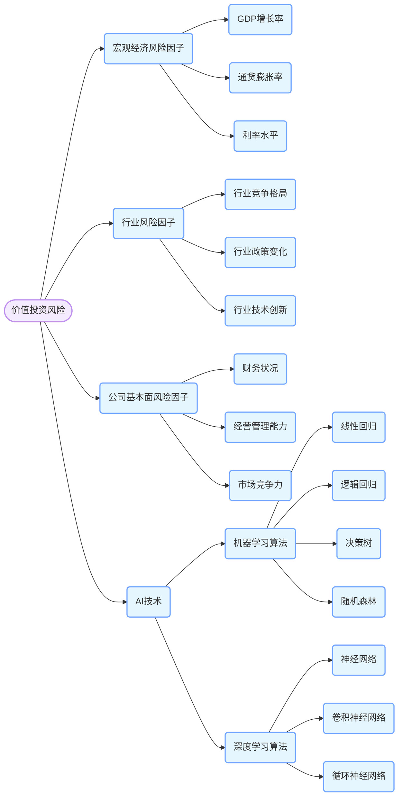

# AI驱动的价值投资风险因子分解

> 关键词：AI、价值投资、风险因子分解、机器学习、金融风险、量化分析、投资决策

> 摘要：本文聚焦于AI驱动的价值投资风险因子分解这一前沿领域。首先介绍了相关背景知识，包括研究目的、预期读者、文档结构和术语表。接着阐述了核心概念及其联系，通过文本示意图和Mermaid流程图进行直观展示。深入探讨了核心算法原理，结合Python源代码详细讲解操作步骤。用数学模型和公式对风险因子分解进行量化描述，并举例说明。通过项目实战给出代码实际案例并详细解释。分析了实际应用场景，推荐了相关学习资源、开发工具框架和论文著作。最后总结了未来发展趋势与挑战，解答常见问题并提供扩展阅读和参考资料，旨在为价值投资领域的风险评估和决策提供全面且深入的技术支持和理论指导。

## 1. 背景介绍 
### 1.1 目的和范围
在当今复杂多变的金融市场环境下，价值投资作为一种重要的投资策略，旨在寻找被低估的资产并长期持有以获取收益。然而，投资过程中面临着诸多风险，准确识别和分解这些风险因子对于投资者做出明智决策至关重要。本文的目的在于探讨如何利用AI技术对价值投资中的风险因子进行分解，为投资者提供更精准的风险评估和决策依据。范围涵盖了从AI技术的基本原理到实际应用于价值投资风险分析的各个环节，包括核心算法、数学模型、项目实战以及应用场景等方面。

### 1.2 预期读者
本文预期读者包括金融领域的投资者、投资顾问、量化分析师、金融科技从业者，以及对AI技术在金融领域应用感兴趣的研究人员和学生。无论是希望提升投资决策能力的专业人士，还是对新兴技术在金融场景应用有探索欲望的爱好者，都能从本文中获取有价值的信息和知识。

### 1.3 文档结构概述
本文将按照以下结构展开：首先介绍背景知识，为后续内容奠定基础；接着阐述核心概念与联系，使读者对相关理论有清晰的认识；然后详细讲解核心算法原理和具体操作步骤，结合Python代码进行说明；通过数学模型和公式进一步量化风险因子分解；进行项目实战，给出代码实际案例并深入解读；分析实际应用场景；推荐相关工具和资源；最后总结未来发展趋势与挑战，解答常见问题并提供扩展阅读和参考资料。

### 1.4 术语表
#### 1.4.1 核心术语定义
- **价值投资**：一种投资策略，基于对资产内在价值的分析，寻找被市场低估的资产并长期持有，以期望在资产价格回归其内在价值时获得收益。
- **风险因子**：可能影响投资收益的各种因素，包括宏观经济因素、行业因素、公司基本面因素等。
- **AI（人工智能）**：研究如何使计算机系统能够模拟人类智能的技术，包括机器学习、深度学习、自然语言处理等多个领域。
- **风险因子分解**：将投资风险分解为多个独立的风险因子，以便更好地理解和管理风险。

#### 1.4.2 相关概念解释
- **机器学习**：AI的一个重要分支，通过让计算机从数据中学习模式和规律，从而实现预测和决策。在价值投资风险因子分解中，机器学习算法可以用于识别和量化风险因子。
- **量化分析**：运用数学和统计方法对金融数据进行分析，以评估投资风险和收益。在风险因子分解中，量化分析可以帮助确定风险因子的权重和影响程度。
- **投资组合**：投资者持有的一组资产，通过合理配置不同资产可以降低风险并提高收益。风险因子分解可以为投资组合的优化提供依据。

#### 1.4.3 缩略词列表
- **AI**：Artificial Intelligence（人工智能）
- **ML**：Machine Learning（机器学习）
- **DL**：Deep Learning（深度学习）
- **GDP**：Gross Domestic Product（国内生产总值）

## 2. 核心概念与联系 

### 核心概念原理
价值投资的核心在于评估资产的内在价值，并与市场价格进行比较。而投资风险则是指实际收益偏离预期收益的可能性。风险因子分解的原理是将复杂的投资风险拆解为多个可量化的风险因子，通过分析这些因子的变化来评估投资风险。

AI技术在风险因子分解中起着关键作用。机器学习算法可以从大量的金融数据中挖掘出潜在的风险因子，并通过模型训练和优化来准确预测风险。深度学习算法则可以处理更加复杂和高维的数据，进一步提高风险因子分解的准确性。

### 架构的文本示意图
```plaintext
价值投资风险
|
|--宏观经济风险因子
|   |--GDP增长率
|   |--通货膨胀率
|   |--利率水平
|
|--行业风险因子
|   |--行业竞争格局
|   |--行业政策变化
|   |--行业技术创新
|
|--公司基本面风险因子
|   |--财务状况
|   |--经营管理能力
|   |--市场竞争力
|
|--AI技术
|   |--机器学习算法
|   |   |--线性回归
|   |   |--逻辑回归
|   |   |--决策树
|   |   |--随机森林
|   |--深度学习算法
|   |   |--神经网络
|   |   |--卷积神经网络
|   |   |--循环神经网络
```

### Mermaid流程图


## 3. 核心算法原理 & 具体操作步骤 

### 线性回归算法原理
线性回归是一种简单而常用的机器学习算法，用于建立自变量和因变量之间的线性关系。在价值投资风险因子分解中，我们可以将投资风险作为因变量，各个风险因子作为自变量，通过线性回归模型来确定每个风险因子对投资风险的影响程度。

线性回归模型的数学表达式为：

$$y = \beta_0 + \beta_1x_1 + \beta_2x_2 + \cdots + \beta_nx_n + \epsilon$$

其中，$y$ 是因变量（投资风险），$x_1, x_2, \cdots, x_n$ 是自变量（风险因子），$\beta_0, \beta_1, \cdots, \beta_n$ 是模型的参数，$\epsilon$ 是误差项。

### Python源代码实现
```python
import numpy as np
from sklearn.linear_model import LinearRegression

# 生成示例数据
# 假设我们有3个风险因子和10个样本
X = np.random.rand(10, 3)  # 自变量（风险因子）
y = np.random.rand(10)    # 因变量（投资风险）

# 创建线性回归模型
model = LinearRegression()

# 拟合模型
model.fit(X, y)

# 输出模型参数
print("截距项:", model.intercept_)
print("系数:", model.coef_)

# 进行预测
new_X = np.random.rand(1, 3)
prediction = model.predict(new_X)
print("预测结果:", prediction)
```

### 具体操作步骤
1. **数据收集**：收集与价值投资相关的金融数据，包括宏观经济数据、行业数据和公司基本面数据等。
2. **数据预处理**：对收集到的数据进行清洗、缺失值处理、标准化等操作，以提高数据质量。
3. **特征选择**：从预处理后的数据中选择与投资风险相关的特征作为风险因子。
4. **模型训练**：使用线性回归算法对数据进行训练，得到模型参数。
5. **模型评估**：使用评估指标（如均方误差、决定系数等）对模型进行评估，判断模型的性能。
6. **风险因子分解**：根据模型参数确定每个风险因子对投资风险的影响程度。

## 4. 数学模型和公式 & 详细讲解 & 举例说明 

### 风险因子分解的数学模型
假设我们有 $m$ 个投资样本，$n$ 个风险因子，投资风险用 $y_i$ 表示，第 $j$ 个风险因子用 $x_{ij}$ 表示。我们可以建立如下的线性回归模型：

$$y_i = \beta_0 + \sum_{j=1}^{n}\beta_jx_{ij} + \epsilon_i, \quad i = 1, 2, \cdots, m$$

其中，$\beta_0$ 是截距项，$\beta_j$ 是第 $j$ 个风险因子的系数，$\epsilon_i$ 是第 $i$ 个样本的误差项。

### 最小二乘法求解模型参数
为了确定模型参数 $\beta_0, \beta_1, \cdots, \beta_n$，我们通常使用最小二乘法。最小二乘法的目标是使误差项的平方和最小，即：

$$\min_{\beta_0, \beta_1, \cdots, \beta_n} \sum_{i=1}^{m}\epsilon_i^2 = \min_{\beta_0, \beta_1, \cdots, \beta_n} \sum_{i=1}^{m}(y_i - \beta_0 - \sum_{j=1}^{n}\beta_jx_{ij})^2$$

对上述目标函数分别求关于 $\beta_0, \beta_1, \cdots, \beta_n$ 的偏导数，并令其等于0，可以得到一组线性方程组，解这个方程组即可得到模型参数。

### 举例说明
假设我们有以下投资数据：

| 样本编号 | 风险因子1 ($x_1$) | 风险因子2 ($x_2$) | 投资风险 ($y$) |
|---|---|---|---|
| 1 | 1 | 2 | 3 |
| 2 | 2 | 3 | 5 |
| 3 | 3 | 4 | 7 |

我们可以使用线性回归模型来分解风险因子。首先，将数据表示为矩阵形式：

$$X = \begin{bmatrix}
1 & 1 & 2 \\
1 & 2 & 3 \\
1 & 3 & 4
\end{bmatrix}, \quad y = \begin{bmatrix}
3 \\
5 \\
7
\end{bmatrix}$$

根据最小二乘法的公式，模型参数 $\beta$ 可以通过以下公式求解：

$$\beta = (X^TX)^{-1}X^Ty$$

使用Python代码实现：

```python
import numpy as np

X = np.array([[1, 1, 2], [1, 2, 3], [1, 3, 4]])
y = np.array([3, 5, 7])

# 计算模型参数
beta = np.linalg.inv(X.T.dot(X)).dot(X.T).dot(y)

print("模型参数:", beta)
```

运行上述代码，我们可以得到模型参数 $\beta_0, \beta_1, \beta_2$ 的值，从而确定每个风险因子对投资风险的影响程度。

## 5. 项目实战：代码实际案例和详细解释说明 

### 5.1  开发环境搭建
- **Python环境**：建议使用Python 3.7及以上版本。可以从Python官方网站（https://www.python.org/downloads/）下载安装。
- **开发工具**：推荐使用Jupyter Notebook或PyCharm等开发工具。Jupyter Notebook可以方便地进行代码调试和可视化，PyCharm则提供了强大的代码编辑和调试功能。
- **必要的库**：安装以下Python库：`pandas`（用于数据处理）、`numpy`（用于数值计算）、`scikit-learn`（用于机器学习）、`matplotlib`（用于数据可视化）。可以使用以下命令进行安装：

```sh
pip install pandas numpy scikit-learn matplotlib
```

### 5.2  源代码详细实现和代码解读
以下是一个完整的价值投资风险因子分解的项目实战代码：

```python
import pandas as pd
import numpy as np
from sklearn.linear_model import LinearRegression
from sklearn.model_selection import train_test_split
from sklearn.metrics import mean_squared_error
import matplotlib.pyplot as plt

# 数据加载
data = pd.read_csv('investment_data.csv')

# 数据预处理
# 假设数据中包含风险因子列 'factor1', 'factor2', 'factor3' 和投资风险列 'risk'
X = data[['factor1', 'factor2', 'factor3']]
y = data['risk']

# 数据划分
X_train, X_test, y_train, y_test = train_test_split(X, y, test_size=0.2, random_state=42)

# 模型训练
model = LinearRegression()
model.fit(X_train, y_train)

# 模型预测
y_pred = model.predict(X_test)

# 模型评估
mse = mean_squared_error(y_test, y_pred)
print("均方误差:", mse)

# 风险因子分解
print("截距项:", model.intercept_)
print("系数:", model.coef_)

# 可视化
plt.scatter(y_test, y_pred)
plt.xlabel('实际风险')
plt.ylabel('预测风险')
plt.title('实际风险 vs 预测风险')
plt.show()
```

### 代码解读与分析
1. **数据加载**：使用 `pandas` 库的 `read_csv` 函数加载投资数据。
2. **数据预处理**：从数据中提取风险因子列和投资风险列，并将其分别存储在 `X` 和 `y` 中。
3. **数据划分**：使用 `train_test_split` 函数将数据划分为训练集和测试集，测试集占比为20%。
4. **模型训练**：创建线性回归模型，并使用训练集数据进行训练。
5. **模型预测**：使用训练好的模型对测试集数据进行预测。
6. **模型评估**：使用均方误差（MSE）评估模型的性能。
7. **风险因子分解**：输出模型的截距项和系数，确定每个风险因子对投资风险的影响程度。
8. **可视化**：使用 `matplotlib` 库绘制实际风险和预测风险的散点图，直观展示模型的预测效果。

## 6. 实际应用场景 
### 投资组合优化
通过对价值投资风险因子的分解，投资者可以更好地了解每个风险因子对投资组合的影响程度。根据风险因子的权重，投资者可以调整投资组合中不同资产的比例，以降低风险并提高收益。例如，如果某个行业风险因子的权重较高，投资者可以适当减少该行业相关资产的配置。

### 风险预警
利用AI技术对风险因子进行实时监测和分析，可以及时发现潜在的风险。当某个风险因子的变化超过一定阈值时，系统可以发出预警信号，提醒投资者采取相应的措施。例如，当宏观经济风险因子中的通货膨胀率突然上升时，投资者可以提前调整投资策略，以应对可能的风险。

### 投资决策支持
风险因子分解的结果可以为投资者提供决策支持。投资者可以根据不同风险因子的影响程度，评估投资项目的风险和收益。例如，在选择投资标的时，投资者可以优先选择受风险因子影响较小的资产，以降低投资风险。

### 金融产品定价
在金融产品定价过程中，风险因子分解可以帮助确定产品的风险溢价。通过对风险因子的量化分析，金融机构可以更准确地评估产品的风险水平，从而合理确定产品的价格。例如，对于高风险的金融产品，需要设置较高的风险溢价，以补偿投资者承担的风险。

## 7. 工具和资源推荐
### 7.1 学习资源推荐
#### 7.1.1 书籍推荐
- 《机器学习》（周志华）：全面介绍了机器学习的基本概念、算法和应用，是机器学习领域的经典教材。
- 《Python数据分析实战》（韦斯·麦金尼）：详细介绍了使用Python进行数据分析的方法和技巧，包括数据处理、可视化和机器学习等方面。
- 《金融机器学习》（德米特里斯·尼科西亚）：结合金融领域的实际问题，介绍了机器学习在金融中的应用，包括风险评估、投资组合优化等。

#### 7.1.2 在线课程
- Coursera上的“机器学习”课程（由吴恩达教授授课）：是机器学习领域的经典在线课程，内容丰富，讲解详细。
- edX上的“Python for Data Science”课程：介绍了使用Python进行数据分析的基础知识和技能。
- Udemy上的“Financial Machine Learning”课程：专门介绍了机器学习在金融领域的应用。

#### 7.1.3 技术博客和网站
- Medium：是一个技术博客平台，上面有很多关于AI和金融领域的优秀文章。
- Towards Data Science：专注于数据科学和机器学习领域的技术博客，提供了很多实用的教程和案例。
- QuantNet：是一个金融量化分析的专业网站，提供了大量的金融数据、研究报告和技术文章。

### 7.2 开发工具框架推荐
#### 7.2.1 IDE和编辑器
- Jupyter Notebook：是一个交互式的开发环境，适合进行数据探索和模型调试。
- PyCharm：是一款专业的Python集成开发环境，提供了强大的代码编辑、调试和项目管理功能。
- Visual Studio Code：是一款轻量级的代码编辑器，支持多种编程语言，并且有丰富的插件扩展功能。

#### 7.2.2 调试和性能分析工具
- PDB：是Python自带的调试工具，可以帮助开发者定位和解决代码中的问题。
- Scikit-learn的交叉验证工具：可以用于模型的性能评估和参数调优。
- TensorBoard：是TensorFlow的可视化工具，可以帮助开发者直观地观察模型的训练过程和性能指标。

#### 7.2.3 相关框架和库
- Scikit-learn：是Python中常用的机器学习库，提供了丰富的机器学习算法和工具。
- TensorFlow：是一个开源的深度学习框架，广泛应用于图像识别、自然语言处理等领域。
- PyTorch：是另一个流行的深度学习框架，具有简洁易用的特点。

### 7.3 相关论文著作推荐
#### 7.3.1 经典论文
- Fama, E. F., & French, K. R. (1992). The cross-section of expected stock returns. The Journal of Finance, 47(2), 427-465. 该论文提出了著名的Fama-French三因子模型，对价值投资和风险因子分析具有重要影响。
- Sharpe, W. F. (1964). Capital asset prices: A theory of market equilibrium under conditions of risk. The Journal of Finance, 19(3), 425-442. 该论文提出了资本资产定价模型（CAPM），是现代金融理论的重要基础。

#### 7.3.2 最新研究成果
- 关注顶级金融期刊（如The Journal of Finance、The Review of Financial Studies等）和AI领域的会议（如NeurIPS、ICML等），可以获取最新的研究成果和前沿技术。

#### 7.3.3 应用案例分析
- 一些金融机构和研究机构会发布关于AI在价值投资风险分析中的应用案例，可以通过他们的官方网站或研究报告获取相关信息。

## 8. 总结：未来发展趋势与挑战
### 未来发展趋势
- **多模态数据融合**：未来的价值投资风险因子分解将不仅仅依赖于传统的金融数据，还会融合更多的多模态数据，如文本数据（新闻报道、公司公告等）、图像数据（卫星图像、产品图片等）和音频数据（财报电话会议等），以更全面地评估投资风险。
- **深度学习的深入应用**：深度学习算法将在风险因子分解中发挥更加重要的作用。例如，循环神经网络（RNN）和长短期记忆网络（LSTM）可以处理时间序列数据，卷积神经网络（CNN）可以处理图像数据，从而提高风险因子分解的准确性和效率。
- **强化学习在投资决策中的应用**：强化学习可以通过与环境的交互不断优化投资决策策略。未来，强化学习有望在价值投资中得到更广泛的应用，帮助投资者实现更优的投资组合管理和风险控制。
- **可解释性AI的发展**：随着AI技术在金融领域的广泛应用，对模型可解释性的需求越来越高。未来的研究将更加注重开发可解释性强的AI模型，使投资者能够更好地理解模型的决策过程和风险因子的影响机制。

### 挑战
- **数据质量和隐私问题**：金融数据的质量和隐私是一个重要的挑战。数据中可能存在噪声、缺失值和异常值，需要进行有效的预处理。同时，金融数据涉及用户隐私和商业机密，如何在保护数据隐私的前提下进行有效的风险因子分解是一个亟待解决的问题。
- **模型复杂性和计算资源**：深度学习等复杂模型的训练和应用需要大量的计算资源和时间。如何在有限的计算资源下提高模型的效率和性能是一个挑战。此外，模型的复杂性也增加了模型解释和调试的难度。
- **市场的不确定性和动态变化**：金融市场是一个复杂的动态系统，受到多种因素的影响，具有很高的不确定性。风险因子的关系和影响程度也会随着市场环境的变化而变化。如何及时捕捉市场的动态变化，调整风险因子分解模型，是一个具有挑战性的问题。
- **监管和合规要求**：AI技术在金融领域的应用受到严格的监管和合规要求。如何确保模型的开发和应用符合相关法律法规和监管要求，是金融机构和开发者需要面对的挑战。

## 9. 附录：常见问题与解答
### 1. 如何选择合适的风险因子？
选择合适的风险因子需要综合考虑多个因素。首先，可以从宏观经济、行业和公司基本面等方面入手，选择与投资风险密切相关的因素。其次，可以使用特征选择方法（如相关性分析、主成分分析等）来筛选出对投资风险影响较大的因子。此外，还可以结合领域知识和经验，选择具有实际意义的风险因子。

### 2. 如何评估风险因子分解模型的性能？
可以使用多种评估指标来评估风险因子分解模型的性能。常见的评估指标包括均方误差（MSE）、均方根误差（RMSE）、决定系数（$R^2$）等。均方误差和均方根误差可以衡量模型预测值与实际值之间的误差大小，决定系数可以衡量模型对数据的拟合程度。此外，还可以使用交叉验证等方法来评估模型的泛化能力。

### 3. 如何处理数据中的缺失值和异常值？
处理数据中的缺失值和异常值可以采用以下方法：对于缺失值，可以使用均值、中位数、众数等统计量进行填充，也可以使用插值方法进行填充。对于异常值，可以使用统计方法（如Z-score法、IQR法等）进行识别和处理，也可以使用机器学习算法（如聚类算法、孤立森林算法等）进行异常检测和处理。

### 4. 如何确保AI模型在金融领域的可解释性？
确保AI模型在金融领域的可解释性可以采用以下方法：选择可解释性强的模型（如线性回归、决策树等）；使用模型解释技术（如特征重要性分析、局部可解释模型无关解释（LIME）等）来解释模型的决策过程；结合领域知识和经验，对模型的结果进行合理的解释和验证。

## 10. 扩展阅读 & 参考资料
### 扩展阅读
- 《人工智能时代的金融风险管理》
- 《量化投资：策略与技术》
- 《金融科技前沿：技术趋势与应用实践》

### 参考资料
- 相关金融数据来源：Wind资讯、同花顺、东方财富等。
- 机器学习和深度学习相关文档：Scikit-learn官方文档、TensorFlow官方文档、PyTorch官方文档等。
- 金融学术期刊和会议论文：The Journal of Finance、The Review of Financial Studies、NeurIPS、ICML等。