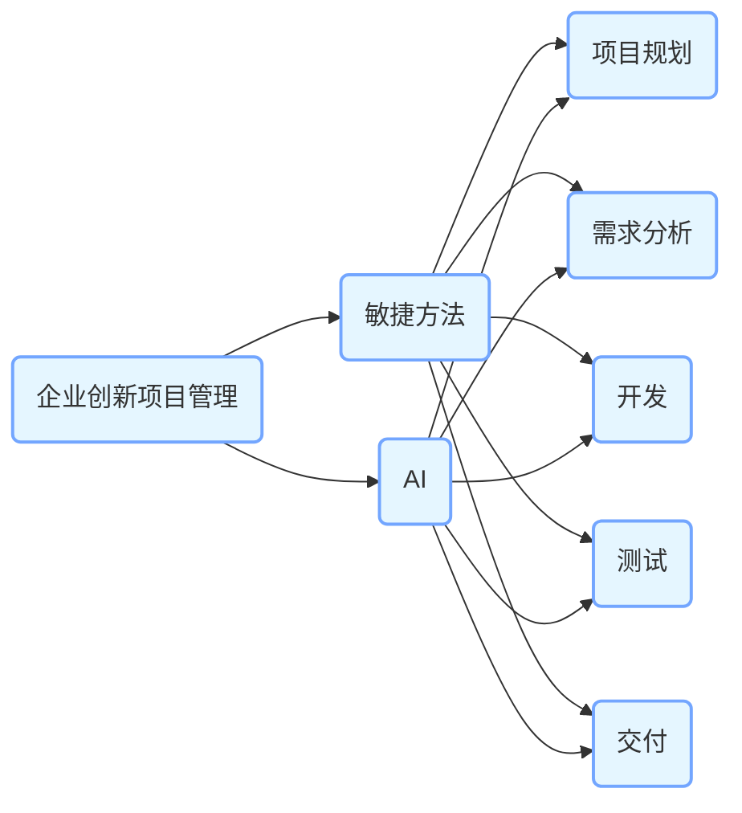

# AI驱动的企业创新项目管理：敏捷方法与AI的结合

> 关键词：AI、企业创新项目管理、敏捷方法、结合、项目效率、决策优化、创新能力

> 摘要：本文聚焦于AI驱动的企业创新项目管理中敏捷方法与AI的结合。首先介绍相关背景，包括目的范围、预期读者等内容。接着阐述核心概念与联系，详细讲解敏捷方法和AI的原理及二者联系，并给出相应流程图。深入剖析核心算法原理，通过Python代码进行详细阐述，同时介绍相关数学模型和公式。以项目实战展示代码案例及详细解释，探讨实际应用场景。推荐学习资源、开发工具框架和相关论文著作。最后总结未来发展趋势与挑战，提供常见问题解答和扩展阅读参考资料，旨在为企业在创新项目管理中有效结合敏捷方法与AI提供全面而深入的指导，助力企业提升项目管理效率和创新能力。

## 1. 背景介绍 
### 1.1 目的和范围
在当今快速发展的商业环境中，企业面临着不断创新以保持竞争力的巨大压力。创新项目管理对于企业来说至关重要，它决定了项目能否按时、按质量要求交付，以及能否为企业带来实际的价值。传统的项目管理方法在面对复杂多变的创新项目时，往往显得力不从心。

敏捷方法作为一种灵活、迭代的项目管理方法，已经在软件开发等领域取得了显著的成效。它强调快速响应变化、团队协作和客户参与，能够更好地适应创新项目的不确定性。而人工智能（AI）技术的快速发展，为项目管理带来了新的机遇。AI可以通过数据分析、预测模型等技术，帮助企业更好地进行项目规划、资源分配和风险评估。

本文的目的在于探讨如何将敏捷方法与AI结合，应用于企业创新项目管理中，以提高项目的成功率和效率。范围涵盖了从核心概念的介绍到具体的项目实战，以及实际应用场景的分析，旨在为企业提供全面的指导和参考。

### 1.2 预期读者
本文的预期读者主要包括企业的项目管理人员、项目经理、产品经理等相关人员，他们在企业创新项目管理中承担着重要的职责，需要了解如何利用新的方法和技术来提升项目管理的水平。同时，对于对AI和项目管理感兴趣的技术人员、研究人员也具有一定的参考价值，他们可以通过本文深入了解AI在项目管理中的应用和与敏捷方法的结合方式。

### 1.3 文档结构概述
本文将按照以下结构进行阐述：首先介绍背景信息，包括目的范围、预期读者等。接着讲解核心概念与联系，包括敏捷方法和AI的原理以及二者的联系，并通过流程图进行展示。然后深入分析核心算法原理，使用Python代码进行详细阐述，同时介绍相关的数学模型和公式。之后通过项目实战展示代码案例及详细解释，探讨实际应用场景。推荐学习资源、开发工具框架和相关论文著作。最后总结未来发展趋势与挑战，提供常见问题解答和扩展阅读参考资料。

### 1.4 术语表
#### 1.4.1 核心术语定义
- **敏捷方法**：一种以人为核心、迭代、循序渐进的开发方法，强调快速响应变化、团队协作和客户参与，通过短周期的迭代来逐步交付项目成果。
- **人工智能（AI）**：研究、开发用于模拟、延伸和扩展人的智能的理论、方法、技术及应用系统的一门新的技术科学，包括机器学习、深度学习、自然语言处理等多个领域。
- **企业创新项目管理**：对企业内部的创新项目进行规划、组织、协调、控制等一系列活动，以确保项目能够按时、按质量要求完成，并为企业带来创新价值。

#### 1.4.2 相关概念解释
- **迭代**：在敏捷方法中，迭代是指一个固定长度的时间段，在这个时间段内，团队完成一定的工作任务，交付一个可运行的、经过测试的产品增量。
- **机器学习**：AI的一个重要分支，它通过让计算机从数据中自动学习模式和规律，从而实现对未知数据的预测和决策。
- **项目管理成熟度**：衡量企业项目管理能力的一个指标，包括项目管理的流程、方法、工具等方面的成熟程度。

#### 1.4.3 缩略词列表
- **AI**：Artificial Intelligence（人工智能）
- **ML**：Machine Learning（机器学习）
- **NLP**：Natural Language Processing（自然语言处理）
- **Scrum**：一种常见的敏捷开发框架

## 2. 核心概念与联系 
### 2.1 敏捷方法原理
敏捷方法的核心原则是以人为核心、快速响应变化和持续交付价值。它打破了传统项目管理中按阶段顺序进行的模式，采用迭代的方式进行项目开发。在每个迭代中，团队会确定本次迭代的目标和任务，然后进行开发、测试和交付。通过不断的迭代，逐步完善项目功能，满足客户的需求。

敏捷方法强调团队的自组织和协作，团队成员之间密切沟通，共同解决问题。同时，敏捷方法注重客户的参与，客户可以在项目的各个阶段提供反馈，确保项目方向的正确性。

### 2.2 AI原理
AI是通过计算机模拟人类智能的技术。它主要包括机器学习、深度学习、自然语言处理等多个领域。机器学习是AI的核心技术之一，它通过让计算机从大量的数据中学习模式和规律，从而实现对未知数据的预测和决策。深度学习是机器学习的一个分支，它通过构建多层神经网络来学习数据的复杂特征，在图像识别、语音识别等领域取得了显著的成果。自然语言处理则是让计算机能够理解和处理人类语言的技术，包括文本分类、情感分析等应用。

### 2.3 敏捷方法与AI的联系
敏捷方法和AI在企业创新项目管理中具有很强的互补性。敏捷方法的灵活性和快速响应变化的特点，可以更好地适应AI技术不断发展和变化的需求。而AI技术可以为敏捷方法提供更强大的数据分析和决策支持能力。

例如，在项目规划阶段，AI可以通过对历史项目数据的分析，帮助团队更好地估计项目的工作量和时间，制定更合理的迭代计划。在项目执行过程中，AI可以实时监测项目进度和质量，及时发现潜在的问题，并提供预警和建议。同时，AI还可以通过自然语言处理技术，实现团队成员之间更高效的沟通和协作。

### 2.4 文本示意图
敏捷方法与AI在企业创新项目管理中的结合可以用以下示意图表示：

企业创新项目管理作为核心，敏捷方法围绕在其周围，提供灵活的项目管理流程和团队协作机制。AI则作为一种强大的技术支撑，贯穿于项目管理的各个环节，包括项目规划、需求分析、开发、测试、交付等。通过AI的数据分析和决策支持能力，帮助敏捷团队更好地完成项目任务，提高项目的成功率和效率。

### 2.5 Mermaid流程图


## 3. 核心算法原理 & 具体操作步骤 
### 3.1 项目工作量估计算法
在项目规划阶段，准确估计项目的工作量是非常重要的。我们可以使用机器学习中的线性回归算法来估计项目的工作量。线性回归算法通过对历史项目数据的分析，建立项目工作量与相关因素（如功能点数、团队规模等）之间的线性关系。

以下是使用Python实现线性回归算法进行项目工作量估计的代码：
```python
import numpy as np
from sklearn.linear_model import LinearRegression

# 历史项目数据，假设第一列是功能点数，第二列是团队规模，第三列是实际工作量
X = np.array([[10, 3], [20, 5], [30, 7], [40, 9]])
y = np.array([20, 40, 60, 80])

# 创建线性回归模型
model = LinearRegression()

# 训练模型
model.fit(X, y)

# 新的项目数据，假设功能点数为50，团队规模为11
new_project = np.array([[50, 11]])

# 预测新项目的工作量
predicted_workload = model.predict(new_project)

print("预测的项目工作量为:", predicted_workload[0])
```
### 3.2 具体操作步骤
1. **数据收集**：收集历史项目的相关数据，包括功能点数、团队规模、实际工作量等。
2. **数据预处理**：对收集到的数据进行清洗和预处理，去除缺失值和异常值。
3. **模型训练**：使用线性回归算法对预处理后的数据进行训练，得到项目工作量估计模型。
4. **预测**：将新的项目数据输入到训练好的模型中，得到预测的项目工作量。

### 3.3 项目进度监测算法
在项目执行过程中，实时监测项目进度是非常重要的。我们可以使用机器学习中的时间序列分析算法来监测项目进度。时间序列分析算法通过对项目历史进度数据的分析，预测项目未来的进度情况。

以下是使用Python实现时间序列分析算法进行项目进度监测的代码：
```python
import pandas as pd
from statsmodels.tsa.arima.model import ARIMA

# 项目历史进度数据，假设是一个时间序列
data = pd.Series([10, 20, 30, 40, 50])

# 创建ARIMA模型
model = ARIMA(data, order=(1, 1, 1))

# 训练模型
model_fit = model.fit()

# 预测未来的项目进度
future_progress = model_fit.forecast(steps=3)

print("预测的未来项目进度为:", future_progress)
```
### 3.4 具体操作步骤
1. **数据收集**：收集项目的历史进度数据，按照时间顺序排列。
2. **数据预处理**：对收集到的数据进行清洗和预处理，确保数据的平稳性。
3. **模型训练**：使用时间序列分析算法对预处理后的数据进行训练，得到项目进度监测模型。
4. **预测**：将当前的项目进度数据输入到训练好的模型中，得到预测的未来项目进度。

## 4. 数学模型和公式 & 详细讲解 & 举例说明 
### 4.1 线性回归模型
线性回归模型是一种用于建立自变量和因变量之间线性关系的模型。其数学公式为：
$$y = \beta_0 + \beta_1x_1 + \beta_2x_2 + \cdots + \beta_nx_n + \epsilon$$
其中，$y$ 是因变量（如项目工作量），$x_1, x_2, \cdots, x_n$ 是自变量（如功能点数、团队规模等），$\beta_0, \beta_1, \beta_2, \cdots, \beta_n$ 是模型的参数，$\epsilon$ 是误差项。

线性回归模型的目标是通过最小化误差项的平方和来估计模型的参数。具体来说，就是求解以下优化问题：
$$\min_{\beta_0, \beta_1, \cdots, \beta_n} \sum_{i=1}^{m} (y_i - (\beta_0 + \beta_1x_{i1} + \beta_2x_{i2} + \cdots + \beta_nx_{in}))^2$$
其中，$m$ 是样本数量，$y_i$ 是第 $i$ 个样本的因变量值，$x_{i1}, x_{i2}, \cdots, x_{in}$ 是第 $i$ 个样本的自变量值。

### 4.2 举例说明
假设我们有以下历史项目数据：
| 功能点数 | 团队规模 | 实际工作量 |
| ---- | ---- | ---- |
| 10 | 3 | 20 |
| 20 | 5 | 40 |
| 30 | 7 | 60 |
| 40 | 9 | 80 |

我们可以使用线性回归模型来估计项目工作量。首先，将数据表示为矩阵形式：
$$X = \begin{bmatrix} 1 & 10 & 3 \\ 1 & 20 & 5 \\ 1 & 30 & 7 \\ 1 & 40 & 9 \end{bmatrix}$$
$$y = \begin{bmatrix} 20 \\ 40 \\ 60 \\ 80 \end{bmatrix}$$
然后，使用最小二乘法求解模型的参数：
$$\beta = (X^T X)^{-1} X^T y$$
计算得到：
$$\beta = \begin{bmatrix} 0 \\ 2 \\ 0 \end{bmatrix}$$
因此，线性回归模型为：
$$y = 0 + 2x_1 + 0x_2$$
即项目工作量只与功能点数有关，且每个功能点的工作量为 2。

### 4.3 时间序列分析模型
时间序列分析模型是一种用于分析时间序列数据的模型。常见的时间序列分析模型包括ARIMA模型（自回归积分滑动平均模型）。ARIMA模型的数学公式为：
$$(1 - \phi_1B - \cdots - \phi_pB^p)(1 - B)^d y_t = (1 + \theta_1B + \cdots + \theta_qB^q) \epsilon_t$$
其中，$y_t$ 是时间序列数据，$B$ 是后移算子，$\phi_1, \cdots, \phi_p$ 是自回归系数，$d$ 是差分阶数，$\theta_1, \cdots, \theta_q$ 是滑动平均系数，$\epsilon_t$ 是白噪声序列。

### 4.4 举例说明
假设我们有以下项目历史进度数据：
| 时间 | 进度 |
| ---- | ---- |
| 1 | 10 |
| 2 | 20 |
| 3 | 30 |
| 4 | 40 |
| 5 | 50 |

我们可以使用ARIMA模型来预测未来的项目进度。首先，确定模型的参数 $p, d, q$。通过对数据的分析，我们可以选择 $p = 1, d = 1, q = 1$。然后，使用ARIMA模型对数据进行训练，得到模型的参数。最后，使用训练好的模型预测未来的项目进度。

## 5. 项目实战：代码实际案例和详细解释说明 
### 5.1  开发环境搭建
为了实现AI驱动的企业创新项目管理，我们需要搭建相应的开发环境。以下是具体的步骤：
1. **安装Python**：Python是一种常用的编程语言，许多AI和数据分析库都支持Python。可以从Python官方网站（https://www.python.org/）下载并安装Python。
2. **安装开发工具**：推荐使用PyCharm作为开发工具，它提供了丰富的功能，如代码编辑、调试、版本控制等。可以从JetBrains官方网站（https://www.jetbrains.com/pycharm/）下载并安装PyCharm。
3. **安装相关库**：需要安装一些常用的AI和数据分析库，如NumPy、Pandas、Scikit-learn、Statsmodels等。可以使用pip命令进行安装，例如：
```sh
pip install numpy pandas scikit-learn statsmodels
```

### 5.2  源代码详细实现和代码解读
以下是一个完整的AI驱动的企业创新项目管理的代码案例，包括项目工作量估计和项目进度监测：
```python
import numpy as np
import pandas as pd
from sklearn.linear_model import LinearRegression
from statsmodels.tsa.arima.model import ARIMA

# 项目工作量估计模块
def estimate_workload():
    # 历史项目数据，假设第一列是功能点数，第二列是团队规模，第三列是实际工作量
    X = np.array([[10, 3], [20, 5], [30, 7], [40, 9]])
    y = np.array([20, 40, 60, 80])

    # 创建线性回归模型
    model = LinearRegression()

    # 训练模型
    model.fit(X, y)

    # 新的项目数据，假设功能点数为50，团队规模为11
    new_project = np.array([[50, 11]])

    # 预测新项目的工作量
    predicted_workload = model.predict(new_project)

    print("预测的项目工作量为:", predicted_workload[0])

# 项目进度监测模块
def monitor_progress():
    # 项目历史进度数据，假设是一个时间序列
    data = pd.Series([10, 20, 30, 40, 50])

    # 创建ARIMA模型
    model = ARIMA(data, order=(1, 1, 1))

    # 训练模型
    model_fit = model.fit()

    # 预测未来的项目进度
    future_progress = model_fit.forecast(steps=3)

    print("预测的未来项目进度为:", future_progress)

if __name__ == "__main__":
    estimate_workload()
    monitor_progress()
```
### 5.3  代码解读与分析
1. **项目工作量估计模块**：
    - 首先，定义了历史项目数据 $X$ 和 $y$，其中 $X$ 是自变量（功能点数和团队规模），$y$ 是因变量（实际工作量）。
    - 然后，创建了线性回归模型，并使用历史数据进行训练。
    - 最后，定义了新的项目数据，并使用训练好的模型预测新项目的工作量。
2. **项目进度监测模块**：
    - 首先，定义了项目历史进度数据 $data$，它是一个时间序列。
    - 然后，创建了ARIMA模型，并使用历史数据进行训练。
    - 最后，使用训练好的模型预测未来的项目进度。

通过这个代码案例，我们可以看到如何使用AI技术来实现项目工作量估计和项目进度监测，从而提高企业创新项目管理的效率和准确性。

## 6. 实际应用场景 
### 6.1 软件开发项目
在软件开发项目中，敏捷方法已经得到了广泛的应用。通过将AI与敏捷方法结合，可以更好地管理项目进度和质量。例如，使用AI算法对代码进行静态分析，及时发现潜在的代码缺陷；通过对用户反馈数据的分析，了解用户需求，优化软件功能。同时，AI可以帮助团队更好地估计项目工作量和时间，制定更合理的迭代计划。

### 6.2 新产品研发项目
在新产品研发项目中，创新是关键。敏捷方法可以快速响应市场变化，及时调整产品研发方向。AI可以通过对市场数据、竞争对手数据的分析，为产品研发提供决策支持。例如，使用AI算法进行市场趋势预测，帮助企业确定新产品的定位和功能；通过对用户反馈数据的分析，优化产品设计。

### 6.3 市场营销项目
在市场营销项目中，需要快速响应市场变化，制定有效的营销策略。敏捷方法可以帮助团队快速调整营销方案，提高营销效率。AI可以通过对用户行为数据的分析，了解用户需求和偏好，制定个性化的营销策略。例如，使用AI算法进行用户画像分析，帮助企业更好地定位目标客户；通过对营销数据的分析，评估营销效果，优化营销方案。

## 7. 工具和资源推荐
### 7.1 学习资源推荐
#### 7.1.1 书籍推荐
- 《敏捷项目管理》：这本书详细介绍了敏捷方法的原理、实践和工具，是学习敏捷项目管理的经典书籍。
- 《Python机器学习实战》：这本书通过实际案例介绍了Python在机器学习中的应用，对于学习AI技术非常有帮助。
- 《时间序列分析及其应用》：这本书系统地介绍了时间序列分析的理论和方法，是学习时间序列分析的权威书籍。

#### 7.1.2 在线课程
- Coursera上的“机器学习”课程：由斯坦福大学教授Andrew Ng主讲，是学习机器学习的经典课程。
- edX上的“敏捷软件开发”课程：由知名企业的专家授课，介绍了敏捷软件开发的实践和方法。
- 中国大学MOOC上的“人工智能基础”课程：由国内知名高校的教授授课，系统地介绍了人工智能的基本概念、方法和技术。

#### 7.1.3 技术博客和网站
- Medium：一个技术博客平台，上面有很多关于AI和项目管理的文章。
- GitHub：一个开源代码托管平台，上面有很多优秀的AI和项目管理相关的开源项目。
- 开源中国：一个国内的开源技术社区，上面有很多关于AI和项目管理的技术文章和资源。

### 7.2 开发工具框架推荐
#### 7.2.1 IDE和编辑器
- PyCharm：一个专业的Python集成开发环境，提供了丰富的功能，如代码编辑、调试、版本控制等。
- Jupyter Notebook：一个交互式的开发环境，适合进行数据探索和模型训练。
- Visual Studio Code：一个轻量级的代码编辑器，支持多种编程语言，并且有丰富的插件扩展。

#### 7.2.2 调试和性能分析工具
- Py-Spy：一个Python性能分析工具，可以帮助开发者找出代码中的性能瓶颈。
- PDB：Python自带的调试工具，可以帮助开发者调试代码。
- TensorBoard：一个深度学习可视化工具，可以帮助开发者可视化模型训练过程和结果。

#### 7.2.3 相关框架和库
- Scikit-learn：一个常用的机器学习库，提供了丰富的机器学习算法和工具。
- TensorFlow：一个开源的深度学习框架，被广泛应用于图像识别、语音识别等领域。
- Pandas：一个数据分析库，提供了高效的数据处理和分析工具。

### 7.3 相关论文著作推荐
#### 7.3.1 经典论文
- “A Machine Learning Approach to Software Project Effort Estimation”：这篇论文介绍了使用机器学习算法进行软件项目工作量估计的方法。
- “Agile Software Development: The State of the Art”：这篇论文对敏捷软件开发的现状进行了综述。
- “Time Series Analysis and Its Applications”：这篇论文系统地介绍了时间序列分析的理论和方法。

#### 7.3.2 最新研究成果
- 关注顶级学术会议如ICML（国际机器学习会议）、KDD（知识发现与数据挖掘会议）等的最新研究成果，了解AI和项目管理领域的最新技术和方法。
- 查阅相关学术期刊如《Journal of Management Information Systems》《IEEE Transactions on Software Engineering》等的最新论文，获取最新的研究动态。

#### 7.3.3 应用案例分析
- 一些知名企业如谷歌、亚马逊、微软等的官方博客和技术分享平台，会分享他们在AI和项目管理方面的应用案例和实践经验。
- 行业报告和研究机构的分析报告，如Gartner、Forrester等的报告，会对AI和项目管理的应用案例进行分析和总结。

## 8. 总结：未来发展趋势与挑战
### 8.1 未来发展趋势
- **更深度的融合**：未来，敏捷方法与AI将实现更深度的融合。AI技术将更加深入地参与到项目管理的各个环节，如需求分析、风险评估、资源分配等，为项目管理提供更全面、更智能的支持。
- **智能化决策**：随着AI技术的不断发展，项目管理将实现智能化决策。AI可以通过对大量数据的分析和学习，为项目管理者提供更准确、更科学的决策建议，提高决策的效率和质量。
- **个性化服务**：根据不同项目的特点和需求，AI将提供个性化的项目管理服务。例如，针对不同行业、不同规模的项目，提供定制化的项目管理方案和工具。
- **跨领域应用**：敏捷方法与AI的结合将不再局限于软件开发等传统领域，而是会逐渐应用到更多的领域，如医疗、金融、教育等，推动各行业的创新和发展。

### 8.2 挑战
- **数据质量和安全**：AI的应用依赖于大量的数据，数据的质量和安全是关键。企业需要确保数据的准确性、完整性和安全性，避免数据泄露和滥用。
- **技术人才短缺**：AI和敏捷方法都是新兴的技术和方法，相关的技术人才短缺是一个普遍的问题。企业需要加强人才培养和引进，提高团队的技术水平和能力。
- **组织文化变革**：敏捷方法强调团队的自组织和协作，AI的应用也需要企业进行组织文化变革。企业需要打破传统的层级结构，建立更加灵活、开放的组织文化，以适应敏捷方法和AI的应用。
- **伦理和法律问题**：AI的应用可能会带来一些伦理和法律问题，如算法歧视、隐私保护等。企业需要建立相应的伦理和法律框架，确保AI的应用符合道德和法律要求。

## 9. 附录：常见问题与解答
### 9.1 问题1：AI在项目管理中的应用是否会取代人类的决策？
答：不会。AI在项目管理中的应用主要是提供决策支持，帮助人类做出更准确、更科学的决策。人类的经验、判断力和创造力是AI无法替代的，项目管理中的决策仍然需要人类的参与。

### 9.2 问题2：敏捷方法与AI结合需要具备哪些条件？
答：需要具备以下条件：一是企业需要有一定的数字化基础，能够收集和管理项目相关的数据；二是团队成员需要具备一定的AI和敏捷方法的知识和技能；三是企业需要建立相应的组织文化和流程，以支持敏捷方法和AI的应用。

### 9.3 问题3：如何评估AI在项目管理中的应用效果？
答：可以从以下几个方面进行评估：一是项目的效率和质量，如项目的交付时间、缺陷率等；二是决策的准确性和科学性，如项目的成功率、风险控制能力等；三是团队的协作和创新能力，如团队的沟通效率、创新成果等。

### 9.4 问题4：AI在项目管理中的应用是否会增加项目的成本？
答：在短期内，AI在项目管理中的应用可能会增加项目的成本，如数据收集和管理的成本、技术人才的成本等。但从长期来看，AI的应用可以提高项目的效率和质量，降低项目的风险，从而为企业带来更大的收益。

## 10. 扩展阅读 & 参考资料
### 10.1 扩展阅读
- 《创新项目管理：实践与案例》：这本书介绍了创新项目管理的实践和案例，对于了解企业创新项目管理有很大的帮助。
- 《AI未来简史》：这本书探讨了AI技术的发展趋势和对人类社会的影响，对于了解AI的未来发展有很大的启发。
- 《敏捷转型》：这本书介绍了企业如何进行敏捷转型，对于企业实施敏捷方法有很大的指导作用。

### 10.2 参考资料
- 相关学术论文和研究报告，如《Journal of Management Information Systems》《IEEE Transactions on Software Engineering》等期刊上的论文，Gartner、Forrester等研究机构的报告。
- 行业标准和规范，如敏捷开发的相关标准和规范。
- 企业的实践经验和案例，如谷歌、亚马逊、微软等企业的官方博客和技术分享平台上的内容。