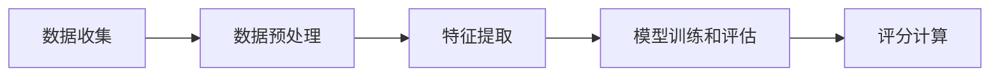

# AI驱动的公司治理评分系统：量化管理质量

> 关键词：AI、公司治理评分系统、量化管理、机器学习、数据分析、管理质量评估、企业决策

> 摘要：本文聚焦于AI驱动的公司治理评分系统，旨在深入探讨如何利用先进的人工智能技术实现公司管理质量的量化评估。首先介绍了该系统产生的背景，包括其目的、预期读者等内容。接着详细阐述了核心概念与联系，通过文本示意图和Mermaid流程图呈现其架构原理。在核心算法原理及具体操作步骤部分，使用Python源代码进行详细讲解。同时给出相关数学模型和公式，并举例说明。通过项目实战展示代码实际案例并进行详细解释。探讨了该系统的实际应用场景，推荐了相关学习资源、开发工具框架以及论文著作。最后总结了未来发展趋势与挑战，还提供了常见问题解答及扩展阅读与参考资料，为相关从业者和研究者提供全面而深入的技术指导和理论参考。

## 1. 背景介绍 
### 1.1 目的和范围
公司治理是企业发展的关键要素，有效的公司治理能够提升企业的竞争力、降低风险并保障股东利益。然而，传统的公司治理评估往往依赖于主观判断和定性分析，缺乏客观、准确的量化标准。AI驱动的公司治理评分系统的目的在于利用人工智能技术，对公司治理的各个方面进行全面、客观的量化评估，为投资者、监管机构和企业管理层提供科学的决策依据。

本系统的范围涵盖了公司治理的多个维度，包括董事会结构、股权结构、信息披露、内部控制等。通过收集和分析大量的公司数据，系统能够生成综合的治理评分，反映公司的管理质量和潜在风险。

### 1.2 预期读者
本文的预期读者包括金融从业者、企业管理人员、监管机构工作人员、学术研究人员以及对公司治理和人工智能技术感兴趣的人士。金融从业者可以利用该系统评估投资标的的治理风险，企业管理人员可以借助系统发现自身治理的不足之处并加以改进，监管机构可以依据系统评分加强对企业的监管，学术研究人员可以深入研究相关理论和技术，普通读者则可以了解公司治理量化评估的前沿知识。

### 1.3 文档结构概述
本文将按照以下结构展开：首先介绍AI驱动的公司治理评分系统的背景，包括目的、预期读者和文档结构概述等内容。接着阐述核心概念与联系，通过文本示意图和Mermaid流程图展示系统的架构原理。然后详细讲解核心算法原理及具体操作步骤，使用Python源代码进行说明。随后给出相关数学模型和公式，并举例说明。通过项目实战展示代码实际案例并进行详细解释。探讨系统的实际应用场景，推荐相关学习资源、开发工具框架以及论文著作。最后总结未来发展趋势与挑战，提供常见问题解答及扩展阅读与参考资料。

### 1.4 术语表
#### 1.4.1 核心术语定义
- **公司治理**：指通过一套包括正式或非正式的、内部或外部的制度或机制来协调公司与所有利益相关者之间的利益关系，以保证公司决策的科学性，从而最终维护公司各方面的利益。
- **AI（人工智能）**：是研究、开发用于模拟、延伸和扩展人的智能的理论、方法、技术及应用系统的一门新的技术科学。
- **量化管理**：是一种在管理中广泛应用的方法，通过对管理对象的各种属性进行数量化的分析和计算，以实现更科学、准确的管理决策。
- **公司治理评分系统**：利用各种数据和算法，对公司的治理状况进行综合评估，并给出相应评分的系统。

#### 1.4.2 相关概念解释
- **机器学习**：是一门多领域交叉学科，涉及概率论、统计学、逼近论、凸分析、算法复杂度理论等多门学科。它专门研究计算机怎样模拟或实现人类的学习行为，以获取新的知识或技能，重新组织已有的知识结构使之不断改善自身的性能。
- **数据分析**：是指用适当的统计分析方法对收集来的大量数据进行分析，提取有用信息和形成结论而对数据加以详细研究和概括总结的过程。

#### 1.4.3 缩略词列表
- **AI**：Artificial Intelligence（人工智能）
- **ML**：Machine Learning（机器学习）
- **PCA**：Principal Component Analysis（主成分分析）

## 2. 核心概念与联系 

### 核心概念原理
AI驱动的公司治理评分系统的核心原理是利用人工智能技术对公司治理相关的数据进行分析和挖掘，从而评估公司的管理质量。该系统主要基于机器学习算法，通过对历史数据的学习和训练，建立模型来预测公司的治理评分。

系统的数据来源广泛，包括公司的财务报表、公告、新闻报道、社交媒体信息等。这些数据包含了公司治理的各个方面的信息，如董事会成员的背景、股权结构的变化、信息披露的及时性等。

系统的主要流程包括数据收集、数据预处理、特征提取、模型训练和评估、评分计算等环节。首先，收集各种来源的数据；然后对数据进行清洗、转换和归一化等预处理操作；接着从预处理后的数据中提取有代表性的特征；使用这些特征对机器学习模型进行训练和评估；最后根据训练好的模型计算公司的治理评分。

### 文本示意图
```plaintext
|---------------------|
|  数据收集           |
|  (财务报表、公告等) |
|---------------------|
           |
           v
|---------------------|
|  数据预处理         |
|  (清洗、转换等)      |
|---------------------|
           |
           v
|---------------------|
|  特征提取           |
|  (选择有代表性特征) |
|---------------------|
           |
           v
|---------------------|
|  模型训练和评估     |
|  (机器学习模型)     |
|---------------------|
           |
           v
|---------------------|
|  评分计算           |
|  (得出公司治理评分) |
|---------------------|
```

### Mermaid流程图


## 3. 核心算法原理 & 具体操作步骤 

### 核心算法原理
本系统主要使用机器学习中的回归算法来计算公司治理评分。回归算法可以根据输入的特征预测一个连续的输出值，在这里，输出值就是公司的治理评分。常用的回归算法包括线性回归、决策树回归、随机森林回归等。

以线性回归为例，线性回归的基本模型可以表示为：

$$y = \beta_0 + \beta_1x_1 + \beta_2x_2 + \cdots + \beta_nx_n + \epsilon$$

其中，$y$ 是预测的公司治理评分，$x_1, x_2, \cdots, x_n$ 是输入的特征，$\beta_0, \beta_1, \cdots, \beta_n$ 是模型的系数，$\epsilon$ 是误差项。

线性回归的目标是找到一组最优的系数 $\beta_0, \beta_1, \cdots, \beta_n$，使得预测值与实际值之间的误差最小。通常使用最小二乘法来求解这个最优解。

### 具体操作步骤及Python源代码
以下是一个使用Python实现线性回归算法来计算公司治理评分的示例代码：

```python
import pandas as pd
from sklearn.model_selection import train_test_split
from sklearn.linear_model import LinearRegression
from sklearn.metrics import mean_squared_error

# 1. 数据收集和读取
# 假设数据存储在一个CSV文件中，文件名为 'company_data.csv'
data = pd.read_csv('company_data.csv')

# 2. 数据预处理
# 分离特征和目标变量
X = data.drop('governance_score', axis=1)  # 特征
y = data['governance_score']  # 目标变量（公司治理评分）

# 划分训练集和测试集
X_train, X_test, y_train, y_test = train_test_split(X, y, test_size=0.2, random_state=42)

# 3. 模型训练
# 创建线性回归模型
model = LinearRegression()

# 训练模型
model.fit(X_train, y_train)

# 4. 模型评估
# 在测试集上进行预测
y_pred = model.predict(X_test)

# 计算均方误差
mse = mean_squared_error(y_test, y_pred)
print(f"均方误差: {mse}")

# 5. 评分计算
# 假设我们有一个新的公司数据
new_company_data = pd.DataFrame({
    'feature1': [10],
    'feature2': [20],
    # 其他特征...
})

# 预测新公司的治理评分
new_score = model.predict(new_company_data)
print(f"新公司的治理评分: {new_score[0]}")
```

### 代码解释
1. **数据收集和读取**：使用 `pandas` 库读取存储在CSV文件中的公司数据。
2. **数据预处理**：分离特征和目标变量，然后使用 `train_test_split` 函数将数据划分为训练集和测试集。
3. **模型训练**：创建线性回归模型并使用训练集数据进行训练。
4. **模型评估**：在测试集上进行预测，并计算均方误差来评估模型的性能。
5. **评分计算**：对于新的公司数据，使用训练好的模型进行预测，得到新公司的治理评分。

## 4. 数学模型和公式 & 详细讲解 & 举例说明 

### 线性回归数学模型
线性回归的数学模型可以表示为：

$$y = \beta_0 + \beta_1x_1 + \beta_2x_2 + \cdots + \beta_nx_n + \epsilon$$

其中：
- $y$ 是因变量，即我们要预测的公司治理评分。
- $x_1, x_2, \cdots, x_n$ 是自变量，也就是输入的特征，例如董事会成员的平均年龄、股权集中度等。
- $\beta_0, \beta_1, \cdots, \beta_n$ 是模型的系数，$\beta_0$ 是截距，$\beta_1, \cdots, \beta_n$ 是各个特征的权重。
- $\epsilon$ 是误差项，代表模型无法解释的随机因素。

### 最小二乘法求解系数
线性回归的目标是找到一组最优的系数 $\beta_0, \beta_1, \cdots, \beta_n$，使得预测值与实际值之间的误差最小。通常使用最小二乘法来求解这个最优解。

最小二乘法的目标是最小化残差平方和（Residual Sum of Squares，RSS），残差平方和的计算公式为：

$$RSS = \sum_{i=1}^{m}(y_i - \hat{y}_i)^2$$

其中：
- $m$ 是样本数量。
- $y_i$ 是第 $i$ 个样本的实际值。
- $\hat{y}_i$ 是第 $i$ 个样本的预测值，$\hat{y}_i = \beta_0 + \beta_1x_{i1} + \beta_2x_{i2} + \cdots + \beta_nx_{in}$。

通过对 RSS 关于 $\beta_0, \beta_1, \cdots, \beta_n$ 求偏导数并令其等于 0，可以得到一组正规方程，解这个正规方程就可以得到最优的系数。

### 举例说明
假设我们有一个简单的线性回归问题，只有一个特征 $x$，数据集如下：

| $x$ | $y$ |
| --- | --- |
| 1 | 3 |
| 2 | 5 |
| 3 | 7 |

我们的线性回归模型为 $y = \beta_0 + \beta_1x + \epsilon$。

首先计算 RSS：

$$RSS = (3 - (\beta_0 + \beta_1\times1))^2 + (5 - (\beta_0 + \beta_1\times2))^2 + (7 - (\beta_0 + \beta_1\times3))^2$$

对 $\beta_0$ 和 $\beta_1$ 求偏导数并令其等于 0：

$$\frac{\partial RSS}{\partial \beta_0} = -2(3 - (\beta_0 + \beta_1\times1)) - 2(5 - (\beta_0 + \beta_1\times2)) - 2(7 - (\beta_0 + \beta_1\times3)) = 0$$

$$\frac{\partial RSS}{\partial \beta_1} = -2\times1\times(3 - (\beta_0 + \beta_1\times1)) - 2\times2\times(5 - (\beta_0 + \beta_1\times2)) - 2\times3\times(7 - (\beta_0 + \beta_1\times3)) = 0$$

解这个方程组可以得到 $\beta_0 = 1$，$\beta_1 = 2$。

所以回归方程为 $y = 1 + 2x$。

当 $x = 4$ 时，预测值 $\hat{y} = 1 + 2\times4 = 9$。

## 5. 项目实战：代码实际案例和详细解释说明 

### 5.1  开发环境搭建
#### 安装Python
首先，需要安装Python环境。可以从Python官方网站（https://www.python.org/downloads/） 下载适合自己操作系统的Python安装包，并按照安装向导进行安装。

#### 安装必要的库
使用 `pip` 命令安装项目所需的库，主要包括 `pandas`、`scikit-learn` 等。

```sh
pip install pandas scikit-learn
```

### 5.2  源代码详细实现和代码解读
以下是一个更完整的项目实战代码示例，包括数据处理、特征工程、模型训练和评估等步骤：

```python
import pandas as pd
from sklearn.model_selection import train_test_split
from sklearn.linear_model import LinearRegression
from sklearn.preprocessing import StandardScaler
from sklearn.metrics import mean_squared_error, r2_score
import numpy as np

# 1. 数据收集和读取
data = pd.read_csv('company_data.csv')

# 2. 数据预处理
# 检查缺失值
print(data.isnull().sum())

# 处理缺失值，这里简单地使用均值填充
data = data.fillna(data.mean())

# 分离特征和目标变量
X = data.drop('governance_score', axis=1)
y = data['governance_score']

# 3. 特征工程
# 标准化特征
scaler = StandardScaler()
X_scaled = scaler.fit_transform(X)

# 4. 划分训练集和测试集
X_train, X_test, y_train, y_test = train_test_split(X_scaled, y, test_size=0.2, random_state=42)

# 5. 模型训练
model = LinearRegression()
model.fit(X_train, y_train)

# 6. 模型评估
y_pred = model.predict(X_test)

# 计算均方误差和决定系数
mse = mean_squared_error(y_test, y_pred)
r2 = r2_score(y_test, y_pred)

print(f"均方误差: {mse}")
print(f"决定系数: {r2}")

# 7. 特征重要性分析
coefficients = model.coef_
feature_names = X.columns

feature_importance = pd.DataFrame({'feature': feature_names, 'coefficient': coefficients})
feature_importance = feature_importance.sort_values(by='coefficient', ascending=False)

print(feature_importance)
```

### 5.3  代码解读与分析
1. **数据收集和读取**：使用 `pandas` 库读取存储在CSV文件中的公司数据。
2. **数据预处理**：检查数据中的缺失值，并使用均值填充缺失值。分离特征和目标变量。
3. **特征工程**：使用 `StandardScaler` 对特征进行标准化处理，使得所有特征具有相同的尺度，有助于提高模型的性能。
4. **划分训练集和测试集**：使用 `train_test_split` 函数将数据划分为训练集和测试集，比例为 8:2。
5. **模型训练**：创建线性回归模型并使用训练集数据进行训练。
6. **模型评估**：在测试集上进行预测，计算均方误差和决定系数来评估模型的性能。均方误差衡量了预测值与实际值之间的平均误差，决定系数表示模型对数据的拟合程度。
7. **特征重要性分析**：通过查看线性回归模型的系数，分析各个特征对公司治理评分的影响程度。系数的绝对值越大，说明该特征对评分的影响越大。

## 6. 实际应用场景 
### 投资者决策
投资者可以利用AI驱动的公司治理评分系统评估潜在投资标的的治理质量。高评分的公司通常具有更完善的治理结构、更透明的信息披露和更低的风险，投资者可以更有信心地进行投资。例如，在股票投资中，投资者可以优先选择治理评分较高的公司股票，以降低投资风险并提高投资回报。

### 监管机构监管
监管机构可以使用该系统对企业进行全面、客观的监管。通过分析公司的治理评分，监管机构可以及时发现潜在的问题企业，加强对其的监管力度，促进企业规范治理。例如，对于治理评分较低的公司，监管机构可以要求其进行整改，并加强对其信息披露的审查。

### 企业自身管理
企业管理层可以借助该系统发现自身治理的不足之处，有针对性地进行改进。通过分析系统给出的评分和相关分析报告，企业可以了解自己在董事会结构、内部控制等方面存在的问题，从而采取相应的措施来提升管理质量。例如，如果系统显示企业的董事会独立性不足，企业可以调整董事会成员结构，增加外部独立董事的比例。

### 行业比较和 benchmarking
该系统可以用于对不同行业的公司治理情况进行比较和 benchmarking。通过分析不同行业公司的治理评分分布，企业可以了解自己在行业中的位置，学习行业内优秀企业的治理经验，从而提升自身的竞争力。例如，一个制造业企业可以与同行业的领先企业进行对比，找出差距并加以改进。

## 7. 工具和资源推荐
### 7.1 学习资源推荐
#### 7.1.1 书籍推荐
- 《Python机器学习》：本书详细介绍了Python在机器学习领域的应用，包括各种机器学习算法的原理和实现，适合初学者和有一定基础的读者。
- 《公司治理》：全面阐述了公司治理的理论和实践，包括董事会结构、股权结构、信息披露等方面的内容，对理解公司治理的基本概念和方法有很大帮助。
- 《机器学习实战》：通过大量的实际案例，介绍了机器学习的应用场景和实现方法，有助于读者将理论知识应用到实际项目中。

#### 7.1.2 在线课程
- Coursera上的“机器学习”课程：由斯坦福大学教授Andrew Ng主讲，是机器学习领域的经典课程，系统地介绍了机器学习的基本概念、算法和应用。
- edX上的“Python for Data Science”课程：介绍了Python在数据科学领域的应用，包括数据处理、数据分析和机器学习等方面的内容。
- 中国大学MOOC上的“公司治理理论与实务”课程：由国内知名学者授课，结合中国企业的实际情况，介绍了公司治理的理论和实践。

#### 7.1.3 技术博客和网站
- Medium：上面有很多关于人工智能、机器学习和公司治理的技术文章和案例分享，读者可以从中获取最新的技术动态和行业信息。
- Kaggle：是一个数据科学和机器学习的竞赛平台，上面有很多优秀的开源项目和代码示例，读者可以学习和参考。
- 中国上市公司协会官网：提供了大量关于上市公司治理的政策法规、研究报告和案例分析，对了解中国企业的公司治理情况有很大帮助。

### 7.2 开发工具框架推荐
#### 7.2.1 IDE和编辑器
- PyCharm：是一款专门为Python开发设计的集成开发环境，具有强大的代码编辑、调试和项目管理功能，适合专业的Python开发者。
- Jupyter Notebook：是一个交互式的开发环境，支持Python、R等多种编程语言，适合数据探索和快速原型开发。
- Visual Studio Code：是一款轻量级的代码编辑器，具有丰富的插件和扩展功能，支持多种编程语言，也可以用于Python开发。

#### 7.2.2 调试和性能分析工具
- PDB：是Python自带的调试器，可以帮助开发者定位代码中的问题和错误。
- cProfile：是Python的性能分析工具，可以分析代码的运行时间和函数调用情况，帮助开发者优化代码性能。
- Scikit-learn的GridSearchCV：可以用于模型参数的调优，通过网格搜索的方法找到最优的模型参数，提高模型的性能。

#### 7.2.3 相关框架和库
- Pandas：是Python中用于数据处理和分析的重要库，提供了高效的数据结构和数据操作方法，如数据读取、清洗、转换等。
- Scikit-learn：是Python中常用的机器学习库，提供了各种机器学习算法的实现，如线性回归、决策树、随机森林等，以及模型评估和选择的工具。
- TensorFlow：是一个开源的机器学习框架，广泛应用于深度学习领域，提供了强大的计算能力和分布式训练功能。

### 7.3 相关论文著作推荐
#### 7.3.1 经典论文
- Jensen, M. C., & Meckling, W. H. (1976). Theory of the firm: Managerial behavior, agency costs and ownership structure. Journal of Financial Economics, 3(4), 305-360. 该论文提出了代理理论，对公司治理的研究产生了深远的影响。
- Fama, E. F., & Jensen, M. C. (1983). Separation of ownership and control. Journal of Law and Economics, 26(2), 301-325. 探讨了公司所有权和控制权分离的问题，为公司治理的研究提供了重要的理论基础。

#### 7.3.2 最新研究成果
- 在学术数据库如Web of Science、IEEE Xplore等上搜索关于“AI-driven corporate governance”的最新研究论文，了解该领域的前沿动态和研究成果。

#### 7.3.3 应用案例分析
- 可以参考一些知名咨询公司的研究报告，如麦肯锡、波士顿咨询等，这些报告中通常包含了大量的公司治理案例分析和实践经验分享。

## 8. 总结：未来发展趋势与挑战
### 未来发展趋势
- **更智能化的算法应用**：随着人工智能技术的不断发展，未来的公司治理评分系统将采用更复杂、更智能化的算法，如深度学习、强化学习等。这些算法可以更好地处理复杂的非线性关系，提高评分的准确性和可靠性。
- **多源数据融合**：除了现有的财务报表、公告等数据来源，未来的系统将融合更多的多源数据，如社交媒体数据、物联网数据等。这些数据可以提供更全面、更及时的公司信息，有助于更准确地评估公司的治理质量。
- **实时监测和预警**：系统将实现对公司治理情况的实时监测和预警功能。一旦发现公司治理出现异常情况，系统可以及时发出警报，提醒投资者、监管机构和企业管理层采取相应的措施。
- **国际化和标准化**：随着全球经济一体化的发展，公司治理评分系统将逐渐实现国际化和标准化。不同国家和地区的公司治理评分标准将逐渐统一，方便全球投资者进行比较和决策。

### 挑战
- **数据质量和隐私问题**：数据质量是影响系统准确性的关键因素。目前，公司数据存在不完整、不准确、不一致等问题，需要进行大量的数据清洗和预处理工作。同时，数据隐私问题也越来越受到关注，如何在保护数据隐私的前提下，充分利用数据进行分析和评估是一个亟待解决的问题。
- **算法可解释性**：一些复杂的人工智能算法，如深度学习算法，往往是黑盒模型，其决策过程难以解释。在公司治理评分系统中，算法的可解释性非常重要，投资者、监管机构和企业管理层需要了解评分的依据和过程。因此，如何提高算法的可解释性是一个挑战。
- **法律法规和监管政策**：AI驱动的公司治理评分系统的发展需要相应的法律法规和监管政策的支持。目前，相关的法律法规和监管政策还不完善，需要进一步制定和完善，以规范系统的开发和应用。
- **人才短缺**：开发和应用AI驱动的公司治理评分系统需要既懂人工智能技术又懂公司治理的复合型人才。目前，这类人才短缺，需要加强相关的人才培养和引进。

## 9. 附录：常见问题与解答
### 问题1：如何选择合适的特征用于公司治理评分系统？
答：选择合适的特征需要综合考虑多个因素。首先，要基于公司治理的理论和实践，选择与公司治理密切相关的特征，如董事会结构、股权结构、信息披露等。其次，可以使用特征选择算法，如相关性分析、主成分分析等，筛选出对评分影响较大的特征。此外，还可以结合领域专家的意见，确定最终的特征集合。

### 问题2：如何评估公司治理评分系统的准确性？
答：可以使用多种指标来评估系统的准确性，如均方误差、决定系数、平均绝对误差等。均方误差衡量了预测值与实际值之间的平均误差，决定系数表示模型对数据的拟合程度。此外，还可以进行交叉验证，将数据集划分为多个子集，分别进行训练和测试，以提高评估的准确性。

### 问题3：公司治理评分系统的评分结果是否具有绝对的权威性？
答：公司治理评分系统的评分结果是基于一定的算法和数据得出的，具有一定的参考价值，但不具有绝对的权威性。评分结果受到数据质量、算法选择、模型参数等多种因素的影响，可能存在一定的误差。因此，在使用评分结果时，需要结合其他信息进行综合判断。

### 问题4：如何确保公司治理评分系统的公正性和客观性？
答：为了确保系统的公正性和客观性，需要从多个方面入手。首先，要保证数据的真实性、完整性和准确性，避免数据造假和人为干预。其次，要选择合适的算法和模型，避免算法偏差和过拟合。此外，还需要建立严格的审核和监督机制，对系统的开发、运行和评估进行全程监督。

## 10. 扩展阅读 & 参考资料
### 扩展阅读
- 《人工智能时代的公司治理变革》：探讨了人工智能技术对公司治理的影响和变革趋势，为进一步了解该领域提供了新的视角。
- 《数据驱动的企业决策》：介绍了如何利用数据进行企业决策，对理解公司治理评分系统在企业决策中的应用有很大帮助。

### 参考资料
- 相关的学术论文和研究报告，如发表在《Journal of Financial Economics》、《Journal of Law and Economics》等学术期刊上的论文。
- 行业协会和监管机构发布的政策文件和统计数据，如中国上市公司协会发布的相关报告。
- 开源项目和代码库，如Kaggle上的相关项目，为代码实现提供了参考和借鉴。