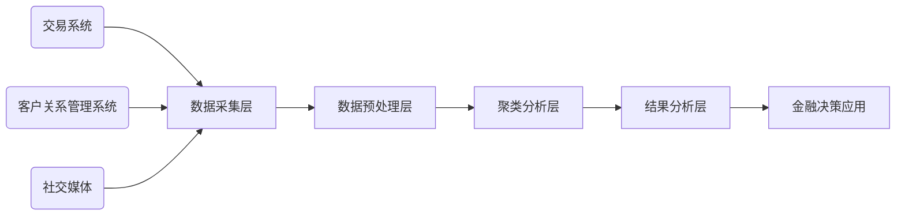

# AI驱动的投资者行为模式聚类

> 关键词：AI、投资者行为模式、聚类分析、数据挖掘、机器学习、金融科技、行为金融学

> 摘要：本文聚焦于AI驱动的投资者行为模式聚类这一前沿领域。随着金融市场的不断发展和数据量的爆炸式增长，传统方法在分析投资者行为模式时面临诸多挑战。AI技术的兴起为解决这一问题提供了新的思路和方法。文章首先介绍了研究的背景、目的、预期读者等内容，接着阐述了核心概念与联系，详细讲解了核心算法原理及具体操作步骤，包括使用Python代码进行实现。同时，给出了相关的数学模型和公式，并通过举例进行说明。在项目实战部分，展示了开发环境搭建、源代码实现与解读。还探讨了实际应用场景，推荐了相关的工具和资源。最后总结了未来发展趋势与挑战，提供了常见问题解答和扩展阅读参考资料，旨在为深入理解和应用AI驱动的投资者行为模式聚类提供全面且深入的指导。

## 1. 背景介绍 
### 1.1 目的和范围
在金融市场中，投资者的行为模式复杂多样，且受到多种因素的影响。了解投资者的行为模式对于金融机构制定营销策略、风险评估以及市场监管等方面都具有重要意义。传统的分析方法往往基于有限的样本和简单的统计指标，难以全面、准确地捕捉投资者的行为特征。本研究的目的在于利用AI技术，特别是聚类分析算法，对投资者的行为数据进行深入挖掘，将投资者划分为不同的行为模式类别，从而为金融决策提供更有价值的信息。

本研究的范围涵盖了各种类型的投资者行为数据，包括交易数据、持仓数据、风险偏好数据等。同时，将研究重点放在常见的AI聚类算法在投资者行为模式分析中的应用，以及如何通过这些算法发现有意义的行为模式类别。

### 1.2 预期读者
本文的预期读者包括金融行业的从业者，如投资顾问、风险分析师、市场研究员等，他们可以通过本文了解如何利用AI技术更好地理解投资者行为，从而改进业务决策。同时，对于计算机科学领域的研究人员和开发者，特别是对机器学习、数据挖掘在金融领域应用感兴趣的人员，本文提供了一个具体的应用案例和技术实现细节。此外，金融专业的学生和对金融科技有兴趣的爱好者也可以从本文中获取相关知识和启发。

### 1.3 文档结构概述
本文将按照以下结构进行组织：首先介绍研究的背景信息，包括目的、预期读者和文档结构概述等。接着阐述与投资者行为模式聚类相关的核心概念及其联系，并通过文本示意图和Mermaid流程图进行说明。然后详细讲解核心算法原理和具体操作步骤，使用Python代码进行实现。之后给出相关的数学模型和公式，并进行详细讲解和举例说明。在项目实战部分，介绍开发环境搭建、源代码实现和代码解读。再探讨投资者行为模式聚类的实际应用场景。随后推荐相关的工具和资源，包括学习资源、开发工具框架和相关论文著作。最后总结未来发展趋势与挑战，提供常见问题解答和扩展阅读参考资料。

### 1.4 术语表
#### 1.4.1 核心术语定义
- **投资者行为模式**：指投资者在金融市场中的交易、持仓、风险偏好等行为所表现出的相对稳定的特征和规律。
- **聚类分析**：是一种无监督学习算法，旨在将数据集中的对象划分为不同的组（簇），使得同一组内的对象具有较高的相似性，不同组间的对象具有较高的差异性。
- **AI（人工智能）**：是指计算机系统能够执行通常需要人类智能才能完成的任务，如学习、推理、问题解决等。
- **数据挖掘**：是从大量的数据中发现有价值信息和知识的过程。
- **行为金融学**：是将心理学、社会学等学科的理论和方法应用于金融市场研究，研究投资者的决策过程和行为偏差。

#### 1.4.2 相关概念解释
- **无监督学习**：是机器学习的一种类型，与有监督学习不同，无监督学习不需要标记好的训练数据，而是通过数据本身的特征和结构来发现数据中的模式和规律。
- **相似性度量**：在聚类分析中，用于衡量对象之间的相似程度的指标，常见的相似性度量包括欧几里得距离、曼哈顿距离、余弦相似度等。
- **簇**：聚类分析的结果，是一组具有相似特征的对象的集合。

#### 1.4.3 缩略词列表
- **AI**：Artificial Intelligence（人工智能）
- **K-Means**：K均值聚类算法（K-Means Clustering Algorithm）
- **DBSCAN**：基于密度的空间聚类应用（Density-Based Spatial Clustering of Applications with Noise）
- **PCA**：主成分分析（Principal Component Analysis）

## 2. 核心概念与联系 

### 核心概念原理
投资者行为模式聚类的核心概念主要围绕投资者行为数据、聚类分析算法和AI技术展开。

投资者行为数据是进行聚类分析的基础，它包含了投资者在金融市场中的各种行为信息，如交易频率、交易金额、持仓时间、风险偏好等。这些数据可以从金融机构的交易系统、客户关系管理系统等数据源中获取。

聚类分析算法是实现投资者行为模式聚类的关键工具。常见的聚类算法包括K-Means算法、DBSCAN算法、层次聚类算法等。这些算法的基本原理是通过计算数据对象之间的相似性，将相似的对象划分到同一个簇中。

AI技术为投资者行为模式聚类提供了更强大的计算能力和数据分析方法。例如，深度学习算法可以用于对投资者行为数据进行特征提取和降维，提高聚类分析的效率和准确性。

### 架构的文本示意图
投资者行为模式聚类的架构可以分为以下几个主要部分：

1. **数据采集层**：负责从各种数据源中采集投资者行为数据，包括交易系统、客户关系管理系统、社交媒体等。
2. **数据预处理层**：对采集到的原始数据进行清洗、转换和特征提取等操作，以提高数据的质量和可用性。
3. **聚类分析层**：使用聚类算法对预处理后的数据进行聚类，将投资者划分为不同的行为模式类别。
4. **结果分析层**：对聚类结果进行分析和解释，挖掘不同行为模式类别的特征和规律，并将结果应用于金融决策。

### Mermaid流程图


## 3. 核心算法原理 & 具体操作步骤 

### K-Means算法原理
K-Means算法是一种基于距离的聚类算法，其基本思想是通过迭代的方式将数据点划分为K个簇，使得每个簇内的数据点到该簇中心的距离之和最小。

具体步骤如下：
1. **初始化**：随机选择K个数据点作为初始的簇中心。
2. **分配数据点**：计算每个数据点到K个簇中心的距离，将数据点分配到距离最近的簇中。
3. **更新簇中心**：计算每个簇内数据点的平均值，将该平均值作为新的簇中心。
4. **重复步骤2和3**：直到簇中心不再发生变化或达到最大迭代次数。

### Python代码实现
```python
import numpy as np
from sklearn.cluster import KMeans
import matplotlib.pyplot as plt

# 生成示例数据
np.random.seed(42)
X = np.vstack([
    np.random.normal(loc=[0, 0], scale=1, size=(100, 2)),
    np.random.normal(loc=[5, 5], scale=1, size=(100, 2)),
    np.random.normal(loc=[10, 0], scale=1, size=(100, 2))
])

# 使用K-Means算法进行聚类
kmeans = KMeans(n_clusters=3, random_state=42)
kmeans.fit(X)

# 获取聚类结果
labels = kmeans.labels_
centroids = kmeans.cluster_centers_

# 可视化聚类结果
plt.scatter(X[:, 0], X[:, 1], c=labels, cmap='viridis')
plt.scatter(centroids[:, 0], centroids[:, 1], marker='X', s=200, c='red')
plt.title('K-Means Clustering')
plt.xlabel('Feature 1')
plt.ylabel('Feature 2')
plt.show()
```

### 代码解释
1. **数据生成**：使用`np.random.normal`函数生成三组不同均值和标准差的二维数据点。
2. **K-Means模型创建**：使用`KMeans`类创建一个K-Means模型，指定簇的数量为3。
3. **模型训练**：使用`fit`方法对数据进行训练，得到聚类结果。
4. **聚类结果获取**：使用`labels_`属性获取每个数据点的簇标签，使用`cluster_centers_`属性获取每个簇的中心。
5. **可视化**：使用`matplotlib`库将聚类结果可视化，不同颜色的点表示不同的簇，红色的`X`表示簇中心。

### DBSCAN算法原理
DBSCAN算法是一种基于密度的聚类算法，其基本思想是通过定义数据点的密度来识别簇和噪声点。

具体步骤如下：
1. **定义参数**：定义邻域半径`eps`和最小点数`min_samples`。
2. **计算密度**：对于每个数据点，计算其在邻域半径`eps`内的点数。
3. **标记核心点、边界点和噪声点**：如果一个数据点的邻域内点数大于等于`min_samples`，则该点为核心点；如果一个数据点不是核心点，但在某个核心点的邻域内，则该点为边界点；否则，该点为噪声点。
4. **构建簇**：从一个核心点开始，将其邻域内的所有核心点和边界点合并为一个簇，直到所有核心点都被访问过。

### Python代码实现
```python
from sklearn.cluster import DBSCAN
from sklearn.preprocessing import StandardScaler

# 数据标准化
X_scaled = StandardScaler().fit_transform(X)

# 使用DBSCAN算法进行聚类
dbscan = DBSCAN(eps=0.3, min_samples=5)
dbscan.fit(X_scaled)

# 获取聚类结果
labels = dbscan.labels_

# 可视化聚类结果
plt.scatter(X_scaled[:, 0], X_scaled[:, 1], c=labels, cmap='viridis')
plt.title('DBSCAN Clustering')
plt.xlabel('Feature 1')
plt.ylabel('Feature 2')
plt.show()
```

### 代码解释
1. **数据标准化**：使用`StandardScaler`类对数据进行标准化处理，以消除不同特征之间的量纲差异。
2. **DBSCAN模型创建**：使用`DBSCAN`类创建一个DBSCAN模型，指定邻域半径`eps`为0.3，最小点数`min_samples`为5。
3. **模型训练**：使用`fit`方法对数据进行训练，得到聚类结果。
4. **聚类结果获取**：使用`labels_`属性获取每个数据点的簇标签。
5. **可视化**：使用`matplotlib`库将聚类结果可视化，不同颜色的点表示不同的簇，噪声点用-1表示。

## 4. 数学模型和公式 & 详细讲解 & 举例说明 

### K-Means算法的数学模型和公式
K-Means算法的目标是最小化以下目标函数：

$$
J = \sum_{i=1}^{n} \sum_{j=1}^{k} r_{ij} \left\lVert x_i - \mu_j \right\rVert^2
$$

其中，$n$ 是数据点的数量，$k$ 是簇的数量，$x_i$ 是第 $i$ 个数据点，$\mu_j$ 是第 $j$ 个簇的中心，$r_{ij}$ 是一个指示变量，如果数据点 $x_i$ 属于簇 $j$，则 $r_{ij} = 1$，否则 $r_{ij} = 0$。

### 详细讲解
目标函数 $J$ 表示所有数据点到其所属簇中心的距离的平方和。K-Means算法通过迭代的方式不断更新簇中心，使得目标函数 $J$ 逐渐减小，直到收敛。

### 举例说明
假设我们有三个数据点 $x_1 = [1, 2]$，$x_2 = [3, 4]$，$x_3 = [5, 6]$，初始的簇中心为 $\mu_1 = [0, 0]$，$\mu_2 = [10, 10]$。

1. **计算距离**：
   - 计算 $x_1$ 到 $\mu_1$ 的距离：$\left\lVert x_1 - \mu_1 \right\rVert^2 = (1 - 0)^2 + (2 - 0)^2 = 5$
   - 计算 $x_1$ 到 $\mu_2$ 的距离：$\left\lVert x_1 - \mu_2 \right\rVert^2 = (1 - 10)^2 + (2 - 10)^2 = 81 + 64 = 145$
   - 由于 $5 < 145$，所以 $x_1$ 属于簇 1，即 $r_{11} = 1$，$r_{12} = 0$。

   - 同理，计算 $x_2$ 和 $x_3$ 到 $\mu_1$ 和 $\mu_2$ 的距离，确定它们所属的簇。

2. **更新簇中心**：
   - 假设 $x_1$ 和 $x_2$ 属于簇 1，$x_3$ 属于簇 2。
   - 簇 1 的新中心：$\mu_1 = \frac{x_1 + x_2}{2} = \left[\frac{1 + 3}{2}, \frac{2 + 4}{2}\right] = [2, 3]$
   - 簇 2 的新中心：$\mu_2 = x_3 = [5, 6]$

3. **重复步骤1和2**：直到簇中心不再发生变化或达到最大迭代次数。

### DBSCAN算法的数学模型和公式
DBSCAN算法主要基于数据点的密度来进行聚类，其核心概念是邻域和密度。

- **邻域**：对于数据点 $x_i$，其 $\epsilon$-邻域定义为：

$$
N_{\epsilon}(x_i) = \{ x_j \in D : \left\lVert x_i - x_j \right\rVert \leq \epsilon \}
$$

其中，$D$ 是数据集，$\epsilon$ 是邻域半径。

- **密度**：数据点 $x_i$ 的密度定义为其 $\epsilon$-邻域内的点数：

$$
\rho(x_i) = \left| N_{\epsilon}(x_i) \right|
$$

### 详细讲解
DBSCAN算法通过判断数据点的密度来识别核心点、边界点和噪声点。如果一个数据点的密度大于等于最小点数 `min_samples`，则该点为核心点；如果一个数据点不是核心点，但在某个核心点的邻域内，则该点为边界点；否则，该点为噪声点。

### 举例说明
假设我们有一个二维数据集 $D = \{x_1, x_2, x_3, x_4, x_5\}$，邻域半径 $\epsilon = 1$，最小点数 `min_samples` = 3。

1. **计算邻域和密度**：
   - 对于 $x_1$，计算其 $\epsilon$-邻域 $N_{\epsilon}(x_1)$，并计算其密度 $\rho(x_1)$。
   - 同理，计算其他数据点的邻域和密度。

2. **标记核心点、边界点和噪声点**：
   - 如果 $\rho(x_i) \geq 3$，则 $x_i$ 为核心点。
   - 如果 $\rho(x_i) < 3$ 且 $x_i$ 在某个核心点的邻域内，则 $x_i$ 为边界点。
   - 否则，$x_i$ 为噪声点。

3. **构建簇**：
   - 从一个核心点开始，将其邻域内的所有核心点和边界点合并为一个簇，直到所有核心点都被访问过。

## 5. 项目实战：代码实际案例和详细解释说明 

### 5.1  开发环境搭建
#### 安装Python
首先，确保你已经安装了Python。可以从Python官方网站（https://www.python.org/downloads/）下载适合你操作系统的Python版本。建议安装Python 3.6及以上版本。

#### 安装必要的库
在命令行中使用以下命令安装必要的库：
```sh
pip install numpy pandas scikit-learn matplotlib
```

- `numpy`：用于数值计算和数组操作。
- `pandas`：用于数据处理和分析。
- `scikit-learn`：提供了各种机器学习算法和工具。
- `matplotlib`：用于数据可视化。

### 5.2  源代码详细实现和代码解读
#### 数据准备
假设我们有一个包含投资者交易数据的CSV文件 `investor_data.csv`，文件包含以下列：`交易频率`、`交易金额`、`持仓时间`、`风险偏好`。

```python
import pandas as pd

# 读取数据
data = pd.read_csv('investor_data.csv')

# 提取特征
features = data[['交易频率', '交易金额', '持仓时间', '风险偏好']]

# 数据标准化
from sklearn.preprocessing import StandardScaler
scaler = StandardScaler()
scaled_features = scaler.fit_transform(features)
```

#### 代码解读
1. **读取数据**：使用`pandas`库的`read_csv`函数读取CSV文件中的数据。
2. **提取特征**：从数据中提取我们感兴趣的特征列。
3. **数据标准化**：使用`StandardScaler`类对特征数据进行标准化处理，以消除不同特征之间的量纲差异。

#### 聚类分析
```python
# 使用K-Means算法进行聚类
from sklearn.cluster import KMeans

kmeans = KMeans(n_clusters=4, random_state=42)
kmeans.fit(scaled_features)

# 获取聚类结果
labels = kmeans.labels_

# 将聚类结果添加到原始数据中
data['聚类标签'] = labels
```

#### 代码解读
1. **K-Means模型创建**：使用`KMeans`类创建一个K-Means模型，指定簇的数量为4。
2. **模型训练**：使用`fit`方法对标准化后的特征数据进行训练，得到聚类结果。
3. **聚类结果获取**：使用`labels_`属性获取每个数据点的簇标签。
4. **结果添加**：将聚类结果添加到原始数据中，方便后续分析。

#### 结果分析
```python
# 分析每个簇的特征
cluster_analysis = data.groupby('聚类标签').mean()
print(cluster_analysis)

# 可视化聚类结果
import matplotlib.pyplot as plt
from mpl_toolkits.mplot3d import Axes3D

fig = plt.figure()
ax = fig.add_subplot(111, projection='3d')
ax.scatter(scaled_features[:, 0], scaled_features[:, 1], scaled_features[:, 2], c=labels, cmap='viridis')
ax.set_xlabel('交易频率')
ax.set_ylabel('交易金额')
ax.set_zlabel('持仓时间')
plt.show()
```

#### 代码解读
1. **簇特征分析**：使用`groupby`方法按聚类标签对数据进行分组，并计算每个簇的特征均值，以便了解每个簇的特征特点。
2. **可视化**：使用`matplotlib`库的`3D`绘图功能将聚类结果可视化，不同颜色的点表示不同的簇。

### 5.3  代码解读与分析
#### 数据准备阶段
数据准备是整个项目的基础，通过读取CSV文件和提取特征，我们得到了用于聚类分析的数据集。数据标准化是一个重要的步骤，它可以确保不同特征在聚类分析中具有相同的权重，避免某些特征因为数值范围较大而对聚类结果产生过大的影响。

#### 聚类分析阶段
K-Means算法是一种简单而有效的聚类算法，通过指定簇的数量，我们可以将投资者划分为不同的行为模式类别。在实际应用中，簇的数量需要根据具体情况进行调整，可以使用肘部法则等方法来确定最优的簇数量。

#### 结果分析阶段
通过对每个簇的特征进行分析，我们可以了解不同行为模式类别的投资者的特点。例如，某个簇的投资者可能具有较高的交易频率和较低的持仓时间，这可能表示他们是短线交易者。可视化聚类结果可以帮助我们更直观地观察不同簇之间的分布情况，发现数据中的潜在模式。

## 6. 实际应用场景 
### 金融机构营销策略制定
金融机构可以根据投资者的行为模式聚类结果，制定个性化的营销策略。例如，对于高风险偏好、高交易频率的投资者，可以推荐一些高收益、高风险的金融产品和投资策略；对于低风险偏好、长期持仓的投资者，可以推荐一些稳健的理财产品和长期投资计划。通过个性化的营销，可以提高客户的满意度和忠诚度，增加金融机构的业务收入。

### 风险评估与管理
投资者的行为模式与风险偏好密切相关。通过聚类分析，可以将投资者划分为不同的风险类型，如保守型、稳健型、激进型等。金融机构可以根据投资者的风险类型，对其投资组合进行风险评估和管理。例如，对于激进型投资者，金融机构可以加强风险监测，及时提醒投资者注意风险；对于保守型投资者，可以提供一些低风险的投资建议和风险控制措施。

### 市场监管
监管机构可以利用投资者行为模式聚类结果，监测市场的异常行为和潜在风险。例如，如果某个簇的投资者在短时间内大量买入或卖出同一种金融产品，可能存在操纵市场的嫌疑，监管机构可以及时进行调查和处理。此外，通过对投资者行为模式的长期跟踪和分析，监管机构可以了解市场的发展趋势和投资者的行为变化，为制定相关政策提供参考。

### 投资者教育
投资者行为模式聚类结果可以帮助投资者更好地了解自己的投资行为和风险偏好。金融机构可以根据聚类结果，为投资者提供个性化的投资教育和培训服务。例如，对于缺乏投资经验的投资者，可以提供一些基础知识和投资技巧的培训；对于风险偏好较高的投资者，可以提醒他们注意风险控制和资产配置。通过投资者教育，可以提高投资者的投资水平和风险意识，促进金融市场的健康发展。

## 7. 工具和资源推荐
### 7.1 学习资源推荐
#### 7.1.1 书籍推荐
- 《Python机器学习》（Sebastian Raschka著）：这本书详细介绍了Python在机器学习中的应用，包括各种机器学习算法的原理和实现，适合初学者和有一定基础的读者。
- 《数据挖掘：概念与技术》（Jiawei Han等著）：这本书是数据挖掘领域的经典教材，系统地介绍了数据挖掘的基本概念、算法和应用，对于深入理解投资者行为模式聚类有很大的帮助。
- 《行为金融学》（饶育蕾等著）：这本书介绍了行为金融学的基本理论和方法，以及投资者的行为偏差和决策过程，为理解投资者行为模式提供了理论基础。

#### 7.1.2 在线课程
- Coursera上的“机器学习”课程（Andrew Ng教授）：这是一门非常经典的机器学习课程，通过视频讲解、编程作业和考试等方式，帮助学习者系统地掌握机器学习的基本概念和算法。
- edX上的“数据科学微硕士项目”：该项目包含多个与数据科学相关的课程，包括数据挖掘、机器学习、深度学习等，适合想要深入学习数据科学的学习者。
- 中国大学MOOC上的“金融数据分析与挖掘”课程：该课程结合金融领域的实际案例，介绍了数据分析和挖掘的方法和应用，对于理解投资者行为模式聚类在金融领域的应用有很大的帮助。

#### 7.1.3 技术博客和网站
- 机器学习算法全栈工程师（https://www.ai-start.com/）：该网站提供了丰富的机器学习教程和资源，包括算法原理、代码实现、案例分析等，适合机器学习爱好者和开发者。
- 数据派THU（https://www.datapi.cn/）：该网站专注于数据科学和人工智能领域的资讯和技术分享，提供了很多关于数据挖掘、机器学习在金融领域应用的文章和案例。
- Kaggle（https://www.kaggle.com/）：这是一个全球知名的数据科学竞赛平台，上面有很多与金融数据分析和机器学习相关的竞赛和数据集，可以通过参与竞赛和学习他人的解决方案来提高自己的技术水平。

### 7.2 开发工具框架推荐
#### 7.2.1 IDE和编辑器
- PyCharm：这是一款专门为Python开发设计的集成开发环境（IDE），提供了丰富的功能和插件，如代码自动补全、调试、版本控制等，适合专业的Python开发者。
- Jupyter Notebook：这是一个交互式的开发环境，支持多种编程语言，如Python、R等。通过Jupyter Notebook，你可以方便地进行数据探索、分析和可视化，非常适合数据科学和机器学习项目的开发。
- Visual Studio Code：这是一款轻量级的代码编辑器，支持多种编程语言和插件。它具有简洁的界面和强大的功能，如代码高亮、调试、版本控制等，适合初学者和快速开发。

#### 7.2.2 调试和性能分析工具
- pdb：这是Python自带的调试器，可以帮助你在代码中设置断点、查看变量值等，进行代码调试。
- cProfile：这是Python的性能分析工具，可以帮助你分析代码的运行时间和函数调用情况，找出性能瓶颈。
- Scikit-learn的GridSearchCV：这是Scikit-learn库中的一个工具，用于超参数调优。通过GridSearchCV，你可以自动搜索最优的超参数组合，提高模型的性能。

#### 7.2.3 相关框架和库
- Scikit-learn：这是一个强大的Python机器学习库，提供了各种机器学习算法和工具，如分类、回归、聚类、降维等。它具有简单易用、文档丰富等特点，适合初学者和有一定基础的开发者。
- TensorFlow：这是一个开源的深度学习框架，由Google开发。它提供了丰富的深度学习模型和工具，如神经网络、卷积神经网络、循环神经网络等，适合处理复杂的机器学习任务。
- PyTorch：这是另一个流行的深度学习框架，由Facebook开发。它具有动态图、易于调试等特点，在学术界和工业界都有广泛的应用。

### 7.3 相关论文著作推荐
#### 7.3.1 经典论文
- “k-Means++: The Advantages of Careful Seeding”（David Arthur和Sergei Vassilvitskii著）：这篇论文提出了K-Means++算法，改进了K-Means算法的初始中心选择方法，提高了算法的性能和稳定性。
- “A Density-Based Algorithm for Discovering Clusters in Large Spatial Databases with Noise”（Martin Ester等著）：这篇论文提出了DBSCAN算法，是基于密度的聚类算法的经典之作，具有抗噪声能力强、能发现任意形状的簇等优点。
- “Behavioral Finance: A Survey of Theory and Evidence”（Nicholas Barberis和Richard Thaler著）：这篇论文对行为金融学的理论和实证研究进行了全面的综述，为理解投资者的行为偏差和决策过程提供了重要的参考。

#### 7.3.2 最新研究成果
- 在顶级金融期刊如《Journal of Finance》、《Review of Financial Studies》等上发表的关于投资者行为模式和金融市场的研究论文。
- 在顶级机器学习会议如NeurIPS、ICML、CVPR等上发表的关于聚类算法和数据分析的研究论文。

#### 7.3.3 应用案例分析
- 金融机构发布的关于投资者行为分析和风险管理的报告和案例研究。
- Kaggle上的金融数据分析竞赛的优秀解决方案和案例分享。

## 8. 总结：未来发展趋势与挑战
### 未来发展趋势
#### 多源数据融合
未来，投资者行为模式聚类将不仅仅依赖于传统的交易数据和持仓数据，还将融合更多来源的数据，如社交媒体数据、新闻资讯数据、宏观经济数据等。通过多源数据的融合，可以更全面、准确地了解投资者的行为模式和决策过程。

#### 深度学习的应用
深度学习在图像识别、自然语言处理等领域取得了巨大的成功，未来也将在投资者行为模式聚类中得到更广泛的应用。例如，使用深度学习模型对投资者的文本信息进行情感分析，提取投资者的情绪和偏好，从而更好地理解投资者的行为模式。

#### 实时分析与动态聚类
随着金融市场的快速变化，投资者的行为模式也在不断变化。未来，投资者行为模式聚类将更加注重实时分析和动态聚类，能够及时捕捉投资者行为的变化，为金融决策提供更及时、准确的信息。

#### 跨领域应用
投资者行为模式聚类的研究成果将不仅仅应用于金融领域，还将拓展到其他领域，如市场营销、客户关系管理等。通过将投资者行为模式聚类的方法和技术应用到其他领域，可以为这些领域的决策提供新的思路和方法。

### 挑战
#### 数据质量和隐私问题
多源数据的融合带来了数据质量和隐私问题。不同来源的数据可能存在格式不一致、噪声数据、缺失值等问题，需要进行有效的数据清洗和预处理。同时，投资者的个人信息和交易数据涉及隐私问题，需要在保证数据安全和隐私的前提下进行分析和挖掘。

#### 算法复杂度和可解释性
深度学习模型等复杂算法在提高聚类准确性的同时，也带来了算法复杂度和可解释性的问题。复杂的算法可能需要大量的计算资源和时间，并且难以解释模型的决策过程。在实际应用中，需要在算法复杂度和可解释性之间找到平衡。

#### 市场环境变化的适应性
金融市场环境是不断变化的，投资者的行为模式也会随之变化。如何使聚类算法能够适应市场环境的变化，及时调整聚类结果，是一个亟待解决的问题。

#### 伦理和法律问题
投资者行为模式聚类的研究和应用可能涉及伦理和法律问题，如算法歧视、数据滥用等。需要建立相应的伦理和法律规范，确保投资者行为模式聚类的研究和应用在合法、合规、道德的框架内进行。

## 9. 附录：常见问题与解答
### 1. 如何选择合适的聚类算法？
选择合适的聚类算法需要考虑多个因素，如数据的特点、聚类的目的、算法的复杂度等。如果数据具有明显的簇结构，且簇的形状近似球形，可以选择K-Means算法；如果数据中存在噪声点，且簇的形状不规则，可以选择DBSCAN算法；如果需要了解数据的层次结构，可以选择层次聚类算法。

### 2. 如何确定聚类的簇数量？
确定聚类的簇数量是一个比较困难的问题，常见的方法有肘部法则、轮廓系数法等。肘部法则是通过绘制不同簇数量下的目标函数值（如K-Means算法的目标函数）与簇数量的关系曲线，找到曲线的“肘部”，即目标函数值下降速度明显减缓的点，该点对应的簇数量即为最优的簇数量。轮廓系数法是通过计算每个数据点的轮廓系数，评估聚类结果的质量，选择轮廓系数最大的簇数量作为最优的簇数量。

### 3. 数据标准化的作用是什么？
数据标准化的作用是消除不同特征之间的量纲差异，确保每个特征在聚类分析中具有相同的权重。如果不进行数据标准化，某些特征可能因为数值范围较大而对聚类结果产生过大的影响，导致聚类结果不准确。

### 4. 聚类结果如何解释？
聚类结果的解释需要结合具体的业务背景和数据特点。可以通过分析每个簇的特征均值、中位数等统计量，了解每个簇的特征特点。同时，可以观察不同簇之间的差异，找出不同行为模式类别的投资者的特点。例如，某个簇的投资者可能具有较高的交易频率和较低的持仓时间，这可能表示他们是短线交易者。

### 5. 如何评估聚类结果的质量？
评估聚类结果的质量可以使用多种指标，如轮廓系数、Calinski-Harabasz指数、Davies-Bouldin指数等。轮廓系数衡量了每个数据点与其所属簇的紧密程度以及与其他簇的分离程度，取值范围为[-1, 1]，值越接近1表示聚类效果越好。Calinski-Harabasz指数衡量了簇间的离散程度和簇内的紧凑程度，值越大表示聚类效果越好。Davies-Bouldin指数衡量了簇间的相似度，值越小表示聚类效果越好。

## 10. 扩展阅读 & 参考资料
### 扩展阅读
- 《金融市场中的行为偏差与决策》：深入探讨了投资者在金融市场中的行为偏差和决策过程，对于理解投资者行为模式具有重要的参考价值。
- 《机器学习实战》：通过实际案例介绍了机器学习算法的应用，包括聚类算法、分类算法、回归算法等，适合想要通过实践学习机器学习的读者。
- 《深度学习入门：基于Python的理论与实现》：详细介绍了深度学习的基本理论和Python实现，对于想要了解深度学习在投资者行为模式聚类中应用的读者有很大的帮助。

### 参考资料
- Scikit-learn官方文档（https://scikit-learn.org/stable/）：提供了Scikit-learn库的详细文档和教程，包括各种机器学习算法的使用方法和示例代码。
- Python官方文档（https://docs.python.org/3/）：提供了Python语言的详细文档和教程，对于学习Python编程有很大的帮助。
- Matplotlib官方文档（https://matplotlib.org/）：提供了Matplotlib库的详细文档和教程，包括各种绘图函数的使用方法和示例代码。