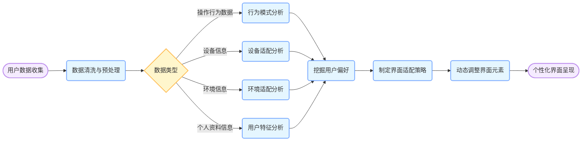

# AI驱动的用户体验个性化:动态界面适配

> 关键词：AI、用户体验个性化、动态界面适配、人机交互、界面设计、机器学习、用户行为分析

> 摘要：本文聚焦于AI驱动的用户体验个性化中的动态界面适配这一关键领域。随着互联网和智能设备的飞速发展，用户对于个性化体验的需求日益增长，动态界面适配作为实现个性化用户体验的重要手段，借助AI技术能够根据用户的行为、偏好等实时调整界面呈现。文章将深入探讨其核心概念、算法原理、数学模型，通过项目实战展示其具体实现过程，分析实际应用场景，推荐相关工具和资源，最后总结其未来发展趋势与挑战，旨在为相关领域的研究和实践提供全面且深入的参考。

## 1. 背景介绍 
### 1.1 目的和范围
目的在于深入研究AI驱动的用户体验个性化中的动态界面适配技术，揭示其原理、实现方法以及在实际应用中的价值。范围涵盖从核心概念的阐述、算法原理的剖析、数学模型的建立，到项目实战的具体实现，以及实际应用场景的分析和相关工具资源的推荐等多个方面，全面且系统地对该技术进行探讨。

### 1.2 预期读者
本文预期读者包括从事人工智能、人机交互、界面设计、软件开发等领域的专业人士，如程序员、软件架构师、产品经理、设计师等，也适合对用户体验个性化和动态界面适配技术感兴趣的科研人员、学生以及相关行业的从业者。

### 1.3 文档结构概述
本文首先介绍背景信息，包括目的、预期读者和文档结构。接着阐述核心概念与联系，呈现其原理和架构的文本示意图及Mermaid流程图。然后详细讲解核心算法原理和具体操作步骤，配以Python源代码。之后介绍数学模型和公式并举例说明。再通过项目实战展示代码实际案例并详细解释。随后分析实际应用场景。接着推荐相关工具和资源。最后总结未来发展趋势与挑战，提供常见问题与解答和扩展阅读及参考资料。

### 1.4 术语表
#### 1.4.1 核心术语定义
- **AI（Artificial Intelligence）**：即人工智能，是研究、开发用于模拟、延伸和扩展人的智能的理论、方法、技术及应用系统的一门新的技术科学。
- **用户体验个性化**：根据用户的个体特征、行为习惯、偏好等因素，为用户提供量身定制的体验，以提高用户满意度和忠诚度。
- **动态界面适配**：指界面能够根据用户的实时状态、行为、环境等因素自动调整其布局、内容、交互方式等，以提供更符合用户需求的界面呈现。

#### 1.4.2 相关概念解释
- **人机交互**：研究人与计算机之间通过一定的交互设备进行信息交流的理论、方法和技术。
- **界面设计**：对软件的人机交互、操作逻辑、界面美观进行的整体设计。

#### 1.4.3 缩略词列表
- **ML（Machine Learning）**：机器学习，是一门多领域交叉学科，涉及概率论、统计学、逼近论、凸分析、算法复杂度理论等多门学科。它专门研究计算机怎样模拟或实现人类的学习行为，以获取新的知识或技能，重新组织已有的知识结构使之不断改善自身的性能。

## 2. 核心概念与联系 

### 核心概念原理
AI驱动的用户体验个性化中的动态界面适配核心原理在于利用AI技术对用户的各种数据进行收集、分析和处理，从而了解用户的特征、行为和偏好，然后根据这些信息动态地调整界面的布局、内容显示、交互方式等，以提供个性化的用户体验。

具体来说，系统首先会收集用户的多源数据，包括但不限于用户的操作行为数据（如点击、滑动、输入等）、设备信息（如屏幕尺寸、分辨率、操作系统等）、环境信息（如时间、地点、光线等）以及用户的个人资料信息（如年龄、性别、职业等）。接着，利用机器学习等AI算法对这些数据进行分析，挖掘出用户的潜在需求和偏好模式。最后，根据分析结果，动态地调整界面元素，如改变按钮的位置和大小、推荐符合用户兴趣的内容、优化交互流程等，以提高用户与界面的交互效率和满意度。

### 架构的文本示意图
```plaintext
用户数据收集层 --> 数据处理与分析层 --> 界面适配决策层 --> 界面呈现层

用户数据收集层：负责收集用户的各种数据，包括操作行为数据、设备信息、环境信息、个人资料信息等。
数据处理与分析层：对收集到的数据进行清洗、预处理，然后利用机器学习等AI算法进行分析，挖掘用户的偏好和需求模式。
界面适配决策层：根据数据分析结果，制定界面适配的策略和规则，确定如何调整界面元素。
界面呈现层：根据适配决策，动态地调整界面的布局、内容显示、交互方式等，将个性化的界面呈现给用户。
```

### Mermaid流程图


## 3. 核心算法原理 & 具体操作步骤 

### 核心算法原理
在AI驱动的用户体验个性化的动态界面适配中，常用的算法包括基于规则的算法、机器学习算法（如决策树、神经网络等）。这里以决策树算法为例进行详细阐述。

决策树是一种基于树结构进行决策的算法，它通过对数据的特征进行划分，构建出一个树形结构，每个内部节点是一个特征上的测试，每个分支是测试输出，每个叶节点是一个类别或值。在动态界面适配中，决策树可以根据用户的各种特征数据（如年龄、性别、操作习惯等）来决定如何调整界面元素。

### 具体操作步骤
1. **数据收集**：收集用户的各种数据，包括操作行为数据、设备信息、环境信息、个人资料信息等。
2. **数据预处理**：对收集到的数据进行清洗，去除噪声和缺失值，然后进行特征选择和特征工程，将数据转换为适合决策树算法处理的格式。
3. **决策树模型训练**：使用预处理后的数据训练决策树模型，确定决策树的结构和节点划分规则。
4. **界面适配决策**：将新用户的数据输入到训练好的决策树模型中，根据模型的输出结果制定界面适配的策略。
5. **界面调整**：根据界面适配策略，动态地调整界面的布局、内容显示、交互方式等。

### Python源代码详细阐述
```python
import pandas as pd
from sklearn.tree import DecisionTreeClassifier
from sklearn.model_selection import train_test_split
from sklearn.preprocessing import LabelEncoder

# 1. 数据收集（假设数据已经收集并存储在CSV文件中）
data = pd.read_csv('user_data.csv')

# 2. 数据预处理
# 处理缺失值
data = data.dropna()

# 对分类特征进行编码
categorical_columns = data.select_dtypes(include=['object']).columns
for col in categorical_columns:
    le = LabelEncoder()
    data[col] = le.fit_transform(data[col])

# 划分特征和标签
X = data.drop('interface_adaptation', axis=1)
y = data['interface_adaptation']

# 划分训练集和测试集
X_train, X_test, y_train, y_test = train_test_split(X, y, test_size=0.2, random_state=42)

# 3. 决策树模型训练
model = DecisionTreeClassifier()
model.fit(X_train, y_train)

# 4. 界面适配决策（假设新用户数据）
new_user_data = pd.DataFrame({
    'age': [25],
    'gender': [1],
    'device_type': [2],
    # 其他特征...
})

# 对新用户数据进行同样的编码处理
for col in categorical_columns[:-1]:
    new_user_data[col] = le.transform(new_user_data[col])

# 进行预测
prediction = model.predict(new_user_data)

# 5. 界面调整（这里只是简单打印适配结果，实际中需要根据结果调整界面）
print(f"界面适配结果: {prediction[0]}")
```

## 4. 数学模型和公式 & 详细讲解 & 举例说明 

### 决策树算法的数学模型和公式
决策树算法的核心是节点划分规则，常用的划分标准有信息增益、信息增益率、基尼指数等。这里以信息增益为例进行讲解。

#### 信息熵
信息熵是用来衡量数据的不确定性的指标，其数学公式为：
$$H(X) = -\sum_{i=1}^{n}p(x_i)\log_2p(x_i)$$
其中，$X$ 是一个随机变量，$p(x_i)$ 是 $X$ 取值为 $x_i$ 的概率，$n$ 是 $X$ 可能取值的个数。

#### 条件熵
条件熵是在已知某个特征 $A$ 的条件下，数据的不确定性，其数学公式为：
$$H(X|A) = \sum_{j=1}^{m}p(A = a_j)H(X|A = a_j)$$
其中，$A$ 是一个特征，$a_j$ 是 $A$ 的第 $j$ 个取值，$m$ 是 $A$ 可能取值的个数，$p(A = a_j)$ 是 $A$ 取值为 $a_j$ 的概率，$H(X|A = a_j)$ 是在 $A$ 取值为 $a_j$ 的条件下 $X$ 的信息熵。

#### 信息增益
信息增益是指在使用某个特征 $A$ 进行划分后，数据的不确定性减少的程度，其数学公式为：
$$g(X, A) = H(X) - H(X|A)$$

### 详细讲解
信息熵 $H(X)$ 越大，表示数据的不确定性越高，即数据越混乱。条件熵 $H(X|A)$ 表示在已知特征 $A$ 的条件下，数据的不确定性。信息增益 $g(X, A)$ 则表示使用特征 $A$ 进行划分后，数据的不确定性减少的量。在决策树算法中，我们会选择信息增益最大的特征作为当前节点的划分特征，以使得划分后的子节点的数据更加纯净。

### 举例说明
假设有一个数据集，包含用户的年龄（分为青年、中年、老年）和是否喜欢某个界面风格（是、否）两个特征，数据如下：
| 年龄 | 是否喜欢 |
| ---- | ---- |
| 青年 | 是 |
| 青年 | 是 |
| 中年 | 否 |
| 中年 | 否 |
| 老年 | 否 |

首先计算是否喜欢这个特征的信息熵：
$p(是) = \frac{2}{5}$，$p(否) = \frac{3}{5}$
$$H(是否喜欢) = -\frac{2}{5}\log_2\frac{2}{5} - \frac{3}{5}\log_2\frac{3}{5} \approx 0.971$$

然后计算在年龄这个特征下的条件熵：
- 青年中喜欢的概率为 $1$，不喜欢的概率为 $0$，则 $H(是否喜欢|年龄 = 青年) = 0$
- 中年中喜欢的概率为 $0$，不喜欢的概率为 $1$，则 $H(是否喜欢|年龄 = 中年) = 0$
- 老年中喜欢的概率为 $0$，不喜欢的概率为 $1$，则 $H(是否喜欢|年龄 = 老年) = 0$
$p(年龄 = 青年) = \frac{2}{5}$，$p(年龄 = 中年) = \frac{2}{5}$，$p(年龄 = 老年) = \frac{1}{5}$
$$H(是否喜欢|年龄) = \frac{2}{5} \times 0 + \frac{2}{5} \times 0 + \frac{1}{5} \times 0 = 0$$

最后计算信息增益：
$$g(是否喜欢, 年龄) = H(是否喜欢) - H(是否喜欢|年龄) = 0.971 - 0 = 0.971$$

由于信息增益较大，所以可以选择年龄作为划分特征来构建决策树。

## 5. 项目实战：代码实际案例和详细解释说明 

### 5.1  开发环境搭建
- **操作系统**：推荐使用Windows 10、macOS或Linux系统。
- **编程语言**：Python 3.x
- **开发工具**：推荐使用PyCharm作为集成开发环境（IDE），也可以使用Jupyter Notebook进行交互式开发。
- **依赖库**：安装`pandas`、`scikit-learn`、`matplotlib`等库，可以使用以下命令进行安装：
```sh
pip install pandas scikit-learn matplotlib
```

### 5.2  源代码详细实现和代码解读
以下是一个完整的项目实战代码示例，实现了一个简单的AI驱动的用户体验个性化的动态界面适配系统。

```python
import pandas as pd
from sklearn.tree import DecisionTreeClassifier
from sklearn.model_selection import train_test_split
from sklearn.preprocessing import LabelEncoder
import matplotlib.pyplot as plt
from sklearn.tree import plot_tree

# 1. 数据收集（假设数据已经收集并存储在CSV文件中）
data = pd.read_csv('user_data.csv')

# 2. 数据预处理
# 处理缺失值
data = data.dropna()

# 对分类特征进行编码
categorical_columns = data.select_dtypes(include=['object']).columns
for col in categorical_columns:
    le = LabelEncoder()
    data[col] = le.fit_transform(data[col])

# 划分特征和标签
X = data.drop('interface_adaptation', axis=1)
y = data['interface_adaptation']

# 划分训练集和测试集
X_train, X_test, y_train, y_test = train_test_split(X, y, test_size=0.2, random_state=42)

# 3. 决策树模型训练
model = DecisionTreeClassifier()
model.fit(X_train, y_train)

# 4. 模型评估
accuracy = model.score(X_test, y_test)
print(f"模型准确率: {accuracy}")

# 5. 可视化决策树
plt.figure(figsize=(15, 10))
plot_tree(model, feature_names=X.columns, class_names=[str(i) for i in model.classes_], filled=True)
plt.show()

# 6. 界面适配决策（假设新用户数据）
new_user_data = pd.DataFrame({
    'age': [25],
    'gender': [1],
    'device_type': [2],
    # 其他特征...
})

# 对新用户数据进行同样的编码处理
for col in categorical_columns[:-1]:
    new_user_data[col] = le.transform(new_user_data[col])

# 进行预测
prediction = model.predict(new_user_data)

# 7. 界面调整（这里只是简单打印适配结果，实际中需要根据结果调整界面）
print(f"界面适配结果: {prediction[0]}")
```

### 5.3  代码解读与分析
1. **数据收集**：使用`pandas`库的`read_csv`函数从CSV文件中读取用户数据。
2. **数据预处理**：
    - 使用`dropna`函数处理缺失值，确保数据的完整性。
    - 使用`LabelEncoder`对分类特征进行编码，将字符串类型的特征转换为数值类型，以便决策树算法处理。
3. **决策树模型训练**：使用`DecisionTreeClassifier`创建决策树模型，并使用`fit`方法对模型进行训练。
4. **模型评估**：使用`score`方法计算模型在测试集上的准确率，评估模型的性能。
5. **可视化决策树**：使用`plot_tree`函数将决策树模型可视化，帮助我们理解模型的决策过程。
6. **界面适配决策**：创建新用户数据，对其进行同样的编码处理，然后使用训练好的模型进行预测。
7. **界面调整**：打印预测结果，在实际应用中，需要根据预测结果动态地调整界面的布局、内容显示、交互方式等。

## 6. 实际应用场景 
### 电商应用
在电商应用中，AI驱动的动态界面适配可以根据用户的浏览历史、购买记录、搜索关键词等数据，为用户个性化地展示商品推荐、促销活动等内容。例如，对于经常购买运动装备的用户，界面可以突出显示运动品牌的新品和折扣信息；对于新用户，可以展示热门商品和新手优惠活动。同时，根据用户使用的设备类型（如手机、平板、电脑）和屏幕尺寸，自动调整界面的布局和排版，以提供最佳的视觉效果和交互体验。

### 新闻资讯应用
新闻资讯应用可以根据用户的阅读偏好（如关注的领域、喜欢的作者、阅读时间等），为用户推送个性化的新闻内容。在界面上，动态调整新闻列表的排序和展示方式，将用户感兴趣的新闻放在突出位置。此外，根据用户所处的环境（如白天或晚上），自动调整界面的亮度和对比度，以提高阅读的舒适性。

### 游戏应用
在游戏应用中，动态界面适配可以根据玩家的游戏水平、游戏习惯等因素，调整游戏界面的难度和复杂度。例如，对于新手玩家，界面可以提供更多的提示和引导，简化操作流程；对于高级玩家，可以增加游戏的挑战性和深度，展示更多的隐藏关卡和功能。同时，根据玩家使用的设备性能，优化游戏界面的图形质量和加载速度，确保游戏的流畅运行。

### 金融应用
金融应用可以根据用户的财务状况、投资偏好、风险承受能力等信息，为用户提供个性化的金融产品推荐和理财建议。在界面上，动态展示用户关注的股票、基金等金融产品的实时行情和分析报告。此外，根据用户的操作习惯，调整界面的交互方式，如快速交易按钮的位置和大小，提高用户的操作效率。

## 7. 工具和资源推荐
### 7.1 学习资源推荐
#### 7.1.1 书籍推荐
- 《人工智能：一种现代的方法》：这是一本全面介绍人工智能领域的经典教材，涵盖了人工智能的各个方面，包括机器学习、自然语言处理、计算机视觉等，对于深入理解AI技术有很大的帮助。
- 《Python机器学习》：本书详细介绍了Python在机器学习中的应用，包括各种机器学习算法的原理和实现，以及如何使用Python进行数据预处理、模型训练和评估等。
- 《用户体验要素：以用户为中心的产品设计》：从用户体验的角度出发，介绍了如何设计出符合用户需求和期望的产品，对于理解用户体验个性化的概念和方法有重要的指导意义。

#### 7.1.2 在线课程
- Coursera上的“机器学习”课程：由斯坦福大学的Andrew Ng教授主讲，是学习机器学习的经典课程，课程内容丰富，讲解深入浅出，适合初学者和有一定基础的学习者。
- edX上的“人工智能基础”课程：该课程系统地介绍了人工智能的基本概念、算法和应用，通过理论讲解和实践项目相结合的方式，帮助学习者掌握人工智能的核心知识。
- Udemy上的“用户体验设计：从入门到精通”课程：专注于用户体验设计的各个方面，包括用户研究、界面设计、交互设计等，通过实际案例和项目实践，帮助学习者提升用户体验设计的能力。

#### 7.1.3 技术博客和网站
- Medium：是一个汇聚了众多技术专家和开发者的博客平台，上面有很多关于AI、用户体验设计等领域的优质文章，可以及时了解最新的技术动态和研究成果。
- Towards Data Science：专注于数据科学和机器学习领域，提供了大量的技术文章、教程和案例分析，对于学习和实践AI技术有很大的帮助。
- Nielsen Norman Group：是用户体验设计领域的权威机构，其网站上有很多关于用户体验设计的研究报告、文章和案例，对于深入理解用户体验个性化的理论和方法有重要的参考价值。

### 7.2 开发工具框架推荐
#### 7.2.1 IDE和编辑器
- PyCharm：是一款专门为Python开发设计的集成开发环境，具有强大的代码编辑、调试、代码分析等功能，能够提高开发效率。
- Jupyter Notebook：是一个交互式的开发环境，适合进行数据探索、模型训练和可视化等工作，通过代码和文本的混合展示，方便开发者记录和分享自己的工作过程。
- Visual Studio Code：是一款轻量级的代码编辑器，支持多种编程语言和插件扩展，具有丰富的功能和良好的用户体验，适合快速开发和调试。

#### 7.2.2 调试和性能分析工具
- PDB：是Python自带的调试工具，通过设置断点、单步执行等功能，帮助开发者定位和解决代码中的问题。
- cProfile：是Python的性能分析工具，能够分析代码的执行时间和函数调用关系，帮助开发者找出性能瓶颈，优化代码性能。
- TensorBoard：是TensorFlow的可视化工具，可用于可视化模型的训练过程、性能指标等，帮助开发者更好地理解和优化模型。

#### 7.2.3 相关框架和库
- Scikit-learn：是Python中常用的机器学习库，提供了丰富的机器学习算法和工具，如分类、回归、聚类等，方便开发者进行模型训练和评估。
- TensorFlow：是一个开源的深度学习框架，广泛应用于图像识别、自然语言处理等领域，具有高效的计算性能和灵活的编程接口。
- PyTorch：是另一个流行的深度学习框架，以其简洁的语法和动态计算图的特点受到很多开发者的喜爱，适合进行研究和快速迭代开发。

### 7.3 相关论文著作推荐
#### 7.3.1 经典论文
- “A Decision-Theoretic Generalization of On-Line Learning and an Application to Boosting”：该论文提出了一种基于决策理论的在线学习方法，并将其应用于提升算法中，对于理解决策树等机器学习算法的原理和优化有重要的参考价值。
- “ImageNet Classification with Deep Convolutional Neural Networks”：这篇论文介绍了深度卷积神经网络在图像分类任务中的应用，开创了深度学习在计算机视觉领域的先河，对于理解深度学习的发展和应用有重要的意义。
- “User Experience Design: A Research Agenda”：该论文探讨了用户体验设计的研究方向和发展趋势，对于深入理解用户体验设计的理论和实践有重要的指导作用。

#### 7.3.2 最新研究成果
- 关注ACM SIGCHI（计算机人机交互特别兴趣组）、IEEE Transactions on Visualization and Computer Graphics等学术会议和期刊上的最新研究成果，这些会议和期刊发表了很多关于人机交互、用户体验设计、AI技术等领域的前沿研究论文。

#### 7.3.3 应用案例分析
- 研究一些知名公司的应用案例，如亚马逊的个性化推荐系统、Netflix的内容推荐和界面适配策略等，通过分析这些实际案例，了解AI驱动的用户体验个性化和动态界面适配在实际应用中的实现方法和效果。

## 8. 总结：未来发展趋势与挑战
### 未来发展趋势
- **多模态融合**：未来的动态界面适配将不仅仅依赖于用户的操作行为数据，还会融合语音、图像、手势等多模态数据，以更全面地了解用户的需求和意图，提供更加个性化和自然的交互体验。
- **跨平台和设备的无缝适配**：随着智能设备的多样化和普及，动态界面适配将实现跨平台和设备的无缝切换，用户在不同的设备上都能获得一致的个性化体验。
- **实时自适应**：系统将能够实时感知用户的状态和环境变化，并迅速调整界面呈现，以适应不同的场景需求，提供更加及时和精准的个性化服务。
- **与物联网的深度融合**：结合物联网技术，动态界面适配可以获取更多的环境信息和设备状态信息，进一步优化界面的呈现和交互方式，实现更加智能化的用户体验。

### 挑战
- **数据隐私和安全问题**：动态界面适配需要收集和分析大量的用户数据，这涉及到用户的隐私和数据安全问题。如何在保护用户隐私的前提下，有效地利用数据进行个性化适配是一个亟待解决的问题。
- **算法的可解释性**：一些复杂的AI算法（如深度学习算法）往往是黑盒模型，其决策过程难以解释。在动态界面适配中，用户需要了解系统为什么做出这样的界面调整，因此提高算法的可解释性是一个重要的挑战。
- **用户多样性和个性化需求的平衡**：不同用户的需求和偏好差异很大，如何在满足用户个性化需求的同时，保证界面的通用性和易用性，避免因过度个性化而导致用户体验的碎片化，是一个需要平衡的问题。
- **技术的复杂性和成本**：实现AI驱动的动态界面适配需要涉及到多种技术，如机器学习、人机交互、界面设计等，技术的复杂性较高。同时，开发和维护这样的系统也需要较高的成本，如何降低技术门槛和成本，提高系统的可扩展性和可维护性，是一个需要解决的挑战。

## 9. 附录：常见问题与解答
### 问题1：如何确保收集到的用户数据的质量？
解答：可以通过以下方法确保用户数据的质量：
- 数据清洗：去除噪声数据、缺失值和重复数据。
- 数据验证：对收集到的数据进行格式和范围验证，确保数据的准确性和完整性。
- 数据监控：实时监控数据的收集过程，及时发现和处理异常数据。

### 问题2：如何选择合适的AI算法进行动态界面适配？
解答：选择合适的AI算法需要考虑以下因素：
- 数据类型和规模：不同的算法适用于不同类型和规模的数据，如决策树算法适用于处理离散型数据，神经网络算法适用于处理大规模的复杂数据。
- 问题的复杂度：如果问题比较简单，可以选择简单的算法；如果问题比较复杂，则需要选择更强大的算法。
- 可解释性要求：如果需要对算法的决策过程进行解释，则需要选择可解释性较强的算法，如决策树算法。

### 问题3：如何评估动态界面适配的效果？
解答：可以从以下几个方面评估动态界面适配的效果：
- 用户满意度：通过用户调查、反馈等方式了解用户对界面适配的满意度。
- 交互效率：观察用户与界面的交互行为，如操作时间、错误率等，评估界面适配是否提高了用户的交互效率。
- 业务指标：如电商应用中的转化率、新闻资讯应用中的阅读量等，评估界面适配是否对业务指标产生了积极的影响。

## 10. 扩展阅读 & 参考资料
### 扩展阅读
- 《AI未来进行式》：本书探讨了AI技术在未来各个领域的应用和发展趋势，对于了解AI技术的前沿动态和未来走向有很大的帮助。
- 《体验经济》：从经济和商业的角度出发，阐述了用户体验的重要性和价值，对于理解用户体验个性化的商业意义有重要的启示。

### 参考资料
- 相关学术论文和研究报告，如ACM SIGCHI、IEEE Transactions on Visualization and Computer Graphics等会议和期刊上的论文。
- 知名公司的技术博客和开源项目，如Google、Facebook、Microsoft等公司的技术博客，以及TensorFlow、PyTorch等开源项目的文档和代码。
- 行业标准和规范，如ISO 9241（人机交互标准）等，对于指导动态界面适配的设计和开发有重要的参考价值。