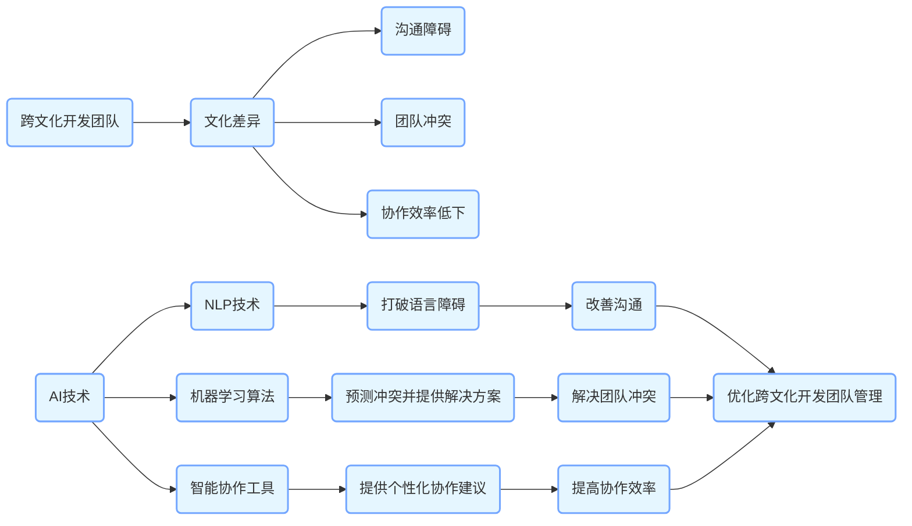

# AI驱动的跨文化开发团队管理

> 关键词：AI、跨文化开发团队、团队管理、文化差异、沟通协作

> 摘要：本文聚焦于AI驱动的跨文化开发团队管理这一前沿话题。在全球化背景下，跨文化开发团队日益增多，然而文化差异给团队管理带来诸多挑战。AI技术的发展为解决这些问题提供了新的思路和方法。文章深入探讨了跨文化开发团队管理的核心概念，详细阐述了相关算法原理和具体操作步骤，通过数学模型和公式进行理论分析，并结合项目实战案例进行详细解释。同时，介绍了该领域的实际应用场景、推荐了相关工具和资源，最后总结了未来发展趋势与挑战，以期为跨文化开发团队的有效管理提供全面的理论和实践指导。

## 1. 背景介绍 
### 1.1 目的和范围
在当今全球化的大趋势下，软件开发行业越来越多地采用跨文化开发团队的模式。不同文化背景的人员汇聚在一起，虽然能够带来多元的思维和创新的灵感，但也面临着文化差异带来的沟通障碍、协作困难等问题。本文章的目的在于探讨如何利用AI技术来优化跨文化开发团队的管理，提高团队的协作效率和创新能力。范围涵盖了跨文化开发团队管理的各个方面，包括团队组建、沟通协作、冲突解决等，以及AI在这些过程中的具体应用。

### 1.2 预期读者
本文预期读者主要包括软件开发企业的管理者、团队负责人、项目经理，以及对跨文化管理和AI技术感兴趣的研究人员和开发者。对于那些正在面临或即将面临跨文化开发团队管理挑战的人士，本文将提供有价值的参考和实用的解决方案。

### 1.3 文档结构概述
本文首先介绍跨文化开发团队管理的背景和相关概念，包括文化差异的影响和AI在团队管理中的作用。接着详细阐述核心算法原理和具体操作步骤，通过数学模型进行理论分析。然后通过项目实战案例展示AI在跨文化开发团队管理中的实际应用。之后介绍该领域的实际应用场景和相关工具资源。最后总结未来发展趋势与挑战，并提供常见问题解答和扩展阅读参考资料。

### 1.4 术语表
#### 1.4.1 核心术语定义
- **跨文化开发团队**：由来自不同文化背景的人员组成的软件开发团队，这些人员在价值观、工作习惯、沟通方式等方面存在差异。
- **AI（人工智能）**：是一门研究如何使计算机能够模拟人类智能的学科，包括机器学习、自然语言处理、计算机视觉等多个领域。
- **文化差异**：指不同文化背景的人员在价值观、信仰、行为规范、沟通方式等方面存在的差异。

#### 1.4.2 相关概念解释
- **文化维度**：是用来描述文化差异的一种理论框架，常见的文化维度包括个人主义与集体主义、权力距离、不确定性规避等。
- **机器学习**：是AI的一个重要分支，通过让计算机从数据中学习模式和规律，从而实现预测和决策等功能。

#### 1.4.3 缩略词列表
- **AI**：Artificial Intelligence（人工智能）
- **NLP**：Natural Language Processing（自然语言处理）
- **ML**：Machine Learning（机器学习）

## 2. 核心概念与联系 

### 2.1 跨文化开发团队管理的核心概念
跨文化开发团队管理的核心在于理解和处理文化差异对团队协作的影响。文化差异会体现在多个方面，例如沟通方式上，不同文化背景的人员可能有不同的语言习惯、肢体语言和表达风格；在工作价值观上，有的文化强调个人成就，而有的文化更注重集体利益。这些差异如果不能得到妥善处理，可能会导致沟通障碍、团队冲突和协作效率低下。

### 2.2 AI在跨文化开发团队管理中的作用
AI技术可以在多个方面帮助跨文化开发团队的管理。例如，自然语言处理（NLP）技术可以用于翻译和理解不同语言的文本和语音，打破语言障碍；机器学习算法可以分析团队成员的行为模式和沟通数据，预测潜在的冲突并提供解决方案；智能协作工具可以根据团队成员的文化背景和工作习惯，提供个性化的协作建议。

### 2.3 核心概念的架构示意图


该示意图展示了跨文化开发团队管理中文化差异带来的问题，以及AI技术如何针对这些问题发挥作用，最终实现优化团队管理的目标。

## 3. 核心算法原理 & 具体操作步骤 

### 3.1 基于机器学习的团队行为分析算法
#### 3.1.1 算法原理
我们可以使用聚类算法对团队成员的行为数据进行分析。例如，K-Means聚类算法可以将团队成员按照行为模式的相似性划分为不同的簇。通过分析每个簇的特征，可以了解不同类型团队成员的行为特点。

以下是使用Python实现K-Means聚类算法的示例代码：
```python
import numpy as np
from sklearn.cluster import KMeans
import matplotlib.pyplot as plt

# 生成示例数据
X = np.array([[1, 2], [1, 4], [1, 0],
              [4, 2], [4, 4], [4, 0]])

# 创建K-Means模型
kmeans = KMeans(n_clusters=2, random_state=0)

# 训练模型
kmeans.fit(X)

# 获取聚类标签
labels = kmeans.labels_

# 获取聚类中心
centroids = kmeans.cluster_centers_

# 绘制聚类结果
plt.scatter(X[:, 0], X[:, 1], c=labels, cmap='viridis')
plt.scatter(centroids[:, 0], centroids[:, 1], marker='X', s=200, c='red')
plt.show()
```
#### 3.1.2 具体操作步骤
1. **数据收集**：收集团队成员的行为数据，例如沟通频率、工作时间、任务完成情况等。
2. **数据预处理**：对收集到的数据进行清洗、归一化等处理，以提高算法的性能。
3. **选择聚类数量**：通过手肘法等方法选择合适的聚类数量。
4. **训练模型**：使用K-Means算法对预处理后的数据进行训练。
5. **分析结果**：分析每个簇的特征，了解不同类型团队成员的行为特点。

### 3.2 基于自然语言处理的沟通分析算法
#### 3.2.1 算法原理
我们可以使用情感分析算法对团队成员的沟通文本进行分析，了解他们的情绪状态。例如，使用基于机器学习的情感分析模型，对文本中的积极、消极和中性情感进行分类。

以下是使用Python和NLTK库实现简单情感分析的示例代码：
```python
import nltk
from nltk.sentiment import SentimentIntensityAnalyzer

# 下载必要的数据
nltk.download('vader_lexicon')

# 创建情感分析器
sia = SentimentIntensityAnalyzer()

# 示例文本
text = "This is a great project!"

# 进行情感分析
scores = sia.polarity_scores(text)

# 输出结果
print(scores)
```
#### 3.2.2 具体操作步骤
1. **数据收集**：收集团队成员的沟通文本，例如邮件、聊天记录等。
2. **数据预处理**：对文本进行清洗、分词等处理。
3. **选择情感分析模型**：选择合适的情感分析模型，例如VADER、TextBlob等。
4. **进行情感分析**：使用选择的模型对预处理后的文本进行情感分析。
5. **分析结果**：分析情感分析结果，了解团队成员的情绪状态。

## 4. 数学模型和公式 & 详细讲解 & 举例说明 

### 4.1 K-Means聚类算法的数学模型
K-Means聚类算法的目标是将数据集 $X = \{x_1, x_2, \cdots, x_n\}$ 划分为 $k$ 个簇 $C = \{C_1, C_2, \cdots, C_k\}$，使得每个簇内的数据点到该簇中心的距离之和最小。具体的目标函数可以表示为：
$$
J = \sum_{i=1}^{k} \sum_{x_j \in C_i} \| x_j - \mu_i \|^2
$$
其中，$\mu_i$ 是第 $i$ 个簇的中心。

### 4.2 详细讲解
K-Means聚类算法的基本步骤如下：
1. **初始化**：随机选择 $k$ 个数据点作为初始的簇中心 $\mu_1, \mu_2, \cdots, \mu_k$。
2. **分配数据点**：对于每个数据点 $x_j$，计算它到每个簇中心 $\mu_i$ 的距离 $\| x_j - \mu_i \|^2$，并将其分配到距离最近的簇中。
3. **更新簇中心**：对于每个簇 $C_i$，计算该簇内所有数据点的均值作为新的簇中心 $\mu_i$。
4. **重复步骤2和3**：直到簇中心不再发生变化或达到最大迭代次数。

### 4.3 举例说明
假设我们有一个数据集 $X = \{[1, 2], [1, 4], [1, 0], [4, 2], [4, 4], [4, 0]\}$，我们想要将其划分为 $k = 2$ 个簇。

1. **初始化**：随机选择两个数据点作为初始的簇中心，例如 $\mu_1 = [1, 2]$ 和 $\mu_2 = [4, 4]$。
2. **分配数据点**：计算每个数据点到两个簇中心的距离，并将其分配到距离最近的簇中。例如，对于数据点 $[1, 4]$，它到 $\mu_1$ 的距离为 $\| [1, 4] - [1, 2] \|^2 = 4$，到 $\mu_2$ 的距离为 $\| [1, 4] - [4, 4] \|^2 = 9$，因此将其分配到 $\mu_1$ 所在的簇中。
3. **更新簇中心**：计算每个簇内所有数据点的均值作为新的簇中心。例如，对于 $\mu_1$ 所在的簇，其中的数据点为 $[1, 2], [1, 4], [1, 0]$，新的簇中心为 $\mu_1 = \frac{[1, 2] + [1, 4] + [1, 0]}{3} = [1, 2]$。
4. **重复步骤2和3**：直到簇中心不再发生变化或达到最大迭代次数。

## 5. 项目实战：代码实际案例和详细解释说明 

### 5.1  开发环境搭建
#### 5.1.1 安装Python
首先，需要安装Python环境。可以从Python官方网站（https://www.python.org/downloads/） 下载适合自己操作系统的Python安装包，并按照安装向导进行安装。

#### 5.1.2 安装必要的库
在命令行中使用以下命令安装必要的库：
```sh
pip install numpy scikit-learn matplotlib nltk
```

### 5.2  源代码详细实现和代码解读
#### 5.2.1 团队行为分析代码实现
```python
import numpy as np
from sklearn.cluster import KMeans
import matplotlib.pyplot as plt

# 生成示例数据
X = np.array([[1, 2], [1, 4], [1, 0],
              [4, 2], [4, 4], [4, 0]])

# 创建K-Means模型
kmeans = KMeans(n_clusters=2, random_state=0)

# 训练模型
kmeans.fit(X)

# 获取聚类标签
labels = kmeans.labels_

# 获取聚类中心
centroids = kmeans.cluster_centers_

# 绘制聚类结果
plt.scatter(X[:, 0], X[:, 1], c=labels, cmap='viridis')
plt.scatter(centroids[:, 0], centroids[:, 1], marker='X', s=200, c='red')
plt.show()
```
#### 5.2.2 代码解读
- **数据生成**：使用 `np.array` 生成示例数据。
- **模型创建**：使用 `KMeans` 类创建K-Means模型，并指定聚类数量为2。
- **模型训练**：使用 `fit` 方法对模型进行训练。
- **获取结果**：使用 `labels_` 属性获取聚类标签，使用 `cluster_centers_` 属性获取聚类中心。
- **绘制结果**：使用 `matplotlib` 库绘制聚类结果。

#### 5.2.3 沟通分析代码实现
```python
import nltk
from nltk.sentiment import SentimentIntensityAnalyzer

# 下载必要的数据
nltk.download('vader_lexicon')

# 创建情感分析器
sia = SentimentIntensityAnalyzer()

# 示例文本
text = "This is a great project!"

# 进行情感分析
scores = sia.polarity_scores(text)

# 输出结果
print(scores)
```
#### 5.2.4 代码解读
- **数据下载**：使用 `nltk.download` 下载必要的数据。
- **创建情感分析器**：使用 `SentimentIntensityAnalyzer` 类创建情感分析器。
- **进行情感分析**：使用 `polarity_scores` 方法对示例文本进行情感分析。
- **输出结果**：打印情感分析结果。

### 5.3  代码解读与分析
通过上述代码，我们可以对团队成员的行为数据进行聚类分析，了解不同类型团队成员的行为特点；同时，对团队成员的沟通文本进行情感分析，了解他们的情绪状态。这些分析结果可以帮助团队管理者更好地了解团队情况，采取相应的管理措施。

## 6. 实际应用场景 
### 6.1 团队组建
在团队组建阶段，AI可以帮助分析候选人的文化背景、技能水平和行为模式，从而选择最合适的团队成员。例如，通过对候选人的简历和面试记录进行分析，了解他们的价值观和工作习惯，选择能够与团队其他成员良好协作的人员。

### 6.2 沟通协作
在团队沟通协作过程中，AI可以实时翻译团队成员的语言，打破语言障碍。同时，通过对沟通文本的分析，提供沟通建议，例如提醒团队成员注意语言表达的文化差异。

### 6.3 冲突解决
当团队出现冲突时，AI可以分析冲突的原因和相关人员的情绪状态，提供解决方案。例如，通过对沟通记录的分析，找出冲突的根源，并根据团队成员的文化背景提供合适的调解策略。

### 6.4 绩效评估
AI可以根据团队成员的工作表现、沟通协作情况等多方面的数据进行绩效评估。同时，考虑到文化差异对绩效的影响，提供更加客观和公平的评估结果。

## 7. 工具和资源推荐
### 7.1 学习资源推荐
#### 7.1.1 书籍推荐
- 《跨文化管理》：全面介绍了跨文化管理的理论和实践，对于理解跨文化开发团队管理有很大帮助。
- 《Python机器学习实战》：详细介绍了Python在机器学习领域的应用，对于学习相关算法和技术非常有用。

#### 7.1.2 在线课程
- Coursera上的“机器学习”课程：由斯坦福大学教授Andrew Ng授课，是学习机器学习的经典课程。
- edX上的“自然语言处理”课程：系统介绍了自然语言处理的原理和技术。

#### 7.1.3 技术博客和网站
- Medium：上面有很多关于AI和跨文化管理的优秀文章。
- 机器之心：专注于AI领域的资讯和技术分享。

### 7.2 开发工具框架推荐
#### 7.2.1 IDE和编辑器
- PyCharm：是一款功能强大的Python集成开发环境，适合Python开发。
- Visual Studio Code：轻量级的代码编辑器，支持多种编程语言，有丰富的插件。

#### 7.2.2 调试和性能分析工具
- pdb：Python自带的调试工具，用于调试Python代码。
- cProfile：Python的性能分析工具，用于分析代码的性能瓶颈。

#### 7.2.3 相关框架和库
- scikit-learn：Python的机器学习库，提供了丰富的机器学习算法和工具。
- NLTK：Python的自然语言处理库，用于处理文本数据。

### 7.3 相关论文著作推荐
#### 7.3.1 经典论文
- “The Cultural Consequences of Globalization”：探讨了全球化背景下文化差异的影响。
- “Machine Learning for Team Management”：研究了机器学习在团队管理中的应用。

#### 7.3.2 最新研究成果
- 关注顶级学术会议，如ACM SIGKDD、ICML等，了解AI在跨文化开发团队管理领域的最新研究成果。

#### 7.3.3 应用案例分析
- 一些知名企业的案例分析，如谷歌、微软等，了解他们在跨文化开发团队管理中使用AI技术的实践经验。

## 8. 总结：未来发展趋势与挑战
### 8.1 未来发展趋势
- **更加智能化**：AI技术将不断发展，在跨文化开发团队管理中发挥更加智能化的作用。例如，智能助手可以根据团队的实时情况提供更加个性化的管理建议。
- **融合更多技术**：AI将与物联网、区块链等技术融合，为跨文化开发团队管理提供更加全面的解决方案。例如，通过物联网设备收集团队成员的工作数据，结合AI进行分析。
- **注重文化理解**：未来的AI系统将更加注重对不同文化的理解和尊重，能够更好地处理文化差异带来的问题。

### 8.2 挑战
- **数据隐私和安全**：在收集和分析团队成员的数据时，需要确保数据的隐私和安全，避免数据泄露和滥用。
- **文化差异的复杂性**：文化差异非常复杂，AI系统可能难以完全理解和处理所有的文化差异，需要不断进行优化和改进。
- **技术的可解释性**：AI模型的决策过程往往难以解释，在团队管理中，需要提供可解释的AI解决方案，以便团队成员理解和接受。

## 9. 附录：常见问题与解答
### 9.1 如何确保AI分析结果的准确性？
- 确保数据的质量和完整性，对数据进行充分的预处理。
- 选择合适的算法和模型，并进行充分的训练和调优。
- 对分析结果进行验证和评估，不断改进模型。

### 9.2 AI技术是否会取代团队管理者？
不会。AI技术可以辅助团队管理者进行决策和管理，但不能完全取代人类的判断和决策能力。团队管理者需要结合AI分析结果和自身的经验进行综合判断。

### 9.3 如何解决不同文化背景团队成员对AI技术的接受度问题？
- 进行充分的培训和宣传，让团队成员了解AI技术的作用和优势。
- 尊重不同文化背景团队成员的意见和需求，根据他们的反馈进行调整和改进。
- 提供可解释的AI解决方案，让团队成员能够理解AI的决策过程。

## 10. 扩展阅读 & 参考资料
- Hofstede, G. (1980). Culture's Consequences: International Differences in Work-Related Values. Sage Publications.
- Géron, A. (2019). Hands-On Machine Learning with Scikit-Learn, Keras, and TensorFlow: Concepts, Tools, and Techniques to Build Intelligent Systems. O'Reilly Media.
- 相关学术期刊：ACM Transactions on Management Information Systems、Journal of Management Information Systems等。
- 相关技术论坛：Stack Overflow、Reddit的相关子版块等。