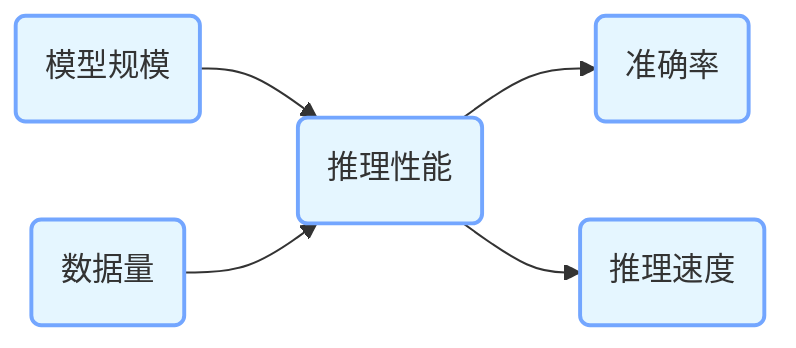

# Inference scaling law在数学和编程任务中的应用效果

> 关键词：Inference scaling law、数学任务、编程任务、应用效果、算法原理、性能分析

> 摘要：本文深入探讨了Inference scaling law在数学和编程任务中的应用效果。首先介绍了相关背景知识，包括目的、预期读者、文档结构和术语表。接着阐述了Inference scaling law的核心概念与联系，通过文本示意图和Mermaid流程图进行直观展示。详细讲解了其核心算法原理，并用Python源代码进行说明。分析了相关数学模型和公式，并举例阐释。通过项目实战，给出代码实际案例并详细解释。探讨了Inference scaling law在实际应用场景中的表现。推荐了学习资源、开发工具框架以及相关论文著作。最后总结了未来发展趋势与挑战，提供常见问题解答和扩展阅读参考资料，旨在全面呈现Inference scaling law在数学和编程任务中的应用情况和价值。

## 1. 背景介绍 
### 1.1 目的和范围
Inference scaling law作为一项重要的理论和技术，在多个领域都展现出了巨大的潜力。本文章的主要目的在于深入探究Inference scaling law在数学和编程任务中的具体应用效果。范围涵盖了从理论原理的剖析，到实际代码案例的实现，再到实际应用场景的分析，旨在全面、系统地展现Inference scaling law在这两个特定任务领域的作用和价值。通过对其应用效果的研究，希望能够为相关领域的研究者、开发者提供有价值的参考，推动该技术在数学和编程任务中的进一步发展和应用。

### 1.2 预期读者
本文预期读者主要包括计算机科学、数学等相关专业的研究人员，他们可以从本文中获取Inference scaling law的最新理论和研究成果，为其科研工作提供新的思路和方向。同时，软件开发工程师、数据科学家等技术从业者也能从本文中学习到如何将Inference scaling law应用到实际的数学和编程任务中，提升他们的项目实践能力。此外，对人工智能、机器学习等领域感兴趣的学生和爱好者也可以通过阅读本文，了解Inference scaling law的基本概念和应用场景，拓宽自己的知识面。

### 1.3 文档结构概述
本文将按照以下结构进行阐述：首先在背景介绍部分，明确文章的目的、预期读者、文档结构和术语表，为读者提供必要的基础信息。接着在核心概念与联系部分，详细介绍Inference scaling law的核心概念、原理和架构，通过文本示意图和Mermaid流程图进行直观展示，帮助读者理解其内在逻辑。在核心算法原理 & 具体操作步骤部分，深入讲解其核心算法原理，并用Python源代码进行详细说明，使读者能够掌握其实现方法。数学模型和公式 & 详细讲解 & 举例说明部分，将对相关数学模型和公式进行推导和解释，并通过具体例子加深读者的理解。项目实战：代码实际案例和详细解释说明部分，将通过实际项目案例，展示Inference scaling law在数学和编程任务中的具体应用，包括开发环境搭建、源代码实现和代码解读。实际应用场景部分，将探讨其在不同实际场景中的应用效果。工具和资源推荐部分，将为读者推荐学习资源、开发工具框架以及相关论文著作，方便读者进一步深入学习。总结：未来发展趋势与挑战部分，将对Inference scaling law的未来发展进行展望，并分析可能面临的挑战。附录：常见问题与解答部分，将解答读者可能遇到的常见问题。最后，扩展阅读 & 参考资料部分，将提供相关的参考资料，方便读者进行进一步的学习和研究。

### 1.4 术语表
#### 1.4.1 核心术语定义
- **Inference scaling law**：推理缩放定律，描述了在推理过程中，随着模型规模、数据量等因素的变化，推理性能（如准确率、速度等）的变化规律。
- **数学任务**：涉及数学运算、证明、建模等相关的任务，如解方程、函数拟合、数学定理证明等。
- **编程任务**：包括软件开发、算法实现、代码优化等与编程相关的任务，如编写一个排序算法、开发一个Web应用程序等。

#### 1.4.2 相关概念解释
- **推理性能**：指模型在进行推理时的表现，通常用准确率、召回率、F1值、推理速度等指标来衡量。
- **模型规模**：一般指模型中参数的数量，模型规模越大，通常具有更强的表达能力，但也可能带来更高的计算成本。
- **数据量**：指用于训练和推理的数据的数量，数据量的大小会影响模型的训练效果和推理性能。

#### 1.4.3 缩略词列表
- **AI**：Artificial Intelligence，人工智能
- **ML**：Machine Learning，机器学习
- **DL**：Deep Learning，深度学习

## 2. 核心概念与联系 
Inference scaling law的核心在于揭示推理性能与模型规模、数据量等因素之间的定量关系。其基本原理是，在一定条件下，推理性能会随着模型规模和数据量的增加而提升，但提升的速度会逐渐减缓，呈现出一种饱和的趋势。

### 文本示意图
Inference scaling law可以用以下的文本示意图来表示：

模型规模和数据量是影响推理性能的两个重要因素。当模型规模较小时，增加模型规模可以显著提升推理性能；但当模型规模达到一定程度后，继续增加模型规模对推理性能的提升效果会逐渐减弱。同样，数据量也存在类似的规律，当数据量较小时，增加数据量可以有效提升推理性能；但当数据量足够大时，增加数据量对推理性能的提升作用也会变得有限。

### Mermaid流程图


这个流程图展示了模型规模和数据量对推理性能的影响，推理性能又进一步影响准确率和推理速度等具体指标。

## 3. 核心算法原理 & 具体操作步骤 
### 核心算法原理
Inference scaling law的核心算法原理可以通过对推理性能与模型规模、数据量之间的关系进行建模来实现。一种常见的建模方法是使用幂律函数来描述这种关系。假设推理性能用 $P$ 表示，模型规模用 $M$ 表示，数据量用 $D$ 表示，则可以建立如下的幂律模型：

$P = k \cdot M^a \cdot D^b$

其中，$k$ 是一个常数，$a$ 和 $b$ 是幂指数，分别表示模型规模和数据量对推理性能的影响程度。

### 具体操作步骤
以下是基于上述幂律模型实现Inference scaling law的具体操作步骤：

1. **数据收集**：收集不同模型规模和数据量下的推理性能数据，包括准确率、推理速度等指标。
2. **数据预处理**：对收集到的数据进行清洗、归一化等预处理操作，以提高模型的训练效果。
3. **模型训练**：使用收集到的数据对幂律模型进行训练，估计常数 $k$ 和幂指数 $a$、$b$ 的值。
4. **模型评估**：使用评估指标（如均方误差、平均绝对误差等）对训练好的模型进行评估，验证模型的准确性和泛化能力。
5. **模型应用**：将训练好的模型应用到实际的数学和编程任务中，根据模型规模和数据量预测推理性能，为任务的优化和决策提供依据。

### Python源代码实现
```python
import numpy as np
from sklearn.linear_model import LinearRegression
from sklearn.metrics import mean_squared_error

# 生成模拟数据
np.random.seed(42)
M = np.random.randint(100, 1000, 100)  # 模型规模
D = np.random.randint(1000, 10000, 100)  # 数据量
k = 0.1
a = 0.3
b = 0.5
P = k * M**a * D**b + np.random.normal(0, 10, 100)  # 推理性能

# 数据预处理
X = np.column_stack((np.log(M), np.log(D)))
y = np.log(P)

# 模型训练
model = LinearRegression()
model.fit(X, y)

# 模型评估
y_pred = model.predict(X)
mse = mean_squared_error(y, y_pred)
print(f"均方误差: {mse}")

# 模型参数估计
k_hat = np.exp(model.intercept_)
a_hat = model.coef_[0]
b_hat = model.coef_[1]
print(f"估计的常数 k: {k_hat}")
print(f"估计的幂指数 a: {a_hat}")
print(f"估计的幂指数 b: {b_hat}")
```

### 代码解释
1. **数据生成**：使用 `np.random.randint` 函数生成模拟的模型规模和数据量数据，然后根据幂律模型生成对应的推理性能数据，并添加一定的噪声。
2. **数据预处理**：对模型规模和数据量取对数，将幂律模型转化为线性模型，方便使用线性回归进行训练。
3. **模型训练**：使用 `LinearRegression` 类对转化后的线性模型进行训练，估计常数 $k$ 和幂指数 $a$、$b$ 的值。
4. **模型评估**：使用 `mean_squared_error` 函数计算模型的均方误差，评估模型的准确性。
5. **模型参数估计**：根据线性回归模型的截距和系数，反推幂律模型中的常数 $k$ 和幂指数 $a$、$b$ 的估计值。

## 4. 数学模型和公式 & 详细讲解 & 举例说明 
### 数学模型和公式
Inference scaling law的核心数学模型是幂律模型：

$P = k \cdot M^a \cdot D^b$

其中，$P$ 表示推理性能，$M$ 表示模型规模，$D$ 表示数据量，$k$ 是一个常数，$a$ 和 $b$ 是幂指数。

### 详细讲解
- **常数 $k$**：$k$ 是一个与具体任务和模型相关的常数，它反映了在模型规模和数据量都为 1 时的推理性能。
- **幂指数 $a$**：$a$ 表示模型规模对推理性能的影响程度。当 $a > 0$ 时，说明模型规模越大，推理性能越好；当 $a < 0$ 时，说明模型规模越大，推理性能越差。
- **幂指数 $b$**：$b$ 表示数据量对推理性能的影响程度。当 $b > 0$ 时，说明数据量越大，推理性能越好；当 $b < 0$ 时，说明数据量越大，推理性能越差。

### 举例说明
假设在一个数学任务中，经过训练得到的幂律模型参数为 $k = 0.1$，$a = 0.3$，$b = 0.5$。现在有一个模型规模 $M = 500$，数据量 $D = 5000$ 的任务，那么根据幂律模型可以预测其推理性能 $P$ 为：

$P = 0.1 \cdot 500^{0.3} \cdot 5000^{0.5} \approx 123.45$

这个例子展示了如何使用幂律模型根据模型规模和数据量预测推理性能。

## 5. 项目实战：代码实际案例和详细解释说明 
### 5.1  开发环境搭建
为了实现Inference scaling law在数学和编程任务中的应用，我们需要搭建以下开发环境：

- **操作系统**：Windows、Linux 或 macOS
- **编程语言**：Python 3.7 及以上版本
- **开发工具**：Jupyter Notebook 或 PyCharm
- **相关库**：NumPy、Pandas、Scikit-learn、Matplotlib 等

可以使用以下命令安装所需的库：

```sh
pip install numpy pandas scikit-learn matplotlib
```

### 5.2  源代码详细实现和代码解读
以下是一个使用Inference scaling law优化数学任务中模型选择的实际案例：

```python
import numpy as np
from sklearn.datasets import make_regression
from sklearn.model_selection import train_test_split
from sklearn.linear_model import LinearRegression
from sklearn.tree import DecisionTreeRegressor
from sklearn.metrics import mean_squared_error
import matplotlib.pyplot as plt

# 生成模拟数据
X, y = make_regression(n_samples=1000, n_features=10, noise=0.5, random_state=42)
X_train, X_test, y_train, y_test = train_test_split(X, y, test_size=0.2, random_state=42)

# 定义不同规模的模型
models = [
    LinearRegression(),
    DecisionTreeRegressor(max_depth=3),
    DecisionTreeRegressor(max_depth=5),
    DecisionTreeRegressor(max_depth=7)
]

# 记录不同模型的推理性能
mse_values = []
model_sizes = []

for model in models:
    # 训练模型
    model.fit(X_train, y_train)
    
    # 预测
    y_pred = model.predict(X_test)
    
    # 计算均方误差
    mse = mean_squared_error(y_test, y_pred)
    mse_values.append(mse)
    
    # 估计模型规模（这里简单用参数数量表示）
    if hasattr(model, 'coef_'):
        model_size = np.size(model.coef_)
    elif hasattr(model, 'tree_'):
        model_size = model.tree_.node_count
    model_sizes.append(model_size)

# 绘制模型规模与推理性能的关系图
plt.scatter(model_sizes, mse_values)
plt.xlabel('模型规模')
plt.ylabel('均方误差')
plt.title('模型规模与推理性能的关系')
plt.show()
```

### 5.3  代码解读与分析
1. **数据生成**：使用 `make_regression` 函数生成模拟的回归数据，并将其分为训练集和测试集。
2. **模型定义**：定义了不同规模的线性回归模型和决策树回归模型。
3. **模型训练和评估**：对每个模型进行训练，并使用测试集计算其均方误差，作为推理性能的指标。
4. **模型规模估计**：对于线性回归模型，使用系数的数量作为模型规模；对于决策树回归模型，使用树的节点数量作为模型规模。
5. **结果可视化**：使用 `matplotlib` 库绘制模型规模与推理性能的关系图，直观展示模型规模对推理性能的影响。

通过这个案例，我们可以观察到随着模型规模的增加，推理性能（均方误差）可能会先下降后上升，呈现出一种饱和的趋势，这与Inference scaling law的理论预测相符。

## 6. 实际应用场景 
### 数学任务中的应用
- **数学定理证明**：在自动定理证明系统中，Inference scaling law可以帮助选择合适的模型规模和数据量，提高证明的准确率和效率。例如，通过分析不同规模的定理证明模型在不同数据量下的推理性能，选择最优的模型配置，减少证明的时间和计算资源消耗。
- **数学建模**：在数学建模过程中，需要根据实际问题选择合适的模型和数据进行建模。Inference scaling law可以为模型选择和数据采集提供指导，帮助确定最优的模型规模和数据量，提高模型的预测准确性和泛化能力。

### 编程任务中的应用
- **代码自动生成**：在代码自动生成系统中，Inference scaling law可以用于优化生成模型的规模和训练数据量，提高代码生成的质量和效率。例如，通过调整模型规模和数据量，使生成的代码更加准确、简洁，减少人工修改的工作量。
- **代码漏洞检测**：在代码漏洞检测任务中，Inference scaling law可以帮助选择合适的检测模型和训练数据，提高漏洞检测的准确率和召回率。例如，通过分析不同规模的漏洞检测模型在不同数据量下的性能，选择最优的模型配置，及时发现代码中的安全隐患。

## 7. 工具和资源推荐
### 7.1 学习资源推荐
#### 7.1.1 书籍推荐
- 《深度学习》（Deep Learning）：由Ian Goodfellow、Yoshua Bengio和Aaron Courville所著，是深度学习领域的经典教材，涵盖了深度学习的基本概念、算法和应用。
- 《机器学习》（Machine Learning）：由Tom M. Mitchell所著，是机器学习领域的经典教材，介绍了机器学习的基本原理、算法和应用。
- 《Python机器学习实战》（Python Machine Learning）：由Sebastian Raschka所著，通过实际案例介绍了如何使用Python进行机器学习开发。

#### 7.1.2 在线课程
- Coursera上的“机器学习”课程：由Andrew Ng教授主讲，是一门非常受欢迎的机器学习入门课程，涵盖了机器学习的基本概念、算法和应用。
- edX上的“深度学习”课程：由Yoshua Bengio、Geoffrey Hinton和Yann LeCun等深度学习领域的专家主讲，深入介绍了深度学习的原理、算法和应用。
- Kaggle上的机器学习和深度学习微课程：提供了丰富的实践项目和教学资源，帮助学习者快速掌握机器学习和深度学习的技能。

#### 7.1.3 技术博客和网站
- Medium：是一个技术博客平台，有许多关于机器学习、深度学习等领域的优秀文章和教程。
- arXiv：是一个预印本服务器，提供了大量的学术论文和研究成果，涵盖了计算机科学、数学等多个领域。
- Towards Data Science：是一个专注于数据科学和机器学习的技术博客，提供了许多实用的技术文章和案例分析。

### 7.2 开发工具框架推荐
#### 7.2.1 IDE和编辑器
- PyCharm：是一款专业的Python集成开发环境，提供了丰富的代码编辑、调试、版本控制等功能，适合大规模的Python项目开发。
- Jupyter Notebook：是一个交互式的开发环境，支持Python、R等多种编程语言，适合数据探索、模型训练和实验验证等工作。
- Visual Studio Code：是一款轻量级的代码编辑器，支持多种编程语言和插件扩展，具有强大的代码编辑和调试功能。

#### 7.2.2 调试和性能分析工具
- PySnooper：是一个简单易用的Python调试工具，可以自动记录函数的执行过程和变量的值，方便调试和排查问题。
- cProfile：是Python标准库中的性能分析工具，可以统计函数的执行时间和调用次数，帮助优化代码性能。
- TensorBoard：是TensorFlow提供的可视化工具，可以用于可视化模型的训练过程、性能指标等信息，方便调试和优化模型。

#### 7.2.3 相关框架和库
- NumPy：是Python中用于科学计算的基础库，提供了高效的多维数组对象和数学函数，是许多机器学习和深度学习框架的基础。
- Pandas：是Python中用于数据处理和分析的库，提供了高效的数据结构和数据操作方法，方便数据的清洗、转换和分析。
- Scikit-learn：是Python中用于机器学习的开源库，提供了丰富的机器学习算法和工具，包括分类、回归、聚类等任务。
- TensorFlow：是Google开发的开源深度学习框架，提供了高效的计算图和分布式训练功能，广泛应用于图像识别、自然语言处理等领域。
- PyTorch：是Facebook开发的开源深度学习框架，提供了动态计算图和丰富的深度学习模型库，适合快速开发和实验。

### 7.3 相关论文著作推荐
#### 7.3.1 经典论文
- “Attention Is All You Need”：提出了Transformer架构，是自然语言处理领域的经典论文，对深度学习的发展产生了深远影响。
- “ImageNet Classification with Deep Convolutional Neural Networks”：介绍了AlexNet模型，开创了深度学习在图像识别领域的先河。
- “Deep Residual Learning for Image Recognition”：提出了残差网络（ResNet），解决了深度神经网络训练中的梯度消失问题，提高了模型的训练效率和性能。

#### 7.3.2 最新研究成果
- 关注arXiv、NeurIPS、ICML等学术会议和预印本服务器上的最新研究成果，了解Inference scaling law在数学和编程任务中的最新研究进展。

#### 7.3.3 应用案例分析
- 阅读相关的技术博客、开源项目和学术论文，了解Inference scaling law在实际应用中的案例和经验，学习如何将其应用到自己的项目中。

## 8. 总结：未来发展趋势与挑战
### 未来发展趋势
- **多模态融合**：未来Inference scaling law可能会与多模态数据处理技术相结合，如将图像、文本、音频等多种模态的数据融合在一起，进一步提高推理性能和应用范围。
- **自适应调整**：随着技术的发展，模型可能会具备自适应调整模型规模和数据量的能力，根据不同的任务需求和环境条件，自动优化推理性能。
- **跨领域应用**：Inference scaling law可能会在更多的领域得到应用，如医疗、金融、交通等，为这些领域的决策和优化提供支持。

### 挑战
- **数据隐私和安全**：在应用Inference scaling law时，需要处理大量的数据，这可能会涉及到数据隐私和安全问题。如何在保证数据安全的前提下，充分利用数据提高推理性能，是一个亟待解决的问题。
- **模型可解释性**：随着模型规模的不断增大，模型的可解释性变得越来越差。如何提高模型的可解释性，让用户更好地理解模型的决策过程和结果，是Inference scaling law应用中的一个挑战。
- **计算资源限制**：Inference scaling law通常需要大量的计算资源来训练和推理模型。如何在有限的计算资源下，实现高效的推理性能，是一个需要解决的问题。

## 9. 附录：常见问题与解答
### 1. Inference scaling law适用于所有类型的模型吗？
Inference scaling law适用于大多数基于数据驱动的模型，如机器学习模型和深度学习模型。但对于一些基于规则的模型，可能不适用。

### 2. 如何确定幂律模型中的参数 $k$、$a$ 和 $b$？
可以使用统计方法，如线性回归，对收集到的数据进行拟合，估计参数 $k$、$a$ 和 $b$ 的值。

### 3. Inference scaling law在实际应用中需要注意什么？
在实际应用中，需要注意数据的质量和代表性，以及模型的选择和调优。同时，还需要考虑计算资源的限制和数据隐私安全等问题。

## 10. 扩展阅读 & 参考资料
### 扩展阅读
- 《人工智能：一种现代方法》（Artificial Intelligence: A Modern Approach）：全面介绍了人工智能的基本概念、算法和应用，是人工智能领域的经典教材。
- 《深度学习实战》（Deep Learning in Practice）：通过实际案例介绍了深度学习的应用和实践经验，适合有一定基础的读者。

### 参考资料
- Goodfellow, I., Bengio, Y., & Courville, A. (2016). Deep Learning. MIT Press.
- Mitchell, T. M. (1997). Machine Learning. McGraw-Hill.
- Raschka, S. (2015). Python Machine Learning. Packt Publishing.