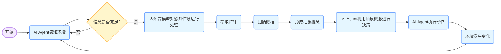

# LLM在AI Agent抽象概念形成中的应用

> 关键词：大语言模型（LLM）、AI Agent、抽象概念形成、人工智能、自然语言处理、认知智能、智能体架构

> 摘要：本文深入探讨了大语言模型（LLM）在AI Agent抽象概念形成中的应用。首先介绍了相关的背景知识，包括目的、预期读者等内容。接着阐述了LLM和AI Agent的核心概念及其联系，通过示意图和流程图进行清晰展示。详细讲解了核心算法原理及具体操作步骤，结合Python代码进行说明。还给出了相关的数学模型和公式，并举例解释。通过项目实战案例，展示了LLM在AI Agent抽象概念形成中的具体实现和代码解读。分析了其实际应用场景，推荐了学习、开发等方面的工具和资源。最后总结了未来发展趋势与挑战，解答了常见问题并提供了扩展阅读和参考资料，旨在全面深入地揭示LLM在AI Agent抽象概念形成中应用的技术原理、实现方法和发展前景。

## 1. 背景介绍 
### 1.1 目的和范围
本文章的目的在于全面且深入地研究大语言模型（LLM）在AI Agent抽象概念形成中的应用。随着人工智能技术的飞速发展，AI Agent在各个领域的应用日益广泛，而抽象概念的形成是AI Agent实现更高层次智能的关键。大语言模型凭借其强大的语言理解和生成能力，为AI Agent抽象概念的形成提供了新的思路和方法。本文将探讨LLM如何助力AI Agent从具体的感知信息中抽象出通用的概念，以及这种抽象概念形成对AI Agent性能和应用的影响。范围涵盖了从理论原理到实际应用的多个层面，包括核心概念的解释、算法原理的阐述、数学模型的构建、项目实战案例的分析以及未来发展趋势的展望等。

### 1.2 预期读者
本文预期读者包括人工智能领域的研究人员、开发者、技术爱好者以及相关专业的学生。对于研究人员来说，本文可以为他们的学术研究提供新的视角和研究方向；开发者可以从中获取实用的技术和实现方法，用于开发更智能的AI Agent系统；技术爱好者可以通过阅读本文，加深对人工智能前沿技术的理解；相关专业的学生则可以将其作为学习资料，拓宽知识面和视野。

### 1.3 文档结构概述
本文按照以下结构进行组织：首先介绍背景知识，包括目的、预期读者和文档结构概述等内容。接着阐述LLM和AI Agent的核心概念及其联系，通过文本示意图和Mermaid流程图进行清晰展示。然后详细讲解核心算法原理及具体操作步骤，结合Python代码进行说明。之后给出相关的数学模型和公式，并举例解释。通过项目实战案例，展示LLM在AI Agent抽象概念形成中的具体实现和代码解读。分析其实际应用场景，推荐学习、开发等方面的工具和资源。最后总结未来发展趋势与挑战，解答常见问题并提供扩展阅读和参考资料。

### 1.4 术语表
#### 1.4.1 核心术语定义
- **大语言模型（LLM）**：一种基于深度学习的语言模型，通过在大规模文本数据上进行训练，学习语言的统计规律和语义信息，能够生成自然流畅的文本，完成各种自然语言处理任务，如文本生成、问答系统、机器翻译等。
- **AI Agent**：即人工智能智能体，是一种能够感知环境、根据内部状态和目标进行决策，并通过执行动作来影响环境的智能实体。它可以是软件程序、机器人等不同形式。
- **抽象概念形成**：指从具体的感知信息或数据中提取出具有普遍性、概括性的概念的过程。在AI Agent中，抽象概念形成有助于提高智能体的认知能力和决策效率。

#### 1.4.2 相关概念解释
- **自然语言处理（NLP）**：是人工智能的一个重要领域，主要研究如何让计算机理解、处理和生成自然语言。大语言模型是自然语言处理中的一种重要技术。
- **认知智能**：人工智能发展的高级阶段，强调智能体具有像人类一样的认知能力，包括感知、理解、推理、学习等。抽象概念形成是认知智能的重要组成部分。
- **智能体架构**：指AI Agent的内部结构和组织方式，包括感知模块、决策模块、执行模块等。大语言模型可以集成到智能体架构中，用于辅助抽象概念的形成。

#### 1.4.3 缩略词列表
- **LLM**：Large Language Model（大语言模型）
- **AI**：Artificial Intelligence（人工智能）
- **NLP**：Natural Language Processing（自然语言处理）

## 2. 核心概念与联系 

### 核心概念原理
#### 大语言模型（LLM）原理
大语言模型通常基于Transformer架构，它通过多头自注意力机制来捕捉文本中的长距离依赖关系。Transformer架构由编码器和解码器组成（在一些模型中只有解码器，如GPT系列）。编码器将输入的文本序列转换为一系列的特征表示，解码器根据这些特征表示生成输出文本。训练大语言模型时，通常采用无监督学习的方式，使用大规模的文本数据进行预训练，学习语言的概率分布。在预训练的基础上，可以通过微调来适应特定的任务。

#### AI Agent原理
AI Agent是一个具有自主性、反应性、社会性和主动性的智能实体。它通过感知模块获取环境信息，将这些信息传递给决策模块。决策模块根据智能体的内部状态、目标和规则进行推理和决策，生成相应的动作。执行模块将决策模块生成的动作执行到环境中，从而影响环境。AI Agent的目标是在复杂的环境中实现特定的任务或达到特定的目标。

#### 抽象概念形成原理
抽象概念形成是一个从具体到一般的过程。在AI Agent中，通过对感知到的具体信息进行分析、归纳和概括，提取出具有普遍性的特征和规律，从而形成抽象概念。这些抽象概念可以帮助AI Agent更好地理解环境、进行推理和决策。例如，AI Agent在感知到多个不同形状、颜色的苹果后，通过分析它们的共同特征，形成“苹果”这个抽象概念。

### 架构的文本示意图
```plaintext
+----------------+        +-----------------+        +----------------+
|   大语言模型   |        |  AI Agent 架构  |        | 抽象概念形成  |
+----------------+        +-----------------+        +----------------+
| - 基于Transformer |        | - 感知模块     |        | - 具体信息分析 |
| - 多头自注意力机制 |        | - 决策模块     |        | - 特征提取    |
| - 预训练和微调   |        | - 执行模块     |        | - 归纳概括    |
+----------------+        +-----------------+        +----------------+
           |                        |                        |
           |                        |                        |
           |                        |                        |
           +------------------------+------------------------+
                                  |
                                  | 大语言模型辅助AI Agent进行抽象概念形成
                                  |
```

### Mermaid流程图


## 3. 核心算法原理 & 具体操作步骤 

### 核心算法原理
在LLM辅助AI Agent进行抽象概念形成的过程中，主要涉及到文本嵌入、特征提取和聚类算法。

#### 文本嵌入
文本嵌入是将文本转换为向量表示的过程。大语言模型可以输出文本的嵌入向量，这些向量包含了文本的语义信息。常用的文本嵌入方法有基于词向量的方法（如Word2Vec、GloVe）和基于Transformer的方法（如BERT、GPT）。以BERT为例，它通过预训练学习到了语言的深层语义信息，输入文本经过BERT模型后可以得到每个词的嵌入向量，将这些向量进行聚合（如取平均）就可以得到整个文本的嵌入向量。

#### 特征提取
在得到文本的嵌入向量后，需要从这些向量中提取出有用的特征。可以使用主成分分析（PCA）、线性判别分析（LDA）等降维算法来减少向量的维度，同时保留重要的特征信息。例如，PCA通过找到数据的主成分方向，将高维数据投影到低维空间中，从而实现降维。

#### 聚类算法
聚类算法用于将相似的文本嵌入向量划分到同一个类别中，从而形成抽象概念。常用的聚类算法有K-Means、DBSCAN等。K-Means算法通过迭代的方式将数据点划分到K个不同的簇中，使得簇内的数据点相似度较高，簇间的数据点相似度较低。

### 具体操作步骤及Python代码实现

#### 步骤1：安装必要的库
```python
!pip install transformers numpy scikit-learn
```

#### 步骤2：加载大语言模型并进行文本嵌入
```python
from transformers import AutoTokenizer, AutoModel
import torch
from sklearn.decomposition import PCA
from sklearn.cluster import KMeans

# 加载预训练的BERT模型和分词器
tokenizer = AutoTokenizer.from_pretrained('bert-base-uncased')
model = AutoModel.from_pretrained('bert-base-uncased')

# 示例文本
texts = ["An apple is a delicious fruit.", "A banana is a healthy fruit.", "A cat is a cute animal.", "A dog is a loyal animal."]

# 对文本进行分词和编码
inputs = tokenizer(texts, return_tensors='pt', padding=True, truncation=True)

# 输入到BERT模型中获取嵌入向量
with torch.no_grad():
    outputs = model(**inputs)

# 取[CLS]标记的嵌入向量作为整个文本的表示
embeddings = outputs.last_hidden_state[:, 0, :].numpy()
```

#### 步骤3：特征提取（降维）
```python
# 使用PCA进行降维
pca = PCA(n_components=2)
reduced_embeddings = pca.fit_transform(embeddings)
```

#### 步骤4：聚类形成抽象概念
```python
# 使用K-Means进行聚类
kmeans = KMeans(n_clusters=2)
labels = kmeans.fit_predict(reduced_embeddings)

# 输出聚类结果
for i in range(len(texts)):
    print(f"Text: {texts[i]}, Cluster: {labels[i]}")
```

### 代码解释
1. **安装必要的库**：安装`transformers`、`numpy`和`scikit-learn`库，`transformers`用于加载大语言模型，`numpy`用于数值计算，`scikit-learn`用于特征提取和聚类算法。
2. **加载大语言模型并进行文本嵌入**：使用`AutoTokenizer`和`AutoModel`从Hugging Face的模型库中加载预训练的BERT模型和分词器。对示例文本进行分词和编码，输入到BERT模型中获取嵌入向量，取[CLS]标记的嵌入向量作为整个文本的表示。
3. **特征提取（降维）**：使用PCA算法将高维的嵌入向量降维到二维，减少计算量并保留重要的特征信息。
4. **聚类形成抽象概念**：使用K-Means算法将降维后的嵌入向量划分到两个不同的簇中，根据聚类结果可以将文本分为不同的类别，从而形成抽象概念。

## 4. 数学模型和公式 & 详细讲解 & 举例说明 

### 文本嵌入的数学模型
#### 基于Transformer的文本嵌入
以BERT模型为例，输入文本 $X = [x_1, x_2, \cdots, x_n]$ 经过分词后得到词序列 $w = [w_1, w_2, \cdots, w_m]$。BERT模型由多个Transformer层组成，每个Transformer层包含多头自注意力机制和前馈神经网络。

在第 $l$ 层的多头自注意力机制中，输入的词向量 $h^{l - 1}$ 经过线性变换得到查询矩阵 $Q$、键矩阵 $K$ 和值矩阵 $V$：
$$Q = h^{l - 1}W^Q$$
$$K = h^{l - 1}W^K$$
$$V = h^{l - 1}W^V$$

其中 $W^Q$、$W^K$ 和 $W^V$ 是可学习的权重矩阵。多头自注意力机制的输出为：
$$\text{MultiHead}(Q, K, V) = \text{Concat}(\text{head}_1, \cdots, \text{head}_h)W^O$$

其中 $\text{head}_i = \text{Attention}(QW_i^Q, KW_i^K, VW_i^V)$，$\text{Attention}(Q, K, V) = \text{softmax}(\frac{QK^T}{\sqrt{d_k}})V$，$d_k$ 是查询和键的维度，$W^O$ 是可学习的权重矩阵。

经过多个Transformer层的处理后，得到最终的词向量表示 $h^L$。取[CLS]标记的词向量作为整个文本的嵌入向量 $e$。

### 特征提取的数学模型
#### 主成分分析（PCA）
给定 $n$ 个 $d$ 维的数据点 $X = [x_1, x_2, \cdots, x_n]^T$，PCA的目标是找到一组正交的基向量 $u_1, u_2, \cdots, u_d$，使得数据在这些基向量上的投影方差最大。

首先计算数据的协方差矩阵 $C$：
$$C = \frac{1}{n - 1}\sum_{i = 1}^{n}(x_i - \bar{x})(x_i - \bar{x})^T$$

其中 $\bar{x}$ 是数据的均值向量。然后对协方差矩阵 $C$ 进行特征值分解，得到特征值 $\lambda_1 \geq \lambda_2 \geq \cdots \geq \lambda_d$ 和对应的特征向量 $u_1, u_2, \cdots, u_d$。选择前 $k$ 个最大的特征值对应的特征向量 $u_1, u_2, \cdots, u_k$ 作为新的基向量，将数据投影到这些基向量上，得到降维后的数据 $Z$：
$$Z = XU_k$$

其中 $U_k = [u_1, u_2, \cdots, u_k]$。

### 聚类算法的数学模型
#### K-Means算法
K-Means算法的目标是将 $n$ 个数据点 $x_1, x_2, \cdots, x_n$ 划分到 $K$ 个不同的簇 $C_1, C_2, \cdots, C_K$ 中，使得簇内的数据点到簇中心的距离之和最小。

定义簇中心为 $\mu_1, \mu_2, \cdots, \mu_K$，每个数据点 $x_i$ 被分配到距离最近的簇中心所在的簇中：
$$c_i = \arg\min_{j = 1, \cdots, K} \|x_i - \mu_j\|^2$$

然后更新簇中心：
$$\mu_j = \frac{1}{|C_j|}\sum_{i: c_i = j} x_i$$

其中 $|C_j|$ 是簇 $C_j$ 中的数据点个数。重复上述步骤直到簇中心不再变化或达到最大迭代次数。

### 举例说明
假设我们有以下四个文本：
- $x_1$: "An apple is a delicious fruit."
- $x_2$: "A banana is a healthy fruit."
- $x_3$: "A cat is a cute animal."
- $x_4$: "A dog is a loyal animal."

通过BERT模型得到它们的嵌入向量 $e_1, e_2, e_3, e_4$，假设这些向量是四维的。然后使用PCA将这些向量降维到二维，得到降维后的向量 $z_1, z_2, z_3, z_4$。使用K-Means算法将这些降维后的向量划分到两个簇中，假设 $z_1$ 和 $z_2$ 被划分到簇 $C_1$，$z_3$ 和 $z_4$ 被划分到簇 $C_2$。可以将簇 $C_1$ 抽象为“水果”概念，簇 $C_2$ 抽象为“动物”概念。

## 5. 项目实战：代码实际案例和详细解释说明 

### 5.1  开发环境搭建
#### 硬件环境
- **处理器**：建议使用多核处理器，如Intel Core i7或更高版本，以提高计算速度。
- **内存**：至少8GB的内存，推荐16GB或更多，以确保能够处理大规模的数据和模型。
- **存储**：至少有50GB的可用存储空间，用于安装开发环境和存储数据、模型等文件。

#### 软件环境
- **操作系统**：可以选择Windows 10、Ubuntu 20.04或更高版本等常见操作系统。
- **Python环境**：安装Python 3.7或更高版本。可以使用Anaconda来管理Python环境，它可以方便地安装和管理各种Python库。
- **开发工具**：推荐使用PyCharm或Jupyter Notebook作为开发工具。PyCharm是一个功能强大的Python集成开发环境，提供了代码编辑、调试、版本控制等功能；Jupyter Notebook则适合进行交互式开发和数据分析。

#### 安装必要的库
在命令行中使用以下命令安装必要的库：
```bash
pip install transformers numpy scikit-learn pandas matplotlib
```

### 5.2  源代码详细实现和代码解读
#### 数据准备
```python
import pandas as pd

# 读取数据
data = pd.read_csv('text_data.csv')
texts = data['text'].tolist()
```
**代码解读**：使用`pandas`库读取包含文本数据的CSV文件，并将文本列转换为列表。

#### 文本嵌入
```python
from transformers import AutoTokenizer, AutoModel
import torch

# 加载预训练的BERT模型和分词器
tokenizer = AutoTokenizer.from_pretrained('bert-base-uncased')
model = AutoModel.from_pretrained('bert-base-uncased')

# 对文本进行分词和编码
inputs = tokenizer(texts, return_tensors='pt', padding=True, truncation=True)

# 输入到BERT模型中获取嵌入向量
with torch.no_grad():
    outputs = model(**inputs)

# 取[CLS]标记的嵌入向量作为整个文本的表示
embeddings = outputs.last_hidden_state[:, 0, :].numpy()
```
**代码解读**：使用`transformers`库加载预训练的BERT模型和分词器，对文本进行分词和编码，输入到BERT模型中获取嵌入向量，取[CLS]标记的嵌入向量作为整个文本的表示。

#### 特征提取（降维）
```python
from sklearn.decomposition import PCA

# 使用PCA进行降维
pca = PCA(n_components=2)
reduced_embeddings = pca.fit_transform(embeddings)
```
**代码解读**：使用`scikit-learn`库中的PCA算法将高维的嵌入向量降维到二维，减少计算量并保留重要的特征信息。

#### 聚类形成抽象概念
```python
from sklearn.cluster import KMeans
import matplotlib.pyplot as plt

# 使用K-Means进行聚类
kmeans = KMeans(n_clusters=3)
labels = kmeans.fit_predict(reduced_embeddings)

# 可视化聚类结果
plt.scatter(reduced_embeddings[:, 0], reduced_embeddings[:, 1], c=labels, cmap='viridis')
plt.title('Clustering Results')
plt.xlabel('Principal Component 1')
plt.ylabel('Principal Component 2')
plt.show()
```
**代码解读**：使用`scikit-learn`库中的K-Means算法将降维后的嵌入向量划分到三个不同的簇中，并使用`matplotlib`库将聚类结果可视化。

### 5.3  代码解读与分析
#### 数据准备阶段
通过`pandas`库读取CSV文件中的文本数据，将其转换为列表，方便后续处理。这一步骤是数据预处理的基础，确保数据的格式符合后续模型的输入要求。

#### 文本嵌入阶段
使用预训练的BERT模型将文本转换为向量表示。BERT模型通过在大规模文本数据上进行预训练，学习到了丰富的语言语义信息，能够将文本转换为具有语义意义的向量。取[CLS]标记的嵌入向量作为整个文本的表示，是因为[CLS]标记通常用于表示整个句子的语义信息。

#### 特征提取（降维）阶段
使用PCA算法将高维的嵌入向量降维到二维。高维数据在计算和可视化方面存在困难，通过降维可以减少计算量，同时保留数据的主要特征信息。PCA算法通过找到数据的主成分方向，将数据投影到低维空间中，实现降维的目的。

#### 聚类形成抽象概念阶段
使用K-Means算法将降维后的嵌入向量划分到不同的簇中。K-Means算法通过迭代的方式将数据点划分到K个不同的簇中，使得簇内的数据点相似度较高，簇间的数据点相似度较低。通过聚类结果可以将文本分为不同的类别，从而形成抽象概念。最后使用`matplotlib`库将聚类结果可视化，直观地展示聚类效果。

## 6. 实际应用场景 
### 智能客服系统
在智能客服系统中，AI Agent需要理解用户的问题并提供相应的答案。大语言模型可以帮助AI Agent从用户的自然语言问题中抽象出问题的核心概念，例如将用户的不同表述“我想查询订单状态”“订单进度怎么查看”等抽象为“查询订单状态”这一概念。然后AI Agent可以根据抽象概念快速匹配到相应的答案模板，提高客服效率和准确性。

### 智能推荐系统
在智能推荐系统中，AI Agent需要根据用户的历史行为和偏好进行个性化推荐。大语言模型可以辅助AI Agent从用户的浏览记录、搜索关键词等文本信息中抽象出用户的兴趣概念，例如将用户浏览的“苹果手机评测”“华为手机对比”等文本抽象为“手机”这一兴趣概念。然后AI Agent可以根据这些抽象概念为用户推荐相关的产品或内容。

### 机器人导航与交互
在机器人导航与交互场景中，AI Agent需要理解环境信息和用户指令。大语言模型可以帮助AI Agent从环境中的文本信息（如路标、标识等）和用户的自然语言指令中抽象出关键概念，例如将“向左转”“往右边走”等指令抽象为“方向”概念，将“餐厅”“超市”等标识抽象为“地点”概念。这样AI Agent可以更好地进行导航和与用户交互。

### 智能写作助手
在智能写作助手应用中，AI Agent可以利用大语言模型从用户输入的主题和相关描述中抽象出文章的核心概念和结构。例如，用户输入“介绍一款新手机”，AI Agent可以抽象出“手机品牌”“手机特点”“性能参数”等概念，然后根据这些概念生成文章的大纲和内容，辅助用户进行写作。

## 7. 工具和资源推荐
### 7.1 学习资源推荐
#### 7.1.1 书籍推荐
- 《深度学习》（Deep Learning）：由Ian Goodfellow、Yoshua Bengio和Aaron Courville合著，是深度学习领域的经典教材，全面介绍了深度学习的基本原理、算法和应用。
- 《自然语言处理入门》：作者何晗，这本书系统地介绍了自然语言处理的基础知识和常用技术，适合初学者入门。
- 《Python机器学习》（Python Machine Learning）：Sebastian Raschka和Vahid Mirjalili所著，详细介绍了Python在机器学习中的应用，包括各种机器学习算法的实现和案例分析。

#### 7.1.2 在线课程
- Coursera上的“深度学习专项课程”（Deep Learning Specialization）：由Andrew Ng教授授课，涵盖了深度学习的各个方面，包括神经网络、卷积神经网络、循环神经网络等。
- edX上的“自然语言处理基础”（Foundations of Natural Language Processing）：由哥伦比亚大学的教授授课，系统地介绍了自然语言处理的基本概念、算法和应用。
- 哔哩哔哩（B 站）上有很多关于人工智能和自然语言处理的免费教程，例如“李宏毅机器学习”系列课程，讲解生动易懂，适合初学者学习。

#### 7.1.3 技术博客和网站
- Hugging Face博客：提供了关于大语言模型和自然语言处理的最新技术和研究成果，还有很多实用的教程和案例。
- Medium上的人工智能和自然语言处理相关专栏：有很多行业专家和研究人员分享的技术文章和经验心得。
- arXiv.org：是一个预印本平台，提供了大量的人工智能和自然语言处理领域的研究论文，可以及时了解最新的研究动态。

### 7.2 开发工具框架推荐
#### 7.2.1 IDE和编辑器
- PyCharm：是一个功能强大的Python集成开发环境，提供了代码编辑、调试、版本控制等功能，适合开发大型的Python项目。
- Jupyter Notebook：是一个交互式的开发环境，适合进行数据分析、模型训练和实验。它可以将代码、文本、图表等内容整合在一个文档中，方便展示和分享。
- Visual Studio Code：是一个轻量级的代码编辑器，支持多种编程语言和插件，具有丰富的扩展功能，可以提高开发效率。

#### 7.2.2 调试和性能分析工具
- Py-Spy：是一个用于分析Python代码性能的工具，可以实时监控Python程序的CPU使用情况和函数调用栈，帮助开发者找出性能瓶颈。
- TensorBoard：是TensorFlow的可视化工具，可以用于可视化模型的训练过程、损失函数曲线、模型结构等，方便开发者进行调试和优化。
- PDB（Python Debugger）：是Python内置的调试工具，可以在代码中设置断点，单步执行代码，查看变量的值，帮助开发者快速定位和解决问题。

#### 7.2.3 相关框架和库
- Transformers：由Hugging Face开发的自然语言处理框架，提供了大量的预训练语言模型和工具，方便开发者进行文本分类、文本生成、问答系统等任务的开发。
- Scikit-learn：是一个常用的机器学习库，提供了各种机器学习算法的实现，包括分类、回归、聚类等，还提供了数据预处理、模型评估等工具。
- PyTorch：是一个开源的深度学习框架，具有动态计算图的特点，方便开发者进行模型的构建和训练，广泛应用于自然语言处理、计算机视觉等领域。

### 7.3 相关论文著作推荐
#### 7.3.1 经典论文
- “Attention Is All You Need”：介绍了Transformer架构，是大语言模型的基础，提出了多头自注意力机制，为自然语言处理带来了革命性的变化。
- “BERT: Pre-training of Deep Bidirectional Transformers for Language Understanding”：提出了BERT模型，通过双向预训练的方式学习语言的语义信息，在多个自然语言处理任务中取得了优异的成绩。
- “Generative Pretrained Transformer 3”（GPT-3）：介绍了GPT-3模型，具有强大的文本生成能力，展示了大语言模型在自然语言处理中的巨大潜力。

#### 7.3.2 最新研究成果
- 关注NeurIPS（神经信息处理系统大会）、ACL（计算语言学协会年会）、EMNLP（自然语言处理经验方法会议）等顶级学术会议的最新论文，这些会议汇聚了人工智能和自然语言处理领域的最新研究成果。
- 关注顶级学术期刊如Journal of Artificial Intelligence Research（JAIR）、Artificial Intelligence等，这些期刊发表的论文具有较高的学术水平和创新性。

#### 7.3.3 应用案例分析
- 可以参考一些实际应用案例的论文，例如关于智能客服系统、智能推荐系统等应用中使用大语言模型和AI Agent的案例分析。这些论文可以帮助开发者了解如何将理论知识应用到实际项目中，解决实际问题。

## 8. 总结：未来发展趋势与挑战
### 未来发展趋势
#### 多模态融合
未来的AI Agent将不仅仅依赖于文本信息，还会融合图像、音频、视频等多模态信息。大语言模型可以与计算机视觉、语音识别等技术相结合，从多模态数据中抽象出更全面、更准确的概念。例如，在智能机器人中，通过融合视觉和语言信息，机器人可以更好地理解环境和用户指令。

#### 个性化与自适应
随着对用户需求的深入理解，AI Agent将实现更加个性化和自适应的抽象概念形成。大语言模型可以根据用户的偏好、历史行为等信息，为每个用户定制不同的抽象概念表示和决策策略。例如，在智能推荐系统中，根据用户的个性化兴趣抽象出更精准的概念，提供更符合用户需求的推荐内容。

#### 知识增强与推理能力提升
大语言模型将与知识图谱等技术相结合，增强其知识表示和推理能力。通过将外部知识融入到抽象概念形成过程中，AI Agent可以进行更深入的推理和决策。例如，在智能问答系统中，结合知识图谱可以更准确地回答用户的问题，提供更丰富的信息。

#### 跨领域应用拓展
LLM在AI Agent抽象概念形成中的应用将拓展到更多的领域，如医疗、金融、教育等。在医疗领域，AI Agent可以从病历、医学文献等文本中抽象出疾病诊断、治疗方案等概念，辅助医生进行决策；在金融领域，AI Agent可以从市场数据、新闻报道等文本中抽象出经济趋势、投资风险等概念，为投资者提供参考。

### 挑战
#### 计算资源需求
大语言模型通常需要大量的计算资源进行训练和推理，这对硬件设备和计算成本提出了很高的要求。在实际应用中，如何在有限的计算资源下高效地运行大语言模型，是一个亟待解决的问题。

#### 数据质量与隐私问题
大语言模型的性能很大程度上依赖于训练数据的质量。数据中可能存在噪声、偏差等问题，会影响抽象概念的准确性。此外，数据隐私也是一个重要问题，在使用用户数据进行训练和推理时，需要确保数据的安全性和隐私性。

#### 语义理解的局限性
尽管大语言模型在语言处理方面取得了很大的进展，但在语义理解方面仍然存在一定的局限性。例如，对于一些模糊、隐喻、歧义的文本，大语言模型可能无法准确地抽象出概念。如何提高大语言模型的语义理解能力，是未来需要研究的方向。

#### 可解释性与可信度
大语言模型通常是一个黑盒模型，其决策过程和抽象概念形成机制难以解释。在一些关键应用场景中，如医疗、金融等，需要模型具有较高的可解释性和可信度。如何提高大语言模型的可解释性和可信度，是当前面临的一个挑战。

## 9. 附录：常见问题与解答
### 问题1：大语言模型在AI Agent抽象概念形成中一定能提高性能吗？
答：不一定。虽然大语言模型具有强大的语言理解和生成能力，但在AI Agent抽象概念形成中，其性能还受到多种因素的影响，如数据质量、模型选择、算法设计等。如果数据质量较差、模型不适合任务需求或算法设计不合理，大语言模型可能无法发挥其优势，甚至可能降低性能。

### 问题2：如何选择合适的大语言模型用于AI Agent抽象概念形成？
答：选择合适的大语言模型需要考虑多个因素。首先要考虑任务的需求，不同的任务对模型的能力要求不同，例如文本分类任务可能更注重模型的特征提取能力，而文本生成任务可能更注重模型的生成能力。其次要考虑数据的规模和特点，如果数据量较小，可以选择轻量级的模型；如果数据量较大，可以选择大规模的预训练模型。此外，还要考虑模型的计算资源需求和可扩展性。

### 问题3：在使用大语言模型进行文本嵌入时，如何处理长文本？
答：可以采用以下几种方法处理长文本。一种方法是对长文本进行分段处理，将长文本分割成多个较短的段落，分别进行文本嵌入，然后将这些嵌入向量进行聚合。另一种方法是使用支持长文本处理的大语言模型，如Longformer等，这些模型在设计上考虑了长文本的处理问题，能够更好地捕捉长文本中的语义信息。

### 问题4：聚类算法的簇数如何确定？
答：确定聚类算法的簇数是一个比较复杂的问题，没有一种通用的方法。可以采用以下几种方法进行尝试。一种方法是使用手肘法，通过计算不同簇数下的聚类误差（如簇内误差平方和），绘制误差曲线，找到曲线的拐点，该拐点对应的簇数即为合适的簇数。另一种方法是使用轮廓系数法，计算每个数据点的轮廓系数，平均轮廓系数最大的簇数即为合适的簇数。此外，还可以根据业务需求和领域知识来确定簇数。

### 问题5：大语言模型的训练和推理过程中会遇到哪些问题？
答：在训练过程中，可能会遇到梯度消失、梯度爆炸、过拟合、训练时间长等问题。可以采用一些技术来解决这些问题，如使用梯度裁剪、正则化、早停等方法。在推理过程中，可能会遇到计算资源不足、推理速度慢等问题。可以采用模型压缩、量化等技术来减少模型的计算量和存储量，提高推理速度。

## 10. 扩展阅读 & 参考资料
### 扩展阅读
- 《人工智能：现代方法》（Artificial Intelligence: A Modern Approach）：全面介绍了人工智能的各个方面，包括搜索算法、知识表示、机器学习、自然语言处理等，是人工智能领域的经典著作。
- 《神经网络与深度学习》：详细介绍了神经网络和深度学习的基本原理、算法和应用，适合深入学习相关知识。
- 关注一些人工智能领域的前沿研究成果和技术趋势，如OpenAI、DeepMind等机构的官方博客和研究论文。

### 参考资料
- Hugging Face官方文档：https://huggingface.co/docs
- Scikit-learn官方文档：https://scikit-learn.org/stable/documentation.html
- PyTorch官方文档：https://pytorch.org/docs/stable/index.html
- 相关学术论文和研究报告，可以通过学术数据库如IEEE Xplore、ACM Digital Library等进行查找。