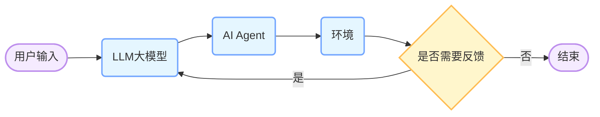

# LLM大模型在AI Agent开发中的核心作用

> 关键词：LLM大模型、AI Agent、自然语言处理、智能决策、核心作用

> 摘要：本文深入探讨了LLM大模型在AI Agent开发中的核心作用。首先介绍了相关背景知识，包括目的范围、预期读者等。接着阐述了LLM大模型与AI Agent的核心概念及联系，通过文本示意图和Mermaid流程图进行直观展示。详细讲解了核心算法原理和具体操作步骤，并用Python代码进行阐述。还介绍了相关数学模型和公式，并举例说明。通过项目实战展示了代码实现和解读，分析了实际应用场景。推荐了学习资源、开发工具框架和相关论文著作。最后总结了未来发展趋势与挑战，提供了常见问题解答和扩展阅读参考资料，旨在全面剖析LLM大模型对AI Agent开发的重要性和深远影响。

## 1. 背景介绍 
### 1.1 目的和范围
随着人工智能技术的飞速发展，AI Agent和LLM大模型成为了研究和应用的热点领域。本文的目的在于深入探讨LLM大模型在AI Agent开发过程中所起到的核心作用，揭示两者之间的内在联系和相互影响机制。范围涵盖了LLM大模型和AI Agent的基本概念、核心算法原理、数学模型、实际应用场景等多个方面，旨在为相关领域的研究人员、开发者和爱好者提供全面且深入的参考。

### 1.2 预期读者
本文预期读者包括但不限于人工智能领域的研究人员、软件开发工程师、数据科学家、对AI技术感兴趣的学生以及相关行业的从业者。无论您是想要深入了解LLM大模型和AI Agent的技术原理，还是希望在实际项目中应用这些技术，本文都将为您提供有价值的信息和思路。

### 1.3 文档结构概述
本文将按照以下结构进行阐述：首先介绍背景知识，包括目的范围、预期读者等；接着阐述LLM大模型与AI Agent的核心概念及联系；详细讲解核心算法原理和具体操作步骤；介绍相关数学模型和公式并举例说明；通过项目实战展示代码实现和解读；分析实际应用场景；推荐学习资源、开发工具框架和相关论文著作；最后总结未来发展趋势与挑战，提供常见问题解答和扩展阅读参考资料。

### 1.4 术语表
#### 1.4.1 核心术语定义
- **LLM大模型**：即大语言模型（Large Language Model），是基于深度学习技术训练的语言模型，具有庞大的参数规模，能够处理自然语言任务，如文本生成、问答系统等。
- **AI Agent**：即人工智能智能体，是一种能够感知环境、进行决策并采取行动以实现特定目标的智能实体。

#### 1.4.2 相关概念解释
- **自然语言处理（NLP）**：是人工智能的一个重要分支，致力于让计算机能够理解、处理和生成人类语言。
- **深度学习**：是一种基于人工神经网络的机器学习方法，通过构建多层神经网络来学习数据的特征和模式。

#### 1.4.3 缩略词列表
- **LLM**：Large Language Model（大语言模型）
- **AI**：Artificial Intelligence（人工智能）
- **NLP**：Natural Language Processing（自然语言处理）

## 2. 核心概念与联系 

### 2.1 LLM大模型的核心概念
LLM大模型是近年来自然语言处理领域的重大突破。它基于Transformer架构，通过在大规模文本数据上进行无监督学习，学习到了丰富的语言知识和语义信息。LLM大模型的主要特点包括：
- **参数规模庞大**：拥有数十亿甚至上万亿的参数，能够捕捉到更复杂的语言模式。
- **强大的语言理解和生成能力**：可以进行文本生成、文本分类、问答系统等多种自然语言处理任务。

### 2.2 AI Agent的核心概念
AI Agent是一个具有自主性、反应性、社会性和能动性的智能实体。它能够感知周围环境的信息，根据自身的目标和知识进行决策，并采取相应的行动来实现目标。AI Agent通常由以下几个部分组成：
- **感知模块**：负责收集环境信息。
- **决策模块**：根据感知信息和目标进行决策。
- **行动模块**：执行决策模块制定的行动方案。

### 2.3 LLM大模型与AI Agent的联系
LLM大模型在AI Agent开发中具有核心作用。具体表现在以下几个方面：
- **语言理解和交互**：LLM大模型可以帮助AI Agent更好地理解人类语言，实现自然流畅的人机交互。
- **知识获取和推理**：LLM大模型中蕴含的丰富知识可以为AI Agent提供知识支持，辅助其进行推理和决策。
- **任务规划和执行**：LLM大模型可以根据用户需求生成任务规划，指导AI Agent的行动。

### 2.4 文本示意图
LLM大模型与AI Agent的联系可以用以下文本示意图表示：

```plaintext
用户输入 ----> LLM大模型（语言理解、知识获取） ----> AI Agent（决策、行动） ----> 环境（反馈） ----> LLM大模型（更新、优化）
```

### 2.5 Mermaid流程图


## 3. 核心算法原理 & 具体操作步骤 

### 3.1 LLM大模型的核心算法原理
LLM大模型主要基于Transformer架构，Transformer架构由编码器和解码器组成。编码器负责对输入的文本进行编码，提取文本的特征表示；解码器则根据编码器的输出和之前生成的文本，生成下一个单词。

以下是Transformer架构中自注意力机制的Python代码实现：

```python
import torch
import torch.nn as nn
import torch.nn.functional as F

class SelfAttention(nn.Module):
    def __init__(self, embed_size, heads):
        super(SelfAttention, self).__init__()
        self.embed_size = embed_size
        self.heads = heads
        self.head_dim = embed_size // heads

        assert (
            self.head_dim * heads == embed_size
        ), "Embedding size needs to be divisible by heads"

        self.values = nn.Linear(self.head_dim, self.head_dim, bias=False)
        self.keys = nn.Linear(self.head_dim, self.head_dim, bias=False)
        self.queries = nn.Linear(self.head_dim, self.head_dim, bias=False)
        self.fc_out = nn.Linear(heads * self.head_dim, embed_size)

    def forward(self, values, keys, query, mask):
        N = query.shape[0]
        value_len, key_len, query_len = values.shape[1], keys.shape[1], query.shape[1]

        # Split the embedding into self.heads different pieces
        values = values.reshape(N, value_len, self.heads, self.head_dim)
        keys = keys.reshape(N, key_len, self.heads, self.head_dim)
        queries = query.reshape(N, query_len, self.heads, self.head_dim)

        values = self.values(values)
        keys = self.keys(keys)
        queries = self.queries(queries)

        # Scaled dot-product attention
        energy = torch.einsum("nqhd,nkhd->nhqk", [queries, keys])
        if mask is not None:
            energy = energy.masked_fill(mask == 0, float("-1e20"))

        attention = torch.softmax(energy / (self.embed_size ** (1 / 2)), dim=3)

        out = torch.einsum("nhql,nlhd->nqhd", [attention, values]).reshape(
            N, query_len, self.heads * self.head_dim
        )

        out = self.fc_out(out)
        return out
```

### 3.2 AI Agent的决策算法原理
AI Agent的决策算法通常基于强化学习或规划算法。强化学习通过智能体与环境的交互，不断尝试不同的行动，根据环境的反馈来学习最优的行动策略。

以下是一个简单的基于Q-learning的AI Agent决策算法的Python代码实现：

```python
import numpy as np

class QLearningAgent:
    def __init__(self, state_size, action_size, learning_rate=0.1, discount_factor=0.9, epsilon=0.1):
        self.state_size = state_size
        self.action_size = action_size
        self.learning_rate = learning_rate
        self.discount_factor = discount_factor
        self.epsilon = epsilon
        self.q_table = np.zeros((state_size, action_size))

    def choose_action(self, state):
        if np.random.uniform(0, 1) < self.epsilon:
            action = np.random.choice(self.action_size)
        else:
            action = np.argmax(self.q_table[state, :])
        return action

    def update_q_table(self, state, action, reward, next_state):
        predict = self.q_table[state, action]
        target = reward + self.discount_factor * np.max(self.q_table[next_state, :])
        self.q_table[state, action] = (1 - self.learning_rate) * predict + self.learning_rate * target
```

### 3.3 具体操作步骤
1. **数据准备**：收集和整理用于训练LLM大模型和AI Agent的数据，包括文本数据、环境状态数据等。
2. **LLM大模型训练**：使用大规模文本数据对LLM大模型进行预训练，然后根据具体任务进行微调。
3. **AI Agent设计**：设计AI Agent的感知模块、决策模块和行动模块，将LLM大模型集成到AI Agent的决策过程中。
4. **训练和优化**：使用强化学习或其他优化算法对AI Agent进行训练和优化，不断调整其行为策略。
5. **测试和评估**：对训练好的AI Agent进行测试和评估，根据评估结果进行进一步的优化和改进。

## 4. 数学模型和公式 & 详细讲解 & 举例说明 

### 4.1 LLM大模型的数学模型和公式
#### 4.1.1 自注意力机制的数学公式
自注意力机制是Transformer架构的核心，其数学公式如下：

$$Attention(Q, K, V) = softmax(\frac{QK^T}{\sqrt{d_k}})V$$

其中，$Q$ 是查询矩阵，$K$ 是键矩阵，$V$ 是值矩阵，$d_k$ 是键向量的维度。

详细讲解：自注意力机制通过计算查询向量与键向量的相似度，得到每个值向量的权重，然后对值向量进行加权求和，得到最终的输出。$\frac{QK^T}{\sqrt{d_k}}$ 是为了防止点积结果过大，导致softmax函数的梯度消失。

举例说明：假设我们有一个输入序列 $x = [x_1, x_2, x_3]$，经过线性变换得到查询矩阵 $Q$、键矩阵 $K$ 和值矩阵 $V$。计算 $QK^T$ 得到一个相似度矩阵，对其进行softmax操作得到权重矩阵，最后将权重矩阵与值矩阵相乘得到输出。

#### 4.1.2 Transformer架构的损失函数
Transformer架构通常使用交叉熵损失函数进行训练，其数学公式如下：

$$L = -\sum_{i=1}^{N} \sum_{j=1}^{C} y_{ij} \log(p_{ij})$$

其中，$N$ 是样本数量，$C$ 是类别数量，$y_{ij}$ 是真实标签，$p_{ij}$ 是预测概率。

详细讲解：交叉熵损失函数衡量了真实标签与预测概率之间的差异，通过最小化损失函数来优化模型的参数。

举例说明：在文本分类任务中，假设我们有一个样本的真实标签是 $[0, 1, 0]$，模型的预测概率是 $[0.1, 0.8, 0.1]$，则该样本的交叉熵损失为 $-(0 \log(0.1) + 1 \log(0.8) + 0 \log(0.1))$。

### 4.2 AI Agent的数学模型和公式
#### 4.2.1 Q-learning的数学公式
Q-learning是一种基于值函数的强化学习算法，其数学公式如下：

$$Q(s, a) \leftarrow Q(s, a) + \alpha [r + \gamma \max_{a'} Q(s', a') - Q(s, a)]$$

其中，$Q(s, a)$ 是状态 $s$ 下采取行动 $a$ 的Q值，$\alpha$ 是学习率，$r$ 是奖励，$\gamma$ 是折扣因子，$s'$ 是下一个状态。

详细讲解：Q-learning通过不断更新Q值来学习最优的行动策略。$r + \gamma \max_{a'} Q(s', a')$ 是目标Q值，$Q(s, a)$ 是当前Q值，两者的差值乘以学习率 $\alpha$ 就是Q值的更新量。

举例说明：假设我们有一个AI Agent在一个迷宫中，当前状态 $s$ 下采取行动 $a$ 得到奖励 $r = 1$，下一个状态 $s'$ 的最大Q值是 $\max_{a'} Q(s', a') = 2$，当前Q值 $Q(s, a) = 1$，学习率 $\alpha = 0.1$，折扣因子 $\gamma = 0.9$，则更新后的Q值为 $Q(s, a) = 1 + 0.1 [1 + 0.9 \times 2 - 1] = 1.18$。

## 5. 项目实战：代码实际案例和详细解释说明 

### 5.1  开发环境搭建
1. **安装Python**：推荐使用Python 3.7及以上版本。
2. **安装深度学习框架**：可以选择PyTorch或TensorFlow，这里以PyTorch为例。使用以下命令安装PyTorch：
```bash
pip install torch torchvision
```
3. **安装其他依赖库**：根据具体项目需求安装其他依赖库，如numpy、matplotlib等。

### 5.2  源代码详细实现和代码解读
以下是一个简单的基于LLM大模型和AI Agent的对话系统的代码实现：

```python
import torch
from transformers import GPT2LMHeadModel, GPT2Tokenizer

# 加载LLM大模型和分词器
tokenizer = GPT2Tokenizer.from_pretrained("gpt2")
model = GPT2LMHeadModel.from_pretrained("gpt2")

# 定义AI Agent类
class ChatAgent:
    def __init__(self, model, tokenizer):
        self.model = model
        self.tokenizer = tokenizer

    def generate_response(self, input_text):
        input_ids = self.tokenizer.encode(input_text, return_tensors="pt")
        output = self.model.generate(input_ids, max_length=100, num_beams=5, no_repeat_ngram_size=2, early_stopping=True)
        response = self.tokenizer.decode(output[0], skip_special_tokens=True)
        return response

# 创建AI Agent实例
agent = ChatAgent(model, tokenizer)

# 与AI Agent进行对话
while True:
    user_input = input("你: ")
    if user_input.lower() == "退出":
        break
    response = agent.generate_response(user_input)
    print("AI Agent: ", response)
```

代码解读：
1. **加载LLM大模型和分词器**：使用Hugging Face的transformers库加载GPT2大模型和对应的分词器。
2. **定义AI Agent类**：`ChatAgent` 类包含一个 `generate_response` 方法，用于根据用户输入生成回复。
3. **创建AI Agent实例**：实例化 `ChatAgent` 类，得到一个AI Agent对象。
4. **与AI Agent进行对话**：通过一个循环不断接收用户输入，调用AI Agent的 `generate_response` 方法生成回复，并打印输出。

### 5.3  代码解读与分析
- **优点**：该代码实现了一个简单的对话系统，利用了LLM大模型的强大语言生成能力，能够生成自然流畅的回复。
- **缺点**：该代码只是一个简单的示例，没有考虑到对话的上下文信息，也没有对生成的回复进行过滤和优化。
- **改进方向**：可以引入对话管理模块，维护对话的上下文信息，提高对话的连贯性；可以使用强化学习等方法对生成的回复进行优化，提高回复的质量。

## 6. 实际应用场景 
### 6.1 智能客服
在智能客服场景中，LLM大模型可以帮助AI Agent更好地理解用户的问题，根据用户的问题生成准确、自然的回复。AI Agent可以根据用户的反馈进行学习和优化，不断提高服务质量。

### 6.2 智能写作助手
在智能写作助手场景中，LLM大模型可以为AI Agent提供丰富的语言知识和创意灵感。AI Agent可以根据用户的需求生成文章的大纲、段落内容等，帮助用户提高写作效率和质量。

### 6.3 智能教育
在智能教育场景中，LLM大模型可以帮助AI Agent理解学生的问题和需求，为学生提供个性化的学习建议和辅导。AI Agent可以根据学生的学习情况进行动态调整，提高教学效果。

### 6.4 智能家居控制
在智能家居控制场景中，LLM大模型可以帮助AI Agent理解用户的语音指令，将用户的指令转换为具体的控制动作。AI Agent可以根据环境的变化自动调整家居设备的状态，提高家居的智能化水平。

## 7. 工具和资源推荐
### 7.1 学习资源推荐
#### 7.1.1 书籍推荐
- 《深度学习》（Deep Learning）：由Ian Goodfellow、Yoshua Bengio和Aaron Courville合著，是深度学习领域的经典教材。
- 《自然语言处理入门》（Natural Language Processing in Action）：由Hobson Lane、Cole Howard和Hugo Bowne-Anderson合著，介绍了自然语言处理的基本概念和方法。
- 《强化学习：原理与Python实现》：由张伟楠、沈键、俞扬合著，系统地介绍了强化学习的理论和实践。

#### 7.1.2 在线课程
- Coursera上的“深度学习专项课程”（Deep Learning Specialization）：由Andrew Ng教授授课，涵盖了深度学习的各个方面。
- edX上的“自然语言处理”（Natural Language Processing）：由哥伦比亚大学的教授授课，介绍了自然语言处理的最新技术和应用。
- OpenAI的“强化学习基础”（Fundamentals of Reinforcement Learning）：介绍了强化学习的基本概念和算法。

#### 7.1.3 技术博客和网站
- Hugging Face的博客（https://huggingface.co/blog）：提供了关于自然语言处理和大语言模型的最新研究和应用。
- OpenAI的官方网站（https://openai.com/）：发布了关于人工智能的最新研究成果和技术进展。
- Medium上的人工智能相关博客：有很多优秀的人工智能技术博客，如Towards Data Science等。

### 7.2 开发工具框架推荐
#### 7.2.1 IDE和编辑器
- PyCharm：是一款专业的Python集成开发环境，提供了丰富的功能和插件，适合Python开发。
- Visual Studio Code：是一款轻量级的代码编辑器，支持多种编程语言，有丰富的插件生态系统。

#### 7.2.2 调试和性能分析工具
- PyTorch Profiler：是PyTorch提供的性能分析工具，可以帮助开发者分析模型的性能瓶颈。
- TensorBoard：是TensorFlow提供的可视化工具，可以帮助开发者可视化模型的训练过程和性能指标。

#### 7.2.3 相关框架和库
- Hugging Face的transformers库：提供了丰富的预训练语言模型和工具，方便开发者进行自然语言处理任务。
- Stable Baselines3：是一个基于PyTorch的强化学习库，提供了多种强化学习算法的实现。

### 7.3 相关论文著作推荐
#### 7.3.1 经典论文
- “Attention Is All You Need”：提出了Transformer架构，是自然语言处理领域的经典论文。
- “Playing Atari with Deep Reinforcement Learning”：首次将深度强化学习应用于Atari游戏，开启了深度强化学习的新时代。

#### 7.3.2 最新研究成果
- 关注顶级学术会议如NeurIPS、ICML、ACL等的最新论文，了解LLM大模型和AI Agent的最新研究进展。

#### 7.3.3 应用案例分析
- 一些知名公司和研究机构发布的应用案例报告，如OpenAI的GPT系列应用案例、Google的AI Agent应用案例等。

## 8. 总结：未来发展趋势与挑战
### 8.1 未来发展趋势
- **多模态融合**：LLM大模型将与图像、语音等多模态数据进行融合，使AI Agent能够处理更加复杂的任务，如视频理解、跨模态对话等。
- **个性化和自适应**：AI Agent将能够根据用户的个性化需求和偏好进行定制化服务，并且能够在不同的环境和任务中自适应地调整行为策略。
- **自主学习和进化**：AI Agent将具备更强的自主学习能力，能够在不断的交互和实践中自动学习和进化，提高自身的智能水平。

### 8.2 挑战
- **数据隐私和安全**：LLM大模型和AI Agent需要处理大量的用户数据，如何保证数据的隐私和安全是一个重要的挑战。
- **可解释性和透明度**：LLM大模型和AI Agent的决策过程往往是黑盒的，如何提高其可解释性和透明度，让用户理解其决策依据是一个亟待解决的问题。
- **伦理和社会影响**：AI Agent的广泛应用可能会对社会和伦理产生影响，如就业结构的变化、道德决策等，需要建立相应的伦理准则和法律法规来规范其发展。

## 9. 附录：常见问题与解答
### 9.1 LLM大模型的训练成本高吗？
LLM大模型的训练成本通常比较高，主要包括计算资源成本、数据存储成本和时间成本等。训练一个大规模的LLM大模型需要使用大量的GPU或TPU等计算资源，并且需要花费数周甚至数月的时间。

### 9.2 AI Agent的性能如何评估？
AI Agent的性能评估可以从多个方面进行，如任务完成率、准确率、效率、用户满意度等。不同的应用场景可能需要采用不同的评估指标。

### 9.3 LLM大模型和AI Agent的结合有哪些技术难点？
LLM大模型和AI Agent的结合存在一些技术难点，如如何将LLM大模型的语言知识有效地集成到AI Agent的决策过程中，如何处理LLM大模型的不确定性和错误，如何提高AI Agent的实时性和响应速度等。

## 10. 扩展阅读 & 参考资料
- 《人工智能：一种现代的方法》（Artificial Intelligence: A Modern Approach），作者：Stuart Russell、Peter Norvig
- 《深度学习实战》（Deep Learning in Practice），作者：Josh Patterson、Adam Gibson
- Hugging Face官方文档（https://huggingface.co/docs）
- OpenAI官方文档（https://platform.openai.com/docs）
- 相关学术会议论文集，如NeurIPS、ICML、ACL等的会议论文。