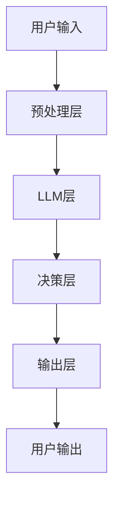

# LLM支持的AI Agent语义理解优化

> 关键词：LLM、AI Agent、语义理解、优化策略、自然语言处理

> 摘要：本文聚焦于LLM（大语言模型）支持的AI Agent语义理解优化。随着人工智能技术的飞速发展，AI Agent在众多领域发挥着关键作用，而语义理解能力是其核心竞争力之一。LLM的出现为AI Agent的语义理解带来了新的机遇和挑战。文章深入探讨了LLM支持的AI Agent语义理解的核心概念、算法原理、数学模型等内容，并通过项目实战展示了具体的优化实现过程。同时，分析了其实际应用场景，推荐了相关的工具和资源，最后对未来发展趋势与挑战进行了总结，旨在为相关领域的研究和实践提供全面且深入的参考。

## 1. 背景介绍 
### 1.1 目的和范围
随着自然语言处理技术的不断进步，大语言模型（LLM）如GPT系列、BERT等取得了显著的成果。基于LLM的AI Agent在智能客服、智能写作、知识问答等领域得到了广泛应用。然而，当前AI Agent在语义理解方面仍存在诸多问题，如对复杂语义的理解不准确、上下文感知不足等。本文的目的在于深入研究如何优化LLM支持的AI Agent的语义理解能力，通过理论分析和实践案例，探讨有效的优化策略和方法。范围涵盖了从核心概念的阐述到实际应用场景的分析，以及相关工具和资源的推荐等多个方面。

### 1.2 预期读者
本文预期读者包括人工智能领域的研究人员、开发者、数据科学家，以及对自然语言处理、AI Agent技术感兴趣的技术爱好者。对于正在从事相关项目开发的专业人士，本文提供了详细的技术原理和实践指导；对于初学者，能够帮助他们建立对LLM支持的AI Agent语义理解优化的全面认识。

### 1.3 文档结构概述
本文首先介绍了相关的背景知识，包括目的、预期读者和文档结构概述等。接着阐述了核心概念与联系，包括LLM、AI Agent和语义理解的原理和架构，并通过Mermaid流程图进行展示。然后详细讲解了核心算法原理和具体操作步骤，使用Python源代码进行阐述。随后介绍了数学模型和公式，并进行详细讲解和举例说明。在项目实战部分，展示了开发环境搭建、源代码详细实现和代码解读。之后分析了实际应用场景，推荐了相关的工具和资源。最后对未来发展趋势与挑战进行了总结，并提供了常见问题与解答以及扩展阅读和参考资料。

### 1.4 术语表
#### 1.4.1 核心术语定义
- **LLM（大语言模型）**：是一种基于深度学习的语言模型，通过在大规模文本数据上进行训练，学习语言的模式和规律，能够生成自然语言文本、进行问答等任务。
- **AI Agent（人工智能智能体）**：是一种能够感知环境、进行决策并采取行动的智能实体，在自然语言处理场景中，AI Agent可以理解用户的语言输入并做出相应的回应。
- **语义理解**：指的是对自然语言文本的含义进行分析和解释的过程，包括对词汇、句子、篇章等不同层次的语义理解。

#### 1.4.2 相关概念解释
- **上下文感知**：指的是AI Agent在理解当前文本时，能够结合前后文的信息，更好地把握文本的语义。例如，在对话中，能够根据之前的对话内容理解当前句子的含义。
- **多模态语义理解**：除了文本信息外，还能结合图像、语音等其他模态的信息进行语义理解，以提高理解的准确性和全面性。

#### 1.4.3 缩略词列表
- **LLM**：Large Language Model（大语言模型）
- **AI**：Artificial Intelligence（人工智能）
- **NLP**：Natural Language Processing（自然语言处理）

## 2. 核心概念与联系 

### 核心概念原理
#### LLM原理
LLM通常基于Transformer架构，通过自注意力机制学习文本中的长距离依赖关系。Transformer架构由编码器和解码器组成，编码器将输入的文本序列转换为一系列的特征向量，解码器根据这些特征向量生成输出文本。例如，GPT系列模型是基于解码器的语言模型，通过不断预测下一个词来生成文本；BERT模型是基于编码器的语言模型，通过掩码语言模型（Masked Language Model）和下一句预测（Next Sentence Prediction）任务进行预训练，学习文本的语义表示。

#### AI Agent原理
AI Agent可以看作是一个智能的决策系统，它接收环境的输入，通过内部的决策机制进行推理和判断，然后采取相应的行动。在自然语言处理场景中，AI Agent接收用户的语言输入，利用LLM进行语义理解，根据理解的结果生成回应并输出。

#### 语义理解原理
语义理解是一个复杂的过程，涉及到词汇、语法、语义等多个层面的分析。在基于LLM的AI Agent中，语义理解主要通过以下步骤实现：首先，将输入的文本进行分词处理，将其转换为一系列的词元（tokens）；然后，将词元输入到LLM中，LLM根据其预训练的语言模型对词元进行编码，得到相应的特征向量；最后，通过对特征向量的分析和处理，提取文本的语义信息。

### 架构的文本示意图
LLM支持的AI Agent语义理解架构主要包括以下几个部分：
1. **输入层**：接收用户的自然语言输入，如文本、语音等。
2. **预处理层**：对输入进行预处理，如分词、词性标注、命名实体识别等。
3. **LLM层**：利用大语言模型对预处理后的输入进行编码，提取语义特征。
4. **决策层**：根据LLM提取的语义特征，结合AI Agent的任务目标和策略，进行决策和推理。
5. **输出层**：将决策层的结果转换为自然语言输出，如文本回复、语音播报等。

### Mermaid流程图


## 3. 核心算法原理 & 具体操作步骤 

### 核心算法原理
在LLM支持的AI Agent语义理解中，核心算法主要包括词元化算法、Transformer架构和注意力机制等。

#### 词元化算法
词元化是将输入的文本转换为一系列词元的过程。常见的词元化算法有基于规则的算法和基于统计的算法。例如，Byte Pair Encoding（BPE）是一种基于统计的词元化算法，它通过不断合并出现频率最高的字符对，将文本逐步分割为词元。

#### Transformer架构
Transformer架构是LLM的核心，它由多个编码器和解码器层组成。每个编码器层包含多头自注意力机制和前馈神经网络，解码器层除了这些组件外，还包含一个编码器 - 解码器注意力机制。多头自注意力机制可以让模型在不同的表示子空间中关注输入序列的不同部分，从而提高模型的表达能力。

#### 注意力机制
注意力机制是Transformer架构的关键，它可以让模型在处理每个词元时，动态地关注输入序列中的其他词元。注意力分数的计算通常使用点积注意力公式：
$$
\text{Attention}(Q, K, V) = \text{softmax}(\frac{QK^T}{\sqrt{d_k}})V
$$
其中，$Q$ 是查询矩阵，$K$ 是键矩阵，$V$ 是值矩阵，$d_k$ 是键的维度。

### 具体操作步骤
以下是使用Python和Hugging Face的Transformers库实现一个简单的基于LLM的语义理解示例的具体操作步骤：

#### 步骤1：安装必要的库
```python
pip install transformers
```

#### 步骤2：加载预训练的LLM模型
```python
from transformers import AutoTokenizer, AutoModelForSequenceClassification

# 加载预训练的模型和分词器
model_name = "distilbert-base-uncased-finetuned-sst-2-english"
tokenizer = AutoTokenizer.from_pretrained(model_name)
model = AutoModelForSequenceClassification.from_pretrained(model_name)
```

#### 步骤3：对输入文本进行分词
```python
text = "This movie is really great!"
inputs = tokenizer(text, return_tensors="pt")
```

#### 步骤4：使用模型进行推理
```python
outputs = model(**inputs)
logits = outputs.logits
```

#### 步骤5：获取预测结果
```python
import torch

predicted_class_id = logits.argmax().item()
label = model.config.id2label[predicted_class_id]
print(f"Predicted label: {label}")
```

## 4. 数学模型和公式 & 详细讲解 & 举例说明 

### 数学模型
在LLM支持的AI Agent语义理解中，主要的数学模型包括语言模型和分类模型。

#### 语言模型
语言模型的目标是预测给定文本序列的下一个词的概率。常见的语言模型损失函数是交叉熵损失函数，用于衡量模型预测的概率分布与真实概率分布之间的差异。交叉熵损失函数的公式为：
$$
L = -\sum_{i=1}^{N} y_i \log(p_i)
$$
其中，$y_i$ 是真实标签的概率，$p_i$ 是模型预测的概率，$N$ 是词汇表的大小。

#### 分类模型
在语义理解中，分类模型用于对文本进行分类，如情感分类、主题分类等。分类模型通常使用Softmax函数将模型的输出转换为概率分布，Softmax函数的公式为：
$$
\text{Softmax}(x_i) = \frac{e^{x_i}}{\sum_{j=1}^{K} e^{x_j}}
$$
其中，$x_i$ 是模型的第 $i$ 个输出，$K$ 是类别数。

### 详细讲解
#### 交叉熵损失函数
交叉熵损失函数是一种常用的损失函数，用于衡量两个概率分布之间的差异。在语言模型中，真实概率分布通常是一个one - hot向量，即只有一个位置为1，其他位置为0。模型预测的概率分布是通过Softmax函数计算得到的。交叉熵损失函数的作用是最小化模型预测的概率分布与真实概率分布之间的差异，从而使模型的预测更加准确。

#### Softmax函数
Softmax函数将模型的输出转换为概率分布，使得所有输出的概率之和为1。这样可以方便地进行分类任务，通过选择概率最大的类别作为预测结果。

### 举例说明
假设我们有一个三分类任务，模型的输出为 $[2, 1, 0]$。首先，使用Softmax函数计算每个类别的概率：
$$
\text{Softmax}(2) = \frac{e^{2}}{e^{2} + e^{1} + e^{0}} \approx 0.67
$$
$$
\text{Softmax}(1) = \frac{e^{1}}{e^{2} + e^{1} + e^{0}} \approx 0.24
$$
$$
\text{Softmax}(0) = \frac{e^{0}}{e^{2} + e^{1} + e^{0}} \approx 0.09
$$
根据计算结果，我们可以选择概率最大的类别（这里是第一个类别）作为预测结果。

## 5. 项目实战：代码实际案例和详细解释说明 

### 5.1  开发环境搭建
#### 操作系统
可以选择Windows、Linux或macOS作为开发环境。建议使用Linux系统，因为它在深度学习开发中具有更好的兼容性和性能。

#### 编程语言
使用Python作为开发语言，Python具有丰富的深度学习库和工具，非常适合进行自然语言处理任务。

#### 深度学习框架
使用PyTorch作为深度学习框架，PyTorch具有动态计算图的特点，易于调试和开发。同时，安装Hugging Face的Transformers库，它提供了丰富的预训练模型和工具，方便进行自然语言处理任务。

#### 安装依赖库
```bash
pip install torch transformers datasets
```

### 5.2  源代码详细实现和代码解读
以下是一个基于Hugging Face的Transformers库实现的文本分类项目，用于优化AI Agent的语义理解能力。

```python
from datasets import load_dataset
from transformers import AutoTokenizer, AutoModelForSequenceClassification, TrainingArguments, Trainer
import numpy as np

# 步骤1：加载数据集
dataset = load_dataset("imdb")

# 步骤2：加载预训练的模型和分词器
model_name = "distilbert-base-uncased"
tokenizer = AutoTokenizer.from_pretrained(model_name)
model = AutoModelForSequenceClassification.from_pretrained(model_name, num_labels=2)

# 步骤3：定义数据预处理函数
def preprocess_function(examples):
    return tokenizer(examples["text"], truncation=True, padding="max_length", max_length=128)

# 步骤4：对数据集进行预处理
tokenized_dataset = dataset.map(preprocess_function, batched=True)

# 步骤5：定义训练参数
training_args = TrainingArguments(
    output_dir="./results",
    num_train_epochs=3,
    per_device_train_batch_size=16,
    per_device_eval_batch_size=64,
    warmup_steps=500,
    weight_decay=0.01,
    logging_dir="./logs",
    logging_steps=10,
    evaluation_strategy="steps",
    eval_steps=500,
    save_steps=500
)

# 步骤6：定义评估指标
def compute_metrics(eval_pred):
    logits, labels = eval_pred
    predictions = np.argmax(logits, axis=-1)
    accuracy = np.mean(predictions == labels)
    return {"accuracy": accuracy}

# 步骤7：创建Trainer对象
trainer = Trainer(
    model=model,
    args=training_args,
    train_dataset=tokenized_dataset["train"],
    eval_dataset=tokenized_dataset["test"],
    compute_metrics=compute_metrics
)

# 步骤8：训练模型
trainer.train()

# 步骤9：评估模型
results = trainer.evaluate()
print(results)
```

### 5.3  代码解读与分析
#### 步骤1：加载数据集
使用 `datasets` 库加载IMDB电影评论数据集，该数据集包含电影评论和对应的情感标签（正面或负面）。

#### 步骤2：加载预训练的模型和分词器
使用 `AutoTokenizer` 和 `AutoModelForSequenceClassification` 从Hugging Face的模型库中加载预训练的DistilBERT模型和对应的分词器。`num_labels=2` 表示分类任务的类别数为2（正面和负面）。

#### 步骤3：定义数据预处理函数
`preprocess_function` 函数用于对输入的文本进行分词处理，将其转换为模型可以接受的输入格式。`truncation=True` 表示如果文本长度超过最大长度，则进行截断；`padding="max_length"` 表示对文本进行填充，使其长度达到最大长度。

#### 步骤4：对数据集进行预处理
使用 `map` 方法对整个数据集进行预处理，将每个样本的文本转换为词元序列。

#### 步骤5：定义训练参数
`TrainingArguments` 类用于定义训练过程中的各种参数，如训练轮数、批次大小、学习率等。

#### 步骤6：定义评估指标
`compute_metrics` 函数用于计算模型的评估指标，这里使用准确率作为评估指标。

#### 步骤7：创建Trainer对象
`Trainer` 类是Hugging Face提供的一个高级训练接口，它封装了训练和评估的过程，方便用户进行模型训练。

#### 步骤8：训练模型
调用 `trainer.train()` 方法开始训练模型。

#### 步骤9：评估模型
调用 `trainer.evaluate()` 方法对模型进行评估，并打印评估结果。

## 6. 实际应用场景 
### 智能客服
在智能客服场景中，LLM支持的AI Agent可以理解用户的问题语义，根据问题的内容和意图提供准确的回答。例如，当用户询问“你们的产品有哪些售后服务？”，AI Agent可以通过语义理解分析出用户的问题是关于售后服务的，然后从知识库中查找相关信息并进行回答。通过优化语义理解能力，AI Agent可以更好地处理复杂的用户问题，提高客户满意度。

### 智能写作
在智能写作场景中，AI Agent可以根据用户的需求和主题进行文本生成。例如，用户输入“写一篇关于人工智能发展趋势的文章”，AI Agent通过语义理解把握用户的需求，然后结合自身的语言生成能力，生成符合要求的文章。优化语义理解能力可以使AI Agent更好地理解用户的写作意图，生成更加高质量、符合要求的文本。

### 知识问答
在知识问答场景中，AI Agent可以理解用户的问题，从知识图谱或知识库中查找相关的答案。例如，用户询问“牛顿三大定律是什么？”，AI Agent通过语义理解识别出问题的关键信息，然后检索相关的知识进行回答。优化语义理解能力可以提高AI Agent在知识问答中的准确性和效率。

### 智能翻译
在智能翻译场景中，AI Agent需要理解源语言的语义，然后将其准确地翻译成目标语言。通过优化语义理解能力，AI Agent可以更好地把握源语言的含义，避免翻译错误，提高翻译的质量。

## 7. 工具和资源推荐
### 7.1 学习资源推荐
#### 7.1.1 书籍推荐
- 《深度学习》（Deep Learning）：由Ian Goodfellow、Yoshua Bengio和Aaron Courville合著，是深度学习领域的经典教材，涵盖了深度学习的基本原理、算法和应用。
- 《自然语言处理入门》：由何晗编写，系统地介绍了自然语言处理的基本概念、方法和技术，适合初学者入门。
- 《Transformer自然语言处理实战》：详细介绍了Transformer架构在自然语言处理中的应用，包括BERT、GPT等模型的原理和实现。

#### 7.1.2 在线课程
- Coursera上的“Natural Language Processing Specialization”：由顶尖大学的教授授课，涵盖了自然语言处理的各个方面，包括词法分析、句法分析、语义理解等。
- edX上的“Deep Learning for Natural Language Processing”：深入介绍了深度学习在自然语言处理中的应用，包括神经网络、循环神经网络、Transformer等模型。

#### 7.1.3 技术博客和网站
- Hugging Face的官方博客：提供了关于自然语言处理和深度学习的最新研究成果和技术分享，包括预训练模型的使用和优化。
- Medium上的自然语言处理相关博客：有很多专业人士分享自然语言处理的实践经验和技术文章。
- arXiv.org：是一个开放的学术论文库，包含了大量关于自然语言处理和人工智能的最新研究论文。

### 7.2 开发工具框架推荐
#### 7.2.1 IDE和编辑器
- PyCharm：是一款专业的Python集成开发环境，具有强大的代码编辑、调试和项目管理功能。
- Visual Studio Code：是一款轻量级的代码编辑器，支持多种编程语言，通过安装相关插件可以方便地进行Python开发。

#### 7.2.2 调试和性能分析工具
- TensorBoard：是TensorFlow提供的一个可视化工具，可以用于查看模型的训练过程、损失函数变化、评估指标等信息。
- PyTorch Profiler：是PyTorch提供的一个性能分析工具，可以帮助用户分析模型的性能瓶颈，优化代码的运行效率。

#### 7.2.3 相关框架和库
- Hugging Face Transformers：提供了丰富的预训练模型和工具，方便用户进行自然语言处理任务，如文本分类、命名实体识别、文本生成等。
- AllenNLP：是一个用于自然语言处理的深度学习框架，提供了一系列的工具和模型，帮助用户快速开发自然语言处理应用。
- SpaCy：是一个高效的自然语言处理库，提供了词法分析、句法分析、命名实体识别等功能，支持多种语言。

### 7.3 相关论文著作推荐
#### 7.3.1 经典论文
- “Attention Is All You Need”：介绍了Transformer架构，是自然语言处理领域的里程碑式论文。
- “BERT: Pre-training of Deep Bidirectional Transformers for Language Understanding”：提出了BERT模型，开创了预训练 - 微调的自然语言处理范式。
- “GPT: Generative Pretrained Transformer”：介绍了GPT模型，展示了基于Transformer解码器的语言模型的强大生成能力。

#### 7.3.2 最新研究成果
- 关注顶级学术会议如ACL（Association for Computational Linguistics）、EMNLP（Conference on Empirical Methods in Natural Language Processing）等的最新论文，了解自然语言处理领域的最新研究进展。
- 关注知名学术期刊如Journal of Artificial Intelligence Research（JAIR）、Transactions of the Association for Computational Linguistics（TACL）等的相关文章。

#### 7.3.3 应用案例分析
- 可以在ACM Digital Library、IEEE Xplore等数据库中查找关于LLM支持的AI Agent语义理解在实际应用中的案例分析，了解实际应用中的问题和解决方案。

## 8. 总结：未来发展趋势与挑战
### 未来发展趋势
#### 多模态融合
未来的AI Agent将不仅仅局限于文本的语义理解，而是会融合图像、语音等多模态信息，实现更加全面和准确的语义理解。例如，在智能客服场景中，用户可以通过语音或图像提供问题，AI Agent能够综合处理这些信息，提供更加智能的服务。

#### 个性化语义理解
随着用户数据的不断积累，AI Agent将能够实现个性化的语义理解。根据用户的历史行为、偏好等信息，更好地理解用户的意图，提供更加个性化的服务。例如，在智能推荐系统中，AI Agent可以根据用户的兴趣爱好理解用户的查询语义，提供更加符合用户需求的推荐结果。

#### 知识增强的语义理解
将知识图谱等外部知识引入到AI Agent的语义理解中，能够提高模型对复杂语义的理解能力。知识图谱可以提供丰富的背景知识和语义关系，帮助AI Agent更好地理解文本中的概念和实体，从而提高语义理解的准确性和深度。

### 挑战
#### 计算资源需求
LLM通常具有庞大的参数数量，训练和推理过程需要大量的计算资源。随着模型规模的不断增大，计算资源的需求也越来越高，这对硬件设备和计算成本提出了挑战。

#### 数据隐私和安全
AI Agent在语义理解过程中需要处理大量的用户数据，包括文本、语音等。如何保护用户数据的隐私和安全，防止数据泄露和滥用，是一个重要的问题。

#### 语义理解的可解释性
目前的LLM在语义理解方面取得了很好的效果，但模型的决策过程往往是黑盒的，难以解释。在一些对可解释性要求较高的场景中，如医疗、法律等领域，这可能会限制AI Agent的应用。

## 9. 附录：常见问题与解答
### 问题1：如何选择合适的LLM模型进行语义理解任务？
解答：选择合适的LLM模型需要考虑多个因素，如任务类型、数据规模、计算资源等。如果任务是文本分类、情感分析等，可以选择一些预训练的分类模型，如DistilBERT、RoBERTa等；如果任务是文本生成，如智能写作、对话生成等，可以选择GPT系列模型。同时，还需要考虑模型的大小和计算复杂度，根据自己的计算资源选择合适的模型。

### 问题2：如何优化LLM支持的AI Agent的语义理解性能？
解答：可以从以下几个方面进行优化：
- 数据增强：通过对训练数据进行扩充，增加数据的多样性，提高模型的泛化能力。
- 模型微调：在预训练模型的基础上，使用自己的数据集进行微调，使模型更好地适应特定的任务。
- 多模型融合：将多个不同的模型进行融合，综合利用它们的优势，提高语义理解的性能。
- 引入外部知识：如知识图谱等，帮助模型更好地理解文本的语义。

### 问题3：LLM支持的AI Agent在处理长文本时存在哪些问题，如何解决？
解答：LLM在处理长文本时可能存在以下问题：
- 计算资源消耗大：长文本需要更多的计算资源进行处理，可能导致内存不足或计算时间过长。
- 上下文信息丢失：由于模型的输入长度限制，长文本可能需要截断，导致上下文信息丢失。

解决方法包括：
- 分块处理：将长文本分成多个小块，分别进行处理，然后合并结果。
- 层次化模型：使用层次化的模型结构，先对文本进行层次化表示，再进行语义理解。
- 长文本专用模型：如Longformer、BigBird等，这些模型专门针对长文本处理进行了优化。

## 10. 扩展阅读 & 参考资料
### 扩展阅读
- 《人工智能：现代方法》（Artificial Intelligence: A Modern Approach）：全面介绍了人工智能的基本概念、算法和应用，对AI Agent的相关内容有深入的讲解。
- 《语言与机器：翻译与语言学的数学理论》（Language and Machines: Translation and the Mathematical Theory of Linguistics）：探讨了自然语言处理中的数学理论和方法，有助于深入理解语义理解的原理。

### 参考资料
- Hugging Face官方文档：https://huggingface.co/docs
- PyTorch官方文档：https://pytorch.org/docs/stable/index.html
- 相关学术论文和研究报告，可从ACM Digital Library、IEEE Xplore、arXiv.org等数据库中获取。