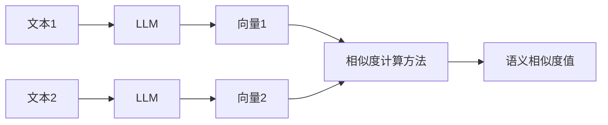

# LLM支持的AI Agent语义相似度计算

> 关键词：LLM（大语言模型）、AI Agent（人工智能智能体）、语义相似度计算、自然语言处理、向量空间模型、余弦相似度、Transformer

> 摘要：本文聚焦于LLM支持的AI Agent语义相似度计算这一前沿技术领域。首先介绍了相关背景，包括目的范围、预期读者等内容。接着深入探讨核心概念与联系，阐述LLM和AI Agent的原理及它们在语义相似度计算中的关联。通过Python源代码详细讲解核心算法原理与具体操作步骤，借助数学模型和公式对计算过程进行理论分析并举例说明。在项目实战部分，从开发环境搭建到源代码详细实现与解读，全面展示语义相似度计算的实践过程。同时探讨了其实际应用场景，推荐了相关学习资源、开发工具框架以及论文著作。最后总结未来发展趋势与挑战，并提供常见问题解答和扩展阅读参考资料，旨在为读者全面深入地了解和应用该技术提供有力的支持。

## 1. 背景介绍 
### 1.1 目的和范围
在自然语言处理（NLP）的快速发展进程中，语义相似度计算作为一个关键问题，对于理解文本之间的语义关系起着至关重要的作用。随着大语言模型（LLM）的兴起以及人工智能智能体（AI Agent）的广泛应用，利用LLM支持的AI Agent进行语义相似度计算成为研究热点。本文的目的在于系统地介绍LLM支持的AI Agent语义相似度计算的原理、算法、实践应用等方面的知识，使读者能够深入理解该技术并掌握其实现方法。范围涵盖从核心概念的讲解到具体的代码实现，以及实际应用场景的探讨等多个方面。

### 1.2 预期读者
本文预期读者包括自然语言处理领域的研究人员、人工智能开发者、对语义相似度计算感兴趣的技术爱好者以及相关专业的学生。对于希望深入了解LLM和AI Agent在语义相似度计算中应用的人士，本文将提供有价值的参考和指导。

### 1.3 文档结构概述
本文将按照以下结构进行阐述：首先介绍背景信息，包括目的、预期读者和文档结构概述等；接着讲解核心概念与联系，包括LLM、AI Agent以及语义相似度计算的原理和架构；然后详细阐述核心算法原理和具体操作步骤，并结合Python代码进行说明；再通过数学模型和公式对计算过程进行理论分析并举例；之后进行项目实战，包括开发环境搭建、源代码实现与解读；探讨实际应用场景；推荐相关的工具和资源；最后总结未来发展趋势与挑战，提供常见问题解答和扩展阅读参考资料。

### 1.4 术语表
#### 1.4.1 核心术语定义
- **LLM（大语言模型）**：是一种基于深度学习的语言模型，通过在大规模文本数据上进行训练，能够学习到语言的模式和规律，生成高质量的文本。例如GPT系列、BERT等。
- **AI Agent（人工智能智能体）**：是一种能够感知环境、做出决策并采取行动的智能实体。在自然语言处理中，AI Agent可以利用LLM的能力进行文本处理和交互。
- **语义相似度计算**：是指衡量两个文本在语义上的相似程度的计算方法。它可以帮助计算机理解文本之间的语义关系，在信息检索、文本分类、机器翻译等领域有广泛应用。

#### 1.4.2 相关概念解释
- **向量空间模型**：是一种将文本表示为向量的模型。在向量空间中，每个文本可以看作是一个向量，通过计算向量之间的距离或相似度来衡量文本之间的语义关系。
- **Transformer架构**：是一种基于自注意力机制的深度学习架构，在自然语言处理中取得了巨大成功。LLM通常基于Transformer架构进行构建。

#### 1.4.3 缩略词列表
- **LLM**：Large Language Model（大语言模型）
- **AI**：Artificial Intelligence（人工智能）
- **NLP**：Natural Language Processing（自然语言处理）

## 2. 核心概念与联系 
### 2.1 LLM原理
大语言模型（LLM）基于深度学习技术，通常采用Transformer架构。Transformer架构的核心是自注意力机制，它能够让模型在处理序列数据时，动态地关注序列中不同位置的信息。

以GPT（Generative Pretrained Transformer）为例，它是一种自回归语言模型，通过在大规模无监督文本数据上进行预训练，学习到语言的统计规律。在预训练过程中，模型的目标是根据输入的文本预测下一个词的概率。

文本示意图：
```plaintext
输入文本 -> 分词器 -> 词嵌入层 -> Transformer层（多个） -> 输出层（预测下一个词的概率分布）
```

Mermaid流程图：


### 2.2 AI Agent原理
AI Agent是一种具有感知、决策和行动能力的智能实体。在自然语言处理中，AI Agent可以利用LLM的能力进行文本处理和交互。

AI Agent通常包含以下几个组件：
- **感知模块**：负责接收外部的文本输入。
- **决策模块**：根据输入的文本和内部的知识，做出决策。
- **行动模块**：根据决策结果，生成相应的文本输出。

文本示意图：
```plaintext
外部文本输入 -> 感知模块 -> 决策模块（利用LLM） -> 行动模块 -> 文本输出
```

Mermaid流程图：


### 2.3 语义相似度计算原理
语义相似度计算的核心思想是将文本表示为向量，然后通过计算向量之间的相似度来衡量文本之间的语义关系。常见的相似度计算方法包括余弦相似度、欧几里得距离等。

在基于LLM的语义相似度计算中，通常先将文本输入到LLM中，得到文本的向量表示，然后计算这些向量之间的相似度。

文本示意图：
```plaintext
文本1 -> LLM -> 向量1
文本2 -> LLM -> 向量2
向量1、向量2 -> 相似度计算方法 -> 语义相似度值
```

Mermaid流程图：


### 2.4 三者之间的联系
LLM为AI Agent提供了强大的语言处理能力，使得AI Agent能够更好地理解和生成文本。而语义相似度计算则是AI Agent在处理文本时常用的技术之一，通过LLM得到文本的向量表示，再进行相似度计算，AI Agent可以更好地理解文本之间的语义关系，从而做出更准确的决策和行动。

## 3. 核心算法原理 & 具体操作步骤 
### 3.1 基于余弦相似度的语义相似度计算算法原理
余弦相似度是一种常用的向量相似度计算方法，它通过计算两个向量之间的夹角余弦值来衡量它们的相似度。余弦值越接近1，表示两个向量越相似；余弦值越接近0，表示两个向量越不相似。

假设有两个向量 $\vec{a}=(a_1,a_2,\cdots,a_n)$ 和 $\vec{b}=(b_1,b_2,\cdots,b_n)$，它们的余弦相似度计算公式为：

$$\cos(\theta)=\frac{\vec{a}\cdot\vec{b}}{\|\vec{a}\|\|\vec{b}\|}=\frac{\sum_{i=1}^{n}a_ib_i}{\sqrt{\sum_{i=1}^{n}a_i^2}\sqrt{\sum_{i=1}^{n}b_i^2}}$$

### 3.2 具体操作步骤
1. **文本预处理**：对输入的文本进行分词、去除停用词等预处理操作。
2. **文本向量化**：将预处理后的文本输入到LLM中，得到文本的向量表示。
3. **相似度计算**：计算两个文本向量的余弦相似度。

### 3.3 Python源代码实现
```python
import torch
from transformers import AutoTokenizer, AutoModel
import numpy as np

# 加载预训练的LLM模型和分词器
model_name = 'bert-base-uncased'
tokenizer = AutoTokenizer.from_pretrained(model_name)
model = AutoModel.from_pretrained(model_name)

def preprocess_text(text):
    """
    文本预处理函数
    :param text: 输入的文本
    :return: 处理后的文本
    """
    # 分词
    tokens = tokenizer(text, return_tensors='pt')
    return tokens

def get_text_vector(text):
    """
    获取文本的向量表示
    :param text: 输入的文本
    :return: 文本的向量表示
    """
    tokens = preprocess_text(text)
    with torch.no_grad():
        outputs = model(**tokens)
    # 取[CLS]标记的输出作为文本的向量表示
    vector = outputs.last_hidden_state[:, 0, :].numpy()
    return vector

def cosine_similarity(vector1, vector2):
    """
    计算两个向量的余弦相似度
    :param vector1: 第一个向量
    :param vector2: 第二个向量
    :return: 余弦相似度值
    """
    dot_product = np.dot(vector1, vector2.T)
    norm_vector1 = np.linalg.norm(vector1)
    norm_vector2 = np.linalg.norm(vector2)
    similarity = dot_product / (norm_vector1 * norm_vector2)
    return similarity[0][0]

# 示例文本
text1 = "The cat is on the mat."
text2 = "There is a cat on the mat."

# 获取文本向量
vector1 = get_text_vector(text1)
vector2 = get_text_vector(text2)

# 计算语义相似度
similarity = cosine_similarity(vector1, vector2)
print(f"语义相似度: {similarity}")
```

### 3.4 代码解释
1. **文本预处理**：`preprocess_text` 函数使用 `AutoTokenizer` 对输入的文本进行分词，并将其转换为PyTorch张量。
2. **文本向量化**：`get_text_vector` 函数将预处理后的文本输入到 `AutoModel` 中，得到模型的输出。取 `[CLS]` 标记的输出作为文本的向量表示。
3. **相似度计算**：`cosine_similarity` 函数根据余弦相似度公式计算两个向量的相似度。

## 4. 数学模型和公式 & 详细讲解 & 举例说明 
### 4.1 向量空间模型
向量空间模型（Vector Space Model，VSM）是一种将文本表示为向量的模型。在VSM中，每个文本可以看作是一个向量，向量的每个维度对应一个特征。常见的特征包括词频（TF）、逆文档频率（IDF）等。

假设有一个文本集合 $D=\{d_1,d_2,\cdots,d_n\}$，词汇表 $V=\{w_1,w_2,\cdots,w_m\}$，则文本 $d_i$ 可以表示为一个 $m$ 维向量 $\vec{d_i}=(tf_{i1}idf_1,tf_{i2}idf_2,\cdots,tf_{im}idf_m)$，其中 $tf_{ij}$ 表示词 $w_j$ 在文本 $d_i$ 中的词频，$idf_j$ 表示词 $w_j$ 的逆文档频率。

逆文档频率计算公式为：

$$idf_j=\log\frac{N}{df_j}$$

其中 $N$ 是文本集合中的文本总数，$df_j$ 是包含词 $w_j$ 的文本数。

### 4.2 余弦相似度
余弦相似度是一种常用的向量相似度计算方法，其计算公式为：

$$\cos(\theta)=\frac{\vec{a}\cdot\vec{b}}{\|\vec{a}\|\|\vec{b}\|}=\frac{\sum_{i=1}^{n}a_ib_i}{\sqrt{\sum_{i=1}^{n}a_i^2}\sqrt{\sum_{i=1}^{n}b_i^2}}$$

### 4.3 详细讲解
- **向量点积**：$\vec{a}\cdot\vec{b}=\sum_{i=1}^{n}a_ib_i$ 表示两个向量的对应元素相乘后求和。点积反映了两个向量在方向上的一致性程度。
- **向量模长**：$\|\vec{a}\|=\sqrt{\sum_{i=1}^{n}a_i^2}$ 和 $\|\vec{b}\|=\sqrt{\sum_{i=1}^{n}b_i^2}$ 分别表示向量 $\vec{a}$ 和 $\vec{b}$ 的模长。模长反映了向量的长度。
- **余弦值**：$\cos(\theta)$ 的取值范围是 $[-1,1]$。当 $\cos(\theta)=1$ 时，两个向量方向相同；当 $\cos(\theta)=-1$ 时，两个向量方向相反；当 $\cos(\theta)=0$ 时，两个向量正交。

### 4.4 举例说明
假设有两个向量 $\vec{a}=(1,2,3)$ 和 $\vec{b}=(2,4,6)$，则：

- 向量点积：$\vec{a}\cdot\vec{b}=1\times2 + 2\times4 + 3\times6 = 2 + 8 + 18 = 28$
- 向量模长：$\|\vec{a}\|=\sqrt{1^2 + 2^2 + 3^2}=\sqrt{14}$，$\|\vec{b}\|=\sqrt{2^2 + 4^2 + 6^2}=\sqrt{56}=2\sqrt{14}$
- 余弦相似度：$\cos(\theta)=\frac{\vec{a}\cdot\vec{b}}{\|\vec{a}\|\|\vec{b}\|}=\frac{28}{\sqrt{14}\times2\sqrt{14}} = 1$

这表明向量 $\vec{a}$ 和 $\vec{b}$ 方向相同，语义相似度很高。

## 5. 项目实战：代码实际案例和详细解释说明 
### 5.1  开发环境搭建
#### 5.1.1 安装Python
确保你已经安装了Python 3.6或更高版本。可以从Python官方网站（https://www.python.org/downloads/） 下载并安装。

#### 5.1.2 安装依赖库
使用 `pip` 安装所需的依赖库：
```bash
pip install torch transformers numpy
```

### 5.2  源代码详细实现和代码解读
```python
import torch
from transformers import AutoTokenizer, AutoModel
import numpy as np

# 加载预训练的LLM模型和分词器
model_name = 'bert-base-uncased'
tokenizer = AutoTokenizer.from_pretrained(model_name)
model = AutoModel.from_pretrained(model_name)

def preprocess_text(text):
    """
    文本预处理函数
    :param text: 输入的文本
    :return: 处理后的文本
    """
    # 分词
    tokens = tokenizer(text, return_tensors='pt')
    return tokens

def get_text_vector(text):
    """
    获取文本的向量表示
    :param text: 输入的文本
    :return: 文本的向量表示
    """
    tokens = preprocess_text(text)
    with torch.no_grad():
        outputs = model(**tokens)
    # 取[CLS]标记的输出作为文本的向量表示
    vector = outputs.last_hidden_state[:, 0, :].numpy()
    return vector

def cosine_similarity(vector1, vector2):
    """
    计算两个向量的余弦相似度
    :param vector1: 第一个向量
    :param vector2: 第二个向量
    :return: 余弦相似度值
    """
    dot_product = np.dot(vector1, vector2.T)
    norm_vector1 = np.linalg.norm(vector1)
    norm_vector2 = np.linalg.norm(vector2)
    similarity = dot_product / (norm_vector1 * norm_vector2)
    return similarity[0][0]

# 示例文本
text1 = "The cat is on the mat."
text2 = "There is a cat on the mat."

# 获取文本向量
vector1 = get_text_vector(text1)
vector2 = get_text_vector(text2)

# 计算语义相似度
similarity = cosine_similarity(vector1, vector2)
print(f"语义相似度: {similarity}")
```

#### 5.2.1 代码解读
1. **导入库**：导入 `torch`、`AutoTokenizer`、`AutoModel` 和 `numpy` 等库。
2. **加载模型和分词器**：使用 `AutoTokenizer` 和 `AutoModel` 加载预训练的BERT模型和分词器。
3. **文本预处理**：`preprocess_text` 函数使用分词器对输入的文本进行分词，并将其转换为PyTorch张量。
4. **文本向量化**：`get_text_vector` 函数将预处理后的文本输入到模型中，得到模型的输出。取 `[CLS]` 标记的输出作为文本的向量表示。
5. **相似度计算**：`cosine_similarity` 函数根据余弦相似度公式计算两个向量的相似度。
6. **示例文本**：定义两个示例文本 `text1` 和 `text2`。
7. **计算相似度**：获取示例文本的向量表示，并计算它们的语义相似度。

### 5.3  代码解读与分析
#### 5.3.1 优点
- **简单易用**：使用预训练的BERT模型和 `transformers` 库，代码实现简单，易于理解和使用。
- **效果较好**：BERT模型在自然语言处理任务中取得了很好的效果，能够学习到文本的语义信息。

#### 5.3.2 缺点
- **计算资源消耗大**：BERT模型参数较多，计算资源消耗大，对硬件要求较高。
- **速度较慢**：由于模型较大，推理速度较慢，不适合处理大规模的文本数据。

#### 5.3.3 改进方向
- **模型压缩**：采用模型压缩技术，如剪枝、量化等，减少模型参数，降低计算资源消耗。
- **优化算法**：采用更高效的相似度计算算法，提高计算速度。

## 6. 实际应用场景 
### 6.1 信息检索
在信息检索系统中，语义相似度计算可以帮助用户更准确地找到与查询相关的文档。例如，当用户输入一个查询文本时，系统可以计算查询文本与文档库中每个文档的语义相似度，然后根据相似度排序，返回最相关的文档。

### 6.2 文本分类
在文本分类任务中，语义相似度计算可以用于判断文本属于哪个类别。例如，在情感分析任务中，可以计算文本与不同情感类别样本的语义相似度，根据相似度判断文本的情感倾向。

### 6.3 机器翻译
在机器翻译中，语义相似度计算可以用于评估翻译结果的质量。例如，可以计算翻译结果与参考译文的语义相似度，根据相似度评估翻译的准确性。

### 6.4 智能客服
在智能客服系统中，语义相似度计算可以帮助客服机器人更好地理解用户的问题，并提供准确的回答。例如，当用户输入一个问题时，系统可以计算该问题与常见问题库中问题的语义相似度，根据相似度找到最相关的问题，并返回对应的答案。

## 7. 工具和资源推荐
### 7.1 学习资源推荐
#### 7.1.1 书籍推荐
- 《深度学习》（Ian Goodfellow、Yoshua Bengio和Aaron Courville著）：介绍了深度学习的基本原理和方法，包括神经网络、卷积神经网络、循环神经网络等。
- 《自然语言处理入门》（何晗著）：适合初学者，介绍了自然语言处理的基本概念、算法和应用。
- 《Python自然语言处理》（Steven Bird、Ewan Klein和Edward Loper著）：详细介绍了使用Python进行自然语言处理的方法和技术。

#### 7.1.2 在线课程
- Coursera上的“Natural Language Processing Specialization”：由斯坦福大学的教授授课，系统地介绍了自然语言处理的各个方面。
- edX上的“Introduction to Artificial Intelligence”：介绍了人工智能的基本概念和方法，包括自然语言处理。
- 哔哩哔哩上的相关视频教程：有很多关于自然语言处理和深度学习的免费视频教程，可以帮助你快速入门。

#### 7.1.3 技术博客和网站
- arXiv.org：提供了大量的学术论文，包括自然语言处理和深度学习领域的最新研究成果。
- Medium.com：有很多技术博客，涵盖了自然语言处理、人工智能等领域的最新技术和实践经验。
- 开源中国（https://www.oschina.net/）：提供了丰富的开源项目和技术文章，对学习和实践有很大的帮助。

### 7.2 开发工具框架推荐
#### 7.2.1 IDE和编辑器
- PyCharm：一款专业的Python集成开发环境，提供了代码编辑、调试、版本控制等功能。
- Visual Studio Code：一款轻量级的代码编辑器，支持多种编程语言，有丰富的插件扩展。

#### 7.2.2 调试和性能分析工具
- PyTorch Profiler：用于分析PyTorch模型的性能，找出性能瓶颈。
- TensorBoard：用于可视化深度学习模型的训练过程和性能指标。

#### 7.2.3 相关框架和库
- Transformers：由Hugging Face开发的库，提供了大量的预训练语言模型和工具，方便进行自然语言处理任务。
- NLTK（Natural Language Toolkit）：一个Python库，提供了丰富的自然语言处理工具和数据集。
- SpaCy：一个高效的自然语言处理库，支持多种语言，提供了快速的文本处理和分析功能。

### 7.3 相关论文著作推荐
#### 7.3.1 经典论文
- “Attention Is All You Need”（Ashish Vaswani等人著）：介绍了Transformer架构，是自然语言处理领域的经典论文。
- “BERT: Pre-training of Deep Bidirectional Transformers for Language Understanding”（Jacob Devlin等人著）：介绍了BERT模型，在自然语言处理任务中取得了巨大成功。

#### 7.3.2 最新研究成果
- 关注arXiv.org上的最新论文，了解LLM和语义相似度计算领域的最新研究进展。
- 参加自然语言处理领域的学术会议，如ACL（Association for Computational Linguistics）、EMNLP（Conference on Empirical Methods in Natural Language Processing）等，获取最新的研究成果。

#### 7.3.3 应用案例分析
- 研究工业界的应用案例，了解语义相似度计算在实际业务中的应用场景和实现方法。
- 分析开源项目中的代码实现，学习他人的经验和技巧。

## 8. 总结：未来发展趋势与挑战
### 8.1 未来发展趋势
- **模型小型化**：随着计算资源的限制和对实时性的要求，未来的LLM将朝着小型化的方向发展，以提高计算效率和降低成本。
- **多模态融合**：将文本、图像、音频等多种模态的信息进行融合，实现更全面的语义理解和相似度计算。
- **个性化服务**：根据用户的个性化需求和偏好，提供更精准的语义相似度计算服务。

### 8.2 挑战
- **语义理解的局限性**：虽然LLM在语义理解方面取得了很大的进展，但仍然存在一定的局限性，如对隐喻、幽默等语义的理解还不够准确。
- **计算资源的限制**：LLM的训练和推理需要大量的计算资源，对硬件要求较高，这限制了其在一些场景中的应用。
- **数据隐私和安全问题**：在使用LLM进行语义相似度计算时，需要处理大量的文本数据，这涉及到数据隐私和安全问题，需要采取有效的措施进行保护。

## 9. 附录：常见问题与解答
### 9.1 问题1：如何选择合适的LLM模型？
答：选择合适的LLM模型需要考虑多个因素，如任务类型、计算资源、数据集大小等。如果是简单的文本分类任务，可以选择较小的预训练模型；如果是复杂的自然语言生成任务，可能需要选择较大的模型。

### 9.2 问题2：如何提高语义相似度计算的准确性？
答：可以从以下几个方面提高语义相似度计算的准确性：选择更合适的LLM模型、进行文本预处理、使用更复杂的相似度计算方法等。

### 9.3 问题3：语义相似度计算在实际应用中有哪些注意事项？
答：在实际应用中，需要注意数据的质量和多样性，避免过拟合；同时，需要考虑计算资源的限制，选择合适的算法和模型。

## 10. 扩展阅读 & 参考资料
### 10.1 扩展阅读
- 《深度学习实战》（李开复、王咏刚著）：介绍了深度学习在各个领域的实际应用。
- 《人工智能时代》（李开复、王咏刚著）：探讨了人工智能对社会和人类的影响。

### 10.2 参考资料
- Hugging Face官方文档（https://huggingface.co/docs/transformers/index）：提供了关于 `transformers` 库的详细文档和使用示例。
- PyTorch官方文档（https://pytorch.org/docs/stable/index.html）：提供了关于PyTorch的详细文档和教程。
- NLTK官方文档（https://www.nltk.org/）：提供了关于NLTK库的详细文档和使用示例。