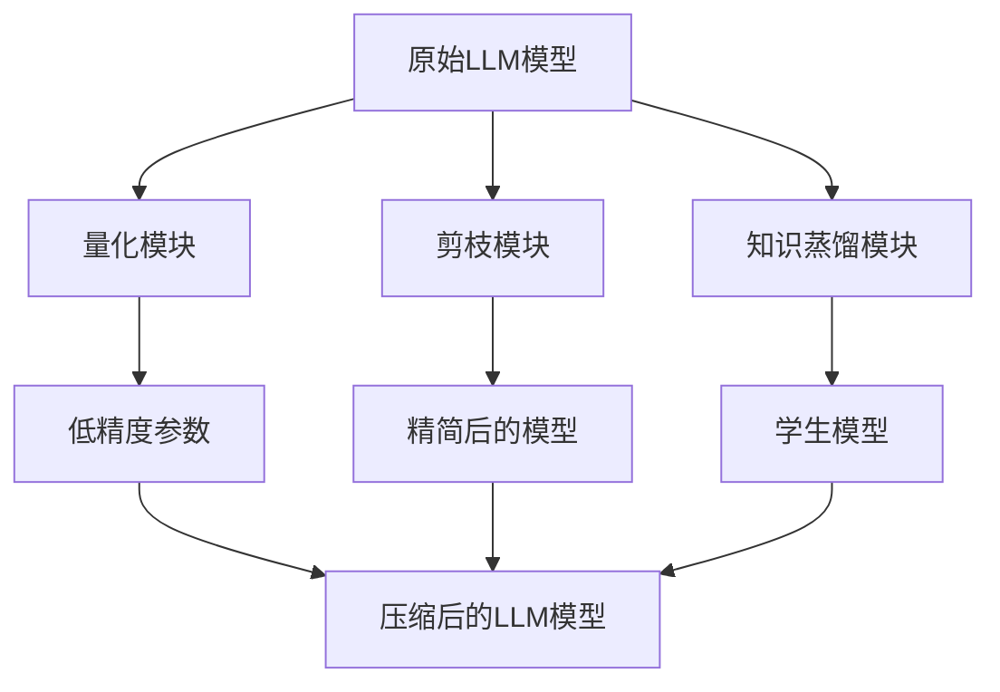

# LLM模型压缩技术：在边缘设备部署AI Agent

> 关键词：LLM模型、模型压缩技术、边缘设备、AI Agent、部署

> 摘要：本文聚焦于LLM（大语言模型）模型压缩技术以及在边缘设备上部署AI Agent的相关内容。首先介绍了研究的背景、目的、预期读者等信息，接着深入探讨LLM模型压缩的核心概念与联系，详细阐述其核心算法原理和具体操作步骤，并给出相应的数学模型和公式。通过项目实战展示在边缘设备上部署AI Agent的代码实际案例及详细解释。分析了LLM模型压缩技术在边缘设备部署AI Agent的实际应用场景，推荐了相关的工具和资源。最后总结未来发展趋势与挑战，提供常见问题解答和扩展阅读参考资料，旨在为相关领域的研究和实践提供全面而深入的指导。

## 1. 背景介绍 
### 1.1 目的和范围
随着人工智能技术的飞速发展，大语言模型（LLM）在自然语言处理等领域取得了显著的成果。然而，LLM模型通常具有庞大的参数数量和复杂的计算需求，这使得它们在资源受限的边缘设备上难以直接部署。本研究的目的在于探索有效的LLM模型压缩技术，以实现AI Agent在边缘设备上的高效部署。研究范围涵盖了常见的模型压缩方法，如量化、剪枝、知识蒸馏等，以及在不同类型边缘设备上的部署策略和实践。

### 1.2 预期读者
本文预期读者包括人工智能领域的研究人员、工程师、开发者，以及对边缘计算和AI Agent应用感兴趣的技术爱好者。对于希望在边缘设备上实现AI Agent功能的相关从业者，本文提供了全面的技术指导和实践经验；对于研究人员，本文可以作为进一步探索LLM模型压缩和边缘计算领域的参考资料。

### 1.3 文档结构概述
本文将按照以下结构进行组织：首先介绍相关的背景信息，包括研究目的、预期读者和文档结构概述；接着阐述LLM模型压缩技术的核心概念与联系，包括模型压缩的原理和架构；然后详细讲解核心算法原理和具体操作步骤，并给出相应的数学模型和公式；通过项目实战展示在边缘设备上部署AI Agent的具体实现和代码解读；分析LLM模型压缩技术在边缘设备部署AI Agent的实际应用场景；推荐相关的工具和资源，包括学习资源、开发工具框架和相关论文著作；最后总结未来发展趋势与挑战，提供常见问题解答和扩展阅读参考资料。

### 1.4 术语表
#### 1.4.1 核心术语定义
- **LLM（大语言模型）**：指具有大量参数和强大语言处理能力的预训练语言模型，如GPT系列、BERT等。
- **模型压缩技术**：通过各种方法减少模型的参数数量、计算量或存储需求，以提高模型在资源受限环境中的运行效率。
- **边缘设备**：指位于网络边缘的计算设备，如智能手机、智能手表、物联网传感器等，通常具有有限的计算资源和存储容量。
- **AI Agent**：指能够感知环境、做出决策并执行相应动作的人工智能实体。
- **量化**：将模型的参数从高精度数据类型（如32位浮点数）转换为低精度数据类型（如8位整数），以减少模型的存储和计算需求。
- **剪枝**：通过移除模型中对性能影响较小的参数或连接，减少模型的复杂度。
- **知识蒸馏**：将大型教师模型的知识转移到小型学生模型中，使学生模型能够达到接近教师模型的性能。

#### 1.4.2 相关概念解释
- **计算资源**：指设备的计算能力，通常用CPU、GPU的性能指标来衡量。
- **存储容量**：指设备能够存储数据的空间大小。
- **推理**：指模型在给定输入的情况下，输出相应结果的过程。
- **训练**：指通过大量数据对模型进行优化，使其能够学习到数据中的模式和规律的过程。

#### 1.4.3 缩略词列表
- **LLM**：Large Language Model（大语言模型）
- **AI**：Artificial Intelligence（人工智能）
- **CPU**：Central Processing Unit（中央处理器）
- **GPU**：Graphics Processing Unit（图形处理器）
- **IoT**：Internet of Things（物联网）

## 2. 核心概念与联系 

### 核心概念原理
LLM模型压缩技术的核心目标是在不显著降低模型性能的前提下，减少模型的参数数量、计算量和存储需求，从而使其能够在边缘设备上高效运行。常见的模型压缩方法包括量化、剪枝和知识蒸馏。

- **量化**：量化的基本原理是将模型的参数从高精度数据类型（如32位浮点数）转换为低精度数据类型（如8位整数）。由于低精度数据类型占用的存储空间更小，且在计算过程中所需的运算量也更少，因此可以有效减少模型的存储和计算需求。例如，一个32位浮点数需要4个字节的存储空间，而一个8位整数只需要1个字节的存储空间。通过量化，模型的存储空间可以减少到原来的四分之一。

- **剪枝**：剪枝的原理是通过分析模型中各个参数或连接对模型性能的影响，移除那些对性能影响较小的部分。在训练过程中，模型会学习到数据中的模式和规律，其中一些参数或连接可能对最终的预测结果贡献较小。通过剪枝，可以减少模型的复杂度，提高模型的推理速度。例如，在一个神经网络中，某些神经元的输出对最终的分类结果影响很小，就可以将这些神经元及其连接移除。

- **知识蒸馏**：知识蒸馏的原理是将大型教师模型的知识转移到小型学生模型中。教师模型通常具有较高的性能，但由于其参数数量庞大，难以在边缘设备上运行。学生模型则是一个较小的模型，通过学习教师模型的输出分布，学生模型可以达到接近教师模型的性能。例如，在图像分类任务中，教师模型可以对图像进行分类，并输出每个类别的概率分布。学生模型可以通过学习这个概率分布，来提高自己的分类性能。

### 架构的文本示意图
```plaintext
LLM模型压缩技术架构

输入：原始LLM模型
|
|-- 量化模块：将模型参数从高精度转换为低精度
|   |
|   |-- 低精度参数
|
|-- 剪枝模块：移除对性能影响较小的参数或连接
|   |
|   |-- 精简后的模型
|
|-- 知识蒸馏模块：将教师模型的知识转移到学生模型
|   |
|   |-- 学生模型
|
输出：压缩后的LLM模型
```

### Mermaid流程图


## 3. 核心算法原理 & 具体操作步骤 

### 量化算法原理及Python代码实现
量化算法的核心思想是将模型的参数从高精度数据类型（如32位浮点数）映射到低精度数据类型（如8位整数）。常见的量化方法包括线性量化和非线性量化。这里我们以线性量化为例进行讲解。

线性量化的公式为：
$$q = \text{round}(\frac{r}{S} + Z)$$
其中，$r$ 是原始的浮点数参数，$S$ 是缩放因子，$Z$ 是零点偏移，$q$ 是量化后的整数参数。

反量化的公式为：
$$r = (q - Z) \times S$$

以下是一个简单的Python代码示例，演示如何对一个张量进行线性量化：

```python
import torch

def linear_quantize(tensor, scale, zero_point):
    """
    线性量化函数
    :param tensor: 输入的浮点数张量
    :param scale: 缩放因子
    :param zero_point: 零点偏移
    :return: 量化后的整数张量
    """
    quantized_tensor = torch.round(tensor / scale + zero_point)
    return quantized_tensor

def linear_dequantize(quantized_tensor, scale, zero_point):
    """
    线性反量化函数
    :param quantized_tensor: 量化后的整数张量
    :param scale: 缩放因子
    :param zero_point: 零点偏移
    :return: 反量化后的浮点数张量
    """
    dequantized_tensor = (quantized_tensor - zero_point) * scale
    return dequantized_tensor

# 示例使用
tensor = torch.randn(10)  # 生成一个随机的浮点数张量
scale = 0.1
zero_point = 128

quantized_tensor = linear_quantize(tensor, scale, zero_point)
dequantized_tensor = linear_dequantize(quantized_tensor, scale, zero_point)

print("原始张量:", tensor)
print("量化后的张量:", quantized_tensor)
print("反量化后的张量:", dequantized_tensor)
```

### 剪枝算法原理及Python代码实现
剪枝算法的核心思想是通过分析模型中各个参数或连接的重要性，移除那些对模型性能影响较小的部分。常见的剪枝方法包括基于幅度的剪枝和基于梯度的剪枝。这里我们以基于幅度的剪枝为例进行讲解。

基于幅度的剪枝的基本步骤如下：
1. 计算模型中每个参数的绝对值。
2. 对参数的绝对值进行排序。
3. 根据预设的剪枝比例，选择绝对值最小的参数进行移除。

以下是一个简单的Python代码示例，演示如何对一个简单的神经网络进行基于幅度的剪枝：

```python
import torch
import torch.nn as nn

class SimpleNet(nn.Module):
    def __init__(self):
        super(SimpleNet, self).__init__()
        self.fc1 = nn.Linear(10, 20)
        self.fc2 = nn.Linear(20, 1)

    def forward(self, x):
        x = torch.relu(self.fc1(x))
        x = self.fc2(x)
        return x

# 初始化模型
model = SimpleNet()

# 计算每个参数的绝对值
param_abs_values = []
for param in model.parameters():
    param_abs_values.extend(param.abs().flatten().tolist())

# 对参数的绝对值进行排序
param_abs_values.sort()

# 预设剪枝比例
pruning_ratio = 0.2
num_pruned_params = int(len(param_abs_values) * pruning_ratio)
pruning_threshold = param_abs_values[num_pruned_params]

# 进行剪枝
for param in model.parameters():
    mask = (param.abs() >= pruning_threshold).float()
    param.data *= mask

print("剪枝后的模型参数:", model.state_dict())
```

### 知识蒸馏算法原理及Python代码实现
知识蒸馏的核心思想是将大型教师模型的知识转移到小型学生模型中。具体步骤如下：
1. 定义教师模型和学生模型。
2. 对输入数据，分别计算教师模型和学生模型的输出。
3. 计算教师模型输出和学生模型输出之间的损失，作为蒸馏损失。
4. 结合蒸馏损失和学生模型的原始损失，更新学生模型的参数。

以下是一个简单的Python代码示例，演示如何进行知识蒸馏：

```python
import torch
import torch.nn as nn
import torch.optim as optim

# 定义教师模型
class TeacherNet(nn.Module):
    def __init__(self):
        super(TeacherNet, self).__init__()
        self.fc1 = nn.Linear(10, 20)
        self.fc2 = nn.Linear(20, 1)

    def forward(self, x):
        x = torch.relu(self.fc1(x))
        x = self.fc2(x)
        return x

# 定义学生模型
class StudentNet(nn.Module):
    def __init__(self):
        super(StudentNet, self).__init__()
        self.fc1 = nn.Linear(10, 10)
        self.fc2 = nn.Linear(10, 1)

    def forward(self, x):
        x = torch.relu(self.fc1(x))
        x = self.fc2(x)
        return x

# 初始化教师模型和学生模型
teacher_model = TeacherNet()
student_model = StudentNet()

# 定义损失函数和优化器
criterion = nn.MSELoss()
optimizer = optim.Adam(student_model.parameters(), lr=0.001)

# 模拟训练数据
input_data = torch.randn(100, 10)
target_data = torch.randn(100, 1)

# 训练学生模型
num_epochs = 100
for epoch in range(num_epochs):
    # 计算教师模型的输出
    teacher_output = teacher_model(input_data)

    # 计算学生模型的输出
    student_output = student_model(input_data)

    # 计算蒸馏损失
    distillation_loss = criterion(student_output, teacher_output)

    # 计算原始损失
    original_loss = criterion(student_output, target_data)

    # 结合蒸馏损失和原始损失
    total_loss = 0.5 * distillation_loss + 0.5 * original_loss

    # 更新学生模型的参数
    optimizer.zero_grad()
    total_loss.backward()
    optimizer.step()

    if (epoch + 1) % 10 == 0:
        print(f'Epoch [{epoch+1}/{num_epochs}], Loss: {total_loss.item():.4f}')
```

## 4. 数学模型和公式 & 详细讲解 & 举例说明 

### 量化的数学模型和公式
如前面所述，线性量化的公式为：
$$q = \text{round}(\frac{r}{S} + Z)$$
其中，$r$ 是原始的浮点数参数，$S$ 是缩放因子，$Z$ 是零点偏移，$q$ 是量化后的整数参数。

反量化的公式为：
$$r = (q - Z) \times S$$

详细讲解：
- 缩放因子 $S$ 用于控制浮点数和整数之间的映射比例。它的作用是将浮点数的取值范围映射到整数的取值范围。例如，如果我们使用8位整数进行量化，其取值范围是 $[0, 255]$，那么缩放因子 $S$ 可以根据浮点数的取值范围进行调整，使得浮点数能够合理地映射到这个整数范围内。
- 零点偏移 $Z$ 用于处理浮点数取值范围不关于零对称的情况。它的作用是将整数的零点与浮点数的零点对齐。例如，如果浮点数的取值范围是 $[-1, 1]$，而8位整数的取值范围是 $[0, 255]$，那么零点偏移 $Z$ 可以设置为128，使得浮点数的零点对应到整数的128。

举例说明：
假设我们有一个浮点数参数 $r = 0.5$，缩放因子 $S = 0.1$，零点偏移 $Z = 128$。根据线性量化公式，量化后的整数参数为：
$$q = \text{round}(\frac{0.5}{0.1} + 128) = \text{round}(5 + 128) = 133$$

反量化时，根据反量化公式，反量化后的浮点数参数为：
$$r = (133 - 128) \times 0.1 = 0.5$$

### 剪枝的数学模型和公式
基于幅度的剪枝通常使用参数的绝对值来衡量其重要性。设 $W$ 是模型的参数矩阵，$|W|$ 表示 $W$ 中每个元素的绝对值。对于一个参数 $w_{ij}$，其重要性可以表示为 $|w_{ij}|$。

假设我们要剪枝的比例为 $\alpha$，则需要移除的参数数量为 $N_{\text{pruned}} = \alpha \times N$，其中 $N$ 是模型中总的参数数量。我们可以对 $|W|$ 中的所有元素进行排序，选择绝对值最小的 $N_{\text{pruned}}$ 个元素进行移除。

详细讲解：
基于幅度的剪枝假设参数的绝对值越小，其对模型性能的影响越小。通过移除这些绝对值较小的参数，可以减少模型的复杂度，提高模型的推理速度。但是，这种方法也存在一定的局限性，因为参数的绝对值大小并不一定完全反映其对模型性能的影响。

举例说明：
假设我们有一个简单的神经网络，其参数矩阵为：
$$W = \begin{bmatrix}
0.1 & -0.2 \\
0.3 & -0.05
\end{bmatrix}$$
参数的绝对值矩阵为：
$$|W| = \begin{bmatrix}
0.1 & 0.2 \\
0.3 & 0.05
\end{bmatrix}$$
如果我们要剪枝的比例为 $\alpha = 0.25$，则需要移除的参数数量为 $N_{\text{pruned}} = 0.25 \times 4 = 1$。对 $|W|$ 中的元素进行排序，得到 $0.05 < 0.1 < 0.2 < 0.3$，因此我们选择移除绝对值最小的参数 $0.05$。剪枝后的参数矩阵为：
$$W_{\text{pruned}} = \begin{bmatrix}
0.1 & -0.2 \\
0.3 & 0
\end{bmatrix}$$

### 知识蒸馏的数学模型和公式
知识蒸馏通常使用蒸馏损失来衡量教师模型和学生模型之间的差异。常见的蒸馏损失函数包括均方误差损失（MSE）和交叉熵损失（CE）。

均方误差损失的公式为：
$$L_{\text{MSE}} = \frac{1}{n} \sum_{i=1}^{n} (y_{t,i} - y_{s,i})^2$$
其中，$y_{t,i}$ 是教师模型的输出，$y_{s,i}$ 是学生模型的输出，$n$ 是样本数量。

交叉熵损失的公式为：
$$L_{\text{CE}} = -\frac{1}{n} \sum_{i=1}^{n} \sum_{j=1}^{C} y_{t,ij} \log(y_{s,ij})$$
其中，$y_{t,ij}$ 是教师模型输出的第 $i$ 个样本在第 $j$ 个类别上的概率，$y_{s,ij}$ 是学生模型输出的第 $i$ 个样本在第 $j$ 个类别上的概率，$C$ 是类别数量。

详细讲解：
均方误差损失用于衡量教师模型和学生模型输出的数值差异，适用于回归任务。交叉熵损失用于衡量教师模型和学生模型输出的概率分布差异，适用于分类任务。在知识蒸馏中，通常会结合蒸馏损失和学生模型的原始损失，来更新学生模型的参数。

举例说明：
假设我们有一个二分类任务，教师模型的输出为 $y_t = [0.8, 0.2]$，学生模型的输出为 $y_s = [0.7, 0.3]$。使用均方误差损失计算蒸馏损失为：
$$L_{\text{MSE}} = \frac{1}{2} \times ((0.8 - 0.7)^2 + (0.2 - 0.3)^2) = 0.01$$

使用交叉熵损失计算蒸馏损失为：
$$L_{\text{CE}} = -(0.8 \log(0.7) + 0.2 \log(0.3)) \approx 0.22$$

## 5. 项目实战：代码实际案例和详细解释说明 

### 5.1  开发环境搭建
在进行项目实战之前，需要搭建相应的开发环境。以下是具体的步骤：

#### 硬件环境
- 边缘设备：可以选择一款具有一定计算能力的边缘设备，如树莓派、Jetson Nano等。
- 开发主机：可以使用普通的台式机或笔记本电脑，安装相应的开发工具和软件。

#### 软件环境
- 操作系统：在边缘设备和开发主机上安装适合的操作系统，如Linux、Windows等。
- Python环境：安装Python 3.x版本，并使用pip安装必要的Python库，如torch、torchvision、numpy等。
- 深度学习框架：安装PyTorch深度学习框架，用于模型的训练和推理。

以下是在Ubuntu系统上安装Python和PyTorch的示例命令：

```bash
# 安装Python
sudo apt update
sudo apt install python3 python3-pip

# 安装PyTorch
pip3 install torch torchvision
```

### 5.2  源代码详细实现和代码解读
以下是一个在边缘设备上部署AI Agent的完整代码示例，包括模型压缩和推理的过程。

```python
import torch
import torch.nn as nn
import torch.optim as optim
from torchvision import datasets, transforms

# 定义一个简单的卷积神经网络模型
class SimpleCNN(nn.Module):
    def __init__(self):
        super(SimpleCNN, self).__init__()
        self.conv1 = nn.Conv2d(1, 10, kernel_size=5)
        self.conv2 = nn.Conv2d(10, 20, kernel_size=5)
        self.fc1 = nn.Linear(320, 50)
        self.fc2 = nn.Linear(50, 10)

    def forward(self, x):
        x = torch.relu(torch.max_pool2d(self.conv1(x), 2))
        x = torch.relu(torch.max_pool2d(self.conv2(x), 2))
        x = x.view(-1, 320)
        x = torch.relu(self.fc1(x))
        x = self.fc2(x)
        return x

# 数据预处理
transform = transforms.Compose([
    transforms.ToTensor(),
    transforms.Normalize((0.1307,), (0.3081,))
])

# 加载MNIST数据集
train_dataset = datasets.MNIST('data', train=True, download=True, transform=transform)
test_dataset = datasets.MNIST('data', train=False, transform=transform)

train_loader = torch.utils.data.DataLoader(train_dataset, batch_size=64, shuffle=True)
test_loader = torch.utils.data.DataLoader(test_dataset, batch_size=1000, shuffle=False)

# 初始化模型
model = SimpleCNN()

# 定义损失函数和优化器
criterion = nn.CrossEntropyLoss()
optimizer = optim.Adam(model.parameters(), lr=0.001)

# 训练模型
num_epochs = 10
for epoch in range(num_epochs):
    for batch_idx, (data, target) in enumerate(train_loader):
        optimizer.zero_grad()
        output = model(data)
        loss = criterion(output, target)
        loss.backward()
        optimizer.step()
    print(f'Epoch {epoch+1}/{num_epochs}, Loss: {loss.item():.4f}')

# 量化模型
import torch.quantization

# 定义量化配置
quantization_config = torch.quantization.get_default_qconfig('fbgemm')
model.qconfig = quantization_config

# 准备模型进行量化
torch.quantization.prepare(model, inplace=True)

# 校准模型
with torch.no_grad():
    for data, _ in test_loader:
        model(data)

# 转换模型为量化模型
torch.quantization.convert(model, inplace=True)

# 在边缘设备上进行推理
device = torch.device('cpu')  # 假设边缘设备使用CPU进行推理
model.to(device)
model.eval()

with torch.no_grad():
    for data, target in test_loader:
        data = data.to(device)
        output = model(data)
        pred = output.argmax(dim=1, keepdim=True)
        correct = pred.eq(target.view_as(pred)).sum().item()
        total = target.size(0)
        accuracy = correct / total
        print(f'Accuracy: {accuracy:.4f}')
```

### 5.3  代码解读与分析
- **模型定义**：定义了一个简单的卷积神经网络模型 `SimpleCNN`，包含两个卷积层和两个全连接层。
- **数据预处理**：使用 `torchvision.transforms` 对MNIST数据集进行预处理，包括将图像转换为张量和归一化操作。
- **模型训练**：使用交叉熵损失函数和Adam优化器对模型进行训练，训练10个epoch。
- **模型量化**：使用PyTorch的量化工具对模型进行量化，包括准备模型、校准模型和转换模型三个步骤。
- **边缘设备推理**：将量化后的模型部署到边缘设备上（这里假设使用CPU进行推理），并对测试数据进行推理，计算准确率。

通过模型量化，可以减少模型的存储和计算需求，提高模型在边缘设备上的推理速度。同时，由于量化过程中会引入一定的误差，可能会导致模型的准确率略有下降。因此，在实际应用中，需要根据具体需求权衡模型的准确率和推理速度。

## 6. 实际应用场景 
LLM模型压缩技术在边缘设备上部署AI Agent具有广泛的实际应用场景，以下是一些常见的应用场景：

### 智能物联网设备
在物联网领域，大量的边缘设备如传感器、智能家居设备等需要实时处理和分析数据。通过在边缘设备上部署AI Agent，可以实现设备的智能化决策和自主控制。例如，智能摄像头可以实时检测和识别图像中的物体，智能家电可以根据用户的习惯和环境信息自动调整工作模式。由于边缘设备的计算资源和存储容量有限，LLM模型压缩技术可以帮助减少模型的资源需求，提高设备的性能和响应速度。

### 智能医疗设备
在医疗领域，边缘设备如可穿戴医疗设备、便携式诊断设备等可以实时监测患者的生理数据。通过在这些设备上部署AI Agent，可以实现对患者健康状况的实时评估和预警。例如，智能手环可以监测用户的心率、血压等生理指标，并根据这些数据判断用户的健康状况。LLM模型压缩技术可以使复杂的医疗诊断模型在边缘设备上运行，提高医疗服务的效率和便捷性。

### 智能交通系统
在智能交通领域，边缘设备如车载终端、交通摄像头等可以实时采集交通信息。通过在这些设备上部署AI Agent，可以实现交通流量的实时监测、交通事故的预警和智能驾驶辅助等功能。例如，车载终端可以根据实时交通信息规划最佳行驶路线，交通摄像头可以实时识别交通违法行为。LLM模型压缩技术可以提高边缘设备的处理能力，增强智能交通系统的可靠性和安全性。

### 工业自动化
在工业领域，边缘设备如工业机器人、传感器网络等可以实时监测生产过程中的数据。通过在这些设备上部署AI Agent，可以实现生产过程的自动化控制和优化。例如，工业机器人可以根据实时数据调整工作参数，传感器网络可以实时监测设备的运行状态并进行故障预警。LLM模型压缩技术可以使工业生产更加智能化和高效化。

## 7. 工具和资源推荐
### 7.1 学习资源推荐
#### 7.1.1 书籍推荐
- 《深度学习》（Deep Learning）：由Ian Goodfellow、Yoshua Bengio和Aaron Courville所著，是深度学习领域的经典教材，涵盖了深度学习的基本原理、算法和应用。
- 《Python深度学习》（Deep Learning with Python）：由Francois Chollet所著，介绍了如何使用Python和Keras进行深度学习的实践，适合初学者入门。
- 《动手学深度学习》（Dive into Deep Learning）：由李沐等人所著，提供了丰富的深度学习实践案例和代码，适合有一定编程基础的读者。

#### 7.1.2 在线课程
- Coursera上的“深度学习专项课程”（Deep Learning Specialization）：由Andrew Ng教授授课，涵盖了深度学习的各个方面，包括神经网络、卷积神经网络、循环神经网络等。
- edX上的“强化学习基础”（Fundamentals of Reinforcement Learning）：介绍了强化学习的基本概念和算法，适合对强化学习感兴趣的读者。
- 哔哩哔哩（Bilibili）上的“李宏毅机器学习”：由李宏毅教授授课，讲解生动有趣，适合初学者学习机器学习和深度学习的基础知识。

#### 7.1.3 技术博客和网站
- Medium：一个技术博客平台，上面有很多关于人工智能、深度学习的优秀文章和教程。
- arXiv：一个预印本平台，上面有很多最新的人工智能研究论文，可以及时了解该领域的最新研究动态。
- 机器之心：一个专注于人工智能领域的媒体平台，提供了丰富的技术文章、行业资讯和研究报告。

### 7.2 开发工具框架推荐
#### 7.2.1 IDE和编辑器
- PyCharm：一款功能强大的Python集成开发环境，提供了代码编辑、调试、版本控制等功能，适合Python开发。
- Visual Studio Code：一款轻量级的代码编辑器，支持多种编程语言，通过安装插件可以实现丰富的功能，如代码高亮、智能提示等。
- Jupyter Notebook：一个交互式的编程环境，适合进行数据分析、模型训练和实验，支持Python、R等多种编程语言。

#### 7.2.2 调试和性能分析工具
- PyTorch Profiler：PyTorch提供的性能分析工具，可以帮助开发者分析模型的性能瓶颈，优化模型的运行效率。
- TensorBoard：TensorFlow提供的可视化工具，可以帮助开发者可视化模型的训练过程、性能指标等信息。
- cProfile：Python内置的性能分析工具，可以帮助开发者分析Python代码的性能瓶颈。

#### 7.2.3 相关框架和库
- PyTorch：一个开源的深度学习框架，提供了丰富的深度学习模型和工具，支持GPU加速，适合进行模型训练和推理。
- TensorFlow：一个开源的深度学习框架，具有广泛的应用和社区支持，提供了多种高级API，适合快速开发深度学习应用。
- ONNX：一个开放的神经网络交换格式，可以实现不同深度学习框架之间的模型转换和部署。

### 7.3 相关论文著作推荐
#### 7.3.1 经典论文
- “Attention Is All You Need”：提出了Transformer架构，是自然语言处理领域的经典论文，为大语言模型的发展奠定了基础。
- “Deep Residual Learning for Image Recognition”：提出了残差网络（ResNet），解决了深度神经网络训练中的梯度消失问题，在计算机视觉领域取得了显著的成果。
- “Generative Adversarial Networks”：提出了生成对抗网络（GAN），是生成模型领域的经典论文，为图像生成、文本生成等任务提供了新的思路。

#### 7.3.2 最新研究成果
- 关注arXiv上的最新论文，了解LLM模型压缩技术、边缘计算、AI Agent等领域的最新研究动态。
- 参加相关的学术会议，如NeurIPS、ICML、CVPR等，了解最新的研究成果和技术趋势。

#### 7.3.3 应用案例分析
- 查看各大科技公司的技术博客和研究报告，了解他们在LLM模型压缩技术和边缘设备部署AI Agent方面的应用案例和实践经验。
- 参考相关的开源项目，如Hugging Face的Transformers库，了解如何在实际项目中应用LLM模型。

## 8. 总结：未来发展趋势与挑战
### 未来发展趋势
- **更高效的模型压缩算法**：随着研究的不断深入，未来将会出现更加高效的模型压缩算法，能够在保证模型性能的前提下，进一步减少模型的参数数量和计算量。例如，结合多种压缩方法的混合压缩技术，以及基于自适应压缩策略的动态压缩算法。
- **边缘设备的性能提升**：随着硬件技术的不断发展，边缘设备的计算能力和存储容量将不断提升。这将为在边缘设备上部署更复杂的AI Agent提供更好的硬件支持，同时也将推动LLM模型压缩技术的发展。
- **多模态融合**：未来的AI Agent将不仅仅局限于处理文本信息，还将融合图像、语音、视频等多种模态的信息。LLM模型压缩技术需要适应多模态融合的需求，实现对多模态模型的有效压缩和部署。
- **联邦学习与边缘计算的结合**：联邦学习是一种在不共享原始数据的情况下进行模型训练的技术。将联邦学习与边缘计算相结合，可以在边缘设备上进行本地模型训练，然后通过联邦学习算法将各个边缘设备的模型进行融合。这将为在边缘设备上部署AI Agent提供更加安全、高效的解决方案。

### 挑战
- **模型性能与压缩率的平衡**：在进行模型压缩时，需要在模型性能和压缩率之间找到一个平衡点。过度压缩可能会导致模型性能的显著下降，而压缩率过低则无法满足边缘设备的资源限制。如何在保证模型性能的前提下，实现更高的压缩率是一个亟待解决的问题。
- **边缘设备的异构性**：边缘设备的种类繁多，其计算能力、存储容量、功耗等性能指标存在很大的差异。如何针对不同类型的边缘设备，实现高效的模型压缩和部署是一个挑战。
- **数据隐私和安全**：在边缘设备上部署AI Agent需要处理大量的敏感数据，如用户的个人信息、医疗数据等。如何保证数据的隐私和安全是一个重要的问题。同时，模型压缩过程中也可能会引入安全风险，如模型逆向工程、对抗攻击等。
- **模型更新和维护**：随着数据的不断更新和业务需求的变化，AI Agent的模型需要不断进行更新和维护。在边缘设备上实现模型的高效更新和维护是一个挑战，需要考虑网络带宽、设备存储容量等因素。

## 9. 附录：常见问题与解答
### 问题1：模型压缩会对模型的准确率产生多大影响？
答：模型压缩会对模型的准确率产生一定的影响，具体影响程度取决于压缩方法和压缩率。一般来说，量化和剪枝等方法会引入一定的误差，导致模型的准确率略有下降。但是，通过合理选择压缩方法和参数，可以将准确率的下降控制在可接受的范围内。例如，在一些实验中，通过量化和剪枝可以将模型的参数数量减少到原来的几分之一，而准确率的下降只有几个百分点。

### 问题2：如何选择合适的模型压缩方法？
答：选择合适的模型压缩方法需要考虑多个因素，如模型的类型、应用场景、计算资源和存储容量等。一般来说，如果对模型的推理速度要求较高，可以选择量化方法；如果对模型的参数数量要求较高，可以选择剪枝方法；如果希望在减少模型大小的同时保持较高的性能，可以选择知识蒸馏方法。在实际应用中，也可以结合多种压缩方法，以达到更好的压缩效果。

### 问题3：在边缘设备上部署AI Agent需要注意哪些问题？
答：在边缘设备上部署AI Agent需要注意以下几个问题：
- **资源限制**：边缘设备的计算资源和存储容量有限，需要选择合适的模型和压缩方法，以确保模型能够在边缘设备上运行。
- **功耗**：边缘设备通常由电池供电，需要考虑模型的功耗问题，选择低功耗的模型和算法。
- **数据隐私和安全**：边缘设备上可能存储有用户的敏感数据，需要采取措施保证数据的隐私和安全，如加密传输、访问控制等。
- **模型更新和维护**：随着数据的不断更新和业务需求的变化，AI Agent的模型需要不断进行更新和维护。需要考虑如何在边缘设备上实现模型的高效更新和维护。

### 问题4：如何评估模型压缩的效果？
答：评估模型压缩的效果可以从多个方面进行，如模型的参数数量、计算量、存储容量、推理速度和准确率等。具体来说，可以通过以下指标来评估：
- **参数数量**：压缩后模型的参数数量与原始模型的参数数量之比，反映了模型的压缩率。
- **计算量**：压缩后模型的计算量与原始模型的计算量之比，反映了模型的计算效率。
- **存储容量**：压缩后模型的存储容量与原始模型的存储容量之比，反映了模型的存储效率。
- **推理速度**：压缩后模型的推理速度与原始模型的推理速度之比，反映了模型的推理效率。
- **准确率**：压缩后模型的准确率与原始模型的准确率之差，反映了模型性能的变化。

## 10. 扩展阅读 & 参考资料
### 扩展阅读
- 《人工智能：现代方法》（Artificial Intelligence: A Modern Approach）：一本全面介绍人工智能领域的经典教材，涵盖了人工智能的各个方面，包括知识表示、推理、机器学习、自然语言处理等。
- 《神经网络与深度学习》（Neural Networks and Deep Learning）：由Michael Nielsen所著，介绍了神经网络和深度学习的基本原理和算法，通过大量的代码示例和可视化图表帮助读者理解。
- 《深度学习实战》（Deep Learning in Practice）：由Antoine Bordes等人所著，提供了丰富的深度学习实践案例，包括图像分类、目标检测、语音识别等任务。

### 参考资料
- PyTorch官方文档：https://pytorch.org/docs/stable/index.html
- TensorFlow官方文档：https://www.tensorflow.org/api_docs
- Hugging Face Transformers库文档：https://huggingface.co/docs/transformers/index
- arXiv预印本平台：https://arxiv.org/