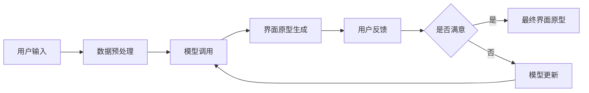

# UI设计智能化：界面原型生成

> 关键词：UI设计、智能化、界面原型生成、设计工具、人工智能

> 摘要：本文聚焦于UI设计智能化中的界面原型生成这一关键领域。随着科技的飞速发展，传统UI设计方式在效率和创新性上逐渐面临挑战，智能化的界面原型生成应运而生。文章详细阐述了相关的核心概念、算法原理、数学模型，通过实际项目案例展示其具体实现过程，探讨了其实际应用场景，推荐了学习和开发相关的工具与资源，最后对未来发展趋势与挑战进行总结，并提供常见问题解答及参考资料，旨在为读者全面深入地介绍UI设计智能化中界面原型生成的相关知识和技术。

## 1. 背景介绍 
### 1.1 目的和范围
在当今数字化时代，用户界面（UI）设计的重要性日益凸显。一个优秀的UI设计能够提升用户体验，增强产品的竞争力。然而，传统的UI设计流程往往耗时较长，需要设计师投入大量的精力进行界面原型的创建和调整。界面原型生成的智能化旨在利用先进的技术手段，如人工智能、机器学习等，提高UI设计的效率和质量，减少设计师的重复性工作。

本文的范围涵盖了UI设计智能化中界面原型生成的各个方面，包括核心概念、算法原理、数学模型、实际应用案例、工具和资源推荐等，旨在为读者提供一个全面、深入的了解。

### 1.2 预期读者
本文的预期读者包括UI设计师、前端开发人员、对人工智能和设计领域感兴趣的技术爱好者、相关专业的学生以及企业中负责产品设计和开发的管理人员等。无论您是初学者还是有一定经验的专业人士，都能从本文中获取有价值的信息。

### 1.3 文档结构概述
本文将按照以下结构进行阐述：首先介绍UI设计智能化中界面原型生成的背景信息，包括目的、预期读者和文档结构概述等；接着详细讲解核心概念与联系，通过文本示意图和Mermaid流程图展示其原理和架构；然后介绍核心算法原理及具体操作步骤，并使用Python源代码进行详细阐述；再讲解相关的数学模型和公式，并举例说明；之后通过项目实战展示代码实际案例和详细解释；探讨其实际应用场景；推荐相关的工具和资源；总结未来发展趋势与挑战；提供常见问题与解答；最后列出扩展阅读和参考资料。

### 1.4 术语表
#### 1.4.1 核心术语定义
- **UI设计**：即用户界面设计，是对软件的人机交互、操作逻辑、界面美观进行的整体设计。
- **智能化**：指在计算机科学和人工智能领域，系统或设备能够模拟人类的智能行为，自动地完成任务或做出决策。
- **界面原型**：是对软件或网站界面的初步设计和模拟，用于展示界面的布局、功能和交互方式。
- **人工智能（AI）**：是研究、开发用于模拟、延伸和扩展人的智能的理论、方法、技术及应用系统的一门新的技术科学。
- **机器学习（ML）**：是一门多领域交叉学科，涉及概率论、统计学、逼近论、凸分析、算法复杂度理论等多门学科。它专门研究计算机怎样模拟或实现人类的学习行为，以获取新的知识或技能，重新组织已有的知识结构使之不断改善自身的性能。

#### 1.4.2 相关概念解释
- **设计模式**：是指在软件开发过程中，针对反复出现的问题所总结归纳出的通用解决方案。在UI设计中，设计模式可以帮助设计师快速创建出符合用户习惯的界面。
- **自然语言处理（NLP）**：是计算机科学领域与人工智能领域中的一个重要方向。它研究能实现人与计算机之间用自然语言进行有效通信的各种理论和方法。在界面原型生成中，NLP可用于将用户的自然语言描述转化为界面设计元素。
- **生成对抗网络（GAN）**：是一种深度学习模型，由生成器和判别器两个神经网络组成。在界面原型生成中，GAN可以用于生成逼真的界面设计。

#### 1.4.3 缩略词列表
- **UI**：User Interface（用户界面）
- **AI**：Artificial Intelligence（人工智能）
- **ML**：Machine Learning（机器学习）
- **NLP**：Natural Language Processing（自然语言处理）
- **GAN**：Generative Adversarial Networks（生成对抗网络）

## 2. 核心概念与联系 
### 核心概念原理
UI设计智能化中的界面原型生成主要基于人工智能和机器学习技术，通过对大量的UI设计数据进行学习和分析，自动生成符合用户需求的界面原型。其核心原理包括以下几个方面：

- **数据驱动**：收集和整理大量的UI设计数据，包括界面布局、颜色搭配、图标设计等，作为训练模型的基础。
- **模型训练**：使用机器学习算法对收集到的数据进行训练，构建能够生成界面原型的模型。常见的算法包括深度学习中的卷积神经网络（CNN）、生成对抗网络（GAN）等。
- **用户交互**：用户可以通过自然语言描述、草图绘制等方式向系统表达自己的设计需求，系统根据用户的输入生成相应的界面原型。
- **优化和调整**：生成的界面原型可能需要根据用户的反馈进行优化和调整，系统可以通过迭代训练不断提高生成原型的质量。

### 架构的文本示意图
```plaintext
用户输入（自然语言描述、草图等）
        |
        v
数据预处理（解析用户输入、提取关键信息）
        |
        v
模型调用（根据用户需求选择合适的模型）
        |
        v
界面原型生成（模型根据输入生成界面原型）
        |
        v
用户反馈（用户对生成的原型进行评价和修改）
        |
        v
模型更新（根据用户反馈更新模型）
```

### Mermaid流程图


## 3. 核心算法原理 & 具体操作步骤 
### 核心算法原理
在界面原型生成中，生成对抗网络（GAN）是一种常用的算法。GAN由生成器（Generator）和判别器（Discriminator）两个神经网络组成，其工作原理如下：

- **生成器**：接收随机噪声作为输入，尝试生成逼真的界面原型。
- **判别器**：接收真实的界面设计数据和生成器生成的界面原型作为输入，判断输入的数据是真实的还是生成的。
- **对抗训练**：生成器和判别器进行对抗训练，生成器不断优化自己的生成能力，使生成的界面原型越来越逼真，判别器不断提高自己的判别能力，区分真实数据和生成数据。

### Python源代码详细阐述
```python
import torch
import torch.nn as nn
import torch.optim as optim
import numpy as np

# 定义生成器
class Generator(nn.Module):
    def __init__(self, input_size, output_size):
        super(Generator, self).__init__()
        self.fc1 = nn.Linear(input_size, 128)
        self.fc2 = nn.Linear(128, 256)
        self.fc3 = nn.Linear(256, output_size)
        self.relu = nn.ReLU()
        self.tanh = nn.Tanh()

    def forward(self, x):
        x = self.relu(self.fc1(x))
        x = self.relu(self.fc2(x))
        x = self.tanh(self.fc3(x))
        return x

# 定义判别器
class Discriminator(nn.Module):
    def __init__(self, input_size):
        super(Discriminator, self).__init__()
        self.fc1 = nn.Linear(input_size, 256)
        self.fc2 = nn.Linear(256, 128)
        self.fc3 = nn.Linear(128, 1)
        self.relu = nn.ReLU()
        self.sigmoid = nn.Sigmoid()

    def forward(self, x):
        x = self.relu(self.fc1(x))
        x = self.relu(self.fc2(x))
        x = self.sigmoid(self.fc3(x))
        return x

# 训练参数设置
input_size = 100
output_size = 784  # 假设界面原型的特征维度为784
batch_size = 32
epochs = 100
learning_rate = 0.0002

# 初始化生成器和判别器
generator = Generator(input_size, output_size)
discriminator = Discriminator(output_size)

# 定义损失函数和优化器
criterion = nn.BCELoss()
g_optimizer = optim.Adam(generator.parameters(), lr=learning_rate)
d_optimizer = optim.Adam(discriminator.parameters(), lr=learning_rate)

# 模拟训练数据
real_data = torch.randn(batch_size, output_size)

# 训练过程
for epoch in range(epochs):
    # 训练判别器
    d_optimizer.zero_grad()

    # 计算判别器对真实数据的损失
    real_labels = torch.ones(batch_size, 1)
    real_output = discriminator(real_data)
    d_real_loss = criterion(real_output, real_labels)

    # 生成假数据
    noise = torch.randn(batch_size, input_size)
    fake_data = generator(noise)

    # 计算判别器对假数据的损失
    fake_labels = torch.zeros(batch_size, 1)
    fake_output = discriminator(fake_data.detach())
    d_fake_loss = criterion(fake_output, fake_labels)

    # 判别器总损失
    d_loss = d_real_loss + d_fake_loss
    d_loss.backward()
    d_optimizer.step()

    # 训练生成器
    g_optimizer.zero_grad()
    fake_labels = torch.ones(batch_size, 1)
    fake_output = discriminator(fake_data)
    g_loss = criterion(fake_output, fake_labels)
    g_loss.backward()
    g_optimizer.step()

    if epoch % 10 == 0:
        print(f'Epoch {epoch}: D_loss = {d_loss.item()}, G_loss = {g_loss.item()}')
```

### 具体操作步骤
1. **数据准备**：收集和整理大量的UI设计数据，将其转换为适合模型训练的格式。
2. **模型定义**：根据上述代码定义生成器和判别器网络。
3. **参数设置**：设置训练参数，如输入大小、输出大小、批量大小、训练轮数、学习率等。
4. **训练过程**：按照上述代码进行训练，不断更新生成器和判别器的参数。
5. **生成界面原型**：训练完成后，使用生成器生成界面原型。

## 4. 数学模型和公式 & 详细讲解 & 举例说明 
### 数学模型
在生成对抗网络（GAN）中，主要涉及到两个目标函数：判别器的目标函数和生成器的目标函数。

### 判别器的目标函数
判别器的目标是最大化正确分类真实数据和生成数据的概率。其目标函数可以表示为：

$$
\max_D \mathbb{E}_{x \sim p_{data}(x)}[\log D(x)] + \mathbb{E}_{z \sim p_z(z)}[\log(1 - D(G(z)))]
$$

其中，$p_{data}(x)$ 表示真实数据的分布，$p_z(z)$ 表示噪声的分布，$D(x)$ 表示判别器对真实数据 $x$ 的判断结果，$G(z)$ 表示生成器根据噪声 $z$ 生成的数据。

### 生成器的目标函数
生成器的目标是最小化判别器将其生成的数据判断为假数据的概率。其目标函数可以表示为：

$$
\min_G \mathbb{E}_{z \sim p_z(z)}[\log(1 - D(G(z)))]
$$

### 详细讲解
- 判别器的目标函数中，第一项 $\mathbb{E}_{x \sim p_{data}(x)}[\log D(x)]$ 表示判别器对真实数据的判断结果的对数期望，希望判别器对真实数据的判断结果尽可能接近 1；第二项 $\mathbb{E}_{z \sim p_z(z)}[\log(1 - D(G(z)))]$ 表示判别器对生成数据的判断结果的对数期望，希望判别器对生成数据的判断结果尽可能接近 0。
- 生成器的目标函数中，$\mathbb{E}_{z \sim p_z(z)}[\log(1 - D(G(z)))]$ 表示判别器对生成数据的判断结果的对数期望，生成器希望判别器对其生成的数据的判断结果尽可能接近 1，即希望生成的数据能够骗过判别器。

### 举例说明
假设我们有一个简单的二分类问题，真实数据的标签为 1，生成数据的标签为 0。判别器的输出是一个概率值，表示输入数据为真实数据的概率。

- 当判别器对真实数据的判断结果为 0.9，对生成数据的判断结果为 0.1 时，判别器的目标函数值为：

$$
\log(0.9) + \log(1 - 0.1) = \log(0.9) + \log(0.9) \approx -0.2107
$$

- 当生成器生成的数据能够让判别器的判断结果为 0.9 时，生成器的目标函数值为：

$$
\log(1 - 0.9) = \log(0.1) \approx -2.3026
$$

## 5. 项目实战：代码实际案例和详细解释说明 
### 5.1  开发环境搭建
1. **安装Python**：推荐使用Python 3.7及以上版本。可以从Python官方网站（https://www.python.org/downloads/）下载安装包进行安装。
2. **安装深度学习框架**：本文使用PyTorch作为深度学习框架。可以使用以下命令安装：
```sh
pip install torch torchvision
```
3. **安装其他依赖库**：根据项目需求，可能还需要安装一些其他的依赖库，如NumPy、Matplotlib等。可以使用以下命令安装：
```sh
pip install numpy matplotlib
```

### 5.2  源代码详细实现和代码解读
```python
import torch
import torch.nn as nn
import torch.optim as optim
import numpy as np
import matplotlib.pyplot as plt

# 定义生成器
class Generator(nn.Module):
    def __init__(self, input_size, output_size):
        super(Generator, self).__init__()
        self.fc1 = nn.Linear(input_size, 128)
        self.fc2 = nn.Linear(128, 256)
        self.fc3 = nn.Linear(256, output_size)
        self.relu = nn.ReLU()
        self.tanh = nn.Tanh()

    def forward(self, x):
        x = self.relu(self.fc1(x))
        x = self.relu(self.fc2(x))
        x = self.tanh(self.fc3(x))
        return x

# 定义判别器
class Discriminator(nn.Module):
    def __init__(self, input_size):
        super(Discriminator, self).__init__()
        self.fc1 = nn.Linear(input_size, 256)
        self.fc2 = nn.Linear(256, 128)
        self.fc3 = nn.Linear(128, 1)
        self.relu = nn.ReLU()
        self.sigmoid = nn.Sigmoid()

    def forward(self, x):
        x = self.relu(self.fc1(x))
        x = self.relu(self.fc2(x))
        x = self.sigmoid(self.fc3(x))
        return x

# 训练参数设置
input_size = 100
output_size = 784  # 假设界面原型的特征维度为784
batch_size = 32
epochs = 100
learning_rate = 0.0002

# 初始化生成器和判别器
generator = Generator(input_size, output_size)
discriminator = Discriminator(output_size)

# 定义损失函数和优化器
criterion = nn.BCELoss()
g_optimizer = optim.Adam(generator.parameters(), lr=learning_rate)
d_optimizer = optim.Adam(discriminator.parameters(), lr=learning_rate)

# 模拟训练数据
real_data = torch.randn(batch_size, output_size)

# 训练过程
d_losses = []
g_losses = []
for epoch in range(epochs):
    # 训练判别器
    d_optimizer.zero_grad()

    # 计算判别器对真实数据的损失
    real_labels = torch.ones(batch_size, 1)
    real_output = discriminator(real_data)
    d_real_loss = criterion(real_output, real_labels)

    # 生成假数据
    noise = torch.randn(batch_size, input_size)
    fake_data = generator(noise)

    # 计算判别器对假数据的损失
    fake_labels = torch.zeros(batch_size, 1)
    fake_output = discriminator(fake_data.detach())
    d_fake_loss = criterion(fake_output, fake_labels)

    # 判别器总损失
    d_loss = d_real_loss + d_fake_loss
    d_loss.backward()
    d_optimizer.step()

    # 训练生成器
    g_optimizer.zero_grad()
    fake_labels = torch.ones(batch_size, 1)
    fake_output = discriminator(fake_data)
    g_loss = criterion(fake_output, fake_labels)
    g_loss.backward()
    g_optimizer.step()

    d_losses.append(d_loss.item())
    g_losses.append(g_loss.item())

    if epoch % 10 == 0:
        print(f'Epoch {epoch}: D_loss = {d_loss.item()}, G_loss = {g_loss.item()}')

# 绘制损失曲线
plt.plot(d_losses, label='Discriminator Loss')
plt.plot(g_losses, label='Generator Loss')
plt.xlabel('Epoch')
plt.ylabel('Loss')
plt.legend()
plt.show()

# 生成界面原型示例
noise = torch.randn(1, input_size)
generated_prototype = generator(noise).detach().numpy()
plt.imshow(generated_prototype.reshape(28, 28), cmap='gray')
plt.show()
```

### 代码解读与分析
1. **生成器和判别器的定义**：
    - `Generator` 类定义了生成器网络，包含三个全连接层和激活函数。
    - `Discriminator` 类定义了判别器网络，同样包含三个全连接层和激活函数。
2. **训练过程**：
    - 判别器的训练：先计算判别器对真实数据和生成数据的损失，然后将两者相加得到总损失，通过反向传播更新判别器的参数。
    - 生成器的训练：计算生成器生成的数据被判别器判断为真实数据的损失，通过反向传播更新生成器的参数。
3. **损失曲线绘制**：
    - 使用 `matplotlib` 库绘制判别器和生成器的损失曲线，方便观察训练过程。
4. **界面原型生成示例**：
    - 训练完成后，使用生成器生成一个界面原型，并将其可视化展示。

## 6. 实际应用场景 
### 快速原型制作
在产品开发的早期阶段，需要快速验证产品的设计概念和用户体验。UI设计智能化中的界面原型生成可以帮助设计师快速生成界面原型，减少手动设计的时间和工作量，提高产品开发的效率。

### 设计灵感启发
设计师在设计过程中可能会遇到创意瓶颈，智能化的界面原型生成可以根据用户输入的关键词或草图，生成多种不同风格的界面原型，为设计师提供设计灵感。

### 个性化设计
根据用户的个性化需求，如年龄、性别、兴趣爱好等，生成符合用户特点的界面原型。例如，为儿童设计的应用程序可以生成色彩鲜艳、图标可爱的界面原型。

### 多平台适配
随着移动设备和桌面设备的多样化，需要设计出在不同平台上都能良好显示的界面。界面原型生成技术可以根据不同平台的特点，自动生成适配的界面原型，减少设计师的工作量。

## 7. 工具和资源推荐
### 7.1 学习资源推荐
#### 7.1.1 书籍推荐
- 《Python深度学习》：由Francois Chollet所著，全面介绍了Python和深度学习的相关知识，包括神经网络、卷积神经网络、循环神经网络等，对于理解界面原型生成中的深度学习算法有很大帮助。
- 《人工智能：一种现代的方法》：这是一本经典的人工智能教材，涵盖了人工智能的各个领域，包括机器学习、自然语言处理等，对于深入了解UI设计智能化的理论基础有重要意义。
- 《用户体验要素：以用户为中心的产品设计》：本书从用户体验的角度出发，介绍了产品设计的各个要素，对于UI设计师理解用户需求和设计原则有很大帮助。

#### 7.1.2 在线课程
- Coursera上的“深度学习专项课程”：由Andrew Ng教授授课，系统地介绍了深度学习的相关知识和技术，包括神经网络、卷积神经网络、循环神经网络等，对于学习界面原型生成中的深度学习算法有很大帮助。
- edX上的“人工智能基础”：该课程介绍了人工智能的基本概念、方法和应用，包括机器学习、自然语言处理等，对于了解UI设计智能化的理论基础有重要意义。
- Udemy上的“UI/UX设计从入门到精通”：该课程从UI/UX设计的基础知识入手，介绍了UI设计的流程、方法和技巧，对于UI设计师提高设计水平有很大帮助。

#### 7.1.3 技术博客和网站
- Medium：这是一个技术博客平台，上面有很多关于人工智能、机器学习、UI设计等领域的优秀文章，可以帮助读者了解最新的技术动态和研究成果。
- Towards Data Science：这是一个专注于数据科学和机器学习的技术博客，上面有很多关于深度学习、生成对抗网络等方面的文章，对于学习界面原型生成中的算法有很大帮助。
- Dribbble：这是一个设计师社区，上面有很多优秀的UI设计作品，可以为设计师提供设计灵感。

### 7.2 开发工具框架推荐
#### 7.2.1 IDE和编辑器
- PyCharm：这是一款专业的Python集成开发环境，提供了丰富的代码编辑、调试、代码分析等功能，对于开发基于Python的界面原型生成系统非常方便。
- Visual Studio Code：这是一款轻量级的代码编辑器，支持多种编程语言和插件扩展，对于快速开发和调试界面原型生成系统有很大帮助。

#### 7.2.2 调试和性能分析工具
- PyTorch Profiler：这是PyTorch自带的性能分析工具，可以帮助开发者分析模型的训练和推理时间，找出性能瓶颈，进行优化。
- TensorBoard：这是TensorFlow的可视化工具，也可以与PyTorch结合使用，用于可视化模型的训练过程、损失曲线、梯度等信息，方便开发者进行调试和优化。

#### 7.2.3 相关框架和库
- PyTorch：这是一个开源的深度学习框架，提供了丰富的神经网络模型和优化算法，对于开发界面原型生成系统非常方便。
- NumPy：这是一个Python的科学计算库，提供了高效的数组操作和数学函数，对于处理UI设计数据和进行数值计算有很大帮助。
- Matplotlib：这是一个Python的绘图库，提供了丰富的绘图功能，对于可视化界面原型和训练过程有很大帮助。

### 7.3 相关论文著作推荐
#### 7.3.1 经典论文
- Goodfellow, I. J., et al. "Generative adversarial nets." Advances in neural information processing systems. 2014. 这篇论文首次提出了生成对抗网络（GAN）的概念，为界面原型生成中的生成模型提供了重要的理论基础。
- LeCun, Y., Bengio, Y., & Hinton, G. "Deep learning." nature 521.7553 (2015): 436-444. 这篇论文对深度学习的发展和应用进行了全面的综述，对于理解界面原型生成中的深度学习算法有重要意义。

#### 7.3.2 最新研究成果
- 关注arXiv等学术预印本平台上关于人工智能、机器学习、UI设计等领域的最新研究成果，了解界面原型生成技术的最新发展动态。

#### 7.3.3 应用案例分析
- 关注相关的学术会议和期刊，如ACM SIGGRAPH、IEEE Transactions on Visualization and Computer Graphics等，了解界面原型生成技术在实际应用中的案例和经验。

## 8. 总结：未来发展趋势与挑战
### 未来发展趋势
- **更加智能化**：随着人工智能技术的不断发展，界面原型生成系统将变得更加智能化，能够更好地理解用户的需求，生成更加高质量、个性化的界面原型。
- **与其他技术的融合**：界面原型生成技术将与虚拟现实（VR）、增强现实（AR）、物联网（IoT）等技术进行融合，为用户提供更加沉浸式、交互式的界面体验。
- **自动化设计流程**：未来的界面原型生成系统将实现自动化的设计流程，从需求分析、设计生成到优化调整，整个过程都可以自动完成，大大提高设计效率。

### 挑战
- **数据质量和多样性**：界面原型生成需要大量高质量、多样性的数据进行训练，如何获取和整理这些数据是一个挑战。
- **模型的可解释性**：深度学习模型通常是黑盒模型，其决策过程难以解释，如何提高模型的可解释性是一个重要的问题。
- **用户需求的理解**：准确理解用户的需求是生成高质量界面原型的关键，如何通过自然语言描述、草图等方式准确理解用户的需求是一个挑战。

## 9. 附录：常见问题与解答
### 问题1：界面原型生成系统生成的界面是否可以直接用于产品开发？
解答：一般来说，界面原型生成系统生成的界面只是一个初步的设计，可能需要根据产品的具体需求和用户反馈进行进一步的优化和调整，才能用于产品开发。

### 问题2：如何提高界面原型生成系统的生成质量？
解答：可以从以下几个方面提高生成质量：增加训练数据的数量和多样性、优化模型的结构和参数、引入用户反馈进行迭代训练等。

### 问题3：界面原型生成系统是否可以支持多种设计风格？
解答：一些先进的界面原型生成系统可以通过学习不同风格的设计数据，支持多种设计风格的生成。用户可以根据自己的需求选择合适的设计风格。

### 问题4：界面原型生成系统的训练时间一般需要多久？
解答：训练时间取决于多个因素，如训练数据的大小、模型的复杂度、硬件设备的性能等。一般来说，训练时间可能从几个小时到几天不等。

## 10. 扩展阅读 & 参考资料
### 扩展阅读
- 《设计心理学》：由唐纳德·诺曼所著，从心理学的角度出发，介绍了设计的原则和方法，对于理解用户需求和设计优秀的界面有很大帮助。
- 《代码大全》：这是一本软件开发的经典著作，介绍了软件开发的各个方面，包括代码设计、编程规范、调试和测试等，对于开发界面原型生成系统有重要的参考价值。

### 参考资料
- 相关的学术论文和研究报告，如ACM SIGGRAPH、IEEE Transactions on Visualization and Computer Graphics等会议和期刊上的论文。
- 开源项目和代码库，如GitHub上的相关项目，可用于学习和参考界面原型生成系统的实现方法。
- 各大技术公司的官方文档和博客，如PyTorch、TensorFlow等的官方文档，可用于了解最新的技术和工具。