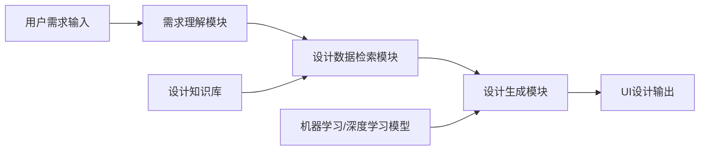

# UI设计的智能化革新

> 关键词：UI设计、智能化、人工智能、用户体验、设计工具、自动化、革新

> 摘要：本文聚焦于UI设计的智能化革新这一前沿话题。随着人工智能技术的飞速发展，UI设计领域正经历着深刻的变革。文章将全面探讨UI设计智能化革新的背景、核心概念、算法原理、数学模型，通过项目实战案例深入分析其具体实现和应用，介绍相关的工具和资源，最后对未来发展趋势与挑战进行总结，并解答常见问题，为读者呈现一个全面而深入的UI设计智能化革新图景。

## 1. 背景介绍 
### 1.1 目的和范围
UI设计作为人机交互的重要环节，直接影响着用户对产品的第一印象和使用体验。随着数字化时代的发展，用户对界面设计的要求越来越高，传统的UI设计方式在效率和创新性上逐渐难以满足需求。本文旨在深入探讨UI设计智能化革新的相关技术和应用，范围涵盖智能化设计的核心概念、算法原理、实际应用场景等多个方面，帮助读者全面了解这一领域的发展现状和趋势。

### 1.2 预期读者
本文预期读者包括UI设计师、前端开发工程师、产品经理、人工智能研究人员以及对UI设计和智能化技术感兴趣的相关人士。通过阅读本文，读者可以获取关于UI设计智能化革新的专业知识和实践经验，为其在工作和学习中提供参考和启发。

### 1.3 文档结构概述
本文将按照以下结构展开：首先介绍UI设计智能化革新的背景，包括目的、预期读者和文档结构概述等内容；接着阐述核心概念与联系，通过文本示意图和Mermaid流程图展示智能化设计的原理和架构；然后详细讲解核心算法原理和具体操作步骤，并使用Python源代码进行阐述；随后介绍数学模型和公式，并通过举例说明其应用；再通过项目实战案例，包括开发环境搭建、源代码实现和代码解读，深入分析智能化设计的实际应用；接着探讨实际应用场景；之后推荐相关的工具和资源；最后总结未来发展趋势与挑战，解答常见问题，并提供扩展阅读和参考资料。

### 1.4 术语表
#### 1.4.1 核心术语定义
- **UI设计**：即用户界面设计，是对软件的人机交互、操作逻辑、界面美观进行的整体设计。
- **智能化**：指事物在网络、大数据、物联网和人工智能等技术的支持下，所具有的能动地满足人的各种需求的属性。
- **人工智能**：它是研究、开发用于模拟、延伸和扩展人的智能的理论、方法、技术及应用系统的一门新的技术科学。
- **用户体验**：指用户在使用一个产品或系统之前、使用期间和使用之后的全部感受，包括情感、信仰、喜好、认知印象、生理和心理反应、行为和成就等各个方面。

#### 1.4.2 相关概念解释
- **自动化设计**：利用计算机程序和算法自动生成设计方案的过程，减少人工干预，提高设计效率。
- **机器学习**：一门多领域交叉学科，涉及概率论、统计学、逼近论、凸分析、算法复杂度理论等多门学科。它专门研究计算机怎样模拟或实现人类的学习行为，以获取新的知识或技能，重新组织已有的知识结构使之不断改善自身的性能。
- **深度学习**：机器学习的一个分支领域，它是一种基于对数据进行表征学习的方法。深度学习通过构建具有很多层的神经网络模型，自动从大量数据中学习特征和模式。

#### 1.4.3 缩略词列表
- **AI**：Artificial Intelligence，人工智能
- **ML**：Machine Learning，机器学习
- **DL**：Deep Learning，深度学习
- **UX**：User Experience，用户体验

## 2. 核心概念与联系 

### 核心概念原理
UI设计的智能化革新主要基于人工智能技术，通过机器学习、深度学习等算法，让计算机自动理解用户需求、分析设计数据，并生成高质量的UI设计方案。其核心原理在于利用大量的设计数据进行训练，使模型学习到设计的规律和模式，从而能够根据输入的需求生成相应的设计。

例如，通过对大量优秀UI设计作品的分析，模型可以学习到颜色搭配、布局方式、图标设计等方面的知识。当用户输入特定的设计需求，如应用类型、目标用户群体等，模型就可以根据学习到的知识生成符合要求的UI设计方案。

### 架构的文本示意图
```plaintext
用户需求输入 -> 需求理解模块 -> 设计数据检索模块 -> 设计生成模块 -> UI设计输出
|                                           |
|                                           |
|                                           v
|                                       设计知识库（包含大量设计数据和规则）
|                                           |
|                                           |
|                                           v
|                                       机器学习/深度学习模型（经过训练）
```

### Mermaid流程图


## 3. 核心算法原理 & 具体操作步骤 

### 核心算法原理
在UI设计的智能化革新中，常用的算法包括卷积神经网络（CNN）、生成对抗网络（GAN）等。

#### 卷积神经网络（CNN）
CNN主要用于图像特征提取和分类。在UI设计中，可以用CNN对设计图像进行分析，提取颜色、形状、纹理等特征。以下是一个简单的Python代码示例，使用PyTorch实现一个简单的CNN模型：

```python
import torch
import torch.nn as nn
import torch.nn.functional as F

class SimpleCNN(nn.Module):
    def __init__(self):
        super(SimpleCNN, self).__init__()
        self.conv1 = nn.Conv2d(3, 16, kernel_size=3, padding=1)
        self.pool = nn.MaxPool2d(2, 2)
        self.conv2 = nn.Conv2d(16, 32, kernel_size=3, padding=1)
        self.fc1 = nn.Linear(32 * 8 * 8, 128)
        self.fc2 = nn.Linear(128, 10)

    def forward(self, x):
        x = self.pool(F.relu(self.conv1(x)))
        x = self.pool(F.relu(self.conv2(x)))
        x = x.view(-1, 32 * 8 * 8)
        x = F.relu(self.fc1(x))
        x = self.fc2(x)
        return x
```

#### 生成对抗网络（GAN）
GAN由生成器和判别器组成，生成器用于生成新的设计，判别器用于判断生成的设计是否真实。两者通过对抗训练不断提高性能。以下是一个简单的GAN代码示例：

```python
import torch
import torch.nn as nn
import torch.optim as optim

# 生成器
class Generator(nn.Module):
    def __init__(self):
        super(Generator, self).__init__()
        self.fc1 = nn.Linear(100, 256)
        self.fc2 = nn.Linear(256, 512)
        self.fc3 = nn.Linear(512, 784)

    def forward(self, x):
        x = torch.relu(self.fc1(x))
        x = torch.relu(self.fc2(x))
        x = torch.tanh(self.fc3(x))
        return x

# 判别器
class Discriminator(nn.Module):
    def __init__(self):
        super(Discriminator, self).__init__()
        self.fc1 = nn.Linear(784, 512)
        self.fc2 = nn.Linear(512, 256)
        self.fc3 = nn.Linear(256, 1)

    def forward(self, x):
        x = torch.relu(self.fc1(x))
        x = torch.relu(self.fc2(x))
        x = torch.sigmoid(self.fc3(x))
        return x

# 训练过程
device = torch.device("cuda" if torch.cuda.is_available() else "cpu")
generator = Generator().to(device)
discriminator = Discriminator().to(device)

criterion = nn.BCELoss()
g_optimizer = optim.Adam(generator.parameters(), lr=0.0002)
d_optimizer = optim.Adam(discriminator.parameters(), lr=0.0002)

# 训练循环
for epoch in range(100):
    for real_images in data_loader:
        real_images = real_images.to(device)
        batch_size = real_images.size(0)

        # 训练判别器
        discriminator.zero_grad()
        real_labels = torch.ones(batch_size, 1).to(device)
        fake_labels = torch.zeros(batch_size, 1).to(device)

        real_output = discriminator(real_images.view(batch_size, -1))
        d_real_loss = criterion(real_output, real_labels)

        noise = torch.randn(batch_size, 100).to(device)
        fake_images = generator(noise)
        fake_output = discriminator(fake_images.detach())
        d_fake_loss = criterion(fake_output, fake_labels)

        d_loss = d_real_loss + d_fake_loss
        d_loss.backward()
        d_optimizer.step()

        # 训练生成器
        generator.zero_grad()
        output = discriminator(fake_images)
        g_loss = criterion(output, real_labels)
        g_loss.backward()
        g_optimizer.step()
```

### 具体操作步骤
1. **数据收集**：收集大量的UI设计数据，包括设计图片、设计文档、用户反馈等。
2. **数据预处理**：对收集到的数据进行清洗、标注和归一化等处理，以便模型能够更好地学习。
3. **模型选择和训练**：根据设计需求选择合适的模型，如CNN、GAN等，并使用预处理后的数据进行训练。
4. **需求输入**：用户输入设计需求，如应用类型、颜色偏好、布局要求等。
5. **设计生成**：模型根据用户需求生成UI设计方案。
6. **评估和优化**：对生成的设计方案进行评估，根据评估结果对模型进行优化。

## 4. 数学模型和公式 & 详细讲解 & 举例说明 

### 损失函数
在机器学习和深度学习中，损失函数用于衡量模型预测结果与真实结果之间的差异。常用的损失函数包括交叉熵损失函数、均方误差损失函数等。

#### 交叉熵损失函数
交叉熵损失函数常用于分类问题，其公式为：
$$
H(p, q) = - \sum_{i=1}^{n} p_i \log(q_i)
$$
其中，$p$ 是真实概率分布，$q$ 是预测概率分布。

例如，在一个二分类问题中，真实标签为 $y \in \{0, 1\}$，预测概率为 $\hat{y}$，则交叉熵损失函数可以表示为：
$$
L(y, \hat{y}) = - y \log(\hat{y}) - (1 - y) \log(1 - \hat{y})
$$

#### 均方误差损失函数
均方误差损失函数常用于回归问题，其公式为：
$$
MSE = \frac{1}{n} \sum_{i=1}^{n} (y_i - \hat{y}_i)^2
$$
其中，$y_i$ 是真实值，$\hat{y}_i$ 是预测值。

### 梯度下降算法
梯度下降算法是一种常用的优化算法，用于最小化损失函数。其基本思想是沿着损失函数的负梯度方向更新模型参数。

梯度下降算法的更新公式为：
$$
\theta_{t+1} = \theta_t - \alpha \nabla L(\theta_t)
$$
其中，$\theta$ 是模型参数，$\alpha$ 是学习率，$\nabla L(\theta_t)$ 是损失函数在 $\theta_t$ 处的梯度。

例如，在一个简单的线性回归问题中，损失函数为均方误差损失函数，模型参数为 $\theta = [w, b]$，则梯度下降算法的更新公式为：
$$
w_{t+1} = w_t - \alpha \frac{\partial MSE}{\partial w}
$$
$$
b_{t+1} = b_t - \alpha \frac{\partial MSE}{\partial b}
$$

### 举例说明
假设我们有一个简单的二分类问题，真实标签为 $y = [1, 0, 1]$，预测概率为 $\hat{y} = [0.8, 0.2, 0.9]$，则交叉熵损失函数的计算如下：
$$
L(y, \hat{y}) = - \frac{1}{3} (1 \log(0.8) + (1 - 0) \log(1 - 0.2) + 1 \log(0.9) + (1 - 1) \log(1 - 0.9))
$$
$$
\approx - \frac{1}{3} (0.223 + 0.223 + 0.105 + 0) \approx 0.184
$$

## 5. 项目实战：代码实际案例和详细解释说明 

### 5.1  开发环境搭建
1. **安装Python**：建议使用Python 3.7及以上版本。
2. **安装深度学习框架**：可以选择PyTorch或TensorFlow等深度学习框架。以PyTorch为例，可以使用以下命令进行安装：
```sh
pip install torch torchvision
```
3. **安装其他依赖库**：根据项目需求，安装其他必要的依赖库，如NumPy、Pandas、Matplotlib等。

### 5.2  源代码详细实现和代码解读
以下是一个简单的基于PyTorch的UI设计分类项目示例：

```python
import torch
import torch.nn as nn
import torch.optim as optim
from torchvision import datasets, transforms
from torch.utils.data import DataLoader

# 数据预处理
transform = transforms.Compose([
    transforms.Resize((32, 32)),
    transforms.ToTensor(),
    transforms.Normalize((0.5, 0.5, 0.5), (0.5, 0.5, 0.5))
])

# 加载数据集
train_dataset = datasets.ImageFolder(root='train_data', transform=transform)
train_loader = DataLoader(train_dataset, batch_size=32, shuffle=True)

test_dataset = datasets.ImageFolder(root='test_data', transform=transform)
test_loader = DataLoader(test_dataset, batch_size=32, shuffle=False)

# 定义模型
class UI_Classifier(nn.Module):
    def __init__(self):
        super(UI_Classifier, self).__init__()
        self.conv1 = nn.Conv2d(3, 16, kernel_size=3, padding=1)
        self.pool = nn.MaxPool2d(2, 2)
        self.conv2 = nn.Conv2d(16, 32, kernel_size=3, padding=1)
        self.fc1 = nn.Linear(32 * 8 * 8, 128)
        self.fc2 = nn.Linear(128, 10)

    def forward(self, x):
        x = self.pool(torch.relu(self.conv1(x)))
        x = self.pool(torch.relu(self.conv2(x)))
        x = x.view(-1, 32 * 8 * 8)
        x = torch.relu(self.fc1(x))
        x = self.fc2(x)
        return x

# 初始化模型、损失函数和优化器
model = UI_Classifier()
criterion = nn.CrossEntropyLoss()
optimizer = optim.Adam(model.parameters(), lr=0.001)

# 训练模型
num_epochs = 10
for epoch in range(num_epochs):
    running_loss = 0.0
    for i, (images, labels) in enumerate(train_loader):
        optimizer.zero_grad()
        outputs = model(images)
        loss = criterion(outputs, labels)
        loss.backward()
        optimizer.step()
        running_loss += loss.item()
    print(f'Epoch {epoch + 1}, Loss: {running_loss / len(train_loader)}')

# 测试模型
correct = 0
total = 0
with torch.no_grad():
    for images, labels in test_loader:
        outputs = model(images)
        _, predicted = torch.max(outputs.data, 1)
        total += labels.size(0)
        correct += (predicted == labels).sum().item()

print(f'Accuracy: {100 * correct / total}%')
```

### 5.3  代码解读与分析
1. **数据预处理**：使用 `transforms.Compose` 对图像数据进行预处理，包括调整大小、转换为张量和归一化等操作。
2. **数据集加载**：使用 `datasets.ImageFolder` 加载图像数据集，并使用 `DataLoader` 进行批量处理。
3. **模型定义**：定义一个简单的卷积神经网络模型 `UI_Classifier`，包括卷积层、池化层和全连接层。
4. **训练过程**：使用交叉熵损失函数和Adam优化器进行模型训练，通过多次迭代更新模型参数。
5. **测试过程**：在测试集上评估模型的准确率，使用 `torch.max` 函数获取预测结果。

## 6. 实际应用场景 
### 快速原型设计
在产品开发的初期，需要快速生成UI设计原型，以便进行用户测试和验证。智能化UI设计工具可以根据产品的基本需求，如功能模块、目标用户群体等，快速生成多个设计方案，大大缩短了原型设计的时间。

### 个性化设计
不同的用户有不同的设计偏好，智能化UI设计可以根据用户的行为数据、历史记录等信息，为用户提供个性化的UI设计方案。例如，电商应用可以根据用户的购买习惯和浏览历史，为用户推荐个性化的商品展示界面。

### 设计优化
通过对用户行为数据的分析，智能化设计工具可以发现UI设计中存在的问题，如用户操作不便、信息展示不清晰等，并自动生成优化方案。例如，根据用户在应用中的点击热力图，调整按钮的位置和大小，提高用户体验。

### 多平台适配
随着移动设备的多样化，UI设计需要在不同的平台和设备上保持良好的显示效果。智能化设计工具可以根据设备的屏幕尺寸、分辨率等信息，自动调整设计方案，实现多平台适配。

## 7. 工具和资源推荐
### 7.1 学习资源推荐
#### 7.1.1 书籍推荐
- 《Python深度学习》：介绍了Python在深度学习领域的应用，包括神经网络、卷积神经网络、循环神经网络等内容。
- 《人工智能：一种现代的方法》：全面介绍了人工智能的基本概念、算法和应用，是人工智能领域的经典教材。
- 《用户体验要素：以用户为中心的产品设计》：深入探讨了用户体验设计的原则和方法，对UI设计有重要的指导意义。

#### 7.1.2 在线课程
- Coursera上的“深度学习专项课程”：由深度学习领域的知名学者授课，系统介绍了深度学习的理论和实践。
- edX上的“人工智能基础”：讲解了人工智能的基本概念、算法和应用，适合初学者学习。
- 网易云课堂上的“UI设计实战教程”：提供了丰富的UI设计案例和实践经验，帮助学习者提高UI设计能力。

#### 7.1.3 技术博客和网站
- Medium：有很多关于UI设计和人工智能的技术文章和案例分享。
- 知乎：可以关注相关的话题和专栏，获取最新的技术动态和观点。
- 开源中国：提供了丰富的开源项目和技术资源，对学习和实践有很大的帮助。

### 7.2 开发工具框架推荐
#### 7.2.1 IDE和编辑器
- PyCharm：一款专业的Python集成开发环境，提供了丰富的代码编辑、调试和分析功能。
- Visual Studio Code：一款轻量级的代码编辑器，支持多种编程语言和插件扩展，适合快速开发和调试。

#### 7.2.2 调试和性能分析工具
- TensorBoard：TensorFlow提供的可视化工具，可以用于查看模型的训练过程、性能指标等信息。
- PyTorch Profiler：PyTorch提供的性能分析工具，可以帮助开发者找出代码中的性能瓶颈。

#### 7.2.3 相关框架和库
- PyTorch：一个开源的深度学习框架，提供了丰富的神经网络模型和工具，易于使用和扩展。
- TensorFlow：另一个流行的深度学习框架，具有强大的分布式训练和部署能力。
- Scikit-learn：一个用于机器学习的Python库，提供了多种机器学习算法和工具，适合快速开发和实验。

### 7.3 相关论文著作推荐
#### 7.3.1 经典论文
- “Generative Adversarial Nets”：介绍了生成对抗网络（GAN）的基本原理和算法，是GAN领域的经典论文。
- “ImageNet Classification with Deep Convolutional Neural Networks”：提出了AlexNet卷积神经网络，开启了深度学习在图像识别领域的热潮。

#### 7.3.2 最新研究成果
- 关注顶级学术会议，如CVPR（计算机视觉与模式识别会议）、ICML（国际机器学习会议）等，了解最新的研究成果和技术趋势。

#### 7.3.3 应用案例分析
- 一些知名科技公司的技术博客会分享他们在UI设计智能化方面的应用案例和实践经验，可以从中学习和借鉴。

## 8. 总结：未来发展趋势与挑战
### 未来发展趋势
1. **更加智能化**：随着人工智能技术的不断发展，UI设计将更加智能化，能够自动理解用户需求，生成更加个性化、高质量的设计方案。
2. **跨领域融合**：UI设计将与虚拟现实（VR）、增强现实（AR）、物联网（IoT）等技术深度融合，创造出更加沉浸式、交互式的用户体验。
3. **自动化设计流程**：智能化设计工具将实现从需求分析、设计生成到设计优化的全流程自动化，大大提高设计效率。

### 挑战
1. **数据隐私和安全**：智能化设计需要大量的用户数据，如何保护用户数据的隐私和安全是一个重要的挑战。
2. **设计创意和个性化**：虽然智能化设计可以提高效率，但如何在设计中保持创意和个性化，满足用户的多样化需求，是需要解决的问题。
3. **技术门槛和人才短缺**：智能化设计涉及到人工智能、机器学习等前沿技术，对设计师和开发人员的技术水平要求较高，目前相关人才短缺。

## 9. 附录：常见问题与解答
### 智能化UI设计会取代设计师吗？
不会。智能化UI设计工具可以辅助设计师提高工作效率，但设计过程中需要的创意、审美和用户体验理解等能力是人工智能无法替代的。设计师可以利用智能化工具，将更多的时间和精力投入到更有价值的设计工作中。

### 智能化UI设计的准确性如何保证？
智能化UI设计的准确性主要依赖于训练数据的质量和模型的性能。通过收集大量的高质量设计数据，并使用合适的模型进行训练和优化，可以提高设计的准确性。同时，在实际应用中，还需要人工对生成的设计方案进行评估和调整。

### 如何选择适合的智能化UI设计工具？
选择适合的智能化UI设计工具需要考虑以下因素：工具的功能和性能、易用性、与现有工作流程的兼容性、价格等。可以通过试用不同的工具，了解其特点和优势，根据自己的需求进行选择。

## 10. 扩展阅读 & 参考资料
1. 《设计心理学》，作者：唐纳德·A·诺曼
2. 《深度学习入门：基于Python的理论与实现》，作者：斋藤康毅
3. 相关学术期刊和会议论文，如ACM Transactions on Graphics、IEEE Transactions on Pattern Analysis and Machine Intelligence等
4. 知名科技公司的技术博客，如Google AI Blog、Facebook AI Research等