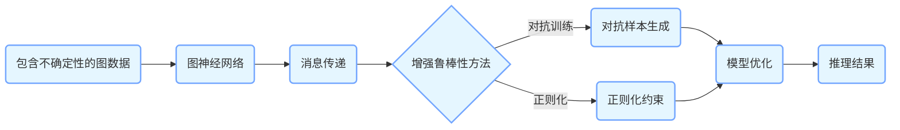

# 不确定性推理中图神经网络的鲁棒性增强

> 关键词：不确定性推理、图神经网络、鲁棒性增强、对抗训练、正则化

> 摘要：本文聚焦于不确定性推理中图神经网络的鲁棒性增强问题。首先介绍了研究的背景，包括目的、预期读者等内容。接着阐述了不确定性推理、图神经网络以及鲁棒性等核心概念及其联系，通过文本示意图和Mermaid流程图进行直观展示。详细讲解了增强鲁棒性的核心算法原理，并给出Python源代码示例。探讨了相关的数学模型和公式，辅以具体例子说明。通过项目实战，从开发环境搭建到源代码实现和解读，深入剖析了如何在实际中增强图神经网络的鲁棒性。分析了其实际应用场景，推荐了学习、开发所需的工具和资源，包括书籍、在线课程、开发工具框架以及相关论文著作。最后总结了未来发展趋势与挑战，并提供常见问题解答和扩展阅读参考资料，旨在为相关领域的研究和实践提供全面而深入的指导。

## 1. 背景介绍 
### 1.1 目的和范围
在当今复杂的现实世界中，数据往往伴随着各种不确定性，例如数据的缺失、噪声以及数据之间关系的模糊性等。图神经网络（Graph Neural Networks，GNN）作为一种强大的工具，能够处理图结构数据，在社交网络分析、生物信息学、交通流量预测等众多领域取得了显著的成果。然而，在不确定性推理的场景下，图神经网络的性能可能会受到严重影响，表现出鲁棒性不足的问题。

本文的目的在于深入研究如何增强不确定性推理中图神经网络的鲁棒性。具体范围包括探讨图神经网络在不确定性推理中的核心概念和原理，介绍增强鲁棒性的核心算法，通过数学模型和公式进行理论分析，结合实际项目案例展示具体的实现方法，分析其在不同领域的实际应用场景，推荐相关的学习和开发资源，并对未来的发展趋势和挑战进行总结。

### 1.2 预期读者
本文预期读者主要包括以下几类人群：
- **研究人员**：对图神经网络、不确定性推理以及鲁棒性研究感兴趣的学术研究人员，他们可以从本文中获取最新的研究思路和方法，为自己的研究工作提供参考。
- **工程师**：从事图数据处理、机器学习和人工智能应用开发的工程师，通过本文可以学习到如何在实际项目中增强图神经网络的鲁棒性，提高系统的稳定性和可靠性。
- **学生**：相关专业的本科生和研究生，本文可以作为他们学习图神经网络和不确定性推理的参考资料，帮助他们深入理解相关概念和技术。

### 1.3 文档结构概述
本文将按照以下结构进行组织：
- **核心概念与联系**：介绍不确定性推理、图神经网络和鲁棒性的核心概念，以及它们之间的联系，通过文本示意图和Mermaid流程图进行直观展示。
- **核心算法原理 & 具体操作步骤**：详细讲解增强图神经网络鲁棒性的核心算法原理，并给出Python源代码示例，说明具体的操作步骤。
- **数学模型和公式 & 详细讲解 & 举例说明**：使用数学模型和公式对增强鲁棒性的方法进行理论分析，并通过具体例子进行说明。
- **项目实战：代码实际案例和详细解释说明**：通过实际项目案例，从开发环境搭建到源代码实现和解读，深入剖析如何在实际中增强图神经网络的鲁棒性。
- **实际应用场景**：分析图神经网络在不确定性推理场景下的实际应用，如社交网络分析、生物信息学等。
- **工具和资源推荐**：推荐相关的学习资源，包括书籍、在线课程、技术博客和网站；开发工具框架，如IDE和编辑器、调试和性能分析工具、相关框架和库；以及相关论文著作。
- **总结：未来发展趋势与挑战**：总结图神经网络在不确定性推理中鲁棒性增强的未来发展趋势和面临的挑战。
- **附录：常见问题与解答**：提供常见问题的解答，帮助读者更好地理解本文内容。
- **扩展阅读 & 参考资料**：提供扩展阅读的建议和相关参考资料，方便读者进一步深入学习。

### 1.4 术语表
#### 1.4.1 核心术语定义
- **不确定性推理**：在信息不完整、不确定的情况下进行推理的过程。在图数据中，不确定性可能来自于数据的缺失、噪声以及图结构的动态变化等。
- **图神经网络（GNN）**：一类专门处理图结构数据的神经网络模型，通过节点之间的消息传递来学习节点和图的表示。
- **鲁棒性**：系统在面对各种干扰、噪声和不确定性时，仍能保持稳定性能的能力。在图神经网络中，鲁棒性表现为模型在不确定性推理场景下的准确性和稳定性。

#### 1.4.2 相关概念解释
- **消息传递机制**：图神经网络中节点之间信息传播的方式，通过聚合邻居节点的信息来更新当前节点的表示。
- **对抗训练**：一种增强模型鲁棒性的方法，通过生成对抗样本并让模型学习应对这些样本，提高模型在面对干扰时的性能。
- **正则化**：在模型训练过程中加入额外的约束，防止模型过拟合，提高模型的泛化能力和鲁棒性。

#### 1.4.3 缩略词列表
- **GNN**：Graph Neural Networks（图神经网络）
- **MLP**：Multi - Layer Perceptron（多层感知机）
- **SGD**：Stochastic Gradient Descent（随机梯度下降）

## 2. 核心概念与联系 

### 核心概念原理

#### 不确定性推理
不确定性推理是处理不完整、不准确信息的重要手段。在图数据中，不确定性可能体现在多个方面。例如，在社交网络中，用户之间的关系可能存在虚假连接或未被发现的连接；在生物分子图中，分子之间的相互作用可能存在测量误差。常见的不确定性推理方法包括概率推理、模糊推理等。概率推理通过概率分布来描述不确定性，例如贝叶斯网络就是一种基于概率的不确定性推理模型。

#### 图神经网络
图神经网络是一种专门用于处理图结构数据的神经网络。它的核心思想是通过节点之间的消息传递来学习节点和图的表示。图神经网络的基本结构包括输入层、隐藏层和输出层。在隐藏层中，节点通过聚合邻居节点的信息来更新自己的表示。常见的图神经网络模型有图卷积网络（GCN）、图注意力网络（GAT）等。

#### 鲁棒性
鲁棒性是指系统在面对各种干扰、噪声和不确定性时，仍能保持稳定性能的能力。在图神经网络中，鲁棒性的增强可以通过多种方法实现，例如对抗训练、正则化等。对抗训练通过生成对抗样本并让模型学习应对这些样本，提高模型在面对干扰时的性能；正则化则通过在损失函数中加入额外的约束项，防止模型过拟合，提高模型的泛化能力。

### 架构的文本示意图
图神经网络在不确定性推理中的架构可以描述如下：
输入是包含不确定性的图数据，包括节点特征和图结构信息。首先，图神经网络通过消息传递机制对节点进行特征更新，学习节点的表示。在这个过程中，不确定性可能会影响消息传递的准确性。为了增强鲁棒性，我们可以采用对抗训练或正则化等方法对模型进行优化。最后，模型输出推理结果，例如节点分类、图分类等。

### Mermaid流程图


## 3. 核心算法原理 & 具体操作步骤 

### 核心算法原理

#### 对抗训练
对抗训练的核心思想是通过生成对抗样本，让模型学习应对这些样本，从而提高模型的鲁棒性。在图神经网络中，对抗样本可以通过对图结构或节点特征进行微小扰动来生成。具体来说，我们可以定义一个对抗扰动 $\Delta \mathbf{X}$ 或 $\Delta \mathbf{A}$，其中 $\mathbf{X}$ 是节点特征矩阵，$\mathbf{A}$ 是邻接矩阵。然后，我们在原始数据 $(\mathbf{X}, \mathbf{A})$ 的基础上加上对抗扰动，得到对抗样本 $(\mathbf{X} + \Delta \mathbf{X}, \mathbf{A} + \Delta \mathbf{A})$。模型在训练过程中需要同时学习原始数据和对抗样本，以提高其鲁棒性。

#### 正则化
正则化是一种常用的防止模型过拟合的方法。在图神经网络中，我们可以使用 $L_1$ 或 $L_2$ 正则化来约束模型的参数。具体来说，我们在损失函数中加入正则化项 $\lambda \|\mathbf{W}\|_p$，其中 $\mathbf{W}$ 是模型的参数矩阵，$p$ 可以取 1 或 2，$\lambda$ 是正则化系数。通过调整 $\lambda$ 的值，我们可以控制正则化的强度。

### 具体操作步骤

#### 对抗训练的Python代码实现
```python
import torch
import torch.nn as nn
import torch.optim as optim
from torch_geometric.data import Data
from torch_geometric.nn import GCNConv

# 定义图神经网络模型
class GCN(nn.Module):
    def __init__(self, in_channels, hidden_channels, out_channels):
        super(GCN, self).__init__()
        self.conv1 = GCNConv(in_channels, hidden_channels)
        self.conv2 = GCNConv(hidden_channels, out_channels)

    def forward(self, x, edge_index):
        x = self.conv1(x, edge_index)
        x = torch.relu(x)
        x = self.conv2(x, edge_index)
        return x

# 生成图数据
x = torch.tensor([[1.0], [2.0], [3.0], [4.0]], dtype=torch.float)
edge_index = torch.tensor([[0, 1, 1, 2, 2, 3], [1, 0, 2, 1, 3, 2]], dtype=torch.long)
y = torch.tensor([0, 1, 0, 1], dtype=torch.long)
data = Data(x=x, edge_index=edge_index, y=y)

# 初始化模型、损失函数和优化器
model = GCN(in_channels=1, hidden_channels=16, out_channels=2)
criterion = nn.CrossEntropyLoss()
optimizer = optim.Adam(model.parameters(), lr=0.01)

# 对抗训练参数
epsilon = 0.01
num_epochs = 100

for epoch in range(num_epochs):
    model.train()
    optimizer.zero_grad()

    # 原始数据前向传播
    output = model(data.x, data.edge_index)
    loss = criterion(output, data.y)

    # 生成对抗样本
    delta_x = torch.randn_like(data.x) * epsilon
    perturbed_x = data.x + delta_x
    perturbed_output = model(perturbed_x, data.edge_index)
    perturbed_loss = criterion(perturbed_output, data.y)

    # 总损失
    total_loss = loss + perturbed_loss
    total_loss.backward()
    optimizer.step()

    if (epoch + 1) % 10 == 0:
        print(f'Epoch [{epoch+1}/{num_epochs}], Loss: {total_loss.item():.4f}')
```

#### 正则化的Python代码实现
```python
import torch
import torch.nn as nn
import torch.optim as optim
from torch_geometric.data import Data
from torch_geometric.nn import GCNConv

# 定义图神经网络模型
class GCN(nn.Module):
    def __init__(self, in_channels, hidden_channels, out_channels):
        super(GCN, self).__init__()
        self.conv1 = GCNConv(in_channels, hidden_channels)
        self.conv2 = GCNConv(hidden_channels, out_channels)

    def forward(self, x, edge_index):
        x = self.conv1(x, edge_index)
        x = torch.relu(x)
        x = self.conv2(x, edge_index)
        return x

# 生成图数据
x = torch.tensor([[1.0], [2.0], [3.0], [4.0]], dtype=torch.float)
edge_index = torch.tensor([[0, 1, 1, 2, 2, 3], [1, 0, 2, 1, 3, 2]], dtype=torch.long)
y = torch.tensor([0, 1, 0, 1], dtype=torch.long)
data = Data(x=x, edge_index=edge_index, y=y)

# 初始化模型、损失函数和优化器
model = GCN(in_channels=1, hidden_channels=16, out_channels=2)
criterion = nn.CrossEntropyLoss()
optimizer = optim.Adam(model.parameters(), lr=0.01)

# 正则化参数
lambda_reg = 0.001
num_epochs = 100

for epoch in range(num_epochs):
    model.train()
    optimizer.zero_grad()

    # 前向传播
    output = model(data.x, data.edge_index)
    loss = criterion(output, data.y)

    # 计算正则化项
    l2_reg = torch.tensor(0., requires_grad=True)
    for param in model.parameters():
        l2_reg = l2_reg + torch.norm(param, 2)

    # 总损失
    total_loss = loss + lambda_reg * l2_reg
    total_loss.backward()
    optimizer.step()

    if (epoch + 1) % 10 == 0:
        print(f'Epoch [{epoch+1}/{num_epochs}], Loss: {total_loss.item():.4f}')
```

## 4. 数学模型和公式 & 详细讲解 & 举例说明 

### 对抗训练的数学模型和公式

#### 数学模型
在对抗训练中，我们的目标是最小化原始数据和对抗样本的总损失。设 $\mathcal{D} = \{(\mathbf{X}_i, \mathbf{A}_i, y_i)\}_{i=1}^N$ 是训练数据集，其中 $\mathbf{X}_i$ 是第 $i$ 个图的节点特征矩阵，$\mathbf{A}_i$ 是邻接矩阵，$y_i$ 是标签。模型的参数为 $\theta$，损失函数为 $\mathcal{L}$。

对于原始数据，损失函数为 $\mathcal{L}(\theta; \mathbf{X}_i, \mathbf{A}_i, y_i)$。对于对抗样本 $(\mathbf{X}_i + \Delta \mathbf{X}_i, \mathbf{A}_i + \Delta \mathbf{A}_i)$，损失函数为 $\mathcal{L}(\theta; \mathbf{X}_i + \Delta \mathbf{X}_i, \mathbf{A}_i + \Delta \mathbf{A}_i, y_i)$。

总损失函数为：
$$
\mathcal{L}_{total}(\theta) = \frac{1}{N} \sum_{i=1}^N \left[ \mathcal{L}(\theta; \mathbf{X}_i, \mathbf{A}_i, y_i) + \mathcal{L}(\theta; \mathbf{X}_i + \Delta \mathbf{X}_i, \mathbf{A}_i + \Delta \mathbf{A}_i, y_i) \right]
$$

#### 详细讲解
在对抗训练中，我们通过最小化总损失函数来更新模型的参数 $\theta$。对抗样本的生成通常使用快速梯度符号法（FGSM）。对于节点特征的扰动，FGSM 可以表示为：
$$
\Delta \mathbf{X}_i = \epsilon \cdot \text{sign}(\nabla_{\mathbf{X}_i} \mathcal{L}(\theta; \mathbf{X}_i, \mathbf{A}_i, y_i))
$$
其中 $\epsilon$ 是扰动的强度，$\text{sign}$ 是符号函数，$\nabla_{\mathbf{X}_i} \mathcal{L}(\theta; \mathbf{X}_i, \mathbf{A}_i, y_i)$ 是损失函数关于节点特征矩阵 $\mathbf{X}_i$ 的梯度。

#### 举例说明
假设我们有一个简单的图，包含 3 个节点，节点特征矩阵 $\mathbf{X} = \begin{bmatrix} 1 \\ 2 \\ 3 \end{bmatrix}$，邻接矩阵 $\mathbf{A} = \begin{bmatrix} 0 & 1 & 0 \\ 1 & 0 & 1 \\ 0 & 1 & 0 \end{bmatrix}$，标签 $y = [0, 1, 0]$。模型的损失函数为交叉熵损失。

首先，我们计算原始数据的损失 $\mathcal{L}(\theta; \mathbf{X}, \mathbf{A}, y)$。然后，使用 FGSM 生成对抗样本 $\Delta \mathbf{X} = \epsilon \cdot \text{sign}(\nabla_{\mathbf{X}} \mathcal{L}(\theta; \mathbf{X}, \mathbf{A}, y))$，得到对抗样本 $\mathbf{X}' = \mathbf{X} + \Delta \mathbf{X}$。最后，计算对抗样本的损失 $\mathcal{L}(\theta; \mathbf{X}', \mathbf{A}, y)$，并将两者相加得到总损失 $\mathcal{L}_{total}(\theta)$。

### 正则化的数学模型和公式

#### 数学模型
在正则化中，我们在原始损失函数 $\mathcal{L}(\theta; \mathbf{X}, \mathbf{A}, y)$ 的基础上加上正则化项 $\lambda \|\mathbf{W}\|_p$，其中 $\mathbf{W}$ 是模型的参数矩阵，$p$ 可以取 1 或 2，$\lambda$ 是正则化系数。

总损失函数为：
$$
\mathcal{L}_{total}(\theta) = \mathcal{L}(\theta; \mathbf{X}, \mathbf{A}, y) + \lambda \|\mathbf{W}\|_p
$$

#### 详细讲解
当 $p = 1$ 时，正则化项为 $L_1$ 正则化，$\|\mathbf{W}\|_1 = \sum_{j=1}^M |w_j|$，其中 $w_j$ 是 $\mathbf{W}$ 的元素。$L_1$ 正则化可以使模型的参数变得稀疏，有助于特征选择。

当 $p = 2$ 时，正则化项为 $L_2$ 正则化，$\|\mathbf{W}\|_2 = \sqrt{\sum_{j=1}^M w_j^2}$。$L_2$ 正则化可以防止模型过拟合，使模型的参数更加平滑。

#### 举例说明
假设我们的图神经网络模型有一个参数矩阵 $\mathbf{W} = \begin{bmatrix} 0.1 & 0.2 \\ 0.3 & 0.4 \end{bmatrix}$，正则化系数 $\lambda = 0.01$。

如果使用 $L_2$ 正则化，正则化项为：
$$
\lambda \|\mathbf{W}\|_2 = 0.01 \times \sqrt{0.1^2 + 0.2^2 + 0.3^2 + 0.4^2} \approx 0.005
$$

假设原始损失函数 $\mathcal{L}(\theta; \mathbf{X}, \mathbf{A}, y) = 0.5$，则总损失函数为：
$$
\mathcal{L}_{total}(\theta) = 0.5 + 0.005 = 0.505
$$

## 5. 项目实战：代码实际案例和详细解释说明 

### 5.1  开发环境搭建
在进行图神经网络的鲁棒性增强项目实战之前，我们需要搭建相应的开发环境。以下是具体的步骤：

#### 安装Python
首先，确保你已经安装了Python 3.6或更高版本。你可以从Python官方网站（https://www.python.org/downloads/）下载并安装Python。

#### 创建虚拟环境
为了避免不同项目之间的依赖冲突，建议使用虚拟环境。可以使用 `venv` 或 `conda` 来创建虚拟环境。

使用 `venv` 创建虚拟环境的命令如下：
```bash
python -m venv gnn_robustness_env
source gnn_robustness_env/bin/activate  # 对于Linux/Mac
gnn_robustness_env\Scripts\activate  # 对于Windows
```

使用 `conda` 创建虚拟环境的命令如下：
```bash
conda create -n gnn_robustness_env python=3.8
conda activate gnn_robustness_env
```

#### 安装必要的库
在虚拟环境中，安装以下必要的库：
```bash
pip install torch torch_geometric numpy pandas matplotlib
```

### 5.2  源代码详细实现和代码解读

#### 数据集准备
我们使用 `torch_geometric` 库中的 `Planetoid` 数据集作为示例。以下是数据集准备的代码：
```python
from torch_geometric.datasets import Planetoid
import torch_geometric.transforms as T

# 加载数据集
dataset = Planetoid(root='data/Planetoid', name='Cora', transform=T.NormalizeFeatures())
data = dataset[0]
```
代码解读：
- `Planetoid` 是 `torch_geometric` 库中提供的一个数据集类，用于加载行星数据集。
- `root` 参数指定数据集的存储路径，`name` 参数指定数据集的名称，这里使用 `Cora` 数据集。
- `transform=T.NormalizeFeatures()` 用于对节点特征进行归一化处理。

#### 定义图神经网络模型
我们定义一个简单的图卷积网络（GCN）模型：
```python
import torch
import torch.nn.functional as F
from torch_geometric.nn import GCNConv

class GCN(torch.nn.Module):
    def __init__(self, in_channels, hidden_channels, out_channels):
        super(GCN, self).__init__()
        self.conv1 = GCNConv(in_channels, hidden_channels)
        self.conv2 = GCNConv(hidden_channels, out_channels)

    def forward(self, x, edge_index):
        x = self.conv1(x, edge_index)
        x = F.relu(x)
        x = F.dropout(x, training=self.training)
        x = self.conv2(x, edge_index)
        return F.log_softmax(x, dim=1)
```
代码解读：
- `GCN` 类继承自 `torch.nn.Module`，是一个自定义的图神经网络模型。
- `__init__` 方法中，我们定义了两个图卷积层 `GCNConv`。
- `forward` 方法中，我们定义了模型的前向传播过程，包括卷积操作、激活函数和 dropout 操作。

#### 训练模型
以下是使用对抗训练和正则化增强模型鲁棒性的训练代码：
```python
import torch.optim as optim

# 初始化模型、损失函数和优化器
model = GCN(dataset.num_node_features, 16, dataset.num_classes)
criterion = torch.nn.NLLLoss()
optimizer = optim.Adam(model.parameters(), lr=0.01, weight_decay=5e-4)

# 对抗训练参数
epsilon = 0.01
num_epochs = 200

for epoch in range(num_epochs):
    model.train()
    optimizer.zero_grad()

    # 原始数据前向传播
    output = model(data.x, data.edge_index)
    loss = criterion(output[data.train_mask], data.y[data.train_mask])

    # 生成对抗样本
    delta_x = torch.randn_like(data.x) * epsilon
    perturbed_x = data.x + delta_x
    perturbed_output = model(perturbed_x, data.edge_index)
    perturbed_loss = criterion(perturbed_output[data.train_mask], data.y[data.train_mask])

    # 总损失
    total_loss = loss + perturbed_loss
    total_loss.backward()
    optimizer.step()

    if (epoch + 1) % 10 == 0:
        print(f'Epoch [{epoch+1}/{num_epochs}], Loss: {total_loss.item():.4f}')
```
代码解读：
- 我们使用 `Adam` 优化器进行模型训练，`weight_decay` 参数用于实现 $L_2$ 正则化。
- 在每个训练周期中，我们首先计算原始数据的损失，然后生成对抗样本并计算对抗样本的损失。
- 最后，将两者相加得到总损失，并进行反向传播和参数更新。

### 5.3  代码解读与分析

#### 对抗训练的作用
通过生成对抗样本，模型可以学习到数据中的噪声和扰动信息，从而提高其在不确定性推理场景下的鲁棒性。在代码中，我们通过在原始节点特征上加上随机扰动来生成对抗样本，然后让模型同时学习原始数据和对抗样本。

#### 正则化的作用
正则化可以防止模型过拟合，使模型的参数更加平滑。在代码中，我们使用 `weight_decay` 参数实现 $L_2$ 正则化，通过在损失函数中加入正则化项，约束模型的参数。

#### 模型性能评估
在训练完成后，我们可以使用测试集来评估模型的性能。以下是评估代码：
```python
model.eval()
output = model(data.x, data.edge_index)
pred = output.argmax(dim=1)
test_correct = pred[data.test_mask] == data.y[data.test_mask]
test_acc = int(test_correct.sum()) / int(data.test_mask.sum())
print(f'Test Accuracy: {test_acc:.4f}')
```
通过评估测试集的准确率，我们可以了解模型在不确定性推理场景下的鲁棒性表现。

## 6. 实际应用场景 
### 社交网络分析
在社交网络中，用户之间的关系可能存在虚假连接或未被发现的连接，这给社交网络的分析带来了不确定性。图神经网络可以用于社交网络的节点分类、社区发现等任务。通过增强图神经网络的鲁棒性，可以提高模型在面对这些不确定性时的性能。例如，在识别社交网络中的恶意用户时，鲁棒的图神经网络可以更好地抵御虚假连接的干扰，准确地识别出恶意用户。

### 生物信息学
在生物信息学中，分子之间的相互作用可能存在测量误差，蛋白质结构数据也可能存在不确定性。图神经网络可以用于蛋白质功能预测、药物发现等任务。增强图神经网络的鲁棒性可以提高模型在处理这些不确定数据时的准确性。例如，在药物发现中，鲁棒的图神经网络可以更好地预测药物与靶点蛋白之间的相互作用，提高药物研发的效率。

### 交通流量预测
在交通流量预测中，交通数据可能受到天气、突发事件等因素的影响，存在不确定性。图神经网络可以用于构建交通网络模型，预测交通流量。通过增强图神经网络的鲁棒性，可以提高模型在面对这些不确定性时的稳定性和准确性。例如，在预测高峰时段的交通流量时，鲁棒的图神经网络可以更好地应对突发事件的影响，提供更准确的预测结果。

### 推荐系统
在推荐系统中，用户的行为数据可能存在噪声和缺失值，这给推荐系统的准确性带来了挑战。图神经网络可以用于构建用户 - 物品图，进行个性化推荐。增强图神经网络的鲁棒性可以提高模型在处理这些不确定数据时的推荐质量。例如，在电影推荐系统中，鲁棒的图神经网络可以更好地应对用户评分数据的噪声，为用户提供更符合其兴趣的电影推荐。

## 7. 工具和资源推荐
### 7.1 学习资源推荐
#### 7.1.1 书籍推荐
- 《Graph Neural Networks: Foundations, Frontiers, and Applications》：这本书全面介绍了图神经网络的基础理论、前沿技术和应用场景，是学习图神经网络的重要参考书籍。
- 《Probabilistic Graphical Models: Principles and Techniques》：该书详细介绍了概率图模型的原理和技术，对于理解不确定性推理非常有帮助。
- 《Deep Learning》：由 Ian Goodfellow、Yoshua Bengio 和 Aaron Courville 所著，是深度学习领域的经典教材，其中包含了神经网络的基础知识和优化方法。

#### 7.1.2 在线课程
- Coursera 上的 “Graph Neural Networks for Machine Learning” 课程：该课程由顶尖高校的教授授课，系统地介绍了图神经网络的原理和应用。
- edX 上的 “Probabilistic Graphical Models” 课程：深入讲解了概率图模型的理论和实践，有助于学习不确定性推理。
- 哔哩哔哩上的 “动手学深度学习” 系列课程：提供了丰富的深度学习代码示例和讲解，适合初学者入门。

#### 7.1.3 技术博客和网站
- Medium 上的 Towards Data Science：该博客上有很多关于图神经网络和不确定性推理的文章，涵盖了最新的研究成果和实践经验。
- arXiv.org：是一个预印本平台，提供了大量的学术论文，包括图神经网络和鲁棒性研究的最新进展。
- 图神经网络官方文档：如 `torch_geometric` 库的官方文档，提供了详细的使用说明和示例代码。

### 7.2 开发工具框架推荐
#### 7.2.1 IDE和编辑器
- PyCharm：是一款专业的 Python 集成开发环境，提供了丰富的代码编辑、调试和版本控制功能，适合开发图神经网络项目。
- Jupyter Notebook：是一个交互式的开发环境，支持代码、文本和可视化的混合编辑，非常适合进行数据探索和模型实验。
- Visual Studio Code：是一款轻量级的代码编辑器，具有丰富的插件生态系统，可以方便地进行 Python 开发。

#### 7.2.2 调试和性能分析工具
- PyTorch Profiler：是 PyTorch 提供的性能分析工具，可以帮助开发者分析模型的运行时间和内存使用情况，优化模型性能。
- TensorBoard：是 TensorFlow 提供的可视化工具，也可以与 PyTorch 结合使用，用于可视化模型的训练过程和性能指标。
- VS Code Debugger：可以方便地对 Python 代码进行调试，帮助开发者快速定位和解决问题。

#### 7.2.3 相关框架和库
- PyTorch Geometric：是一个基于 PyTorch 的图神经网络框架，提供了丰富的图数据处理和图神经网络模型实现，方便开发者进行图神经网络的开发。
- DGL（Deep Graph Library）：是另一个流行的图神经网络框架，支持多种深度学习后端，具有高效的图计算能力。
- NetworkX：是一个用于创建、操作和研究复杂网络的 Python 库，可以用于图数据的生成和分析。

### 7.3 相关论文著作推荐
#### 7.3.1 经典论文
- “Semi-Supervised Classification with Graph Convolutional Networks”：该论文提出了图卷积网络（GCN），是图神经网络领域的经典之作。
- “Graph Attention Networks”：介绍了图注意力网络（GAT），通过引入注意力机制，提高了图神经网络的表达能力。
- “Adversarial Training Methods for Semi-Supervised Text Classification”：提出了对抗训练的方法，用于增强模型的鲁棒性。

#### 7.3.2 最新研究成果
- 关注 NeurIPS、ICML、CVPR 等顶级学术会议上的相关论文，了解图神经网络和鲁棒性研究的最新进展。
- 关注 arXiv 上的预印本论文，及时获取最新的研究成果。

#### 7.3.3 应用案例分析
- 一些工业界的博客和技术报告，会分享图神经网络在实际应用中的案例和经验，如 Facebook、Google 等公司的技术博客。
- 一些开源项目的文档和 README 文件，也会包含图神经网络的应用案例和实现细节。

## 8. 总结：未来发展趋势与挑战
### 未来发展趋势
#### 多模态融合
未来，图神经网络可能会与其他模态的数据（如图像、文本、音频等）进行融合，以处理更加复杂的不确定性推理任务。例如，在社交网络分析中，可以结合用户的文本信息和社交关系图进行更准确的用户画像和行为预测。

#### 自适应鲁棒性增强
研究人员可能会开发出自适应的鲁棒性增强方法，使图神经网络能够根据不同的不确定性程度和数据分布自动调整鲁棒性策略。例如，在数据噪声较大的情况下，模型可以自动增加对抗训练的强度。

#### 可解释性与鲁棒性的结合
随着图神经网络在关键领域的应用越来越广泛，模型的可解释性变得越来越重要。未来的研究可能会将可解释性和鲁棒性结合起来，使模型不仅具有良好的鲁棒性，还能提供可解释的推理结果。

### 挑战
#### 计算复杂度
增强图神经网络的鲁棒性通常需要额外的计算开销，例如对抗训练和正则化。在大规模图数据上，计算复杂度可能会成为一个瓶颈，需要开发更高效的算法和优化技术。

#### 数据隐私与安全
在不确定性推理中，数据往往包含敏感信息。增强图神经网络的鲁棒性可能会引入新的数据隐私和安全问题，例如对抗样本可能会泄露数据的隐私信息。需要研究有效的数据隐私保护和安全机制。

#### 理论基础的完善
目前，图神经网络在不确定性推理中的鲁棒性研究还缺乏完善的理论基础。需要进一步深入研究图神经网络的理论性质，建立更加严谨的鲁棒性评估指标和理论框架。

## 9. 附录：常见问题与解答
### 问题 1：对抗训练和正则化哪个方法更有效？
解答：对抗训练和正则化都可以增强图神经网络的鲁棒性，但它们的作用机制不同。对抗训练通过生成对抗样本，让模型学习应对干扰，更侧重于提高模型在面对对抗攻击时的鲁棒性；正则化通过约束模型的参数，防止模型过拟合，提高模型的泛化能力。在实际应用中，可以根据具体的任务和数据特点选择合适的方法，也可以将两者结合使用。

### 问题 2：如何选择合适的正则化系数 $\lambda$？
解答：正则化系数 $\lambda$ 的选择通常需要通过实验来确定。可以采用网格搜索或随机搜索的方法，在不同的 $\lambda$ 值下训练模型，并使用验证集评估模型的性能。选择使模型在验证集上性能最优的 $\lambda$ 值。

### 问题 3：对抗训练中的扰动强度 $\epsilon$ 应该如何设置？
解答：扰动强度 $\epsilon$ 的设置需要权衡模型的鲁棒性和性能。如果 $\epsilon$ 设置得太小，对抗样本的扰动不够大，模型可能无法学习到足够的鲁棒性；如果 $\epsilon$ 设置得太大，对抗样本可能会过于偏离原始数据，导致模型性能下降。通常可以通过实验来选择合适的 $\epsilon$ 值，也可以根据数据的分布和噪声水平进行调整。

### 问题 4：图神经网络在处理大规模图数据时，如何提高鲁棒性？
解答：在处理大规模图数据时，可以采用以下方法提高图神经网络的鲁棒性：
- 采用采样技术，如节点采样、边采样等，减少计算量。
- 分布式训练，利用多个计算节点并行训练模型，提高训练效率。
- 设计高效的图神经网络架构，如分层图神经网络，减少模型的复杂度。

## 10. 扩展阅读 & 参考资料
### 扩展阅读
- 《Graph Representation Learning》：深入介绍了图表示学习的方法和应用，对于理解图神经网络的原理和发展有很大帮助。
- 《Robust Machine Learning》：专注于机器学习中的鲁棒性问题，提供了多种增强模型鲁棒性的方法和技术。
- 《Uncertainty Quantification in Machine Learning》：详细介绍了机器学习中的不确定性量化方法，对于处理不确定性推理任务非常有价值。

### 参考资料
- Kipf, T. N., & Welling, M. (2016). Semi - Supervised Classification with Graph Convolutional Networks. arXiv preprint arXiv:1609.02907.
- Veličković, P., Cucurull, G., Casanova, A., Romero, A., Lio, P., & Bengio, Y. (2017). Graph Attention Networks. arXiv preprint arXiv:1710.10903.
- Miyato, T., Dai, A. M., & Goodfellow, I. J. (2017). Adversarial Training Methods for Semi - Supervised Text Classification. arXiv preprint arXiv:1605.07725.
- 图神经网络官方文档：https://pytorch-geometric.readthedocs.io/
- 深度学习框架官方文档：https://pytorch.org/docs/stable/index.html