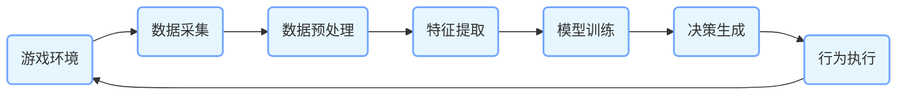

# 人工智能在游戏开发中的革新应用

> 关键词：人工智能、游戏开发、革新应用、机器学习、深度学习、强化学习、游戏智能体

> 摘要：本文聚焦于人工智能在游戏开发中的革新应用。随着人工智能技术的迅猛发展，其在游戏领域的应用日益广泛且深入，为游戏带来了前所未有的变化。文章首先介绍了相关背景，包括目的范围、预期读者等内容；接着阐述核心概念与联系，明晰人工智能在游戏开发中的基本原理和架构；详细讲解核心算法原理与操作步骤，并结合 Python 代码进行说明；深入探讨数学模型和公式，辅以实例；通过项目实战展示代码实现和解读；分析实际应用场景；推荐学习工具和资源；最后总结未来发展趋势与挑战，解答常见问题并提供参考资料，旨在全面呈现人工智能在游戏开发中的重要作用和发展前景。

## 1. 背景介绍 
### 1.1 目的和范围
随着科技的飞速发展，游戏行业也在不断寻求创新和突破。人工智能作为当下最具潜力的技术之一，为游戏开发带来了全新的机遇和挑战。本文的目的在于深入探讨人工智能在游戏开发中的各种革新应用，涵盖从简单的游戏角色行为控制到复杂的游戏剧情生成等多个方面。范围包括传统的单机游戏、网络游戏以及新兴的虚拟现实（VR）和增强现实（AR）游戏等领域。通过对这些应用的研究，旨在帮助游戏开发者更好地理解和运用人工智能技术，提升游戏的品质和用户体验。

### 1.2 预期读者
本文的预期读者主要包括游戏开发者、人工智能研究人员、游戏行业从业者以及对游戏和人工智能感兴趣的技术爱好者。对于游戏开发者来说，本文可以提供实用的技术思路和开发方法，帮助他们在游戏中融入人工智能元素；人工智能研究人员可以从游戏领域的应用中获取新的研究灵感；游戏行业从业者可以了解行业的最新发展趋势，为企业的战略决策提供参考；技术爱好者则可以通过本文对人工智能在游戏开发中的应用有更深入的认识。

### 1.3 文档结构概述
本文将按照以下结构进行阐述：首先介绍背景信息，包括目的、预期读者和文档结构概述等；接着详细讲解人工智能在游戏开发中的核心概念与联系，包括原理和架构；然后深入探讨核心算法原理和具体操作步骤，并结合 Python 代码进行说明；随后介绍相关的数学模型和公式，并举例说明；通过项目实战展示代码实现和详细解释；分析人工智能在游戏开发中的实际应用场景；推荐学习所需的工具和资源；最后总结未来发展趋势与挑战，解答常见问题并提供扩展阅读和参考资料。

### 1.4 术语表
#### 1.4.1 核心术语定义
- **人工智能（Artificial Intelligence，AI）**：是一门研究如何使计算机系统能够模拟人类智能的学科，包括学习、推理、决策等能力。
- **机器学习（Machine Learning，ML）**：是人工智能的一个重要分支，通过让计算机从数据中自动学习模式和规律，从而实现预测和决策等任务。
- **深度学习（Deep Learning，DL）**：是机器学习的一种特殊形式，基于人工神经网络，通过多层神经元的组合来学习数据的复杂特征。
- **强化学习（Reinforcement Learning，RL）**：是一种通过智能体与环境进行交互，根据环境反馈的奖励信号来学习最优行为策略的机器学习方法。
- **游戏智能体（Game Agent）**：是指在游戏中具有自主决策和行为能力的虚拟角色或系统，通常基于人工智能技术实现。

#### 1.4.2 相关概念解释
- **遗传算法（Genetic Algorithm，GA）**：是一种模拟自然选择和遗传机制的优化算法，通过对个体的选择、交叉和变异等操作来逐步优化问题的解。
- **神经网络（Neural Network，NN）**：是一种模仿人类神经系统的计算模型，由大量的神经元组成，可以自动学习数据的特征和模式。
- **自然语言处理（Natural Language Processing，NLP）**：是研究如何让计算机理解和处理人类语言的技术，包括文本生成、机器翻译等应用。

#### 1.4.3 缩略词列表
- **AI**：Artificial Intelligence（人工智能）
- **ML**：Machine Learning（机器学习）
- **DL**：Deep Learning（深度学习）
- **RL**：Reinforcement Learning（强化学习）
- **GA**：Genetic Algorithm（遗传算法）
- **NN**：Neural Network（神经网络）
- **NLP**：Natural Language Processing（自然语言处理）

## 2. 核心概念与联系 

### 人工智能在游戏开发中的基本原理
人工智能在游戏开发中的核心原理是让计算机系统能够模拟人类的智能行为，从而实现游戏角色的自主决策和行为控制。具体来说，人工智能技术可以通过对游戏数据的学习和分析，预测玩家的行为和策略，进而做出相应的反应。例如，在策略游戏中，人工智能可以根据玩家的资源分布和部队部署情况，制定出最优的进攻或防御策略；在角色扮演游戏中，人工智能可以根据玩家的对话选择和行为表现，调整游戏角色的性格和态度。

### 架构示意图
下面是一个简单的人工智能在游戏开发中的架构示意图：



这个架构图展示了人工智能在游戏开发中的基本流程。首先，游戏环境中的各种数据被采集，包括玩家的操作、游戏角色的状态等；然后对这些数据进行预处理，如清洗、归一化等；接着提取数据的特征，以便更好地进行模型训练；训练好的模型根据当前的游戏状态生成决策；最后，游戏角色根据决策执行相应的行为，并将结果反馈给游戏环境，形成一个闭环。

### 核心概念之间的联系
人工智能在游戏开发中涉及多个核心概念，它们之间相互关联、相互影响。机器学习是实现人工智能的重要手段，通过对大量游戏数据的学习，机器学习算法可以发现数据中的模式和规律，从而实现游戏角色的智能决策。深度学习作为机器学习的一种特殊形式，能够处理更加复杂的数据和任务，例如图像识别、自然语言处理等，在游戏的图形渲染、对话系统等方面有着广泛的应用。强化学习则侧重于智能体与环境的交互，通过不断地试错和学习，找到最优的行为策略，在游戏的策略制定和角色控制方面具有重要作用。遗传算法可以用于优化游戏中的参数和策略，提高游戏的性能和平衡性。自然语言处理技术可以实现游戏中的智能对话系统，增强玩家的沉浸感和互动性。

## 3. 核心算法原理 & 具体操作步骤 

### 机器学习算法在游戏开发中的应用
#### 决策树算法
决策树是一种基于树结构进行决策的机器学习算法，它通过对数据的特征进行划分，构建一个树形的决策模型。在游戏开发中，决策树可以用于游戏角色的行为决策。例如，在一个角色扮演游戏中，游戏角色可以根据当前的生命值、魔法值、敌人的距离等特征，通过决策树来决定是进攻、防御还是逃跑。

以下是一个使用 Python 实现的简单决策树算法示例：

```python
from sklearn.datasets import load_iris
from sklearn.model_selection import train_test_split
from sklearn.tree import DecisionTreeClassifier
from sklearn.metrics import accuracy_score

# 加载数据集
iris = load_iris()
X = iris.data
y = iris.target

# 划分训练集和测试集
X_train, X_test, y_train, y_test = train_test_split(X, y, test_size=0.3, random_state=42)

# 创建决策树分类器
clf = DecisionTreeClassifier()

# 训练模型
clf.fit(X_train, y_train)

# 预测
y_pred = clf.predict(X_test)

# 计算准确率
accuracy = accuracy_score(y_test, y_pred)
print(f"Accuracy: {accuracy}")
```

#### 具体操作步骤
1. **数据准备**：收集游戏中的相关数据，如玩家的操作记录、游戏角色的状态等，并对数据进行清洗和预处理。
2. **特征选择**：从数据中选择对决策有重要影响的特征，例如在角色扮演游戏中，可以选择生命值、魔法值、敌人的距离等特征。
3. **模型训练**：使用训练数据对决策树模型进行训练，调整模型的参数，使其能够准确地进行决策。
4. **模型评估**：使用测试数据对训练好的模型进行评估，计算模型的准确率、召回率等指标，评估模型的性能。
5. **模型应用**：将训练好的模型应用到游戏中，根据游戏的实时状态进行决策。

### 深度学习算法在游戏开发中的应用
#### 卷积神经网络（Convolutional Neural Network，CNN）
卷积神经网络是一种专门用于处理具有网格结构数据的深度学习模型，如图像、音频等。在游戏开发中，CNN 可以用于游戏的图像识别和图形渲染。例如，在一个射击游戏中，CNN 可以识别敌人的位置和状态，帮助玩家更好地进行射击。

以下是一个使用 Python 和 PyTorch 实现的简单 CNN 示例：

```python
import torch
import torch.nn as nn
import torch.optim as optim
from torchvision import datasets, transforms

# 定义超参数
batch_size = 64
learning_rate = 0.001
epochs = 10

# 数据预处理
transform = transforms.Compose([
    transforms.ToTensor(),
    transforms.Normalize((0.1307,), (0.3081,))
])

# 加载数据集
train_dataset = datasets.MNIST(root='./data', train=True,
                               download=True, transform=transform)
test_dataset = datasets.MNIST(root='./data', train=False,
                              download=True, transform=transform)

train_loader = torch.utils.data.DataLoader(train_dataset, batch_size=batch_size, shuffle=True)
test_loader = torch.utils.data.DataLoader(test_dataset, batch_size=batch_size, shuffle=False)

# 定义 CNN 模型
class CNN(nn.Module):
    def __init__(self):
        super(CNN, self).__init__()
        self.conv1 = nn.Conv2d(1, 10, kernel_size=5)
        self.conv2 = nn.Conv2d(10, 20, kernel_size=5)
        self.fc1 = nn.Linear(320, 50)
        self.fc2 = nn.Linear(50, 10)

    def forward(self, x):
        x = nn.functional.relu(nn.functional.max_pool2d(self.conv1(x), 2))
        x = nn.functional.relu(nn.functional.max_pool2d(self.conv2(x), 2))
        x = x.view(-1, 320)
        x = nn.functional.relu(self.fc1(x))
        x = self.fc2(x)
        return nn.functional.log_softmax(x, dim=1)

# 初始化模型、损失函数和优化器
model = CNN()
criterion = nn.NLLLoss()
optimizer = optim.Adam(model.parameters(), lr=learning_rate)

# 训练模型
for epoch in range(epochs):
    model.train()
    for batch_idx, (data, target) in enumerate(train_loader):
        optimizer.zero_grad()
        output = model(data)
        loss = criterion(output, target)
        loss.backward()
        optimizer.step()

    model.eval()
    test_loss = 0
    correct = 0
    with torch.no_grad():
        for data, target in test_loader:
            output = model(data)
            test_loss += criterion(output, target).item()
            pred = output.argmax(dim=1, keepdim=True)
            correct += pred.eq(target.view_as(pred)).sum().item()

    test_loss /= len(test_loader.dataset)
    accuracy = 100. * correct / len(test_loader.dataset)
    print(f'Epoch {epoch + 1}: Test Loss: {test_loss:.4f}, Accuracy: {accuracy:.2f}%')
```

#### 具体操作步骤
1. **数据准备**：收集游戏中的图像数据，如游戏场景、角色模型等，并对数据进行标注和预处理。
2. **模型设计**：根据任务的需求，设计合适的 CNN 模型结构，包括卷积层、池化层、全连接层等。
3. **模型训练**：使用训练数据对 CNN 模型进行训练，调整模型的参数，使其能够准确地进行图像识别。
4. **模型评估**：使用测试数据对训练好的模型进行评估，计算模型的准确率、召回率等指标，评估模型的性能。
5. **模型应用**：将训练好的模型应用到游戏中，实现图像识别和图形渲染等功能。

### 强化学习算法在游戏开发中的应用
#### Q - 学习算法
Q - 学习是一种基于值函数的强化学习算法，它通过不断地更新 Q 值（状态 - 动作值函数）来找到最优的行为策略。在游戏开发中，Q - 学习可以用于游戏角色的策略学习。例如，在一个棋类游戏中，游戏角色可以通过 Q - 学习算法学习如何选择最优的走法。

以下是一个使用 Python 实现的简单 Q - 学习算法示例：

```python
import numpy as np

# 定义环境参数
num_states = 5
num_actions = 2
gamma = 0.9  # 折扣因子
alpha = 0.1  # 学习率

# 初始化 Q 表
Q = np.zeros((num_states, num_actions))

# 定义奖励函数
rewards = np.array([
    [0, 1],
    [0, 0],
    [0, 0],
    [0, 0],
    [0, 10]
])

# 定义 Q - 学习算法
def q_learning(num_episodes):
    for episode in range(num_episodes):
        state = 0  # 初始状态
        done = False
        while not done:
            # 选择动作
            if np.random.uniform(0, 1) < 0.1:  # 探索
                action = np.random.choice(num_actions)
            else:  # 利用
                action = np.argmax(Q[state, :])

            # 执行动作，得到下一个状态和奖励
            next_state = np.random.choice(num_states)
            reward = rewards[state, action]

            # 更新 Q 值
            Q[state, action] = Q[state, action] + alpha * (reward + gamma * np.max(Q[next_state, :]) - Q[state, action])

            # 判断是否结束
            if state == num_states - 1:
                done = True
            else:
                state = next_state

    return Q

# 训练 Q 表
Q = q_learning(1000)
print(Q)
```

#### 具体操作步骤
1. **环境定义**：定义游戏的环境，包括状态空间、动作空间和奖励函数。
2. **Q 表初始化**：初始化 Q 表，用于存储状态 - 动作值函数。
3. **策略选择**：在每个时间步，根据当前的 Q 表选择一个动作，可以采用探索 - 利用策略。
4. **环境交互**：执行选择的动作，与游戏环境进行交互，得到下一个状态和奖励。
5. **Q 值更新**：根据奖励和下一个状态的最大 Q 值，更新当前状态 - 动作的 Q 值。
6. **重复训练**：重复上述步骤，直到达到最大训练步数或收敛。

## 4. 数学模型和公式 & 详细讲解 & 举例说明 

### 决策树算法的数学模型和公式
#### 信息增益
信息增益是决策树算法中用于选择最优划分特征的重要指标，它衡量了划分前后信息熵的变化。信息熵是对数据不确定性的度量，其计算公式为：

$$H(X) = -\sum_{i=1}^{n}p(x_i)\log_2p(x_i)$$

其中，$X$ 是一个随机变量，$p(x_i)$ 是 $X$ 取值为 $x_i$ 的概率。

信息增益的计算公式为：

$$IG(X, A) = H(X) - \sum_{v\in Values(A)}\frac{|S_v|}{|S|}H(S_v)$$

其中，$X$ 是目标变量，$A$ 是划分特征，$Values(A)$ 是特征 $A$ 的所有取值，$S$ 是数据集，$S_v$ 是特征 $A$ 取值为 $v$ 的子集。

#### 举例说明
假设有一个数据集，包含两个特征 $A$ 和 $B$，以及一个目标变量 $Y$。数据集如下：

| 特征 A | 特征 B | 目标变量 Y |
| ---- | ---- | ---- |
| 0 | 0 | 0 |
| 0 | 1 | 1 |
| 1 | 0 | 1 |
| 1 | 1 | 0 |

首先计算目标变量 $Y$ 的信息熵：

$p(Y = 0) = \frac{2}{4} = 0.5$，$p(Y = 1) = \frac{2}{4} = 0.5$

$H(Y) = -0.5\log_20.5 - 0.5\log_20.5 = 1$

然后计算特征 $A$ 的信息增益：

当 $A = 0$ 时，$S_{A = 0} = \{(0, 0, 0), (0, 1, 1)\}$，$p(Y = 0|A = 0) = \frac{1}{2} = 0.5$，$p(Y = 1|A = 0) = \frac{1}{2} = 0.5$，$H(S_{A = 0}) = -0.5\log_20.5 - 0.5\log_20.5 = 1$

当 $A = 1$ 时，$S_{A = 1} = \{(1, 0, 1), (1, 1, 0)\}$，$p(Y = 0|A = 1) = \frac{1}{2} = 0.5$，$p(Y = 1|A = 1) = \frac{1}{2} = 0.5$，$H(S_{A = 1}) = -0.5\log_20.5 - 0.5\log_20.5 = 1$

$IG(Y, A) = H(Y) - \frac{2}{4}H(S_{A = 0}) - \frac{2}{4}H(S_{A = 1}) = 1 - \frac{2}{4}\times1 - \frac{2}{4}\times1 = 0$

同理，可以计算特征 $B$ 的信息增益，最终选择信息增益最大的特征作为划分特征。

### 卷积神经网络的数学模型和公式
#### 卷积操作
卷积操作是卷积神经网络的核心操作，它通过一个卷积核在输入数据上滑动，进行元素相乘和求和，得到输出特征图。卷积操作的计算公式为：

$$y_{i, j} = \sum_{m = 0}^{M - 1}\sum_{n = 0}^{N - 1}x_{i + m, j + n}w_{m, n} + b$$

其中，$x$ 是输入数据，$w$ 是卷积核，$b$ 是偏置，$y$ 是输出特征图，$M$ 和 $N$ 是卷积核的大小。

#### 池化操作
池化操作是用于降低特征图的维度，减少计算量和参数数量。常见的池化操作有最大池化和平均池化。最大池化的计算公式为：

$$y_{i, j} = \max_{m = 0}^{M - 1}\max_{n = 0}^{N - 1}x_{iM + m, jN + n}$$

其中，$x$ 是输入特征图，$y$ 是输出特征图，$M$ 和 $N$ 是池化窗口的大小。

#### 举例说明
假设有一个输入特征图 $x$ 如下：

$$x = \begin{bmatrix}
1 & 2 & 3 \\
4 & 5 & 6 \\
7 & 8 & 9
\end{bmatrix}$$

卷积核 $w$ 如下：

$$w = \begin{bmatrix}
1 & 0 \\
0 & 1
\end{bmatrix}$$

偏置 $b = 0$。

卷积操作的过程如下：

对于输出特征图的第一个元素 $y_{0, 0}$：

$y_{0, 0} = x_{0, 0}w_{0, 0} + x_{0, 1}w_{0, 1} + x_{1, 0}w_{1, 0} + x_{1, 1}w_{1, 1} + b = 1\times1 + 2\times0 + 4\times0 + 5\times1 + 0 = 6$

同理，可以计算其他元素的值，得到输出特征图。

### 强化学习的数学模型和公式
#### Q - 学习算法的更新公式
Q - 学习算法的核心是更新 Q 值，其更新公式为：

$$Q(s, a) \leftarrow Q(s, a) + \alpha\left[r + \gamma\max_{a'}Q(s', a') - Q(s, a)\right]$$

其中，$s$ 是当前状态，$a$ 是当前动作，$r$ 是奖励，$s'$ 是下一个状态，$a'$ 是下一个状态的最优动作，$\alpha$ 是学习率，$\gamma$ 是折扣因子。

#### 举例说明
假设有一个简单的游戏环境，状态空间为 $\{s_0, s_1\}$，动作空间为 $\{a_0, a_1\}$。初始 Q 表如下：

$$Q = \begin{bmatrix}
0 & 0 \\
0 & 0
\end{bmatrix}$$

当前状态 $s = s_0$，选择动作 $a = a_0$，执行动作后得到奖励 $r = 1$，下一个状态 $s' = s_1$。

假设学习率 $\alpha = 0.1$，折扣因子 $\gamma = 0.9$。

首先计算 $\max_{a'}Q(s', a')$，由于 $Q(s_1, a_0) = 0$，$Q(s_1, a_1) = 0$，所以 $\max_{a'}Q(s', a') = 0$。

然后更新 $Q(s, a)$：

$Q(s_0, a_0) = Q(s_0, a_0) + \alpha\left[r + \gamma\max_{a'}Q(s', a') - Q(s_0, a_0)\right] = 0 + 0.1\times(1 + 0.9\times0 - 0) = 0.1$

更新后的 Q 表如下：

$$Q = \begin{bmatrix}
0.1 & 0 \\
0 & 0
\end{bmatrix}$$

## 5. 项目实战：代码实际案例和详细解释说明 

### 5.1  开发环境搭建
#### 安装 Python
首先，需要安装 Python 开发环境。可以从 Python 官方网站（https://www.python.org/downloads/） 下载适合自己操作系统的 Python 安装包，并按照安装向导进行安装。

#### 安装必要的库
在游戏开发中，需要使用一些常用的 Python 库，如 Pygame、TensorFlow、PyTorch 等。可以使用以下命令进行安装：

```bash
pip install pygame tensorflow torch
```

#### 配置开发环境
可以使用任何喜欢的集成开发环境（IDE），如 PyCharm、VS Code 等。在 IDE 中配置好 Python 解释器，确保能够正常运行 Python 代码。

### 5.2  源代码详细实现和代码解读
#### 基于 Pygame 的简单游戏开发
以下是一个使用 Pygame 开发的简单游戏示例，游戏中玩家控制一个小球移动，躲避障碍物。

```python
import pygame
import random

# 初始化 Pygame
pygame.init()

# 设置游戏窗口的大小
width = 800
height = 600
screen = pygame.display.set_mode((width, height))
pygame.display.set_caption("Simple Game")

# 定义颜色
WHITE = (255, 255, 255)
BLACK = (0, 0, 0)
RED = (255, 0, 0)

# 定义小球的属性
ball_radius = 20
ball_x = width // 2
ball_y = height - ball_radius
ball_speed = 5

# 定义障碍物的属性
obstacle_width = 50
obstacle_height = 50
obstacle_x = random.randint(0, width - obstacle_width)
obstacle_y = 0
obstacle_speed = 3

# 游戏主循环
running = True
clock = pygame.time.Clock()

while running:
    # 处理事件
    for event in pygame.event.get():
        if event.type == pygame.QUIT:
            running = False

    # 获取键盘输入
    keys = pygame.key.get_pressed()
    if keys[pygame.K_LEFT] and ball_x > ball_radius:
        ball_x -= ball_speed
    if keys[pygame.K_RIGHT] and ball_x < width - ball_radius:
        ball_x += ball_speed

    # 更新障碍物的位置
    obstacle_y += obstacle_speed
    if obstacle_y > height:
        obstacle_x = random.randint(0, width - obstacle_width)
        obstacle_y = 0

    # 检测碰撞
    if (ball_x + ball_radius > obstacle_x and
        ball_x - ball_radius < obstacle_x + obstacle_width and
        ball_y + ball_radius > obstacle_y and
        ball_y - ball_radius < obstacle_y + obstacle_height):
        running = False

    # 绘制背景
    screen.fill(WHITE)

    # 绘制小球
    pygame.draw.circle(screen, BLACK, (ball_x, ball_y), ball_radius)

    # 绘制障碍物
    pygame.draw.rect(screen, RED, (obstacle_x, obstacle_y, obstacle_width, obstacle_height))

    # 更新显示
    pygame.display.flip()

    # 控制帧率
    clock.tick(60)

# 退出 Pygame
pygame.quit()
```

#### 代码解读
1. **初始化 Pygame**：使用 `pygame.init()` 初始化 Pygame 库，设置游戏窗口的大小和标题。
2. **定义游戏元素的属性**：定义小球和障碍物的属性，如位置、大小、速度等。
3. **游戏主循环**：在主循环中处理事件，获取键盘输入，更新游戏元素的位置，检测碰撞，绘制游戏画面，并更新显示。
4. **事件处理**：使用 `pygame.event.get()` 获取所有事件，处理退出事件。
5. **键盘输入处理**：使用 `pygame.key.get_pressed()` 获取键盘状态，根据键盘输入更新小球的位置。
6. **障碍物更新**：更新障碍物的位置，如果障碍物超出屏幕范围，则重新生成一个新的障碍物。
7. **碰撞检测**：检测小球和障碍物是否发生碰撞，如果发生碰撞，则游戏结束。
8. **绘制游戏画面**：使用 `pygame.draw.circle()` 和 `pygame.draw.rect()` 绘制小球和障碍物。
9. **更新显示**：使用 `pygame.display.flip()` 更新显示。
10. **控制帧率**：使用 `clock.tick(60)` 控制游戏的帧率为 60 帧每秒。

#### 集成人工智能算法
在上述游戏的基础上，我们可以集成人工智能算法，让障碍物具有智能行为。以下是一个使用 Q - 学习算法控制障碍物移动的示例：

```python
import pygame
import random
import numpy as np

# 初始化 Pygame
pygame.init()

# 设置游戏窗口的大小
width = 800
height = 600
screen = pygame.display.set_mode((width, height))
pygame.display.set_caption("AI Game")

# 定义颜色
WHITE = (255, 255, 255)
BLACK = (0, 0, 0)
RED = (255, 0, 0)

# 定义小球的属性
ball_radius = 20
ball_x = width // 2
ball_y = height - ball_radius
ball_speed = 5

# 定义障碍物的属性
obstacle_width = 50
obstacle_height = 50
obstacle_x = random.randint(0, width - obstacle_width)
obstacle_y = 0
obstacle_speed = 3

# Q - 学习参数
num_states = 10
num_actions = 3  # 左移、右移、不动
gamma = 0.9
alpha = 0.1
Q = np.zeros((num_states, num_actions))

# 状态映射函数
def get_state(ball_x, obstacle_x):
    state = int((obstacle_x - ball_x) / (width / num_states))
    state = max(0, min(num_states - 1, state))
    return state

# 动作映射函数
def get_action(state):
    if np.random.uniform(0, 1) < 0.1:  # 探索
        action = np.random.choice(num_actions)
    else:  # 利用
        action = np.argmax(Q[state, :])
    return action

# 游戏主循环
running = True
clock = pygame.time.Clock()

while running:
    # 处理事件
    for event in pygame.event.get():
        if event.type == pygame.QUIT:
            running = False

    # 获取键盘输入
    keys = pygame.key.get_pressed()
    if keys[pygame.K_LEFT] and ball_x > ball_radius:
        ball_x -= ball_speed
    if keys[pygame.K_RIGHT] and ball_x < width - ball_radius:
        ball_x += ball_speed

    # 获取当前状态
    state = get_state(ball_x, obstacle_x)

    # 选择动作
    action = get_action(state)

    # 执行动作
    if action == 0 and obstacle_x > 0:
        obstacle_x -= obstacle_speed
    elif action == 1 and obstacle_x < width - obstacle_width:
        obstacle_x += obstacle_speed

    # 更新障碍物的位置
    obstacle_y += obstacle_speed
    if obstacle_y > height:
        obstacle_x = random.randint(0, width - obstacle_width)
        obstacle_y = 0

    # 检测碰撞
    if (ball_x + ball_radius > obstacle_x and
        ball_x - ball_radius < obstacle_x + obstacle_width and
        ball_y + ball_radius > obstacle_y and
        ball_y - ball_radius < obstacle_y + obstacle_height):
        reward = -100
        running = False
    else:
        reward = 1

    # 获取下一个状态
    next_state = get_state(ball_x, obstacle_x)

    # 更新 Q 值
    Q[state, action] = Q[state, action] + alpha * (reward + gamma * np.max(Q[next_state, :]) - Q[state, action])

    # 绘制背景
    screen.fill(WHITE)

    # 绘制小球
    pygame.draw.circle(screen, BLACK, (ball_x, ball_y), ball_radius)

    # 绘制障碍物
    pygame.draw.rect(screen, RED, (obstacle_x, obstacle_y, obstacle_width, obstacle_height))

    # 更新显示
    pygame.display.flip()

    # 控制帧率
    clock.tick(60)

# 退出 Pygame
pygame.quit()
```

#### 代码解读
1. **Q - 学习参数初始化**：初始化 Q - 学习算法的参数，如状态数、动作数、折扣因子、学习率和 Q 表。
2. **状态映射函数**：定义 `get_state()` 函数，将小球和障碍物的位置映射到一个状态。
3. **动作映射函数**：定义 `get_action()` 函数，根据当前状态选择一个动作，可以采用探索 - 利用策略。
4. **执行动作**：根据选择的动作更新障碍物的位置。
5. **奖励计算**：根据是否发生碰撞计算奖励。
6. **Q 值更新**：根据奖励和下一个状态的最大 Q 值，更新当前状态 - 动作的 Q 值。

### 5.3  代码解读与分析
#### 代码结构分析
上述代码的结构清晰，主要分为初始化部分、游戏主循环部分和退出部分。初始化部分设置游戏窗口、定义游戏元素的属性和 Q - 学习参数；游戏主循环部分处理事件、获取键盘输入、更新游戏元素的位置、检测碰撞、选择动作、更新 Q 值和绘制游戏画面；退出部分退出 Pygame 库。

#### 人工智能算法的作用
通过集成 Q - 学习算法，障碍物可以根据小球的位置和自身的状态选择最优的动作，从而提高游戏的难度和趣味性。随着训练的进行，障碍物的行为会越来越智能，能够更好地躲避小球，增加游戏的挑战性。

#### 代码优化建议
- **增加状态和动作的维度**：可以增加状态和动作的维度，使障碍物的行为更加复杂和多样化。
- **改进奖励函数**：设计更合理的奖励函数，引导障碍物学习更优的策略。
- **使用更复杂的人工智能算法**：可以使用深度学习算法，如深度 Q 网络（Deep Q - Network，DQN），提高障碍物的智能水平。

## 6. 实际应用场景 

### 游戏角色的智能行为控制
在角色扮演游戏、动作游戏等类型的游戏中，人工智能可以用于控制游戏角色的智能行为。例如，游戏角色可以根据玩家的行为和环境的变化，自动调整自己的攻击策略、防御策略和移动路线。在《塞尔达传说：旷野之息》中，游戏中的敌人会根据林克的位置和行为做出不同的反应，如主动攻击、躲避或呼叫支援等，增加了游戏的真实感和挑战性。

### 游戏剧情的动态生成
人工智能可以根据玩家的选择和行为，动态生成游戏的剧情。在一些开放世界游戏中，玩家的每一个决策都可能影响游戏的剧情发展。例如，在《辐射》系列游戏中，玩家的选择会导致不同的剧情分支和结局，游戏中的剧情会根据玩家的行为进行实时调整，使玩家能够体验到更加个性化的游戏剧情。

### 游戏的平衡性调整
在多人游戏中，人工智能可以用于调整游戏的平衡性。通过对玩家的游戏数据进行分析，人工智能可以发现游戏中存在的不平衡问题，并自动调整游戏的参数，如角色的属性、武器的攻击力等。例如，在《英雄联盟》中，游戏开发者会根据玩家的游戏数据和比赛结果，使用人工智能算法对英雄的属性进行调整，以保证游戏的平衡性和公平性。

### 游戏的智能辅助系统
人工智能可以为玩家提供智能辅助系统，帮助玩家更好地玩游戏。例如，在一些策略游戏中，智能辅助系统可以根据当前的游戏局势，为玩家提供最优的策略建议；在一些解谜游戏中，智能辅助系统可以为玩家提供提示和解决方案。例如，在《文明》系列游戏中，智能辅助系统可以为玩家分析当前的局势，提供科技研发、城市建设和外交策略等方面的建议。

### 游戏的图像和音效处理
人工智能可以用于游戏的图像和音效处理，提高游戏的视觉和听觉效果。例如，使用深度学习算法可以实现图像的超分辨率重建、风格迁移等功能，使游戏的画面更加清晰、逼真；使用人工智能算法可以生成逼真的音效，如环境音效、角色语音等，增强游戏的沉浸感。例如，在一些虚拟现实游戏中，使用人工智能技术可以实时生成与环境相匹配的音效，让玩家感受到更加真实的游戏体验。

## 7. 工具和资源推荐
### 7.1 学习资源推荐
#### 7.1.1 书籍推荐
- 《人工智能：一种现代的方法》（Artificial Intelligence: A Modern Approach）：这是一本经典的人工智能教材，全面介绍了人工智能的各个领域，包括搜索算法、知识表示、机器学习、自然语言处理等。
- 《深度学习》（Deep Learning）：由深度学习领域的三位先驱 Ian Goodfellow、Yoshua Bengio 和 Aaron Courville 合著，详细介绍了深度学习的基本原理、算法和应用。
- 《Python 机器学习》（Python Machine Learning）：本书以 Python 为工具，介绍了机器学习的基本算法和应用，包括分类、回归、聚类、降维等。

#### 7.1.2 在线课程
- Coursera 上的《机器学习》（Machine Learning）课程：由 Andrew Ng 教授主讲，是一门非常经典的机器学习入门课程，介绍了机器学习的基本概念、算法和应用。
- edX 上的《深度学习》（Deep Learning）课程：由 Facebook 的 Yann LeCun 等教授主讲，深入介绍了深度学习的原理、算法和应用。
- Udemy 上的《Python 游戏开发实战》（Python Game Development from Scratch）课程：通过实际项目，介绍了如何使用 Python 和 Pygame 开发游戏。

#### 7.1.3 技术博客和网站
- Medium：是一个技术博客平台，上面有很多关于人工智能和游戏开发的优秀文章。
- Towards Data Science：专注于数据科学和人工智能领域的技术博客，提供了很多实用的技术教程和案例分析。
- GameAnalytics：是一个游戏分析和数据科学的网站，提供了游戏行业的最新趋势和技术应用案例。

### 7.2 开发工具框架推荐
#### 7.2.1 IDE和编辑器
- PyCharm：是一款专业的 Python 集成开发环境，提供了丰富的代码编辑、调试和版本控制等功能，适合开发大型的 Python 项目。
- Visual Studio Code：是一款轻量级的代码编辑器，支持多种编程语言和插件扩展，具有良好的用户体验和性能。
- Unity：是一款跨平台的游戏开发引擎，提供了丰富的游戏开发工具和资源，支持 C# 等编程语言，适合开发各种类型的游戏。

#### 7.2.2 调试和性能分析工具
- PDB：是 Python 内置的调试工具，可以帮助开发者调试 Python 代码，查找和解决问题。
- TensorBoard：是 TensorFlow 提供的可视化工具，可以帮助开发者可视化训练过程和模型性能，分析和优化模型。
- Unity Profiler：是 Unity 引擎提供的性能分析工具，可以帮助开发者分析游戏的性能瓶颈，优化游戏的性能。

#### 7.2.3 相关框架和库
- Pygame：是一个用于开发 2D 游戏的 Python 库，提供了图形、音频、输入等功能，简单易用，适合初学者。
- TensorFlow：是一个开源的机器学习框架，提供了丰富的深度学习模型和工具，支持 CPU 和 GPU 加速，广泛应用于人工智能领域。
- PyTorch：是一个开源的深度学习框架，具有动态图和静态图两种模式，提供了丰富的深度学习模型和工具，在学术界和工业界都有广泛的应用。

### 7.3 相关论文著作推荐
#### 7.3.1 经典论文
- “Playing Atari with Deep Reinforcement Learning”：这篇论文提出了深度 Q 网络（DQN）算法，首次将深度学习和强化学习相结合，在 Atari 游戏上取得了很好的效果。
- “ImageNet Classification with Deep Convolutional Neural Networks”：这篇论文提出了 AlexNet 模型，开创了深度学习在图像分类领域的先河，推动了深度学习的发展。
- “Attention Is All You Need”：这篇论文提出了 Transformer 模型，引入了注意力机制，在自然语言处理领域取得了巨大的成功。

#### 7.3.2 最新研究成果
- OpenAI 的相关研究成果：OpenAI 是人工智能领域的领先研究机构，其发布的研究成果代表了当前人工智能的最新发展趋势，如 GPT - 3、DALL - E 等。
- DeepMind 的相关研究成果：DeepMind 是一家专注于人工智能研究的公司，其在强化学习、游戏智能等领域取得了很多重要的研究成果，如 AlphaGo、AlphaStar 等。

#### 7.3.3 应用案例分析
- 《人工智能在游戏开发中的应用案例分析》：这本书收集了多个人工智能在游戏开发中的实际应用案例，包括游戏角色的智能行为控制、游戏剧情的动态生成等方面，通过实际案例分析，帮助读者更好地理解和应用人工智能技术。

## 8. 总结：未来发展趋势与挑战
### 未来发展趋势
#### 更加智能化的游戏角色
随着人工智能技术的不断发展，游戏角色的智能水平将不断提高。未来的游戏角色将能够更加真实地模拟人类的行为和思维，具有更加复杂的情感和个性，能够与玩家进行更加自然和深入的交互。

#### 个性化的游戏体验
人工智能可以根据玩家的游戏习惯、偏好和行为，为玩家提供个性化的游戏体验。例如，游戏的剧情、关卡难度、角色属性等可以根据玩家的特点进行动态调整，使每个玩家都能享受到独特的游戏体验。

#### 虚拟现实和增强现实与人工智能的融合
虚拟现实和增强现实技术为游戏带来了全新的体验方式，而人工智能可以进一步增强虚拟现实和增强现实游戏的沉浸感和互动性。例如，在虚拟现实游戏中，人工智能可以根据玩家的动作和表情，实时调整游戏的场景和剧情，使玩家更加身临其境。

#### 云游戏与人工智能的结合
云游戏的发展使得游戏的运行和存储都在云端进行，玩家只需要通过网络连接就可以玩游戏。人工智能可以在云端对游戏进行优化和管理，提高游戏的性能和稳定性，同时还可以根据玩家的网络状况和设备性能，动态调整游戏的画质和帧率。

### 挑战
#### 数据隐私和安全问题
人工智能在游戏开发中需要大量的游戏数据进行训练和优化，这些数据可能包含玩家的个人信息和游戏行为记录。因此，如何保护玩家的数据隐私和安全是一个重要的挑战。游戏开发者需要采取有效的措施，如数据加密、访问控制等，确保玩家的数据不被泄露和滥用。

#### 算法复杂度和计算资源需求
一些复杂的人工智能算法，如深度学习和强化学习，需要大量的计算资源和时间进行训练和优化。在游戏开发中，如何在有限的计算资源和时间内实现高效的人工智能算法是一个挑战。游戏开发者需要采用优化算法、并行计算等技术，提高算法的效率和性能。

#### 伦理和道德问题
随着游戏角色的智能水平不断提高，可能会引发一些伦理和道德问题。例如，游戏角色的行为和决策是否符合人类的价值观和道德标准，如何避免游戏角色对玩家产生不良影响等。游戏开发者需要在开发过程中考虑这些问题，制定相应的伦理和道德准则。

#### 技术更新换代快
人工智能技术发展迅速，新的算法和模型不断涌现。游戏开发者需要不断学习和掌握新的技术，及时更新和优化游戏中的人工智能系统，以保持游戏的竞争力。

## 9. 附录：常见问题与解答
### 问题 1：人工智能在游戏开发中的应用会增加游戏的开发成本吗？
解答：人工智能在游戏开发中的应用可能会增加一定的开发成本。一方面，需要投入更多的时间和精力来研究和实现人工智能算法；另一方面，可能需要使用更强大的计算资源来训练和优化模型。但是，从长远来看，人工智能可以提高游戏的品质和用户体验，吸引更多的玩家，从而带来更高的收益。因此，在综合考虑成本和收益的情况下，人工智能在游戏开发中的应用是值得的。

### 问题 2：如何选择适合游戏开发的人工智能算法？
解答：选择适合游戏开发的人工智能算法需要考虑多个因素，如游戏的类型、需求和复杂度等。对于简单的游戏，可以选择一些简单的机器学习算法，如决策树、朴素贝叶斯等；对于复杂的游戏，可以选择深度学习和强化学习等算法。此外，还需要考虑算法的计算资源需求、训练时间和可解释性等因素。在实际应用中，可以根据具体情况进行尝试和比较，选择最适合的算法。

### 问题 3：人工智能