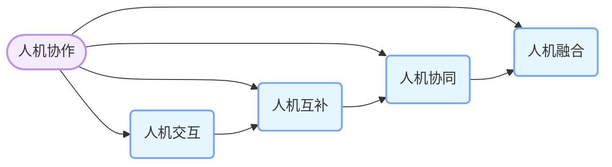

# 人机协作的艺术:超级架构师的核心能力

> 关键词：人机协作、超级架构师、核心能力、人工智能、软件架构、协作模式、技术融合

> 摘要：本文聚焦于人机协作的艺术以及超级架构师所应具备的核心能力。在当今科技飞速发展的时代，人机协作已成为推动技术进步和创新的关键力量。超级架构师作为引领软件系统和复杂项目的重要角色，需要在人机协作的大背景下不断提升自身能力。文章将深入探讨人机协作的核心概念与联系，阐述相关算法原理和数学模型，通过项目实战案例展示具体应用，分析实际应用场景，推荐学习和开发所需的工具与资源，最后总结未来发展趋势与挑战，为超级架构师及相关从业者提供全面且深入的技术参考和发展指引。

## 1. 背景介绍 
### 1.1 目的和范围
随着人工智能、机器学习等技术的迅猛发展，人机协作逐渐成为各个领域的研究热点和实践方向。本文章的目的在于深入剖析人机协作的艺术，明确超级架构师在这一过程中应具备的核心能力。范围涵盖人机协作的基本概念、相关技术原理、项目实战案例、实际应用场景等多个方面，旨在为超级架构师及对人机协作感兴趣的技术人员提供全面的知识体系和实践指导。

### 1.2 预期读者
本文预期读者主要包括软件架构师、CTO、人工智能专家、程序员等IT领域的专业人士，以及对人机协作、软件系统架构和人工智能技术发展趋势感兴趣的研究人员和学生。通过阅读本文，读者能够深入了解人机协作的技术本质和应用方法，提升自身在人机协作方面的技术能力和创新思维。

### 1.3 文档结构概述
本文将按照以下结构进行阐述：首先介绍人机协作的背景和相关概念，包括术语定义和概念解释；接着深入探讨人机协作的核心概念与联系，通过文本示意图和Mermaid流程图进行直观展示；然后详细讲解核心算法原理和具体操作步骤，结合Python源代码进行说明；再介绍数学模型和公式，并通过举例进行详细讲解；之后通过项目实战案例展示代码实现和详细解释；分析人机协作的实际应用场景；推荐相关的学习资源、开发工具和论文著作；最后总结未来发展趋势与挑战，提供常见问题与解答以及扩展阅读和参考资料。

### 1.4 术语表
#### 1.4.1 核心术语定义
- **人机协作**：指人类与计算机或人工智能系统之间通过有效的交互和合作，共同完成特定任务的过程。在这个过程中，人类和机器各自发挥自身的优势，实现优势互补，提高任务完成的效率和质量。
- **超级架构师**：是指在软件系统架构设计、开发和管理方面具有卓越能力和丰富经验的专业人员。超级架构师不仅要具备深厚的技术功底，还要能够在复杂的技术环境和业务需求下，设计出高效、可靠、可扩展的软件系统架构，并能够协调团队成员和各种技术资源，推动项目的顺利实施。
- **人工智能**：是指计算机系统能够执行通常需要人类智能才能完成的任务的技术和方法。人工智能包括机器学习、深度学习、自然语言处理、计算机视觉等多个领域，通过模拟人类的智能行为，实现对数据的分析、处理和决策。
- **软件架构**：是指软件系统的基本结构和组织方式，包括软件的模块划分、模块之间的交互关系、数据流动和控制流程等。软件架构是软件系统设计的核心，直接影响软件系统的性能、可靠性、可维护性和可扩展性。

#### 1.4.2 相关概念解释
- **协作模式**：指人机协作过程中人类和机器之间的交互方式和合作方式。常见的协作模式包括人机互补模式、人机协同模式和人机融合模式等。
- **技术融合**：指将不同领域的技术进行整合和应用，以实现更强大的功能和更好的性能。在人机协作中，技术融合包括人工智能技术与软件架构技术、云计算技术、大数据技术等的融合。
- **智能体**：是指具有自主决策和行动能力的软件实体或硬件设备。在人机协作中，智能体可以是人工智能系统、机器人等，能够与人类进行交互和合作，完成特定的任务。

#### 1.4.3 缩略词列表
- **AI**：Artificial Intelligence，人工智能
- **ML**：Machine Learning，机器学习
- **DL**：Deep Learning，深度学习
- **NLP**：Natural Language Processing，自然语言处理
- **CV**：Computer Vision，计算机视觉

## 2. 核心概念与联系 
人机协作是一个复杂的系统工程，涉及到人类、计算机和任务等多个要素。其核心概念包括人机交互、人机互补、人机协同和人机融合等。下面通过文本示意图和Mermaid流程图来展示这些核心概念之间的联系。

### 文本示意图
人机协作的核心概念之间存在着密切的联系，它们相互影响、相互促进。人机交互是人机协作的基础，通过有效的交互方式，人类和机器可以进行信息的传递和共享。人机互补是指人类和机器各自发挥自身的优势，弥补对方的不足，实现优势互补。人机协同是指人类和机器在完成任务的过程中，相互配合、相互支持，共同实现任务目标。人机融合是人机协作的高级阶段，人类和机器的界限逐渐模糊，实现深度的融合和协同。

### Mermaid流程图

从流程图可以看出，人机交互是人机协作的起点，通过人机交互实现信息的传递和共享，为人机互补、人机协同和人机融合奠定基础。人机互补是在人机交互的基础上，进一步发挥人类和机器的优势，提高任务完成的效率和质量。人机协同是在人机互补的基础上，实现人类和机器的紧密配合和协作，共同完成复杂的任务。人机融合是人机协作的最终目标，实现人类和机器的深度融合和协同，创造出更强大的智能系统。

## 3. 核心算法原理 & 具体操作步骤 
在人机协作中，涉及到多种算法和技术，下面以机器学习中的监督学习算法为例，详细讲解核心算法原理和具体操作步骤。

### 核心算法原理
监督学习是机器学习中的一种重要算法，其基本原理是通过已知的输入数据和对应的输出标签，训练一个模型，使得模型能够根据新的输入数据预测出对应的输出标签。常见的监督学习算法包括线性回归、逻辑回归、决策树、支持向量机等。

以线性回归为例，线性回归是一种用于预测连续数值的监督学习算法。其基本模型可以表示为：
$$y = \theta_0 + \theta_1x_1 + \theta_2x_2 + \cdots + \theta_nx_n$$
其中，$y$ 是预测值，$x_1, x_2, \cdots, x_n$ 是输入特征，$\theta_0, \theta_1, \cdots, \theta_n$ 是模型的参数。线性回归的目标是通过训练数据找到一组最优的参数 $\theta$，使得预测值 $y$ 与真实值之间的误差最小。

### 具体操作步骤
下面是使用Python实现线性回归的具体操作步骤和代码示例：

```python
import numpy as np
from sklearn.linear_model import LinearRegression
from sklearn.model_selection import train_test_split
from sklearn.metrics import mean_squared_error

# 生成示例数据
np.random.seed(0)
X = np.random.rand(100, 1)
y = 2 * X + 1 + 0.5 * np.random.randn(100, 1)

# 划分训练集和测试集
X_train, X_test, y_train, y_test = train_test_split(X, y, test_size=0.2, random_state=42)

# 创建线性回归模型
model = LinearRegression()

# 训练模型
model.fit(X_train, y_train)

# 预测
y_pred = model.predict(X_test)

# 评估模型
mse = mean_squared_error(y_test, y_pred)
print(f"Mean Squared Error: {mse}")
```

### 代码解释
1. **数据生成**：使用 `np.random.rand` 生成100个随机的输入特征 $X$，并根据线性关系 $y = 2x + 1 + \epsilon$ 生成对应的输出标签 $y$，其中 $\epsilon$ 是随机噪声。
2. **数据划分**：使用 `train_test_split` 函数将数据集划分为训练集和测试集，测试集占总数据的20%。
3. **模型创建**：使用 `LinearRegression` 类创建一个线性回归模型。
4. **模型训练**：使用 `fit` 方法对模型进行训练，将训练集的输入特征和对应的输出标签作为参数传入。
5. **模型预测**：使用 `predict` 方法对测试集的输入特征进行预测，得到预测值 $y_pred$。
6. **模型评估**：使用 `mean_squared_error` 函数计算预测值与真实值之间的均方误差（MSE），评估模型的性能。

## 4. 数学模型和公式 & 详细讲解 & 举例说明 
### 线性回归的数学模型和公式
线性回归的目标是找到一组最优的参数 $\theta$，使得预测值 $y$ 与真实值之间的误差最小。常用的误差度量方法是均方误差（MSE），其公式为：
$$MSE = \frac{1}{m} \sum_{i=1}^{m} (y^{(i)} - \hat{y}^{(i)})^2$$
其中，$m$ 是样本数量，$y^{(i)}$ 是第 $i$ 个样本的真实值，$\hat{y}^{(i)}$ 是第 $i$ 个样本的预测值。

为了找到最优的参数 $\theta$，可以使用最小二乘法。最小二乘法的目标是最小化均方误差，即求解以下优化问题：
$$\min_{\theta} \frac{1}{2m} \sum_{i=1}^{m} (y^{(i)} - \theta^T x^{(i)})^2$$
其中，$\theta^T$ 是参数 $\theta$ 的转置，$x^{(i)}$ 是第 $i$ 个样本的输入特征。

通过求解上述优化问题，可以得到最优的参数 $\theta$ 的解析解：
$$\theta = (X^T X)^{-1} X^T y$$
其中，$X$ 是输入特征矩阵，$y$ 是输出标签向量。

### 详细讲解
最小二乘法的原理是通过最小化预测值与真实值之间的误差平方和，找到最优的参数 $\theta$。误差平方和的几何意义是预测值与真实值之间的欧几里得距离的平方。通过最小化误差平方和，可以使得预测值尽可能地接近真实值。

求解最优参数 $\theta$ 的解析解需要计算矩阵的逆，当输入特征矩阵 $X$ 的维度较高时，计算矩阵的逆可能会非常耗时。因此，在实际应用中，通常使用梯度下降等迭代算法来求解最优参数 $\theta$。

### 举例说明
假设我们有以下数据集：
| $x$ | $y$ |
|---|---|
| 1 | 3 |
| 2 | 5 |
| 3 | 7 |
| 4 | 9 |

我们可以使用最小二乘法来求解线性回归的参数 $\theta$。首先，将数据集表示为矩阵形式：
$$X = \begin{bmatrix} 1 & 1 \\ 1 & 2 \\ 1 & 3 \\ 1 & 4 \end{bmatrix}, y = \begin{bmatrix} 3 \\ 5 \\ 7 \\ 9 \end{bmatrix}$$

然后，计算 $X^T X$ 和 $X^T y$：
$$X^T X = \begin{bmatrix} 4 & 10 \\ 10 & 30 \end{bmatrix}, X^T y = \begin{bmatrix} 24 \\ 70 \end{bmatrix}$$

接着，计算 $(X^T X)^{-1}$：
$$(X^T X)^{-1} = \frac{1}{20} \begin{bmatrix} 30 & -10 \\ -10 & 4 \end{bmatrix}$$

最后，计算最优参数 $\theta$：
$$\theta = (X^T X)^{-1} X^T y = \frac{1}{20} \begin{bmatrix} 30 & -10 \\ -10 & 4 \end{bmatrix} \begin{bmatrix} 24 \\ 70 \end{bmatrix} = \begin{bmatrix} 1 \\ 2 \end{bmatrix}$$

因此，线性回归的模型为 $y = 1 + 2x$。

## 5. 项目实战：代码实际案例和详细解释说明 
### 5.1  开发环境搭建
在进行项目实战之前，需要搭建相应的开发环境。以下是搭建开发环境的步骤：

1. **安装Python**：从Python官方网站（https://www.python.org/downloads/）下载并安装Python 3.x版本。
2. **安装开发工具**：推荐使用PyCharm作为开发工具，从JetBrains官方网站（https://www.jetbrains.com/pycharm/download/）下载并安装PyCharm。
3. **安装必要的库**：使用pip命令安装必要的库，如`numpy`、`pandas`、`scikit-learn`等。
```sh
pip install numpy pandas scikit-learn
```

### 5.2  源代码详细实现和代码解读
下面以一个简单的房价预测项目为例，详细介绍源代码的实现和代码解读。

```python
import numpy as np
import pandas as pd
from sklearn.model_selection import train_test_split
from sklearn.linear_model import LinearRegression
from sklearn.metrics import mean_squared_error

# 加载数据集
data = pd.read_csv('housing.csv')

# 划分特征和标签
X = data.drop('price', axis=1).values
y = data['price'].values

# 划分训练集和测试集
X_train, X_test, y_train, y_test = train_test_split(X, y, test_size=0.2, random_state=42)

# 创建线性回归模型
model = LinearRegression()

# 训练模型
model.fit(X_train, y_train)

# 预测
y_pred = model.predict(X_test)

# 评估模型
mse = mean_squared_error(y_test, y_pred)
rmse = np.sqrt(mse)
print(f"Root Mean Squared Error: {rmse}")
```

### 5.3  代码解读与分析
1. **数据加载**：使用`pandas`库的`read_csv`函数加载房价数据集。
2. **特征和标签划分**：使用`drop`方法删除`price`列，得到特征矩阵`X`，并将`price`列作为标签向量`y`。
3. **数据划分**：使用`train_test_split`函数将数据集划分为训练集和测试集，测试集占总数据的20%。
4. **模型创建**：使用`LinearRegression`类创建一个线性回归模型。
5. **模型训练**：使用`fit`方法对模型进行训练，将训练集的输入特征和对应的输出标签作为参数传入。
6. **模型预测**：使用`predict`方法对测试集的输入特征进行预测，得到预测值`y_pred`。
7. **模型评估**：使用`mean_squared_error`函数计算预测值与真实值之间的均方误差（MSE），并计算均方根误差（RMSE），评估模型的性能。

## 6. 实际应用场景 
人机协作在各个领域都有广泛的应用，以下是一些常见的实际应用场景：

### 软件开发
在软件开发过程中，人机协作可以提高开发效率和质量。例如，开发人员可以使用人工智能辅助编程工具，如代码自动补全、代码审查、漏洞检测等，提高编程效率和代码质量。同时，开发人员可以与智能测试系统协作，进行自动化测试，发现软件中的漏洞和缺陷。

### 医疗保健
在医疗保健领域，人机协作可以辅助医生进行疾病诊断和治疗。例如，人工智能系统可以分析医学影像数据，如X光、CT、MRI等，帮助医生快速准确地诊断疾病。同时，智能医疗设备可以与医生协作，进行实时监测和治疗，提高医疗效果和患者的安全性。

### 金融服务
在金融服务领域，人机协作可以提高风险评估和决策的准确性。例如，人工智能系统可以分析大量的金融数据，如市场行情、客户信用记录等，帮助金融机构进行风险评估和投资决策。同时，智能客服系统可以与客户协作，提供个性化的金融服务和咨询。

### 交通运输
在交通运输领域，人机协作可以提高交通安全性和效率。例如，自动驾驶汽车可以与交通管理系统协作，实现智能交通控制和调度。同时，智能物流系统可以与驾驶员协作，优化物流配送路线，提高物流效率。

### 教育领域
在教育领域，人机协作可以提供个性化的学习体验。例如，智能教育系统可以根据学生的学习情况和特点，提供个性化的学习计划和辅导。同时，教师可以与智能教育系统协作，进行教学评估和反馈，提高教学质量。

## 7. 工具和资源推荐
### 7.1 学习资源推荐
#### 7.1.1 书籍推荐
- 《人工智能：一种现代方法》（Artificial Intelligence: A Modern Approach）：这是一本经典的人工智能教材，全面介绍了人工智能的基本概念、算法和应用。
- 《机器学习》（Machine Learning）：由周志华教授编写，是国内机器学习领域的经典教材，内容丰富，讲解详细。
- 《深度学习》（Deep Learning）：由Ian Goodfellow、Yoshua Bengio和Aaron Courville编写，是深度学习领域的权威著作，对深度学习的理论和实践进行了深入的探讨。

#### 7.1.2 在线课程
- Coursera上的“机器学习”课程：由Andrew Ng教授授课，是机器学习领域的经典在线课程，内容深入浅出，适合初学者学习。
- edX上的“深度学习”课程：由MIT、Stanford等知名高校提供，涵盖了深度学习的各个方面，是学习深度学习的优质资源。
- 中国大学MOOC上的“人工智能”课程：由国内多所高校的知名教授授课，结合了国内的教学实际，适合国内学生学习。

#### 7.1.3 技术博客和网站
- Medium：是一个知名的技术博客平台，上面有很多关于人工智能、机器学习、人机协作等领域的优秀文章。
- Towards Data Science：专注于数据科学和机器学习领域的技术博客，提供了很多实用的技术教程和案例分析。
- AI Stack Exchange：是一个人工智能领域的问答社区，用户可以在这里提问、交流和分享经验。

### 7.2 开发工具框架推荐
#### 7.2.1 IDE和编辑器
- PyCharm：是一款专门为Python开发设计的集成开发环境（IDE），功能强大，提供了代码自动补全、调试、版本控制等功能。
- Visual Studio Code：是一款轻量级的代码编辑器，支持多种编程语言，具有丰富的插件生态系统，可以方便地进行人工智能和机器学习开发。
- Jupyter Notebook：是一个交互式的编程环境，适合进行数据分析、模型训练和实验，支持多种编程语言，如Python、R等。

#### 7.2.2 调试和性能分析工具
- TensorBoard：是TensorFlow框架提供的可视化工具，可以用于可视化模型训练过程中的各种指标，如损失函数、准确率等，帮助开发者进行调试和性能分析。
- PyTorch Profiler：是PyTorch框架提供的性能分析工具，可以用于分析模型训练和推理过程中的性能瓶颈，帮助开发者优化代码。
- cProfile：是Python内置的性能分析工具，可以用于分析Python代码的性能，找出代码中的性能瓶颈。

#### 7.2.3 相关框架和库
- TensorFlow：是一个开源的机器学习框架，由Google开发，提供了丰富的工具和接口，支持深度学习、机器学习等多种任务。
- PyTorch：是一个开源的深度学习框架，由Facebook开发，具有动态计算图的特点，适合进行研究和开发。
- Scikit-learn：是一个开源的机器学习库，提供了丰富的机器学习算法和工具，适合进行数据挖掘、数据分析和模型训练。

### 7.3 相关论文著作推荐
#### 7.3.1 经典论文
- “A Logical Calculus of the Ideas Immanent in Nervous Activity”：由Warren McCulloch和Walter Pitts发表于1943年，提出了人工神经元的数学模型，是人工智能领域的经典论文之一。
- “Perceptrons: An Introduction to Computational Geometry”：由Frank Rosenblatt发表于1962年，提出了感知机模型，是机器学习领域的经典论文之一。
- “Gradient-Based Learning Applied to Document Recognition”：由Yann LeCun等人发表于1998年，提出了LeNet卷积神经网络模型，是深度学习领域的经典论文之一。

#### 7.3.2 最新研究成果
- arXiv：是一个预印本平台，上面有很多关于人工智能、机器学习、人机协作等领域的最新研究成果。
- NeurIPS（Neural Information Processing Systems）：是人工智能领域的顶级学术会议，每年都会发表很多高质量的研究论文。
- ICML（International Conference on Machine Learning）：是机器学习领域的顶级学术会议，涵盖了机器学习的各个方面，是了解机器学习最新研究成果的重要途径。

#### 7.3.3 应用案例分析
- 《AI Superpowers: China, Silicon Valley, and the New World Order》：由李开复博士撰写，通过大量的案例分析，探讨了人工智能在各个领域的应用和发展趋势。
- 《The Age of AI: And Our Human Future》：由Henry Kissinger、Eric Schmidt和Daniel Huttenlocher合著，分析了人工智能对人类社会的影响和挑战，并提出了相应的应对策略。

## 8. 总结：未来发展趋势与挑战
### 未来发展趋势
- **深度融合**：人机协作将朝着深度融合的方向发展，人类和机器的界限将逐渐模糊，实现更加紧密的协作和互动。例如，脑机接口技术的发展将使得人类可以直接与计算机进行交互，实现更加自然和高效的人机协作。
- **智能增强**：人工智能技术将不断发展和进步，为人类提供更加强大的智能支持。例如，智能助手将变得更加智能和个性化，能够理解人类的需求和意图，为人类提供更加精准的服务和建议。
- **跨领域应用**：人机协作将在更多的领域得到应用，推动各个领域的创新和发展。例如，人机协作在医疗、教育、金融、交通等领域的应用将不断深入，为人们的生活和工作带来更多的便利和效益。
- **伦理和法律规范**：随着人机协作的发展，伦理和法律问题将越来越受到关注。例如，人工智能系统的责任认定、隐私保护、算法偏见等问题需要得到妥善解决，以确保人机协作的健康和可持续发展。

### 挑战
- **技术挑战**：人机协作涉及到多个领域的技术，如人工智能、机器学习、人机交互等，技术的复杂性和难度较大。例如，如何实现更加自然和高效的人机交互，如何提高人工智能系统的可靠性和安全性等，都是需要解决的技术挑战。
- **社会挑战**：人机协作的发展将对社会产生深远的影响，如就业结构的变化、社会不平等的加剧等。例如，一些重复性、规律性的工作可能会被机器取代，导致部分人员失业。如何应对这些社会挑战，促进社会的公平和稳定，是需要解决的重要问题。
- **伦理和法律挑战**：人机协作的发展也带来了一系列的伦理和法律问题，如人工智能系统的责任认定、隐私保护、算法偏见等。例如，当人工智能系统出现错误或造成损失时，如何确定责任主体；如何保护用户的隐私和数据安全等。如何建立健全的伦理和法律规范，确保人机协作的健康和可持续发展，是需要解决的重要挑战。

## 9. 附录：常见问题与解答
### 1. 人机协作和人工智能有什么区别？
人机协作强调人类和机器之间的合作和交互，通过人类和机器的优势互补，共同完成特定的任务。而人工智能是指计算机系统能够执行通常需要人类智能才能完成的任务的技术和方法。人机协作是人工智能的一种应用方式，人工智能是实现人机协作的技术基础。

### 2. 超级架构师需要具备哪些核心能力？
超级架构师需要具备以下核心能力：
- **技术能力**：掌握软件架构、人工智能、机器学习等相关技术，能够设计出高效、可靠、可扩展的软件系统架构。
- **协作能力**：能够与团队成员、客户、合作伙伴等进行有效的沟通和协作，协调各种资源，推动项目的顺利实施。
- **创新能力**：能够不断学习和掌握新的技术和方法，创新思维，提出新的解决方案和架构设计。
- **问题解决能力**：能够快速准确地分析和解决问题，应对各种挑战和风险。
- **领导力**：能够带领团队完成项目目标，激励团队成员发挥出最大的潜力。

### 3. 如何提高人机协作的效率和质量？
可以从以下几个方面提高人机协作的效率和质量：
- **优化人机交互方式**：采用更加自然、高效的人机交互方式，如语音交互、手势交互等，提高人机交互的效率和体验。
- **提高机器的智能水平**：不断提升人工智能系统的智能水平，使其能够更好地理解人类的需求和意图，提供更加精准的服务和建议。
- **加强人类和机器的协作训练**：通过训练和实践，提高人类和机器之间的协作能力和默契程度，实现更加高效的协作。
- **建立有效的反馈机制**：建立有效的反馈机制，及时收集和分析人类和机器在协作过程中的反馈信息，不断优化协作过程和方法。

### 4. 人机协作会对就业产生什么影响？
人机协作的发展将对就业产生一定的影响。一方面，一些重复性、规律性的工作可能会被机器取代，导致部分人员失业。另一方面，人机协作也将创造新的就业机会，如人工智能系统的开发、维护和管理，人机协作的培训和咨询等。因此，人们需要不断学习和提升自己的技能，适应人机协作时代的发展需求。

## 10. 扩展阅读 & 参考资料
### 扩展阅读
- 《人类简史：从动物到上帝》（Sapiens: A Brief History of Humankind）：由尤瓦尔·赫拉利（Yuval Noah Harari）撰写，探讨了人类的演化历程和未来发展趋势，对理解人机协作的背景和意义有一定的帮助。
- 《未来简史：从智人到神人》（Homo Deus: A Brief History of Tomorrow）：同样由尤瓦尔·赫拉利撰写，展望了人类在未来的发展前景，包括人机融合等方面的内容。
- 《奇点临近》（The Singularity Is Near）：由雷·库兹韦尔（Ray Kurzweil）撰写，探讨了人工智能和技术发展的奇点问题，对人机协作的未来发展有一定的启示。

### 参考资料
- 相关学术论文和研究报告，如IEEE、ACM等学术组织发表的关于人机协作、人工智能、软件架构等领域的论文。
- 行业报告和白皮书，如Gartner、IDC等市场研究机构发布的关于人机协作、人工智能等领域的行业报告。
- 开源项目和代码库，如GitHub上的相关开源项目，可用于学习和参考人机协作、人工智能等领域的代码实现。