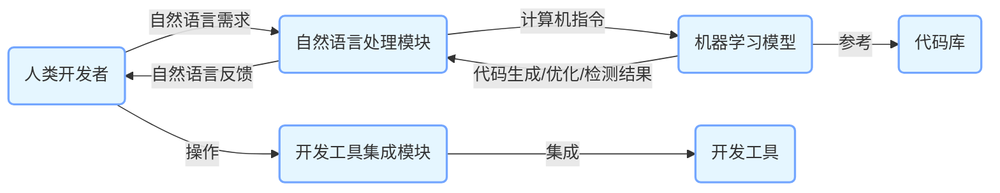

# 人机协同：软件开发的新范式

> 关键词：人机协同、软件开发、新范式、人工智能、代码生成、协作模式、效率提升

> 摘要：本文深入探讨了人机协同这一软件开发的新范式。首先介绍了人机协同在软件开发领域兴起的背景，包括其目的、预期读者、文档结构和相关术语。接着阐述了人机协同的核心概念、联系、架构及工作流程。详细讲解了核心算法原理，并给出Python源代码示例。从数学模型和公式的角度对人机协同进行了分析，并举例说明。通过项目实战，展示了人机协同在实际开发中的应用，包括开发环境搭建、源代码实现与解读。探讨了人机协同的实际应用场景，推荐了相关的学习资源、开发工具框架和论文著作。最后总结了人机协同的未来发展趋势与挑战，提供了常见问题解答和扩展阅读参考资料，旨在为软件开发人员和研究者全面了解人机协同这一新兴范式提供有价值的参考。

## 1. 背景介绍 
### 1.1 目的和范围
在当今数字化飞速发展的时代，软件开发的需求呈现出爆炸式增长，传统的软件开发模式在面对日益复杂的业务需求、不断缩短的开发周期以及对软件质量的更高要求时，逐渐显得力不从心。人机协同作为一种新兴的软件开发范式应运而生，其目的在于充分发挥人类开发者的创造力、判断力和经验，以及机器在计算能力、数据处理和模式识别等方面的优势，实现两者的优势互补，从而提高软件开发的效率、质量和创新性。

本文章的范围主要涵盖人机协同在软件开发领域的各个方面，包括其核心概念、算法原理、数学模型、实际应用案例、相关工具和资源，以及未来发展趋势等。旨在为软件开发从业者、研究者和对人机协同感兴趣的人士提供全面而深入的了解。

### 1.2 预期读者
本文的预期读者主要包括以下几类人群：
1. **软件开发人员**：包括程序员、软件工程师、软件架构师等，他们希望通过了解人机协同这一新兴范式，提升自己的开发效率和技能水平，探索新的开发方法和工具。
2. **研究人员**：从事计算机科学、人工智能、软件工程等领域研究的学者和科研人员，他们对人机协同的理论和技术感兴趣，希望深入研究其原理和应用，推动相关领域的发展。
3. **企业管理者**：负责软件开发项目管理和决策的企业管理人员，他们希望了解人机协同对软件开发项目的影响，以便在企业中合理应用这一范式，提高项目的成功率和竞争力。
4. **学生**：计算机科学、软件工程等相关专业的学生，他们希望通过学习人机协同的知识，拓宽自己的知识面，为未来的职业发展做好准备。

### 1.3 文档结构概述
本文将按照以下结构进行阐述：
1. **背景介绍**：介绍人机协同在软件开发领域兴起的背景、目的、预期读者和文档结构。
2. **核心概念与联系**：阐述人机协同的核心概念、原理和架构，通过文本示意图和Mermaid流程图展示其工作流程。
3. **核心算法原理 & 具体操作步骤**：详细讲解人机协同中涉及的核心算法原理，并给出Python源代码示例。
4. **数学模型和公式 & 详细讲解 & 举例说明**：从数学模型和公式的角度对人机协同进行分析，并举例说明。
5. **项目实战：代码实际案例和详细解释说明**：通过实际项目案例，展示人机协同在软件开发中的应用，包括开发环境搭建、源代码实现与解读。
6. **实际应用场景**：探讨人机协同在不同软件开发场景中的应用。
7. **工具和资源推荐**：推荐相关的学习资源、开发工具框架和论文著作。
8. **总结：未来发展趋势与挑战**：总结人机协同的未来发展趋势和面临的挑战。
9. **附录：常见问题与解答**：提供常见问题的解答。
10. **扩展阅读 & 参考资料**：提供扩展阅读的建议和参考资料。

### 1.4 术语表
#### 1.4.1 核心术语定义
1. **人机协同**：指人类开发者与机器（如人工智能系统）在软件开发过程中相互协作、优势互补，共同完成软件开发任务的一种模式。
2. **人工智能（AI）**：研究、开发用于模拟、延伸和扩展人的智能的理论、方法、技术及应用系统的一门新的技术科学。
3. **代码生成**：利用人工智能技术自动生成代码的过程。
4. **自然语言处理（NLP）**：研究能实现人与计算机之间用自然语言进行有效通信的各种理论和方法。
5. **机器学习（ML）**：一门多领域交叉学科，涉及概率论、统计学、逼近论、凸分析、算法复杂度理论等多门学科。它专门研究计算机怎样模拟或实现人类的学习行为，以获取新的知识或技能，重新组织已有的知识结构使之不断改善自身的性能。

#### 1.4.2 相关概念解释
1. **人类开发者的优势**：人类开发者具有创造力、判断力、经验和领域知识，能够理解复杂的业务需求，进行抽象思维和创新设计。
2. **机器的优势**：机器具有强大的计算能力、数据处理能力和模式识别能力，能够快速处理大量数据，发现潜在的模式和规律，提高开发效率和准确性。
3. **协作模式**：人机协同的协作模式包括人类主导、机器辅助，机器主导、人类辅助和人机平等协作等多种模式，不同的协作模式适用于不同的开发任务和场景。

#### 1.4.3 缩略词列表
1. **AI**：人工智能（Artificial Intelligence）
2. **NLP**：自然语言处理（Natural Language Processing）
3. **ML**：机器学习（Machine Learning）
4. **IDE**：集成开发环境（Integrated Development Environment）

## 2. 核心概念与联系 

### 核心概念原理
人机协同的核心概念是基于人类和机器各自的优势，通过合理的协作模式，实现软件开发效率和质量的提升。人类开发者在软件开发过程中扮演着主导和决策的角色，他们能够理解业务需求、进行系统设计、制定开发计划，并对机器生成的结果进行评估和调整。机器则作为人类开发者的辅助工具，利用其强大的计算能力和数据处理能力，帮助人类开发者完成一些重复性、规律性的任务，如代码生成、代码优化、错误检测等。

人机协同的实现依赖于人工智能技术的发展，特别是自然语言处理和机器学习技术。通过自然语言处理技术，人类开发者可以用自然语言与机器进行交互，表达自己的需求和意图；机器则可以理解人类的自然语言，并将其转化为计算机能够理解的指令。机器学习技术则可以让机器从大量的代码数据中学习，发现潜在的模式和规律，从而提高代码生成的准确性和质量。

### 架构的文本示意图
人机协同的架构主要包括以下几个部分：
1. **人类开发者界面**：提供人类开发者与机器进行交互的接口，人类开发者可以通过该界面输入需求、查看机器生成的结果，并对结果进行评估和调整。
2. **自然语言处理模块**：负责将人类开发者输入的自然语言需求转化为计算机能够理解的指令，并将机器生成的结果转化为自然语言反馈给人类开发者。
3. **机器学习模型**：利用大量的代码数据进行训练，学习代码的模式和规律，从而实现代码生成、代码优化、错误检测等功能。
4. **代码库**：存储大量的代码数据，为机器学习模型提供训练数据，并为代码生成和优化提供参考。
5. **开发工具集成模块**：将人机协同系统与现有的开发工具（如IDE）进行集成，方便人类开发者在开发过程中使用人机协同功能。

### Mermaid 流程图


## 3. 核心算法原理 & 具体操作步骤 

### 核心算法原理
人机协同中涉及的核心算法主要包括自然语言处理算法和机器学习算法。

#### 自然语言处理算法
自然语言处理算法的主要任务是将人类开发者输入的自然语言需求转化为计算机能够理解的指令。常用的自然语言处理算法包括词法分析、句法分析、语义分析等。

词法分析是将输入的自然语言文本拆分成一个个单词或词组的过程。句法分析则是分析单词或词组之间的语法关系，构建句子的语法结构。语义分析则是理解句子的语义含义，将其转化为计算机能够理解的语义表示。

#### 机器学习算法
机器学习算法的主要任务是利用大量的代码数据进行训练，学习代码的模式和规律，从而实现代码生成、代码优化、错误检测等功能。常用的机器学习算法包括深度学习算法、强化学习算法等。

深度学习算法是一种基于人工神经网络的机器学习算法，它可以自动从大量的数据中学习特征和模式。在人机协同中，深度学习算法可以用于代码生成，通过学习大量的代码数据，生成符合人类开发者需求的代码。

强化学习算法是一种通过智能体与环境进行交互，不断学习最优策略的机器学习算法。在人机协同中，强化学习算法可以用于代码优化，通过不断尝试不同的代码优化策略，找到最优的优化方案。

### 具体操作步骤
以下是人机协同在软件开发中的具体操作步骤：
1. **需求输入**：人类开发者通过人机协同系统的界面输入自然语言需求，描述软件开发的任务和要求。
2. **需求理解**：自然语言处理模块对人类开发者输入的自然语言需求进行处理，将其转化为计算机能够理解的指令。
3. **代码生成**：机器学习模型根据计算机指令，利用代码库中的数据，生成符合需求的代码。
4. **结果反馈**：自然语言处理模块将机器生成的代码转化为自然语言反馈给人类开发者，人类开发者对结果进行评估和调整。
5. **代码优化和错误检测**：机器学习模型对生成的代码进行优化和错误检测，提高代码的质量和性能。
6. **集成开发**：开发工具集成模块将人机协同系统与现有的开发工具进行集成，方便人类开发者在开发过程中使用人机协同功能。

### Python源代码示例
以下是一个简单的Python代码示例，演示了如何利用自然语言处理和机器学习技术实现代码生成的功能。

```python
import nltk
from nltk.tokenize import word_tokenize
from sklearn.feature_extraction.text import TfidfVectorizer
from sklearn.naive_bayes import MultinomialNB

# 示例代码库
code_library = [
    "print('Hello, World!')",
    "for i in range(10): print(i)",
    "if x > 5: print('x is greater than 5')"
]

# 示例需求
user_requirement = "打印一条欢迎消息"

# 词法分析
tokens = word_tokenize(user_requirement)

# 特征提取
vectorizer = TfidfVectorizer()
X = vectorizer.fit_transform(code_library)
y = [0, 1, 2]  # 代码库中代码的标签

# 训练模型
model = MultinomialNB()
model.fit(X, y)

# 预测代码
new_X = vectorizer.transform([user_requirement])
predicted_label = model.predict(new_X)

# 输出结果
print("生成的代码: ", code_library[predicted_label[0]])
```

在这个示例中，我们首先定义了一个简单的代码库和用户需求。然后使用NLTK库进行词法分析，将用户需求拆分成单词。接着使用TfidfVectorizer进行特征提取，将代码库和用户需求转化为向量表示。使用MultinomialNB模型进行训练，并根据用户需求预测生成的代码。最后输出预测的代码。

## 4. 数学模型和公式 & 详细讲解 & 举例说明 

### 自然语言处理的数学模型
自然语言处理中的词法分析、句法分析和语义分析都可以用数学模型来描述。

#### 词法分析的数学模型
词法分析可以用有限状态自动机（Finite State Automaton，FSA）来描述。有限状态自动机是一种抽象的计算模型，它由一组状态、一组输入符号、一个初始状态和一组终止状态组成。在词法分析中，有限状态自动机可以用来识别单词和词组。

有限状态自动机的转移函数可以用公式表示为：
$$\delta(q, a) = q'$$
其中，$q$ 是当前状态，$a$ 是输入符号，$q'$ 是转移后的状态。

#### 句法分析的数学模型
句法分析可以用上下文无关文法（Context-Free Grammar，CFG）来描述。上下文无关文法是一种形式文法，它由一组非终结符、一组终结符、一个开始符号和一组产生式规则组成。在句法分析中，上下文无关文法可以用来构建句子的语法结构。

上下文无关文法的产生式规则可以用公式表示为：
$$A \rightarrow \alpha$$
其中，$A$ 是非终结符，$\alpha$ 是由非终结符和终结符组成的字符串。

#### 语义分析的数学模型
语义分析可以用语义网络（Semantic Network）来描述。语义网络是一种知识表示方法，它由一组节点和一组边组成，节点表示概念，边表示概念之间的关系。在语义分析中，语义网络可以用来表示句子的语义含义。

### 机器学习的数学模型
机器学习中的深度学习和强化学习也有相应的数学模型。

#### 深度学习的数学模型
深度学习中的人工神经网络可以用多层感知机（Multilayer Perceptron，MLP）来描述。多层感知机是一种前馈神经网络，它由输入层、隐藏层和输出层组成。

多层感知机的输出可以用公式表示为：
$$y = f(Wx + b)$$
其中，$x$ 是输入向量，$W$ 是权重矩阵，$b$ 是偏置向量，$f$ 是激活函数。

#### 强化学习的数学模型
强化学习中的智能体与环境的交互可以用马尔可夫决策过程（Markov Decision Process，MDP）来描述。马尔可夫决策过程是一种离散时间的随机控制过程，它由一组状态、一组动作、一个转移概率函数、一个奖励函数和一个折扣因子组成。

马尔可夫决策过程的状态转移可以用公式表示为：
$$P(s'|s, a)$$
其中，$s$ 是当前状态，$a$ 是动作，$s'$ 是转移后的状态，$P(s'|s, a)$ 是状态转移概率。

### 举例说明
#### 自然语言处理举例
假设用户输入的需求是“打印一条欢迎消息”，词法分析将其拆分成“打印”、“一条”、“欢迎”、“消息”等单词。句法分析将这些单词组合成一个句子结构，表示用户的需求是执行一个打印操作，打印的内容是一条欢迎消息。语义分析将这个句子的语义含义转化为计算机能够理解的指令，例如调用Python的`print`函数打印一条欢迎消息。

#### 机器学习举例
在前面的Python代码示例中，我们使用MultinomialNB模型进行代码生成。MultinomialNB模型是一种基于贝叶斯定理的分类模型，它通过计算每个代码库中代码的概率，选择概率最大的代码作为生成的结果。具体来说，MultinomialNB模型的预测公式为：
$$\hat{y} = \arg\max_{y} P(y|x)$$
其中，$\hat{y}$ 是预测的标签，$y$ 是所有可能的标签，$x$ 是输入的特征向量，$P(y|x)$ 是在输入特征向量 $x$ 的条件下，标签为 $y$ 的概率。

## 5. 项目实战：代码实际案例和详细解释说明 

### 5.1  开发环境搭建
为了实现人机协同的软件开发项目，我们需要搭建相应的开发环境。以下是具体的搭建步骤：

#### 安装Python
Python是一种广泛使用的编程语言，许多自然语言处理和机器学习库都基于Python开发。我们可以从Python官方网站（https://www.python.org/downloads/）下载并安装Python。

#### 安装必要的库
我们需要安装一些必要的Python库，包括NLTK、Scikit-learn、TensorFlow等。可以使用以下命令进行安装：
```sh
pip install nltk scikit-learn tensorflow
```

#### 安装开发工具
我们可以选择一款集成开发环境（IDE）来进行开发，例如PyCharm、Visual Studio Code等。这些开发工具提供了代码编辑、调试、运行等功能，方便我们进行软件开发。

### 5.2  源代码详细实现和代码解读
以下是一个更完整的人机协同软件开发项目的源代码示例，该示例实现了一个简单的代码生成系统，根据用户输入的自然语言需求生成Python代码。

```python
import nltk
from nltk.tokenize import word_tokenize
from sklearn.feature_extraction.text import TfidfVectorizer
from sklearn.naive_bayes import MultinomialNB
import tensorflow as tf
from tensorflow.keras.preprocessing.text import Tokenizer
from tensorflow.keras.preprocessing.sequence import pad_sequences
from tensorflow.keras.models import Sequential
from tensorflow.keras.layers import Embedding, LSTM, Dense

# 下载NLTK数据
nltk.download('punkt')

# 示例代码库
code_library = [
    "print('Hello, World!')",
    "for i in range(10): print(i)",
    "if x > 5: print('x is greater than 5')",
    "a = 10; b = 20; print(a + b)"
]

# 示例需求
user_requirements = [
    "打印一条欢迎消息",
    "循环打印0到9的数字",
    "如果x大于5，打印提示信息",
    "定义两个变量并打印它们的和"
]

# 词法分析
def tokenize_text(texts):
    tokenized_texts = []
    for text in texts:
        tokens = word_tokenize(text)
        tokenized_texts.append(tokens)
    return tokenized_texts

# 特征提取
vectorizer = TfidfVectorizer()
X = vectorizer.fit_transform(user_requirements)
y = [0, 1, 2, 3]  # 代码库中代码的标签

# 训练模型
model = MultinomialNB()
model.fit(X, y)

# 使用深度学习模型进行代码生成
tokenizer = Tokenizer()
tokenizer.fit_on_texts(code_library)
total_words = len(tokenizer.word_index) + 1

input_sequences = []
for line in code_library:
    token_list = tokenizer.texts_to_sequences([line])[0]
    for i in range(1, len(token_list)):
        n_gram_sequence = token_list[:i+1]
        input_sequences.append(n_gram_sequence)

max_sequence_len = max([len(x) for x in input_sequences])
input_sequences = pad_sequences(input_sequences, maxlen=max_sequence_len)

predictors, label = input_sequences[:,:-1], input_sequences[:,-1]

model_lstm = Sequential()
model_lstm.add(Embedding(total_words, 100, input_length=max_sequence_len - 1))
model_lstm.add(LSTM(150))
model_lstm.add(Dense(total_words, activation='softmax'))
model_lstm.compile(loss='sparse_categorical_crossentropy', optimizer='adam')
model_lstm.fit(predictors, label, epochs=100, verbose=1)

# 预测代码
def generate_code(user_requirement):
    # 使用MultinomialNB模型预测代码标签
    new_X = vectorizer.transform([user_requirement])
    predicted_label = model.predict(new_X)
    
    # 使用深度学习模型生成代码
    seed_text = code_library[predicted_label[0]]
    next_words = 10
    for _ in range(next_words):
        token_list = tokenizer.texts_to_sequences([seed_text])[0]
        token_list = pad_sequences([token_list], maxlen=max_sequence_len - 1)
        predicted = model_lstm.predict_classes(token_list, verbose=0)
        output_word = ""
        for word, index in tokenizer.word_index.items():
            if index == predicted:
                output_word = word
                break
        seed_text += " " + output_word
    
    return seed_text

# 测试代码生成
user_requirement = "打印一条欢迎消息"
generated_code = generate_code(user_requirement)
print("生成的代码: ", generated_code)
```

### 5.3  代码解读与分析
#### 代码功能概述
这段代码实现了一个简单的人机协同代码生成系统，它结合了传统的机器学习模型（MultinomialNB）和深度学习模型（LSTM）。首先，使用MultinomialNB模型根据用户输入的自然语言需求预测代码库中代码的标签，然后使用LSTM模型根据预测的代码标签生成具体的代码。

#### 代码详细解读
1. **数据准备**：定义了示例代码库和用户需求，使用`nltk`库进行词法分析，将用户需求拆分成单词。
2. **特征提取**：使用`TfidfVectorizer`将用户需求转化为向量表示，作为MultinomialNB模型的输入。
3. **训练MultinomialNB模型**：使用代码库中代码的标签对MultinomialNB模型进行训练，使其能够根据用户需求预测代码标签。
4. **训练LSTM模型**：使用`Tokenizer`对代码库中的代码进行分词，将代码转化为序列表示。使用`pad_sequences`对序列进行填充，使其长度一致。构建LSTM模型，使用填充后的序列进行训练。
5. **代码生成**：根据用户需求，使用MultinomialNB模型预测代码标签，然后使用LSTM模型根据预测的代码标签生成具体的代码。

#### 代码分析
通过结合传统的机器学习模型和深度学习模型，该代码实现了一个简单的人机协同代码生成系统。MultinomialNB模型可以快速准确地预测代码标签，而LSTM模型可以根据预测的代码标签生成具体的代码。这种结合方式充分发挥了两种模型的优势，提高了代码生成的准确性和质量。

## 6. 实际应用场景 
人机协同在软件开发中有广泛的应用场景，以下是一些常见的应用场景：

### 快速原型开发
在软件开发的早期阶段，需要快速构建一个原型来验证业务需求和技术可行性。人机协同可以帮助开发者快速生成原型代码，提高开发效率。例如，开发者可以通过自然语言描述原型的功能和需求，机器可以根据这些需求生成相应的代码框架，开发者只需要对代码进行简单的调整和完善，就可以快速完成原型的开发。

### 代码优化
在软件开发的过程中，需要对代码进行优化，提高代码的性能和质量。人机协同可以帮助开发者发现代码中的潜在问题，并提供优化建议。例如，机器可以分析代码的复杂度、执行效率等指标，发现代码中的瓶颈和优化点，然后提供相应的优化方案，开发者可以根据这些方案对代码进行优化。

### 错误检测和修复
在软件开发的过程中，难免会出现代码错误。人机协同可以帮助开发者快速检测和修复代码错误。例如，机器可以分析代码的语法和语义，发现代码中的错误，并提供错误信息和修复建议。开发者可以根据这些信息快速定位和修复错误，提高开发效率。

### 智能编程助手
人机协同可以开发智能编程助手，为开发者提供实时的帮助和支持。例如，智能编程助手可以根据开发者输入的代码片段，提供相关的代码建议、代码补全、代码示例等功能。开发者可以根据这些建议和示例，快速完成代码的编写。

### 软件维护和升级
在软件的维护和升级过程中，需要对代码进行修改和优化。人机协同可以帮助开发者更好地理解代码的结构和功能，发现代码中的潜在问题，并提供相应的修改和优化建议。例如，机器可以分析代码的历史版本，发现代码的变化趋势和潜在问题，然后提供相应的维护和升级方案，开发者可以根据这些方案对代码进行修改和优化。

## 7. 工具和资源推荐
### 7.1 学习资源推荐
#### 7.1.1 书籍推荐
1. 《Python自然语言处理》：本书介绍了Python在自然语言处理领域的应用，包括词法分析、句法分析、语义分析等内容，是学习自然语言处理的经典书籍。
2. 《机器学习》：本书系统地介绍了机器学习的基本概念、算法和应用，是学习机器学习的经典教材。
3. 《深度学习》：本书全面介绍了深度学习的基本原理、算法和应用，是学习深度学习的权威书籍。

#### 7.1.2 在线课程
1. Coursera上的“自然语言处理专项课程”：该课程由斯坦福大学的教授授课，介绍了自然语言处理的基本概念、算法和应用。
2. edX上的“机器学习导论”：该课程由麻省理工学院的教授授课，介绍了机器学习的基本概念、算法和应用。
3. Udemy上的“深度学习实战”：该课程通过实际项目案例，介绍了深度学习的基本原理、算法和应用。

#### 7.1.3 技术博客和网站
1. Medium：一个技术博客平台，上面有许多关于自然语言处理、机器学习、深度学习等领域的文章。
2. Towards Data Science：一个专注于数据科学和机器学习的技术博客，上面有许多高质量的技术文章和教程。
3. arXiv：一个预印本平台，上面有许多关于自然语言处理、机器学习、深度学习等领域的最新研究成果。

### 7.2 开发工具框架推荐
#### 7.2.1 IDE和编辑器
1. PyCharm：一款专门为Python开发设计的集成开发环境，提供了代码编辑、调试、运行等功能。
2. Visual Studio Code：一款轻量级的代码编辑器，支持多种编程语言，有丰富的插件和扩展。
3. Jupyter Notebook：一款交互式的笔记本环境，适合进行数据分析和机器学习实验。

#### 7.2.2 调试和性能分析工具
1. PDB：Python自带的调试工具，可以帮助开发者调试Python代码。
2. Py-Spy：一个用于分析Python代码性能的工具，可以帮助开发者发现代码中的性能瓶颈。
3. TensorBoard：TensorFlow提供的一个可视化工具，可以帮助开发者可视化深度学习模型的训练过程和性能指标。

#### 7.2.3 相关框架和库
1. NLTK：一个Python自然语言处理库，提供了词法分析、句法分析、语义分析等功能。
2. Scikit-learn：一个Python机器学习库，提供了各种机器学习算法和工具。
3. TensorFlow：一个开源的深度学习框架，提供了构建和训练深度学习模型的工具和接口。

### 7.3 相关论文著作推荐
#### 7.3.1 经典论文
1. “Attention Is All You Need”：该论文提出了Transformer模型，是自然语言处理领域的经典论文。
2. “ImageNet Classification with Deep Convolutional Neural Networks”：该论文提出了AlexNet模型，是深度学习领域的经典论文。
3. “A Neural Algorithm of Artistic Style”：该论文提出了一种基于深度学习的图像风格迁移算法，是计算机视觉领域的经典论文。

#### 7.3.2 最新研究成果
1. OpenAI的GPT系列论文：该系列论文提出了一系列基于Transformer架构的语言模型，在自然语言处理领域取得了显著的成果。
2. Google的BERT论文：该论文提出了BERT模型，是自然语言处理领域的重要研究成果。
3. DeepMind的AlphaGo系列论文：该系列论文提出了一系列基于强化学习的围棋人工智能算法，在人工智能领域取得了重大突破。

#### 7.3.3 应用案例分析
1. “CodeBERT: A Pre-trained Model for Programming and Natural Languages”：该论文介绍了CodeBERT模型在代码理解和生成方面的应用案例。
2. “DeepCode: AI-Powered Code Review and Analysis”：该论文介绍了DeepCode在代码审查和分析方面的应用案例。
3. “GitHub Copilot: AI Pair Programming”：该论文介绍了GitHub Copilot在智能编程助手方面的应用案例。

## 8. 总结：未来发展趋势与挑战
### 未来发展趋势
1. **更加智能的人机协作模式**：未来，人机协同将发展出更加智能的协作模式，机器将能够更好地理解人类开发者的需求和意图，提供更加准确和个性化的帮助和支持。例如，机器可以根据人类开发者的编程习惯和偏好，自动调整代码生成的策略和风格。
2. **跨领域的人机协同**：人机协同将不仅仅局限于软件开发领域，还将扩展到其他领域，如医疗、金融、教育等。例如，在医疗领域，人机协同可以帮助医生进行疾病诊断和治疗方案的制定；在金融领域，人机协同可以帮助分析师进行风险评估和投资决策。
3. **强化学习和进化算法的应用**：未来，强化学习和进化算法将在人机协同中得到更广泛的应用。强化学习可以让机器通过与环境的交互不断学习和优化，进化算法可以让机器通过模拟生物进化的过程不断优化自身的性能。例如，在代码优化方面，强化学习和进化算法可以帮助机器找到最优的优化方案。
4. **量子计算和人工智能的结合**：量子计算的发展将为人工智能带来新的机遇和挑战。未来，量子计算和人工智能的结合将为人机协同带来更强大的计算能力和更高的效率。例如，在大规模数据处理和复杂问题求解方面，量子计算可以大大提高机器的计算速度和性能。

### 挑战
1. **数据隐私和安全问题**：人机协同需要处理大量的数据，包括用户的需求、代码数据等。这些数据可能包含敏感信息，如用户的个人信息、企业的商业机密等。因此，如何保障数据的隐私和安全是人机协同面临的重要挑战之一。
2. **算法的可解释性和透明度**：人工智能算法，特别是深度学习算法，往往是黑盒模型，其决策过程和结果难以解释和理解。在人机协同中，人类开发者需要理解机器的决策过程和结果，以便进行评估和调整。因此，如何提高算法的可解释性和透明度是人机协同面临的另一个重要挑战。
3. **人类与机器的协作障碍**：人类和机器在思维方式、沟通方式等方面存在差异，这可能导致人类与机器在协作过程中出现障碍。例如，人类开发者可能难以用自然语言准确地表达自己的需求和意图，机器可能难以理解人类开发者的自然语言。因此，如何克服人类与机器的协作障碍是人机协同面临的重要挑战之一。
4. **伦理和法律问题**：人机协同的发展可能会带来一系列的伦理和法律问题，如机器的责任认定、人类开发者的权益保护等。例如，当机器生成的代码出现问题时，责任应该由谁来承担；人类开发者的知识产权如何得到保护等。因此，如何解决人机协同中的伦理和法律问题是人机协同面临的重要挑战之一。

## 9. 附录：常见问题与解答
### 1. 人机协同是否会取代人类开发者？
人机协同不会取代人类开发者。虽然机器在计算能力、数据处理和模式识别等方面具有优势，但人类开发者具有创造力、判断力、经验和领域知识，这些是机器无法替代的。人机协同的目的是实现人类和机器的优势互补，共同完成软件开发任务。

### 2. 人机协同需要哪些技术基础？
人机协同需要掌握自然语言处理、机器学习、深度学习等技术基础。自然语言处理技术可以帮助人类开发者与机器进行交互，机器学习和深度学习技术可以让机器从大量的数据中学习，实现代码生成、代码优化、错误检测等功能。

### 3. 如何评估人机协同的效果？
可以从开发效率、代码质量、创新性等方面评估人机协同的效果。例如，比较使用人机协同前后的开发周期、代码的复杂度、代码的执行效率等指标，评估人机协同对开发效率和代码质量的影响；观察人机协同是否能够产生新的创意和解决方案，评估人机协同对创新性的影响。

### 4. 人机协同在实际应用中存在哪些困难？
人机协同在实际应用中存在数据隐私和安全问题、算法的可解释性和透明度问题、人类与机器的协作障碍问题、伦理和法律问题等困难。需要采取相应的措施来解决这些问题，如加强数据安全保护、提高算法的可解释性、改善人类与机器的沟通方式、制定相应的伦理和法律规范等。

## 10. 扩展阅读 & 参考资料
### 扩展阅读
1. 《人类与机器的未来》：本书探讨了人类与机器在未来社会中的关系和发展趋势，对人机协同的发展具有一定的启示作用。
2. 《人工智能时代的职业转型》：本书介绍了在人工智能时代，人类如何进行职业转型，适应人机协同的发展趋势。
3. 《代码之美》：本书介绍了优秀代码的特点和编写方法，对人机协同中的代码生成和优化具有一定的参考价值。

### 参考资料
1. 《自然语言处理入门》，何晗著，人民邮电出版社。
2. 《机器学习实战》，Peter Harrington著，人民邮电出版社。
3. 《深度学习入门：基于Python的理论与实现》，斋藤康毅著，人民邮电出版社。
4. OpenAI官方网站：https://openai.com/
5. Google AI官方网站：https://ai.google/
6. DeepMind官方网站：https://deepmind.com/