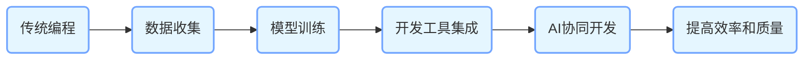

# 从传统编程到AI协同开发的职业转型路径规划

> 关键词：传统编程、AI协同开发、职业转型、路径规划、技能提升

> 摘要：随着人工智能技术的飞速发展，AI协同开发逐渐成为软件开发领域的重要趋势。对于传统程序员而言，从传统编程向AI协同开发进行职业转型不仅是适应行业变革的必要之举，也为个人职业发展带来了新的机遇。本文将深入探讨从传统编程到AI协同开发的职业转型路径规划，涵盖背景介绍、核心概念、算法原理、数学模型、项目实战、实际应用场景、工具资源推荐等多个方面，旨在为传统程序员提供全面且具有可操作性的转型指导。

## 1. 背景介绍 
### 1.1 目的和范围
本文的目的是为传统程序员规划一条从传统编程到AI协同开发的职业转型路径。范围包括详细分析转型过程中所需的知识技能、核心概念、算法原理、实际应用场景等，同时提供项目实战案例和工具资源推荐，帮助传统程序员顺利实现职业转型。

### 1.2 预期读者
本文的预期读者主要是从事传统编程工作的程序员，包括但不限于Java、Python、C++等编程语言的开发者，以及对AI协同开发感兴趣，希望进行职业转型的相关人员。

### 1.3 文档结构概述
本文将按照以下结构进行阐述：首先介绍核心概念与联系，让读者了解传统编程和AI协同开发的相关概念和关系；接着讲解核心算法原理和具体操作步骤，并给出相应的Python代码示例；然后介绍数学模型和公式，并进行详细讲解和举例说明；之后通过项目实战展示如何在实际项目中应用相关知识；再探讨实际应用场景；推荐相关的工具和资源；最后总结未来发展趋势与挑战，并提供常见问题与解答以及扩展阅读和参考资料。

### 1.4 术语表
#### 1.4.1 核心术语定义
- **传统编程**：指使用传统的编程语言（如Java、C、Python等），按照预定的逻辑和算法编写程序，实现特定功能的编程方式。
- **AI协同开发**：指在软件开发过程中，利用人工智能技术辅助程序员进行代码编写、代码审查、缺陷预测等工作，提高开发效率和质量的开发模式。
- **机器学习**：是一门多领域交叉学科，涉及概率论、统计学、逼近论、凸分析、算法复杂度理论等多门学科。它专门研究计算机怎样模拟或实现人类的学习行为，以获取新的知识或技能，重新组织已有的知识结构使之不断改善自身的性能。
- **深度学习**：是机器学习的一个分支领域，它是一种基于对数据进行表征学习的方法。深度学习通过构建具有很多层的神经网络模型，自动从大量数据中学习特征和模式。

#### 1.4.2 相关概念解释
- **代码生成**：AI协同开发中的代码生成是指利用人工智能模型根据用户输入的需求描述、注释或部分代码，自动生成完整或部分代码的功能。
- **代码审查**：AI协同开发中的代码审查是指利用人工智能技术对代码进行分析，检查代码是否符合编码规范、是否存在潜在的缺陷和安全漏洞等。
- **缺陷预测**：是指利用机器学习或深度学习模型，根据代码的特征和历史数据，预测代码中可能存在的缺陷位置和类型。

#### 1.4.3 缩略词列表
- **ML**：Machine Learning，机器学习
- **DL**：Deep Learning，深度学习
- **IDE**：Integrated Development Environment，集成开发环境

## 2. 核心概念与联系 

### 传统编程与AI协同开发的概念
传统编程是软件开发的基础方式，程序员根据业务需求，使用特定的编程语言，通过编写一系列的指令来实现软件的功能。例如，使用Java编写一个简单的控制台程序，实现两个数的加法：
```java
public class AddNumbers {
    public static void main(String[] args) {
        int num1 = 5;
        int num2 = 3;
        int sum = num1 + num2;
        System.out.println("The sum is: " + sum);
    }
}
```
在这个例子中，程序员明确地定义了变量、执行了加法运算，并输出了结果。

而AI协同开发则是在传统编程的基础上，引入了人工智能技术。它利用机器学习和深度学习模型，为程序员提供智能辅助。例如，在编写代码时，AI可以根据上下文自动补全代码、推荐代码片段，甚至根据需求描述生成完整的代码。

### 两者的联系
传统编程是AI协同开发的基础。AI协同开发需要大量的代码数据来训练模型，而这些数据来源于传统编程实践。同时，传统编程中的编程规范、算法设计等知识对于理解和应用AI协同开发中的代码生成和审查也非常重要。

另一方面，AI协同开发可以提高传统编程的效率和质量。通过AI的自动代码生成和审查功能，程序员可以减少重复性的工作，更快地完成开发任务，同时也能发现和修复代码中的潜在问题。

### 核心概念原理和架构的文本示意图
传统编程到AI协同开发的转型过程可以看作是一个逐步引入人工智能技术的过程。其架构主要包括以下几个部分：
- **数据收集层**：收集大量的代码数据，包括开源项目代码、历史项目代码等，用于训练AI模型。
- **模型训练层**：使用机器学习和深度学习算法对收集到的数据进行训练，生成代码生成、代码审查等模型。
- **开发工具集成层**：将训练好的模型集成到开发工具（如IDE）中，为程序员提供智能辅助功能。
- **用户交互层**：程序员在开发过程中与集成了AI功能的开发工具进行交互，享受AI协同开发的便利。

### Mermaid流程图


## 3. 核心算法原理 & 具体操作步骤 

### 核心算法原理
在AI协同开发中，常用的算法包括机器学习和深度学习算法。以下以代码生成为例，介绍一种基于深度学习的代码生成算法——基于Transformer的代码生成模型。

Transformer是一种基于注意力机制的深度学习模型，它在自然语言处理领域取得了巨大的成功。在代码生成中，我们可以将代码看作是一种特殊的语言，使用Transformer模型来学习代码的语法和语义。

Transformer模型的核心是多头注意力机制，它可以让模型在处理输入序列时，关注到序列中不同位置的信息。具体来说，多头注意力机制将输入序列映射到多个低维子空间，在每个子空间中计算注意力分数，然后将这些分数进行合并，得到最终的注意力表示。

### 具体操作步骤
#### 步骤1：数据预处理
首先，我们需要收集大量的代码数据，并对其进行预处理。预处理的步骤包括：
- 代码清洗：去除代码中的注释、空格等不必要的信息。
- 分词：将代码分割成一个个的词元（token）。
- 构建词汇表：将所有的词元映射到一个整数索引，方便模型处理。

以下是一个简单的Python代码示例，用于对代码进行分词：
```python
import re

def tokenize_code(code):
    # 去除注释
    code = re.sub(r'#.*', '', code)
    # 分割代码
    tokens = re.findall(r'\w+|[^\w\s]', code)
    return tokens

code = "def add_numbers(a, b):\n    return a + b"
tokens = tokenize_code(code)
print(tokens)
```

#### 步骤2：模型训练
在数据预处理完成后，我们可以使用预处理后的数据来训练Transformer模型。训练过程通常包括以下几个步骤：
- 定义模型结构：使用深度学习框架（如PyTorch或TensorFlow）定义Transformer模型的结构。
- 定义损失函数：使用交叉熵损失函数来衡量模型的预测结果与真实标签之间的差异。
- 选择优化器：使用Adam优化器来更新模型的参数。
- 训练模型：将预处理后的数据输入到模型中，进行多次迭代训练。

以下是一个简单的使用PyTorch实现的Transformer代码生成模型的训练示例：
```python
import torch
import torch.nn as nn
import torch.optim as optim

# 定义Transformer模型
class TransformerCodeGenerator(nn.Module):
    def __init__(self, vocab_size, d_model, nhead, num_layers):
        super(TransformerCodeGenerator, self).__init__()
        self.embedding = nn.Embedding(vocab_size, d_model)
        self.transformer_encoder = nn.TransformerEncoder(
            nn.TransformerEncoderLayer(d_model, nhead),
            num_layers
        )
        self.fc = nn.Linear(d_model, vocab_size)

    def forward(self, x):
        x = self.embedding(x)
        x = self.transformer_encoder(x)
        x = self.fc(x)
        return x

# 假设词汇表大小为1000，模型维度为128，头数为4，层数为2
vocab_size = 1000
d_model = 128
nhead = 4
num_layers = 2

model = TransformerCodeGenerator(vocab_size, d_model, nhead, num_layers)

# 定义损失函数和优化器
criterion = nn.CrossEntropyLoss()
optimizer = optim.Adam(model.parameters(), lr=0.001)

# 模拟训练数据
input_data = torch.randint(0, vocab_size, (10, 20))
target_data = torch.randint(0, vocab_size, (10, 20))

# 训练模型
for epoch in range(10):
    optimizer.zero_grad()
    output = model(input_data)
    loss = criterion(output.view(-1, vocab_size), target_data.view(-1))
    loss.backward()
    optimizer.step()
    print(f'Epoch {epoch+1}, Loss: {loss.item()}')
```

#### 步骤3：模型应用
在模型训练完成后，我们可以将其应用到实际的代码生成任务中。具体步骤如下：
- 输入需求描述：程序员输入对代码的需求描述，如功能、输入输出等。
- 需求编码：将需求描述转换为模型可以处理的输入格式。
- 代码生成：将编码后的需求输入到训练好的模型中，生成代码。
- 代码后处理：对生成的代码进行格式化、语法检查等后处理操作。

以下是一个简单的代码生成示例：
```python
# 假设已经训练好的模型为model
# 输入需求描述
input_text = "实现一个简单的加法函数"
# 需求编码（这里只是简单示例，实际需要更复杂的处理）
input_tokens = tokenize_code(input_text)
input_indices = [vocab[token] for token in input_tokens if token in vocab]
input_tensor = torch.tensor(input_indices).unsqueeze(0)

# 代码生成
with torch.no_grad():
    output = model(input_tensor)
    predicted_indices = torch.argmax(output, dim=-1).squeeze().tolist()

# 解码生成的代码
predicted_tokens = [inv_vocab[index] for index in predicted_indices]
generated_code = ' '.join(predicted_tokens)
print(generated_code)
```

## 4. 数学模型和公式 & 详细讲解 & 举例说明 

### 多头注意力机制的数学模型
多头注意力机制是Transformer模型的核心，其数学模型可以表示为：

$$
\text{MultiHead}(Q, K, V) = \text{Concat}(\text{head}_1, \ldots, \text{head}_h)W^O
$$

其中，

$$
\text{head}_i = \text{Attention}(QW_i^Q, KW_i^K, VW_i^V)
$$

$$
\text{Attention}(Q, K, V) = \text{softmax}\left(\frac{QK^T}{\sqrt{d_k}}\right)V
$$

- $Q$ 是查询矩阵，$K$ 是键矩阵，$V$ 是值矩阵。
- $W_i^Q$、$W_i^K$、$W_i^V$ 是可学习的投影矩阵，用于将输入映射到低维子空间。
- $W^O$ 是可学习的投影矩阵，用于将多头注意力的输出进行合并。
- $d_k$ 是键向量的维度。

### 详细讲解
多头注意力机制的核心思想是将输入序列映射到多个低维子空间，在每个子空间中计算注意力分数，然后将这些分数进行合并。这样可以让模型在处理输入序列时，关注到不同方面的信息。

具体来说，首先将输入的查询矩阵 $Q$、键矩阵 $K$ 和值矩阵 $V$ 分别通过投影矩阵 $W_i^Q$、$W_i^K$、$W_i^V$ 映射到低维子空间，得到 $QW_i^Q$、$KW_i^K$、$VW_i^V$。然后在每个子空间中计算注意力分数，即通过 $\text{softmax}\left(\frac{QK^T}{\sqrt{d_k}}\right)$ 计算查询向量与键向量之间的相似度，再将相似度与值矩阵相乘，得到注意力输出。最后将多个子空间的注意力输出进行拼接，并通过投影矩阵 $W^O$ 进行合并。

### 举例说明
假设我们有一个输入序列 $x = [x_1, x_2, x_3]$，每个元素的维度为 $d = 4$。我们将使用 $h = 2$ 个头的多头注意力机制，键向量的维度 $d_k = 2$。

首先，我们定义投影矩阵 $W_1^Q$、$W_1^K$、$W_1^V$ 和 $W_2^Q$、$W_2^K$、$W_2^V$，它们的维度都是 $4 \times 2$。

然后，将输入序列 $x$ 分别投影到两个子空间：

$$
Q_1 = xW_1^Q, \quad K_1 = xW_1^K, \quad V_1 = xW_1^V
$$

$$
Q_2 = xW_2^Q, \quad K_2 = xW_2^K, \quad V_2 = xW_2^V
$$

接下来，在每个子空间中计算注意力分数：

$$
\text{Attention}_1 = \text{softmax}\left(\frac{Q_1K_1^T}{\sqrt{d_k}}\right)V_1
$$

$$
\text{Attention}_2 = \text{softmax}\left(\frac{Q_2K_2^T}{\sqrt{d_k}}\right)V_2
$$

最后，将两个子空间的注意力输出进行拼接，并通过投影矩阵 $W^O$ 进行合并：

$$
\text{MultiHead}(Q, K, V) = \text{Concat}(\text{Attention}_1, \text{Attention}_2)W^O
$$

## 5. 项目实战：代码实际案例和详细解释说明 

### 5.1  开发环境搭建
#### 安装Python
首先，我们需要安装Python。建议使用Python 3.7及以上版本。可以从Python官方网站（https://www.python.org/downloads/）下载并安装Python。

#### 安装深度学习框架
我们选择使用PyTorch作为深度学习框架。可以使用以下命令安装PyTorch：
```sh
pip install torch torchvision
```

#### 安装其他依赖库
还需要安装一些其他的依赖库，如NumPy、Pandas等。可以使用以下命令安装：
```sh
pip install numpy pandas
```

### 5.2  源代码详细实现和代码解读
我们将实现一个简单的基于Transformer的代码生成项目。以下是完整的代码：

```python
import torch
import torch.nn as nn
import torch.optim as optim
import numpy as np

# 定义Transformer模型
class TransformerCodeGenerator(nn.Module):
    def __init__(self, vocab_size, d_model, nhead, num_layers):
        super(TransformerCodeGenerator, self).__init__()
        self.embedding = nn.Embedding(vocab_size, d_model)
        self.transformer_encoder = nn.TransformerEncoder(
            nn.TransformerEncoderLayer(d_model, nhead),
            num_layers
        )
        self.fc = nn.Linear(d_model, vocab_size)

    def forward(self, x):
        x = self.embedding(x)
        x = self.transformer_encoder(x)
        x = self.fc(x)
        return x

# 模拟数据
vocab_size = 1000
d_model = 128
nhead = 4
num_layers = 2
model = TransformerCodeGenerator(vocab_size, d_model, nhead, num_layers)

# 定义损失函数和优化器
criterion = nn.CrossEntropyLoss()
optimizer = optim.Adam(model.parameters(), lr=0.001)

# 模拟训练数据
input_data = torch.randint(0, vocab_size, (10, 20))
target_data = torch.randint(0, vocab_size, (10, 20))

# 训练模型
for epoch in range(10):
    optimizer.zero_grad()
    output = model(input_data)
    loss = criterion(output.view(-1, vocab_size), target_data.view(-1))
    loss.backward()
    optimizer.step()
    print(f'Epoch {epoch+1}, Loss: {loss.item()}')

# 代码生成
input_text = "实现一个简单的加法函数"
# 这里只是简单示例，实际需要更复杂的处理
input_tokens = input_text.split()
input_indices = [np.random.randint(0, vocab_size) for _ in input_tokens]
input_tensor = torch.tensor(input_indices).unsqueeze(0)

with torch.no_grad():
    output = model(input_tensor)
    predicted_indices = torch.argmax(output, dim=-1).squeeze().tolist()

# 解码生成的代码
predicted_tokens = [str(index) for index in predicted_indices]
generated_code = ' '.join(predicted_tokens)
print("Generated code:", generated_code)
```

### 代码解读与分析
#### 模型定义
- `TransformerCodeGenerator` 类继承自 `nn.Module`，定义了一个基于Transformer的代码生成模型。
- `__init__` 方法初始化了模型的各个层，包括嵌入层、Transformer编码器层和全连接层。
- `forward` 方法定义了模型的前向传播过程，将输入序列经过嵌入层、Transformer编码器层和全连接层，输出预测结果。

#### 数据准备
- 模拟了训练数据 `input_data` 和 `target_data`，实际应用中需要使用真实的代码数据。
- 对于代码生成，简单地将输入文本进行分词，并随机生成输入索引，实际应用中需要更复杂的处理。

#### 模型训练
- 使用交叉熵损失函数 `nn.CrossEntropyLoss()` 来衡量模型的预测结果与真实标签之间的差异。
- 使用Adam优化器 `optim.Adam()` 来更新模型的参数。
- 在每个训练周期中，将输入数据输入到模型中，计算损失，进行反向传播和参数更新。

#### 代码生成
- 在代码生成阶段，将输入文本转换为输入张量，输入到训练好的模型中，得到预测结果。
- 通过 `torch.argmax()` 函数获取预测的索引，将其转换为词元，拼接成生成的代码。

## 6. 实际应用场景 
### 代码自动补全
在传统编程中，程序员需要手动输入大量的代码。而在AI协同开发中，AI可以根据程序员输入的部分代码和上下文，自动补全代码。例如，当程序员输入 `for i in ra` 时，AI可以自动补全为 `for i in range(10):`。

### 代码生成
AI可以根据程序员的需求描述，自动生成代码。例如，程序员只需要描述“实现一个排序算法”，AI就可以生成相应的排序算法代码，如冒泡排序、快速排序等。

### 代码审查
AI可以对代码进行自动审查，检查代码是否符合编码规范、是否存在潜在的缺陷和安全漏洞等。例如，AI可以检查代码中是否存在未使用的变量、是否存在空指针异常等问题，并给出相应的建议。

### 缺陷预测
利用机器学习和深度学习模型，AI可以根据代码的特征和历史数据，预测代码中可能存在的缺陷位置和类型。例如，对于一个大型的软件项目，AI可以预测哪些模块或函数更容易出现缺陷，帮助程序员提前进行修复。

## 7. 工具和资源推荐
### 7.1 学习资源推荐
#### 7.1.1 书籍推荐
- 《Python深度学习》：这本书由深度学习领域的权威专家François Chollet所著，详细介绍了Python和深度学习框架Keras的使用，适合初学者入门。
- 《深度学习》：由Ian Goodfellow、Yoshua Bengio和Aaron Courville三位深度学习领域的先驱共同撰写，被称为深度学习领域的“圣经”，全面介绍了深度学习的理论和实践。
- 《机器学习》：由周志华教授所著，是国内机器学习领域的经典教材，内容丰富，讲解详细，适合系统学习机器学习知识。

#### 7.1.2 在线课程
- Coursera上的《机器学习》课程：由Andrew Ng教授讲授，是机器学习领域最受欢迎的在线课程之一，课程内容深入浅出，适合初学者。
- edX上的《深度学习》课程：由MIT的教授讲授，深入介绍了深度学习的原理和应用，适合有一定基础的学习者。
- 吴恩达的《DeepLearning.ai》系列课程：包括《神经网络和深度学习》、《改善深层神经网络：超参数调试、正则化和优化》等多门课程，全面覆盖了深度学习的各个方面。

#### 7.1.3 技术博客和网站
- Medium：是一个技术博客平台，上面有很多关于人工智能和机器学习的优质文章。
- Towards Data Science：专注于数据科学和机器学习领域，提供了大量的技术文章和案例分析。
- arXiv：是一个预印本平台，上面有很多最新的人工智能和机器学习研究论文。

### 7.2 开发工具框架推荐
#### 7.2.1 IDE和编辑器
- PyCharm：是一款专门为Python开发设计的集成开发环境，具有强大的代码编辑、调试和自动补全功能。
- Visual Studio Code：是一款轻量级的代码编辑器，支持多种编程语言，并且有丰富的插件生态系统，可以方便地集成AI开发工具。
- Jupyter Notebook：是一个交互式的开发环境，适合进行数据分析和模型训练，支持Python、R等多种编程语言。

#### 7.2.2 调试和性能分析工具
- TensorBoard：是TensorFlow的可视化工具，可以用于可视化模型的训练过程、损失曲线、参数分布等。
- PyTorch Profiler：是PyTorch的性能分析工具，可以帮助开发者分析模型的性能瓶颈，优化代码。
- VS Code Debugger：是Visual Studio Code的调试工具，支持Python、Java等多种编程语言，可以方便地进行代码调试。

#### 7.2.3 相关框架和库
- PyTorch：是一个开源的深度学习框架，具有动态图和静态图两种模式，易于使用和调试。
- TensorFlow：是Google开发的深度学习框架，具有强大的分布式训练和部署能力。
- Scikit-learn：是一个简单易用的机器学习库，提供了丰富的机器学习算法和工具，适合初学者使用。

### 7.3 相关论文著作推荐
#### 7.3.1 经典论文
- 《Attention Is All You Need》：提出了Transformer模型，是自然语言处理领域的经典论文。
- 《ImageNet Classification with Deep Convolutional Neural Networks》：介绍了AlexNet模型，开启了深度学习在计算机视觉领域的革命。
- 《Generative Adversarial Nets》：提出了生成对抗网络（GAN），是生成式模型领域的重要论文。

#### 7.3.2 最新研究成果
- 关注arXiv上的最新论文，特别是关于AI协同开发、代码生成、代码审查等方面的研究。
- 参加国际顶级学术会议，如NeurIPS、ICML、CVPR等，了解最新的研究动态。

#### 7.3.3 应用案例分析
- 可以参考一些开源项目和实际应用案例，了解AI协同开发在不同领域的应用情况。例如，GitHub上有很多基于AI的代码生成和审查项目，可以学习它们的实现思路和方法。

## 8. 总结：未来发展趋势与挑战
### 未来发展趋势
- **更智能的代码生成**：未来的AI协同开发工具将能够生成更加复杂、高质量的代码，甚至可以根据自然语言描述生成完整的软件项目。
- **深度集成开发环境**：AI将与开发环境深度集成，提供更加智能的代码提示、错误检查和修复等功能，提高开发效率。
- **跨领域协同开发**：AI协同开发将不仅仅局限于软件开发领域，还将与其他领域（如硬件设计、数据分析等）进行协同，实现更加高效的跨领域开发。

### 挑战
- **数据隐私和安全**：AI协同开发需要大量的代码数据进行训练，如何保护这些数据的隐私和安全是一个重要的挑战。
- **模型可解释性**：深度学习模型通常是黑盒模型，难以解释其决策过程。在AI协同开发中，如何提高模型的可解释性，让程序员更好地理解和信任模型的输出是一个亟待解决的问题。
- **技术更新换代快**：人工智能技术发展迅速，新的算法和模型不断涌现。传统程序员需要不断学习和更新知识，才能跟上技术的发展步伐。

## 9. 附录：常见问题与解答
### 问题1：从传统编程转型到AI协同开发需要具备哪些基础知识？
答：需要具备一定的数学基础，如线性代数、概率论和统计学等；熟悉至少一种编程语言，如Python；了解机器学习和深度学习的基本概念和算法。

### 问题2：AI协同开发是否会取代传统程序员？
答：不会。AI协同开发只是辅助程序员进行开发工作，提高开发效率和质量。程序员的创造力、逻辑思维和问题解决能力是AI无法替代的。

### 问题3：如何选择适合自己的深度学习框架？
答：可以根据自己的需求和偏好来选择。如果注重动态图和易于调试，可以选择PyTorch；如果注重分布式训练和部署能力，可以选择TensorFlow。

### 问题4：在AI协同开发中，如何处理数据不平衡的问题？
答：可以采用过采样、欠采样、加权损失函数等方法来处理数据不平衡问题。具体方法需要根据实际情况进行选择。

## 10. 扩展阅读 & 参考资料
- 《人工智能：现代方法》
- 《Python机器学习实战》
- https://www.tensorflow.org/
- https://pytorch.org/
- https://scikit-learn.org/