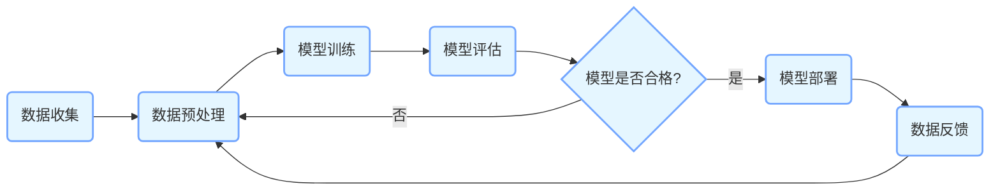

# 从传统编程到AI编程：程序员的转型之路

> 关键词：传统编程、AI编程、程序员转型、机器学习、深度学习、人工智能算法、转型挑战与机遇

> 摘要：本文深入探讨了程序员从传统编程向AI编程转型的相关内容。首先介绍了转型的背景，包括目的、预期读者、文档结构等信息。接着阐述了传统编程和AI编程的核心概念及其联系，详细讲解了AI编程中的核心算法原理与具体操作步骤，通过Python代码进行示例。还分析了相关的数学模型和公式，并结合实际例子加深理解。在项目实战部分，给出了开发环境搭建、源代码实现与解读等内容。同时探讨了AI编程的实际应用场景，推荐了学习资源、开发工具框架以及相关论文著作。最后总结了未来发展趋势与挑战，提供了常见问题解答和扩展阅读参考资料，旨在为程序员的转型提供全面、深入的指导。

## 1. 背景介绍 
### 1.1 目的和范围
随着人工智能技术的迅猛发展，AI编程在各个领域的应用日益广泛。传统编程模式逐渐无法满足复杂的业务需求，越来越多的程序员意识到需要向AI编程转型。本文的目的在于为广大程序员提供全面且深入的指导，帮助他们了解从传统编程到AI编程转型的全过程，包括核心概念、算法原理、实际操作、应用场景等方面的内容。范围涵盖了从理论知识到实践应用的多个层面，旨在让程序员对AI编程有一个系统的认识，从而顺利实现转型。

### 1.2 预期读者
本文主要面向有一定传统编程基础，但希望涉足AI编程领域的程序员。无论是从事Web开发、移动应用开发还是其他传统编程方向的人员，只要对AI编程感兴趣并希望实现转型，都可以从本文中获取有价值的信息。同时，对于计算机相关专业的学生以及对人工智能技术有一定了解并希望深入学习的爱好者来说，本文也具有一定的参考价值。

### 1.3 文档结构概述
本文将按照以下结构进行阐述：首先介绍背景信息，让读者了解文章的目的和适用范围。接着讲解传统编程和AI编程的核心概念及其联系，为后续的学习打下基础。然后详细介绍AI编程的核心算法原理和具体操作步骤，通过Python代码进行示例。再分析相关的数学模型和公式，并结合实际例子进行说明。在项目实战部分，给出开发环境搭建、源代码实现与解读等内容，让读者亲身体验AI编程的过程。之后探讨AI编程的实际应用场景，展示其广泛的用途。推荐学习资源、开发工具框架以及相关论文著作，帮助读者进一步深入学习。最后总结未来发展趋势与挑战，提供常见问题解答和扩展阅读参考资料，使读者对整个转型过程有一个全面的认识。

### 1.4 术语表
#### 1.4.1 核心术语定义
- **传统编程**：指的是通过明确的规则和指令来编写程序，以实现特定功能的编程方式。程序的执行结果是可预测的，程序员需要详细地定义每一个步骤。
- **AI编程**：利用人工智能技术进行编程，主要涉及机器学习、深度学习等领域。通过让计算机从数据中学习模式和规律，从而实现智能决策和预测。
- **机器学习**：是AI编程的一个重要分支，它让计算机通过数据和算法来自动改进性能。机器学习算法可以分为监督学习、无监督学习和强化学习等类型。
- **深度学习**：是机器学习的一个子集，基于人工神经网络，特别是深度神经网络。深度学习模型可以自动从大量数据中提取特征，在图像识别、自然语言处理等领域取得了显著的成果。

#### 1.4.2 相关概念解释
- **数据预处理**：在进行AI编程之前，通常需要对原始数据进行清洗、转换和归一化等操作，以提高数据的质量和可用性。
- **模型训练**：使用训练数据对机器学习或深度学习模型进行优化，调整模型的参数，使其能够更好地拟合数据。
- **模型评估**：使用测试数据对训练好的模型进行评估，以衡量模型的性能和准确性。常见的评估指标包括准确率、召回率、F1值等。

#### 1.4.3 缩略词列表
- **AI**：Artificial Intelligence，人工智能
- **ML**：Machine Learning，机器学习
- **DL**：Deep Learning，深度学习
- **ANN**：Artificial Neural Network，人工神经网络
- **CNN**：Convolutional Neural Network，卷积神经网络
- **RNN**：Recurrent Neural Network，循环神经网络

## 2. 核心概念与联系 
### 2.1 传统编程的核心概念
传统编程是基于明确的规则和逻辑来实现程序功能的。程序员需要详细地定义每一个步骤，包括输入、处理和输出。例如，编写一个简单的计算器程序，程序员需要明确地定义加法、减法、乘法和除法的操作步骤。传统编程的优点是执行结果可预测，程序的逻辑清晰，易于调试和维护。但它的局限性在于对于复杂的问题，需要编写大量的代码，并且难以处理不确定性和变化性较大的情况。

### 2.2 AI编程的核心概念
AI编程主要基于机器学习和深度学习技术。机器学习通过让计算机从数据中学习模式和规律，从而实现智能决策和预测。深度学习则是基于深度神经网络，能够自动从大量数据中提取特征。例如，在图像识别任务中，深度学习模型可以通过学习大量的图像数据，自动识别出图像中的物体。AI编程的优点是能够处理复杂的问题，具有较强的适应性和灵活性。但它的缺点是需要大量的数据和计算资源，并且模型的解释性较差。

### 2.3 传统编程与AI编程的联系
传统编程和AI编程并不是相互排斥的，而是相互补充的。在AI编程中，传统编程仍然起着重要的作用。例如，在数据预处理阶段，需要使用传统编程来清洗和转换数据；在模型部署阶段，需要使用传统编程来实现模型的接口和服务。同时，AI编程也为传统编程带来了新的思路和方法。例如，通过使用机器学习算法，可以对传统程序的性能进行优化和预测。

### 2.4 核心概念原理和架构的文本示意图
传统编程通常是线性的结构，程序员按照预定的逻辑依次执行各个步骤。而AI编程则是一个循环的过程，包括数据收集、数据预处理、模型训练、模型评估和模型部署等环节。具体的文本示意图如下：

传统编程：输入 -> 处理（明确的规则和逻辑） -> 输出

AI编程：数据收集 -> 数据预处理 -> 模型训练 -> 模型评估 -> 模型部署 -> 数据反馈（用于进一步优化模型）

### 2.5 Mermaid流程图


## 3. 核心算法原理 & 具体操作步骤 
### 3.1 线性回归算法原理
线性回归是一种基本的机器学习算法，用于预测连续的数值。它的基本思想是通过找到一条直线（在多维空间中是一个超平面），使得所有数据点到该直线的距离之和最小。线性回归的数学模型可以表示为：

$$y = \theta_0 + \theta_1x_1 + \theta_2x_2 + \cdots + \theta_nx_n + \epsilon$$

其中，$y$ 是预测值，$x_1, x_2, \cdots, x_n$ 是输入特征，$\theta_0, \theta_1, \theta_2, \cdots, \theta_n$ 是模型的参数，$\epsilon$ 是误差项。

### 3.2 线性回归算法的Python实现
```python
import numpy as np
from sklearn.linear_model import LinearRegression
from sklearn.model_selection import train_test_split
from sklearn.metrics import mean_squared_error

# 生成一些示例数据
np.random.seed(0)
X = 2 * np.random.rand(100, 1)
y = 4 + 3 * X + np.random.randn(100, 1)

# 划分训练集和测试集
X_train, X_test, y_train, y_test = train_test_split(X, y, test_size=0.2, random_state=42)

# 创建线性回归模型
model = LinearRegression()

# 训练模型
model.fit(X_train, y_train)

# 预测测试集
y_pred = model.predict(X_test)

# 计算均方误差
mse = mean_squared_error(y_test, y_pred)
print(f"均方误差: {mse}")
```

### 3.3 具体操作步骤
1. **数据收集**：收集与问题相关的数据，例如在房价预测问题中，收集房屋的面积、卧室数量、地理位置等特征数据以及对应的房价数据。
2. **数据预处理**：对收集到的数据进行清洗、转换和归一化等操作。例如，处理缺失值、将类别特征转换为数值特征、将数据进行标准化处理等。
3. **模型选择**：根据问题的类型选择合适的模型，例如对于回归问题可以选择线性回归模型，对于分类问题可以选择逻辑回归模型、决策树模型等。
4. **模型训练**：使用训练数据对模型进行训练，调整模型的参数，使其能够更好地拟合数据。
5. **模型评估**：使用测试数据对训练好的模型进行评估，计算评估指标，例如均方误差、准确率、召回率等。
6. **模型优化**：根据评估结果对模型进行优化，例如调整模型的参数、选择更合适的特征、使用不同的模型等。
7. **模型部署**：将训练好的模型部署到实际应用中，例如将房价预测模型部署到网站或移动应用中，为用户提供房价预测服务。

### 3.4 逻辑回归算法原理
逻辑回归是一种用于分类问题的机器学习算法。它通过逻辑函数（也称为sigmoid函数）将线性回归的输出映射到0到1之间的概率值，从而实现分类。逻辑回归的数学模型可以表示为：

$$P(y=1|x) = \frac{1}{1 + e^{-(\theta_0 + \theta_1x_1 + \theta_2x_2 + \cdots + \theta_nx_n)}}$$

其中，$P(y=1|x)$ 是样本属于正类的概率，$x_1, x_2, \cdots, x_n$ 是输入特征，$\theta_0, \theta_1, \theta_2, \cdots, \theta_n$ 是模型的参数。

### 3.5 逻辑回归算法的Python实现
```python
from sklearn.datasets import load_iris
from sklearn.linear_model import LogisticRegression
from sklearn.model_selection import train_test_split
from sklearn.metrics import accuracy_score

# 加载鸢尾花数据集
iris = load_iris()
X = iris.data
y = iris.target

# 划分训练集和测试集
X_train, X_test, y_train, y_test = train_test_split(X, y, test_size=0.2, random_state=42)

# 创建逻辑回归模型
model = LogisticRegression()

# 训练模型
model.fit(X_train, y_train)

# 预测测试集
y_pred = model.predict(X_test)

# 计算准确率
accuracy = accuracy_score(y_test, y_pred)
print(f"准确率: {accuracy}")
```

## 4. 数学模型和公式 & 详细讲解 & 举例说明 
### 4.1 线性回归的数学模型和公式
线性回归的目标是找到一组参数 $\theta_0, \theta_1, \theta_2, \cdots, \theta_n$，使得预测值 $y$ 与真实值 $\hat{y}$ 之间的误差最小。常用的误差度量方法是均方误差（Mean Squared Error，MSE），其公式为：

$$MSE = \frac{1}{m} \sum_{i=1}^{m} (y^{(i)} - \hat{y}^{(i)})^2$$

其中，$m$ 是样本数量，$y^{(i)}$ 是第 $i$ 个样本的真实值，$\hat{y}^{(i)}$ 是第 $i$ 个样本的预测值。

为了找到使均方误差最小的参数 $\theta$，可以使用最小二乘法。最小二乘法的原理是通过对均方误差求偏导数，并令偏导数等于0，从而得到参数 $\theta$ 的最优解。具体的公式为：

$$\theta = (X^T X)^{-1} X^T y$$

其中，$X$ 是输入特征矩阵，$y$ 是真实值向量。

### 4.2 举例说明
假设我们有以下数据集：

| 房屋面积（平方米） | 房价（万元） |
| --- | --- |
| 50 | 80 |
| 60 | 90 |
| 70 | 100 |
| 80 | 110 |
| 90 | 120 |

我们可以使用线性回归模型来预测房价。首先，将房屋面积作为输入特征 $x$，房价作为真实值 $y$。然后，根据最小二乘法的公式计算参数 $\theta$。

```python
import numpy as np

# 输入特征矩阵
X = np.array([[1, 50], [1, 60], [1, 70], [1, 80], [1, 90]])
# 真实值向量
y = np.array([80, 90, 100, 110, 120])

# 计算参数 theta
theta = np.linalg.inv(X.T.dot(X)).dot(X.T).dot(y)
print(f"参数 theta: {theta}")
```

### 4.3 逻辑回归的数学模型和公式
逻辑回归使用逻辑函数（sigmoid函数）将线性回归的输出映射到0到1之间的概率值。sigmoid函数的公式为：

$$\sigma(z) = \frac{1}{1 + e^{-z}}$$

其中，$z = \theta_0 + \theta_1x_1 + \theta_2x_2 + \cdots + \theta_nx_n$。

逻辑回归的损失函数通常使用对数损失函数（Log Loss），其公式为：

$$J(\theta) = -\frac{1}{m} \sum_{i=1}^{m} [y^{(i)} \log(\sigma(z^{(i)})) + (1 - y^{(i)}) \log(1 - \sigma(z^{(i)}))]$$

其中，$m$ 是样本数量，$y^{(i)}$ 是第 $i$ 个样本的真实标签，$\sigma(z^{(i)})$ 是第 $i$ 个样本的预测概率。

为了找到使对数损失函数最小的参数 $\theta$，可以使用梯度下降法。梯度下降法的原理是通过不断地更新参数 $\theta$，使得损失函数的值逐渐减小。具体的更新公式为：

$$\theta_j := \theta_j - \alpha \frac{\partial J(\theta)}{\partial \theta_j}$$

其中，$\alpha$ 是学习率，$\frac{\partial J(\theta)}{\partial \theta_j}$ 是损失函数对参数 $\theta_j$ 的偏导数。

### 4.4 举例说明
假设我们有一个二分类问题，样本的特征为 $x_1$ 和 $x_2$，真实标签为 $y$。我们可以使用逻辑回归模型来进行分类。首先，定义逻辑回归的损失函数和梯度下降的更新公式。

```python
import numpy as np

# 定义 sigmoid 函数
def sigmoid(z):
    return 1 / (1 + np.exp(-z))

# 定义对数损失函数
def log_loss(y_true, y_pred):
    m = len(y_true)
    return -1 / m * np.sum(y_true * np.log(y_pred) + (1 - y_true) * np.log(1 - y_pred))

# 定义梯度下降法
def gradient_descent(X, y, theta, alpha, num_iterations):
    m = len(y)
    for iteration in range(num_iterations):
        z = np.dot(X, theta)
        y_pred = sigmoid(z)
        gradient = np.dot(X.T, (y_pred - y)) / m
        theta = theta - alpha * gradient
    return theta

# 示例数据
X = np.array([[1, 2], [1, 3], [1, 4], [1, 5]])
y = np.array([0, 0, 1, 1])
theta = np.zeros(X.shape[1])
alpha = 0.1
num_iterations = 1000

# 训练模型
theta = gradient_descent(X, y, theta, alpha, num_iterations)
print(f"参数 theta: {theta}")
```

## 5. 项目实战：代码实际案例和详细解释说明 
### 5.1  开发环境搭建
#### 5.1.1 安装Python
首先，需要安装Python环境。可以从Python官方网站（https://www.python.org/downloads/） 下载适合自己操作系统的Python安装包，并按照安装向导进行安装。建议安装Python 3.6及以上版本。

#### 5.1.2 安装虚拟环境
为了避免不同项目之间的依赖冲突，建议使用虚拟环境。可以使用 `venv` 模块来创建虚拟环境。在命令行中执行以下命令：

```sh
python -m venv myenv
```

其中，`myenv` 是虚拟环境的名称，可以根据自己的喜好进行修改。

#### 5.1.3 激活虚拟环境
在Windows系统中，执行以下命令激活虚拟环境：

```sh
myenv\Scripts\activate
```

在Linux或Mac系统中，执行以下命令激活虚拟环境：

```sh
source myenv/bin/activate
```

#### 5.1.4 安装必要的库
在激活虚拟环境后，需要安装一些必要的库，例如 `numpy`、`pandas`、`scikit-learn`、`tensorflow` 等。可以使用 `pip` 命令进行安装：

```sh
pip install numpy pandas scikit-learn tensorflow
```

### 5.2  源代码详细实现和代码解读
#### 5.2.1 项目概述
本项目将使用深度学习模型对手写数字进行识别。数据集采用MNIST数据集，该数据集包含60000个训练样本和10000个测试样本，每个样本是一个28x28的灰度图像，代表0到9之间的一个数字。

#### 5.2.2 代码实现
```python
import tensorflow as tf
from tensorflow.keras.datasets import mnist
from tensorflow.keras.models import Sequential
from tensorflow.keras.layers import Flatten, Dense
from tensorflow.keras.utils import to_categorical
import matplotlib.pyplot as plt

# 加载MNIST数据集
(train_images, train_labels), (test_images, test_labels) = mnist.load_data()

# 数据预处理
train_images = train_images / 255.0
test_images = test_images / 255.0

train_labels = to_categorical(train_labels)
test_labels = to_categorical(test_labels)

# 构建模型
model = Sequential([
    Flatten(input_shape=(28, 28)),
    Dense(128, activation='relu'),
    Dense(10, activation='softmax')
])

# 编译模型
model.compile(optimizer='adam',
              loss='categorical_crossentropy',
              metrics=['accuracy'])

# 训练模型
history = model.fit(train_images, train_labels, epochs=10, validation_data=(test_images, test_labels))

# 评估模型
test_loss, test_acc = model.evaluate(test_images, test_labels)
print(f"测试集损失: {test_loss}")
print(f"测试集准确率: {test_acc}")

# 绘制训练过程中的损失和准确率曲线
plt.plot(history.history['accuracy'])
plt.plot(history.history['val_accuracy'])
plt.title('Model accuracy')
plt.ylabel('Accuracy')
plt.xlabel('Epoch')
plt.legend(['Train', 'Test'], loc='upper left')
plt.show()

plt.plot(history.history['loss'])
plt.plot(history.history['val_loss'])
plt.title('Model loss')
plt.ylabel('Loss')
plt.xlabel('Epoch')
plt.legend(['Train', 'Test'], loc='upper left')
plt.show()
```

#### 5.2.3 代码解读
1. **数据加载**：使用 `mnist.load_data()` 函数加载MNIST数据集，该函数返回训练集和测试集的图像和标签。
2. **数据预处理**：将图像数据的像素值归一化到0到1之间，以提高模型的训练效果。同时，将标签数据进行one-hot编码，将其转换为向量形式。
3. **模型构建**：使用 `Sequential` 模型构建一个简单的神经网络，包括一个 `Flatten` 层将28x28的图像数据展平为一维向量，一个 `Dense` 层作为隐藏层，使用 `relu` 激活函数，以及一个 `Dense` 层作为输出层，使用 `softmax` 激活函数，输出10个类别的概率。
4. **模型编译**：使用 `adam` 优化器，`categorical_crossentropy` 损失函数和 `accuracy` 评估指标对模型进行编译。
5. **模型训练**：使用 `fit` 函数对模型进行训练，指定训练数据、训练轮数和验证数据。
6. **模型评估**：使用 `evaluate` 函数对模型在测试集上的性能进行评估，输出测试集的损失和准确率。
7. **绘制曲线**：使用 `matplotlib` 库绘制训练过程中的损失和准确率曲线，以便观察模型的训练情况。

### 5.3  代码解读与分析
#### 5.3.1 数据预处理的重要性
数据预处理是AI编程中非常重要的一步。在本项目中，将图像数据的像素值归一化到0到1之间，可以避免梯度消失或梯度爆炸的问题，提高模型的训练效果。同时，将标签数据进行one-hot编码，可以使模型更好地处理分类问题。

#### 5.3.2 模型结构的选择
本项目中使用的是一个简单的神经网络，包括一个隐藏层和一个输出层。隐藏层使用 `relu` 激活函数可以引入非线性因素，提高模型的表达能力。输出层使用 `softmax` 激活函数可以输出10个类别的概率，适用于多分类问题。

#### 5.3.3 训练过程的分析
通过绘制训练过程中的损失和准确率曲线，可以观察模型的训练情况。如果训练集的准确率不断提高，而验证集的准确率趋于稳定或下降，可能表示模型出现了过拟合的问题。此时，可以考虑使用正则化、早停等方法来解决过拟合问题。

## 6. 实际应用场景 
### 6.1 自然语言处理
在自然语言处理领域，AI编程有着广泛的应用。例如，机器翻译可以使用深度学习模型将一种语言翻译成另一种语言；文本分类可以对新闻、评论等文本进行分类，例如将新闻分为政治、经济、娱乐等类别；情感分析可以分析文本中的情感倾向，例如判断一条评论是正面的还是负面的。

### 6.2 计算机视觉
计算机视觉是AI编程的另一个重要应用领域。例如，图像识别可以识别图像中的物体、场景等；目标检测可以在图像中检测出特定的目标，并标注出其位置；人脸识别可以识别出图像或视频中的人脸，并进行身份验证。

### 6.3 推荐系统
推荐系统是电商、社交等平台中常用的功能。AI编程可以通过分析用户的历史行为、偏好等数据，使用机器学习算法为用户推荐个性化的商品、内容等。例如，电商平台可以根据用户的浏览记录、购买记录等推荐用户可能感兴趣的商品；音乐平台可以根据用户的听歌记录推荐用户可能喜欢的歌曲。

### 6.4 医疗领域
在医疗领域，AI编程也有着重要的应用。例如，疾病诊断可以使用深度学习模型对医学影像（如X光、CT等）进行分析，辅助医生进行疾病诊断；药物研发可以使用机器学习算法筛选潜在的药物分子，提高药物研发的效率。

### 6.5 金融领域
金融领域也是AI编程的重要应用场景之一。例如，风险评估可以使用机器学习算法对客户的信用风险进行评估，帮助金融机构做出决策；股票预测可以使用时间序列分析等方法对股票价格进行预测，为投资者提供参考。

## 7. 工具和资源推荐
### 7.1 学习资源推荐
#### 7.1.1 书籍推荐
- 《Python机器学习》：本书详细介绍了Python在机器学习中的应用，包括各种机器学习算法的原理和实现，适合初学者入门。
- 《深度学习》：由深度学习领域的三位顶尖专家所著，是深度学习领域的经典教材，全面介绍了深度学习的理论和实践。
- 《人工智能：一种现代的方法》：是人工智能领域的权威教材，涵盖了人工智能的各个方面，包括搜索算法、知识表示、机器学习等。

#### 7.1.2 在线课程
- Coursera上的《机器学习》课程：由Andrew Ng教授主讲，是机器学习领域的经典课程，通过视频讲解、编程作业等方式帮助学员掌握机器学习的基本概念和算法。
- edX上的《深度学习》课程：由知名高校的教授授课，深入介绍了深度学习的理论和实践，包括神经网络、卷积神经网络、循环神经网络等。
- 中国大学MOOC上的《人工智能》课程：国内多所高校联合开设的课程，内容丰富，适合国内学生学习。

#### 7.1.3 技术博客和网站
- Medium：是一个技术博客平台，上面有很多关于AI编程的优质文章，涵盖了机器学习、深度学习、自然语言处理等多个领域。
- Towards Data Science：专注于数据科学和机器学习领域的博客，提供了很多实用的教程和案例。
- AI Stack Exchange：是一个问答社区，用户可以在上面提问、交流关于AI编程的问题和经验。

### 7.2 开发工具框架推荐
#### 7.2.1 IDE和编辑器
- PyCharm：是一款专业的Python集成开发环境，提供了代码编辑、调试、版本控制等功能，适合开发大型的Python项目。
- Jupyter Notebook：是一个交互式的开发环境，支持Python、R等多种编程语言，适合进行数据分析、模型训练等工作。
- Visual Studio Code：是一款轻量级的代码编辑器，支持多种编程语言和插件，具有丰富的扩展功能。

#### 7.2.2 调试和性能分析工具
- TensorBoard：是TensorFlow提供的一个可视化工具，可以用于可视化模型的训练过程、损失曲线、准确率曲线等，帮助开发者调试和优化模型。
- PyTorch Profiler：是PyTorch提供的一个性能分析工具，可以用于分析模型的性能瓶颈，帮助开发者优化模型的运行效率。
- cProfile：是Python内置的一个性能分析工具，可以用于分析Python代码的性能瓶颈，找出运行时间较长的函数和代码段。

#### 7.2.3 相关框架和库
- TensorFlow：是一个开源的机器学习框架，由Google开发，提供了丰富的工具和接口，支持各种深度学习模型的开发和训练。
- PyTorch：是一个开源的深度学习框架，由Facebook开发，具有动态计算图的特点，适合进行研究和开发。
- Scikit-learn：是一个开源的机器学习库，提供了各种机器学习算法的实现，包括分类、回归、聚类等，适合初学者快速上手。

### 7.3 相关论文著作推荐
#### 7.3.1 经典论文
- “Gradient-based learning applied to document recognition”：由Yann LeCun等人发表，介绍了卷积神经网络（CNN）的基本原理和应用，是计算机视觉领域的经典论文。
- “Attention Is All You Need”：由Google团队发表，提出了Transformer模型，是自然语言处理领域的重要突破。
- “Playing Atari with Deep Reinforcement Learning”：由DeepMind团队发表，介绍了深度强化学习在游戏中的应用，开创了深度强化学习的先河。

#### 7.3.2 最新研究成果
- 关注顶级学术会议（如NeurIPS、ICML、CVPR等）的论文，这些会议上的论文代表了AI编程领域的最新研究成果。
- 关注知名研究机构（如OpenAI、DeepMind等）的官方网站，他们会发布最新的研究成果和技术报告。

#### 7.3.3 应用案例分析
- 可以参考一些知名公司（如Google、Facebook、Amazon等）的技术博客，他们会分享AI编程在实际业务中的应用案例和经验。
- 一些开源项目（如Keras、TensorFlow Hub等）也提供了很多实际应用案例，可以学习和参考。

## 8. 总结：未来发展趋势与挑战
### 8.1 未来发展趋势
#### 8.1.1 人工智能与其他技术的融合
未来，人工智能将与物联网、区块链、云计算等技术深度融合，创造出更多的应用场景和商业价值。例如，物联网设备可以收集大量的数据，人工智能可以对这些数据进行分析和处理，从而实现智能化的决策和控制；区块链技术可以为人工智能提供安全、可信的数据共享和存储环境。

#### 8.1.2 人工智能的自动化和智能化
随着人工智能技术的不断发展，人工智能系统将越来越自动化和智能化。例如，自动机器学习（AutoML）技术可以自动选择合适的模型、参数和特征，减少人工干预，提高开发效率；强化学习可以让人工智能系统自动学习和优化策略，实现自主决策。

#### 8.1.3 人工智能的普及和应用拓展
人工智能将逐渐普及到各个领域，成为人们生活和工作中不可或缺的一部分。例如，智能家居、智能医疗、智能交通等领域将得到更广泛的应用和发展，为人们带来更加便捷、高效、智能的生活体验。

### 8.2 挑战
#### 8.2.1 数据隐私和安全问题
人工智能的发展离不开大量的数据，但数据隐私和安全问题也日益突出。例如，个人隐私数据可能会被泄露、滥用，导致用户的权益受到侵害；恶意攻击可能会导致人工智能系统的故障或失效，影响其正常运行。

#### 8.2.2 算法偏见和公平性问题
人工智能算法可能会存在偏见和不公平性，导致对某些群体的歧视。例如，人脸识别算法在不同肤色、性别等群体中的准确率可能存在差异，这可能会导致不公平的决策和结果。

#### 8.2.3 人才短缺问题
人工智能领域的发展需要大量的专业人才，但目前相关人才的供给仍然不足。培养和吸引优秀的人工智能人才是推动人工智能发展的关键。

## 9. 附录：常见问题与解答
### 9.1 转型AI编程需要具备哪些基础知识？
转型AI编程需要具备一定的数学基础，包括线性代数、概率论、统计学等。同时，还需要掌握Python编程语言，了解机器学习和深度学习的基本概念和算法。

### 9.2 如何选择适合自己的AI编程框架？
选择适合自己的AI编程框架需要考虑多个因素，例如项目的需求、个人的技术水平、框架的易用性和性能等。对于初学者来说，可以选择Scikit-learn、Keras等简单易用的框架；对于有一定经验的开发者来说，可以选择TensorFlow、PyTorch等功能强大的框架。

### 9.3 如何解决AI编程中的过拟合问题？
解决AI编程中的过拟合问题可以采用以下方法：增加训练数据、使用正则化方法（如L1、L2正则化）、早停策略、使用Dropout等。

### 9.4 如何评估AI模型的性能？
评估AI模型的性能需要根据具体的任务选择合适的评估指标。例如，对于分类问题，可以使用准确率、召回率、F1值等指标；对于回归问题，可以使用均方误差、均方根误差等指标。

## 10. 扩展阅读 & 参考资料
- 《Python深度学习实战》
- 《机器学习实战》
- https://www.tensorflow.org/
- https://pytorch.org/
- https://scikit-learn.org/
- NeurIPS会议论文集
- ICML会议论文集
- CVPR会议论文集