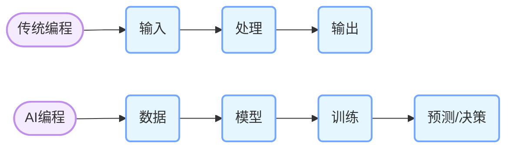

# 从传统编程到AI编程：程序员的进化史

> 关键词：传统编程、AI编程、程序员进化、编程范式转变、人工智能技术、机器学习、深度学习

> 摘要：本文深入探讨了程序员从传统编程到AI编程的进化历程。详细介绍了传统编程和AI编程的核心概念、技术原理、数学模型，通过实际项目案例展示了两者的实现方式与应用场景。同时，推荐了相关的学习资源、开发工具和论文著作，分析了未来发展趋势与挑战，并对常见问题进行了解答。旨在帮助程序员全面了解这一进化过程，更好地适应和引领编程领域的变革。

## 1. 背景介绍 
### 1.1 目的和范围
随着科技的飞速发展，人工智能（AI）已成为当今时代的核心技术之一，深刻地改变了编程领域的格局。本文的目的在于详细阐述程序员从传统编程向AI编程的进化过程，包括技术原理、实际应用以及未来发展趋势等方面。范围涵盖传统编程和AI编程的各个关键领域，如编程语言、算法、数学模型等，旨在为广大程序员和相关技术爱好者提供全面且深入的技术知识和发展脉络。

### 1.2 预期读者
本文预期读者包括广大程序员、计算机专业学生、对人工智能和编程技术感兴趣的技术爱好者以及相关领域的研究人员。无论您是初学者还是有一定经验的专业人士，都能从本文中获取有价值的信息和见解。

### 1.3 文档结构概述
本文将按照以下结构进行阐述：首先介绍传统编程和AI编程的核心概念与联系，包括其原理和架构；接着详细讲解核心算法原理和具体操作步骤，并用Python源代码进行示例；然后介绍相关的数学模型和公式，并举例说明；通过项目实战展示实际代码案例和详细解释；探讨实际应用场景；推荐相关的学习资源、开发工具和论文著作；最后总结未来发展趋势与挑战，解答常见问题，并提供扩展阅读和参考资料。

### 1.4 术语表
#### 1.4.1 核心术语定义
- **传统编程**：指基于明确的规则和逻辑，通过编写一系列指令来实现特定功能的编程方式。程序员需要精确地定义程序的输入、处理过程和输出。
- **AI编程**：利用人工智能技术，如机器学习、深度学习等，使程序能够从数据中学习并自动优化，实现更智能的功能。
- **机器学习**：让计算机通过数据和算法自动学习模式和规律，从而做出预测和决策的领域。
- **深度学习**：机器学习的一个分支，通过构建深度神经网络来学习数据的高级特征和表示。

#### 1.4.2 相关概念解释
- **编程范式**：指编程的基本风格和方法，如面向过程编程、面向对象编程、函数式编程等。传统编程通常采用这些经典的编程范式，而AI编程则在此基础上引入了新的范式，如基于数据驱动的编程。
- **数据驱动**：在AI编程中，程序的行为和性能主要由数据决定。通过大量的数据训练模型，使模型能够学习到数据中的模式和规律，从而实现智能决策。

#### 1.4.3 缩略词列表
- **AI**：Artificial Intelligence，人工智能
- **ML**：Machine Learning，机器学习
- **DL**：Deep Learning，深度学习
- **DNN**：Deep Neural Network，深度神经网络
- **CNN**：Convolutional Neural Network，卷积神经网络
- **RNN**：Recurrent Neural Network，循环神经网络

## 2. 核心概念与联系 

### 2.1 传统编程的核心概念
传统编程是基于人类预先定义的规则和逻辑来实现程序功能的。其基本原理是通过一系列的指令和控制结构，将输入数据转换为期望的输出。常见的编程范式包括面向过程编程、面向对象编程和函数式编程。

#### 2.1.1 面向过程编程
面向过程编程将程序看作是一系列的步骤和过程，通过函数来组织代码。每个函数完成一个特定的任务，程序的执行就是依次调用这些函数。例如，一个简单的计算两个数之和的程序可以用Python实现如下：
```python
def add_numbers(a, b):
    return a + b

result = add_numbers(3, 5)
print(result)
```
#### 2.1.2 面向对象编程
面向对象编程将数据和操作数据的方法封装在对象中，通过对象之间的交互来实现程序功能。对象是类的实例，类定义了对象的属性和方法。例如，一个简单的学生类可以用Python实现如下：
```python
class Student:
    def __init__(self, name, age):
        self.name = name
        self.age = age

    def display_info(self):
        print(f"Name: {self.name}, Age: {self.age}")

student = Student("John", 20)
student.display_info()
```
#### 2.1.3 函数式编程
函数式编程强调将计算看作是函数的求值，避免使用共享状态和可变数据。函数是一等公民，可以作为参数传递和返回。例如，一个简单的函数式编程示例是使用map函数对列表中的每个元素进行平方操作：
```python
numbers = [1, 2, 3, 4]
squared_numbers = list(map(lambda x: x**2, numbers))
print(squared_numbers)
```

### 2.2 AI编程的核心概念
AI编程主要基于机器学习和深度学习技术，让程序能够从数据中学习并自动优化。其核心是构建模型，通过训练数据来调整模型的参数，使其能够对未知数据进行准确的预测和决策。

#### 2.2.1 机器学习
机器学习包括监督学习、无监督学习和强化学习等多种类型。监督学习是通过已知的输入和输出数据来训练模型，使其能够对新的输入数据进行预测。例如，一个简单的线性回归模型可以用Python的Scikit-learn库实现如下：
```python
from sklearn.linear_model import LinearRegression
import numpy as np

# 生成一些示例数据
X = np.array([[1], [2], [3], [4]])
y = np.array([2, 4, 6, 8])

# 创建线性回归模型
model = LinearRegression()

# 训练模型
model.fit(X, y)

# 进行预测
new_X = np.array([[5]])
prediction = model.predict(new_X)
print(prediction)
```
#### 2.2.2 深度学习
深度学习是机器学习的一个分支，通过构建深度神经网络来学习数据的高级特征和表示。深度神经网络由多个神经元层组成，每个神经元对输入进行加权求和并通过激活函数进行非线性变换。例如，一个简单的全连接神经网络可以用Python的Keras库实现如下：
```python
from keras.models import Sequential
from keras.layers import Dense

# 创建一个简单的全连接神经网络模型
model = Sequential()
model.add(Dense(10, input_dim=1, activation='relu'))
model.add(Dense(1, activation='linear'))

# 编译模型
model.compile(loss='mean_squared_error', optimizer='adam')

# 训练模型
model.fit(X, y, epochs=100, batch_size=1)

# 进行预测
new_X = np.array([[5]])
prediction = model.predict(new_X)
print(prediction)
```

### 2.3 传统编程与AI编程的联系
传统编程和AI编程并不是相互独立的，而是相互补充的。传统编程为AI编程提供了基础的编程技术和工具，例如数据处理、算法实现等。而AI编程则为传统编程带来了新的思路和方法，例如自动化决策、智能推荐等。在实际应用中，往往需要将传统编程和AI编程结合起来，才能实现更复杂和智能的系统。

### 2.4 核心概念原理和架构的文本示意图
传统编程的架构主要由输入、处理和输出三个部分组成。程序员根据具体的需求编写代码，定义处理过程，将输入数据转换为输出结果。AI编程的架构则主要由数据、模型和训练三个部分组成。通过收集和预处理数据，构建合适的模型，并使用训练算法对模型进行训练，使其能够对未知数据进行准确的预测和决策。

### 2.5 Mermaid流程图


## 3. 核心算法原理 & 具体操作步骤 

### 3.1 传统编程的核心算法原理
传统编程中常见的算法包括排序算法、搜索算法、图算法等。下面以冒泡排序算法为例，详细讲解其原理和具体操作步骤。

#### 3.1.1 冒泡排序算法原理
冒泡排序是一种简单的排序算法，其基本思想是通过多次比较相邻元素的大小，将较大的元素逐步交换到数组的末尾。具体步骤如下：
1. 比较相邻的元素。如果第一个比第二个大，就把它们交换位置。
2. 对每一对相邻元素作同样的工作，从开始第一对到结尾的最后一对。这步做完后，最后的元素会是最大的数。
3. 针对所有的元素重复以上的步骤，除了最后一个。
4. 持续每次对越来越少的元素重复上面的步骤，直到没有任何一对数字需要比较。

#### 3.1.2 冒泡排序算法的Python实现
```python
def bubble_sort(arr):
    n = len(arr)
    for i in range(n):
        for j in range(0, n - i - 1):
            if arr[j] > arr[j + 1]:
                arr[j], arr[j + 1] = arr[j + 1], arr[j]
    return arr

# 测试冒泡排序算法
arr = [64, 34, 25, 12, 22, 11, 90]
sorted_arr = bubble_sort(arr)
print(sorted_arr)
```

### 3.2 AI编程的核心算法原理
AI编程中常见的算法包括线性回归、逻辑回归、决策树、神经网络等。下面以线性回归算法为例，详细讲解其原理和具体操作步骤。

#### 3.2.1 线性回归算法原理
线性回归是一种用于建立自变量和因变量之间线性关系的统计模型。其基本思想是通过最小化预测值和真实值之间的误差来确定最佳的回归系数。线性回归的模型可以表示为：
$$y = \theta_0 + \theta_1x_1 + \theta_2x_2 + \cdots + \theta_nx_n + \epsilon$$
其中，$y$ 是因变量，$x_1, x_2, \cdots, x_n$ 是自变量，$\theta_0, \theta_1, \cdots, \theta_n$ 是回归系数，$\epsilon$ 是误差项。

#### 3.2.2 线性回归算法的Python实现
```python
import numpy as np

# 生成一些示例数据
X = np.array([[1], [2], [3], [4]])
y = np.array([2, 4, 6, 8])

# 添加偏置项
X_b = np.c_[np.ones((X.shape[0], 1)), X]

# 使用正规方程求解回归系数
theta_best = np.linalg.inv(X_b.T.dot(X_b)).dot(X_b.T).dot(y)

# 进行预测
new_X = np.array([[5]])
new_X_b = np.c_[np.ones((new_X.shape[0], 1)), new_X]
prediction = new_X_b.dot(theta_best)
print(prediction)
```

### 3.3 具体操作步骤
#### 3.3.1 传统编程的操作步骤
1. **需求分析**：明确程序的功能和需求。
2. **设计算法**：根据需求设计合适的算法。
3. **编写代码**：使用编程语言实现算法。
4. **调试和测试**：检查代码的正确性和性能，进行必要的调试和优化。
5. **部署和维护**：将程序部署到生产环境，并进行后续的维护和更新。

#### 3.3.2 AI编程的操作步骤
1. **数据收集和预处理**：收集相关的数据，并进行清洗、转换和归一化等预处理操作。
2. **模型选择和构建**：根据问题的类型和数据的特点选择合适的模型，并构建模型的结构。
3. **模型训练**：使用训练数据对模型进行训练，调整模型的参数。
4. **模型评估**：使用测试数据对训练好的模型进行评估，检查模型的性能。
5. **模型优化**：根据评估结果对模型进行优化，例如调整模型的参数、增加数据等。
6. **部署和应用**：将训练好的模型部署到实际应用中，并进行实时预测和决策。

## 4. 数学模型和公式 & 详细讲解 & 举例说明 

### 4.1 传统编程中的数学模型和公式
传统编程中涉及到很多数学模型和公式，例如排序算法中的时间复杂度和空间复杂度分析。下面以冒泡排序算法为例，详细讲解其时间复杂度和空间复杂度。

#### 4.1.1 时间复杂度
冒泡排序的时间复杂度是 $O(n^2)$，其中 $n$ 是数组的长度。这是因为冒泡排序需要进行两层嵌套的循环，对于每个元素都需要比较和交换多次。具体分析如下：
- 外层循环需要执行 $n$ 次，每次外层循环会将一个最大的元素放到数组的末尾。
- 内层循环的次数会随着外层循环的进行而逐渐减少，第一次内层循环需要比较 $n - 1$ 次，第二次需要比较 $n - 2$ 次，以此类推，最后一次需要比较 1 次。
- 因此，总的比较次数为 $(n - 1) + (n - 2) + \cdots + 1 = \frac{n(n - 1)}{2}$，时间复杂度为 $O(n^2)$。

#### 4.1.2 空间复杂度
冒泡排序的空间复杂度是 $O(1)$，因为它只需要常数级的额外空间来存储临时变量。在排序过程中，只需要交换数组中的元素，不需要额外的数组或数据结构。

### 4.2 AI编程中的数学模型和公式
AI编程中涉及到很多数学模型和公式，例如线性回归中的最小二乘法、神经网络中的反向传播算法等。下面以线性回归为例，详细讲解其数学模型和公式。

#### 4.2.1 线性回归的数学模型
线性回归的数学模型可以表示为：
$$y = \theta_0 + \theta_1x_1 + \theta_2x_2 + \cdots + \theta_nx_n + \epsilon$$
其中，$y$ 是因变量，$x_1, x_2, \cdots, x_n$ 是自变量，$\theta_0, \theta_1, \cdots, \theta_n$ 是回归系数，$\epsilon$ 是误差项。

#### 4.2.2 最小二乘法
最小二乘法是一种用于求解线性回归模型中回归系数的方法。其基本思想是通过最小化预测值和真实值之间的误差平方和来确定最佳的回归系数。误差平方和可以表示为：
$$J(\theta) = \frac{1}{2m}\sum_{i = 1}^{m}(h_{\theta}(x^{(i)}) - y^{(i)})^2$$
其中，$m$ 是样本数量，$h_{\theta}(x^{(i)})$ 是第 $i$ 个样本的预测值，$y^{(i)}$ 是第 $i$ 个样本的真实值。

为了找到使 $J(\theta)$ 最小的 $\theta$，可以对 $J(\theta)$ 求偏导数，并令其等于 0。通过求解这些偏导数方程，可以得到回归系数的最优解。

#### 4.2.3 举例说明
假设有一组数据 $(x_1, y_1), (x_2, y_2), \cdots, (x_m, y_m)$，我们要使用线性回归模型来拟合这些数据。首先，我们可以将数据表示为矩阵形式：
$$X = \begin{bmatrix}
1 & x_1 \\
1 & x_2 \\
\vdots & \vdots \\
1 & x_m
\end{bmatrix},
y = \begin{bmatrix}
y_1 \\
y_2 \\
\vdots \\
y_m
\end{bmatrix}$$
然后，根据最小二乘法的公式，可以得到回归系数的最优解为：
$$\theta = (X^TX)^{-1}X^Ty$$
例如，对于数据 $X = \begin{bmatrix}
1 & 1 \\
1 & 2 \\
1 & 3 \\
1 & 4
\end{bmatrix},
y = \begin{bmatrix}
2 \\
4 \\
6 \\
8
\end{bmatrix}$，可以计算得到：
$$X^TX = \begin{bmatrix}
4 & 10 \\
10 & 30
\end{bmatrix},
(X^TX)^{-1} = \begin{bmatrix}
3 & -1 \\
-1 & 0.4
\end{bmatrix},
X^Ty = \begin{bmatrix}
20 \\
60
\end{bmatrix}$$
$$\theta = (X^TX)^{-1}X^Ty = \begin{bmatrix}
3 & -1 \\
-1 & 0.4
\end{bmatrix}\begin{bmatrix}
20 \\
60
\end{bmatrix} = \begin{bmatrix}
0 \\
4
\end{bmatrix}$$
因此，线性回归模型为 $y = 0 + 4x$。

## 5. 项目实战：代码实际案例和详细解释说明 

### 5.1  开发环境搭建
#### 5.1.1 传统编程开发环境搭建
对于传统编程，我们以Python为例，介绍开发环境的搭建步骤：
1. **安装Python**：从Python官方网站（https://www.python.org/downloads/）下载并安装Python。建议安装Python 3.x版本。
2. **安装集成开发环境（IDE）**：可以选择PyCharm、VS Code等IDE来进行Python开发。这些IDE提供了代码编辑、调试、运行等功能，方便开发和调试程序。
3. **安装必要的库和框架**：根据具体的项目需求，安装相应的库和框架。例如，如果需要进行数据处理和分析，可以安装NumPy、Pandas等库；如果需要进行可视化，可以安装Matplotlib、Seaborn等库。

#### 5.1.2 AI编程开发环境搭建
对于AI编程，我们以TensorFlow和Keras为例，介绍开发环境的搭建步骤：
1. **安装Python**：同样需要安装Python 3.x版本。
2. **安装TensorFlow和Keras**：可以使用pip命令来安装TensorFlow和Keras。在命令行中执行以下命令：
```sh
pip install tensorflow
pip install keras
```
3. **安装其他必要的库**：根据具体的项目需求，安装其他必要的库，例如NumPy、Pandas、Matplotlib等。

### 5.2  源代码详细实现和代码解读
#### 5.2.1 传统编程项目实战：简单的文件管理系统
下面是一个简单的文件管理系统的Python实现：
```python
import os

def list_files(directory):
    """列出指定目录下的所有文件和文件夹"""
    for root, dirs, files in os.walk(directory):
        for file in files:
            print(os.path.join(root, file))
        for dir in dirs:
            print(os.path.join(root, dir))

def create_file(file_path):
    """创建一个新文件"""
    try:
        with open(file_path, 'w') as file:
            file.write('This is a new file.')
        print(f'File {file_path} created successfully.')
    except Exception as e:
        print(f'Error creating file: {e}')

def delete_file(file_path):
    """删除指定文件"""
    try:
        os.remove(file_path)
        print(f'File {file_path} deleted successfully.')
    except Exception as e:
        print(f'Error deleting file: {e}')

if __name__ == '__main__':
    directory = '.'
    list_files(directory)

    new_file_path = 'test.txt'
    create_file(new_file_path)

    delete_file(new_file_path)
```
**代码解读**：
- `list_files` 函数使用 `os.walk` 遍历指定目录下的所有文件和文件夹，并打印出它们的路径。
- `create_file` 函数使用 `open` 函数以写入模式创建一个新文件，并写入一些内容。
- `delete_file` 函数使用 `os.remove` 函数删除指定的文件。

#### 5.2.2 AI编程项目实战：手写数字识别
下面是一个使用Keras实现的手写数字识别项目的Python代码：
```python
from keras.datasets import mnist
from keras.models import Sequential
from keras.layers import Dense, Flatten
from keras.utils import to_categorical

# 加载MNIST数据集
(train_images, train_labels), (test_images, test_labels) = mnist.load_data()

# 数据预处理
train_images = train_images.reshape((60000, 28 * 28))
train_images = train_images.astype('float32') / 255

test_images = test_images.reshape((10000, 28 * 28))
test_images = test_images.astype('float32') / 255

train_labels = to_categorical(train_labels)
test_labels = to_categorical(test_labels)

# 构建模型
model = Sequential()
model.add(Dense(512, activation='relu', input_shape=(28 * 28,)))
model.add(Dense(10, activation='softmax'))

# 编译模型
model.compile(optimizer='rmsprop',
              loss='categorical_crossentropy',
              metrics=['accuracy'])

# 训练模型
model.fit(train_images, train_labels, epochs=5, batch_size=128)

# 评估模型
test_loss, test_acc = model.evaluate(test_images, test_labels)
print(f'Test accuracy: {test_acc}')
```
**代码解读**：
- **数据加载**：使用 `mnist.load_data` 函数加载MNIST手写数字数据集。
- **数据预处理**：将图像数据从二维数组转换为一维数组，并将像素值归一化到0到1之间。同时，将标签数据进行one-hot编码。
- **模型构建**：使用 `Sequential` 模型构建一个简单的全连接神经网络，包含一个隐藏层和一个输出层。
- **模型编译**：使用 `rmsprop` 优化器和 `categorical_crossentropy` 损失函数来编译模型。
- **模型训练**：使用 `fit` 函数对模型进行训练，指定训练的轮数和批次大小。
- **模型评估**：使用 `evaluate` 函数对训练好的模型进行评估，计算测试集上的损失和准确率。

### 5.3  代码解读与分析
#### 5.3.1 传统编程代码分析
传统编程的代码通常具有明确的逻辑和步骤，通过一系列的指令来实现特定的功能。在文件管理系统的代码中，我们可以看到每个函数都有明确的功能，通过调用这些函数可以完成文件的列出、创建和删除等操作。代码的可读性和可维护性较高，易于理解和修改。

#### 5.3.2 AI编程代码分析
AI编程的代码主要围绕数据处理、模型构建、训练和评估等步骤展开。在手写数字识别的代码中，我们可以看到首先进行数据的加载和预处理，然后构建模型，编译模型，训练模型，最后评估模型。代码的重点在于模型的设计和训练过程，需要对机器学习和深度学习的原理有一定的了解。

## 6. 实际应用场景 
### 6.1 传统编程的实际应用场景
#### 6.1.1 系统软件开发
传统编程在系统软件开发中起着重要的作用，例如操作系统、数据库管理系统等。这些系统软件需要高效、稳定地运行，对性能和安全性要求较高。传统编程可以通过优化算法和代码结构来满足这些需求。

#### 6.1.2 嵌入式系统开发
嵌入式系统是指嵌入到其他设备中的计算机系统，例如智能手机、智能家居设备等。传统编程可以用于开发嵌入式系统的驱动程序、应用程序等，实现设备的各种功能。

#### 6.1.3 企业级应用开发
企业级应用开发包括企业资源规划（ERP）、客户关系管理（CRM）等系统的开发。这些系统通常需要处理大量的数据和复杂的业务逻辑，传统编程可以通过面向对象编程和数据库技术来实现这些功能。

### 6.2 AI编程的实际应用场景
#### 6.2.1 图像识别
AI编程在图像识别领域有着广泛的应用，例如人脸识别、物体检测、图像分类等。通过深度学习技术，可以构建高效准确的图像识别模型，实现对图像的自动分析和理解。

#### 6.2.2 自然语言处理
自然语言处理是AI编程的另一个重要应用领域，例如机器翻译、语音识别、文本分类等。通过深度学习技术，可以构建能够理解和处理自然语言的模型，实现人与计算机之间的自然交互。

#### 6.2.3 推荐系统
推荐系统是电商、社交等平台常用的技术，通过AI编程可以根据用户的历史行为和偏好，为用户推荐个性化的商品、内容等。深度学习技术可以帮助推荐系统更好地理解用户的需求和行为，提高推荐的准确性和效果。

## 7. 工具和资源推荐
### 7.1 学习资源推荐
#### 7.1.1 书籍推荐
- 《Python编程：从入门到实践》：适合Python初学者，介绍了Python的基本语法和常用库的使用。
- 《机器学习》（周志华著）：全面介绍了机器学习的基本概念、算法和应用，是机器学习领域的经典教材。
- 《深度学习》（Ian Goodfellow等著）：深度学习领域的权威著作，介绍了深度学习的基本原理、模型和应用。

#### 7.1.2 在线课程
- Coursera上的“机器学习”课程（Andrew Ng教授主讲）：是机器学习领域的经典在线课程，介绍了机器学习的基本概念、算法和应用。
- edX上的“深度学习”课程：由深度学习领域的专家授课，介绍了深度学习的基本原理、模型和应用。
- 中国大学MOOC上的“Python语言程序设计”课程：适合Python初学者，介绍了Python的基本语法和常用库的使用。

#### 7.1.3 技术博客和网站
- Medium：是一个技术博客平台，上面有很多关于编程、人工智能等领域的优质文章。
- 博客园：是国内的一个技术博客平台，有很多程序员分享自己的技术经验和心得。
- 开源中国：是国内的一个开源技术社区，提供了很多开源项目和技术文章。

### 7.2 开发工具框架推荐
#### 7.2.1 IDE和编辑器
- PyCharm：是一款专业的Python集成开发环境，提供了代码编辑、调试、运行等功能，适合Python开发。
- VS Code：是一款轻量级的代码编辑器，支持多种编程语言，通过安装插件可以扩展其功能，适合快速开发和调试。
- Jupyter Notebook：是一个交互式的开发环境，适合数据探索、模型训练和可视化等工作。

#### 7.2.2 调试和性能分析工具
- PDB：是Python自带的调试工具，可以帮助程序员定位和解决代码中的问题。
- TensorBoard：是TensorFlow提供的可视化工具，可以帮助程序员监控模型的训练过程和性能。
- Pyflame：是一个Python性能分析工具，可以帮助程序员找出代码中的性能瓶颈。

#### 7.2.3 相关框架和库
- NumPy：是Python中用于科学计算的基础库，提供了高效的数组操作和数学函数。
- Pandas：是Python中用于数据处理和分析的库，提供了高效的数据结构和数据操作方法。
- Scikit-learn：是Python中用于机器学习的库，提供了多种机器学习算法和工具。
- TensorFlow：是Google开发的深度学习框架，提供了高效的模型训练和部署功能。
- Keras：是一个高级神经网络API，基于TensorFlow等后端实现，适合快速构建和训练深度学习模型。

### 7.3 相关论文著作推荐
#### 7.3.1 经典论文
- “Gradient-Based Learning Applied to Document Recognition”（Yann LeCun等著）：介绍了卷积神经网络（CNN）在手写数字识别中的应用，是深度学习领域的经典论文。
- “Long Short-Term Memory”（Sepp Hochreiter和Jürgen Schmidhuber著）：介绍了长短期记忆网络（LSTM）的原理和应用，是循环神经网络（RNN）领域的经典论文。
- “Attention Is All You Need”（Ashish Vaswani等著）：介绍了Transformer模型的原理和应用，是自然语言处理领域的重要论文。

#### 7.3.2 最新研究成果
- arXiv：是一个预印本服务器，上面有很多关于人工智能、机器学习等领域的最新研究成果。
- NeurIPS、ICML、CVPR等学术会议：是人工智能、机器学习等领域的顶级学术会议，每年都会发布很多最新的研究成果。

#### 7.3.3 应用案例分析
- Kaggle：是一个数据科学竞赛平台，上面有很多关于机器学习、深度学习等领域的应用案例和解决方案。
- GitHub：是一个开源代码托管平台，上面有很多关于人工智能、机器学习等领域的开源项目和应用案例。

## 8. 总结：未来发展趋势与挑战
### 8.1 未来发展趋势
#### 8.1.1 融合发展
传统编程和AI编程将进一步融合，形成更加智能和高效的编程方式。例如，在传统的软件系统中引入AI技术，实现自动化决策和智能推荐；在AI编程中使用传统编程的技术和工具，提高模型的性能和效率。

#### 8.1.2 低代码/无代码编程
随着AI技术的发展，低代码/无代码编程将越来越普及。通过可视化的界面和自动化的工具，非专业程序员也可以轻松地开发出复杂的应用程序。这将大大降低编程的门槛，促进编程技术的普及和应用。

#### 8.1.3 量子计算与AI结合
量子计算具有强大的计算能力，将为AI编程带来新的机遇。量子计算与AI的结合将能够解决一些传统计算机难以处理的复杂问题，例如大规模数据的处理和优化、复杂模型的训练等。

### 8.2 挑战
#### 8.2.1 数据隐私和安全
AI编程需要大量的数据来训练模型，而这些数据往往包含用户的个人信息和敏感信息。因此，数据隐私和安全成为了AI编程面临的重要挑战。需要加强数据保护和安全技术的研究和应用，确保用户数据的安全和隐私。

#### 8.2.2 模型可解释性
深度学习模型通常是黑盒模型，其决策过程和结果难以解释。这在一些关键领域，例如医疗、金融等，可能会带来风险。因此，提高模型的可解释性成为了AI编程面临的重要挑战。需要研究和开发新的技术和方法，使模型的决策过程和结果能够被人类理解和信任。

#### 8.2.3 人才短缺
随着AI技术的快速发展，对AI编程人才的需求也越来越大。然而，目前AI编程领域的人才短缺问题仍然比较严重。需要加强教育和培训，培养更多的AI编程人才，满足市场的需求。

## 9. 附录：常见问题与解答
### 9.1 传统编程和AI编程有什么区别？
传统编程是基于明确的规则和逻辑，通过编写一系列指令来实现特定功能的编程方式。而AI编程则是利用人工智能技术，如机器学习、深度学习等，使程序能够从数据中学习并自动优化，实现更智能的功能。传统编程需要程序员精确地定义程序的输入、处理过程和输出，而AI编程则更注重数据的收集和模型的训练。

### 9.2 学习AI编程需要具备哪些基础知识？
学习AI编程需要具备一定的数学基础，包括线性代数、概率论、统计学等。同时，还需要掌握一门编程语言，如Python。此外，了解机器学习和深度学习的基本概念和算法也是必要的。

### 9.3 如何选择合适的AI模型？
选择合适的AI模型需要考虑多个因素，如问题的类型、数据的特点、模型的复杂度和性能等。一般来说，可以先尝试一些简单的模型，如线性回归、逻辑回归等，然后根据模型的性能和需求逐步调整和优化模型。也可以参考相关的文献和案例，了解不同模型在不同场景下的应用效果。

### 9.4 AI编程的发展前景如何？
AI编程的发展前景非常广阔。随着人工智能技术的不断发展和应用，AI编程将在各个领域发挥越来越重要的作用。例如，在医疗、金融、交通、教育等领域，AI编程可以帮助人们解决复杂的问题，提高工作效率和质量。同时，AI编程也将带来新的就业机会和发展空间。

## 10. 扩展阅读 & 参考资料
### 10.1 扩展阅读
- 《人工智能时代》（李开复、王咏刚著）：介绍了人工智能的发展历程、现状和未来趋势，以及人工智能对社会和人类的影响。
- 《智能时代》（吴军著）：探讨了智能时代的特点和发展趋势，以及如何在智能时代中学习、工作和生活。
- 《深度学习实战》（Antoine Géron著）：通过实际案例介绍了深度学习的应用和实践，适合有一定基础的读者学习。

### 10.2 参考资料
- Python官方文档（https://docs.python.org/）
- TensorFlow官方文档（https://www.tensorflow.org/）
- Keras官方文档（https://keras.io/）
- Scikit-learn官方文档（https://scikit-learn.org/）