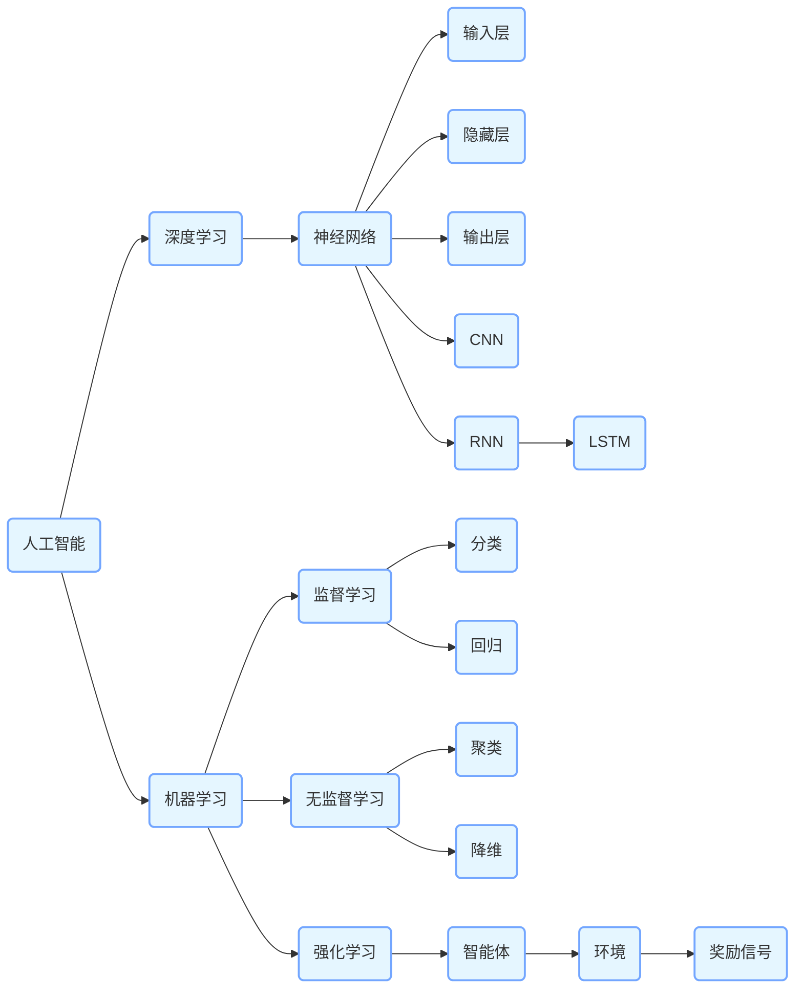

# 从开发者到AI专家：编程职业的转型

> 关键词：开发者、AI专家、编程职业转型、人工智能、机器学习、深度学习、职业发展

> 摘要：本文聚焦于编程职业从开发者向AI专家的转型这一关键话题。在人工智能快速发展的当下，这一转型不仅是个人职业发展的重要选择，也顺应了行业变革的趋势。文章首先介绍转型的背景，包括目的、预期读者、文档结构和相关术语。接着阐述人工智能领域的核心概念与联系，通过文本示意图和Mermaid流程图呈现其架构。详细讲解核心算法原理，结合Python源代码进行说明，同时给出相关数学模型和公式并举例。通过项目实战展示具体的代码实现与解读，探讨实际应用场景。推荐学习、开发工具和相关论文著作等资源，最后总结未来发展趋势与挑战，解答常见问题并提供扩展阅读与参考资料，为开发者实现向AI专家的转型提供全面而深入的指导。

## 1. 背景介绍 
### 1.1 目的和范围
在当今科技飞速发展的时代，人工智能（AI）已经成为推动各个行业变革的核心力量。从开发者向AI专家的转型，是许多程序员在职业发展过程中面临的重要机遇和挑战。本文的目的在于为有转型意愿的开发者提供全面、深入且具有可操作性的指导，帮助他们了解转型的必要性、掌握关键的知识和技能、明确转型的路径和方法。范围涵盖人工智能领域的核心概念、算法原理、数学模型、项目实战、应用场景、学习资源以及未来发展趋势等多个方面，旨在为开发者的转型之旅搭建一个系统而完整的知识框架。

### 1.2 预期读者
本文主要面向有一定编程基础，希望在职业发展中迈向人工智能领域，成为AI专家的开发者。无论是从事前端开发、后端开发、移动开发还是其他编程领域的专业人士，只要对人工智能充满热情并渴望转型，都能从本文中获得有价值的信息和指导。同时，对于对人工智能行业感兴趣，希望了解开发者转型过程和相关知识的人士，本文也具有一定的参考价值。

### 1.3 文档结构概述
本文将按照以下结构展开：首先介绍转型的背景信息，包括目的、读者群体、文档结构和术语表。接着深入探讨人工智能的核心概念与联系，通过文本示意图和Mermaid流程图清晰呈现其架构。然后详细讲解核心算法原理，结合Python源代码进行具体阐述，并给出相关数学模型和公式及举例。通过项目实战部分展示代码实现和解读，分析实际应用场景。推荐学习、开发工具和相关论文著作等资源，最后总结未来发展趋势与挑战，解答常见问题并提供扩展阅读与参考资料，为开发者的转型提供全方位的支持。

### 1.4 术语表
#### 1.4.1 核心术语定义
- **开发者**：具备一定编程技能，能够使用编程语言进行软件、应用程序或系统开发的专业人员。
- **AI专家**：在人工智能领域具有深入的专业知识和丰富的实践经验，能够独立开展人工智能相关项目的设计、开发和优化工作的高级专业人才。
- **人工智能（AI）**：研究、开发用于模拟、延伸和扩展人的智能的理论、方法、技术及应用系统的一门新的技术科学。
- **机器学习（ML）**：人工智能的一个分支领域，它致力于研究如何通过数据和算法让计算机自动学习和改进，从而实现特定任务的能力提升。
- **深度学习（DL）**：机器学习的一个子领域，基于人工神经网络，通过构建具有多个层次的神经网络模型，自动从大量数据中学习复杂的模式和特征。

#### 1.4.2 相关概念解释
- **监督学习**：一种机器学习方法，在这种方法中，模型通过学习输入数据和对应的标签（已知的输出）之间的关系来进行训练，以预测新数据的标签。
- **无监督学习**：与监督学习不同，无监督学习的训练数据没有对应的标签，模型的任务是从数据中发现潜在的结构、模式或规律。
- **强化学习**：智能体（agent）通过与环境进行交互，根据环境反馈的奖励信号来学习最优的行为策略，以最大化长期累积奖励。
- **神经网络**：一种模仿人类神经系统的计算模型，由大量的神经元（节点）组成，通过层与层之间的连接和权重调整来实现对数据的处理和学习。

#### 1.4.3 缩略词列表
- **AI**：Artificial Intelligence（人工智能）
- **ML**：Machine Learning（机器学习）
- **DL**：Deep Learning（深度学习）
- **CNN**：Convolutional Neural Network（卷积神经网络）
- **RNN**：Recurrent Neural Network（循环神经网络）
- **LSTM**：Long Short - Term Memory（长短期记忆网络）

## 2. 核心概念与联系 

### 核心概念原理和架构的文本示意图
人工智能是一个庞大而复杂的领域，其核心概念主要围绕机器学习和深度学习展开。机器学习是人工智能的基础，它通过数据驱动的方式让计算机从数据中学习规律和模式。深度学习则是机器学习的高级形式，它借助深度神经网络，能够自动从大量数据中提取复杂的特征，从而实现更强大的智能任务。

在机器学习中，主要有监督学习、无监督学习和强化学习三种方法。监督学习通过有标签的数据进行训练，常见的任务包括分类和回归；无监督学习处理无标签的数据，用于聚类、降维等任务；强化学习则通过智能体与环境的交互来学习最优策略。

深度学习中的神经网络是其核心组件，它由输入层、隐藏层和输出层组成。不同类型的神经网络适用于不同的任务，例如卷积神经网络（CNN）在图像识别领域表现出色，循环神经网络（RNN）及其变体（如LSTM）在处理序列数据（如文本、时间序列）方面具有优势。

### Mermaid流程图


这个流程图展示了人工智能领域核心概念之间的关系。人工智能包含机器学习和深度学习两个主要分支，机器学习又分为监督学习、无监督学习和强化学习三种方法，深度学习的核心是神经网络，神经网络有不同的类型和层次结构，同时监督学习、无监督学习和强化学习各自有对应的常见任务。

## 3. 核心算法原理 & 具体操作步骤 

### 监督学习 - 线性回归算法原理及Python实现
线性回归是一种简单而常用的监督学习算法，用于预测连续值的输出。其基本原理是通过找到一条最佳的直线（在多维空间中是超平面），使得数据点到该直线的误差平方和最小。

#### 算法原理
假设我们有一组输入特征 $X = [x_1, x_2, ..., x_n]$ 和对应的输出值 $y$，线性回归模型的预测值 $\hat{y}$ 可以表示为：

$\hat{y} = \theta_0 + \theta_1x_1 + \theta_2x_2 + ... + \theta_nx_n$

其中 $\theta_0, \theta_1, ..., \theta_n$ 是模型的参数。我们的目标是找到一组最优的参数 $\theta$，使得预测值 $\hat{y}$ 与真实值 $y$ 之间的误差最小。常用的误差度量是均方误差（MSE）：

$MSE = \frac{1}{m} \sum_{i=1}^{m} (y^{(i)} - \hat{y}^{(i)})^2$

其中 $m$ 是样本数量，$y^{(i)}$ 是第 $i$ 个样本的真实值，$\hat{y}^{(i)}$ 是第 $i$ 个样本的预测值。

#### Python源代码实现
```python
import numpy as np

class LinearRegression:
    def __init__(self):
        self.theta = None

    def fit(self, X, y):
        # 在X矩阵前添加一列全为1的列，用于表示截距项
        X_b = np.c_[np.ones((X.shape[0], 1)), X]
        # 使用正规方程求解参数theta
        self.theta = np.linalg.inv(X_b.T.dot(X_b)).dot(X_b.T).dot(y)

    def predict(self, X):
        X_b = np.c_[np.ones((X.shape[0], 1)), X]
        return X_b.dot(self.theta)

# 示例数据
X = np.array([[1], [2], [3], [4], [5]])
y = np.array([2, 4, 6, 8, 10])

# 创建线性回归模型实例
model = LinearRegression()
# 训练模型
model.fit(X, y)
# 预测新数据
new_X = np.array([[6]])
prediction = model.predict(new_X)
print("预测值:", prediction)
```

#### 具体操作步骤
1. **数据准备**：将输入特征 $X$ 和对应的输出值 $y$ 准备好，确保数据的格式正确。
2. **添加截距项**：在输入特征矩阵 $X$ 前添加一列全为1的列，用于表示截距项 $\theta_0$。
3. **求解参数**：使用正规方程求解最优的参数 $\theta$，即 $\theta = (X^T X)^{-1} X^T y$。
4. **预测新数据**：对于新的输入特征 $X_{new}$，同样添加截距项，然后使用求解得到的参数 $\theta$ 进行预测，即 $\hat{y}_{new} = X_{new}^T \theta$。

### 无监督学习 - K - 均值聚类算法原理及Python实现
K - 均值聚类是一种常用的无监督学习算法，用于将数据点划分为 $K$ 个不同的簇。

#### 算法原理
K - 均值聚类的目标是将 $n$ 个数据点划分为 $K$ 个簇，使得簇内的数据点相似度高，簇间的数据点相似度低。算法的基本步骤如下：
1. **初始化**：随机选择 $K$ 个数据点作为初始的簇中心。
2. **分配数据点**：将每个数据点分配到距离最近的簇中心所在的簇。
3. **更新簇中心**：计算每个簇内数据点的均值，将其作为新的簇中心。
4. **重复步骤2和3**：直到簇中心不再发生变化或达到最大迭代次数。

#### Python源代码实现
```python
import numpy as np

class KMeans:
    def __init__(self, n_clusters=2, max_iter=100):
        self.n_clusters = n_clusters
        self.max_iter = max_iter
        self.centroids = None

    def fit(self, X):
        # 随机初始化簇中心
        idx = np.random.choice(len(X), self.n_clusters, replace=False)
        self.centroids = X[idx]

        for _ in range(self.max_iter):
            # 分配数据点到最近的簇中心
            labels = self._assign_labels(X)
            # 更新簇中心
            new_centroids = self._update_centroids(X, labels)

            # 判断簇中心是否不再变化
            if np.allclose(new_centroids, self.centroids):
                break

            self.centroids = new_centroids

    def _assign_labels(self, X):
        distances = np.array([np.linalg.norm(X - centroid, axis=1) for centroid in self.centroids])
        return np.argmin(distances, axis=0)

    def _update_centroids(self, X, labels):
        centroids = np.zeros((self.n_clusters, X.shape[1]))
        for k in range(self.n_clusters):
            cluster_points = X[labels == k]
            if len(cluster_points) > 0:
                centroids[k] = np.mean(cluster_points, axis=0)
        return centroids

    def predict(self, X):
        return self._assign_labels(X)

# 示例数据
X = np.array([[1, 2], [1, 4], [1, 0], [4, 2], [4, 4], [4, 0]])

# 创建K - 均值聚类模型实例
model = KMeans(n_clusters=2)
# 训练模型
model.fit(X)
# 预测数据点所属的簇
labels = model.predict(X)
print("数据点所属的簇标签:", labels)
```

#### 具体操作步骤
1. **初始化簇中心**：随机选择 $K$ 个数据点作为初始的簇中心。
2. **分配数据点**：计算每个数据点到所有簇中心的距离，将其分配到距离最近的簇中心所在的簇。
3. **更新簇中心**：对于每个簇，计算簇内所有数据点的均值，将其作为新的簇中心。
4. **重复步骤2和3**：不断迭代，直到簇中心不再发生变化或达到最大迭代次数。
5. **预测**：对于新的数据点，计算其到各个簇中心的距离，将其分配到距离最近的簇。

### 强化学习 - Q - 学习算法原理及Python实现
Q - 学习是一种基于值函数的强化学习算法，用于学习最优的行为策略。

#### 算法原理
在强化学习中，智能体与环境进行交互，环境会根据智能体的动作返回一个奖励信号。Q - 学习的目标是学习一个Q值函数 $Q(s, a)$，表示在状态 $s$ 下采取动作 $a$ 的预期累积奖励。Q值函数的更新公式为：

$Q(s_t, a_t) \leftarrow Q(s_t, a_t) + \alpha [r_{t+1} + \gamma \max_{a} Q(s_{t+1}, a) - Q(s_t, a_t)]$

其中 $s_t$ 是当前状态，$a_t$ 是当前动作，$r_{t+1}$ 是执行动作 $a_t$ 后获得的奖励，$s_{t+1}$ 是下一个状态，$\alpha$ 是学习率，$\gamma$ 是折扣因子。

#### Python源代码实现
```python
import numpy as np

class QLearningAgent:
    def __init__(self, state_size, action_size, learning_rate=0.1, discount_factor=0.9):
        self.state_size = state_size
        self.action_size = action_size
        self.learning_rate = learning_rate
        self.discount_factor = discount_factor
        self.q_table = np.zeros((state_size, action_size))

    def act(self, state):
        # 选择具有最大Q值的动作
        action = np.argmax(self.q_table[state, :])
        return action

    def update(self, state, action, reward, next_state):
        # 根据Q - 学习更新公式更新Q值
        target = reward + self.discount_factor * np.max(self.q_table[next_state, :])
        self.q_table[state, action] += self.learning_rate * (target - self.q_table[state, action])

# 示例环境
state_size = 5
action_size = 3
agent = QLearningAgent(state_size, action_size)

# 模拟交互过程
state = 0
for _ in range(10):
    action = agent.act(state)
    # 假设环境返回的奖励和下一个状态
    reward = np.random.randint(0, 10)
    next_state = np.random.randint(0, state_size)
    agent.update(state, action, reward, next_state)
    state = next_state

print("Q表:", agent.q_table)
```

#### 具体操作步骤
1. **初始化Q表**：创建一个大小为 $state\_size \times action\_size$ 的Q表，初始值都设为0。
2. **选择动作**：在当前状态 $s_t$ 下，选择具有最大Q值的动作 $a_t$。
3. **执行动作并获取奖励和下一个状态**：执行动作 $a_t$，环境返回奖励 $r_{t+1}$ 和下一个状态 $s_{t+1}$。
4. **更新Q值**：根据Q - 学习更新公式更新Q表中 $Q(s_t, a_t)$ 的值。
5. **重复步骤2 - 4**：不断与环境进行交互，更新Q表，直到达到终止条件。

## 4. 数学模型和公式 & 详细讲解 & 举例说明 

### 线性回归的数学模型和公式
#### 数学模型
线性回归的数学模型可以表示为：

$y = \theta_0 + \theta_1x_1 + \theta_2x_2 + ... + \theta_nx_n + \epsilon$

其中 $y$ 是输出值，$x_1, x_2, ..., x_n$ 是输入特征，$\theta_0, \theta_1, ..., \theta_n$ 是模型的参数，$\epsilon$ 是误差项，通常假设 $\epsilon$ 服从均值为0，方差为 $\sigma^2$ 的正态分布。

#### 正规方程
在求解线性回归的参数 $\theta$ 时，我们可以使用正规方程：

$\theta = (X^T X)^{-1} X^T y$

其中 $X$ 是输入特征矩阵，$y$ 是输出值向量。

#### 举例说明
假设有一个简单的线性回归问题，输入特征 $X = [1, 2, 3]$，对应的输出值 $y = [2, 4, 6]$。我们可以将 $X$ 表示为矩阵形式：

$X = \begin{bmatrix} 1 \\ 2 \\ 3 \end{bmatrix}$

在 $X$ 前添加一列全为1的列，得到：

$X_b = \begin{bmatrix} 1 & 1 \\ 1 & 2 \\ 1 & 3 \end{bmatrix}$

$y = \begin{bmatrix} 2 \\ 4 \\ 6 \end{bmatrix}$

根据正规方程计算 $\theta$：

$X_b^T = \begin{bmatrix} 1 & 1 & 1 \\ 1 & 2 & 3 \end{bmatrix}$

$X_b^T X_b = \begin{bmatrix} 1 & 1 & 1 \\ 1 & 2 & 3 \end{bmatrix} \begin{bmatrix} 1 & 1 \\ 1 & 2 \\ 1 & 3 \end{bmatrix} = \begin{bmatrix} 3 & 6 \\ 6 & 14 \end{bmatrix}$

$(X_b^T X_b)^{-1} = \frac{1}{3 \times 14 - 6 \times 6} \begin{bmatrix} 14 & -6 \\ -6 & 3 \end{bmatrix} = \begin{bmatrix} \frac{7}{3} & -1 \\ -1 & \frac{1}{2} \end{bmatrix}$

$X_b^T y = \begin{bmatrix} 1 & 1 & 1 \\ 1 & 2 & 3 \end{bmatrix} \begin{bmatrix} 2 \\ 4 \\ 6 \end{bmatrix} = \begin{bmatrix} 12 \\ 28 \end{bmatrix}$

$\theta = (X_b^T X_b)^{-1} X_b^T y = \begin{bmatrix} \frac{7}{3} & -1 \\ -1 & \frac{1}{2} \end{bmatrix} \begin{bmatrix} 12 \\ 28 \end{bmatrix} = \begin{bmatrix} 0 \\ 2 \end{bmatrix}$

所以，线性回归模型为 $y = 0 + 2x$。

### K - 均值聚类的数学模型和公式
#### 目标函数
K - 均值聚类的目标是最小化每个数据点到其所属簇中心的距离之和，即：

$J = \sum_{k=1}^{K} \sum_{x_i \in C_k} \| x_i - \mu_k \|^2$

其中 $K$ 是簇的数量，$C_k$ 是第 $k$ 个簇，$\mu_k$ 是第 $k$ 个簇的中心，$x_i$ 是数据点。

#### 距离度量
常用的距离度量是欧几里得距离：

$d(x_i, \mu_k) = \| x_i - \mu_k \| = \sqrt{\sum_{j=1}^{n} (x_{ij} - \mu_{kj})^2}$

其中 $x_{ij}$ 是数据点 $x_i$ 的第 $j$ 个特征，$\mu_{kj}$ 是簇中心 $\mu_k$ 的第 $j$ 个特征。

#### 举例说明
假设有三个数据点 $x_1 = [1, 2]$，$x_2 = [4, 5]$，$x_3 = [7, 8]$，要将其划分为2个簇。

随机初始化簇中心 $\mu_1 = [1, 2]$，$\mu_2 = [4, 5]$。

计算每个数据点到簇中心的距离：

$d(x_1, \mu_1) = \| [1, 2] - [1, 2] \| = 0$

$d(x_1, \mu_2) = \| [1, 2] - [4, 5] \| = \sqrt{(1 - 4)^2 + (2 - 5)^2} = \sqrt{9 + 9} = 3\sqrt{2}$

所以 $x_1$ 属于簇1。

$d(x_2, \mu_1) = \| [4, 5] - [1, 2] \| = 3\sqrt{2}$

$d(x_2, \mu_2) = \| [4, 5] - [4, 5] \| = 0$

所以 $x_2$ 属于簇2。

$d(x_3, \mu_1) = \| [7, 8] - [1, 2] \| = \sqrt{(7 - 1)^2 + (8 - 2)^2} = \sqrt{36 + 36} = 6\sqrt{2}$

$d(x_3, \mu_2) = \| [7, 8] - [4, 5] \| = \sqrt{(7 - 4)^2 + (8 - 5)^2} = \sqrt{9 + 9} = 3\sqrt{2}$

所以 $x_3$ 属于簇2。

更新簇中心：

簇1：$\mu_1 = [1, 2]$

簇2：$\mu_2 = \frac{[4, 5] + [7, 8]}{2} = [\frac{11}{2}, \frac{13}{2}]$

重复上述步骤，直到簇中心不再变化。

### Q - 学习的数学模型和公式
#### Q值更新公式
Q - 学习的Q值更新公式为：

$Q(s_t, a_t) \leftarrow Q(s_t, a_t) + \alpha [r_{t+1} + \gamma \max_{a} Q(s_{t+1}, a) - Q(s_t, a_t)]$

其中：
- $Q(s_t, a_t)$ 是当前状态 $s_t$ 下采取动作 $a_t$ 的Q值。
- $\alpha$ 是学习率，控制每次更新的步长。
- $r_{t+1}$ 是执行动作 $a_t$ 后获得的奖励。
- $\gamma$ 是折扣因子，取值范围为 $[0, 1]$，表示未来奖励的重要程度。
- $\max_{a} Q(s_{t+1}, a)$ 是下一个状态 $s_{t+1}$ 下所有可能动作中最大的Q值。

#### 举例说明
假设一个简单的强化学习环境，有3个状态 $s_1, s_2, s_3$ 和2个动作 $a_1, a_2$。初始Q表如下：

| 状态 | $a_1$ | $a_2$ |
|------|-------|-------|
| $s_1$ | 0 | 0 |
| $s_2$ | 0 | 0 |
| $s_3$ | 0 | 0 |

当前状态 $s_t = s_1$，选择动作 $a_t = a_1$，执行动作后获得奖励 $r_{t+1} = 5$，下一个状态 $s_{t+1} = s_2$。假设学习率 $\alpha = 0.1$，折扣因子 $\gamma = 0.9$。

下一个状态 $s_2$ 下，$\max_{a} Q(s_2, a) = 0$（因为Q表初始值都为0）。

根据Q值更新公式：

$Q(s_1, a_1) = Q(s_1, a_1) + \alpha [r_{t+1} + \gamma \max_{a} Q(s_2, a) - Q(s_1, a_1)]$

$Q(s_1, a_1) = 0 + 0.1 [5 + 0.9 \times 0 - 0] = 0.5$

更新后的Q表如下：

| 状态 | $a_1$ | $a_2$ |
|------|-------|-------|
| $s_1$ | 0.5 | 0 |
| $s_2$ | 0 | 0 |
| $s_3$ | 0 | 0 |

## 5. 项目实战：代码实际案例和详细解释说明 

### 5.1  开发环境搭建
#### 操作系统
可以选择Windows、Linux（如Ubuntu）或macOS等常见的操作系统。不同的操作系统在安装和配置开发环境时可能会有一些细微的差异，但基本步骤是相似的。

#### Python环境
推荐使用Python 3.7及以上版本。可以从Python官方网站（https://www.python.org/downloads/） 下载并安装Python。安装完成后，建议使用虚拟环境来管理项目的依赖，避免不同项目之间的依赖冲突。可以使用`venv`或`conda`来创建虚拟环境。

使用`venv`创建虚拟环境的示例命令：

```sh
python -m venv myenv
source myenv/bin/activate  # 在Linux或macOS上
myenv\Scripts\activate  # 在Windows上
```

#### 安装必要的库
在虚拟环境中安装人工智能开发常用的库，如`numpy`、`pandas`、`scikit - learn`、`tensorflow`或`pytorch`等。可以使用`pip`来安装这些库。

```sh
pip install numpy pandas scikit-learn tensorflow
```

### 5.2  源代码详细实现和代码解读
#### 项目背景
我们将实现一个简单的手写数字识别项目，使用经典的MNIST数据集。MNIST数据集包含60000个训练样本和10000个测试样本，每个样本是一个28x28像素的手写数字图像，标签是0 - 9的数字。

#### 代码实现
```python
import tensorflow as tf
from tensorflow.keras.datasets import mnist
from tensorflow.keras.models import Sequential
from tensorflow.keras.layers import Flatten, Dense
from tensorflow.keras.utils import to_categorical
import matplotlib.pyplot as plt

# 加载MNIST数据集
(train_images, train_labels), (test_images, test_labels) = mnist.load_data()

# 数据预处理
train_images = train_images / 255.0
test_images = test_images / 255.0

train_labels = to_categorical(train_labels)
test_labels = to_categorical(test_labels)

# 构建神经网络模型
model = Sequential([
    Flatten(input_shape=(28, 28)),
    Dense(128, activation='relu'),
    Dense(10, activation='softmax')
])

# 编译模型
model.compile(optimizer='adam',
              loss='categorical_crossentropy',
              metrics=['accuracy'])

# 训练模型
history = model.fit(train_images, train_labels, epochs=5, batch_size=64, validation_data=(test_images, test_labels))

# 评估模型
test_loss, test_acc = model.evaluate(test_images, test_labels)
print(f"测试集准确率: {test_acc}")

# 可视化训练过程
plt.plot(history.history['accuracy'])
plt.plot(history.history['val_accuracy'])
plt.title('Model accuracy')
plt.ylabel('Accuracy')
plt.xlabel('Epoch')
plt.legend(['Train', 'Test'], loc='upper left')
plt.show()

plt.plot(history.history['loss'])
plt.plot(history.history['val_loss'])
plt.title('Model loss')
plt.ylabel('Loss')
plt.xlabel('Epoch')
plt.legend(['Train', 'Test'], loc='upper left')
plt.show()
```

#### 代码解读
1. **数据加载**：使用`mnist.load_data()`函数加载MNIST数据集，将其分为训练集和测试集。
2. **数据预处理**：将图像数据的像素值归一化到0 - 1之间，同时将标签进行one - hot编码，以便于神经网络处理。
3. **模型构建**：使用`Sequential`模型构建一个简单的神经网络，包含一个`Flatten`层将28x28的图像数据展平为一维向量，一个具有128个神经元的`Dense`层，激活函数为`relu`，最后一个`Dense`层有10个神经元，激活函数为`softmax`，用于输出每个数字的概率。
4. **模型编译**：使用`adam`优化器，`categorical_crossentropy`损失函数，以及`accuracy`作为评估指标。
5. **模型训练**：使用`fit`方法训练模型，指定训练数据、训练轮数、批次大小和验证数据。
6. **模型评估**：使用`evaluate`方法评估模型在测试集上的性能。
7. **可视化训练过程**：使用`matplotlib`库绘制训练过程中的准确率和损失曲线，以便于观察模型的训练情况。

### 5.3  代码解读与分析
#### 模型架构分析
我们构建的神经网络模型是一个简单的全连接神经网络。`Flatten`层将二维的图像数据转换为一维向量，方便后续的全连接层处理。`Dense`层是全连接层，神经元之间通过权重进行连接。`relu`激活函数的作用是引入非线性，使得模型能够学习到更复杂的模式。`softmax`激活函数将输出转换为概率分布，每个数字的概率之和为1。

#### 训练过程分析
在训练过程中，我们使用了`adam`优化器，它结合了Adagrad和RMSProp的优点，能够自适应地调整学习率。`categorical_crossentropy`损失函数用于衡量模型输出的概率分布与真实标签之间的差异。通过不断迭代训练，模型的准确率逐渐提高，损失逐渐降低。

#### 过拟合与欠拟合分析
从训练过程的可视化结果中，我们可以观察到模型是否存在过拟合或欠拟合的问题。如果训练集的准确率远高于测试集的准确率，且训练集的损失不断下降，而测试集的损失开始上升，那么可能存在过拟合问题。如果训练集和测试集的准确率都很低，且损失下降缓慢，那么可能存在欠拟合问题。在这个项目中，我们可以通过调整模型的复杂度、增加训练数据、使用正则化等方法来解决过拟合和欠拟合问题。

## 6. 实际应用场景 
### 图像识别领域
在图像识别领域，AI技术已经得到了广泛的应用。例如，人脸识别技术在安防监控、门禁系统、身份验证等方面发挥着重要作用。通过训练深度卷积神经网络（CNN），可以准确地识别出人脸的特征，实现高精度的人脸识别。另外，医学图像识别也是一个重要的应用场景，AI技术可以帮助医生更准确地诊断疾病，如通过对X光、CT、MRI等医学图像的分析，检测出肿瘤、病变等异常情况。

### 自然语言处理领域
自然语言处理（NLP）是AI的一个重要分支，应用场景非常丰富。智能客服系统就是一个典型的应用，通过训练语言模型，智能客服可以理解用户的问题并给出准确的回答，提高客户服务的效率和质量。机器翻译也是NLP的重要应用之一，借助深度学习技术，机器翻译的准确性和流畅性不断提高，为跨语言交流提供了便利。此外，文本分类、情感分析等技术也在信息检索、舆情监测等领域发挥着重要作用。

### 金融领域
在金融领域，AI技术可以用于风险评估、信用评分、投资决策等方面。通过分析大量的金融数据，如客户的信用记录、交易历史、市场行情等，AI模型可以预测客户的违约风险，帮助金融机构做出更合理的信贷决策。在投资领域，AI技术可以通过对市场数据的分析和预测，为投资者提供投资建议，优化投资组合。

### 自动驾驶领域
自动驾驶是AI技术的一个前沿应用领域。通过传感器收集车辆周围的环境信息，如激光雷达、摄像头等，AI系统可以对这些信息进行处理和分析，实现车辆的自主导航、避障、决策等功能。自动驾驶技术的发展有望提高交通安全、减少交通拥堵、提高运输效率。

### 工业制造领域
在工业制造领域，AI技术可以实现智能生产和质量控制。通过对生产过程中的数据进行实时监测和分析，AI系统可以优化生产流程，提高生产效率和产品质量。例如，在机器人视觉引导下，机器人可以更准确地完成装配、焊接等任务。同时，AI技术还可以用于设备故障预测和维护，提前发现设备的潜在问题，减少停机时间。

## 7. 工具和资源推荐
### 7.1 学习资源推荐
#### 7.1.1 书籍推荐
- 《机器学习》（周志华）：这本书被称为“西瓜书”，是机器学习领域的经典教材，内容全面，涵盖了机器学习的基本概念、算法、模型评估等方面的知识，适合初学者系统地学习机器学习。
- 《深度学习》（Ian Goodfellow、Yoshua Bengio和Aaron Courville）：这本书由深度学习领域的三位顶尖专家撰写，是深度学习领域的权威著作，深入介绍了深度学习的理论和实践，对于想要深入学习深度学习的开发者来说是一本必备的参考书。
- 《Python机器学习实战》（Sebastian Raschka）：这本书结合Python代码和实际案例，详细介绍了机器学习的算法和应用，通过实践的方式帮助读者更好地理解和掌握机器学习知识。

#### 7.1.2 在线课程
- Coursera上的“机器学习”课程（Andrew Ng）：由机器学习领域的知名专家Andrew Ng教授授课，课程内容丰富，讲解深入浅出，是学习机器学习的经典在线课程。
- edX上的“深度学习”系列课程：由不同的知名高校和机构提供，涵盖了深度学习的各个方面，包括卷积神经网络、循环神经网络、强化学习等，适合有一定基础的开发者深入学习。
- 哔哩哔哩（Bilibili）上的相关AI教程：哔哩哔哩上有很多优质的AI学习视频，由不同的UP主分享，内容涵盖了从基础到高级的各个层面，并且很多视频以通俗易懂的方式讲解，适合初学者快速入门。

#### 7.1.3 技术博客和网站
- Medium：Medium上有很多AI领域的专业博客，作者来自世界各地的专家和从业者，分享了最新的研究成果、技术应用和实践经验。
- Towards Data Science：这是一个专注于数据科学和AI领域的技术博客平台，有很多高质量的文章，涵盖了机器学习、深度学习、数据分析等方面的内容。
- 机器之心：机器之心是国内专注于人工智能领域的科技媒体，提供了丰富的AI资讯、技术文章、研究报告等内容，是了解AI行业动态和技术发展的重要渠道。

### 7.2 开发工具框架推荐
#### 7.2.1 IDE和编辑器
- PyCharm：JetBrains开发的专业Python集成开发环境（IDE），具有强大的代码编辑、调试、自动补全、代码分析等功能，非常适合Python开发。
- Visual Studio Code（VS Code）：一款轻量级的代码编辑器，支持多种编程语言，通过安装各种扩展插件，可以方便地进行AI开发，具有良好的用户体验和扩展性。
- Jupyter Notebook：一个基于Web的交互式计算环境，非常适合进行数据探索、模型实验和代码演示。在Jupyter Notebook中，可以将代码、文本、图表等内容整合在一起，方便地进行数据分析和机器学习实验。

#### 7.2.2 调试和性能分析工具
- TensorBoard：TensorFlow提供的可视化工具，可以帮助开发者可视化训练过程中的各种指标，如损失曲线、准确率曲线、模型结构等，方便调试和优化模型。
- PyTorch Profiler：PyTorch提供的性能分析工具，可以帮助开发者分析模型的性能瓶颈，如计算时间、内存占用等，从而进行针对性的优化。
- cProfile：Python标准库中的性能分析工具，可以对Python代码的执行时间进行分析，找出性能瓶颈所在。

#### 7.2.3 相关框架和库
- TensorFlow：Google开发的开源深度学习框架，具有强大的计算能力和丰富的工具集，支持多种深度学习模型的开发和训练，广泛应用于工业界和学术界。
- PyTorch：Facebook开发的开源深度学习框架，以其动态图的特性和简洁的API受到很多开发者的喜爱，在学术界和研究领域应用广泛。
- scikit - learn：一个简单易用的机器学习库，提供了丰富的机器学习算法和工具，如分类、回归、聚类、降维等，适合初学者快速上手和进行简单的机器学习任务。

### 7.3 相关论文著作推荐
#### 7.3.1 经典论文
- “Gradient - Based Learning Applied to Document Recognition”（Yann LeCun、Léon Bottou、Yoshua Bengio和Patrick Haffner）：这篇论文介绍了卷积神经网络（CNN）的经典模型LeNet，开创了深度学习在图像识别领域的先河，对后来的深度学习发展产生了深远的影响。
- “ImageNet Classification with Deep Convolutional Neural Networks”（Alex Krizhevsky、Ilya Sutskever和Geoffrey E. Hinton）：这篇论文提出了AlexNet模型，在2012年的ImageNet图像分类竞赛中取得了巨大的成功，证明了深度学习在大规模图像分类任务中的有效性，引发了深度学习的热潮。
- “Playing Atari with Deep Reinforcement Learning”（Volodymyr Mnih、Koray Kavukcuoglu等）：这篇论文提出了深度Q网络（DQN），将深度学习和强化学习相结合，实现了智能体在Atari游戏中的高性能表现，为强化学习的发展奠定了基础。

#### 7.3.2 最新研究成果
- OpenAI的相关研究论文：OpenAI是人工智能领域的领先研究机构，其发布的研究论文往往代表了AI领域的最新技术和发展趋势，如GPT系列论文，展示了语言模型在自然语言处理领域的强大能力。
- DeepMind的研究成果：DeepMind在强化学习、人工智能算法等方面取得了很多重要的研究成果，如AlphaGo系列论文，展示了强化学习在复杂决策任务中的应用。

#### 7.3.3 应用案例分析
- 各大科技公司的技术博客和论文：如Google、Facebook、Microsoft等公司的技术博客和研究论文，会分享他们在AI领域的应用案例和实践经验，对于了解AI技术的实际应用具有重要的参考价值。
- Kaggle上的优秀项目和解决方案：Kaggle是一个数据科学和机器学习竞赛平台，上面有很多优秀的项目和解决方案，通过学习这些案例，可以了解不同领域的AI应用和解决问题的思路。

## 8. 总结：未来发展趋势与挑战
### 未来发展趋势
#### 人工智能与其他技术的融合
未来，人工智能将与物联网、大数据、区块链等技术深度融合。例如，在物联网领域，AI技术可以对大量的传感器数据进行分析和处理，实现智能感知和决策，提高物联网系统的智能化水平。在大数据领域，AI技术可以帮助挖掘数据中的潜在价值，发现数据中的规律和模式。区块链技术与AI的结合可以提高数据的安全性和可信度，为AI应用提供更可靠的基础。

#### 人工智能的普及和应用拓展
随着技术的不断发展和成本的降低，人工智能将越来越普及，应用领域也将不断拓展。在医疗、教育、交通、能源等各个领域，AI技术都将发挥重要作用。例如，在医疗领域，AI辅助诊断、个性化医疗等应用将越来越成熟，为患者提供更精准的医疗服务。在教育领域，智能教育系统可以根据学生的学习情况提供个性化的学习方案，提高教育质量。

#### 人工智能的可解释性和伦理问题受到重视
随着AI技术的广泛应用，其可解释性和伦理问题越来越受到关注。人们希望能够理解AI模型的决策过程和依据，确保其决策的公正性和可靠性。同时，AI技术的应用也涉及到隐私保护、数据安全、就业等伦理和社会问题，未来需要加强相关的研究和监管，确保AI技术的健康发展。

### 挑战
#### 数据质量和隐私问题
AI模型的训练需要大量高质量的数据，然而数据的收集、标注和管理面临着诸多挑战。数据可能存在噪声、缺失值、偏差等问题，影响模型的性能。同时，数据的隐私保护也是一个重要的问题，如何在保护用户隐私的前提下合理利用数据是需要解决的难题。

#### 算法的复杂性和计算资源需求
深度学习等AI算法的复杂性不断增加，对计算资源的需求也越来越高。训练大规模的深度学习模型需要强大的计算能力和高昂的成本，这限制了AI技术的发展和应用。如何提高算法的效率，降低计算资源的需求是当前面临的一个重要挑战。

#### 人才短缺
人工智能领域的发展需要大量的专业人才，然而目前相关领域的人才短缺问题较为严重。培养既懂AI技术又具备实际应用能力的复合型人才是一个长期而艰巨的任务，需要教育机构、企业和社会各方的共同努力。

## 9. 附录：常见问题与解答
### 转型需要具备哪些基础知识？
转型需要具备一定的数学基础，包括线性代数、概率论与数理统计、微积分等，这些知识是理解AI算法的基础。同时，需要掌握至少一种编程语言，如Python，以及相关的编程基础知识，如数据结构、算法等。此外，对机器学习、深度学习等人工智能领域的基本概念和算法也需要有一定的了解。

### 如何选择适合自己的学习路径？
首先要明确自己的目标和兴趣，根据自己的基础和职业规划选择合适的学习路径。如果是初学者，可以从基础的机器学习知识学起，通过在线课程、书籍等资源系统地学习。如果有一定的编程基础，可以直接学习深度学习相关的知识，并结合实际项目进行实践。同时，可以参加一些开源项目、技术社区和竞赛，与其他开发者交流和学习。

### 转型过程中遇到困难怎么办？
转型过程中遇到困难是很正常的，可以通过多种途径解决。可以查阅相关的技术文档、书籍和在线资源，寻求解决方案。也可以加入技术社区，与其他开发者交流和讨论，分享经验和心得。此外，还可以参加培训课程、研讨会等活动，向专业人士请教。

### 如何评估自己的转型进度？
可以通过以下几个方面评估自己的转型进度：一是知识掌握程度，是否掌握了人工智能领域的核心知识和算法；二是实践能力，是否能够独立完成一些简单的AI项目；三是解决问题的能力，在遇到实际问题时，是否能够运用所学知识进行分析和解决。可以通过参加在线测试、完成项目作业、