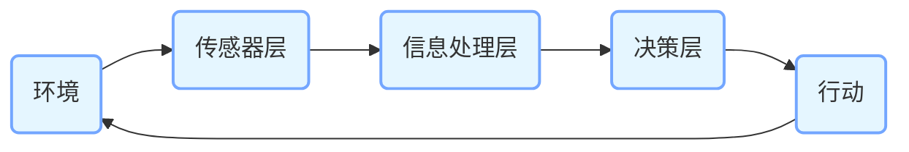

# 从零构建AI Agent的情境感知系统

> 关键词：AI Agent、情境感知系统、环境感知、信息处理、决策机制、智能交互、机器学习

> 摘要：本文旨在深入探讨如何从零开始构建AI Agent的情境感知系统。首先介绍了情境感知系统在AI Agent中的重要性和相关背景知识，接着详细阐述了其核心概念、算法原理、数学模型等理论基础。通过具体的Python代码示例和项目实战，展示了如何实现一个简单的情境感知系统。同时，分析了该系统的实际应用场景，推荐了相关的学习资源、开发工具和论文著作。最后对情境感知系统的未来发展趋势与挑战进行了总结，并给出常见问题解答和参考资料，帮助读者全面了解和掌握构建AI Agent情境感知系统的方法和技术。

## 1. 背景介绍 
### 1.1 目的和范围
AI Agent（人工智能代理）作为一种能够感知环境、进行决策并采取行动的智能实体，在许多领域都有广泛的应用。情境感知系统是AI Agent的重要组成部分，它能够让AI Agent更好地理解周围环境，从而做出更加智能和合理的决策。本文的目的是帮助读者从零开始构建一个AI Agent的情境感知系统，详细介绍其原理、实现方法和应用场景。范围涵盖了从理论基础到实际项目开发的各个方面，包括核心概念的解释、算法原理的阐述、数学模型的分析、项目实战的演示以及相关资源的推荐等。

### 1.2 预期读者
本文预期读者包括对人工智能、机器学习、智能系统开发等领域感兴趣的技术人员，如程序员、软件工程师、数据科学家等。同时，也适合对AI Agent和情境感知系统有一定了解，希望深入学习和实践相关技术的研究人员和学生。即使读者没有相关的专业背景，只要对人工智能有一定的兴趣和基本的编程知识，也可以通过本文逐步了解和掌握构建情境感知系统的方法。

### 1.3 文档结构概述
本文将按照以下结构进行组织：首先介绍背景知识，包括目的、预期读者和文档结构概述等内容；接着详细阐述情境感知系统的核心概念和它们之间的联系，并给出相应的文本示意图和Mermaid流程图；然后讲解核心算法原理，使用Python源代码进行详细阐述，并分析相关的数学模型和公式；通过项目实战部分展示如何在实际中实现一个情境感知系统，包括开发环境搭建、源代码实现和代码解读；介绍情境感知系统的实际应用场景；推荐相关的学习资源、开发工具和论文著作；最后总结未来发展趋势与挑战，给出常见问题解答和参考资料。

### 1.4 术语表
#### 1.4.1 核心术语定义
- **AI Agent（人工智能代理）**：一种能够感知环境、进行决策并采取行动的智能实体，它可以是软件程序、机器人等。
- **情境感知系统**：AI Agent的一部分，负责感知周围环境的信息，并对这些信息进行处理和分析，为AI Agent的决策提供依据。
- **环境感知**：通过各种传感器或信息源获取周围环境的信息，如温度、湿度、图像、声音等。
- **信息处理**：对获取的环境信息进行加工、分析和转换，提取有用的特征和模式。
- **决策机制**：根据情境感知系统提供的信息，AI Agent做出决策并采取相应的行动。

#### 1.4.2 相关概念解释
- **传感器**：用于感知环境信息的设备，如摄像头、麦克风、温度传感器等。
- **特征提取**：从原始的环境信息中提取出具有代表性的特征，以便后续的分析和处理。
- **机器学习模型**：用于对环境信息进行分类、预测和决策的模型，如神经网络、决策树等。

#### 1.4.3 缩略词列表
- **AI**：Artificial Intelligence（人工智能）
- **ML**：Machine Learning（机器学习）
- **CNN**：Convolutional Neural Network（卷积神经网络）
- **RNN**：Recurrent Neural Network（循环神经网络）

## 2. 核心概念与联系 
### 2.1 核心概念原理
情境感知系统的核心概念包括环境感知、信息处理和决策机制。环境感知是情境感知系统的基础，它通过各种传感器或信息源获取周围环境的信息。这些信息可以是物理环境的信息，如温度、湿度、光照等，也可以是社会环境的信息，如文本、图像、声音等。信息处理是对获取的环境信息进行加工、分析和转换的过程。它包括数据清洗、特征提取、数据分类等步骤，目的是提取出有用的特征和模式，为决策机制提供支持。决策机制是根据情境感知系统提供的信息，AI Agent做出决策并采取相应的行动。决策机制可以基于规则、机器学习模型或其他方法实现。

### 2.2 架构的文本示意图
情境感知系统的架构可以分为三个主要部分：传感器层、信息处理层和决策层。传感器层负责感知周围环境的信息，将其转换为数字信号并传输到信息处理层。信息处理层对获取的信息进行处理和分析，提取有用的特征和模式，并将其传输到决策层。决策层根据信息处理层提供的信息，做出决策并采取相应的行动。

### 2.3 Mermaid流程图

这个流程图展示了情境感知系统的基本工作流程。环境中的信息被传感器层感知，然后传输到信息处理层进行处理和分析。信息处理层将处理后的信息传输到决策层，决策层根据这些信息做出决策并采取相应的行动。行动的结果又会影响环境，形成一个闭环的反馈系统。

## 3. 核心算法原理 & 具体操作步骤 
### 3.1 环境感知算法
环境感知算法主要涉及到传感器数据的采集和预处理。以温度传感器为例，以下是一个简单的Python代码示例，用于模拟温度传感器数据的采集：
```python
import random

def temperature_sensor():
    # 模拟温度传感器数据，范围在20到30摄氏度之间
    temperature = random.uniform(20, 30)
    return temperature

# 采集温度数据
current_temperature = temperature_sensor()
print(f"当前温度: {current_temperature} 摄氏度")
```
在这个示例中，`temperature_sensor` 函数模拟了一个温度传感器，随机生成一个在20到30摄氏度之间的温度值。

### 3.2 信息处理算法
信息处理算法主要包括数据清洗、特征提取和数据分类等步骤。以图像信息处理为例，以下是一个使用Python和OpenCV库进行图像特征提取的代码示例：
```python
import cv2
import numpy as np

def extract_features(image_path):
    # 读取图像
    image = cv2.imread(image_path)
    # 将图像转换为灰度图
    gray = cv2.cvtColor(image, cv2.COLOR_BGR2GRAY)
    # 使用SIFT算法提取特征
    sift = cv2.SIFT_create()
    keypoints, descriptors = sift.detectAndCompute(gray, None)
    return keypoints, descriptors

# 提取图像特征
image_path = 'example_image.jpg'
keypoints, descriptors = extract_features(image_path)
print(f"提取的关键点数量: {len(keypoints)}")
```
在这个示例中，`extract_features` 函数读取一张图像，将其转换为灰度图，然后使用SIFT（尺度不变特征变换）算法提取图像的关键点和描述符。

### 3.3 决策机制算法
决策机制算法可以基于规则或机器学习模型实现。以基于规则的决策机制为例，以下是一个简单的Python代码示例，根据温度数据决定是否需要开启空调：
```python
def decision_making(temperature):
    if temperature > 25:
        return "开启空调"
    else:
        return "关闭空调"

# 根据温度数据进行决策
current_temperature = temperature_sensor()
decision = decision_making(current_temperature)
print(f"当前温度: {current_temperature} 摄氏度，决策: {decision}")
```
在这个示例中，`decision_making` 函数根据当前温度数据判断是否需要开启空调。如果温度大于25摄氏度，则返回“开启空调”；否则返回“关闭空调”。

## 4. 数学模型和公式 & 详细讲解 & 举例说明 
### 4.1 特征提取的数学模型
在信息处理中，特征提取是一个重要的步骤。以主成分分析（PCA）为例，它是一种常用的特征提取方法，其数学模型如下：
设 $X$ 是一个 $n \times p$ 的数据矩阵，其中 $n$ 是样本数量，$p$ 是特征数量。PCA的目标是找到一个 $p \times k$ 的矩阵 $W$，使得 $Y = XW$ 是 $X$ 的 $k$ 维主成分表示，其中 $k < p$。$W$ 的列向量是 $X$ 的协方差矩阵 $S = \frac{1}{n-1}X^TX$ 的前 $k$ 个特征向量。

### 4.2 决策树的数学模型
决策树是一种常用的机器学习模型，用于分类和回归问题。决策树的数学模型可以表示为一个树形结构，每个内部节点是一个特征的测试，每个分支是一个测试输出，每个叶节点是一个类别或值。决策树的构建过程可以使用信息增益、基尼指数等指标来选择最优的特征进行划分。

### 4.3 举例说明
假设有一个数据集 $X$，包含 $n = 10$ 个样本，每个样本有 $p = 3$ 个特征。我们可以使用PCA将其降维到 $k = 2$ 维。以下是一个使用Python和`scikit-learn`库实现PCA的代码示例：
```python
from sklearn.decomposition import PCA
import numpy as np

# 生成示例数据
X = np.random.rand(10, 3)

# 创建PCA对象，指定降维后的维度为2
pca = PCA(n_components=2)

# 进行PCA降维
X_transformed = pca.fit_transform(X)

print(f"原始数据形状: {X.shape}")
print(f"降维后数据形状: {X_transformed.shape}")
```
在这个示例中，我们首先生成了一个 $10 \times 3$ 的随机数据矩阵 $X$，然后使用`PCA`类将其降维到 $2$ 维。最后打印出原始数据和降维后数据的形状。

## 5. 项目实战：代码实际案例和详细解释说明 
### 5.1  开发环境搭建
在开始项目实战之前，需要搭建相应的开发环境。以下是一些基本的步骤：
1. **安装Python**：可以从Python官方网站（https://www.python.org/downloads/）下载并安装Python 3.x版本。
2. **安装必要的库**：使用`pip`命令安装所需的库，如`numpy`、`opencv-python`、`scikit-learn`等。例如：
```sh
pip install numpy opencv-python scikit-learn
```
3. **选择开发工具**：可以选择使用PyCharm、VS Code等集成开发环境（IDE）进行代码开发。

### 5.2  源代码详细实现和代码解读
以下是一个简单的AI Agent情境感知系统的完整代码示例，该系统根据温度和光照数据进行决策：
```python
import random

# 温度传感器模拟函数
def temperature_sensor():
    temperature = random.uniform(20, 30)
    return temperature

# 光照传感器模拟函数
def light_sensor():
    light = random.uniform(0, 1000)
    return light

# 信息处理函数
def information_processing(temperature, light):
    # 简单的信息处理，将温度和光照数据归一化到0到1之间
    normalized_temperature = (temperature - 20) / 10
    normalized_light = light / 1000
    return normalized_temperature, normalized_light

# 决策机制函数
def decision_making(normalized_temperature, normalized_light):
    if normalized_temperature > 0.5 and normalized_light < 0.3:
        return "打开空调和灯光"
    elif normalized_temperature > 0.5:
        return "打开空调"
    elif normalized_light < 0.3:
        return "打开灯光"
    else:
        return "无操作"

# 主函数
def main():
    # 采集温度和光照数据
    temperature = temperature_sensor()
    light = light_sensor()
    print(f"当前温度: {temperature} 摄氏度，当前光照: {light} lux")

    # 信息处理
    normalized_temperature, normalized_light = information_processing(temperature, light)

    # 决策
    decision = decision_making(normalized_temperature, normalized_light)
    print(f"决策: {decision}")

if __name__ == "__main__":
    main()
```
### 5.3  代码解读与分析
- **温度传感器模拟函数**：`temperature_sensor` 函数随机生成一个在20到30摄氏度之间的温度值，模拟温度传感器的数据采集。
- **光照传感器模拟函数**：`light_sensor` 函数随机生成一个在0到1000 lux之间的光照值，模拟光照传感器的数据采集。
- **信息处理函数**：`information_processing` 函数将温度和光照数据归一化到0到1之间，方便后续的决策处理。
- **决策机制函数**：`decision_making` 函数根据归一化后的温度和光照数据进行决策，根据不同的条件返回相应的操作指令。
- **主函数**：`main` 函数是程序的入口，负责调用传感器函数采集数据，进行信息处理和决策，并打印出结果。

## 6. 实际应用场景 
### 6.1 智能家居
在智能家居领域，AI Agent的情境感知系统可以根据环境信息自动调节家居设备的运行状态。例如，根据温度传感器和光照传感器的数据，自动调节空调、灯光等设备的开关和亮度，提高家居的舒适度和能源效率。

### 6.2 智能交通
在智能交通领域，情境感知系统可以帮助自动驾驶汽车感知周围的环境信息，如道路状况、交通信号、其他车辆和行人的位置等。根据这些信息，自动驾驶汽车可以做出决策，如加速、减速、转弯等，确保行驶的安全和高效。

### 6.3 智能医疗
在智能医疗领域，情境感知系统可以用于监测患者的生命体征、环境信息等。例如，通过穿戴式设备采集患者的心率、血压、体温等数据，结合环境信息，如温度、湿度等，医生可以及时了解患者的健康状况，做出准确的诊断和治疗决策。

### 6.4 工业自动化
在工业自动化领域，情境感知系统可以帮助机器人感知工作环境的信息，如物体的位置、形状、尺寸等。根据这些信息，机器人可以进行准确的操作，如抓取、搬运、装配等，提高生产效率和质量。

## 7. 工具和资源推荐
### 7.1 学习资源推荐
#### 7.1.1 书籍推荐
- 《人工智能：一种现代的方法》：这是一本经典的人工智能教材，涵盖了人工智能的各个领域，包括搜索算法、知识表示、机器学习、自然语言处理等。
- 《机器学习》：由周志华教授编写，是一本系统介绍机器学习的教材，内容丰富，适合初学者和有一定基础的读者。
- 《深度学习》：由Ian Goodfellow、Yoshua Bengio和Aaron Courville编写，是深度学习领域的经典著作，深入讲解了深度学习的原理和应用。

#### 7.1.2 在线课程
- Coursera上的“机器学习”课程：由Andrew Ng教授授课，是一门非常受欢迎的机器学习入门课程。
- edX上的“人工智能基础”课程：由麻省理工学院（MIT）的教授授课，系统介绍了人工智能的基本概念和方法。
- 哔哩哔哩（Bilibili）上的相关技术视频：有许多博主分享了关于人工智能、机器学习等方面的教程和案例，内容生动有趣，适合初学者学习。

#### 7.1.3 技术博客和网站
- 机器之心（https://www.alioon.com/）：专注于人工智能领域的资讯和技术分享，提供了大量的前沿技术文章和案例分析。
- 开源中国（https://www.oschina.net/）：是一个开源技术社区，有许多关于人工智能、机器学习等方面的开源项目和技术文章。
- 知乎（https://www.zhihu.com/）：有许多关于人工智能的问题和讨论，读者可以从中获取不同的观点和经验。

### 7.2 开发工具框架推荐
#### 7.2.1 IDE和编辑器
- PyCharm：是一款专业的Python集成开发环境（IDE），提供了丰富的功能，如代码编辑、调试、版本控制等，适合Python开发。
- Visual Studio Code（VS Code）：是一款轻量级的代码编辑器，支持多种编程语言，有许多扩展插件可以增强其功能，适合快速开发和调试。

#### 7.2.2 调试和性能分析工具
- PySnooper：是一个简单易用的Python调试工具，可以自动记录函数的调用过程和变量的值，方便调试代码。
- cProfile：是Python标准库中的性能分析工具，可以分析代码的运行时间和函数调用次数，帮助优化代码性能。

#### 7.2.3 相关框架和库
- TensorFlow：是一个开源的机器学习框架，由Google开发，提供了丰富的工具和接口，用于构建和训练深度学习模型。
- PyTorch：是另一个流行的深度学习框架，由Facebook开发，具有动态计算图的特点，适合快速开发和研究。
- Scikit-learn：是一个简单易用的机器学习库，提供了各种机器学习算法和工具，如分类、回归、聚类等，适合初学者和快速实验。

### 7.3 相关论文著作推荐
#### 7.3.1 经典论文
- “A Logical Calculus of the Ideas Immanent in Nervous Activity”：由Warren McCulloch和Walter Pitts发表于1943年，提出了神经元的数学模型，为神经网络的发展奠定了基础。
- “Learning Representations by Back-propagating Errors”：由David Rumelhart、Geoffrey Hinton和Ronald Williams发表于1986年，介绍了反向传播算法，使得神经网络的训练变得可行。
- “ImageNet Classification with Deep Convolutional Neural Networks”：由Alex Krizhevsky、Ilya Sutskever和Geoffrey Hinton发表于2012年，提出了AlexNet模型，开启了深度学习在计算机视觉领域的热潮。

#### 7.3.2 最新研究成果
- 可以通过IEEE Xplore、ACM Digital Library等学术数据库搜索最新的关于AI Agent、情境感知系统等方面的研究论文，了解该领域的最新发展动态。

#### 7.3.3 应用案例分析
- 可以参考一些知名企业的技术博客和研究报告，如Google AI Blog、Microsoft Research等，了解他们在AI Agent和情境感知系统方面的应用案例和实践经验。

## 8. 总结：未来发展趋势与挑战
### 8.1 未来发展趋势
- **多模态感知**：未来的情境感知系统将不仅仅依赖于单一的传感器，而是综合利用多种传感器，如视觉、听觉、触觉等，实现多模态感知，从而更全面地理解环境信息。
- **深度融合人工智能技术**：将深度学习、强化学习等人工智能技术深度融合到情境感知系统中，提高系统的智能水平和决策能力。
- **边缘计算与云计算结合**：将部分计算任务放在边缘设备上进行处理，减少数据传输延迟，提高系统的实时性，同时结合云计算的强大计算能力，进行更复杂的数据分析和处理。
- **跨领域应用**：情境感知系统将在更多的领域得到应用，如智能城市、智能农业、智能教育等，推动各领域的智能化发展。

### 8.2 挑战
- **数据隐私和安全**：情境感知系统需要采集大量的环境信息和用户数据，如何保证这些数据的隐私和安全是一个重要的挑战。
- **传感器精度和可靠性**：传感器的精度和可靠性直接影响情境感知系统的性能，如何提高传感器的质量和稳定性是一个亟待解决的问题。
- **复杂环境适应能力**：现实环境往往非常复杂多变，情境感知系统需要具备更强的适应能力，能够在不同的环境条件下准确地感知和理解信息。
- **算法复杂度和计算资源需求**：随着人工智能技术的不断发展，情境感知系统所使用的算法越来越复杂，对计算资源的需求也越来越高，如何在有限的计算资源下实现高效的算法是一个挑战。

## 9. 附录：常见问题与解答
### 9.1 如何选择合适的传感器？
选择合适的传感器需要考虑多个因素，如应用场景、测量范围、精度要求、成本等。例如，在智能家居应用中，如果需要测量温度，可以选择精度适中、价格较低的温度传感器；如果需要进行高精度的工业测量，则需要选择精度更高、价格更贵的传感器。

### 9.2 如何处理传感器数据的噪声？
传感器数据中往往存在噪声，可以使用滤波算法来处理噪声，如均值滤波、中值滤波、卡尔曼滤波等。不同的滤波算法适用于不同的场景，需要根据具体情况选择合适的算法。

### 9.3 如何优化决策机制？
可以通过以下几种方法优化决策机制：
- **使用更复杂的机器学习模型**：如神经网络、支持向量机等，提高决策的准确性和智能水平。
- **引入更多的特征和信息**：除了环境信息外，还可以考虑用户的偏好、历史数据等信息，综合进行决策。
- **进行实验和调优**：通过实验和调优，不断调整决策机制的参数和规则，提高决策的性能。

### 9.4 如何评估情境感知系统的性能？
可以从以下几个方面评估情境感知系统的性能：
- **准确性**：评估系统对环境信息的感知和理解的准确性，如温度测量的误差、图像识别的准确率等。
- **实时性**：评估系统对环境变化的响应速度，如传感器数据的采集频率、决策的执行时间等。
- **稳定性**：评估系统在不同环境条件下的稳定性，如长时间运行的可靠性、抗干扰能力等。

## 10. 扩展阅读 & 参考资料
### 10.1 扩展阅读
- 《人工智能简史》：了解人工智能的发展历程和重要事件，对整个领域有更全面的认识。
- 《智能时代》：探讨人工智能对社会和经济的影响，思考未来的发展方向。
- 《深度学习实战》：通过实际案例深入学习深度学习的应用和实现方法。

### 10.2 参考资料
- 相关的学术论文和研究报告，可以通过学术数据库和专业网站获取。
- 开源项目的文档和代码，如TensorFlow、PyTorch等框架的官方文档和示例代码。
- 技术博客和论坛上的相关文章和讨论，如Stack Overflow、GitHub等。