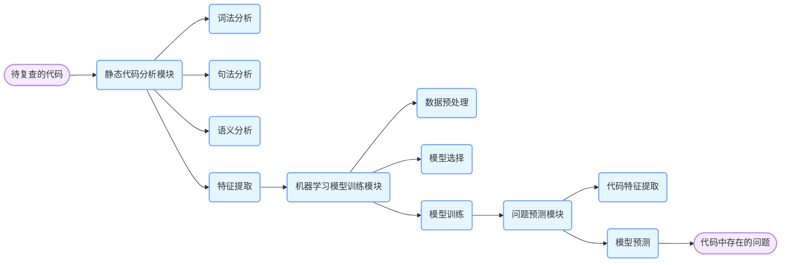

# 代码复查的AI赋能：问题自动发现

> 关键词：代码复查、AI赋能、问题自动发现、静态代码分析、机器学习

> 摘要：本文聚焦于代码复查中AI赋能实现问题自动发现这一主题。详细阐述了相关核心概念、算法原理、数学模型，通过实际项目案例展示如何利用AI进行代码复查和问题发现。同时介绍了该技术的实际应用场景、相关工具和资源，并对未来发展趋势与挑战进行了总结，最后给出常见问题解答和扩展阅读参考资料，旨在为开发者和技术人员提供全面深入的技术指导。

## 1. 背景介绍 
### 1.1 目的和范围
在软件开发过程中，代码复查是确保代码质量、提高软件可靠性和可维护性的关键环节。传统的代码复查主要依赖人工，不仅效率低下，而且容易遗漏一些潜在的问题。随着人工智能技术的快速发展，将AI赋能于代码复查，实现问题的自动发现成为了可能。本文的目的就是深入探讨如何利用AI技术来实现代码复查中的问题自动发现，涵盖了从核心概念、算法原理到实际应用等多个方面。

### 1.2 预期读者
本文预期读者包括软件开发工程师、软件测试人员、软件架构师、技术管理人员以及对代码复查和人工智能技术感兴趣的研究人员。对于软件开发相关人员，本文可以帮助他们提升代码复查的效率和准确性；对于技术管理人员，有助于他们了解如何利用新技术提升团队的开发效率和软件质量；对于研究人员，能为他们的研究提供新的思路和方向。

### 1.3 文档结构概述
本文首先介绍代码复查AI赋能问题自动发现的背景知识，包括目的、预期读者和文档结构。接着阐述核心概念与联系，通过文本示意图和Mermaid流程图进行说明。然后详细讲解核心算法原理和具体操作步骤，使用Python源代码进行阐述。之后介绍数学模型和公式，并举例说明。再通过项目实战展示代码实际案例和详细解释。接着探讨实际应用场景，推荐相关工具和资源。最后总结未来发展趋势与挑战，给出常见问题解答和扩展阅读参考资料。

### 1.4 术语表
#### 1.4.1 核心术语定义
- **代码复查**：指对编写好的代码进行系统的检查，以发现代码中的错误、潜在问题、不符合编码规范的地方等，确保代码的质量和可维护性。
- **AI赋能**：将人工智能技术应用于某个领域，使其具备更强大的功能和能力。在本文中，指将AI技术应用于代码复查，实现问题的自动发现。
- **问题自动发现**：利用AI技术自动检测代码中存在的各种问题，如语法错误、逻辑错误、安全漏洞等。
- **静态代码分析**：在不运行代码的情况下，对代码进行分析，以发现潜在的问题。

#### 1.4.2 相关概念解释
- **机器学习**：是一门多领域交叉学科，涉及概率论、统计学、逼近论、凸分析、算法复杂度理论等多门学科。它专门研究计算机怎样模拟或实现人类的学习行为，以获取新的知识或技能，重新组织已有的知识结构使之不断改善自身的性能。在代码复查中，机器学习可以用于训练模型来识别代码中的问题。
- **深度学习**：是机器学习的一个分支领域，它是一种基于对数据进行表征学习的方法。深度学习通过构建具有很多层的神经网络模型，自动从大量数据中学习特征和模式。在代码复查中，深度学习可以用于处理复杂的代码结构和语义信息。

#### 1.4.3 缩略词列表
- **AI**：Artificial Intelligence，人工智能
- **ML**：Machine Learning，机器学习
- **DL**：Deep Learning，深度学习
- **SCA**：Static Code Analysis，静态代码分析

## 2. 核心概念与联系 

### 核心概念原理
代码复查的AI赋能问题自动发现主要基于静态代码分析和机器学习技术。静态代码分析是在不执行代码的情况下，对代码的结构、语法、语义等进行分析，发现潜在的问题。机器学习则用于训练模型，让模型学习代码中的模式和特征，从而能够自动识别代码中的问题。

具体来说，首先收集大量的代码样本，包括有问题的代码和正常的代码。然后对这些代码进行预处理，如分词、词法分析、句法分析等，提取代码的特征。接着使用这些特征和对应的标签（有问题或正常）来训练机器学习模型。训练好的模型可以对新的代码进行预测，判断代码中是否存在问题。

### 架构的文本示意图
```plaintext
代码复查AI赋能问题自动发现架构

输入：待复查的代码
|
|-- 静态代码分析模块
|   |-- 词法分析
|   |-- 句法分析
|   |-- 语义分析
|   |-- 特征提取
|
|-- 机器学习模型训练模块
|   |-- 数据预处理
|   |-- 模型选择
|   |-- 模型训练
|
|-- 问题预测模块
|   |-- 代码特征提取
|   |-- 模型预测
|
输出：代码中存在的问题
```

### Mermaid流程图


## 3. 核心算法原理 & 具体操作步骤 

### 核心算法原理
在代码复查的AI赋能问题自动发现中，常用的机器学习算法有决策树、支持向量机、神经网络等。这里以决策树算法为例进行详细讲解。

决策树是一种基于树结构进行决策的算法，每个内部节点是一个属性上的测试，每个分支是一个测试输出，每个叶节点是一个类别或值。在代码复查中，决策树可以根据代码的特征（如变量使用次数、代码行数等）来判断代码是否存在问题。

### 具体操作步骤
#### 步骤1：数据收集
收集大量的代码样本，包括有问题的代码和正常的代码，并为每个代码样本标注是否存在问题。

#### 步骤2：数据预处理
对收集到的代码样本进行预处理，包括以下几个方面：
- **分词**：将代码分割成一个个的单词或符号。
- **词法分析**：识别代码中的关键字、标识符、运算符等。
- **句法分析**：分析代码的语法结构，构建语法树。
- **特征提取**：从代码中提取有用的特征，如变量使用次数、代码行数、函数调用次数等。

#### 步骤3：模型训练
使用预处理后的数据来训练决策树模型。以下是使用Python的`scikit-learn`库实现决策树模型训练的示例代码：
```python
from sklearn import tree
from sklearn.model_selection import train_test_split
import numpy as np

# 假设我们已经提取了代码的特征和对应的标签
# X 是特征矩阵，y 是标签向量
X = np.array([[1, 2, 3], [4, 5, 6], [7, 8, 9], [10, 11, 12]])
y = np.array([0, 1, 0, 1])

# 划分训练集和测试集
X_train, X_test, y_train, y_test = train_test_split(X, y, test_size=0.2, random_state=42)

# 创建决策树模型
clf = tree.DecisionTreeClassifier()

# 训练模型
clf.fit(X_train, y_train)

# 在测试集上进行预测
y_pred = clf.predict(X_test)

# 输出预测结果
print("预测结果:", y_pred)
```

#### 步骤4：模型评估
使用测试集对训练好的模型进行评估，常用的评估指标有准确率、召回率、F1值等。以下是使用`scikit-learn`库计算准确率的示例代码：
```python
from sklearn.metrics import accuracy_score

# 计算准确率
accuracy = accuracy_score(y_test, y_pred)
print("准确率:", accuracy)
```

#### 步骤5：问题预测
使用训练好的模型对新的代码进行预测，判断代码中是否存在问题。

## 4. 数学模型和公式 & 详细讲解 & 举例说明 

### 决策树算法的数学模型和公式
决策树算法的核心是选择最优的属性进行划分，常用的划分准则有信息增益、信息增益比、基尼指数等。这里以信息增益为例进行详细讲解。

#### 信息熵
信息熵是用来衡量一个随机变量的不确定性的指标。对于一个离散随机变量 $X$，其取值为 $x_1, x_2, \cdots, x_n$，对应的概率为 $p_1, p_2, \cdots, p_n$，则 $X$ 的信息熵定义为：
$$H(X)=-\sum_{i=1}^{n}p_i\log_2p_i$$

#### 条件熵
条件熵是在已知另一个随机变量 $Y$ 的条件下，随机变量 $X$ 的不确定性。对于离散随机变量 $X$ 和 $Y$，$Y$ 取值为 $y_1, y_2, \cdots, y_m$，则在 $Y$ 给定的条件下 $X$ 的条件熵定义为：
$$H(X|Y)=\sum_{j=1}^{m}p(y_j)H(X|Y=y_j)$$

#### 信息增益
信息增益是指在得知特征 $A$ 的信息后，使得类 $C$ 的信息不确定性减少的程度。特征 $A$ 对训练数据集 $D$ 的信息增益 $g(D, A)$ 定义为：
$$g(D, A)=H(D)-H(D|A)$$

### 详细讲解
信息熵 $H(D)$ 表示训练数据集 $D$ 的不确定性，条件熵 $H(D|A)$ 表示在已知特征 $A$ 的条件下，训练数据集 $D$ 的不确定性。信息增益 $g(D, A)$ 越大，说明特征 $A$ 对分类的贡献越大，越适合作为划分属性。

### 举例说明
假设有一个训练数据集 $D$，包含 10 个样本，分为两类（类别 $C_1$ 和 $C_2$），其中属于 $C_1$ 的样本有 6 个，属于 $C_2$ 的样本有 4 个。则数据集 $D$ 的信息熵为：
$$H(D)=-\frac{6}{10}\log_2\frac{6}{10}-\frac{4}{10}\log_2\frac{4}{10}\approx 0.971$$

假设特征 $A$ 有两个取值 $A_1$ 和 $A_2$，其中取值为 $A_1$ 的样本有 3 个，属于 $C_1$ 的有 2 个，属于 $C_2$ 的有 1 个；取值为 $A_2$ 的样本有 7 个，属于 $C_1$ 的有 4 个，属于 $C_2$ 的有 3 个。则条件熵为：
$$H(D|A)=\frac{3}{10}(-\frac{2}{3}\log_2\frac{2}{3}-\frac{1}{3}\log_2\frac{1}{3})+\frac{7}{10}(-\frac{4}{7}\log_2\frac{4}{7}-\frac{3}{7}\log_2\frac{3}{7})\approx 0.934$$

信息增益为：
$$g(D, A)=H(D)-H(D|A)\approx 0.971 - 0.934 = 0.037$$

## 5. 项目实战：代码实际案例和详细解释说明 

### 5.1  开发环境搭建
#### 安装Python
首先需要安装Python，建议使用Python 3.7及以上版本。可以从Python官方网站（https://www.python.org/downloads/）下载并安装。

#### 安装必要的库
使用`pip`命令安装`scikit-learn`、`numpy`等必要的库：
```sh
pip install scikit-learn numpy
```

### 5.2  源代码详细实现和代码解读
以下是一个完整的代码复查问题自动发现的示例代码：
```python
import numpy as np
from sklearn import tree
from sklearn.model_selection import train_test_split
from sklearn.metrics import accuracy_score

# 模拟代码特征数据和标签
# 假设我们有 100 个代码样本，每个样本有 5 个特征
X = np.random.rand(100, 5)
# 随机生成标签，0 表示正常代码，1 表示有问题的代码
y = np.random.randint(0, 2, 100)

# 划分训练集和测试集
X_train, X_test, y_train, y_test = train_test_split(X, y, test_size=0.2, random_state=42)

# 创建决策树模型
clf = tree.DecisionTreeClassifier()

# 训练模型
clf.fit(X_train, y_train)

# 在测试集上进行预测
y_pred = clf.predict(X_test)

# 计算准确率
accuracy = accuracy_score(y_test, y_pred)

# 输出结果
print("预测结果:", y_pred)
print("准确率:", accuracy)
```

### 代码解读与分析
#### 数据生成
```python
X = np.random.rand(100, 5)
y = np.random.randint(0, 2, 100)
```
这两行代码模拟了代码特征数据和标签。`X` 是一个 100x5 的矩阵，表示 100 个代码样本，每个样本有 5 个特征。`y` 是一个长度为 100 的向量，表示每个代码样本的标签，0 表示正常代码，1 表示有问题的代码。

#### 数据划分
```python
X_train, X_test, y_train, y_test = train_test_split(X, y, test_size=0.2, random_state=42)
```
这行代码使用`train_test_split`函数将数据集划分为训练集和测试集，其中测试集占总数据集的 20%。

#### 模型创建和训练
```python
clf = tree.DecisionTreeClassifier()
clf.fit(X_train, y_train)
```
这两行代码创建了一个决策树分类器，并使用训练集对模型进行训练。

#### 模型预测和评估
```python
y_pred = clf.predict(X_test)
accuracy = accuracy_score(y_test, y_pred)
```
这两行代码使用训练好的模型对测试集进行预测，并计算预测结果的准确率。

## 6. 实际应用场景 
### 软件开发团队
在软件开发团队中，代码复查是确保代码质量的重要环节。使用AI赋能的代码复查工具可以自动发现代码中的问题，减少人工复查的工作量，提高复查效率。例如，在大型项目中，每天可能会有大量的代码提交，使用AI工具可以快速检查这些代码，及时发现潜在的问题。

### 开源项目
开源项目通常有大量的贡献者，代码风格和质量参差不齐。使用AI赋能的代码复查工具可以帮助项目维护者快速发现新提交代码中的问题，保证项目的代码质量。例如，在一些知名的开源项目中，如Linux内核、Python的`scikit-learn`库等，都可以使用这类工具来进行代码复查。

### 安全审计
在安全审计中，需要对软件代码进行全面的检查，以发现潜在的安全漏洞。AI赋能的代码复查工具可以通过分析代码的结构和语义，发现一些常见的安全漏洞，如SQL注入、跨站脚本攻击等。例如，金融机构、政府部门等对安全要求较高的组织，可以使用这类工具来对自己的软件代码进行安全审计。

## 7. 工具和资源推荐
### 7.1 学习资源推荐
#### 7.1.1 书籍推荐
- 《机器学习》（周志华著）：这本书全面介绍了机器学习的基本概念、算法和应用，是机器学习领域的经典教材。
- 《深度学习》（Ian Goodfellow、Yoshua Bengio和Aaron Courville著）：这本书系统地介绍了深度学习的理论和实践，是深度学习领域的权威著作。
- 《Python数据分析实战》（Sebastian Raschka著）：这本书介绍了如何使用Python进行数据分析和机器学习，包含了大量的实际案例。

#### 7.1.2 在线课程
- Coursera上的“机器学习”课程（Andrew Ng教授主讲）：这是一门非常经典的机器学习课程，适合初学者入门。
- edX上的“深度学习基础”课程：该课程系统地介绍了深度学习的基本概念和算法。
- 中国大学MOOC上的“Python语言程序设计”课程：可以帮助学习者快速掌握Python编程语言。

#### 7.1.3 技术博客和网站
- 博客园：国内知名的技术博客网站，有很多关于机器学习、人工智能的技术文章。
- 掘金：专注于技术分享的社区，有很多优秀的技术文章和案例。
- Medium：国外知名的技术博客平台，有很多关于AI和代码复查的最新研究成果和实践经验。

### 7.2 开发工具框架推荐
#### 7.2.1 IDE和编辑器
- PyCharm：一款专门为Python开发设计的集成开发环境，具有代码自动补全、调试、版本控制等功能。
- Visual Studio Code：一款轻量级的代码编辑器，支持多种编程语言，有丰富的插件可以扩展功能。

#### 7.2.2 调试和性能分析工具
- PySnooper：一个简单易用的Python调试工具，可以在不修改代码的情况下输出函数的执行过程。
- cProfile：Python自带的性能分析工具，可以分析代码的运行时间和函数调用次数。

#### 7.2.3 相关框架和库
- scikit-learn：一个简单易用的机器学习库，包含了各种机器学习算法和工具。
- TensorFlow：Google开发的深度学习框架，具有强大的计算能力和丰富的工具。
- PyTorch：Facebook开发的深度学习框架，易于使用和调试，适合研究和开发。

### 7.3 相关论文著作推荐
#### 7.3.1 经典论文
- “A Decision-Theoretic Generalization of On-Line Learning and an Application to Boosting”（Yoav Freund和Robert E. Schapire著）：这篇论文介绍了AdaBoost算法，是机器学习领域的经典论文之一。
- “Gradient-Based Learning Applied to Document Recognition”（Yann LeCun、Léon Bottou、Yoshua Bengio和Patrick Haffner著）：这篇论文介绍了卷积神经网络（CNN）在手写字符识别中的应用，是深度学习领域的经典论文之一。

#### 7.3.2 最新研究成果
- 在IEEE Transactions on Software Engineering、ACM Transactions on Software Engineering and Methodology等期刊上发表的关于代码复查和AI技术结合的研究论文。
- 在ICSE（International Conference on Software Engineering）、FSE（Foundations of Software Engineering）等会议上发表的相关研究成果。

#### 7.3.3 应用案例分析
- 一些知名科技公司（如Google、Microsoft等）在官方博客或技术论坛上分享的关于代码复查AI赋能的应用案例。
- 开源项目中关于使用AI技术进行代码复查的文档和报告。

## 8. 总结：未来发展趋势与挑战
### 未来发展趋势
- **更强大的模型**：随着深度学习技术的不断发展，未来可能会出现更强大的模型，能够更准确地识别代码中的问题。例如，使用更复杂的神经网络架构，如Transformer架构，来处理代码的语义信息。
- **多模态分析**：除了对代码本身进行分析，未来可能会结合代码的文档、注释、版本历史等多模态信息进行分析，提高问题发现的准确性。
- **与开发流程深度融合**：AI赋能的代码复查工具将与软件开发流程深度融合，实现自动化的代码复查和问题修复。例如，在代码提交时自动进行复查，并将问题反馈给开发者，甚至自动修复一些简单的问题。

### 挑战
- **数据获取和标注**：获取大量高质量的代码数据并进行准确的标注是一个挑战。代码数据通常涉及到知识产权和隐私问题，获取难度较大。而且对代码中的问题进行准确标注需要专业的知识和经验。
- **模型解释性**：一些复杂的机器学习模型（如深度学习模型）的解释性较差，难以理解模型是如何做出决策的。在代码复查中，开发者需要知道模型发现问题的依据，以便进行修复。
- **对抗攻击**：恶意开发者可能会对AI赋能的代码复查工具进行对抗攻击，通过修改代码的结构和语义来绕过工具的检测。如何提高工具的抗攻击能力是一个需要解决的问题。

## 9. 附录：常见问题与解答
### 问题1：AI赋能的代码复查工具能否完全替代人工复查？
答：目前还不能完全替代。虽然AI赋能的代码复查工具可以自动发现一些常见的问题，但对于一些复杂的业务逻辑和代码设计问题，还需要人工进行复查。而且AI模型的准确性也不是100%，可能会出现误判和漏判的情况。

### 问题2：如何选择适合的机器学习算法？
答：选择适合的机器学习算法需要考虑多个因素，如数据的特点、问题的类型、模型的复杂度等。一般来说，如果数据量较小，可以选择决策树、支持向量机等简单的算法；如果数据量较大，可以选择深度学习算法。同时，可以通过交叉验证等方法来评估不同算法的性能，选择性能最好的算法。

### 问题3：如何提高AI赋能的代码复查工具的准确性？
答：可以从以下几个方面提高准确性：
- 收集更多高质量的代码数据，并进行准确的标注。
- 选择合适的特征和算法，对模型进行优化。
- 结合多种技术，如静态代码分析、动态代码分析等，提高问题发现的能力。

## 10. 扩展阅读 & 参考资料
### 扩展阅读
- 《代码大全》（Steve McConnell著）：这本书介绍了软件开发的最佳实践和代码编写技巧，对提高代码质量有很大的帮助。
- 《重构：改善既有代码的设计》（Martin Fowler著）：这本书介绍了如何对现有代码进行重构，提高代码的可维护性和可扩展性。

### 参考资料
- 周志华. 机器学习. 清华大学出版社, 2016.
- Ian Goodfellow, Yoshua Bengio, Aaron Courville. 深度学习. 人民邮电出版社, 2017.
- Sebastian Raschka. Python数据分析实战. 机械工业出版社, 2018.