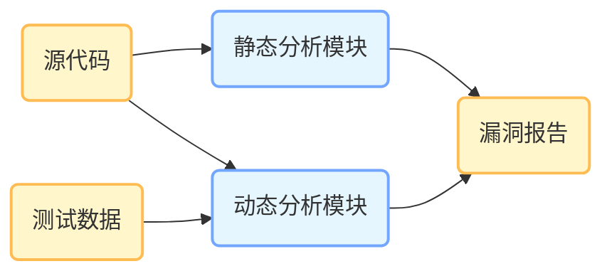
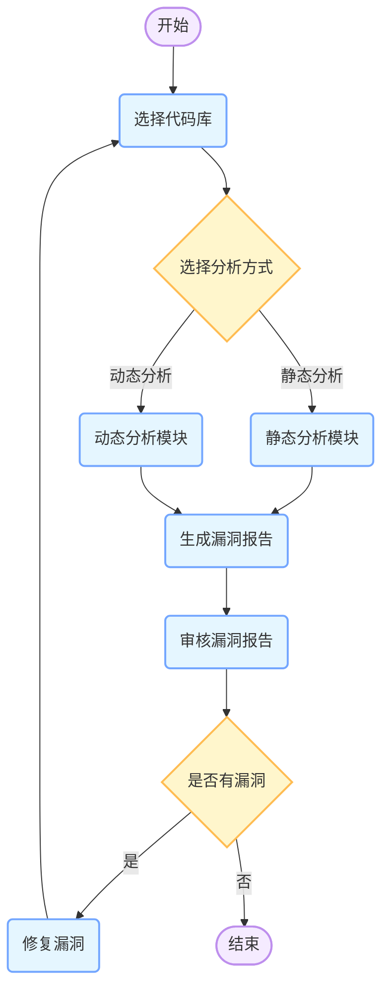

# 代码审计平台：漏洞检测系统

> 关键词：代码审计平台、漏洞检测系统、安全漏洞、静态分析、动态分析

> 摘要：本文深入探讨了代码审计平台中的漏洞检测系统。首先介绍了该系统的背景，包括目的、预期读者、文档结构和相关术语。接着阐述了核心概念，如静态分析和动态分析的原理及其联系，并给出了相应的架构示意图和流程图。详细讲解了核心算法原理，用Python代码进行示例。还介绍了相关的数学模型和公式，并举例说明。通过项目实战展示了系统的开发环境搭建、源代码实现和代码解读。分析了实际应用场景，推荐了学习资源、开发工具框架和相关论文著作。最后总结了未来发展趋势与挑战，并提供了常见问题解答和扩展阅读参考资料，旨在帮助读者全面了解代码审计平台的漏洞检测系统。

## 1. 背景介绍 
### 1.1 目的和范围
代码审计平台的漏洞检测系统旨在发现软件代码中存在的安全漏洞，帮助开发团队在软件开发的早期阶段识别并修复潜在的安全问题，从而提高软件的安全性和可靠性。本系统的范围涵盖了多种编程语言，如Java、Python、C++等，支持对不同类型的代码库进行审计，包括Web应用程序、移动应用程序和桌面应用程序等。

### 1.2 预期读者
本文的预期读者包括软件开发人员、安全工程师、系统管理员以及对代码安全感兴趣的技术爱好者。软件开发人员可以通过了解漏洞检测系统来提高自己编写安全代码的能力；安全工程师可以利用该系统进行代码安全评估；系统管理员可以使用该系统来确保所管理的系统代码的安全性。

### 1.3 文档结构概述
本文将按照以下结构进行阐述：首先介绍核心概念与联系，包括静态分析和动态分析的原理和架构；接着讲解核心算法原理和具体操作步骤，并用Python代码进行详细说明；然后介绍相关的数学模型和公式，并举例说明；通过项目实战展示系统的开发和实现过程；分析实际应用场景；推荐学习资源、开发工具框架和相关论文著作；最后总结未来发展趋势与挑战，提供常见问题解答和扩展阅读参考资料。

### 1.4 术语表
#### 1.4.1 核心术语定义
- **代码审计**：对源代码进行系统性的检查，以发现其中的安全漏洞、编程错误和违反编程规范的地方。
- **漏洞检测系统**：一种自动化工具，用于检测代码中的安全漏洞，如SQL注入、跨站脚本攻击（XSS）等。
- **静态分析**：在不运行代码的情况下，对源代码进行分析，以发现潜在的安全问题。
- **动态分析**：通过运行代码，监控代码的执行过程，以发现运行时的安全漏洞。

#### 1.4.2 相关概念解释
- **污点分析**：一种静态分析技术，用于跟踪数据在代码中的流动，以发现可能的安全漏洞。
- **模糊测试**：一种动态分析技术，通过向程序输入随机数据，以发现程序中的异常行为和安全漏洞。
- **漏洞签名**：一种用于识别特定安全漏洞的模式或规则。

#### 1.4.3 缩略词列表
- **SQLi**：SQL注入（SQL Injection）
- **XSS**：跨站脚本攻击（Cross-Site Scripting）
- **SAST**：静态应用安全测试（Static Application Security Testing）
- **DAST**：动态应用安全测试（Dynamic Application Security Testing）

## 2. 核心概念与联系 
### 2.1 静态分析原理
静态分析是在不运行代码的情况下，对源代码进行分析。它通过解析代码的语法结构、语义信息和控制流，来发现潜在的安全问题。静态分析的优点是可以在开发的早期阶段发现问题，效率高，能够覆盖整个代码库。常见的静态分析技术包括词法分析、语法分析、语义分析和数据流分析等。

### 2.2 动态分析原理
动态分析是通过运行代码，监控代码的执行过程，以发现运行时的安全漏洞。它通过向程序输入各种测试数据，观察程序的行为，如内存使用情况、网络通信等，来发现潜在的安全问题。动态分析的优点是能够发现一些在静态分析中难以发现的运行时漏洞，如缓冲区溢出、内存泄漏等。常见的动态分析技术包括调试、监控和模糊测试等。

### 2.3 静态分析与动态分析的联系
静态分析和动态分析是互补的关系。静态分析可以在开发的早期阶段发现一些潜在的安全问题，帮助开发人员及时修复。而动态分析可以在代码运行时发现一些运行时的安全漏洞，对静态分析进行补充。在实际的代码审计平台中，通常会结合使用静态分析和动态分析技术，以提高漏洞检测的准确性和全面性。

### 2.4 架构示意图


### 2.5 流程图


## 3. 核心算法原理 & 具体操作步骤 
### 3.1 污点分析算法原理
污点分析是一种静态分析技术，用于跟踪数据在代码中的流动，以发现可能的安全漏洞。其基本原理是将输入数据标记为“污点”，然后跟踪这些污点数据在代码中的传播过程，当污点数据到达敏感操作（如SQL查询、命令执行等）时，就认为可能存在安全漏洞。

### 3.2 污点分析算法的Python实现
```python
# 模拟代码中的变量和操作
variables = {}

def set_variable(name, value, is_tainted=False):
    variables[name] = (value, is_tainted)

def get_variable(name):
    return variables.get(name, (None, False))

# 模拟敏感操作
def sql_query(query):
    _, is_tainted = get_variable(query)
    if is_tainted:
        print("可能存在SQL注入漏洞！")
    else:
        print("SQL查询安全。")

# 示例代码
set_variable("user_input", "1 OR 1=1", True)
set_variable("query", "SELECT * FROM users WHERE id = " + get_variable("user_input")[0], get_variable("user_input")[1])
sql_query("query")
```

### 3.3 具体操作步骤
1. **代码解析**：使用编译器或解析器对源代码进行解析，生成抽象语法树（AST）。
2. **污点标记**：将输入数据标记为“污点”。
3. **数据流分析**：跟踪污点数据在代码中的传播过程。
4. **漏洞检测**：当污点数据到达敏感操作时，标记为可能的安全漏洞。
5. **生成报告**：将检测到的漏洞信息整理成报告。

## 4. 数学模型和公式 & 详细讲解 & 举例说明 
### 4.1 图论模型
在代码分析中，可以使用图论模型来表示代码的结构和数据流动。例如，控制流图（CFG）可以表示代码的执行流程，数据流图（DFG）可以表示数据在代码中的流动。

### 4.2 公式说明
设 $G=(V, E)$ 为一个图，其中 $V$ 是顶点集合，$E$ 是边集合。在控制流图中，顶点表示代码的基本块，边表示基本块之间的控制转移。在数据流图中，顶点表示变量，边表示变量之间的数据依赖关系。

### 4.3 举例说明
考虑以下简单的Python代码：
```python
x = 1
y = x + 2
z = y * 3
```
其对应的数据流图可以表示为：
- 顶点：$V = \{x, y, z\}$
- 边：$E = \{(x, y), (y, z)\}$

这表示 $y$ 的值依赖于 $x$，$z$ 的值依赖于 $y$。

## 5. 项目实战：代码实际案例和详细解释说明 
### 5.1  开发环境搭建
#### 5.1.1 安装Python
首先，需要安装Python开发环境。可以从Python官方网站（https://www.python.org/downloads/）下载并安装适合自己操作系统的Python版本。

#### 5.1.2 安装依赖库
使用以下命令安装所需的依赖库：
```bash
pip install astunparse
```

### 5.2  源代码详细实现和代码解读
#### 5.2.1 静态分析代码实现
```python
import ast

class TaintAnalyzer(ast.NodeVisitor):
    def __init__(self):
        self.tainted_vars = set()

    def visit_Assign(self, node):
        if isinstance(node.value, ast.Name):
            name = node.value.id
            if name in self.tainted_vars:
                for target in node.targets:
                    if isinstance(target, ast.Name):
                        self.tainted_vars.add(target.id)
        self.generic_visit(node)

    def visit_Call(self, node):
        if isinstance(node.func, ast.Name) and node.func.id == 'sql_query':
            for arg in node.args:
                if isinstance(arg, ast.Name) and arg.id in self.tainted_vars:
                    print(f"可能存在SQL注入漏洞：调用 {node.func.id} 时使用了污点变量 {arg.id}")
        self.generic_visit(node)

def analyze_code(code):
    tree = ast.parse(code)
    analyzer = TaintAnalyzer()
    analyzer.tainted_vars.add('user_input')
    analyzer.visit(tree)

# 示例代码
code = """
user_input = "1 OR 1=1"
query = "SELECT * FROM users WHERE id = " + user_input
sql_query(query)
"""

analyze_code(code)
```

#### 5.2.2 代码解读
- `TaintAnalyzer` 类继承自 `ast.NodeVisitor`，用于遍历抽象语法树。
- `visit_Assign` 方法用于处理赋值语句，当赋值语句的右值是一个污点变量时，将左值也标记为污点变量。
- `visit_Call` 方法用于处理函数调用，当调用 `sql_query` 函数时，如果使用了污点变量作为参数，则提示可能存在SQL注入漏洞。
- `analyze_code` 函数用于解析代码并调用 `TaintAnalyzer` 进行分析。

### 5.3  代码解读与分析
通过上述代码，我们实现了一个简单的静态污点分析工具。该工具可以检测代码中是否存在使用污点变量进行SQL查询的情况，从而发现可能的SQL注入漏洞。在实际应用中，可以根据需要扩展该工具，支持更多的编程语言和漏洞类型。

## 6. 实际应用场景 
### 6.1 软件开发过程中的安全检查
在软件开发过程中，代码审计平台的漏洞检测系统可以作为一个重要的安全检查环节。开发人员可以在代码提交之前，使用该系统对代码进行审计，及时发现并修复潜在的安全漏洞，提高软件的安全性。

### 6.2 安全评估和合规性检查
对于企业和组织来说，需要对现有的软件系统进行安全评估和合规性检查。代码审计平台的漏洞检测系统可以帮助企业发现软件系统中存在的安全漏洞，确保系统符合相关的安全标准和法规要求。

### 6.3 应急响应和漏洞修复
当发现软件系统存在安全漏洞时，代码审计平台的漏洞检测系统可以帮助安全工程师快速定位漏洞的位置和原因，提供修复建议，加快漏洞修复的速度，减少安全风险。

## 7. 工具和资源推荐
### 7.1 学习资源推荐
#### 7.1.1 书籍推荐
- 《代码审计：企业级Web代码安全架构》：介绍了代码审计的基本概念、方法和技术，以及如何构建企业级的代码安全架构。
- 《白帽子讲Web安全》：详细讲解了Web安全的各个方面，包括SQL注入、XSS、CSRF等漏洞的原理和防范方法。
- 《Python源码剖析》：深入剖析了Python的源代码，帮助读者了解Python的内部实现原理。

#### 7.1.2 在线课程
- Coursera上的“Web Security”课程：介绍了Web安全的基本概念和常见漏洞的防范方法。
- edX上的“Software Security”课程：讲解了软件安全的相关知识和技术，包括代码审计、漏洞检测等。

#### 7.1.3 技术博客和网站
- 安全客（https://www.anquanke.com/）：提供了丰富的安全技术文章和资讯。
- 先知社区（https://xz.aliyun.com/）：汇聚了众多安全专家和爱好者，分享安全技术和经验。

### 7.2 开发工具框架推荐
#### 7.2.1 IDE和编辑器
- PyCharm：一款专业的Python集成开发环境，提供了丰富的代码编辑、调试和分析功能。
- Visual Studio Code：一款轻量级的代码编辑器，支持多种编程语言，具有丰富的插件生态系统。

#### 7.2.2 调试和性能分析工具
- pdb：Python自带的调试工具，可以帮助开发人员调试代码。
- cProfile：Python的性能分析工具，可以分析代码的运行时间和函数调用情况。

#### 7.2.3 相关框架和库
- Pylint：一个Python代码检查工具，可以检查代码中的语法错误、编程规范等问题。
- Bandit：一个Python静态分析工具，用于检测代码中的安全漏洞。

### 7.3 相关论文著作推荐
#### 7.3.1 经典论文
- “Flow-Sensitive Type Qualifiers”：介绍了数据流敏感的类型限定符，用于静态分析代码中的安全问题。
- “Static Analysis for Detecting Buffer Overflow Vulnerabilities”：研究了如何使用静态分析技术检测缓冲区溢出漏洞。

#### 7.3.2 最新研究成果
- 关注ACM SIGSOFT、IEEE Software等会议和期刊，了解代码审计和漏洞检测领域的最新研究成果。

#### 7.3.3 应用案例分析
- 可以参考一些知名企业和组织的代码审计报告和安全漏洞案例分析，了解实际应用中的代码审计和漏洞检测方法。

## 8. 总结：未来发展趋势与挑战
### 8.1 未来发展趋势
- **智能化**：随着人工智能和机器学习技术的发展，代码审计平台的漏洞检测系统将越来越智能化。可以利用机器学习算法对大量的代码数据进行学习和分析，提高漏洞检测的准确性和效率。
- **自动化**：代码审计将越来越自动化，开发人员可以将代码审计集成到软件开发的持续集成/持续部署（CI/CD）流程中，实现代码的实时审计和漏洞修复。
- **多语言支持**：随着软件开发中使用的编程语言越来越多样化，代码审计平台的漏洞检测系统将支持更多的编程语言，包括新兴的编程语言和领域特定语言。

### 8.2 挑战
- **代码复杂性**：随着软件系统的规模和复杂性不断增加，代码审计的难度也越来越大。需要开发更高效、更准确的代码分析算法和技术。
- **漏洞多样性**：新的安全漏洞不断涌现，代码审计平台的漏洞检测系统需要及时跟上漏洞的变化，不断更新漏洞签名和检测规则。
- **误报和漏报**：如何减少漏洞检测系统的误报和漏报是一个重要的挑战。需要优化检测算法和规则，提高检测的准确性。

## 9. 附录：常见问题与解答
### 9.1 代码审计平台的漏洞检测系统能否检测所有的安全漏洞？
不能。代码审计平台的漏洞检测系统可以检测大部分常见的安全漏洞，但不能保证检测到所有的安全漏洞。一些复杂的、隐藏较深的漏洞可能需要人工审计和其他技术手段来发现。

### 9.2 静态分析和动态分析哪个更准确？
静态分析和动态分析各有优缺点，不能简单地说哪个更准确。静态分析可以在开发的早期阶段发现一些潜在的安全问题，效率高，但可能存在误报和漏报。动态分析可以在代码运行时发现一些运行时的安全漏洞，但需要运行代码，效率相对较低。在实际应用中，通常会结合使用静态分析和动态分析技术，以提高漏洞检测的准确性。

### 9.3 如何选择适合自己的代码审计平台？
选择适合自己的代码审计平台需要考虑以下因素：
- **支持的编程语言**：确保平台支持自己使用的编程语言。
- **漏洞检测能力**：了解平台的漏洞检测能力，包括检测的漏洞类型和准确性。
- **易用性**：选择操作简单、易于使用的平台。
- **成本**：考虑平台的购买成本和使用成本。

## 10. 扩展阅读 & 参考资料
- 《软件安全工程：安全漏洞的系统方法》
- 《Web应用安全权威指南》
- OWASP官方网站（https://owasp.org/）
- NVD（国家漏洞数据库）网站（https://nvd.nist.gov/）