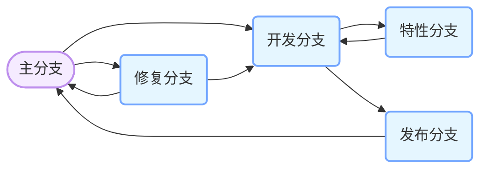

# 代码版本管理：智能分支策略

> 关键词：代码版本管理、智能分支策略、Git、分支模型、软件开发

> 摘要：本文围绕代码版本管理中的智能分支策略展开深入探讨。首先介绍了代码版本管理及智能分支策略的背景信息，包括目的、预期读者、文档结构和相关术语。接着阐述了核心概念与联系，通过文本示意图和Mermaid流程图展示其架构。详细讲解了核心算法原理并给出Python源代码示例，介绍了相关数学模型和公式。通过项目实战，展示了开发环境搭建、源代码实现与解读。探讨了智能分支策略在不同场景下的实际应用，推荐了学习资源、开发工具框架和相关论文著作。最后总结了未来发展趋势与挑战，并提供了常见问题解答和扩展阅读参考资料，旨在帮助开发者更好地理解和运用智能分支策略进行高效的代码版本管理。

## 1. 背景介绍 
### 1.1 目的和范围
在软件开发过程中，代码版本管理是至关重要的一环。随着项目规模的不断扩大和开发团队的日益壮大，有效的代码版本管理能够确保代码的可追溯性、协作的高效性以及项目的稳定性。智能分支策略作为代码版本管理的核心组成部分，旨在通过合理的分支规划和管理，提高开发效率、减少冲突，并更好地支持不同的开发场景和需求。

本文的范围涵盖了智能分支策略的基本概念、核心算法原理、实际应用场景以及相关的工具和资源。通过详细的讲解和示例，帮助读者全面了解智能分支策略，并能够在实际项目中应用这些策略来优化代码版本管理。

### 1.2 预期读者
本文主要面向软件开发人员、软件项目管理人员、软件测试人员以及对代码版本管理感兴趣的技术爱好者。无论是初学者还是有一定经验的专业人士，都能从本文中获取关于智能分支策略的深入知识和实用技巧。

### 1.3 文档结构概述
本文将按照以下结构进行组织：
1. **背景介绍**：介绍代码版本管理和智能分支策略的背景信息，包括目的、预期读者、文档结构和相关术语。
2. **核心概念与联系**：阐述智能分支策略的核心概念，通过文本示意图和Mermaid流程图展示其架构。
3. **核心算法原理 & 具体操作步骤**：详细讲解智能分支策略的核心算法原理，并给出Python源代码示例。
4. **数学模型和公式 & 详细讲解 & 举例说明**：介绍智能分支策略相关的数学模型和公式，并通过具体例子进行说明。
5. **项目实战：代码实际案例和详细解释说明**：通过一个实际项目案例，展示智能分支策略的具体应用，包括开发环境搭建、源代码实现和代码解读。
6. **实际应用场景**：探讨智能分支策略在不同场景下的实际应用，如敏捷开发、持续集成等。
7. **工具和资源推荐**：推荐学习智能分支策略的相关资源，包括书籍、在线课程、技术博客和网站，以及开发工具框架和相关论文著作。
8. **总结：未来发展趋势与挑战**：总结智能分支策略的未来发展趋势和面临的挑战。
9. **附录：常见问题与解答**：提供关于智能分支策略的常见问题解答。
10. **扩展阅读 & 参考资料**：提供扩展阅读的建议和相关参考资料。

### 1.4 术语表
#### 1.4.1 核心术语定义
- **代码版本管理**：对软件开发过程中代码的不同版本进行管理和控制的过程，确保代码的可追溯性和一致性。
- **分支**：在代码版本管理系统中，分支是指从主代码库中分离出来的一个独立的代码副本，用于并行开发不同的功能或修复不同的问题。
- **智能分支策略**：一种基于规则和算法的分支管理方法，能够根据项目的需求和开发流程自动创建、合并和删除分支，提高开发效率和代码质量。
- **主分支**：代码库中的主要分支，通常用于存储稳定的、经过测试的代码版本。
- **开发分支**：用于开发新功能或进行实验性开发的分支，通常从主分支派生出来。
- **特性分支**：用于开发特定功能的分支，通常从开发分支派生出来，开发完成后合并回开发分支。
- **修复分支**：用于修复生产环境中出现的紧急问题的分支，通常从主分支派生出来，修复完成后合并回主分支和开发分支。

#### 1.4.2 相关概念解释
- **版本控制系统（VCS）**：用于管理代码版本的软件工具，常见的版本控制系统有Git、SVN等。
- **合并**：将一个分支上的代码更改合并到另一个分支上的操作。
- **冲突**：在合并过程中，当两个分支对同一部分代码进行了不同的更改时，就会产生冲突，需要手动解决。
- **标签**：在代码版本管理系统中，标签是指对某个特定版本的代码进行标记，通常用于标记发布版本。

#### 1.4.3 缩略词列表
- **VCS**：Version Control System（版本控制系统）
- **CI**：Continuous Integration（持续集成）
- **CD**：Continuous Deployment（持续部署）

## 2. 核心概念与联系 
### 核心概念原理
智能分支策略的核心原理是根据项目的需求和开发流程，定义一系列规则和算法来管理分支的创建、合并和删除。这些规则和算法可以基于时间、功能、优先级等因素进行设计，以确保分支的管理更加高效和合理。

例如，在一个敏捷开发项目中，可以根据迭代周期来创建开发分支，每个迭代周期对应一个开发分支。在开发过程中，开发人员可以从开发分支派生特性分支进行新功能的开发，开发完成后将特性分支合并回开发分支。当一个迭代周期结束时，将开发分支合并回主分支，并进行版本发布。

### 架构的文本示意图
以下是一个简单的智能分支策略架构的文本示意图：

```plaintext
主分支 (Master)
|
|-- 开发分支 (Develop)
|   |
|   |-- 特性分支 (Feature-1, Feature-2, ...)
|   |
|   |-- 修复分支 (Hotfix-1, Hotfix-2, ...)
|
|-- 发布分支 (Release)
```

在这个架构中，主分支用于存储稳定的、经过测试的代码版本。开发分支是开发新功能和进行实验性开发的主要分支。特性分支用于开发特定的功能，修复分支用于修复生产环境中出现的紧急问题。发布分支用于准备版本发布。

### Mermaid流程图


这个流程图展示了智能分支策略中各个分支之间的关系和操作流程。开发人员从开发分支派生特性分支进行新功能的开发，开发完成后将特性分支合并回开发分支。当需要修复生产环境中的紧急问题时，从主分支派生修复分支，修复完成后将修复分支合并回主分支和开发分支。当准备进行版本发布时，从开发分支派生发布分支，进行最后的测试和准备工作，完成后将发布分支合并回主分支。

## 3. 核心算法原理 & 具体操作步骤 
### 核心算法原理
智能分支策略的核心算法原理主要涉及分支的创建、合并和删除。以下是一个简单的算法示例：

1. **分支创建**：根据项目的需求和开发流程，自动创建相应的分支。例如，在每个迭代周期开始时，自动创建一个开发分支；当开发人员需要开发一个新功能时，自动从开发分支派生一个特性分支。
2. **分支合并**：在满足一定条件时，自动将一个分支上的代码更改合并到另一个分支上。例如，当特性分支开发完成并通过测试后，自动将特性分支合并回开发分支；当修复分支修复完成并通过测试后，自动将修复分支合并回主分支和开发分支。
3. **分支删除**：在分支完成其使命后，自动删除该分支。例如，当特性分支合并回开发分支后，自动删除特性分支；当发布分支合并回主分支后，自动删除发布分支。

### Python源代码示例
以下是一个使用Python和GitPython库实现简单智能分支策略的示例代码：

```python
import git

# 定义仓库路径
repo_path = '/path/to/your/repository'

# 打开仓库
repo = git.Repo(repo_path)

# 创建开发分支
def create_develop_branch():
    try:
        # 检查开发分支是否存在
        if 'develop' not in [branch.name for branch in repo.branches]:
            # 从主分支创建开发分支
            develop_branch = repo.create_head('develop', repo.heads.master)
            print(f"成功创建开发分支: {develop_branch.name}")
        else:
            print("开发分支已存在")
    except Exception as e:
        print(f"创建开发分支时出错: {e}")

# 创建特性分支
def create_feature_branch(feature_name):
    try:
        # 检查特性分支是否存在
        if feature_name not in [branch.name for branch in repo.branches]:
            # 从开发分支创建特性分支
            feature_branch = repo.create_head(feature_name, repo.heads.develop)
            print(f"成功创建特性分支: {feature_branch.name}")
        else:
            print(f"特性分支 {feature_name} 已存在")
    except Exception as e:
        print(f"创建特性分支时出错: {e}")

# 合并特性分支到开发分支
def merge_feature_to_develop(feature_name):
    try:
        # 切换到开发分支
        repo.git.checkout('develop')
        # 合并特性分支
        repo.git.merge(feature_name)
        print(f"成功将特性分支 {feature_name} 合并到开发分支")
        # 删除特性分支
        repo.delete_head(feature_name)
        print(f"成功删除特性分支 {feature_name}")
    except Exception as e:
        print(f"合并特性分支时出错: {e}")

# 示例使用
if __name__ == "__main__":
    # 创建开发分支
    create_develop_branch()
    # 创建特性分支
    create_feature_branch('feature-1')
    # 合并特性分支到开发分支
    merge_feature_to_develop('feature-1')
```

### 具体操作步骤
1. **安装GitPython库**：在命令行中运行以下命令安装GitPython库：
```sh
pip install gitpython
```
2. **配置仓库路径**：将代码中的`repo_path`变量替换为你实际的仓库路径。
3. **运行代码**：在命令行中运行以下命令执行代码：
```sh
python your_script.py
```

通过以上步骤，你可以实现简单的智能分支策略，包括开发分支和特性分支的创建、合并和删除。

## 4. 数学模型和公式 & 详细讲解 & 举例说明 
### 数学模型
智能分支策略可以使用图论和状态机等数学模型来进行描述和分析。

#### 图论模型
可以将代码版本管理系统中的分支看作图中的节点，分支之间的合并关系看作图中的边。这样，整个代码版本管理系统就可以表示为一个有向图。通过分析这个有向图的结构和属性，可以了解分支之间的依赖关系、合并历史等信息。

例如，假设有三个分支：主分支（M）、开发分支（D）和特性分支（F）。特性分支从开发分支派生，开发完成后合并回开发分支。可以用图表示如下：

```plaintext
M --> D --> F
F --> D
```

在这个图中，节点表示分支，边表示分支之间的派生和合并关系。

#### 状态机模型
可以将分支的生命周期看作一个状态机，每个分支有不同的状态，如创建、开发、测试、合并、删除等。通过定义状态之间的转换规则，可以描述分支的整个生命周期。

例如，一个特性分支的状态机可以表示如下：

```plaintext
创建 --> 开发 --> 测试 --> 合并 --> 删除
```

### 公式
在智能分支策略中，可能会用到一些公式来计算分支的优先级、合并时间等。以下是一个简单的示例，用于计算分支的优先级：

$$Priority = \alpha \times Importance + \beta \times Urgency$$

其中，$Priority$ 表示分支的优先级，$Importance$ 表示分支的重要性，$Urgency$ 表示分支的紧急性，$\alpha$ 和 $\beta$ 是权重系数，且 $\alpha + \beta = 1$。

### 详细讲解
#### 图论模型讲解
图论模型可以帮助我们更好地理解分支之间的关系和依赖。通过分析图的连通性、路径等属性，可以发现潜在的问题和冲突。例如，如果图中存在循环依赖，可能会导致合并冲突和代码混乱。

#### 状态机模型讲解
状态机模型可以帮助我们规范分支的生命周期，确保每个分支都按照规定的流程进行管理。通过定义状态之间的转换规则，可以明确每个阶段的任务和责任，提高开发效率和代码质量。

#### 优先级公式讲解
优先级公式可以帮助我们根据分支的重要性和紧急性来确定分支的处理顺序。通过调整权重系数 $\alpha$ 和 $\beta$，可以根据项目的实际情况灵活调整优先级的计算方式。

### 举例说明
#### 图论模型举例
假设一个项目中有多个特性分支，其中一些特性分支之间存在依赖关系。通过图论模型可以将这些依赖关系可视化，帮助开发人员更好地协调开发工作。例如，如果特性分支 F1 依赖于特性分支 F2，那么在合并 F1 之前，必须先合并 F2。

#### 状态机模型举例
假设一个特性分支处于开发状态，当开发完成后，需要进行测试。如果测试通过，则可以将该分支合并到开发分支；如果测试不通过，则需要返回开发状态进行修复。通过状态机模型可以清晰地描述这个过程，确保每个阶段都得到正确的处理。

#### 优先级公式举例
假设一个项目中有两个特性分支 F1 和 F2，F1 的重要性评分为 8 分，紧急性评分为 6 分；F2 的重要性评分为 6 分，紧急性评分为 8 分。假设 $\alpha = 0.6$，$\beta = 0.4$，则可以计算出 F1 和 F2 的优先级：

$$Priority_{F1} = 0.6 \times 8 + 0.4 \times 6 = 7.2$$
$$Priority_{F2} = 0.6 \times 6 + 0.4 \times 8 = 6.8$$

根据计算结果，F1 的优先级高于 F2，因此应该先处理 F1。

## 5. 项目实战：代码实际案例和详细解释说明 
### 5.1  开发环境搭建
#### 安装Git
首先，需要安装Git版本控制系统。可以根据不同的操作系统选择相应的安装方法：

- **Windows**：从[Git官方网站](https://git-scm.com/download/win)下载安装程序，按照提示进行安装。
- **Linux**：在终端中运行以下命令安装Git：
```sh
sudo apt-get install git  # Ubuntu/Debian
sudo yum install git  # CentOS/RHEL
```
- **Mac**：可以使用Homebrew进行安装，在终端中运行以下命令：
```sh
brew install git
```

#### 创建本地仓库
在本地创建一个新的目录作为项目仓库，并初始化Git仓库：
```sh
mkdir my_project
cd my_project
git init
```

#### 配置Git
配置Git的用户名和邮箱：
```sh
git config --global user.name "Your Name"
git config --global user.email "your.email@example.com"
```

### 5.2  源代码详细实现和代码解读
#### 项目需求
假设我们要开发一个简单的Python命令行工具，用于计算两个数的和。我们将使用智能分支策略来管理代码的开发过程。

#### 源代码实现
以下是项目的源代码：

```python
# main.py
def add_numbers(a, b):
    return a + b

if __name__ == "__main__":
    num1 = int(input("请输入第一个数字: "))
    num2 = int(input("请输入第二个数字: "))
    result = add_numbers(num1, num2)
    print(f"两个数字的和是: {result}")
```

#### 代码解读
- `add_numbers` 函数：用于计算两个数的和。
- `if __name__ == "__main__"` 块：作为程序的入口，获取用户输入的两个数字，调用 `add_numbers` 函数计算和，并输出结果。

### 5.3  代码解读与分析
#### 分支管理流程
1. **创建开发分支**：从主分支创建开发分支，用于开发新功能。
```sh
git checkout -b develop
```
2. **创建特性分支**：从开发分支创建特性分支，用于开发具体的功能。
```sh
git checkout -b feature-addition develop
```
3. **在特性分支上开发**：在特性分支上进行代码开发，完成 `add_numbers` 函数的实现。
```sh
# 编辑 main.py 文件
git add main.py
git commit -m "实现加法功能"
```
4. **合并特性分支到开发分支**：当特性分支开发完成并通过测试后，将特性分支合并到开发分支。
```sh
git checkout develop
git merge feature-addition
git branch -d feature-addition
```
5. **合并开发分支到主分支**：当开发分支上的功能都开发完成并通过测试后，将开发分支合并到主分支。
```sh
git checkout master
git merge develop
```

#### 代码分析
通过智能分支策略，我们可以将不同的功能开发隔离在不同的特性分支上，避免了代码冲突和混乱。同时，开发分支作为中间层，确保了主分支的稳定性。在合并分支时，我们可以进行代码审查和测试，保证代码的质量。

## 6. 实际应用场景 
### 敏捷开发
在敏捷开发中，智能分支策略可以很好地支持迭代式开发和快速响应变化的需求。每个迭代周期可以对应一个开发分支，开发人员在特性分支上进行新功能的开发，开发完成后将特性分支合并到开发分支。当一个迭代周期结束时，将开发分支合并回主分支，并进行版本发布。这种方式可以确保每个迭代的功能独立开发和测试，提高开发效率和代码质量。

### 持续集成
在持续集成环境中，智能分支策略可以帮助实现代码的自动化集成和测试。开发人员在特性分支上进行开发，当特性分支上的代码有更新时，自动触发持续集成流程，进行代码编译、测试和部署。当特性分支开发完成并通过测试后，自动将特性分支合并到开发分支。通过这种方式，可以及时发现和解决代码冲突和问题，保证代码的稳定性和可部署性。

### 多人协作开发
在多人协作开发项目中，智能分支策略可以有效地避免代码冲突和混乱。不同的开发人员可以在不同的特性分支上进行开发，互不干扰。当需要将多个特性合并到开发分支时，可以通过代码审查和测试来确保代码的质量。同时，智能分支策略还可以提供清晰的代码历史和版本记录，方便开发人员进行追溯和调试。

### 版本发布管理
在版本发布管理中，智能分支策略可以帮助管理不同版本的代码。通过创建发布分支，可以在发布分支上进行最后的测试和准备工作，确保发布的版本稳定可靠。当发布完成后，将发布分支合并回主分支和开发分支，并删除发布分支。这种方式可以保证主分支和开发分支的代码始终保持最新和稳定。

## 7. 工具和资源推荐
### 7.1 学习资源推荐
#### 7.1.1 书籍推荐
- 《Pro Git》：这是一本关于Git的权威书籍，详细介绍了Git的基本概念、操作技巧和高级应用。
- 《Effective DevOps》：本书介绍了如何在软件开发中实现高效的DevOps实践，包括代码版本管理、持续集成和持续部署等方面。
- 《Continuous Delivery》：这本书深入探讨了持续交付的理念和实践，对智能分支策略在持续交付中的应用有很好的指导作用。

#### 7.1.2 在线课程
- Coursera上的“Version Control with Git”：这门课程由知名大学教授授课，系统地介绍了Git的使用方法和版本控制的基本原理。
- Udemy上的“Git and GitHub for Beginners”：适合初学者学习Git和GitHub的基本操作和使用技巧。
- edX上的“DevOps Fundamentals”：该课程涵盖了DevOps的各个方面，包括代码版本管理、持续集成和持续部署等。

#### 7.1.3 技术博客和网站
- Git官方文档：提供了详细的Git使用手册和参考文档。
- Atlassian博客：发布了很多关于代码版本管理和Git使用的技术文章和最佳实践。
- GitHub博客：分享了很多GitHub的新功能和使用技巧，以及软件开发领域的最新趋势。

### 7.2 开发工具框架推荐
#### 7.2.1 IDE和编辑器
- Visual Studio Code：一款轻量级的代码编辑器，支持多种编程语言和版本控制系统，具有丰富的插件生态系统。
- IntelliJ IDEA：一款功能强大的Java集成开发环境，也支持多种其他编程语言和版本控制系统。
- Sublime Text：一款简洁高效的代码编辑器，具有快速响应和丰富的插件扩展能力。

#### 7.2.2 调试和性能分析工具
- GitKraken：一款可视化的Git客户端，提供了直观的界面和强大的功能，方便开发人员进行分支管理和代码审查。
- SourceTree：另一款流行的可视化Git客户端，支持Windows和Mac操作系统，具有简洁易用的界面。
- GitLab CI/CD：GitLab提供的持续集成和持续部署工具，与GitLab的代码管理功能紧密集成，方便开发人员实现自动化的构建和部署流程。

#### 7.2.3 相关框架和库
- GitPython：一个用于Python的Git库，提供了简单易用的API，方便开发人员在Python代码中操作Git仓库。
- PyGithub：一个用于Python的GitHub API库，允许开发人员通过Python代码与GitHub进行交互，实现自动化的代码管理和部署。
- Jenkins：一款开源的持续集成和持续部署工具，支持多种版本控制系统和编程语言，具有丰富的插件和扩展能力。

### 7.3 相关论文著作推荐
#### 7.3.1 经典论文
- “Version Control in Software Engineering”：该论文介绍了代码版本管理的基本概念和发展历程，对理解代码版本管理的重要性和原理有很大的帮助。
- “Continuous Integration: A Software Development Practice to Improve Software Quality and Reduce Risk”：这篇论文探讨了持续集成的理念和实践，分析了持续集成对软件质量和开发效率的影响。
- “A Survey of Software Configuration Management Tools”：该论文对常见的软件配置管理工具进行了全面的调研和比较，为选择合适的代码版本管理工具提供了参考。

#### 7.3.2 最新研究成果
- 近年来，随着人工智能和机器学习技术的发展，一些研究开始将这些技术应用到代码版本管理中，如自动分支合并、智能代码审查等。可以关注相关的学术会议和期刊，如ICSE（International Conference on Software Engineering）、FSE（Foundations of Software Engineering）等，获取最新的研究成果。

#### 7.3.3 应用案例分析
- 许多大型科技公司都分享了他们在代码版本管理方面的实践经验和应用案例，如Google、Facebook、Microsoft等。可以通过这些公司的技术博客和开源项目，了解他们在智能分支策略、持续集成和持续部署等方面的最佳实践。

## 8. 总结：未来发展趋势与挑战
### 未来发展趋势
#### 智能化和自动化
随着人工智能和机器学习技术的不断发展，智能分支策略将越来越智能化和自动化。例如，通过分析代码的变更历史和依赖关系，自动创建和合并分支；通过机器学习算法预测代码冲突的可能性，并提前进行处理。

#### 与DevOps和云原生技术的深度融合
智能分支策略将与DevOps和云原生技术更加紧密地结合。在云原生环境中，代码的部署和管理更加复杂，智能分支策略可以帮助实现代码的快速迭代和持续交付。同时，DevOps的理念和实践也将促进智能分支策略的不断优化和完善。

#### 多语言和多平台支持
随着软件开发的多元化，智能分支策略将需要支持更多的编程语言和平台。例如，支持不同的版本控制系统（如Git、SVN等），支持不同的操作系统（如Windows、Linux、Mac等），以及支持不同的开发框架和工具。

### 挑战
#### 复杂性管理
随着项目规模的不断扩大和开发团队的日益壮大，智能分支策略的管理将变得更加复杂。需要处理更多的分支、更多的代码变更和更多的依赖关系，这对智能分支策略的设计和实现提出了更高的要求。

#### 兼容性问题
在多语言和多平台的环境中，智能分支策略可能会面临兼容性问题。不同的版本控制系统、开发框架和工具可能有不同的特性和限制，需要确保智能分支策略能够在各种环境中正常工作。

#### 人员培训和接受度
智能分支策略的实施需要开发人员和项目管理人员具备一定的技术和管理能力。需要对相关人员进行培训，使其了解智能分支策略的原理和操作方法。同时，还需要提高人员对智能分支策略的接受度，确保其能够在实际项目中得到有效应用。

## 9. 附录：常见问题与解答
### 1. 什么是代码版本管理？
代码版本管理是对软件开发过程中代码的不同版本进行管理和控制的过程。通过版本管理系统，可以记录代码的变更历史，方便开发人员进行代码追溯、回滚和协作开发。

### 2. 为什么需要智能分支策略？
随着项目规模的扩大和开发团队的壮大，传统的分支管理方法可能会导致代码冲突、混乱和开发效率低下。智能分支策略可以根据项目的需求和开发流程自动创建、合并和删除分支，提高开发效率、减少冲突，并更好地支持不同的开发场景和需求。

### 3. 如何选择合适的智能分支策略？
选择合适的智能分支策略需要考虑项目的规模、开发团队的规模、开发流程和需求等因素。例如，对于小型项目，可以选择简单的分支策略；对于大型项目，可能需要选择更复杂的分支策略。同时，还可以参考一些成熟的分支模型，如GitFlow、GitHub Flow等。

### 4. 智能分支策略会增加开发成本吗？
在短期内，智能分支策略的实施可能会增加一定的开发成本，如需要对开发人员进行培训、配置版本管理系统等。但从长期来看，智能分支策略可以提高开发效率、减少代码冲突和错误，从而降低开发成本。

### 5. 如何处理分支合并冲突？
当出现分支合并冲突时，需要手动解决冲突。可以使用版本管理系统提供的工具，如Git的合并工具，来查看冲突的具体内容，并选择合适的解决方案。通常情况下，需要与相关的开发人员进行沟通和协商，确保冲突得到正确的解决。

## 10. 扩展阅读 & 参考资料
### 扩展阅读
- 《Software Configuration Management Patterns: Effective Teamwork, Practical Integration》：本书介绍了软件配置管理的各种模式和实践，对智能分支策略的设计和实施有很好的参考价值。
- 《Continuous Agile: Combining Agile and Lean Principles with Continuous Delivery》：这本书探讨了如何将敏捷和精益原则与持续交付相结合，对智能分支策略在敏捷开发和持续交付中的应用有深入的分析。
- 《The Pragmatic Programmer: Your Journey to Mastery》：该书中包含了很多关于软件开发的实用技巧和最佳实践，对提高开发人员的综合素质和能力有很大的帮助。

### 参考资料
- Git官方文档：https://git-scm.com/doc
- Atlassian Git教程：https://www.atlassian.com/git/tutorials
- GitHub官方文档：https://docs.github.com/
- Coursera课程：https://www.coursera.org/
- Udemy课程：https://www.udemy.com/
- edX课程：https://www.edx.org/