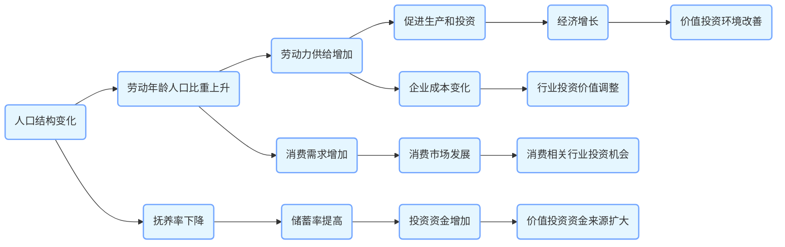

# 价值投资中的人口红利分析

> 关键词：价值投资、人口红利、经济增长、投资策略、人口结构、消费升级、劳动力市场

> 摘要：本文聚焦于价值投资中的人口红利分析，旨在深入探讨人口红利对价值投资的多方面影响。通过对人口红利的核心概念、形成机制以及与价值投资的内在联系进行剖析，阐述人口红利在经济增长、消费市场、劳动力市场等领域的作用原理。运用数学模型和具体案例，详细讲解如何在价值投资中考量人口红利因素。同时结合项目实战，展示基于人口红利分析的投资策略的实际应用。此外，还探讨了人口红利在不同实际场景中的体现以及相关工具和资源推荐。最后对人口红利未来发展趋势与挑战进行总结，并解答常见问题，为投资者在价值投资中把握人口红利提供全面且深入的参考。

## 1. 背景介绍 
### 1.1 目的和范围
在当今复杂多变的投资环境中，价值投资作为一种长期且稳健的投资理念备受关注。而人口因素作为影响经济和市场的关键变量，人口红利对价值投资有着深远的影响。本文的目的在于全面、系统地分析价值投资中的人口红利，深入探究人口红利的形成、发展以及其对不同行业和资产类别的影响，为投资者提供基于人口红利分析的价值投资策略和决策依据。范围涵盖人口红利的理论基础、与价值投资的关系、在不同经济领域的应用以及实际投资案例等方面。

### 1.2 预期读者
本文预期读者主要包括对价值投资有深入研究需求的投资者，无论是个人投资者还是机构投资者，希望通过人口红利分析来优化投资组合、提高投资收益；金融从业者，如分析师、基金经理等，有助于他们在研究和决策过程中更全面地考虑人口因素；以及对经济学、投资学相关领域感兴趣的学者和研究人员，为他们的学术研究提供参考和思路。

### 1.3 文档结构概述
本文首先介绍人口红利的背景知识，包括目的、读者和术语表。接着阐述人口红利的核心概念与联系，通过文本示意图和 Mermaid 流程图展示其原理和架构。然后详细讲解核心算法原理和具体操作步骤，结合 Python 代码进行说明。再通过数学模型和公式进一步分析人口红利对价值投资的影响，并举例说明。之后进行项目实战，包括开发环境搭建、源代码实现和代码解读。随后探讨人口红利的实际应用场景。推荐相关的工具和资源，包括学习资源、开发工具框架和论文著作。最后总结人口红利的未来发展趋势与挑战，解答常见问题，并提供扩展阅读和参考资料。

### 1.4 术语表
#### 1.4.1 核心术语定义
- **价值投资**：一种投资策略，强调通过分析企业的内在价值，寻找被低估的资产进行投资，以获取长期稳定的收益。
- **人口红利**：指一个国家或地区的劳动年龄人口占总人口比重较大，抚养率比较低，为经济发展创造了有利的人口条件，整个国家或地区的经济呈高储蓄、高投资和高增长的局面。
- **劳动年龄人口**：通常指处于一定年龄范围（如 15 - 64 岁）内，具有劳动能力的人口。
- **抚养率**：指非劳动年龄人口数与劳动年龄人口数之比，反映劳动年龄人口的抚养负担。

#### 1.4.2 相关概念解释
- **人口结构**：指人口的年龄、性别、职业、地域等方面的构成情况。人口结构的变化会直接影响人口红利的形成和发展。
- **消费升级**：随着经济发展和居民收入水平的提高，消费者对产品和服务的品质、种类、个性化等方面的需求不断提升的过程。人口红利在一定程度上会推动消费升级。
- **劳动力市场**：劳动力供求双方进行劳动力交易的场所和机制。人口红利的变化会对劳动力市场的供求关系、工资水平等产生重要影响。

#### 1.4.3 缩略词列表
- **GDP**：国内生产总值（Gross Domestic Product），是衡量一个国家或地区经济活动总量的重要指标。
- **CPI**：消费者物价指数（Consumer Price Index），反映居民家庭一般所购买的消费品和服务项目价格水平变动情况的宏观经济指标。

## 2. 核心概念与联系 
### 人口红利的形成原理
人口红利的形成主要与人口的年龄结构变化密切相关。在一个国家或地区的人口发展过程中，通常会经历三个阶段：高出生率、高死亡率阶段；高出生率、低死亡率阶段；低出生率、低死亡率阶段。当人口从高出生率、高死亡率阶段向高出生率、低死亡率阶段转变时，由于死亡率的下降，人口数量迅速增加，同时劳动年龄人口的比重逐渐上升，抚养率逐渐下降，从而形成人口红利。

### 人口红利与价值投资的联系
人口红利对价值投资有着多方面的影响。首先，在经济增长方面，丰富的劳动力资源可以促进生产和投资，推动经济的快速增长，从而为价值投资提供良好的宏观经济环境。其次，人口红利会带动消费市场的发展，随着劳动年龄人口收入的增加，消费需求也会相应增加，这为与消费相关的行业带来投资机会。此外，人口红利还会影响劳动力市场，进而影响企业的成本和竞争力，对不同行业的投资价值产生影响。

### 文本示意图
```plaintext
人口结构变化
|
|-- 劳动年龄人口比重上升
|   |
|   |-- 劳动力供给增加
|   |   |
|   |   |-- 促进生产和投资
|   |   |   |
|   |   |   |-- 经济增长
|   |   |   |   |
|   |   |   |   |-- 价值投资环境改善
|   |   |
|   |   |-- 企业成本变化
|   |       |
|   |       |-- 行业投资价值调整
|   |
|   |-- 消费需求增加
|       |
|       |-- 消费市场发展
|           |
|           |-- 消费相关行业投资机会
|
|-- 抚养率下降
|   |
|   |-- 储蓄率提高
|       |
|       |-- 投资资金增加
|           |
|           |-- 价值投资资金来源扩大
```

### Mermaid 流程图


## 3. 核心算法原理 & 具体操作步骤 
### 人口红利评估算法原理
为了在价值投资中更好地考量人口红利因素，我们可以构建一个人口红利评估模型。该模型主要基于劳动年龄人口数量、抚养率等指标来评估人口红利的大小。具体算法步骤如下：

1. **数据收集**：收集一个国家或地区的人口数据，包括不同年龄组的人口数量、出生率、死亡率等。
2. **计算劳动年龄人口数量**：根据设定的劳动年龄范围（如 15 - 64 岁），统计该年龄范围内的人口数量。
3. **计算抚养率**：抚养率 = （非劳动年龄人口数 / 劳动年龄人口数）× 100%。
4. **人口红利指数计算**：人口红利指数 = 劳动年龄人口数量 / 抚养率。

### Python 源代码实现
```python
# 示例数据
# 假设总人口数量为 10000，15 - 64 岁劳动年龄人口数量为 6000，非劳动年龄人口数量为 4000
total_population = 10000
working_age_population = 6000
non_working_age_population = 4000

# 计算抚养率
dependency_ratio = (non_working_age_population / working_age_population) * 100

# 计算人口红利指数
demographic_dividend_index = working_age_population / dependency_ratio

print(f"抚养率: {dependency_ratio:.2f}%")
print(f"人口红利指数: {demographic_dividend_index:.2f}")
```

### 具体操作步骤
1. **数据获取**：可以从政府统计部门、国际组织（如世界银行、联合国等）发布的统计数据中获取相关人口数据。
2. **数据预处理**：对获取的数据进行清洗和整理，确保数据的准确性和一致性。
3. **模型计算**：使用上述 Python 代码或其他编程语言实现的人口红利评估模型，计算抚养率和人口红利指数。
4. **结果分析**：根据计算结果，分析人口红利的大小和变化趋势，为价值投资决策提供参考。

## 4. 数学模型和公式 & 详细讲解 & 举例说明 
### 人口红利对经济增长的数学模型
经济增长可以用生产函数来表示，常见的生产函数为柯布 - 道格拉斯生产函数：
$$Y = AK^{\alpha}L^{\beta}$$
其中，$Y$ 表示总产出（GDP），$A$ 表示技术水平，$K$ 表示资本投入，$L$ 表示劳动力投入，$\alpha$ 和 $\beta$ 分别表示资本和劳动力的产出弹性，且 $\alpha + \beta = 1$。

在人口红利阶段，劳动力投入 $L$ 会随着劳动年龄人口的增加而增加，从而促进总产出 $Y$ 的增长。假设技术水平 $A$ 和资本投入 $K$ 保持不变，劳动力投入的增加会直接导致总产出的增加。

### 人口红利对消费市场的数学模型
消费函数可以表示为：
$$C = a + bY_d$$
其中，$C$ 表示消费支出，$a$ 表示自主消费，$b$ 表示边际消费倾向，$Y_d$ 表示可支配收入。

在人口红利阶段，劳动年龄人口的增加会带来可支配收入 $Y_d$ 的增加，从而导致消费支出 $C$ 的增加。边际消费倾向 $b$ 反映了消费者对收入增加的反应程度，不同年龄段的消费者边际消费倾向可能不同。

### 举例说明
假设一个国家的生产函数为 $Y = 10K^{0.3}L^{0.7}$，初始资本投入 $K = 100$，劳动力投入 $L = 100$。在人口红利阶段，劳动力投入增加到 $L = 120$，其他条件不变。

1. **计算初始总产出**：
$$Y_1 = 10\times100^{0.3}\times100^{0.7}= 10\times100 = 1000$$
2. **计算人口红利阶段总产出**：
$$Y_2 = 10\times100^{0.3}\times120^{0.7}\approx 10\times100\times1.14 = 1140$$
3. **总产出增加比例**：
$$\frac{Y_2 - Y_1}{Y_1}\times100\%=\frac{1140 - 1000}{1000}\times100\% = 14\%$$

这表明在人口红利阶段，由于劳动力投入的增加，总产出增长了 14%。

## 5. 项目实战：代码实际案例和详细解释说明 
### 5.1  开发环境搭建
- **操作系统**：Windows、Linux 或 macOS 均可。
- **编程语言**：Python 3.x。
- **开发工具**：可以使用 PyCharm、Jupyter Notebook 等集成开发环境。
- **相关库**：需要安装 pandas、numpy 等数据处理库。可以使用以下命令进行安装：
```sh
pip install pandas numpy
```

### 5.2  源代码详细实现和代码解读
```python
import pandas as pd
import numpy as np

# 读取人口数据文件（假设文件名为 population_data.csv）
data = pd.read_csv('population_data.csv')

# 提取劳动年龄人口数据和非劳动年龄人口数据
working_age_population = data['working_age_population']
non_working_age_population = data['non_working_age_population']

# 计算抚养率
dependency_ratio = (non_working_age_population / working_age_population) * 100

# 计算人口红利指数
demographic_dividend_index = working_age_population / dependency_ratio

# 将结果添加到数据框中
data['dependency_ratio'] = dependency_ratio
data['demographic_dividend_index'] = demographic_dividend_index

# 保存结果到新的 CSV 文件
data.to_csv('population_demographic_dividend.csv', index=False)

print("人口红利计算完成，结果已保存到 population_demographic_dividend.csv 文件中。")
```
### 代码解读
1. **数据读取**：使用 `pandas` 库的 `read_csv` 函数读取人口数据文件。
2. **数据提取**：从数据框中提取劳动年龄人口数据和非劳动年龄人口数据。
3. **抚养率计算**：根据抚养率的计算公式，计算抚养率。
4. **人口红利指数计算**：根据人口红利指数的计算公式，计算人口红利指数。
5. **结果保存**：将计算结果添加到数据框中，并使用 `to_csv` 函数保存到新的 CSV 文件中。

### 5.3  代码解读与分析
通过上述代码，我们可以对大量的人口数据进行批量处理，计算出不同年份或地区的抚养率和人口红利指数。这有助于我们分析人口红利的变化趋势，为价值投资决策提供数据支持。例如，如果某个地区的人口红利指数呈现上升趋势，说明该地区的人口红利在增强，可能会带来更多的投资机会。

## 6. 实际应用场景 
### 消费行业投资
在人口红利阶段，劳动年龄人口的增加会带来收入的增加，从而推动消费市场的发展。投资者可以关注与消费相关的行业，如食品饮料、家电、汽车、旅游等。例如，随着人们收入水平的提高，对高品质食品饮料的需求会增加，投资者可以选择投资一些知名的食品饮料企业。

### 房地产投资
人口红利对房地产市场也有重要影响。劳动年龄人口的增加会带来住房需求的增加，尤其是首次购房需求。此外，人口的流动也会影响不同地区的房地产市场。投资者可以根据人口红利的分布和变化趋势，选择有潜力的房地产项目进行投资。

### 劳动力密集型产业投资
在人口红利阶段，劳动力资源丰富，劳动力成本相对较低，这为劳动力密集型产业提供了发展机遇。投资者可以关注制造业、纺织业、电子装配业等劳动力密集型产业，选择具有成本优势和市场竞争力的企业进行投资。

### 教育和培训行业投资
随着人口红利的发展，人们对教育和培训的需求也会增加。投资者可以关注教育和培训行业，如在线教育、职业培训等领域。这些行业可以满足人们提升自身技能和知识的需求，具有较大的发展潜力。

## 7. 工具和资源推荐
### 7.1 学习资源推荐
#### 7.1.1 书籍推荐
- 《人口经济学》：全面介绍了人口与经济之间的关系，包括人口增长、人口结构变化对经济的影响等内容，对于理解人口红利的理论基础有很大帮助。
- 《价值投资实战手册》：详细讲解了价值投资的理论和方法，结合实际案例分析如何在投资中运用价值投资策略，对在人口红利背景下进行价值投资有很好的指导作用。
- 《经济学原理》：经典的经济学教材，涵盖了宏观经济学和微观经济学的基本原理，有助于投资者建立扎实的经济学基础，更好地理解人口红利对经济的影响。

#### 7.1.2 在线课程
- Coursera 上的“人口经济学”课程：由知名高校的教授授课，系统地介绍了人口经济学的理论和方法，通过案例分析和互动讨论，帮助学习者深入理解人口红利的相关知识。
- 网易云课堂上的“价值投资入门与实战”课程：由投资领域的专家讲解价值投资的理念和技巧，结合市场动态和案例分析，让学习者掌握价值投资的实践方法。
- edX 上的“宏观经济学原理”课程：提供了宏观经济学的基础知识，包括经济增长、就业、通货膨胀等内容，对于理解人口红利与宏观经济的关系有很大帮助。

#### 7.1.3 技术博客和网站
- 雪球网：国内知名的投资社区，提供了丰富的投资资讯、研究报告和投资者的交流分享。在雪球网上可以找到关于人口红利和价值投资的相关讨论和分析。
- 东方财富网：提供全面的金融信息和数据服务，包括宏观经济数据、行业数据、公司财报等。投资者可以通过东方财富网获取与人口红利相关的经济数据和市场信息。
- 国家统计局官网：提供权威的统计数据，包括人口数据、经济数据等。投资者可以从国家统计局官网获取最新的人口结构数据，为人口红利分析提供数据支持。

### 7.2 开发工具框架推荐
#### 7.2.1 IDE和编辑器
- PyCharm：功能强大的 Python 集成开发环境，提供代码编辑、调试、版本控制等功能，适合开发基于 Python 的人口红利分析和价值投资模型。
- Jupyter Notebook：交互式的开发环境，支持 Python、R 等多种编程语言。通过 Jupyter Notebook 可以方便地进行数据探索、模型构建和结果展示，适合进行数据分析和可视化。
- Visual Studio Code：轻量级的代码编辑器，支持多种编程语言和插件扩展。可以通过安装相关插件，实现 Python 代码的编辑、调试和版本控制等功能。

#### 7.2.2 调试和性能分析工具
- Py-Spy：用于分析 Python 程序的性能，通过采样的方式分析程序的运行时间和函数调用情况，帮助开发者找出性能瓶颈。
- cProfile：Python 内置的性能分析工具，可以统计函数的调用次数、执行时间等信息，帮助开发者优化代码性能。
- pdb：Python 内置的调试器，可以在代码中设置断点，单步执行代码，查看变量的值，帮助开发者调试程序。

#### 7.2.3 相关框架和库
- pandas：强大的数据处理和分析库，提供了数据结构（如 DataFrame）和数据操作方法，方便进行人口数据的读取、清洗和处理。
- numpy：用于科学计算的基础库，提供了高效的数组操作和数学函数，在人口红利分析的数学模型计算中发挥重要作用。
- matplotlib：常用的数据可视化库，可以绘制各种图表（如折线图、柱状图、散点图等），帮助开发者直观地展示人口红利分析的结果。

### 7.3 相关论文著作推荐
#### 7.3.1 经典论文
- 《The Demographic Dividend: A New Perspective on the Economic Consequences of Population Change》：该论文深入探讨了人口红利的概念、形成机制和对经济增长的影响，是人口红利研究领域的经典之作。
- 《Value Investing: The Use of Historical Financial Statement Information to Separate Winners from Losers》：详细阐述了价值投资的理论和方法，通过对历史财务报表信息的分析，筛选出有投资价值的企业，对在人口红利背景下进行价值投资有重要的参考价值。
- 《The Impact of Population Aging on Economic Growth, the Labor Force and Productivity》：研究了人口老龄化对经济增长、劳动力市场和生产率的影响，为投资者在人口结构变化的背景下进行投资决策提供了理论依据。

#### 7.3.2 最新研究成果
- 关注国际顶级学术期刊（如《Journal of Economic Growth》、《Review of Economics and Statistics》等）上关于人口经济学和价值投资的最新研究论文，了解该领域的前沿动态和研究成果。
- 参加国内外的学术会议和研讨会，与相关领域的专家学者交流，获取最新的研究进展和观点。

#### 7.3.3 应用案例分析
- 一些知名投资机构（如巴菲特的伯克希尔·哈撒韦公司、彼得·林奇的富达麦哲伦基金等）的投资案例分析，研究他们在不同人口结构和经济环境下的投资策略和决策过程，从中学习价值投资的实践经验。
- 行业研究报告和案例分析，如房地产行业、消费行业等，分析人口红利对不同行业的影响以及企业的应对策略，为投资者提供具体的投资参考。

## 8. 总结：未来发展趋势与挑战
### 未来发展趋势
- **人口结构变化**：随着全球人口老龄化的加剧，人口红利逐渐减弱，劳动年龄人口比重下降，抚养率上升。这将对经济增长和价值投资带来新的挑战和机遇。一些国家和地区可能会通过调整生育政策、吸引移民等方式来缓解人口老龄化的压力，维持一定的人口红利。
- **消费升级加速**：尽管人口红利减弱，但随着科技的进步和人们生活水平的提高，消费升级的趋势将继续加速。消费者对高品质、个性化、智能化的产品和服务的需求将不断增加，这将为相关行业带来新的投资机会。
- **科技创新驱动**：科技创新将成为推动经济增长和价值投资的重要力量。在人口红利减弱的情况下，通过科技创新提高劳动生产率、降低生产成本，将成为企业和投资者的重要选择。人工智能、大数据、物联网等新兴技术的发展将为各个行业带来变革和机遇。

### 挑战
- **劳动力短缺**：人口老龄化导致劳动年龄人口减少，可能会出现劳动力短缺的问题。这将对劳动力密集型产业造成较大冲击，企业需要提高自动化水平、优化生产流程来应对劳动力短缺的挑战。
- **社会保障压力增大**：随着老年人口的增加，社会保障压力将不断增大。政府需要加大对养老、医疗等社会保障领域的投入，这可能会对财政收支产生一定影响，进而影响经济增长和投资环境。
- **投资难度增加**：在人口结构变化和经济环境不确定性增加的情况下，价值投资的难度也将增加。投资者需要更加深入地研究人口红利的变化趋势和影响，结合宏观经济形势和行业发展动态，制定更加科学合理的投资策略。

## 9. 附录：常见问题与解答
### 问题 1：人口红利消失后，价值投资还有机会吗？
解答：人口红利消失并不意味着价值投资没有机会。虽然人口红利减弱会对一些传统行业产生影响，但同时也会带来新的投资机会。例如，随着人口老龄化的加剧，养老、医疗、健康等行业将迎来发展机遇；科技创新的发展也将为新兴产业带来投资机会。投资者可以关注这些领域，寻找具有投资价值的企业。

### 问题 2：如何准确评估人口红利对不同行业的影响？
解答：评估人口红利对不同行业的影响需要综合考虑多个因素。首先，要分析行业的需求特征，了解该行业的产品或服务是否与人口结构和消费需求密切相关。其次，要考虑行业的供给特征，如劳动力成本、技术水平等。此外，还可以通过历史数据和统计分析，研究人口红利与行业发展之间的关系。最后，结合宏观经济形势和政策环境，对人口红利对行业的影响进行综合评估。

### 问题 3：在人口红利背景下，如何选择价值投资的标的？
解答：在人口红利背景下，选择价值投资的标的可以从以下几个方面考虑。一是关注与消费相关的行业，选择具有品牌优势、市场份额较大、盈利能力较强的企业。二是关注劳动力密集型产业中具有成本优势和技术创新能力的企业。三是关注科技创新领域，选择具有核心技术和发展潜力的企业。此外，还需要对企业的财务状况、管理团队、行业竞争等方面进行深入分析，确保选择的投资标的具有较高的投资价值。

## 10. 扩展阅读 & 参考资料
### 扩展阅读
- 《人口大逆转：老龄化、不平等与通胀回归》：探讨了人口老龄化对全球经济和金融市场的影响，为投资者在人口结构变化的背景下进行投资决策提供了新的视角。
- 《聪明的投资者》：本杰明·格雷厄姆的经典著作，详细阐述了价值投资的理念和方法，是价值投资者的必读之书。
- 《创新者的窘境》：介绍了创新对企业和行业的影响，帮助投资者理解科技创新在人口红利变化背景下的重要性。

### 参考资料
- 国家统计局发布的统计年鉴和相关数据报告。
- 世界银行、联合国等国际组织发布的人口数据和经济研究报告。
- 金融机构和研究机构发布的行业研究报告和投资分析报告。