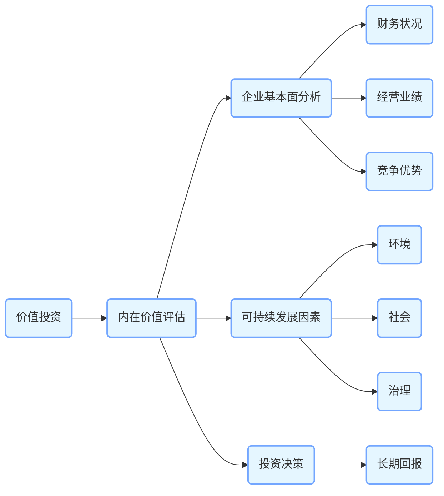

# 价值投资中的可持续发展因素

> 关键词：价值投资、可持续发展、ESG、长期回报、社会责任、环境因素、企业治理

> 摘要：本文深入探讨了价值投资中可持续发展因素的重要性及其影响。随着全球对可持续发展的关注度不断提高，投资者越来越意识到在价值投资决策中纳入可持续发展因素的必要性。文章首先介绍了研究的背景、目的、预期读者等内容，接着阐述了价值投资与可持续发展的核心概念及联系，详细讲解了相关算法原理和数学模型，通过项目实战案例展示了如何在实际中运用这些理论，分析了实际应用场景，推荐了相关的工具和资源，最后总结了未来发展趋势与挑战，并对常见问题进行了解答。旨在帮助投资者更好地理解和运用可持续发展因素进行价值投资，实现长期的投资回报和社会价值。

## 1. 背景介绍 
### 1.1 目的和范围
在当今金融市场中，价值投资一直是投资者追求长期稳定回报的重要策略。然而，随着社会对环境、社会和治理（ESG）等可持续发展问题的关注度日益增加，传统的价值投资理念也在不断演变。本研究的目的在于深入探讨可持续发展因素在价值投资中的作用和影响，为投资者提供全面的理论和实践指导。研究范围涵盖了可持续发展因素的各个方面，包括环境影响、社会责任履行和企业治理水平，以及这些因素如何影响企业的长期价值和投资决策。

### 1.2 预期读者
本文预期读者包括金融投资者、投资顾问、企业管理者、学术研究人员以及对价值投资和可持续发展感兴趣的各界人士。对于投资者而言，希望通过本文了解如何将可持续发展因素纳入投资决策，以实现更好的投资回报和风险管理；企业管理者可以从中学习如何提升企业的可持续发展水平，增强企业的竞争力和长期价值；学术研究人员则可以将本文作为进一步研究的参考资料；而对普通读者来说，本文可以帮助他们更好地理解价值投资和可持续发展的相关概念和关系。

### 1.3 文档结构概述
本文共分为十个部分。第一部分为背景介绍，阐述了研究的目的、预期读者和文档结构概述；第二部分介绍了价值投资与可持续发展的核心概念及联系，包括相关原理和架构，并通过流程图进行展示；第三部分详细讲解了核心算法原理和具体操作步骤，同时使用Python源代码进行阐述；第四部分介绍了数学模型和公式，并通过举例进行详细说明；第五部分是项目实战，包括开发环境搭建、源代码实现和代码解读；第六部分分析了实际应用场景；第七部分推荐了相关的工具和资源，包括学习资源、开发工具框架和相关论文著作；第八部分总结了未来发展趋势与挑战；第九部分是附录，解答了常见问题；第十部分提供了扩展阅读和参考资料。

### 1.4 术语表
#### 1.4.1 核心术语定义
- **价值投资**：一种投资策略，通过评估企业的内在价值，寻找被低估的股票进行投资，以获取长期的投资回报。
- **可持续发展**：指既满足当代人的需求，又不损害后代人满足其需求的能力的发展模式，包括经济、社会和环境的可持续性。
- **ESG**：环境（Environment）、社会（Social）和治理（Governance）的缩写，是衡量企业可持续发展表现的重要指标。
- **内在价值**：企业的真实价值，通常通过对企业的财务状况、经营业绩、竞争优势等因素进行分析和评估得出。
- **长期回报**：投资者在较长时间内获得的投资收益，通常与短期投机行为相对。

#### 1.4.2 相关概念解释
- **环境因素**：包括企业的能源消耗、温室气体排放、水资源管理、废弃物处理等方面的表现，反映了企业对环境的影响和可持续发展能力。
- **社会责任**：企业在经营过程中对员工、客户、社区、供应商等利益相关者应承担的责任，包括员工权益保护、产品质量安全、社区参与等方面。
- **企业治理**：企业的组织架构、决策机制、内部控制、信息披露等方面的制度和实践，良好的企业治理有助于保障股东权益和企业的长期稳定发展。

#### 1.4.3 缩略词列表
- **ESG**：环境、社会和治理（Environment, Social, Governance）
- **ROE**：净资产收益率（Return on Equity）
- **EPS**：每股收益（Earnings Per Share）

## 2. 核心概念与联系 
### 价值投资的核心原理
价值投资的核心原理是基于企业的内在价值进行投资决策。投资者通过对企业的财务报表、经营状况、行业竞争力等因素进行深入分析，评估企业的内在价值。如果股票价格低于企业的内在价值，投资者认为该股票被低估，具有投资价值；反之，如果股票价格高于企业的内在价值，投资者则认为该股票被高估，应避免投资。

### 可持续发展的内涵
可持续发展强调经济、社会和环境的协调发展。在企业层面，可持续发展要求企业在追求经济利益的同时，也要关注环境影响和社会责任。企业的可持续发展表现不仅关系到其自身的长期生存和发展，也对社会和环境产生重要影响。

### 价值投资与可持续发展的联系
价值投资与可持续发展之间存在着密切的联系。一方面，具有良好可持续发展表现的企业通常具有更强的竞争力和抗风险能力，能够实现长期稳定的经营业绩，从而提升企业的内在价值。例如，注重环境保护的企业可以降低环境风险，减少因环境问题导致的法律诉讼和声誉损失；积极履行社会责任的企业可以提高员工的满意度和忠诚度，增强客户的信任和口碑，促进企业的长期发展。另一方面，价值投资者越来越认识到可持续发展因素对企业长期价值的影响，将可持续发展因素纳入投资决策可以帮助投资者更好地评估企业的风险和回报，实现长期的投资目标。

### 文本示意图
价值投资与可持续发展的关系可以用以下文本示意图表示：

价值投资 <-- 内在价值评估 <-- 企业基本面分析（财务状况、经营业绩、竞争优势等） + 可持续发展因素（环境、社会、治理） --> 投资决策 --> 长期回报

### Mermaid 流程图


## 3. 核心算法原理 & 具体操作步骤 
### 核心算法原理
在价值投资中，评估企业的内在价值是关键。常用的方法包括现金流折现法（DCF）、相对估值法等。而在考虑可持续发展因素时，可以通过构建可持续发展评分体系，对企业的ESG表现进行量化评估，并将其纳入内在价值的评估模型中。

以下是一个简化的内在价值评估模型，考虑了可持续发展因素：

内在价值 = 传统估值价值 + 可持续发展调整价值

传统估值价值可以通过现金流折现法或相对估值法计算得出。可持续发展调整价值则根据企业的ESG评分进行调整。假设企业的ESG评分为 $ESG_{score}$，调整系数为 $\alpha$，则可持续发展调整价值为：

可持续发展调整价值 = $\alpha \times ESG_{score}$

### 具体操作步骤
1. **数据收集**：收集企业的财务数据、经营数据以及ESG相关数据。财务数据包括收入、利润、资产负债表等；经营数据包括市场份额、客户满意度等；ESG数据包括环境指标（如能源消耗、温室气体排放等）、社会指标（如员工满意度、社区参与度等）和治理指标（如董事会结构、信息披露等）。
2. **传统估值计算**：根据收集到的财务数据和经营数据，使用现金流折现法或相对估值法计算企业的传统估值价值。
3. **ESG评分计算**：根据收集到的ESG数据，构建ESG评分体系，对企业的ESG表现进行量化评估，得出企业的ESG评分。
4. **可持续发展调整价值计算**：根据企业的ESG评分和调整系数 $\alpha$，计算可持续发展调整价值。
5. **内在价值计算**：将传统估值价值和可持续发展调整价值相加，得到考虑可持续发展因素后的企业内在价值。
6. **投资决策**：将计算得到的内在价值与股票价格进行比较，如果股票价格低于内在价值，则认为该股票被低估，具有投资价值；反之，如果股票价格高于内在价值，则认为该股票被高估，应避免投资。

### Python源代码实现
```python
# 定义传统估值计算函数
def traditional_valuation(financial_data, operating_data):
    # 这里简单假设传统估值价值为财务数据中的净利润乘以一个倍数
    net_income = financial_data['net_income']
    multiple = 10
    return net_income * multiple

# 定义ESG评分计算函数
def esg_score(esg_data):
    # 这里简单假设ESG评分是环境、社会和治理指标的平均值
    environment_score = esg_data['environment_score']
    social_score = esg_data['social_score']
    governance_score = esg_data['governance_score']
    return (environment_score + social_score + governance_score) / 3

# 定义可持续发展调整价值计算函数
def sustainable_adjustment_value(esg_score, alpha):
    return alpha * esg_score

# 定义内在价值计算函数
def intrinsic_value(financial_data, operating_data, esg_data, alpha):
    traditional_value = traditional_valuation(financial_data, operating_data)
    esg_score_value = esg_score(esg_data)
    adjustment_value = sustainable_adjustment_value(esg_score_value, alpha)
    return traditional_value + adjustment_value

# 示例数据
financial_data = {
    'net_income': 1000000
}
operating_data = {}
esg_data = {
    'environment_score': 80,
    'social_score': 70,
    'governance_score': 90
}
alpha = 1000

# 计算内在价值
intrinsic_val = intrinsic_value(financial_data, operating_data, esg_data, alpha)
print(f"考虑可持续发展因素后的内在价值: {intrinsic_val}")
```

## 4. 数学模型和公式 & 详细讲解 & 举例说明 
### 现金流折现法（DCF）
现金流折现法是一种常用的估值方法，其基本原理是将企业未来的现金流折现到当前时点，以计算企业的内在价值。具体公式如下：

$$V = \sum_{t=1}^{n} \frac{FCF_t}{(1 + r)^t} + \frac{TV}{(1 + r)^n}$$

其中，$V$ 表示企业的内在价值，$FCF_t$ 表示第 $t$ 期的自由现金流，$r$ 表示折现率，$n$ 表示预测期数，$TV$ 表示终值。

### 自由现金流（FCF）的计算
自由现金流是指企业在满足了所有运营成本和资本支出后剩余的现金流，其计算公式如下：

$$FCF = EBIT(1 - T) + Dep - CapEx - \Delta NWC$$

其中，$EBIT$ 表示息税前利润，$T$ 表示所得税率，$Dep$ 表示折旧和摊销，$CapEx$ 表示资本支出，$\Delta NWC$ 表示净营运资本的变化。

### 终值（TV）的计算
终值是指预测期结束后企业的价值，常用的计算方法是永续增长模型，其公式如下：

$$TV = \frac{FCF_{n+1}}{r - g}$$

其中，$FCF_{n+1}$ 表示预测期结束后下一期的自由现金流，$g$ 表示永续增长率。

### 举例说明
假设某企业的息税前利润为 $1000$ 万元，所得税率为 $25\%$，折旧和摊销为 $200$ 万元，资本支出为 $300$ 万元，净营运资本的变化为 $100$ 万元。预测期为 $5$ 年，折现率为 $10\%$，永续增长率为 $3\%$。

1. **计算自由现金流**
    - 第 1 年自由现金流：
        $FCF_1 = 1000(1 - 0.25) + 200 - 300 - 100 = 550$（万元）
    - 假设后续每年自由现金流以 $5\%$ 的速度增长，则：
        $FCF_2 = 550(1 + 0.05) = 577.5$（万元）
        $FCF_3 = 577.5(1 + 0.05) = 606.375$（万元）
        $FCF_4 = 606.375(1 + 0.05) = 636.694$（万元）
        $FCF_5 = 636.694(1 + 0.05) = 668.529$（万元）

2. **计算终值**
    - 预测期结束后下一期的自由现金流：
        $FCF_6 = 668.529(1 + 0.03) = 688.585$（万元）
    - 终值：
        $TV = \frac{688.585}{0.1 - 0.03} = 9836.93$（万元）

3. **计算内在价值**
    - 内在价值：
        $V = \frac{550}{(1 + 0.1)^1} + \frac{577.5}{(1 + 0.1)^2} + \frac{606.375}{(1 + 0.1)^3} + \frac{636.694}{(1 + 0.1)^4} + \frac{668.529}{(1 + 0.1)^5} + \frac{9836.93}{(1 + 0.1)^5}$
        $V = 500 + 477.73 + 455.26 + 433.64 + 412.86 + 6108.84 = 8388.33$（万元）

### 考虑可持续发展因素的调整
在上述计算的基础上，我们可以根据企业的ESG评分对内在价值进行调整。假设企业的ESG评分为 $80$ 分，调整系数为 $100$，则可持续发展调整价值为：

可持续发展调整价值 = $100 \times 80 = 8000$（万元）

考虑可持续发展因素后的内在价值 = $8388.33 + 8000 = 16388.33$（万元）

## 5. 项目实战：代码实际案例和详细解释说明 
### 5.1  开发环境搭建
1. **安装Python**：从Python官方网站（https://www.python.org/downloads/）下载并安装Python 3.x 版本。
2. **安装必要的库**：使用pip命令安装以下必要的库：
    - `pandas`：用于数据处理和分析。
    - `numpy`：用于数值计算。
    - `matplotlib`：用于数据可视化。

```bash
pip install pandas numpy matplotlib
```

### 5.2  源代码详细实现和代码解读
```python
import pandas as pd
import numpy as np
import matplotlib.pyplot as plt

# 定义数据加载函数
def load_data(file_path):
    data = pd.read_csv(file_path)
    return data

# 定义传统估值计算函数
def traditional_valuation(financial_data):
    # 这里简单假设传统估值价值为财务数据中的净利润乘以一个倍数
    net_income = financial_data['net_income']
    multiple = 10
    return net_income * multiple

# 定义ESG评分计算函数
def esg_score(esg_data):
    # 这里简单假设ESG评分是环境、社会和治理指标的平均值
    environment_score = esg_data['environment_score']
    social_score = esg_data['social_score']
    governance_score = esg_data['governance_score']
    return (environment_score + social_score + governance_score) / 3

# 定义可持续发展调整价值计算函数
def sustainable_adjustment_value(esg_score, alpha):
    return alpha * esg_score

# 定义内在价值计算函数
def intrinsic_value(financial_data, esg_data, alpha):
    traditional_value = traditional_valuation(financial_data)
    esg_score_value = esg_score(esg_data)
    adjustment_value = sustainable_adjustment_value(esg_score_value, alpha)
    return traditional_value + adjustment_value

# 主函数
def main():
    # 加载数据
    financial_data = load_data('financial_data.csv')
    esg_data = load_data('esg_data.csv')
    
    # 调整系数
    alpha = 1000
    
    # 计算内在价值
    intrinsic_values = []
    for i in range(len(financial_data)):
        fin_data = financial_data.iloc[i]
        esg_d = esg_data.iloc[i]
        intrinsic_val = intrinsic_value(fin_data, esg_d, alpha)
        intrinsic_values.append(intrinsic_val)
    
    # 可视化内在价值
    plt.plot(intrinsic_values)
    plt.xlabel('Company Index')
    plt.ylabel('Intrinsic Value')
    plt.title('Intrinsic Value of Companies Considering Sustainable Development')
    plt.show()

if __name__ == "__main__":
    main()
```

### 5.3  代码解读与分析
1. **数据加载函数**：`load_data` 函数用于从CSV文件中加载财务数据和ESG数据。
2. **传统估值计算函数**：`traditional_valuation` 函数根据财务数据中的净利润乘以一个倍数计算传统估值价值。
3. **ESG评分计算函数**：`esg_score` 函数根据环境、社会和治理指标的平均值计算ESG评分。
4. **可持续发展调整价值计算函数**：`sustainable_adjustment_value` 函数根据ESG评分和调整系数计算可持续发展调整价值。
5. **内在价值计算函数**：`intrinsic_value` 函数将传统估值价值和可持续发展调整价值相加，得到考虑可持续发展因素后的内在价值。
6. **主函数**：`main` 函数负责加载数据、计算内在价值并进行可视化。

通过这个项目实战，我们可以看到如何将可持续发展因素纳入价值投资的评估模型中，并通过代码实现具体的计算和可视化。

## 6. 实际应用场景 
### 机构投资者
机构投资者，如养老基金、保险公司、共同基金等，越来越重视可持续发展因素在投资决策中的作用。他们通过构建可持续发展投资策略，筛选出具有良好ESG表现的企业进行投资，以实现长期的投资回报和社会责任。例如，一些养老基金将ESG因素纳入投资决策流程，要求投资组合中的企业在环境、社会和治理方面达到一定的标准，以降低投资风险，保障养老金的安全和增值。

### 个人投资者
个人投资者也逐渐认识到可持续发展因素对投资的重要性。他们在选择投资标的时，会关注企业的ESG表现，倾向于投资那些具有良好社会形象和可持续发展能力的企业。例如，一些个人投资者会选择投资可再生能源、环保科技等领域的企业，既希望获得投资回报，又希望为社会的可持续发展做出贡献。

### 企业管理者
企业管理者在制定战略和决策时，也需要考虑可持续发展因素。良好的ESG表现可以提升企业的声誉和竞争力，吸引投资者和客户。例如，企业可以通过改善环境管理、加强社会责任履行和完善企业治理等方面的工作，提高企业的ESG评分，从而获得更高的估值和市场认可。

### 政策制定者
政策制定者可以通过制定相关政策和法规，引导企业和投资者关注可持续发展。例如，政府可以出台税收优惠政策，鼓励企业加大在环境保护和社会责任方面的投入；也可以要求上市公司披露ESG信息，提高企业的透明度和可持续发展意识。

## 7. 工具和资源推荐
### 7.1 学习资源推荐
#### 7.1.1 书籍推荐
- 《价值投资：从格雷厄姆到巴菲特》：本书系统地介绍了价值投资的理论和方法，是价值投资领域的经典著作。
- 《可持续发展投资：创造长期价值》：本书深入探讨了可持续发展投资的理念、策略和实践，为投资者提供了全面的指导。
- 《ESG投资：从入门到精通》：本书详细介绍了ESG投资的相关知识和方法，是学习ESG投资的优秀读物。

#### 7.1.2 在线课程
- Coursera上的“价值投资基础”课程：该课程由知名教授授课，系统地介绍了价值投资的基本原理和方法。
- edX上的“可持续发展金融”课程：该课程深入探讨了可持续发展金融的理论和实践，帮助学习者了解可持续发展因素在金融领域的应用。
- Udemy上的“ESG投资实战”课程：该课程通过实际案例和操作演示，帮助学习者掌握ESG投资的具体方法和技巧。

#### 7.1.3 技术博客和网站
- Seeking Alpha：一个知名的金融投资博客网站，提供了大量关于价值投资和可持续发展投资的文章和分析。
- ESG Today：专注于ESG领域的资讯网站，提供了最新的ESG新闻、研究报告和行业动态。
- MSCI ESG Research：全球领先的ESG研究机构，其网站提供了丰富的ESG数据和研究报告。

### 7.2 开发工具框架推荐
#### 7.2.1 IDE和编辑器
- PyCharm：一款专业的Python集成开发环境，提供了丰富的功能和工具，方便开发者进行Python代码的编写、调试和管理。
- Visual Studio Code：一款轻量级的代码编辑器，支持多种编程语言，具有丰富的插件生态系统，可以满足不同开发者的需求。

#### 7.2.2 调试和性能分析工具
- pdb：Python自带的调试工具，可以帮助开发者调试Python代码，查找和解决问题。
- cProfile：Python的性能分析工具，可以帮助开发者分析代码的性能瓶颈，优化代码性能。

#### 7.2.3 相关框架和库
- pandas：用于数据处理和分析的Python库，提供了高效的数据结构和数据操作方法。
- numpy：用于数值计算的Python库，提供了丰富的数学函数和数组操作方法。
- matplotlib：用于数据可视化的Python库，提供了多种绘图工具和图表类型。

### 7.3 相关论文著作推荐
#### 7.3.1 经典论文
- “The Intelligent Investor” by Benjamin Graham：价值投资领域的经典论文，阐述了价值投资的基本理念和方法。
- “Corporate Social Responsibility: A Theory of the Firm Perspective” by Michael E. Porter and Mark R. Kramer：该论文从企业战略的角度探讨了企业社会责任的重要性和实施方法。
- “ESG and Financial Performance: Aggregated Evidence from More than 2000 Empirical Studies” by Friede, G., Busch, T., & Bassen, A.：该论文对2000多项关于ESG与财务绩效关系的实证研究进行了综合分析，得出了ESG与财务绩效正相关的结论。

#### 7.3.2 最新研究成果
- 近年来，关于可持续发展投资的研究不断涌现，许多学者和研究机构在该领域取得了重要的研究成果。可以通过学术数据库，如Web of Science、Scopus等，查找最新的研究论文和报告。

#### 7.3.3 应用案例分析
- 一些知名的投资机构和企业会发布关于可持续发展投资的应用案例分析，这些案例可以帮助我们更好地理解可持续发展因素在实际投资中的应用和效果。例如，贝莱德、富达等投资机构的官方网站上会发布相关的案例研究报告。

## 8. 总结：未来发展趋势与挑战
### 未来发展趋势
1. **可持续发展投资将成为主流**：随着全球对可持续发展问题的关注度不断提高，投资者对可持续发展投资的需求也将不断增加。未来，可持续发展投资将逐渐成为主流投资策略，更多的投资者将把可持续发展因素纳入投资决策中。
2. **ESG数据和评级体系将不断完善**：目前，ESG数据的质量和可比性还存在一定的问题，评级体系也不够完善。未来，随着数据收集和分析技术的不断进步，ESG数据的质量和可比性将得到提高，评级体系也将更加科学和完善。
3. **企业将更加重视可持续发展**：企业将越来越认识到可持续发展对企业长期价值的重要性，将更加重视ESG表现，积极采取措施改善环境管理、加强社会责任履行和完善企业治理。
4. **政策支持将不断加强**：政府将出台更多的政策和法规，引导企业和投资者关注可持续发展。例如，加大对可再生能源、环保产业等领域的支持力度，推动绿色金融的发展。

### 挑战
1. **数据质量和可比性问题**：目前，ESG数据的质量和可比性还存在一定的问题，不同机构发布的ESG数据和评级结果可能存在差异，这给投资者的决策带来了一定的困难。
2. **可持续发展因素的量化和评估困难**：可持续发展因素涉及环境、社会和治理等多个方面，难以进行准确的量化和评估。如何建立科学合理的量化和评估模型，是当前面临的一个重要挑战。
3. **短期利益与长期价值的平衡**：在价值投资中，投资者往往更关注短期的投资回报，而可持续发展因素对企业长期价值的影响可能需要较长时间才能显现。如何平衡短期利益与长期价值，是投资者需要面对的一个难题。
4. **投资者教育不足**：目前，很多投资者对可持续发展投资的理念和方法还不够了解，缺乏相关的知识和技能。加强投资者教育，提高投资者的可持续发展意识和投资能力，是推动可持续发展投资发展的关键。

## 9. 附录：常见问题与解答
### 1. 什么是价值投资？
价值投资是一种投资策略，通过评估企业的内在价值，寻找被低估的股票进行投资，以获取长期的投资回报。价值投资者关注企业的基本面，如财务状况、经营业绩、竞争优势等，而不是短期的市场波动。

### 2. 为什么要在价值投资中考虑可持续发展因素？
在价值投资中考虑可持续发展因素有以下几个原因：
- 具有良好可持续发展表现的企业通常具有更强的竞争力和抗风险能力，能够实现长期稳定的经营业绩，从而提升企业的内在价值。
- 投资者越来越关注企业的社会责任和环境影响，将可持续发展因素纳入投资决策可以满足投资者的需求，提高投资者的满意度和忠诚度。
- 政府和监管机构对企业的可持续发展要求越来越高，企业如果不重视可持续发展，可能面临法律风险和声誉损失。

### 3. 如何评估企业的ESG表现？
评估企业的ESG表现可以通过以下几种方式：
- **ESG评级机构**：一些专业的ESG评级机构，如MSCI、Sustainalytics等，会对企业的ESG表现进行评估和评级，投资者可以参考这些评级结果。
- **企业披露的ESG报告**：企业会定期发布ESG报告，披露其在环境、社会和治理方面的表现和措施，投资者可以通过阅读企业的ESG报告来了解企业的ESG表现。
- **自主评估**：投资者也可以根据自己的标准和方法，对企业的ESG表现进行自主评估。

### 4. 可持续发展调整价值的调整系数 $\alpha$ 如何确定？
调整系数 $\alpha$ 的确定需要考虑多个因素，如市场环境、行业特点、企业的ESG表现等。一般来说，可以通过历史数据的分析和回归分析等方法来确定调整系数。也可以参考同行业其他企业的经验数据，或者根据专家的意见进行设定。

### 5. 可持续发展投资是否会降低投资回报？
研究表明，可持续发展投资并不一定会降低投资回报。相反，具有良好ESG表现的企业往往具有更强的竞争力和抗风险能力，能够实现长期稳定的经营业绩，从而为投资者带来更好的投资回报。当然，投资回报还受到多种因素的影响，如市场环境、行业竞争等，投资者需要综合考虑各种因素进行投资决策。

## 10. 扩展阅读 & 参考资料
### 扩展阅读
- 《金融炼金术》：作者乔治·索罗斯，本书介绍了作者的投资理念和方法，对价值投资和金融市场有深入的分析。
- 《聪明的投资者》：作者本杰明·格雷厄姆，价值投资领域的经典著作，对价值投资的理论和实践有详细的阐述。
- 《ESG投资的未来》：本书探讨了ESG投资的未来发展趋势和机遇，对投资者和企业管理者有一定的参考价值。

### 参考资料
- MSCI ESG Research Reports：MSCI发布的ESG研究报告，提供了丰富的ESG数据和分析。
- Sustainalytics ESG Ratings：Sustainalytics发布的ESG评级数据，可用于评估企业的ESG表现。
- 各国政府和监管机构发布的关于可持续发展和金融市场的政策文件和法规。