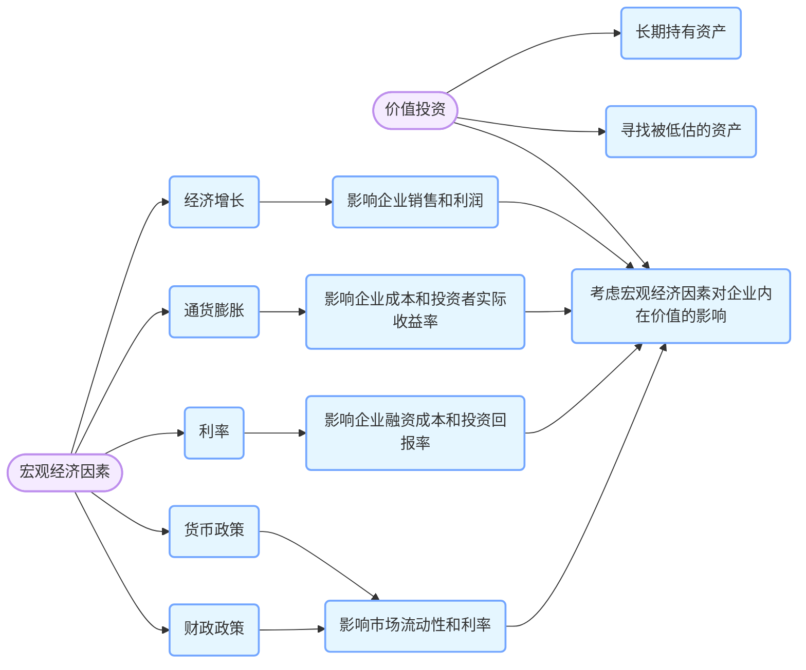

# 价值投资中的宏观经济因素考虑

> 关键词：价值投资、宏观经济因素、经济周期、货币政策、财政政策、行业分析、企业估值

> 摘要：本文旨在深入探讨价值投资中宏观经济因素的重要性及其影响。通过对宏观经济各要素如经济周期、货币政策、财政政策等的分析，阐述它们如何作用于价值投资决策。同时，结合数学模型和实际案例，展示如何将宏观经济因素纳入价值投资的具体操作中。此外，还介绍了相关的工具和资源，以及对未来价值投资受宏观经济因素影响的发展趋势与挑战的分析，为投资者在价值投资过程中更好地考虑宏观经济因素提供全面的参考。

## 1. 背景介绍 

### 1.1 目的和范围
价值投资作为一种重要的投资策略，强调寻找被低估的资产并长期持有。然而，投资决策不能孤立地进行，宏观经济环境对企业的经营和估值有着深远的影响。本文的目的是系统地分析宏观经济因素在价值投资中的作用，探讨如何将宏观经济分析与价值投资策略相结合，以提高投资决策的准确性和回报率。范围涵盖了主要的宏观经济因素，如经济增长、通货膨胀、利率、货币政策、财政政策等，并分析它们对不同行业和企业的影响。

### 1.2 预期读者
本文的预期读者包括对价值投资感兴趣的个人投资者、专业投资经理、金融分析师以及相关领域的研究人员。无论是初学者希望了解宏观经济因素如何影响价值投资，还是有经验的投资者寻求优化投资策略，都能从本文中获得有价值的信息。

### 1.3 文档结构概述
本文首先介绍宏观经济因素的核心概念及其与价值投资的联系，包括经济周期、货币政策、财政政策等。接着详细阐述分析宏观经济因素的核心算法原理和具体操作步骤，通过Python代码示例展示如何进行数据处理和分析。然后介绍相关的数学模型和公式，并用实际案例进行说明。之后通过项目实战，展示如何将宏观经济因素纳入价值投资的实际操作中，包括开发环境搭建、源代码实现和代码解读。再探讨宏观经济因素在实际应用场景中的作用，推荐相关的学习资源、开发工具和研究论文。最后总结未来价值投资受宏观经济因素影响的发展趋势与挑战，并提供常见问题的解答和扩展阅读参考资料。

### 1.4 术语表

#### 1.4.1 核心术语定义
- **价值投资**：一种投资策略，基于对资产内在价值的评估，寻找价格低于其内在价值的投资标的，并长期持有，以获得资产价值回归带来的收益。
- **宏观经济因素**：影响整个经济体系运行的因素，包括经济增长、通货膨胀、利率、就业水平、货币政策、财政政策等。
- **经济周期**：经济活动沿着经济发展的总体趋势所经历的有规律的扩张和收缩，通常分为繁荣、衰退、萧条和复苏四个阶段。
- **货币政策**：中央银行通过控制货币供应量和利率水平，来调节经济活动和稳定物价的政策措施。
- **财政政策**：政府通过调整税收和支出水平，来影响经济增长、就业和通货膨胀的政策手段。

#### 1.4.2 相关概念解释
- **通货膨胀**：指物价总水平持续上涨的现象，通常用消费者物价指数（CPI）或生产者物价指数（PPI）来衡量。通货膨胀会影响企业的成本和利润，以及投资者的实际收益率。
- **利率**：资金的使用成本，包括存款利率和贷款利率。利率的变化会影响企业的融资成本和投资回报率，也会影响投资者对不同资产的选择。
- **GDP增长率**：国内生产总值（GDP）在一定时期内的增长速度，反映了经济的总体增长态势。GDP增长率的高低会影响企业的销售和利润，以及整个市场的投资氛围。

#### 1.4.3 缩略词列表
- **GDP**：国内生产总值（Gross Domestic Product）
- **CPI**：消费者物价指数（Consumer Price Index）
- **PPI**：生产者物价指数（Producer Price Index）
- **FED**：美国联邦储备系统（Federal Reserve System）
- **ECB**：欧洲中央银行（European Central Bank）

## 2. 核心概念与联系 

### 2.1 宏观经济因素的核心概念
宏观经济因素是指影响整个经济体系运行的各种变量和政策。主要包括以下几个方面：

#### 2.1.1 经济增长
经济增长通常用GDP增长率来衡量，它反映了一个国家或地区在一定时期内生产的商品和服务的总量的增加。经济增长的快慢会影响企业的销售和利润，在经济增长较快的时期，企业的市场需求增加，销售收入和利润往往也会随之增长；而在经济增长放缓或衰退时期，企业的销售和利润可能会受到负面影响。

#### 2.1.2 通货膨胀
通货膨胀是指物价总水平的持续上涨。适度的通货膨胀可以刺激经济增长，但过高的通货膨胀会导致企业成本上升，利润下降，同时也会降低投资者的实际收益率。通货膨胀通常用CPI或PPI来衡量。

#### 2.1.3 利率
利率是资金的使用成本，它的高低会影响企业的融资成本和投资回报率。当利率上升时，企业的融资成本增加，投资回报率下降，可能会减少投资和扩张；当利率下降时，企业的融资成本降低，投资回报率上升，可能会增加投资和扩张。

#### 2.1.4 货币政策
货币政策是中央银行通过控制货币供应量和利率水平来调节经济活动的政策措施。常见的货币政策工具包括公开市场操作、调整存款准备金率和再贴现率等。货币政策的宽松或紧缩会影响市场的流动性和利率水平，从而对企业的融资和投资产生影响。

#### 2.1.5 财政政策
财政政策是政府通过调整税收和支出水平来影响经济增长、就业和通货膨胀的政策手段。扩张性财政政策通常包括减税和增加政府支出，以刺激经济增长；紧缩性财政政策则包括增税和减少政府支出，以抑制经济过热和通货膨胀。

### 2.2 宏观经济因素与价值投资的联系
宏观经济因素与价值投资密切相关，它们通过影响企业的经营环境和内在价值，进而影响价值投资的决策。具体表现如下：

#### 2.2.1 经济周期对价值投资的影响
经济周期的不同阶段对企业的经营和估值有着不同的影响。在繁荣阶段，经济增长迅速，企业的销售和利润通常较高，市场对企业的预期也较为乐观，股票价格可能会上涨；在衰退阶段，经济增长放缓，企业的销售和利润可能会下降，市场对企业的预期也会变得悲观，股票价格可能会下跌。价值投资者可以根据经济周期的变化，选择在经济衰退后期或复苏初期买入被低估的股票，在经济繁荣后期卖出股票，以获得更高的投资回报。

#### 2.2.2 货币政策和财政政策对价值投资的影响
货币政策和财政政策的调整会影响市场的流动性和利率水平，从而对企业的融资和投资产生影响。宽松的货币政策和扩张性的财政政策通常会增加市场的流动性，降低利率水平，有利于企业的融资和投资，可能会推动股票价格上涨；紧缩的货币政策和紧缩性的财政政策则会减少市场的流动性，提高利率水平，不利于企业的融资和投资，可能会导致股票价格下跌。价值投资者需要密切关注货币政策和财政政策的变化，及时调整投资组合。

#### 2.2.3 通货膨胀对价值投资的影响
通货膨胀会影响企业的成本和利润，以及投资者的实际收益率。在通货膨胀较高的时期，企业的原材料成本、劳动力成本等会上升，利润可能会受到挤压；同时，投资者的实际收益率会下降，因为通货膨胀会侵蚀货币的购买力。价值投资者需要选择那些能够抵御通货膨胀的企业进行投资，如具有定价权的企业、资产价值稳定的企业等。

### 2.3 文本示意图
```plaintext
宏观经济因素
|-- 经济增长
|-- 通货膨胀
|-- 利率
|-- 货币政策
|-- 财政政策

价值投资
|-- 寻找被低估的资产
|-- 考虑宏观经济因素对企业内在价值的影响
|-- 长期持有资产

宏观经济因素与价值投资的联系
|-- 经济周期影响企业经营和估值
|-- 货币政策和财政政策影响市场流动性和利率
|-- 通货膨胀影响企业成本和投资者实际收益率
```

### 2.4 Mermaid流程图


## 3. 核心算法原理 & 具体操作步骤 

### 3.1 核心算法原理
在价值投资中考虑宏观经济因素，主要是通过对宏观经济数据的分析和预测，来评估企业的经营环境和内在价值。以下是一些常用的算法原理：

#### 3.1.1 回归分析
回归分析是一种统计方法，用于研究两个或多个变量之间的关系。在价值投资中，可以使用回归分析来研究宏观经济因素（如GDP增长率、通货膨胀率、利率等）与企业的财务指标（如销售收入、利润、股价等）之间的关系。通过建立回归模型，可以预测宏观经济因素的变化对企业财务指标的影响，从而评估企业的内在价值。

#### 3.1.2 时间序列分析
时间序列分析是一种用于分析时间序列数据的统计方法。在价值投资中，可以使用时间序列分析来预测宏观经济因素的未来走势。例如，可以使用ARIMA模型（自回归积分滑动平均模型）来预测GDP增长率、通货膨胀率等宏观经济指标的未来值。通过对宏观经济因素的预测，可以提前调整投资组合，以应对宏观经济环境的变化。

#### 3.1.3 情景分析
情景分析是一种通过设定不同的情景来评估投资风险和回报的方法。在价值投资中，可以使用情景分析来考虑不同宏观经济情景下企业的经营和估值。例如，可以设定经济繁荣、经济衰退、通货膨胀加剧等不同情景，分析企业在不同情景下的销售收入、利润、股价等指标的变化，从而评估投资的风险和回报。

### 3.2 具体操作步骤

#### 3.2.1 数据收集
首先需要收集宏观经济数据和企业的财务数据。宏观经济数据可以从政府统计部门、中央银行、国际组织等渠道获取，如GDP增长率、通货膨胀率、利率、货币政策指标、财政政策指标等。企业的财务数据可以从企业的年报、季报、财务报表等渠道获取，如销售收入、利润、资产负债表等。

#### 3.2.2 数据预处理
收集到的数据可能存在缺失值、异常值等问题，需要进行数据预处理。常见的数据预处理方法包括缺失值填充、异常值处理、数据标准化等。例如，可以使用均值、中位数等方法填充缺失值，使用Z-score方法处理异常值，使用Min-Max标准化方法对数据进行标准化。

#### 3.2.3 建立模型
根据收集到的数据和分析目的，选择合适的模型进行分析。例如，可以使用线性回归模型、ARIMA模型等进行回归分析和时间序列分析，使用蒙特卡罗模拟方法进行情景分析。

#### 3.2.4 模型评估和优化
建立模型后，需要对模型进行评估和优化。常见的模型评估指标包括均方误差（MSE）、平均绝对误差（MAE）、决定系数（R²）等。可以使用交叉验证等方法对模型进行评估，根据评估结果对模型进行优化，如调整模型参数、增加或减少变量等。

#### 3.2.5 结果分析和决策
根据模型的分析结果，评估企业的经营环境和内在价值，制定投资决策。例如，如果模型预测宏观经济环境将向好，企业的销售收入和利润将增加，可以考虑增加对该企业的投资；如果模型预测宏观经济环境将恶化，企业的销售收入和利润将下降，可以考虑减少对该企业的投资。

### 3.3 Python源代码示例
以下是一个使用Python进行回归分析的示例代码：

```python
import pandas as pd
import numpy as np
from sklearn.linear_model import LinearRegression
from sklearn.model_selection import train_test_split
from sklearn.metrics import mean_squared_error

# 读取数据
data = pd.read_csv('macro_and_stock_data.csv')

# 提取自变量和因变量
X = data[['GDP_growth_rate', 'Inflation_rate', 'Interest_rate']]
y = data['Stock_price']

# 划分训练集和测试集
X_train, X_test, y_train, y_test = train_test_split(X, y, test_size=0.2, random_state=42)

# 创建线性回归模型
model = LinearRegression()

# 拟合模型
model.fit(X_train, y_train)

# 预测
y_pred = model.predict(X_test)

# 评估模型
mse = mean_squared_error(y_test, y_pred)
print(f"均方误差: {mse}")

# 输出模型系数
print(f"模型系数: {model.coef_}")
print(f"截距: {model.intercept_}")
```

在上述代码中，我们首先读取了包含宏观经济数据和股票价格数据的CSV文件。然后提取了自变量（GDP增长率、通货膨胀率、利率）和因变量（股票价格），并将数据划分为训练集和测试集。接着创建了一个线性回归模型，并使用训练集数据进行拟合。最后使用测试集数据进行预测，并计算了均方误差，输出了模型的系数和截距。

## 4. 数学模型和公式 & 详细讲解 & 举例说明 

### 4.1 回归分析模型
回归分析是一种用于研究变量之间关系的统计方法。在价值投资中，我们通常使用线性回归模型来研究宏观经济因素与企业财务指标之间的关系。线性回归模型的一般形式为：

$$y = \beta_0 + \beta_1x_1 + \beta_2x_2 + \cdots + \beta_nx_n + \epsilon$$

其中，$y$ 是因变量（如企业的股票价格），$x_1, x_2, \cdots, x_n$ 是自变量（如GDP增长率、通货膨胀率、利率等宏观经济因素），$\beta_0$ 是截距，$\beta_1, \beta_2, \cdots, \beta_n$ 是回归系数，$\epsilon$ 是误差项。

回归系数 $\beta_i$ 表示自变量 $x_i$ 对因变量 $y$ 的影响程度。例如，如果 $\beta_1$ 为正，则表示GDP增长率的增加会导致股票价格的上涨；如果 $\beta_1$ 为负，则表示GDP增长率的增加会导致股票价格的下跌。

#### 4.1.1 最小二乘法估计
为了估计回归系数 $\beta_0, \beta_1, \cdots, \beta_n$，我们通常使用最小二乘法。最小二乘法的目标是使误差项 $\epsilon$ 的平方和最小，即：

$$\min_{\beta_0, \beta_1, \cdots, \beta_n} \sum_{i=1}^{m} (y_i - \beta_0 - \beta_1x_{i1} - \beta_2x_{i2} - \cdots - \beta_nx_{in})^2$$

其中，$m$ 是样本数量，$y_i$ 是第 $i$ 个样本的因变量值，$x_{i1}, x_{i2}, \cdots, x_{in}$ 是第 $i$ 个样本的自变量值。

通过求解上述最小化问题，可以得到回归系数的估计值 $\hat{\beta}_0, \hat{\beta}_1, \cdots, \hat{\beta}_n$。

#### 4.1.2 举例说明
假设我们有以下数据：

| GDP增长率 ($x_1$) | 通货膨胀率 ($x_2$) | 利率 ($x_3$) | 股票价格 ($y$) |
|-------------------|---------------------|--------------|----------------|
| 2.5%              | 1.2%                | 2.0%         | 100            |
| 3.0%              | 1.5%                | 2.2%         | 110            |
| 2.8%              | 1.3%                | 2.1%         | 105            |
| 3.2%              | 1.6%                | 2.3%         | 115            |
| 2.6%              | 1.4%                | 2.0%         | 102            |

我们可以使用Python的 `sklearn` 库来进行线性回归分析：

```python
import numpy as np
from sklearn.linear_model import LinearRegression

# 自变量
X = np.array([[0.025, 0.012, 0.02], [0.03, 0.015, 0.022], [0.028, 0.013, 0.021], [0.032, 0.016, 0.023], [0.026, 0.014, 0.02]])
# 因变量
y = np.array([100, 110, 105, 115, 102])

# 创建线性回归模型
model = LinearRegression()

# 拟合模型
model.fit(X, y)

# 输出回归系数和截距
print(f"回归系数: {model.coef_}")
print(f"截距: {model.intercept_}")
```

运行上述代码后，我们可以得到回归系数和截距的估计值，从而得到线性回归模型：

$$y = \hat{\beta}_0 + \hat{\beta}_1x_1 + \hat{\beta}_2x_2 + \hat{\beta}_3x_3$$

### 4.2 时间序列分析模型
时间序列分析是一种用于分析时间序列数据的统计方法。在价值投资中，我们通常使用ARIMA模型来预测宏观经济因素的未来走势。ARIMA模型的一般形式为：

$$ARIMA(p, d, q)$$

其中，$p$ 是自回归阶数，$d$ 是差分阶数，$q$ 是移动平均阶数。

#### 4.2.1 自回归部分
自回归部分表示当前值与过去值之间的关系。自回归模型的一般形式为：

$$y_t = c + \phi_1y_{t-1} + \phi_2y_{t-2} + \cdots + \phi_py_{t-p} + \epsilon_t$$

其中，$y_t$ 是当前值，$y_{t-1}, y_{t-2}, \cdots, y_{t-p}$ 是过去值，$\phi_1, \phi_2, \cdots, \phi_p$ 是自回归系数，$c$ 是常数项，$\epsilon_t$ 是误差项。

#### 4.2.2 差分部分
差分部分用于使时间序列数据变得平稳。差分的阶数 $d$ 表示对时间序列数据进行差分的次数。例如，一阶差分的公式为：

$$\Delta y_t = y_t - y_{t-1}$$

#### 4.2.3 移动平均部分
移动平均部分表示当前值与过去误差项之间的关系。移动平均模型的一般形式为：

$$y_t = c + \epsilon_t + \theta_1\epsilon_{t-1} + \theta_2\epsilon_{t-2} + \cdots + \theta_q\epsilon_{t-q}$$

其中，$\theta_1, \theta_2, \cdots, \theta_q$ 是移动平均系数。

#### 4.2.4 举例说明
假设我们有一个时间序列数据，表示某国的GDP增长率：

```python
import pandas as pd
from statsmodels.tsa.arima.model import ARIMA

# 时间序列数据
gdp_growth_rate = pd.Series([2.5, 3.0, 2.8, 3.2, 2.6, 2.9, 3.1, 2.7, 3.3, 2.8])

# 创建ARIMA模型
model = ARIMA(gdp_growth_rate, order=(1, 1, 1))

# 拟合模型
model_fit = model.fit()

# 预测未来值
forecast = model_fit.forecast(steps=3)
print(f"未来3期的GDP增长率预测值: {forecast}")
```

在上述代码中，我们使用 `statsmodels` 库创建了一个ARIMA(1, 1, 1)模型，并使用时间序列数据进行拟合。最后，我们使用拟合好的模型预测未来3期的GDP增长率。

## 5. 项目实战：代码实际案例和详细解释说明 

### 5.1 开发环境搭建
为了实现将宏观经济因素纳入价值投资的项目，我们需要搭建以下开发环境：

#### 5.1.1 安装Python
Python是一种广泛使用的编程语言，具有丰富的数据分析和机器学习库。我们可以从Python官方网站（https://www.python.org/downloads/）下载并安装Python。建议安装Python 3.7及以上版本。

#### 5.1.2 安装必要的库
我们需要安装一些必要的Python库，用于数据处理、分析和建模。可以使用以下命令来安装这些库：

```sh
pip install pandas numpy scikit-learn statsmodels matplotlib
```

- `pandas`：用于数据处理和分析。
- `numpy`：用于数值计算。
- `scikit-learn`：用于机器学习建模。
- `statsmodels`：用于统计建模和时间序列分析。
- `matplotlib`：用于数据可视化。

### 5.2 源代码详细实现和代码解读
以下是一个完整的项目实战代码示例，展示如何将宏观经济因素纳入价值投资的分析中：

```python
import pandas as pd
import numpy as np
from sklearn.linear_model import LinearRegression
from sklearn.model_selection import train_test_split
from sklearn.metrics import mean_squared_error
from statsmodels.tsa.arima.model import ARIMA
import matplotlib.pyplot as plt

# 步骤1：数据收集和读取
# 假设我们有一个包含宏观经济数据和股票价格数据的CSV文件
data = pd.read_csv('macro_and_stock_data.csv')

# 步骤2：数据预处理
# 处理缺失值
data = data.dropna()

# 提取自变量和因变量
X = data[['GDP_growth_rate', 'Inflation_rate', 'Interest_rate']]
y = data['Stock_price']

# 步骤3：回归分析
# 划分训练集和测试集
X_train, X_test, y_train, y_test = train_test_split(X, y, test_size=0.2, random_state=42)

# 创建线性回归模型
model = LinearRegression()

# 拟合模型
model.fit(X_train, y_train)

# 预测
y_pred = model.predict(X_test)

# 评估模型
mse = mean_squared_error(y_test, y_pred)
print(f"回归分析均方误差: {mse}")

# 输出模型系数
print(f"回归分析模型系数: {model.coef_}")
print(f"回归分析截距: {model.intercept_}")

# 步骤4：时间序列分析
# 假设我们要预测GDP增长率
gdp_growth_rate = data['GDP_growth_rate']

# 创建ARIMA模型
arima_model = ARIMA(gdp_growth_rate, order=(1, 1, 1))

# 拟合模型
arima_model_fit = arima_model.fit()

# 预测未来值
forecast_steps = 5
forecast = arima_model_fit.forecast(steps=forecast_steps)
print(f"未来 {forecast_steps} 期的GDP增长率预测值: {forecast}")

# 步骤5：数据可视化
# 绘制股票价格和预测值的对比图
plt.figure(figsize=(10, 6))
plt.plot(y_test.values, label='实际股票价格')
plt.plot(y_pred, label='预测股票价格')
plt.xlabel('样本序号')
plt.ylabel('股票价格')
plt.title('实际股票价格与预测股票价格对比')
plt.legend()
plt.show()

# 绘制GDP增长率和预测值的对比图
plt.figure(figsize=(10, 6))
plt.plot(gdp_growth_rate.values, label='历史GDP增长率')
plt.plot(range(len(gdp_growth_rate), len(gdp_growth_rate) + forecast_steps), forecast, label='未来GDP增长率预测值')
plt.xlabel('时间')
plt.ylabel('GDP增长率')
plt.title('历史GDP增长率与未来预测值对比')
plt.legend()
plt.show()
```

### 5.3 代码解读与分析
#### 5.3.1 数据收集和读取
首先，我们使用 `pandas` 库的 `read_csv` 函数读取包含宏观经济数据和股票价格数据的CSV文件。

#### 5.3.2 数据预处理
使用 `dropna` 函数处理数据中的缺失值，确保数据的完整性。然后提取自变量（GDP增长率、通货膨胀率、利率）和因变量（股票价格）。

#### 5.3.3 回归分析
使用 `train_test_split` 函数将数据划分为训练集和测试集，比例为80%训练集和20%测试集。创建一个线性回归模型，并使用训练集数据进行拟合。使用测试集数据进行预测，并计算均方误差，评估模型的性能。最后输出模型的系数和截距。

#### 5.3.4 时间序列分析
提取GDP增长率数据，创建一个ARIMA(1, 1, 1)模型，并使用历史数据进行拟合。使用拟合好的模型预测未来5期的GDP增长率。

#### 5.3.5 数据可视化
使用 `matplotlib` 库绘制股票价格和预测值的对比图，以及GDP增长率和预测值的对比图，直观地展示模型的预测效果。

## 6. 实际应用场景 
### 6.1 行业分析
宏观经济因素对不同行业的影响程度不同。在价值投资中，投资者可以根据宏观经济环境的变化，选择具有较好发展前景的行业进行投资。

#### 6.1.1 经济增长期
在经济增长较快的时期，一些周期性行业如钢铁、汽车、房地产等通常会受益。这些行业的需求随着经济的增长而增加，企业的销售收入和利润也会随之增长。例如，在经济繁荣时期，房地产市场需求旺盛，房地产企业的销售额和利润会大幅增加，其股票价格也可能会上涨。

#### 6.1.2 经济衰退期
在经济衰退时期，一些防御性行业如食品饮料、医药、公用事业等通常表现较好。这些行业的需求相对稳定，不受经济周期的影响较大。例如，食品饮料行业是人们日常生活的必需品，无论经济形势如何，人们都需要购买食品饮料，因此该行业的企业在经济衰退时期仍能保持相对稳定的销售收入和利润。

#### 6.1.3 通货膨胀期
在通货膨胀较高的时期，一些具有抗通胀能力的行业如能源、矿产、农业等通常会受到关注。这些行业的产品价格往往会随着通货膨胀而上涨，企业的利润也会相应增加。例如，能源行业的石油、天然气等产品价格会随着通货膨胀而上升，能源企业的销售收入和利润也会增加。

### 6.2 企业估值
宏观经济因素会影响企业的经营环境和未来现金流，从而影响企业的估值。在价值投资中，投资者需要考虑宏观经济因素对企业估值的影响，以确定合理的投资价格。

#### 6.2.1 利率影响
利率的变化会影响企业的融资成本和投资回报率。当利率上升时，企业的融资成本增加，投资回报率下降，企业的未来现金流现值会减少，从而导致企业的估值下降；当利率下降时，企业的融资成本降低，投资回报率上升，企业的未来现金流现值会增加，从而导致企业的估值上升。

#### 6.2.2 经济增长影响
经济增长的快慢会影响企业的销售和利润。在经济增长较快的时期，企业的市场需求增加，销售收入和利润往往也会随之增长，企业的未来现金流现值会增加，从而导致企业的估值上升；在经济增长放缓或衰退时期，企业的销售和利润可能会下降，企业的未来现金流现值会减少，从而导致企业的估值下降。

### 6.3 资产配置
宏观经济因素还会影响投资者的资产配置决策。投资者可以根据宏观经济环境的变化，调整不同资产的配置比例，以降低投资风险，提高投资回报率。

#### 6.3.1 经济繁荣期
在经济繁荣时期，股票市场通常表现较好，投资者可以增加股票资产的配置比例。同时，由于经济增长较快，通货膨胀压力可能会上升，投资者可以适当配置一些抗通胀的资产，如黄金、房地产等。

#### 6.3.2 经济衰退期
在经济衰退时期，债券市场通常表现较好，投资者可以增加债券资产的配置比例。债券具有固定的收益和较低的风险，在经济衰退时期可以为投资者提供一定的稳定收益。同时，投资者可以减少股票资产的配置比例，以降低投资风险。

#### 6.3.3 通货膨胀期
在通货膨胀较高的时期，投资者可以增加抗通胀资产的配置比例，如黄金、大宗商品等。这些资产的价格通常会随着通货膨胀而上涨，可以有效抵御通货膨胀的影响。同时，投资者可以减少债券资产的配置比例，因为通货膨胀会侵蚀债券的实际收益率。

## 7. 工具和资源推荐
### 7.1 学习资源推荐

#### 7.1.1 书籍推荐
- 《聪明的投资者》（The Intelligent Investor）：作者是本杰明·格雷厄姆（Benjamin Graham），这本书是价值投资的经典之作，详细阐述了价值投资的理念和方法，对投资者具有重要的指导意义。
- 《证券分析》（Security Analysis）：同样是本杰明·格雷厄姆的著作，被誉为投资界的“圣经”，深入探讨了证券分析的基本原理和方法，包括财务报表分析、估值方法等。
- 《宏观经济学》（Macroeconomics）：作者是N·格里高利·曼昆（N. Gregory Mankiw），这本书是宏观经济学领域的经典教材，系统介绍了宏观经济的基本概念、理论和政策，对于理解宏观经济因素在价值投资中的作用具有重要帮助。

#### 7.1.2 在线课程
- Coursera平台上的“宏观经济学原理”（Principles of Macroeconomics）课程：由知名大学的教授授课，系统讲解宏观经济学的基本原理和方法，包括经济增长、通货膨胀、货币政策等内容。
- edX平台上的“价值投资基础”（Foundations of Value Investing）课程：介绍价值投资的基本概念、策略和技巧，通过实际案例分析帮助学员掌握价值投资的方法。
- 中国大学MOOC平台上的“金融市场与宏观经济”课程：结合中国实际情况，讲解金融市场与宏观经济的相互关系，以及宏观经济政策对金融市场的影响。

#### 7.1.3 技术博客和网站
- 雪球网（https://xueqiu.com/）：是一个投资交流社区，提供股票、基金、债券等投资品种的信息和分析，同时也有很多投资者分享自己的投资经验和观点。
- 东方财富网（https://www.eastmoney.com/）：是国内知名的财经网站，提供丰富的宏观经济数据、金融市场行情、公司财报等信息，以及专业的财经分析和评论。
- 美联储官网（https://www.federalreserve.gov/）：提供美国联邦储备系统的货币政策、经济数据、研究报告等信息，对于了解美国宏观经济和货币政策具有重要参考价值。

### 7.2 开发工具框架推荐

#### 7.2.1 IDE和编辑器
- PyCharm：是一款专业的Python集成开发环境（IDE），具有强大的代码编辑、调试、自动补全、代码分析等功能，适合开发Python数据分析和机器学习项目。
- Jupyter Notebook：是一个交互式的开发环境，支持Python、R等多种编程语言，适合进行数据探索、模型实验和可视化展示。
- Visual Studio Code：是一款轻量级的代码编辑器，具有丰富的插件和扩展功能，支持多种编程语言，也可以用于Python开发。

#### 7.2.2 调试和性能分析工具
- IPython：是Python的交互式解释器，具有强大的调试功能，支持代码自动补全、语法高亮、历史命令记录等。
- PDB：是Python的内置调试器，可以在代码中设置断点，逐行调试代码，查看变量的值和程序的执行流程。
- cProfile：是Python的性能分析工具，可以分析代码的运行时间和函数调用次数，帮助开发者找出代码中的性能瓶颈。

#### 7.2.3 相关框架和库
- Pandas：是Python中用于数据处理和分析的重要库，提供了高效的数据结构和数据操作方法，如数据读取、清洗、转换、统计分析等。
- NumPy：是Python中用于数值计算的基础库，提供了多维数组对象和各种数学函数，支持高效的数值计算和矩阵运算。
- Scikit-learn：是Python中用于机器学习的常用库，提供了丰富的机器学习算法和工具，如分类、回归、聚类、降维等。
- Statsmodels：是Python中用于统计建模和时间序列分析的库，支持线性回归、ARIMA模型、向量自回归模型等多种统计模型。

### 7.3 相关论文著作推荐

#### 7.3.1 经典论文
- Eugene F. Fama, Kenneth R. French, "The Cross-Section of Expected Stock Returns", Journal of Finance, 1992. 这篇论文提出了著名的Fama-French三因子模型，用于解释股票回报率的差异，对价值投资理论和实践产生了深远影响。
- Robert J. Shiller, "Do Stock Prices Move Too Much to Be Justified by Subsequent Changes in Dividends?", American Economic Review, 1981. 该论文探讨了股票价格波动与股息变化之间的关系，对有效市场假说提出了挑战。

#### 7.3.2 最新研究成果
- 在SSRN（社会科学研究网络）平台上可以搜索到关于宏观经济因素与价值投资的最新研究论文。例如，一些研究探讨了新兴市场国家宏观经济政策对价值投资策略的影响，以及人工智能技术在结合宏观经济分析进行价值投资决策中的应用。
- 《金融研究》《经济研究》等国内知名学术期刊也会发表一些关于宏观经济与金融投资的前沿研究成果，投资者可以关注这些期刊获取最新的研究动态。

#### 7.3.3 应用案例分析
- 一些金融机构和投资公司会发布关于价值投资的研究报告和案例分析。例如，高盛、摩根士丹利等国际知名投行会定期发布宏观经济展望和投资策略报告，其中包含了对不同行业和企业在宏观经济环境下的分析和投资建议。
- 国内的证券公司如中信证券、国泰君安等也会发布相关的研究报告和案例分析，投资者可以参考这些报告了解实际应用中如何将宏观经济因素纳入价值投资决策。

## 8. 总结：未来发展趋势与挑战
### 8.1 未来发展趋势

#### 8.1.1 数据驱动的投资决策
随着信息技术的快速发展，宏观经济数据的获取和分析变得更加便捷和高效。未来，价值投资者将越来越依赖大数据和人工智能技术，对宏观经济数据进行深入挖掘和分析，以做出更准确的投资决策。例如，利用机器学习算法对宏观经济数据进行预测，结合企业的财务数据和行业信息，构建更加精准的投资模型。

#### 8.1.2 全球化投资视野
经济全球化的趋势不断加强，各国经济之间的联系日益紧密。未来，价值投资者将更加关注全球宏观经济环境的变化，进行全球化的资产配置。例如，在不同国家和地区寻找被低估的投资机会，分散投资风险，提高投资回报率。

#### 8.1.3 绿色投资和社会责任投资
随着社会对环境保护和社会责任的关注度不断提高，绿色投资和社会责任投资将成为未来价值投资的重要方向。投资者将更加关注企业的环境、社会和治理（ESG）表现，选择那些具有良好ESG表现的企业进行投资。宏观经济因素也将对绿色产业和社会责任投资产生影响，例如政府的环保政策、能源转型等宏观政策将推动相关产业的发展。

### 8.2 挑战

#### 8.2.1 宏观经济不确定性增加
全球经济面临着诸多不确定性因素，如贸易摩擦、地缘政治冲突、疫情等。这些不确定性因素增加了宏观经济预测的难度，使得价值投资者难以准确判断宏观经济环境的变化，从而增加了投资决策的风险。

#### 8.2.2 数据质量和隐私问题
虽然大数据和人工智能技术为价值投资带来了机遇，但也面临着数据质量和隐私问题。宏观经济数据的准确性和可靠性直接影响投资决策的质量，而数据隐私问题也需要得到妥善解决，以保护投资者和企业的合法权益。

#### 8.2.3 技术更新换代快
信息技术和金融科技的发展日新月异，新的分析方法和工具不断涌现。价值投资者需要不断学习和掌握新的技术和方法，以适应市场的变化。否则，可能会因为技术落后而错过投资机会或增加投资风险。

## 9. 附录：常见问题与解答
### 9.1 宏观经济因素对价值投资的影响是短期还是长期的？
宏观经济因素对价值投资的影响既有短期的也有长期的。短期来看，宏观经济数据的公布、货币政策和财政政策的调整等可能会引起市场的短期波动，影响股票价格的短期走势。例如，央行突然加息可能会导致股市短期内下跌。长期来看，宏观经济的增长趋势、通货膨胀水平、产业结构调整等会影响企业的长期发展和内在价值，从而对价值投资产生长期影响。例如，一个国家的经济长期保持高速增长，相关企业的业绩也可能会持续增长，其股票的长期投资价值也会增加。

### 9.2 如何判断宏观经济因素对不同行业的影响程度？
可以从以下几个方面判断宏观经济因素对不同行业的影响程度：
- **行业的周期性**：周期性行业如钢铁、汽车等对宏观经济周期的变化较为敏感，在经济繁荣时期需求旺盛，业绩增长明显；在经济衰退时期需求下降，业绩受到较大影响。而防御性行业如食品饮料、医药等受经济周期的影响相对较小。
- **行业的政策依赖性**：一些行业如新能源、环保等对政府的政策支持较为依赖。政府的相关政策如补贴、税收优惠等会对这些行业的发展产生重要影响。例如，政府加大对新能源汽车的补贴力度，会促进新能源汽车行业的发展。
- **行业的技术创新能力**：技术创新能力强的行业如科技行业，可能会在一定程度上摆脱宏观经济环境的束缚。即使在经济不景气的情况下，一些具有创新技术的企业仍然能够凭借其技术优势获得市场份额和利润增长。

### 9.3 价值投资中如何结合宏观经济因素进行资产配置？
在价值投资中结合宏观经济因素进行资产配置可以参考以下步骤：
- **分析宏观经济环境**：关注经济增长、通货膨胀、利率、货币政策和财政政策等宏观经济因素的变化，判断当前宏观经济处于经济周期的哪个阶段。
- **确定不同资产的预期表现**：根据宏观经济环境的分析，预测不同资产（如股票、债券、黄金、房地产等）在当前宏观经济环境下的预期表现。例如，在经济增长较快、通货膨胀较低的时期，股票资产可能表现较好；在经济衰退时期，债券资产可能更具吸引力。
- **调整资产配置比例**：根据不同资产的预期表现，调整资产配置比例。例如，如果预计股票市场将上涨，可以适当增加股票资产的配置比例；如果预计债券市场将上涨，可以增加债券资产的配置比例。同时，要注意资产的分散化，降低投资风险。

### 9.4 宏观经济数据的获取渠道有哪些？
常见的宏观经济数据获取渠道有：
- **政府统计部门**：各国政府的统计部门会定期发布宏观经济数据，如国家统计局发布国内的GDP、CPI、PPI等数据。这些数据具有权威性和可靠性。
- **中央银行**：中央银行会发布货币政策相关的数据和报告，如利率、货币供应量等。例如，美联储会发布美国的货币政策声明和经济数据。
- **国际组织**：国际货币基金组织（IMF）、世界银行等国际组织会发布全球和各国的宏观经济数据和研究报告，这些数据可以用于比较不同国家和地区的经济情况。
- **金融数据提供商**：如万得（Wind）、彭博（Bloomberg）等金融数据提供商，提供丰富的宏观经济数据和金融市场数据，同时还提供数据分析和研究工具。

### 9.5 如何评估宏观经济分析模型的准确性？
可以从以下几个方面评估宏观经济分析模型的准确性：
- **拟合优度**：对于回归模型等，可以使用决定系数（R²）等指标来评估模型对数据的拟合程度。R²越接近1，说明模型对数据的拟合越好。
- **预测误差**：使用历史数据进行模型训练，然后对未来数据进行预测，计算预测值与实际值之间的误差，如均方误差（MSE）、平均绝对误差（MAE）等。误差越小，说明模型的预测准确性越高。
- **模型的稳定性**：观察模型在不同时间段和不同数据集上的表现是否稳定。如果模型在不同情况下的表现差异较大，说明模型的稳定性较差，可能存在过拟合等问题。
- **经济合理性**：评估模型的参数和结果是否符合经济理论和实际情况。例如，回归模型中的系数应该具有合理的经济解释，如果系数的符号和大小与经济理论相悖，说明模型可能存在问题。

## 10. 扩展阅读 & 参考资料
### 10.1 扩展阅读
- 《漫步华尔街》（A Random Walk Down Wall Street）：作者是伯顿·马尔基尔（Burton G. Malkiel），这本书介绍了各种投资理论和策略，包括价值投资、技术分析等，同时探讨了市场效率和随机漫步理论。
- 《财务自由之路》（Rich Dad Poor Dad）：作者是罗伯特·清崎（Robert Kiyosaki），通过讲述作者的亲身经历，介绍了财务自由的理念和方法，对于投资者树立正确的投资观念具有一定的启发作用。
- 《投资最重要的事》（The Most Important Thing Illuminated）：作者是霍华德·马克斯（Howard Marks），这本书分享了作者在投资领域的经验和智慧，强调了在投资中把握风险和机会的重要性。

### 10.2 参考资料
- 国家统计局官网（https://www.stats.gov.cn/）：获取中国宏观经济数据的权威渠道。
- 美联储官网（https://www.federalreserve.gov/）：获取美国宏观经济数据和货币政策信息的重要网站。
- 国际货币基金组织官网（https://www.imf.org/）：提供全球宏观经济数据、研究报告和政策建议。
- 彭博社（https://www.bloomberg.com/）：全球知名的财经媒体，提供丰富的金融市场和宏观经济信息。
- 雪球网（https://xueqiu.com/）：投资交流社区，有很多投资者分享的投资经验和研究分析。