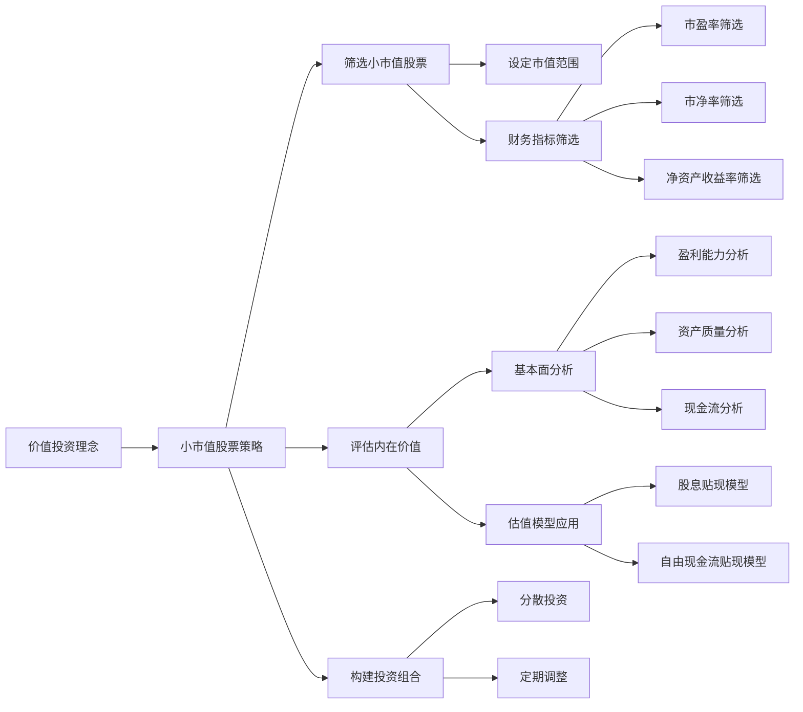

# 价值投资中的小市值股票策略

> 关键词：价值投资、小市值股票、投资策略、财务分析、市场效率

> 摘要：本文深入探讨了价值投资中的小市值股票策略。首先介绍了该策略的背景，包括目的、预期读者、文档结构和相关术语。接着阐述了小市值股票的核心概念及与价值投资的联系，并给出了相应的示意图和流程图。详细讲解了核心算法原理和具体操作步骤，用 Python 代码进行了说明。同时介绍了相关的数学模型和公式，并举例解释。通过项目实战展示了代码案例及解读。分析了小市值股票策略的实际应用场景，推荐了学习资源、开发工具和相关论文著作。最后总结了该策略的未来发展趋势与挑战，还给出了常见问题解答和扩展阅读参考资料，旨在为投资者全面理解和运用小市值股票策略提供专业且深入的指导。

## 1. 背景介绍 

### 1.1 目的和范围
价值投资是一种基于基本面分析，寻找被市场低估股票的投资方法。而小市值股票策略是价值投资领域中一种具有独特魅力的投资方式。本文章的目的在于全面且深入地剖析价值投资中的小市值股票策略，涵盖从基本概念、理论依据到实际操作的各个环节。范围包括小市值股票的定义、其与价值投资的内在联系、相关的核心算法和数学模型，以及如何在实际项目中运用该策略进行股票投资，同时探讨其在不同市场环境下的应用场景和未来发展趋势。

### 1.2 预期读者
本文预期读者主要包括对价值投资有兴趣的个人投资者，他们希望通过学习小市值股票策略来优化自己的投资组合，提高投资收益。同时，也适合专业的金融分析师和投资顾问，为他们在研究和制定投资策略时提供新的思路和参考。此外，金融专业的学生和研究人员也能从本文中获取有关小市值股票策略的系统知识和研究方法。

### 1.3 文档结构概述
本文将按照以下结构展开：首先介绍小市值股票策略的背景信息，让读者了解其基本概念和相关术语。接着阐述核心概念与联系，包括小市值股票的特点以及与价值投资的关系，并通过示意图和流程图进行直观展示。然后详细讲解核心算法原理和具体操作步骤，并用 Python 代码实现。随后介绍相关的数学模型和公式，并举例说明其应用。通过项目实战部分，展示如何搭建开发环境、实现源代码以及对代码进行解读和分析。分析小市值股票策略的实际应用场景，为读者提供实际参考。推荐相关的学习资源、开发工具和论文著作，帮助读者进一步深入学习。最后总结该策略的未来发展趋势与挑战，解答常见问题，并提供扩展阅读和参考资料。

### 1.4 术语表
#### 1.4.1 核心术语定义
- **价值投资**：是一种投资理念，投资者通过分析股票的内在价值，寻找价格低于内在价值的股票进行投资，期望在股票价格回归其内在价值时获得收益。
- **小市值股票**：通常指总市值相对较小的股票。一般来说，在不同的市场环境和行业中，小市值股票的界定标准会有所不同，但总体上是指市值规模处于市场较低水平的股票。
- **市值**：即股票的市场价值，是指一家上市公司的发行股份按市场价格计算出来的股票总价值，其计算方法为每股股票的市场价格乘以发行总股数。
- **内在价值**：是指股票所代表的企业的真实价值，它基于企业的基本面因素，如盈利能力、资产质量、现金流等进行评估。

#### 1.4.2 相关概念解释
- **市场效率**：是指市场价格反映所有可用信息的程度。在有效市场中，股票价格能够迅速准确地反映所有公开信息，因此很难通过基本面分析找到被低估的股票。然而，小市值股票市场可能存在一定的市场无效性，为价值投资者提供了机会。
- **财务比率**：是用于评估企业财务状况和经营绩效的指标，如市盈率（P/E）、市净率（P/B）、净资产收益率（ROE）等。在小市值股票策略中，财务比率是筛选股票的重要依据。

#### 1.4.3 缩略词列表
- **P/E**：市盈率（Price-to-Earnings Ratio），是指股票价格除以每股收益（EPS）的比率，用于衡量股票的估值水平。
- **P/B**：市净率（Price-to-Book Ratio），是指股票价格除以每股净资产的比率，反映了股票价格与每股净资产之间的关系。
- **ROE**：净资产收益率（Return on Equity），是指净利润与平均股东权益的百分比，衡量了企业运用自有资本的效率。

## 2. 核心概念与联系 

### 小市值股票的特点
小市值股票通常具有以下特点：
- **较高的波动性**：由于小市值公司的规模相对较小，抗风险能力较弱，容易受到市场环境、行业竞争和公司自身经营状况等因素的影响，因此其股票价格的波动幅度往往较大。
- **信息不对称性**：与大市值公司相比，小市值公司的信息披露可能不够充分，投资者获取信息的难度较大，这就导致市场对小市值股票的定价可能存在偏差，为价值投资者提供了发现被低估股票的机会。
- **成长潜力大**：一些小市值公司处于发展初期，具有较大的成长潜力。如果这些公司能够成功抓住市场机遇，实现业务扩张和业绩增长，其股票价格可能会大幅上涨。

### 小市值股票与价值投资的联系
价值投资的核心是寻找被市场低估的股票，而小市值股票市场由于其信息不对称和较高的波动性，更容易出现被低估的股票。价值投资者可以通过深入研究小市值公司的基本面，挖掘其内在价值，选择那些价格低于内在价值的股票进行投资。同时，小市值股票的成长潜力也符合价值投资中追求长期收益的理念，通过长期持有具有成长潜力的小市值股票，投资者有望获得超额收益。

### 核心概念原理和架构的文本示意图
```plaintext
            价值投资
               |
               |
               |
       小市值股票策略
       /             \
      /               \
筛选小市值股票     评估内在价值
    |                   |
    |                   |
财务指标筛选       基本面分析
```
这个示意图展示了价值投资与小市值股票策略的关系。价值投资是整体的投资理念，小市值股票策略是价值投资的一种具体应用。在小市值股票策略中，首先需要筛选出符合条件的小市值股票，这可以通过财务指标筛选来实现。然后对筛选出的股票进行内在价值评估，主要通过基本面分析来完成。

### Mermaid 流程图

这个流程图详细展示了小市值股票策略的实施过程。从价值投资理念出发，制定小市值股票策略。首先进行小市值股票的筛选，包括设定市值范围和运用财务指标进行筛选。然后对筛选出的股票进行内在价值评估，通过基本面分析和估值模型应用来完成。最后根据评估结果构建投资组合，进行分散投资并定期调整。

## 3. 核心算法原理 & 具体操作步骤 

### 核心算法原理
小市值股票策略的核心算法原理主要包括两个方面：一是筛选小市值股票，二是评估股票的内在价值。

#### 筛选小市值股票
筛选小市值股票通常基于市值指标，同时结合财务指标进行筛选。常见的财务指标包括市盈率（P/E）、市净率（P/B）和净资产收益率（ROE）等。通过设定这些指标的阈值，可以筛选出具有投资潜力的小市值股票。

#### 评估股票的内在价值
评估股票的内在价值可以采用多种方法，如股息贴现模型（DDM）、自由现金流贴现模型（FCFF）等。这些模型通过预测公司未来的现金流或股息，并将其贴现到当前，得到股票的内在价值。如果股票的市场价格低于其内在价值，则认为该股票被低估，具有投资价值。

### 具体操作步骤
#### 步骤 1：数据获取
首先需要获取股票的相关数据，包括市值、市盈率、市净率、净资产收益率等财务指标，以及公司的财务报表数据。可以通过金融数据提供商（如 Wind、东方财富等）或开源数据接口（如 Tushare）来获取这些数据。

#### 步骤 2：筛选小市值股票
根据设定的市值范围和财务指标阈值，筛选出符合条件的小市值股票。例如，可以设定市值小于 50 亿元，市盈率小于 20，市净率小于 2，净资产收益率大于 10% 等条件。

#### 步骤 3：评估内在价值
对筛选出的小市值股票进行内在价值评估。可以选择合适的估值模型，如股息贴现模型或自由现金流贴现模型，根据公司的财务报表数据和市场环境，预测公司未来的现金流或股息，并将其贴现到当前，得到股票的内在价值。

#### 步骤 4：构建投资组合
根据股票的内在价值和市场价格，选择被低估的股票构建投资组合。为了降低风险，可以采用分散投资的原则，选择不同行业、不同规模的小市值股票进行投资。

#### 步骤 5：定期调整
定期对投资组合进行调整，根据公司的业绩变化、市场环境变化等因素，重新评估股票的内在价值和市场价格，调整投资组合中的股票持仓。

### Python 源代码实现
```python
import tushare as ts
import pandas as pd

# 设置 tushare token
ts.set_token('your_token')
pro = ts.pro_api()

# 步骤 1：数据获取
def get_stock_data():
    # 获取全部股票的基本信息
    basic_data = pro.stock_basic(exchange='', list_status='L', fields='ts_code,symbol,name,market,area,industry,list_date')
    # 获取财务指标数据
    fina_data = pro.daily_basic(ts_code='', trade_date='', fields='ts_code,trade_date,close,turnover_rate,volume_ratio,pe_ttm,pb,total_mv')
    # 合并数据
    data = pd.merge(basic_data, fina_data, on='ts_code')
    return data

# 步骤 2：筛选小市值股票
def filter_small_cap_stocks(data):
    # 设定市值范围和财务指标阈值
    small_cap_data = data[(data['total_mv'] < 50) & (data['pe_ttm'] < 20) & (data['pb'] < 2)]
    return small_cap_data

# 步骤 3：评估内在价值（这里简单示例，实际应用需要更复杂的模型）
def evaluate_intrinsic_value(data):
    # 假设简单的内在价值评估，这里只是示例，无实际意义
    data['intrinsic_value'] = data['close'] * 1.2
    return data

# 步骤 4：构建投资组合
def build_portfolio(data):
    # 选择被低估的股票
    undervalued_data = data[data['close'] < data['intrinsic_value']]
    portfolio = undervalued_data[['ts_code', 'name']]
    return portfolio

# 主函数
def main():
    data = get_stock_data()
    small_cap_data = filter_small_cap_stocks(data)
    evaluated_data = evaluate_intrinsic_value(small_cap_data)
    portfolio = build_portfolio(evaluated_data)
    print(portfolio)

if __name__ == "__main__":
    main()
```
### 代码解释
- `get_stock_data` 函数：通过 Tushare 接口获取全部股票的基本信息和财务指标数据，并将其合并。
- `filter_small_cap_stocks` 函数：根据设定的市值范围和财务指标阈值，筛选出符合条件的小市值股票。
- `evaluate_intrinsic_value` 函数：对筛选出的小市值股票进行内在价值评估，这里只是简单示例，实际应用中需要使用更复杂的估值模型。
- `build_portfolio` 函数：选择被低估的股票构建投资组合。
- `main` 函数：调用上述函数，完成数据获取、筛选、评估和投资组合构建的整个流程，并打印出投资组合。

## 4. 数学模型和公式 & 详细讲解 & 举例说明 

### 股息贴现模型（DDM）
#### 公式
股息贴现模型的基本公式为：
$$V = \sum_{t=1}^{\infty} \frac{D_t}{(1 + r)^t}$$
其中，$V$ 表示股票的内在价值，$D_t$ 表示第 $t$ 期的股息，$r$ 表示贴现率。

#### 详细讲解
股息贴现模型的基本思想是，股票的价值等于其未来所有股息的现值之和。在实际应用中，通常需要对股息的增长情况进行假设。常见的假设包括零增长模型、固定增长模型和多阶段增长模型。

- **零增长模型**：假设股息保持不变，即 $D_1 = D_2 = \cdots = D$，则公式可以简化为：
$$V = \frac{D}{r}$$
- **固定增长模型**：假设股息以固定的增长率 $g$ 增长，即 $D_{t+1} = D_t(1 + g)$，则公式可以简化为：
$$V = \frac{D_1}{r - g}$$
其中，$D_1$ 表示下一期的股息。

#### 举例说明
假设某股票当前的股息为 $D_0 = 1$ 元，预计股息将以每年 5% 的增长率增长，贴现率为 10%。则下一期的股息 $D_1 = D_0(1 + g) = 1\times(1 + 0.05) = 1.05$ 元。根据固定增长模型，该股票的内在价值为：
$$V = \frac{D_1}{r - g} = \frac{1.05}{0.1 - 0.05} = 21$$ 元。

### 自由现金流贴现模型（FCFF）
#### 公式
自由现金流贴现模型的基本公式为：
$$V = \sum_{t=1}^{\infty} \frac{FCFF_t}{(1 + WACC)^t}$$
其中，$V$ 表示企业的价值，$FCFF_t$ 表示第 $t$ 期的自由现金流，$WACC$ 表示加权平均资本成本。

#### 详细讲解
自由现金流贴现模型的基本思想是，企业的价值等于其未来所有自由现金流的现值之和。自由现金流是指企业在满足了所有运营成本和资本支出后剩余的现金流量，它反映了企业的真实盈利能力和财务状况。加权平均资本成本是指企业各种资本来源的成本加权平均值，它反映了企业的融资成本。

#### 举例说明
假设某企业预计未来三年的自由现金流分别为 $FCFF_1 = 100$ 万元，$FCFF_2 = 120$ 万元，$FCFF_3 = 150$ 万元，从第四年开始，自由现金流将以每年 3% 的增长率稳定增长。加权平均资本成本为 8%。则该企业的价值可以分为两部分计算：

- 前三年自由现金流的现值：
$$PV_1 = \frac{FCFF_1}{(1 + WACC)^1} + \frac{FCFF_2}{(1 + WACC)^2} + \frac{FCFF_3}{(1 + WACC)^3} = \frac{100}{(1 + 0.08)^1} + \frac{120}{(1 + 0.08)^2} + \frac{150}{(1 + 0.08)^3} \approx 282.64$$ 万元。

- 第四年及以后自由现金流的现值（使用固定增长模型）：
首先计算第四年的自由现金流 $FCFF_4 = FCFF_3(1 + g) = 150\times(1 + 0.03) = 154.5$ 万元。
则第四年及以后自由现金流的现值为：
$$PV_2 = \frac{FCFF_4}{(WACC - g)(1 + WACC)^3} = \frac{154.5}{(0.08 - 0.03)(1 + 0.08)^3} \approx 2547.73$$ 万元。

- 企业的总价值：
$$V = PV_1 + PV_2 = 282.64 + 2547.73 = 2830.37$$ 万元。

## 5. 项目实战：代码实际案例和详细解释说明 

### 5.1  开发环境搭建
#### 安装 Python
首先需要安装 Python 环境，建议使用 Python 3.7 及以上版本。可以从 Python 官方网站（https://www.python.org/downloads/）下载并安装。

#### 安装必要的库
在项目中，需要使用一些 Python 库来完成数据获取、数据处理和分析等任务。可以使用以下命令安装所需的库：
```bash
pip install tushare pandas numpy matplotlib
```
- `tushare`：用于获取金融数据。
- `pandas`：用于数据处理和分析。
- `numpy`：用于数值计算。
- `matplotlib`：用于数据可视化。

### 5.2  源代码详细实现和代码解读
```python
import tushare as ts
import pandas as pd
import numpy as np
import matplotlib.pyplot as plt

# 设置 tushare token
ts.set_token('your_token')
pro = ts.pro_api()

# 步骤 1：数据获取
def get_stock_data():
    # 获取全部股票的基本信息
    basic_data = pro.stock_basic(exchange='', list_status='L', fields='ts_code,symbol,name,market,area,industry,list_date')
    # 获取财务指标数据
    fina_data = pro.daily_basic(ts_code='', trade_date='', fields='ts_code,trade_date,close,turnover_rate,volume_ratio,pe_ttm,pb,total_mv')
    # 合并数据
    data = pd.merge(basic_data, fina_data, on='ts_code')
    return data

# 步骤 2：筛选小市值股票
def filter_small_cap_stocks(data):
    # 设定市值范围和财务指标阈值
    small_cap_data = data[(data['total_mv'] < 50) & (data['pe_ttm'] < 20) & (data['pb'] < 2)]
    return small_cap_data

# 步骤 3：评估内在价值（使用股息贴现模型）
def evaluate_intrinsic_value(data):
    # 假设股息增长率为 5%，贴现率为 10%
    g = 0.05
    r = 0.1
    # 假设当前股息为每股收益的 30%
    data['dividend'] = data['close'] / data['pe_ttm'] * 0.3
    data['intrinsic_value'] = data['dividend'] * (1 + g) / (r - g)
    return data

# 步骤 4：构建投资组合
def build_portfolio(data):
    # 选择被低估的股票
    undervalued_data = data[data['close'] < data['intrinsic_value']]
    portfolio = undervalued_data[['ts_code', 'name']]
    return portfolio

# 步骤 5：回测投资组合
def backtest_portfolio(portfolio, start_date, end_date):
    returns = []
    for index, row in portfolio.iterrows():
        ts_code = row['ts_code']
        # 获取股票的历史行情数据
        df = pro.daily(ts_code=ts_code, start_date=start_date, end_date=end_date)
        if not df.empty:
            df = df.sort_values(by='trade_date')
            start_price = df.iloc[-1]['close']
            end_price = df.iloc[0]['close']
            return_rate = (end_price - start_price) / start_price
            returns.append(return_rate)
    if returns:
        average_return = np.mean(returns)
        return average_return
    else:
        return 0

# 主函数
def main():
    data = get_stock_data()
    small_cap_data = filter_small_cap_stocks(data)
    evaluated_data = evaluate_intrinsic_value(small_cap_data)
    portfolio = build_portfolio(evaluated_data)
    print("投资组合：")
    print(portfolio)

    # 回测投资组合
    start_date = '20200101'
    end_date = '20210101'
    average_return = backtest_portfolio(portfolio, start_date, end_date)
    print(f"投资组合在 {start_date} 到 {end_date} 期间的平均收益率为：{average_return * 100:.2f}%")

    # 可视化收益率
    plt.bar(['投资组合'], [average_return])
    plt.ylabel('收益率')
    plt.title('投资组合收益率')
    plt.show()

if __name__ == "__main__":
    main()
```
### 5.3  代码解读与分析
#### 数据获取
`get_stock_data` 函数通过 Tushare 接口获取全部股票的基本信息和财务指标数据，并将其合并。这样可以方便后续的筛选和分析。

#### 筛选小市值股票
`filter_small_cap_stocks` 函数根据设定的市值范围和财务指标阈值，筛选出符合条件的小市值股票。这里设定市值小于 50 亿元，市盈率小于 20，市净率小于 2。

#### 评估内在价值
`evaluate_intrinsic_value` 函数使用股息贴现模型评估股票的内在价值。假设股息增长率为 5%，贴现率为 10%，当前股息为每股收益的 30%。

#### 构建投资组合
`build_portfolio` 函数选择被低估的股票构建投资组合，即股票的市场价格低于其内在价值的股票。

#### 回测投资组合
`backtest_portfolio` 函数对投资组合进行回测，计算投资组合在指定时间段内的平均收益率。通过获取股票的历史行情数据，计算每只股票的收益率，然后求平均值。

#### 可视化收益率
使用 `matplotlib` 库将投资组合的收益率进行可视化展示，方便直观地观察投资组合的表现。

## 6. 实际应用场景 
### 个人投资者
对于个人投资者来说，小市值股票策略可以作为一种补充投资策略，丰富投资组合。由于小市值股票具有较高的波动性和成长潜力，个人投资者可以通过深入研究和筛选，选择具有投资价值的小市值股票进行投资，以获取超额收益。例如，个人投资者可以每月或每季度对小市值股票进行筛选和评估，构建一个包含 10 - 20 只小市值股票的投资组合，并定期进行调整。

### 专业投资机构
专业投资机构可以利用小市值股票策略进行资产配置和风险管理。通过构建小市值股票投资组合，可以降低投资组合与大市值股票的相关性，提高投资组合的分散化程度。同时，专业投资机构可以利用其专业的研究团队和资源，对小市值公司进行深入的基本面分析和估值，挖掘更多的投资机会。例如，一些私募基金可以专门设立小市值股票投资基金，吸引投资者的资金。

### 市场研究和分析
小市值股票策略也可以用于市场研究和分析。研究人员可以通过分析小市值股票的表现和特征，了解市场的有效性和投资者的行为。例如，研究小市值股票在不同市场环境下的表现，分析其与宏观经济指标、行业发展趋势等因素的关系，为投资者提供参考和建议。

## 7. 工具和资源推荐
### 7.1 学习资源推荐
#### 7.1.1 书籍推荐
- 《聪明的投资者》（The Intelligent Investor）：本杰明·格雷厄姆（Benjamin Graham）著，被誉为价值投资的圣经，书中详细阐述了价值投资的理念和方法，对小市值股票策略也有一定的涉及。
- 《怎样选择成长股》（Common Stocks and Uncommon Profits）：菲利普·费雪（Philip Fisher）著，介绍了如何通过基本面分析寻找具有成长潜力的股票，对于小市值股票的投资有很大的指导意义。
- 《小市值股票投资策略》：专门针对小市值股票投资的书籍，深入探讨了小市值股票的特点、投资策略和风险管理等方面的内容。

#### 7.1.2 在线课程
- Coursera 上的“投资学原理”课程：由知名大学教授授课，系统介绍了投资学的基本原理和方法，包括价值投资和小市值股票投资等内容。
- 网易云课堂上的“股票投资实战课程”：结合实际案例，讲解股票投资的技巧和策略，对小市值股票投资有详细的讲解和分析。

#### 7.1.3 技术博客和网站
- 雪球网：国内知名的投资社区，有很多投资者分享小市值股票的投资经验和研究成果。
- 东方财富网：提供丰富的金融数据和资讯，还有专业的研究报告和分析文章，对小市值股票的研究和投资有很大的帮助。

### 7.2 开发工具框架推荐
#### 7.2.1 IDE和编辑器
- PyCharm：一款专业的 Python 集成开发环境，具有强大的代码编辑、调试和分析功能，适合开发小市值股票投资策略的 Python 代码。
- Jupyter Notebook：交互式的开发环境，方便进行数据探索、分析和可视化，适合进行小市值股票策略的研究和实验。

#### 7.2.2 调试和性能分析工具
- PDB：Python 自带的调试工具，可以帮助开发者快速定位和解决代码中的问题。
- cProfile：Python 内置的性能分析工具，可以分析代码的运行时间和函数调用情况，帮助开发者优化代码性能。

#### 7.2.3 相关框架和库
- Tushare：提供丰富的金融数据接口，方便获取股票的基本信息、财务指标和历史行情数据。
- Pandas：用于数据处理和分析的 Python 库，具有强大的数据结构和数据操作功能，适合处理小市值股票的相关数据。
- Numpy：用于数值计算的 Python 库，提供了高效的数组和矩阵运算功能，在小市值股票策略的计算中经常使用。
- Matplotlib：用于数据可视化的 Python 库，可以绘制各种图表，直观展示小市值股票的分析结果。

### 7.3 相关论文著作推荐
#### 7.3.1 经典论文
- “The Cross - Section of Expected Stock Returns”：由 Eugene F. Fama 和 Kenneth R. French 发表，提出了著名的 Fama - French 三因子模型，对小市值股票的收益率进行了深入研究。
- “Size and Book - to - Market Factors in Earnings and Returns”：进一步探讨了小市值股票和价值股的收益特征，为小市值股票策略提供了理论支持。

#### 7.3.2 最新研究成果
可以通过学术数据库（如 CNKI、Web of Science 等）搜索关于小市值股票投资策略的最新研究论文，了解该领域的最新发展动态和研究成果。

#### 7.3.3 应用案例分析
一些金融研究机构和咨询公司会发布小市值股票投资策略的应用案例分析报告，可以通过这些报告了解实际应用中的经验和教训，为自己的投资决策提供参考。

## 8. 总结：未来发展趋势与挑战
### 未来发展趋势
- **数字化和智能化**：随着科技的不断发展，金融领域的数字化和智能化程度将越来越高。小市值股票策略也将借助大数据、人工智能等技术，实现更精准的股票筛选和内在价值评估。例如，利用机器学习算法对小市值公司的财务数据、新闻舆情等进行分析，挖掘潜在的投资机会。
- **全球化**：随着全球金融市场的一体化，投资者将有更多的机会投资不同国家和地区的小市值股票。同时，小市值股票策略也将受到全球宏观经济环境和政策的影响。因此，投资者需要更加关注全球市场的动态，制定更加多元化的投资策略。
- **绿色和可持续投资**：在全球关注环境保护和可持续发展的背景下，绿色和可持续投资将成为未来的发展趋势。小市值股票中可能会涌现出更多的环保、新能源等领域的企业，投资者可以将绿色和可持续投资理念融入小市值股票策略中，寻找具有长期投资价值的股票。

### 挑战
- **信息不对称**：小市值公司的信息披露可能不够充分，投资者获取信息的难度较大。这就需要投资者具备更强的信息收集和分析能力，同时也增加了投资决策的风险。
- **流动性风险**：小市值股票的流动性通常较差，买卖价差较大。在市场行情不好时，可能会出现难以卖出的情况，导致投资者的资金无法及时变现。
- **市场竞争**：随着小市值股票策略的 popularity 越来越高，市场竞争也将越来越激烈。投资者需要不断提高自己的投资能力和研究水平，才能在市场中获得超额收益。

## 9. 附录：常见问题与解答
### 问题 1：小市值股票的界定标准是什么？
小市值股票的界定标准在不同的市场环境和行业中会有所不同。一般来说，可以根据市值的排名或具体的市值数值来界定。例如，在 A 股市场中，可以将市值排名后 20% 的股票定义为小市值股票，或者将市值小于 50 亿元的股票定义为小市值股票。

### 问题 2：小市值股票策略的风险有哪些？
小市值股票策略的风险主要包括信息不对称风险、流动性风险、市场风险和企业经营风险等。信息不对称可能导致投资者对公司的了解不够全面，做出错误的投资决策。流动性风险可能导致投资者在需要卖出股票时无法及时成交。市场风险是指整个市场行情的波动对小市值股票的影响。企业经营风险是指小市值公司由于规模较小、抗风险能力较弱，可能会出现经营不善的情况。

### 问题 3：如何评估小市值股票的内在价值？
可以采用多种方法评估小市值股票的内在价值，如股息贴现模型、自由现金流贴现模型、相对估值法等。股息贴现模型通过预测公司未来的股息，并将其贴现到当前，得到股票的内在价值。自由现金流贴现模型通过预测公司未来的自由现金流，并将其贴现到当前，得到企业的价值，再除以总股本得到股票的内在价值。相对估值法是通过与同行业其他公司的估值指标进行比较，评估股票的相对价值。

### 问题 4：小市值股票策略适合所有投资者吗？
小市值股票策略并不适合所有投资者。由于小市值股票具有较高的波动性和风险，适合那些风险承受能力较高、有一定投资经验和研究能力的投资者。对于风险承受能力较低、追求稳健收益的投资者来说，可能更适合投资大市值股票或其他稳健型的投资产品。

## 10. 扩展阅读 & 参考资料
### 扩展阅读
- 《金融炼金术》（The Alchemy of Finance）：乔治·索罗斯（George Soros）著，探讨了金融市场的运行规律和投资者的行为，对理解小市值股票市场的波动和投资机会有一定的帮助。
- 《投资最重要的事》（The Most Important Thing Illuminated）：霍华德·马克斯（Howard Marks）著，介绍了投资的基本原则和方法，强调了风险管理和价值投资的重要性。

### 参考资料
- Tushare 官方文档：https://tushare.pro/document/1
- Pandas 官方文档：https://pandas.pydata.org/docs/
- Numpy 官方文档：https://numpy.org/doc/
- Matplotlib 官方文档：https://matplotlib.org/stable/contents.html