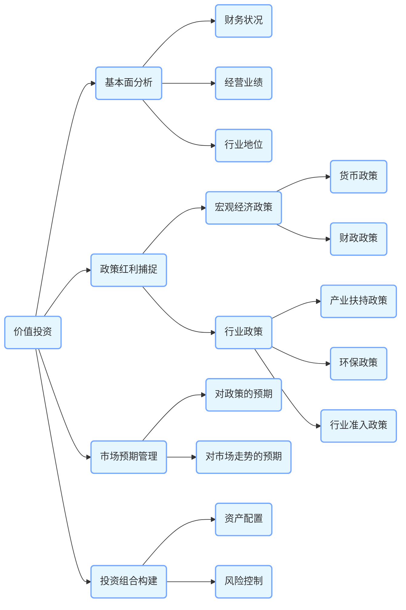

# 价值投资中的政策红利捕捉

> 关键词：价值投资、政策红利、宏观经济、行业分析、投资策略、市场趋势、风险控制

> 摘要：本文聚焦于价值投资领域中政策红利的捕捉。在价值投资理念下，政策红利往往能为投资者带来巨大的投资机遇。文章首先介绍了相关背景知识，包括目的、预期读者等内容。接着阐述核心概念与联系，分析政策红利与价值投资的内在逻辑。详细讲解核心算法原理及操作步骤，通过数学模型和公式深入剖析政策对投资价值的影响。以项目实战案例说明如何在实际中捕捉政策红利。探讨了政策红利在不同场景下的实际应用，并推荐了学习、开发等相关的工具和资源。最后总结未来发展趋势与挑战，解答常见问题并提供扩展阅读和参考资料，旨在帮助投资者更好地在价值投资中捕捉政策红利，实现投资目标。

## 1. 背景介绍 
### 1.1 目的和范围
价值投资一直是资本市场中备受关注的投资理念，其核心在于寻找被低估的资产并长期持有。而政策红利作为影响市场和行业发展的重要因素，对价值投资有着不可忽视的作用。本文的目的在于深入探讨如何在价值投资过程中捕捉政策红利，为投资者提供系统的理论和实践指导。范围涵盖了宏观经济政策、行业政策等多个层面，分析政策对不同行业和企业的影响，以及如何基于政策变化调整投资策略。

### 1.2 预期读者
本文预期读者包括各类投资者，如个人投资者、机构投资者等，以及对价值投资和政策分析感兴趣的金融从业者、学者和研究人员。无论是初涉投资领域的新手，还是经验丰富的专业人士，都能从本文中获取有价值的信息和思路。

### 1.3 文档结构概述
本文首先介绍背景知识，让读者对价值投资中政策红利捕捉的相关概念有初步了解。接着阐述核心概念与联系，明确政策红利与价值投资的关系和作用机制。然后详细讲解核心算法原理及操作步骤，通过数学模型和公式深入分析政策对投资价值的量化影响。以项目实战案例展示如何在实际投资中应用这些理论和方法。探讨政策红利的实际应用场景，为投资者提供更具针对性的投资方向。推荐相关的工具和资源，帮助读者进一步学习和实践。最后总结未来发展趋势与挑战，解答常见问题并提供扩展阅读和参考资料，使读者对整个主题有全面、深入的认识。

### 1.4 术语表
#### 1.4.1 核心术语定义
- **价值投资**：一种投资策略，投资者通过分析公司的基本面，寻找被市场低估的股票或其他资产，并长期持有，以获取资产价值增长带来的收益。
- **政策红利**：政府出台的政策措施为特定行业、企业或市场带来的积极影响和发展机遇，通常表现为税收优惠、财政补贴、行业准入放宽等。
- **宏观经济政策**：政府为了实现宏观经济目标，如经济增长、稳定物价、充分就业等，而采取的一系列政策措施，包括货币政策、财政政策等。
- **行业政策**：政府针对特定行业制定的政策，旨在促进该行业的发展、规范市场秩序、提高行业竞争力等。

#### 1.4.2 相关概念解释
- **基本面分析**：通过研究公司的财务状况、经营业绩、行业地位等基本面因素，评估公司的内在价值，为价值投资提供依据。
- **市场预期**：投资者对市场未来走势和公司业绩的预期，政策的出台往往会影响市场预期，进而影响资产价格。
- **政策传导机制**：政策从制定到实施，再到对市场和企业产生影响的过程和途径。

#### 1.4.3 缩略词列表
- **GDP**：国内生产总值（Gross Domestic Product）
- **CPI**：居民消费价格指数（Consumer Price Index）
- **M2**：广义货币供应量（Broad Money Supply）

## 2. 核心概念与联系 

### 政策红利与价值投资的关系
政策红利是价值投资中不可忽视的重要因素。政策的出台和实施会对宏观经济、行业发展和企业经营产生深远影响，从而改变资产的内在价值和市场预期。当政府出台有利于某个行业或企业的政策时，该行业或企业往往会迎来发展机遇，其资产价值也会相应提升。价值投资者可以通过捕捉这些政策红利，提前布局相关资产，从而获得超额收益。

### 政策红利的来源和类型
政策红利的来源主要包括宏观经济政策和行业政策。宏观经济政策如货币政策和财政政策，会影响整个经济的运行和市场的资金供求关系，从而对各类资产价格产生影响。行业政策则针对特定行业，如产业扶持政策、环保政策等，会直接影响该行业的发展前景和企业的经营环境。

### 政策红利与市场趋势的互动
政策红利会引导市场趋势的变化，而市场趋势也会影响政策的制定和调整。当市场处于低迷状态时，政府可能会出台刺激经济的政策，以推动市场复苏；而当市场过热时，政府可能会采取收紧政策，以防止经济泡沫。价值投资者需要密切关注政策红利与市场趋势的互动关系，及时调整投资策略。

### 核心概念原理和架构的文本示意图
```plaintext
价值投资
|
|-- 基本面分析
|   |-- 财务状况
|   |-- 经营业绩
|   |-- 行业地位
|
|-- 政策红利捕捉
|   |-- 宏观经济政策
|   |   |-- 货币政策
|   |   |-- 财政政策
|   |
|   |-- 行业政策
|       |-- 产业扶持政策
|       |-- 环保政策
|       |-- 行业准入政策
|
|-- 市场预期管理
|   |-- 对政策的预期
|   |-- 对市场走势的预期
|
|-- 投资组合构建
|   |-- 资产配置
|   |-- 风险控制
```

### Mermaid 流程图


## 3. 核心算法原理 & 具体操作步骤 

### 政策敏感度分析算法
政策敏感度分析是捕捉政策红利的关键步骤之一。其核心思想是通过分析企业或行业对不同政策的敏感程度，评估政策变化对其经营业绩和价值的影响。以下是一个简单的政策敏感度分析的 Python 代码示例：

```python
import pandas as pd

# 定义政策敏感度分析函数
def policy_sensitivity_analysis(policy_data, company_data):
    """
    政策敏感度分析函数
    :param policy_data: 政策数据，包含政策指标和政策变化值
    :param company_data: 公司数据，包含公司业绩指标和与政策相关的指标
    :return: 政策敏感度得分
    """
    # 合并政策数据和公司数据
    merged_data = pd.merge(policy_data, company_data, on='date')
    
    # 计算政策变化率和公司业绩变化率
    merged_data['policy_change_rate'] = merged_data['policy_value'].pct_change()
    merged_data['company_performance_change_rate'] = merged_data['company_performance'].pct_change()
    
    # 计算政策敏感度得分
    merged_data['policy_sensitivity_score'] = merged_data['company_performance_change_rate'] / merged_data['policy_change_rate']
    
    # 去除缺失值
    merged_data = merged_data.dropna()
    
    # 计算平均政策敏感度得分
    average_sensitivity_score = merged_data['policy_sensitivity_score'].mean()
    
    return average_sensitivity_score

# 示例数据
policy_data = pd.DataFrame({
    'date': ['2020-01-01', '2020-02-01', '2020-03-01'],
    'policy_value': [100, 110, 120]
})

company_data = pd.DataFrame({
    'date': ['2020-01-01', '2020-02-01', '2020-03-01'],
    'company_performance': [200, 220, 240]
})

# 调用政策敏感度分析函数
sensitivity_score = policy_sensitivity_analysis(policy_data, company_data)
print(f"政策敏感度得分: {sensitivity_score}")
```

### 具体操作步骤
1. **数据收集**：收集政策数据和相关企业或行业的数据，包括政策指标（如利率、税率、补贴金额等）和企业业绩指标（如营业收入、净利润等）。
2. **数据预处理**：对收集到的数据进行清洗、整理和标准化处理，确保数据的准确性和一致性。
3. **计算政策变化率和企业业绩变化率**：通过计算政策指标和企业业绩指标的变化率，反映政策变化和企业业绩变化的情况。
4. **计算政策敏感度得分**：将企业业绩变化率除以政策变化率，得到政策敏感度得分。该得分越高，说明企业或行业对政策变化越敏感。
5. **分析结果**：根据政策敏感度得分，评估企业或行业对政策的敏感程度，为投资决策提供参考。

## 4. 数学模型和公式 & 详细讲解 & 举例说明 

### 政策对企业价值影响的数学模型
假设企业的价值 $V$ 由其未来现金流的现值决定，即：

$$V = \sum_{t=1}^{n} \frac{CF_t}{(1 + r)^t}$$

其中，$CF_t$ 表示第 $t$ 期的现金流，$r$ 表示折现率，$n$ 表示预测期数。

政策的出台和实施会影响企业的现金流和折现率，从而改变企业的价值。假设政策对企业现金流的影响系数为 $\alpha$，对折现率的影响系数为 $\beta$，则政策实施后企业的价值 $V'$ 为：

$$V' = \sum_{t=1}^{n} \frac{(1 + \alpha)CF_t}{(1 + \beta r)^t}$$

### 详细讲解
- **现金流影响系数 $\alpha$**：政策可能会通过税收优惠、财政补贴等方式增加企业的现金流，此时 $\alpha > 0$；也可能会通过增加监管成本、提高环保要求等方式减少企业的现金流，此时 $\alpha < 0$。
- **折现率影响系数 $\beta$**：政策可能会通过降低利率、改善市场环境等方式降低企业的折现率，此时 $\beta < 1$；也可能会通过增加市场风险、提高融资成本等方式提高企业的折现率，此时 $\beta > 1$。

### 举例说明
假设某企业未来三年的现金流分别为 $CF_1 = 100$ 万元，$CF_2 = 120$ 万元，$CF_3 = 150$ 万元，折现率 $r = 10\%$。则该企业的价值为：

$$V = \frac{100}{(1 + 0.1)^1} + \frac{120}{(1 + 0.1)^2} + \frac{150}{(1 + 0.1)^3} \approx 295.82 \text{万元}$$

假设政府出台了一项产业扶持政策，使企业的现金流增加了 $20\%$，即 $\alpha = 0.2$，同时由于政策改善了市场环境，使企业的折现率降低了 $10\%$，即 $\beta = 0.9$。则政策实施后企业的价值为：

$$V' = \frac{(1 + 0.2) \times 100}{(1 + 0.9 \times 0.1)^1} + \frac{(1 + 0.2) \times 120}{(1 + 0.9 \times 0.1)^2} + \frac{(1 + 0.2) \times 150}{(1 + 0.9 \times 0.1)^3} \approx 378.47 \text{万元}$$

可以看出，政策的实施使企业的价值大幅增加。

## 5. 项目实战：代码实际案例和详细解释说明 

### 5.1  开发环境搭建
- **Python 环境**：安装 Python 3.x 版本，可以从 Python 官方网站（https://www.python.org/downloads/） 下载并安装。
- **开发工具**：推荐使用 PyCharm 作为开发工具，可以从 JetBrains 官方网站（https://www.jetbrains.com/pycharm/download/） 下载并安装。
- **相关库**：安装 pandas、numpy 等数据处理库，以及 matplotlib 等数据可视化库。可以使用以下命令进行安装：
```sh
pip install pandas numpy matplotlib
```

### 5.2  源代码详细实现和代码解读
以下是一个基于历史政策数据和企业财务数据，进行政策红利捕捉的项目实战代码示例：

```python
import pandas as pd
import numpy as np
import matplotlib.pyplot as plt

# 读取政策数据和企业财务数据
policy_data = pd.read_csv('policy_data.csv')
company_data = pd.read_csv('company_data.csv')

# 数据预处理
policy_data['date'] = pd.to_datetime(policy_data['date'])
company_data['date'] = pd.to_datetime(company_data['date'])

# 合并数据
merged_data = pd.merge(policy_data, company_data, on='date')

# 计算政策变化率和企业业绩变化率
merged_data['policy_change_rate'] = merged_data['policy_value'].pct_change()
merged_data['company_performance_change_rate'] = merged_data['company_performance'].pct_change()

# 去除缺失值
merged_data = merged_data.dropna()

# 绘制政策变化率和企业业绩变化率的折线图
plt.figure(figsize=(12, 6))
plt.plot(merged_data['date'], merged_data['policy_change_rate'], label='Policy Change Rate')
plt.plot(merged_data['date'], merged_data['company_performance_change_rate'], label='Company Performance Change Rate')
plt.xlabel('Date')
plt.ylabel('Change Rate')
plt.title('Policy Change Rate vs Company Performance Change Rate')
plt.legend()
plt.grid(True)
plt.show()

# 计算政策敏感度得分
merged_data['policy_sensitivity_score'] = merged_data['company_performance_change_rate'] / merged_data['policy_change_rate']

# 分析政策敏感度得分
average_sensitivity_score = merged_data['policy_sensitivity_score'].mean()
print(f"平均政策敏感度得分: {average_sensitivity_score}")

# 根据政策敏感度得分筛选投资标的
threshold = 2.0
sensitive_companies = merged_data[merged_data['policy_sensitivity_score'] > threshold]
print("对政策敏感的公司数据:")
print(sensitive_companies)
```

### 5.3  代码解读与分析
1. **数据读取**：使用 `pandas` 库的 `read_csv` 函数读取政策数据和企业财务数据。
2. **数据预处理**：将日期列转换为日期时间类型，方便后续分析。
3. **数据合并**：使用 `pandas` 库的 `merge` 函数将政策数据和企业财务数据按日期合并。
4. **计算变化率**：计算政策变化率和企业业绩变化率，反映政策和企业业绩的变化情况。
5. **数据可视化**：使用 `matplotlib` 库绘制政策变化率和企业业绩变化率的折线图，直观展示两者的关系。
6. **计算政策敏感度得分**：将企业业绩变化率除以政策变化率，得到政策敏感度得分。
7. **分析政策敏感度得分**：计算平均政策敏感度得分，并根据设定的阈值筛选出对政策敏感的公司。

## 6. 实际应用场景 

### 新能源行业
随着全球对环境保护和可持续发展的重视，各国政府纷纷出台了一系列支持新能源发展的政策，如补贴政策、税收优惠政策等。价值投资者可以通过捕捉这些政策红利，投资新能源相关企业，如太阳能、风能、电动汽车等领域的企业。例如，政府对电动汽车的补贴政策会刺激电动汽车的需求，从而带动相关产业链的发展，包括电池制造商、充电桩运营商等。

### 医疗保健行业
人口老龄化和人们对健康的关注度不断提高，使得医疗保健行业成为一个具有巨大发展潜力的行业。政府也会出台一些政策来支持医疗保健行业的发展，如加大对医疗卫生事业的投入、鼓励创新药物研发等。价值投资者可以关注这些政策，投资医疗设备制造商、制药企业、医疗服务提供商等相关企业。

### 科技创新行业
科技创新是推动经济发展的重要动力，政府通常会出台一系列政策来鼓励科技创新，如设立科研基金、提供税收优惠等。价值投资者可以捕捉这些政策红利，投资人工智能、大数据、云计算等科技创新领域的企业。例如，政府对人工智能产业的支持政策会促进人工智能技术的研发和应用，从而带动相关企业的发展。

### 基础设施建设行业
基础设施建设是国家经济发展的重要支撑，政府会通过加大基础设施建设投资来促进经济增长。价值投资者可以关注基础设施建设相关政策，投资建筑工程企业、建材企业、交通运输企业等。例如，政府的高铁建设规划会带动高铁相关产业链的发展，包括高铁车辆制造商、轨道建设企业等。

## 7. 工具和资源推荐
### 7.1 学习资源推荐
#### 7.1.1 书籍推荐
- 《聪明的投资者》（本杰明·格雷厄姆著）：价值投资领域的经典著作，深入阐述了价值投资的理念和方法。
- 《金融炼金术》（乔治·索罗斯著）：介绍了索罗斯的投资哲学和操作方法，对政策分析和市场趋势判断有很大的启发。
- 《政策与市场：变革中的中国金融》（吴晓灵等著）：深入分析了中国金融政策与市场的关系，有助于理解政策对金融市场的影响。

#### 7.1.2 在线课程
- Coursera 上的“投资学原理”课程：由知名高校教授授课，系统介绍了投资学的基本原理和方法。
- edX 上的“宏观经济学”课程：帮助学习者了解宏观经济政策的制定和实施，以及对经济和市场的影响。
- 中国大学 MOOC 上的“金融市场与政策”课程：结合中国实际情况，讲解金融市场和政策的相关知识。

#### 7.1.3 技术博客和网站
- 雪球网：国内知名的投资社区，提供大量的投资分析和研究报告，以及投资者的交流和分享。
- 华尔街见闻：提供全球金融市场的实时资讯和深度分析，对政策解读和市场趋势判断有很大的帮助。
- 财新网：专注于财经领域的新闻和分析，报道政策动态和市场变化。

### 7.2 开发工具框架推荐
#### 7.2.1 IDE和编辑器
- PyCharm：功能强大的 Python 集成开发环境，提供代码编辑、调试、版本控制等功能。
- Jupyter Notebook：交互式的开发环境，适合数据探索和分析，方便代码的编写和展示。
- Visual Studio Code：轻量级的代码编辑器，支持多种编程语言，有丰富的插件扩展功能。

#### 7.2.2 调试和性能分析工具
- pdb：Python 自带的调试工具，用于调试 Python 代码，定位程序中的错误。
- cProfile：Python 标准库中的性能分析工具，用于分析代码的运行时间和性能瓶颈。
- Py-Spy：一个简单易用的 Python 性能分析工具，可以实时监控 Python 程序的运行状态。

#### 7.2.3 相关框架和库
- pandas：强大的数据处理和分析库，提供了丰富的数据结构和函数，方便对政策数据和企业财务数据进行处理和分析。
- numpy：用于科学计算的基础库，提供了高效的数组操作和数学函数。
- matplotlib：常用的数据可视化库，用于绘制各种图表，直观展示数据和分析结果。

### 7.3 相关论文著作推荐
#### 7.3.1 经典论文
- “The Capital Asset Pricing Model: Theory and Evidence”（Eugene F. Fama 和 Kenneth R. French 著）：经典的资本资产定价模型论文，对理解资产定价和投资组合理论有重要意义。
- “Efficient Capital Markets: A Review of Theory and Empirical Work”（Eugene F. Fama 著）：有效市场假说的经典论文，探讨了市场效率和信息对资产价格的影响。
- “Policy Uncertainty and Corporate Investment”（Scott R. Baker、Nicholas Bloom 和 Steven J. Davis 著）：研究政策不确定性对企业投资的影响，对政策分析和投资决策有重要参考价值。

#### 7.3.2 最新研究成果
- 关注顶级经济学期刊，如《American Economic Review》、《Journal of Finance》等，获取最新的政策研究和投资理论成果。
- 关注知名研究机构的研究报告，如国际货币基金组织（IMF）、世界银行等发布的关于宏观经济政策和全球经济趋势的研究报告。

#### 7.3.3 应用案例分析
- 分析知名投资机构的投资案例，了解他们如何捕捉政策红利，进行投资决策。例如，巴菲特的投资案例，他在不同的政策环境下如何选择投资标的和调整投资组合。
- 研究政府产业政策对特定行业和企业的影响案例，如新能源汽车产业政策对特斯拉等企业的发展影响。

## 8. 总结：未来发展趋势与挑战
### 未来发展趋势
- **政策更加注重可持续发展**：随着全球对环境保护、社会责任等问题的关注度不断提高，未来政策将更加注重可持续发展，如加大对绿色产业、清洁能源等领域的支持力度。价值投资者可以关注这些领域的政策红利，寻找具有长期投资价值的企业。
- **科技创新政策不断加强**：科技创新是推动经济发展的重要动力，未来政府将继续加强对科技创新的支持，出台更多鼓励科技创新的政策。价值投资者可以关注人工智能、大数据、生物医药等科技创新领域的政策变化，投资相关企业。
- **国际政策协调与合作加强**：在全球化背景下，各国经济相互依存度不断提高，国际政策协调与合作将越来越重要。例如，在应对气候变化、金融稳定等问题上，各国政府将加强合作，共同制定和实施相关政策。价值投资者需要关注国际政策动态，把握全球投资机遇。

### 挑战
- **政策不确定性增加**：随着经济环境的变化和政治形势的复杂性，政策的不确定性也在增加。政策的突然调整或变化可能会给投资者带来意想不到的风险。价值投资者需要加强对政策的研究和分析，提高对政策变化的敏感度，及时调整投资策略。
- **信息获取和分析难度加大**：政策信息来源广泛，且更新速度快，投资者需要花费大量的时间和精力来获取和分析政策信息。同时，政策对市场和企业的影响往往是复杂的，需要综合考虑多种因素。价值投资者需要提高信息获取和分析能力，运用科学的方法和工具进行政策分析。
- **市场竞争加剧**：随着政策红利的显现，越来越多的投资者会关注相关领域，市场竞争将加剧。这可能会导致资产价格泡沫的形成，增加投资风险。价值投资者需要保持理性，避免盲目跟风，注重资产的内在价值。

## 9. 附录：常见问题与解答
### 问题 1：如何判断政策是否为真正的红利？
解答：判断政策是否为真正的红利需要综合考虑多个因素。首先，要分析政策的目标和实施效果，看政策是否能够真正促进相关行业或企业的发展。其次，要关注政策的可持续性，避免短期政策带来的虚假繁荣。此外，还需要结合市场预期和行业趋势进行判断，看政策是否符合市场发展的方向。

### 问题 2：政策红利对不同规模的企业影响有何不同？
解答：一般来说，政策红利对不同规模的企业影响有所不同。大型企业通常具有更强的资源整合能力和市场竞争力，能够更好地利用政策红利，扩大市场份额和提升业绩。而小型企业可能由于资源有限，在享受政策红利方面存在一定的困难。但政策也可能会专门针对小型企业出台扶持政策，帮助它们发展壮大。

### 问题 3：如何在捕捉政策红利的同时控制风险？
解答：在捕捉政策红利的同时控制风险可以从以下几个方面入手。一是进行分散投资，避免过度集中在某一个行业或企业，降低单一政策变化带来的风险。二是加强对政策的研究和分析，及时了解政策的变化和调整，提前做好应对准备。三是注重资产的内在价值，选择具有良好基本面和发展前景的企业进行投资，避免盲目跟风。

### 问题 4：政策红利的时效性如何把握？
解答：政策红利的时效性需要根据政策的性质和市场情况来把握。一些短期的政策可能会在短期内对市场和企业产生明显的影响，投资者需要及时抓住机会。而一些长期的政策则需要长期关注和跟踪，逐步布局相关资产。同时，要关注政策的实施进度和效果，及时调整投资策略。

## 10. 扩展阅读 & 参考资料
### 扩展阅读
- 《漫步华尔街》（伯顿·马尔基尔著）：介绍了股票市场的运作机制和投资策略，对价值投资和政策分析有一定的参考价值。
- 《投资最重要的事》（霍华德·马克斯著）：分享了作者的投资经验和心得，强调了风险控制和逆向思维在投资中的重要性。
- 《原则》（瑞·达利欧著）：作者分享了自己的生活和工作原则，对投资者的思维方式和决策方法有很大的启发。

### 参考资料
- 政府部门发布的政策文件和报告，如国家发改委、财政部、央行等发布的政策公告和统计数据。
- 金融机构的研究报告，如证券公司的宏观经济研究报告、行业研究报告等。
- 学术期刊和会议论文，如《经济研究》、《管理世界》等期刊上发表的关于政策分析和投资决策的研究论文。