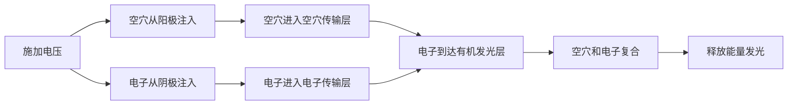
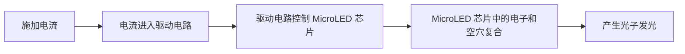
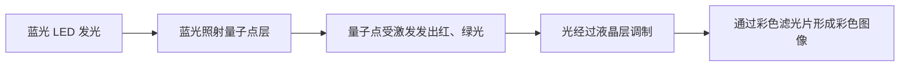
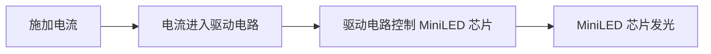

# 价值投资中的新一代显示技术趋势

> 关键词：价值投资、新一代显示技术、趋势、OLED、MicroLED、量子点显示、MiniLED

> 摘要：本文围绕价值投资视角下的新一代显示技术趋势展开探讨。首先介绍了相关背景知识，包括目的范围、预期读者等。接着阐述了新一代显示技术的核心概念与联系，剖析了各类显示技术的原理与架构。详细讲解了核心算法原理及具体操作步骤，并给出数学模型和公式进行说明。通过项目实战案例展示了显示技术的代码实现与分析。探讨了新一代显示技术的实际应用场景，推荐了相关学习资源、开发工具框架以及论文著作。最后总结了未来发展趋势与挑战，还包含常见问题解答及参考资料，旨在为价值投资者和相关从业者全面了解新一代显示技术的投资价值与发展方向提供参考。

## 1. 背景介绍 
### 1.1 目的和范围
本文章的目的在于深入分析价值投资领域中新一代显示技术的发展趋势，为投资者提供专业、全面的技术和市场信息，助力其做出明智的投资决策。范围涵盖了当前主流的新一代显示技术，如 OLED（有机发光二极管）、MicroLED（微发光二极管）、量子点显示、MiniLED 等，研究这些技术的原理、市场现状、应用场景以及未来发展潜力。

### 1.2 预期读者
预期读者主要包括对价值投资有兴趣的投资者，无论是个人投资者还是机构投资者，希望通过了解新一代显示技术趋势寻找投资机会。同时也适用于显示技术领域的从业者，如研发人员、工程师、市场分析师等，帮助他们更好地把握行业动态和技术发展方向。此外，相关专业的学生和研究人员也可以从本文中获取有价值的知识和信息。

### 1.3 文档结构概述
本文首先在背景介绍部分明确目的、读者群体和文档结构，接着阐述新一代显示技术的核心概念与联系，让读者了解不同技术的特点和相互关系。然后深入讲解核心算法原理和具体操作步骤，通过数学模型和公式进一步解释技术原理。通过项目实战案例展示代码实现和分析，使读者对技术应用有更直观的认识。探讨实际应用场景，了解技术的市场需求。推荐相关工具和资源，方便读者深入学习和研究。最后总结未来发展趋势与挑战，提供常见问题解答和参考资料，形成一个完整的知识体系。

### 1.4 术语表
#### 1.4.1 核心术语定义
- **价值投资**：一种基于对资产内在价值的评估，通过分析公司的基本面、财务状况、行业前景等因素，寻找被低估的投资标的，以实现长期投资回报的投资策略。
- **OLED（有机发光二极管）**：一种利用有机材料在电场作用下发光的显示技术，具有自发光、对比度高、视角广、响应速度快等优点。
- **MicroLED（微发光二极管）**：由微米级的发光二极管组成的显示技术，具有高亮度、高对比度、低功耗、长寿命等优势，被认为是下一代显示技术的重要发展方向。
- **量子点显示**：利用量子点材料的特性实现的显示技术，能够提供更准确的色彩表现和更高的色域，提升显示质量。
- **MiniLED**：介于传统 LED 和 MicroLED 之间的技术，尺寸比传统 LED 小，比 MicroLED 大，具有更高的亮度和对比度，可用于背光或自发光显示。

#### 1.4.2 相关概念解释
- **自发光技术**：指显示器件自身能够发光，不需要背光源，如 OLED 和 MicroLED。自发光技术可以实现更高的对比度和更薄的显示屏。
- **对比度**：指显示屏上最亮的白色和最暗的黑色之间的亮度比值，对比度越高，图像的亮部更亮，暗部更暗，图像的层次感和细节表现更好。
- **色域**：指显示设备能够显示的颜色范围，色域越广，能够呈现的颜色越丰富、越鲜艳。

#### 1.4.3 缩略词列表
- **OLED**：Organic Light - Emitting Diode（有机发光二极管）
- **MicroLED**：Micro - Light - Emitting Diode（微发光二极管）
- **LED**：Light - Emitting Diode（发光二极管）

## 2. 核心概念与联系 

### 2.1 OLED 技术原理与架构
OLED 是基于有机材料的电致发光现象实现显示的。其基本结构由阳极、有机发光层、电子传输层、空穴传输层和阴极组成。当在阳极和阴极之间施加电压时，空穴从阳极注入到空穴传输层，电子从阴极注入到电子传输层，空穴和电子在有机发光层相遇并复合，释放出能量，以光的形式发射出来，从而实现发光显示。

文本示意图：
阳极 - 空穴传输层 - 有机发光层 - 电子传输层 - 阴极

Mermaid 流程图：


### 2.2 MicroLED 技术原理与架构
MicroLED 是将微小的发光二极管阵列直接集成到驱动电路上。每个 MicroLED 像素都可以独立控制发光，其原理是通过电流驱动半导体材料中的电子和空穴复合，产生光子，实现发光。MicroLED 的架构包括衬底、驱动电路、MicroLED 芯片阵列等部分。

文本示意图：
衬底 - 驱动电路 - MicroLED 芯片阵列

Mermaid 流程图：


### 2.3 量子点显示技术原理与架构
量子点显示技术是在传统液晶显示（LCD）的基础上，通过添加量子点材料来改善显示性能。量子点是一种纳米级的半导体晶体，当受到光或电的激发时，会发出特定波长的光。在量子点显示中，通常采用蓝光 LED 作为背光源，蓝光激发量子点材料，使其发出红、绿等颜色的光，通过彩色滤光片形成彩色图像。

文本示意图：
蓝光 LED 背光源 - 量子点层 - 液晶层 - 彩色滤光片

Mermaid 流程图：


### 2.4 MiniLED 技术原理与架构
MiniLED 是对传统 LED 的尺寸进行缩小，其原理与传统 LED 类似，都是通过电流驱动半导体材料发光。MiniLED 可以用于背光模组，通过局部调光技术提高显示的对比度和亮度均匀性；也可以用于自发光显示，形成类似 MicroLED 的显示效果。其架构主要包括 MiniLED 芯片、驱动电路、散热结构等。

文本示意图：
MiniLED 芯片 - 驱动电路 - 散热结构

Mermaid 流程图：


### 2.5 技术联系
OLED、MicroLED、量子点显示和 MiniLED 都是为了满足更高的显示需求而发展起来的技术。OLED 和 MicroLED 属于自发光技术，具有较高的对比度和响应速度；量子点显示是对 LCD 技术的升级，通过量子点材料提高了色域和色彩准确性；MiniLED 可以作为背光源提升 LCD 的性能，也可以向自发光显示方向发展，与 MicroLED 有一定的技术关联。这些技术相互竞争又相互补充，共同推动显示技术的发展。

## 3. 核心算法原理 & 具体操作步骤 

### 3.1 OLED 亮度控制算法
在 OLED 显示中，亮度控制是一个重要的环节。一种常见的亮度控制算法是基于脉冲宽度调制（PWM）的方法。PWM 通过控制脉冲信号的占空比来调节 OLED 的平均亮度。

Python 源代码实现：
```python
import time

# 模拟 OLED 亮度控制
def oled_brightness_control(brightness):
    # 假设最大占空比为 100
    max_duty_cycle = 100
    # 根据亮度值计算占空比
    duty_cycle = int((brightness / 100) * max_duty_cycle)
    print(f"当前亮度: {brightness}%, 占空比: {duty_cycle}")
    # 模拟 OLED 显示过程
    for _ in range(10):
        if duty_cycle > 0:
            print("OLED 发光")
        else:
            print("OLED 熄灭")
        time.sleep(0.1)

# 测试不同亮度
brightness_values = [20, 50, 80]
for brightness in brightness_values:
    oled_brightness_control(brightness)
```
具体操作步骤：
1. 定义最大占空比，这里假设为 100。
2. 根据输入的亮度值计算对应的占空比。
3. 模拟 OLED 显示过程，根据占空比判断 OLED 是否发光。
4. 可以通过改变输入的亮度值来测试不同亮度下的显示效果。

### 3.2 MicroLED 像素驱动算法
MicroLED 像素驱动需要精确控制每个像素的发光强度。一种简单的像素驱动算法是基于恒流源驱动的方法。通过恒流源为每个 MicroLED 像素提供稳定的电流，从而实现对像素亮度的精确控制。

Python 源代码实现：
```python
# 模拟 MicroLED 像素驱动
class MicroLEDPixel:
    def __init__(self):
        self.current = 0

    def set_current(self, current):
        self.current = current
        print(f"设置 MicroLED 像素电流: {current} mA")

    def get_brightness(self):
        # 假设亮度与电流成正比
        brightness = self.current * 10
        return brightness

# 测试 MicroLED 像素驱动
pixel = MicroLEDPixel()
current_values = [1, 2, 3]
for current in current_values:
    pixel.set_current(current)
    brightness = pixel.get_brightness()
    print(f"当前 MicroLED 像素亮度: {brightness}")
```
具体操作步骤：
1. 定义一个 MicroLED 像素类，包含电流属性和设置电流的方法。
2. 实现一个获取亮度的方法，假设亮度与电流成正比。
3. 测试不同电流值下的像素亮度，通过设置电流值并获取对应的亮度。

### 3.3 量子点显示色彩校正算法
量子点显示中，为了保证色彩的准确性，需要进行色彩校正。一种常见的色彩校正算法是基于查找表（LUT）的方法。通过预先测量和计算不同输入颜色对应的准确输出颜色，建立一个查找表，在显示过程中根据输入颜色查找对应的输出颜色进行校正。

Python 源代码实现：
```python
# 模拟量子点显示色彩校正
def color_correction(input_color):
    # 简单的查找表示例
    lut = {
        (255, 0, 0): (250, 5, 5),
        (0, 255, 0): (5, 250, 5),
        (0, 0, 255): (5, 5, 250)
    }
    if input_color in lut:
        output_color = lut[input_color]
    else:
        output_color = input_color
    print(f"输入颜色: {input_color}, 校正后颜色: {output_color}")
    return output_color

# 测试色彩校正
input_colors = [(255, 0, 0), (0, 255, 0), (0, 0, 255), (100, 100, 100)]
for color in input_colors:
    color_correction(color)
```
具体操作步骤：
1. 定义一个查找表，包含一些常见输入颜色对应的校正后颜色。
2. 根据输入颜色在查找表中查找对应的校正后颜色，如果找不到则保持输入颜色不变。
3. 输出校正后的颜色，完成色彩校正过程。

### 3.4 MiniLED 局部调光算法
MiniLED 用于背光模组时，局部调光算法可以提高显示的对比度。一种简单的局部调光算法是基于区域划分的方法。将显示屏划分为多个区域，根据每个区域的图像亮度信息调整对应的 MiniLED 背光源亮度。

Python 源代码实现：
```python
# 模拟 MiniLED 局部调光
def local_dimming(image, num_regions):
    # 假设图像是一个二维数组
    height, width = len(image), len(image[0])
    region_height = height // num_regions
    region_width = width // num_regions
    for i in range(num_regions):
        for j in range(num_regions):
            # 计算区域的亮度平均值
            region_brightness = 0
            for y in range(i * region_height, (i + 1) * region_height):
                for x in range(j * region_width, (j + 1) * region_width):
                    region_brightness += image[y][x]
            region_brightness = region_brightness / (region_height * region_width)
            # 根据区域亮度调整 MiniLED 背光源亮度
            if region_brightness < 50:
                backlight_brightness = 20
            elif region_brightness < 150:
                backlight_brightness = 50
            else:
                backlight_brightness = 80
            print(f"区域 ({i}, {j}) 亮度: {region_brightness}, MiniLED 背光源亮度: {backlight_brightness}")
    return image

# 测试局部调光
image = [[100] * 10 for _ in range(10)]
local_dimming(image, 2)
```
具体操作步骤：
1. 将图像划分为多个区域，计算每个区域的亮度平均值。
2. 根据区域亮度平均值将 MiniLED 背光源亮度分为几个等级。
3. 输出每个区域的亮度和对应的 MiniLED 背光源亮度，完成局部调光过程。

## 4. 数学模型和公式 & 详细讲解 & 举例说明 

### 4.1 OLED 亮度与电流关系模型
OLED 的亮度 $L$ 与电流密度 $J$ 之间存在一定的关系，通常可以用以下公式表示：
$$L = kJ^{\alpha}$$
其中，$k$ 是一个与 OLED 材料和结构有关的常数，$\alpha$ 是一个指数，一般在 1 到 2 之间。

详细讲解：这个公式描述了 OLED 亮度与电流密度的非线性关系。当电流密度增加时，亮度也会增加，但增加的速度会随着 $\alpha$ 的值而变化。如果 $\alpha$ 接近 1，亮度与电流密度近似成正比；如果 $\alpha$ 接近 2，亮度与电流密度的平方成正比。

举例说明：假设 $k = 10$，$\alpha = 1.5$，当电流密度 $J = 10$ 时，亮度 $L = 10\times10^{1.5}\approx316.23$。当电流密度增加到 $J = 20$ 时，亮度 $L = 10\times20^{1.5}\approx894.43$，可以看到亮度的增加不是简单的线性关系。

### 4.2 MicroLED 光通量与电流关系模型
MicroLED 的光通量 $\Phi$ 与电流 $I$ 之间的关系可以用以下公式表示：
$$\Phi = \eta I$$
其中，$\eta$ 是 MicroLED 的发光效率，单位为流明每安培（lm/A）。

详细讲解：这个公式表明 MicroLED 的光通量与电流成正比，发光效率 $\eta$ 表示单位电流下 MicroLED 发出的光通量。不同的 MicroLED 材料和结构具有不同的发光效率。

举例说明：假设一个 MicroLED 的发光效率 $\eta = 50$ lm/A，当电流 $I = 2$ mA 时，光通量 $\Phi = 50\times0.002 = 0.1$ lm。当电流增加到 $I = 3$ mA 时，光通量 $\Phi = 50\times0.003 = 0.15$ lm。

### 4.3 量子点显示色域覆盖率模型
量子点显示的色域覆盖率 $C$ 可以用以下公式表示：
$$C=\frac{A_{QD}}{A_{BT - 2020}}\times100\%$$
其中，$A_{QD}$ 是量子点显示的色域面积，$A_{BT - 2020}$ 是国际电信联盟（ITU）定义的 BT - 2020 标准色域面积。

详细讲解：色域覆盖率表示量子点显示能够覆盖的颜色范围相对于 BT - 2020 标准色域的比例。色域覆盖率越高，说明量子点显示能够呈现的颜色越丰富、越接近真实世界的颜色。

举例说明：假设量子点显示的色域面积 $A_{QD}=0.8\times A_{BT - 2020}$，则色域覆盖率 $C=\frac{0.8\times A_{BT - 2020}}{A_{BT - 2020}}\times100\% = 80\%$。

### 4.4 MiniLED 局部调光对比度提升模型
MiniLED 局部调光可以提升显示的对比度。对比度 $CR$ 可以用以下公式表示：
$$CR=\frac{L_{max}}{L_{min}}$$
其中，$L_{max}$ 是显示区域的最大亮度，$L_{min}$ 是显示区域的最小亮度。

在局部调光的情况下，通过降低暗区域的背光源亮度，可以减小 $L_{min}$，从而提高对比度。

详细讲解：对比度是衡量显示质量的重要指标之一，对比度越高，图像的亮部更亮，暗部更暗，图像的层次感和细节表现更好。MiniLED 局部调光通过精确控制背光源亮度，能够有效提高对比度。

举例说明：在没有局部调光的情况下，$L_{max}=500$ cd/m²，$L_{min}=5$ cd/m²，对比度 $CR=\frac{500}{5}=100$。采用局部调光后，$L_{min}$ 降低到 $1$ cd/m²，对比度 $CR=\frac{500}{1}=500$，对比度得到了显著提升。

## 5. 项目实战：代码实际案例和详细解释说明 

### 5.1  开发环境搭建
本次项目实战以模拟显示技术控制为例，开发环境主要基于 Python 语言。具体搭建步骤如下：
1. **安装 Python**：从 Python 官方网站（https://www.python.org/downloads/）下载并安装适合自己操作系统的 Python 版本，建议安装 Python 3.7 及以上版本。
2. **安装开发工具**：可以选择 PyCharm、VS Code 等集成开发环境（IDE）。以 PyCharm 为例，从 JetBrains 官方网站（https://www.jetbrains.com/pycharm/download/）下载并安装社区版或专业版。
3. **创建虚拟环境**：在命令行中使用以下命令创建虚拟环境：
```bash
python -m venv display_project_env
```
4. **激活虚拟环境**：在 Windows 系统中，使用以下命令激活虚拟环境：
```bash
display_project_env\Scripts\activate
```
在 Linux 或 macOS 系统中，使用以下命令激活虚拟环境：
```bash
source display_project_env/bin/activate
```
5. **安装必要的库**：本项目主要使用 Python 内置库，无需额外安装第三方库。

### 5.2  源代码详细实现和代码解读
以下是一个综合模拟 OLED、MicroLED、量子点显示和 MiniLED 控制的代码示例：
```python
import time

# 模拟 OLED 亮度控制
class OLED:
    def __init__(self):
        self.brightness = 0

    def set_brightness(self, brightness):
        self.brightness = brightness
        print(f"设置 OLED 亮度: {brightness}%")
        # 模拟 OLED 显示过程
        for _ in range(10):
            if brightness > 0:
                print("OLED 发光")
            else:
                print("OLED 熄灭")
            time.sleep(0.1)

# 模拟 MicroLED 像素驱动
class MicroLED:
    def __init__(self):
        self.current = 0

    def set_current(self, current):
        self.current = current
        print(f"设置 MicroLED 像素电流: {current} mA")
        # 假设亮度与电流成正比
        brightness = self.current * 10
        print(f"当前 MicroLED 像素亮度: {brightness}")

# 模拟量子点显示色彩校正
class QuantumDotDisplay:
    def __init__(self):
        self.lut = {
            (255, 0, 0): (250, 5, 5),
            (0, 255, 0): (5, 250, 5),
            (0, 0, 255): (5, 5, 250)
        }

    def color_correction(self, input_color):
        if input_color in self.lut:
            output_color = self.lut[input_color]
        else:
            output_color = input_color
        print(f"输入颜色: {input_color}, 校正后颜色: {output_color}")
        return output_color

# 模拟 MiniLED 局部调光
class MiniLEDBacklight:
    def __init__(self):
        self.image = [[100] * 10 for _ in range(10)]
        self.num_regions = 2

    def local_dimming(self):
        height, width = len(self.image), len(self.image[0])
        region_height = height // self.num_regions
        region_width = width // self.num_regions
        for i in range(self.num_regions):
            for j in range(self.num_regions):
                # 计算区域的亮度平均值
                region_brightness = 0
                for y in range(i * region_height, (i + 1) * region_height):
                    for x in range(j * region_width, (j + 1) * region_width):
                        region_brightness += self.image[y][x]
                region_brightness = region_brightness / (region_height * region_width)
                # 根据区域亮度调整 MiniLED 背光源亮度
                if region_brightness < 50:
                    backlight_brightness = 20
                elif region_brightness < 150:
                    backlight_brightness = 50
                else:
                    backlight_brightness = 80
                print(f"区域 ({i}, {j}) 亮度: {region_brightness}, MiniLED 背光源亮度: {backlight_brightness}")
        return self.image

# 测试代码
if __name__ == "__main__":
    # 测试 OLED
    oled = OLED()
    oled.set_brightness(50)

    # 测试 MicroLED
    microled = MicroLED()
    microled.set_current(2)

    # 测试量子点显示
    qd_display = QuantumDotDisplay()
    input_color = (255, 0, 0)
    qd_display.color_correction(input_color)

    # 测试 MiniLED 局部调光
    mini_led_backlight = MiniLEDBacklight()
    mini_led_backlight.local_dimming()
```
### 5.3  代码解读与分析
1. **OLED 类**：
    - `__init__` 方法：初始化 OLED 的亮度为 0。
    - `set_brightness` 方法：设置 OLED 的亮度，并模拟 OLED 的显示过程，根据亮度值判断 OLED 是否发光。
2. **MicroLED 类**：
    - `__init__` 方法：初始化 MicroLED 的电流为 0。
    - `set_current` 方法：设置 MicroLED 的电流，并根据电流计算像素亮度。
3. **QuantumDotDisplay 类**：
    - `__init__` 方法：初始化查找表，用于色彩校正。
    - `color_correction` 方法：根据输入颜色在查找表中查找对应的校正后颜色，如果找不到则保持输入颜色不变。
4. **MiniLEDBacklight 类**：
    - `__init__` 方法：初始化图像和区域数量。
    - `local_dimming` 方法：将图像划分为多个区域，计算每个区域的亮度平均值，根据区域亮度调整 MiniLED 背光源亮度。
5. **主程序**：创建各个类的实例，调用相应的方法进行测试，验证不同显示技术的控制功能。

通过这个代码示例，我们可以更直观地理解不同显示技术的控制原理和实现方式。

## 6. 实际应用场景 
### 6.1 消费电子领域
- **智能手机**：OLED 技术在智能手机中得到了广泛应用，如三星、苹果等品牌的高端机型都采用了 OLED 屏幕。OLED 屏幕具有自发光、对比度高、视角广等优点，能够提供更好的视觉体验。MicroLED 技术也在逐渐向智能手机领域渗透，其高亮度、低功耗等特性有望进一步提升智能手机的显示性能。
- **电视**：量子点显示和 MiniLED 技术在电视领域具有很大的应用潜力。量子点显示能够提供更准确的色彩表现和更高的色域，提升电视的画面质量。MiniLED 作为背光源可以实现局部调光，提高电视的对比度和亮度均匀性。OLED 电视也凭借其出色的显示效果在高端市场占据一定份额。
- **平板电脑和笔记本电脑**：OLED 屏幕在平板电脑和笔记本电脑中的应用逐渐增加，为用户带来更清晰、鲜艳的图像显示。同时，量子点显示和 MiniLED 技术也在不断发展，有望为这些设备提供更好的显示解决方案。

### 6.2 汽车电子领域
- **仪表盘**：MicroLED 和 OLED 技术可以用于汽车仪表盘的显示。MicroLED 具有高亮度、长寿命等优点，能够在各种光照条件下提供清晰的显示效果。OLED 屏幕则可以实现柔性显示，为汽车内饰设计提供更多的可能性。
- **中控显示屏**：量子点显示和 MiniLED 技术可以提升汽车中控显示屏的色彩表现和对比度，使驾驶员能够更清晰地查看信息。同时，大尺寸的 OLED 中控显示屏也在一些高端车型中得到应用，提升了汽车的科技感和豪华感。

### 6.3 虚拟现实（VR）和增强现实（AR）领域
- **VR 头显**：OLED 技术是目前 VR 头显中常用的显示技术，其高刷新率和低延迟特性能够有效减少画面的拖影和眩晕感，提供更沉浸的虚拟现实体验。MicroLED 技术的发展也为 VR 头显带来了更高亮度和更高分辨率的显示可能。
- **AR 眼镜**：MicroLED 技术由于其尺寸小、功耗低等优点，被认为是 AR 眼镜显示的理想选择。MicroLED 可以实现高亮度的近眼显示，使 AR 眼镜能够在不同的环境光条件下正常工作。

### 6.4 商业显示领域
- **数字 signage**：MiniLED 和 MicroLED 技术可以用于大型数字 signage的显示。这些技术具有高亮度、高对比度等优点，能够在户外等强光环境下提供清晰、鲜艳的图像显示。量子点显示技术也可以提升数字 signage 的色彩表现，吸引更多的观众注意力。
- **会议室显示**：OLED 和量子点显示技术可以用于会议室的大屏幕显示，提供高清晰度、高色彩准确性的图像和视频显示，提升会议的效果和效率。

## 7. 工具和资源推荐
### 7.1 学习资源推荐
#### 7.1.1 书籍推荐
- 《显示技术原理与应用》：全面介绍了各种显示技术的原理、发展历程和应用领域，适合初学者系统学习显示技术知识。
- 《有机发光二极管（OLED）技术》：深入探讨了 OLED 技术的原理、材料、器件结构和制备工艺等方面的内容，对于想深入了解 OLED 技术的读者具有重要参考价值。
- 《量子点材料与器件》：详细介绍了量子点材料的特性、制备方法以及在显示等领域的应用，是学习量子点显示技术的重要参考书籍。

#### 7.1.2 在线课程
- Coursera 平台上的“显示技术基础”课程：由知名高校的教授授课，系统讲解显示技术的基本原理和发展趋势。
- edX 平台上的“有机电子学与 OLED 技术”课程：专注于 OLED 技术的深入学习，包括材料科学、器件物理等方面的内容。
- 中国大学 MOOC 平台上的“半导体光电器件”课程：涵盖了 LED、MicroLED 等半导体光电器件的相关知识，对于理解显示技术的原理有很大帮助。

#### 7.1.3 技术博客和网站
- Display Daily：提供最新的显示技术新闻、市场分析和技术趋势等内容，是了解显示技术行业动态的重要渠道。
- OLED - Info：专注于 OLED 技术的专业网站，包含 OLED 技术的最新研究成果、产品信息和市场动态等。
- LEDinside：提供 LED、MiniLED、MicroLED 等相关技术的新闻、报告和分析，对于关注这些技术的读者具有重要参考价值。

### 7.2 开发工具框架推荐
#### 7.2.1 IDE和编辑器
- PyCharm：一款专业的 Python 集成开发环境，具有代码自动补全、调试、版本控制等功能，适合 Python 开发。
- Visual Studio Code：一款轻量级的代码编辑器，支持多种编程语言，通过安装相关插件可以实现丰富的功能，如代码高亮、调试等。

#### 7.2.2 调试和性能分析工具
- Python 内置的调试器：可以使用 Python 内置的 `pdb` 模块进行代码调试，帮助开发者定位和解决问题。
- cProfile：Python 内置的性能分析工具，可以分析代码的执行时间和函数调用关系，帮助开发者优化代码性能。

#### 7.2.3 相关框架和库
- NumPy：一个用于科学计算的 Python 库，提供了高效的数组操作和数学函数，可用于处理显示技术中的图像数据。
- OpenCV：一个开源的计算机视觉库，可用于图像和视频处理，在显示技术的开发中可以用于图像的预处理、分析等操作。

### 7.3 相关论文著作推荐
#### 7.3.1 经典论文
- “High - efficiency organic light - emitting devices with fluorescent emitters”：该论文介绍了高效有机发光器件的原理和实现方法，对于理解 OLED 技术的发展具有重要意义。
- “Micro - LED display technology: a review”：全面综述了 MicroLED 显示技术的发展现状、技术挑战和应用前景，是研究 MicroLED 技术的经典文献。
- “Quantum dot - enhanced liquid crystal displays”：探讨了量子点增强液晶显示的原理和优势，为量子点显示技术的发展提供了理论基础。

#### 7.3.2 最新研究成果
- 可以通过 IEEE Xplore、ACM Digital Library 等学术数据库搜索最新的显示技术研究论文，了解该领域的前沿动态和研究成果。
- 关注国际显示周（SID Display Week）等行业会议的论文集，获取最新的显示技术研究进展。

#### 7.3.3 应用案例分析
- 分析苹果、三星等公司在显示技术领域的专利和产品应用案例，了解这些公司在显示技术研发和应用方面的策略和成果。
- 研究一些新兴显示技术企业的发展案例，如柔宇科技在柔性显示技术方面的应用，从中获取启示和经验。

## 8. 总结：未来发展趋势与挑战
### 8.1 未来发展趋势
- **更高的显示性能**：新一代显示技术将不断追求更高的亮度、对比度、色域和分辨率，以提供更逼真、更清晰的图像显示效果。例如，MicroLED 技术有望实现超高亮度和超高分辨率的显示，满足大型显示和虚拟现实等领域的需求。
- **柔性和可穿戴显示**：随着材料科学和制造工艺的不断进步，柔性和可穿戴显示将成为未来的重要发展方向。OLED 技术已经在柔性显示领域取得了一定的进展，未来有望实现更多形式的柔性显示产品，如可折叠手机、智能手表等。
- **集成化和智能化**：显示技术将与其他技术如传感器、人工智能等进行深度融合，实现集成化和智能化的显示系统。例如，具有环境感知功能的智能显示设备可以根据环境光线和用户需求自动调整显示参数。
- **绿色环保**：未来的显示技术将更加注重绿色环保，采用低功耗、可回收的材料和制造工艺，减少对环境的影响。例如，量子点显示技术采用的量子点材料具有较高的发光效率，能够降低功耗。

### 8.2 挑战
- **技术难题**：新一代显示技术如 MicroLED 还面临着许多技术难题，如巨量转移技术、芯片良率等问题。这些技术难题需要大量的研发投入和时间来解决。
- **成本问题**：目前一些新一代显示技术的制造成本较高，限制了其大规模应用。例如，OLED 屏幕的制造成本相对较高，导致其产品价格也较高。降低成本是推广新一代显示技术的关键。
- **市场竞争**：显示技术市场竞争激烈，各大厂商纷纷投入研发和生产，争夺市场份额。新的显示技术需要在市场竞争中脱颖而出，需要具备独特的优势和竞争力。
- **标准和规范**：随着显示技术的不断发展，需要建立相应的标准和规范来保证产品的质量和兼容性。目前显示技术领域的标准和规范还不够完善，需要进一步加强。

## 9. 附录：常见问题与解答
### 9.1 新一代显示技术与传统显示技术相比有哪些优势？
新一代显示技术如 OLED、MicroLED、量子点显示和 MiniLED 相比传统的液晶显示（LCD）具有更高的对比度、更广的视角、更快的响应速度、更准确的色彩表现等优势。同时，一些新一代显示技术还具有自发光、柔性显示等特点，能够满足不同应用场景的需求。

### 9.2 MicroLED 技术的发展前景如何？
MicroLED 技术具有高亮度、高对比度、低功耗、长寿命等优点，被认为是下一代显示技术的重要发展方向。虽然目前 MicroLED 技术还面临着一些技术难题，如巨量转移技术、芯片良率等，但随着技术的不断进步和研发投入的增加，MicroLED 技术有望在未来实现大规模应用，如在电视、智能手机、虚拟现实等领域。

### 9.3 量子点显示技术会取代 OLED 技术吗？
量子点显示技术和 OLED 技术各有优缺点，它们将在不同的市场领域和应用场景中发挥各自的优势。量子点显示技术在色彩表现和成本方面具有一定的优势，而 OLED 技术在自发光、柔性显示等方面具有独特的优势。因此，量子点显示技术不太可能完全取代 OLED 技术，而是会与 OLED 技术相互竞争、相互补充。

### 9.4 如何选择适合的显示技术进行投资？
选择适合的显示技术进行投资需要综合考虑技术的发展前景、市场需求、竞争态势、成本等因素。投资者可以关注技术的研发进展和应用案例，了解市场的发展趋势和需求变化，同时评估不同显示技术的竞争力和投资风险。此外，还可以参考专业机构的研究报告和行业专家的意见。

## 10. 扩展阅读 & 参考资料
- 《显示技术产业发展白皮书》
- 各显示技术企业的官方网站和年报
- 相关学术期刊如《Journal of Display Technology》《Optics Express》等发表的论文
- 行业研究机构如 IDC、IHS Markit 等发布的市场研究报告